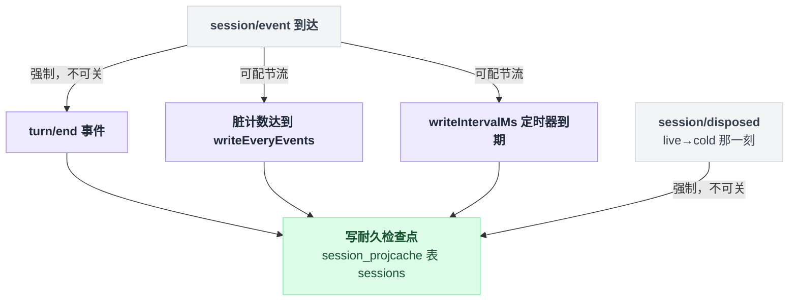
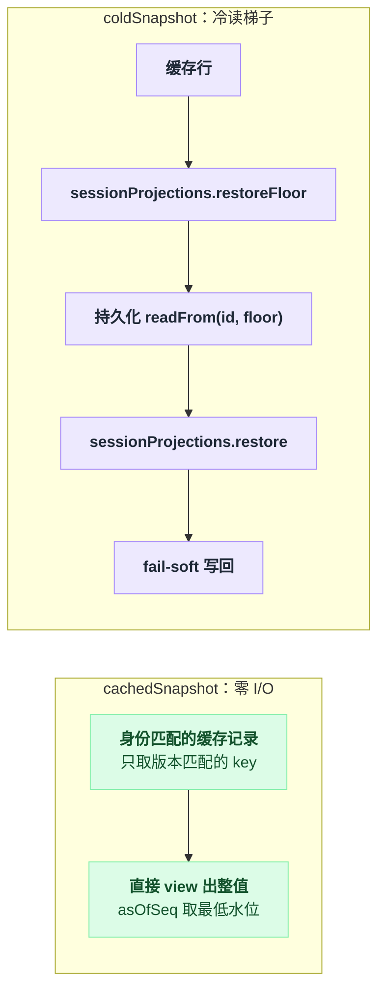

# session-projection-cache

> `@deepseek-ai/dsh-session-projection-cache` · bundle：`web-app` · 配置树 id：`session-projection-cache` · v0.1.0-rc.5（commit `47f9438`）2026-08-14 核对

**一句话**：给 [session-projection](./dsh-session-projection.md) 的投影值做耐久检查点（`ctx.sessionProjectionCache`），一个会话一条记录，让会话列表能零 I/O 读到投影值、冷读会话不必整份加载日志。

## 它在树上长什么样

`packages/bundle/web-app/cordis.patch.yml:76`：

```yaml
- id: session-projection-cache
  name: '@deepseek-ai/dsh-session-projection-cache'
  config:
    writeEveryEvents: 200
    writeIntervalMs: 5000
```

**只在 web-app bundle 里**，base 和 headless 都没有这一行。两个字段都**必填无默认**（`src/index.ts:49`–`52` 里两个 `.required()`）：刷写节奏是部署选择，没有普适正确值，所以由组合层显式写出（`packages/session/session-projection-cache/README.md:26`）。

## 它注册了什么

| 类型 | 名字 | 说明 |
|---|---|---|
| service | `ctx.sessionProjectionCache`（`SessionProjectionCache`） | `src/index.ts:71`、`80`；`static inject = ['storageDomain', 'sessionProjections', 'sessionPersistence', 'sessions']`（`src/index.ts:72`） |
| storage domain | `session_projcache`，表 `sessions` | 在 `Service.init` 里 open（`src/index.ts:84`–`87`，spec 在 `src/spec.ts:66`–`70`）；shipped 的 json 后端落到 `<root>/session_projcache.json`，和 `workspace.json` 并列（`src/spec.ts:6`–`8`），web-app 的 root 是 `dshHomePath('storages')`（`cordis.patch.yml:57`） |
| 事件监听 | `session/event`（**emit**） | `turn/end` 直接强制写；否则累加脏计数，撞 `writeEveryEvents` 立即写，否则起一个 `writeIntervalMs` 定时器（`src/index.ts:205`–`220`） |
| 事件监听 | `session/disposed`（**emit**） | 第二个强制写点（live→cold 的那一刻），写完清脏状态（`src/index.ts:226`–`230`） |

两个事件的派发模式见 `docs/event-producer-consumer.md:42`–`43`。不注册工具、命令、prompt 段。

## 配置项

| 字段 | 类型 | 默认值 | 作用 |
|---|---|---|---|
| `writeEveryEvents` | `number`（自然数，≥1） | 无默认，web-app 给 `200` | 两个强制写点之间，每会话提交多少条事件就强制一次耐久检查点 |
| `writeIntervalMs` | `number`（自然数，≥1） | 无默认，web-app 给 `5000` | 一个脏检查点最长能不写多久（毫秒） |

写策略共四个触发点（`README.md:19`–`24`）：`turn/end`（强制，冷读最想要的就是回合终值）、会话摘离（强制）、计数阈值（可配节流）、间隔阈值（可配节流）。前两个是**策略不是旋钮**，永远会触发。

四个触发点收拢到同一次写盘动作：



## 四条不可动摇的性质

- **一行缓存是折叠捷径，永远不是权威**：可能陈旧（`seq` 精确说明陈旧多少），但绝不会错（`README.md:7`）。
- **`ver` 与活单元的 `stateVersion` 不匹配就丢弃、绝不迁移**，该 key 从日志重折（`README.md:10`）。
- **日志领先，缓存跟随**：`write()` 先取注册表切面，再 `ctx.sessions.flush(session)`，最后才落缓存行（`src/index.ts:141`–`151`）。所以崩溃可能让缓存落后于日志（多重放一段尾巴），但绝不会领先（凭空折出没有日志支撑的值）。
- **记录绑定日志生命周期而非仅 id**：每条记录存下它折自的 header 身份（`createdAt`、`cwd`），读时校验；删了又重建的同名 id、或在缓存存活期间被换掉的持久化 store，都会让整条记录被丢弃（`src/spec.ts:30`–`42`、`src/index.ts:291`–`298`）。

所有后台写都是 fail-soft：失败只打一条 warning、缓存保持陈旧，下一次写或冷读自愈（`src/index.ts:246`–`252`）。

## 两条读路径

- `cachedSnapshot(meta)`（`src/index.ts:119`）——**零 I/O 那一级**：直接从身份匹配的记录里 view 出整值（只取版本匹配的 key），`asOfSeq` 取所供给行里**最低**的水位（`src/index.ts:128`），这样客户端按 higher-seq-wins 播种时，陈旧的列表块永远盖不掉更新的 push 帧。没有可用记录就返回 `undefined`。
- `coldSnapshot(id, signal?)`（`src/index.ts:166`）——冷读梯子，顺路是零全量日志加载：缓存行 → `sessionProjections.restoreFloor` → 持久化 `readFrom(id, floor)` → `sessionProjections.restore` → fail-soft 写回。地板锚在最低可用水位下方一条（`packages/session/session-projection/src/index.ts:309`），使得"日志被崩溃修复截短"变得可证：越界的行会触发**恰好一次**从 seq 0 的全量重读，而不是供出幽灵值（`src/index.ts:184`–`194`）。没有持久化日志的会话按 seam 的 `not found` 拒绝。

两条路径一个零 I/O、一个走完整的冷读梯子，并排看更清楚谁快谁慢：



## 模型看得见什么

**什么都看不见。** README 原文：`None, as the cache only persists and restores host-side read models of already-logged session state and touches no prompt, message, schema, stream, or tool result.`（`README.md:52`）KV Cache 同为 None。

## 什么时候你会想换掉它 / 怎么换

没有替代实现。可做的是三件事：

1. **加到别的 profile 上**——base/headless 没有这一行。往 profile 的 `cordis.patch.yml` 加行只有 `insert` 一条路（`vendor/include/src/index.ts:80`–`95`）；顶层裸写 `- id: … name: …` 会被当成针对既有行的 patch，报 `patch: entry not found` 后跳过（同文件 `:110`–`113`）。所以要这么写：

```yaml
- insert:
    - id: session-projection-cache
      name: '@deepseek-ai/dsh-session-projection-cache'
      config:
        writeEveryEvents: 200
        writeIntervalMs: 5000
```

   注意它硬性 inject `storageDomain`，而 `storage` / `storage-json` / `storage-domain` 三行同样只在 web-app（`packages/bundle/web-app/cordis.patch.yml:51`–`62`），得一起补。
2. **调节流**：会话很长又想让列表更新，就调小 `writeEveryEvents`；写盘吃紧就调大两者。两个强制写点不受影响。
3. **禁用它**（`disabled: true`）：投影系统退化成 live-only（水位缓存），冷读只能回落到 carrier 各自实现的全量日志加载（`README.md:48`）。

## 坑与边界

来自 `README.md:58`–`62`：

- **没有淘汰或保留策略**：记录按会话累积，清理属于带外运维，和会话持久化本身同一立场。
- **间隔节流是每会话的粗粒度**：定时器在一次干净写之后的第一条脏事件时装上，稳定的低于阈值的涓流是"每个间隔写一次"，不是滑动窗口。
- **`coldSnapshot` 不去重**：同一会话的两个并发冷读各跑一遍梯子，最后写回者胜（行等价），在列表级调用频率下可接受。

读源码补充：定时器随插件卸载一起清理，因为它们的会话可能比缓存活得久（`src/index.ts:233`–`238`）。
