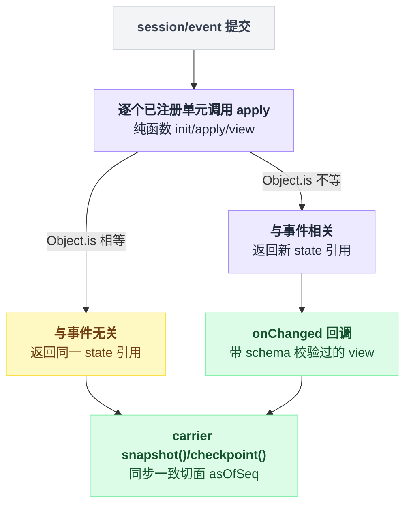

# session-projection

> `@deepseek-ai/dsh-session-projection` · bundle：`base` · 配置树 id：`session-projection` · v0.1.0-rc.5（commit `47f9438`）2026-08-14 核对

**一句话**：会话投影的 Service Definition 与驱动注册表（`ctx.sessionProjections`）——各领域插件注册**纯数学**（`init`/`apply`/`view` 三个同步函数），框架负责订阅 `session/event` 并把每条已提交事件喂给每个单元，最后把完成的整值交给 carrier。

分工就这一句话：**领域插件只写函数，一条订阅都不持有；订阅、驱动、切面全在框架这边。**

## 它在树上长什么样

```yaml
- id: session-projection
  name: '@deepseek-ai/dsh-session-projection'
```

无 `inject`、无 `config`，一行光秃秃的挂载。

但 bundle 在这行上方特别写了一段注解：subagent 目录的身份（mode/label）就是折过它注册的单元得来的。所以缺了它，`list_agents` 这类界面会**失败响亮**，而不是静默降级成一个空目录——后者才是真正难查的那种坏法。

出处：yaml 见 `packages/bundle/base/cordis.patch.yml:126`，上方注解见同文件 `:123`–`125`，对应的报错文案在 `packages/host/apiproxy/src/api-proxy.ts:945`。

## 它注册了什么

| 类型 | 名字 | 位置 |
|---|---|---|
| service | `ctx.sessionProjections`（`SessionProjectionRegistry`） | `packages/session/session-projection/src/index.ts:171`、`180` |
| 事件监听 | `session/event`（**emit**） | `src/index.ts:181` |

事件监听只在构造函数里订阅一次，此后每条已提交事件驱动所有单元的 `apply`。这个生产者/消费者模式本身在 `docs/event-producer-consumer.md:43` 有说明。

不注册工具、命令、prompt 段。

对外 API 六个方法：

| 方法 | 位置 | 作用 |
|---|---|---|
| `register(definition)` | `src/index.ts:194` | 注册一个领域单元，返回 disposer |
| `onChanged(listener)` | `src/index.ts:230` | 变更流 |
| `snapshot(session)` | `src/index.ts:248` | 同步一致切面 `{ asOfSeq, values }` |
| `checkpoint(session)` | `src/index.ts:271` | 取耐久检查点的行集 |
| `restoreFloor(checkpoint)` | `src/index.ts:300` | 由缓存行推出重放地板 |
| `restore(checkpoint, events, baseSeq)` | `src/index.ts:355` | 从缓存行 + 尾部事件重折出快照和新检查点 |

几条细节值得单独说：

`onChanged` 的粒度是"每条事件、每个 state 引用变了的单元回调一次"，回调里带的是 schema 校验过的 view 与触发它的 seq。

`snapshot` 在空日志时 `asOfSeq = -1`。

`checkpoint` 是给 [session-projection-cache](./dsh-session-projection-cache.md) 用的，每个 `val` 都是脱离 live cell 的 structured clone——不是引用，是拷贝。

`restoreFloor` 算出来的地板锚在最低可用水位**下方一条**。

`register` 是这里唯一一个有坑的方法。它的语义是：

```
register(unit):
    if unit.stateVersion 不是安全非负整数:  throw
    if 已存在同 key 的单元:
        stateVersion 相同 → refs += 1，两方共享同一个单元，不 throw
        stateVersion 不同 → 拒绝
    return disposer      // disposer 调用时 refs -= 1，减到 0 才真正删掉 key
```

也就是说，注册本身是调用方 fiber 上的 effect，**同 key 重复注册不会 throw**，只有 `stateVersion` 对不上才拒绝共享。README:11 那句 "Duplicate keys … throw" 与当前代码不符，以代码为准。实现在 `src/index.ts:195`–`219`。

## 配置项

无配置项。行为完全由注册进来的单元决定；每个单元自带 `key`、`schema`、`stateVersion`。

## 契约里几条硬规矩

来自 `README.md:22`–`28`：

- **框架驱动、领域计算**。领域插件不持有任何订阅。单元格（每单元每会话一份 `{state, observedSeq}`，WeakMap 键）**懒建**：事件流过之后才注册的单元，或读一个早于注册时刻的会话，会在首次触碰时把 `init` 折过内存里的日志。
- **同引用即无事发生**。`apply` 对与自己无关的事件**必须返回同一个 state 引用**；驱动用 `Object.is` 门控变更流，不匹配的事件只花一次函数调用。
- **整值事件规则（承重）**。带状态的日志事件必须携带完整的变更后状态，绝不能是裸 delta——这样每次转移都廉价、每个供给值都自描述（消费者按 last-wins 处理）。
- **同步纪律**。`init`/`apply`/`view` 必须同步，carrier 在同一 tick 里读 `snapshot()`，这才是 `asOfSeq` 成为一致切面的原因；不小心写成 async 的 `view` 会返回 Promise，在边界的 `schema.parse` 上响亮失败。
- **`stateVersion` 是失效锚**。持久化缓存存 `(sessionId, key, ver, seq, val)`；状态形状或折叠语义一变就必须 bump，否则陈旧行会被向前应用成垃圾。
- **可选能力**。领域插件都在 `ctx.inject(['sessionProjections'], …)` 下注册，carrier 用 `ctx.get('sessionProjections')`，没有注册表的 headless 组合不受影响。

"框架驱动、领域计算 + 同引用即无事发生"这两条规矩合起来，就是一条事件从提交到被 carrier 读走的完整旅程：

```
on session/event(e):                              // 框架订阅一次，领域插件不订阅
    for unit in 全部已注册单元:
        cell = 单元格(unit, session)               // 没有就懒建：先拿 init 折一遍内存里的日志
        next = unit.apply(cell.state, e)
        if Object.is(next, cell.state):  continue // 与我无关，到此为止，只花了一次函数调用
        cell.state = next
        emit onChanged(unit.view(next) 经 schema 校验, e.seq)

// carrier 侧，同一 tick 内：
snapshot(session) → { asOfSeq, values }
```

关键在那行 `continue`：绝大多数单元对绝大多数事件什么都不做，代价就是一次同步函数调用加一次 `Object.is`。



## 谁往里注册单元

默认树上至少有这些：

| 插件 | 单元 | 位置 |
|---|---|---|
| `dsh-tool-todo` | 1 | `packages/todo/tool-todo/src/index.ts:135` |
| `dsh-goal` | 1 | `packages/goal/goal/src/index.ts:204` |
| `dsh-plan-mode` | 1 | `packages/plan/plan-mode/src/index.ts:244` |
| `dsh-permission-presets` | 1 | `packages/interaction/permission-presets/src/index.ts:243` |
| `dsh-token-meter` | 3 | `packages/llm/token-meter/src/index.ts:87`–`90` |
| `dsh-session-title` | 1 | `packages/session/session-title/src/index.ts:308` |
| `dsh-subagent` | 2（timing、identity） | `packages/subagent/subagent/src/index.ts:197`–`199` |

web-app 上还要再加三个：

| 来源 | 单元 | 位置 |
|---|---|---|
| `dsh-session-stats`（`inject = ['sessionProjections']`） | 1 | `packages/session/session-stats/src/index.ts:20`、`28` |
| carrier 自己注册 | `sessionListMetadata` | `packages/host/apiproxy/src/api-proxy.ts:1292` |
| carrier 自己注册 | `imageLimits` | 同文件 `:1316` |

## 模型看得见什么

**什么都看不见。**

README 原文：`None, as the registry only computes client-facing read models of already-logged session state and touches no prompt, message, schema, stream, or tool result.`（`README.md:36`）

KV Cache 同理为 None——投影从不组装或发送 provider 请求。

## 什么时候你会想换掉它 / 怎么换

没有替代 provider。它是 seam 的 Service Definition，换掉等于换掉这套 API。

真正的选择只有两个。

一是**禁用这一行**（`disabled: true`）。headless 类组合可以这么干，代价是 subagent 目录身份和一切依赖它的 UI 读模型一起消失（`cordis.patch.yml:123`）。

二是**给它配一个持久化缓存**。在 web-app 上就是 [session-projection-cache](./dsh-session-projection-cache.md)；缺了它，注册表只是内存态，重启后靠首次触碰折日志重建（`README.md:47`）。

## 坑与边界

来自 `README.md:42`–`48`：

- **每个 tail page 都带上全部已注册 key**，没有按 key opt-out 或懒请求形状；值都是 UI 级整状态（一份 todo 列表、一份 goal 快照）时可接受，某个领域的值变大就得重新考虑。
- **单元表是进程级的，所以 key 存在与否不是每会话的能力信号**：任何一个 agent preset 注册的 key 会出现在**每个**会话的 snapshot 里，包括自身组合根本不产生它的会话。客户端必须读**值**（`plan.active`、空 todo 列表），不能把 key 缺席当作功能缺席。
- **空值与真实值无法区分的单元应该放到 host 平面**。README 举 `dsh-token-meter` 为例——注意它其实两面都有：既 provide `ctx.tokenMeter`（`packages/llm/token-meter/src/index.ts:74`、`82`），又注册三个投影单元，README 那句指的是它的 host 服务面。
- **eager 驱动每条事件触碰每个单元**：靠整值规则和同引用门控做到廉价，真成热点再加按事件类型的预过滤，不需要改契约。
- **注册表单元格只在内存**，重启靠首次触碰折日志重建。
- **同步纪律只是部分机械化**：边界 `schema.parse` 能挡住返回 Promise 的 `view`，但阻塞的 `apply` 或读撕裂的非会话状态只能靠 review。
