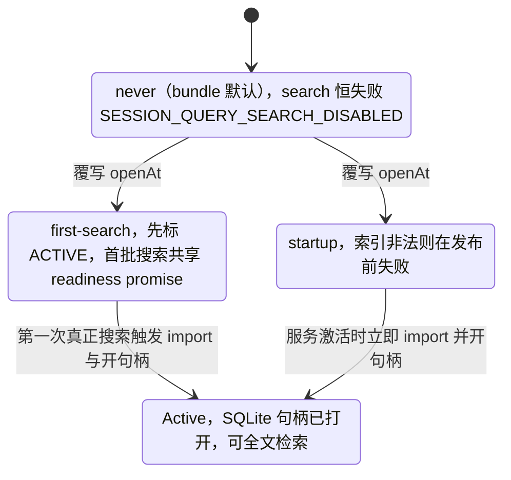

# session-query-sqlite

> `@deepseek-ai/dsh-session-query-sqlite` · bundle：`base` · 配置树 id：`session-query-sqlite` · v0.1.0-rc.5（commit `47f9438`）2026-08-14 核对。出处收在文末脚注。

**一句话**：`ctx.sessionQuery` 的具体实现，用 SQLite FTS5 给会话语料做全文检索——但**默认是关的**（`openAt: never`），只有精确读、过滤和血缘追踪在跑。

第一次看这一节容易读成"默认树里没有检索能力"。不是的：服务挂着，能力也在，只是**搜索这一条路被掐了**，其余接口照常。

## 它在树上长什么样

bundle 层默认这样把它接进树[^1]：

```yaml
- id: session-query-sqlite
  name: '@deepseek-ai/dsh-session-query-sqlite'
  config:
    path: ':memory:'
    openAt: never
```

bundle 在这行上方解释了为什么。`openAt: never` 之下，各条路的通断是这样分的[^2]：

| 能力 | `openAt: never` 时 |
|---|---|
| `ctx.sessionQuery` 服务本身 | 仍然挂着 |
| 精确读、标题 | 照常可用 |
| 血缘追踪（会话导出、subagent-fork 的 Workspace 继承） | 照常可用 |
| search 调用 | 以 `SESSION_QUERY_SEARCH_DISABLED` 失败 |
| SQLite | 从不打开 |
| Web 侧边栏搜索 | 因此只匹配标题和 workspace 名 |

想开内容搜索的部署，做法是在更后面的 patch 层（profile `cordis.patch.yml` 或 `--patch` overlay）把 `openAt` 改成 `first-search` 或 `startup`，通常同时给一个耐久 `path`。

web-app 原样重述同一组值，理由是把 Web 的值钉在一份临时内存索引上[^3]。

## 它注册了什么

它挂在树上时只登记了一个 service、一处可选的动态绑定[^4]：

| 类型 | 名字 | 说明 |
|---|---|---|
| service | `ctx.sessionQuery`（`SqliteSessionQueryEngine`） | 继承抽象 `SessionQueryEngine`；`inject` 在基类和具体类里都声明为 `['sessions']` |
| 可选注入 | `sessionPersistence` | 动态观察：只在一个额外 inject 了 `sessionPersistence` 的子上下文里绑定，卸载时自动解绑 |

它**不**监听任何会话事件，事件总表的四张监听器名单里都没有它[^5]；也不注册工具、命令、prompt 段。

默认树上还**没有** `tool-session-query` 那一行，所以这套检索面根本不对模型开放。代码里真正的消费者是 host 侧的 apiproxy：会话导出和 fork 的 Workspace 继承，两条都走同一个内部方法 `traceSession`[^6]。

另有 `dsh-session-reference` 也声明依赖 `sessionQuery`[^7]，但它不在任何 bundle 里。

## 配置项

| 字段 | 类型 | 默认值 | 作用 |
|---|---|---|---|
| `path` | `string` | **必填**（bundle 给 `':memory:'`） | 专用派生索引的 SQLite 路径；POSIX 上缺失目录与库按 owner-only 创建（`0700`/`0600`，再过 umask），已有权限保留 |
| `openAt` | `'startup' \| 'first-search' \| 'never'` | `'startup'`，bundle 覆写为 `'never'` | 何时 import `node:sqlite` 并开句柄 |
| `journalMode` | `'wal' \| 'delete' \| 'truncate' \| 'persist'` | `'wal'` | SQLite journal 模式 |
| `defaultLimit` | `number` | `20` | 请求未给 `limit` 时的页大小，上限是 `Number.MAX_SAFE_INTEGER` 减一 |
| `maxLimit` | `number` | `100` | 允许的最大页大小，同一上限 |
| `snippetChars` | `number` | `240` | 摘要最大长度，按 Unicode code point 计 |
| `readWindowMax` | `number` | `50` | 继承的 `readEvent` 方法的 `before`/`after` 原始事件数上限 |
| `persistedInspectConcurrency` | `number` | `4` | 一次继承批量读里并发检查持久化日志的上限 |

八个字段里只有 `openAt` 值得停下来看，其余都是尺寸和路径[^8]。

三个取值决定 SQLite 句柄什么时候打开、以什么代价打开[^9]：

| 取值 | 什么时候 import 并开句柄 | 代价 / 附带效果 |
|---|---|---|
| `startup` | 服务激活时就 import 并开句柄 | 索引非法则在发布前失败 |
| `first-search` | 第一次真正搜索时 | 服务直接标 ACTIVE；首批并发搜索共享一个 readiness promise；为的是让 Node 22 启动输出干净——把 SQLite 的实验性警告**推迟**到第一次真搜索，不是消除 |
| `never` | 从不 | 连观察和对账都不跑 |



## 检索契约要点

### 查询串是字面短语，不是 FTS5 表达式

查询串**必填、trim 过、空白规范化**。FTS5 语法（引号、`OR`、`NEAR`、`*`）一律当数据看，而不是当可执行的 MATCH 语法[^10]。

### 过滤谓词有预算，超了直接失败

为了让 MATCH 待在受支持的外层谓词位置，过滤条件的条数被卡了个死上限：

```
budget = 14                      // 跨会话请求
if 会话内请求:
    budget = 13                  // 固定的目标会话谓词先占掉一格

n = 会话过滤谓词数 + 事件过滤谓词数
    （每个范围端点各算一个谓词，一个区间就是两个）

if n > budget or 绑定数 > 32766:            // 32,766 是 SQLite 绑定的可移植上限
    fail SESSION_QUERY_INVALID_FILTER       // 在预备语句之前就失败，不会真去查
```

也就是说这不是"查慢了"，是**在编译期就拒绝**。

### 排序三级键，游标不对称

排序键三级[^11]：

```
sort by:
    1. 实际 FTS5 高亮命中跨度数    降序
    2. 文档 code-point 长度        升序
    3. 事件时间 / 会话 id / seq    破平
```

游标是 opaque branded 值，绑定规范化后的请求与服务实例。这里有个不对称：**会话内游标能挺过无关会话的变化，跨会话游标不能。**

### 索引怎么追上源

三种 surface（`current` / `shadowed` / `log-only`）默认都可搜[^12]。

源与索引的对账由一台序列化状态机负责：它比较"源限定的轻量耐久快照修订"，只非侵入地 `inspect` 新的或变了的日志，**从不调用后端会做崩溃修复的方法（`load`）**[^13]。

TEMP 表放 live 行、遮蔽同会话的耐久基底；live 拥有者消失后，基底重新显形。

## 模型看得见什么

**什么都看不见。** README 原文：`None, as this trusted search backend returns hits only to callers and registers no model-facing prompt, schema, tool, or message.`[^14] KV Cache 同为 None。

## 什么时候你会想换掉它 / 怎么换

最常见的需求不是换实现，而是**把搜索打开**。

在 profile 层按 id 覆写整个 config 即可。注意 patch 是替换而非合并[^15]，另外只改 `config` 不带 `name` 是合法的 patch 形态：

```yaml
- id: session-query-sqlite
  config:
    path: !!js dshHomePath('session-index.db')
    openAt: first-search
```

`dshHomePath` 由 boot 层 provide 进上下文[^16]，`!!js` 表达式在条目激活时求值。

`first-search` 是折中：服务立刻可用，SQLite 的实验性警告推迟到真正搜索时。要开机就验索引合法性，用 `startup`。

**绝对不要把 `path` 指向会话持久化的数据库**[^17]。这个派生库本身是可丢弃的，但重置带守卫：

```
识别到的 schema 版本 → 先拒绝未知用户表
if 已识别的不兼容 schema 且含派生表:  原地重建
else:                                拒绝        // 无关库、权威库一律拒绝
```

换成别的 provider 需要另一个实现同一 seam 的包，而仓库里当前只有这一个具体实现，配置总表只列出抽象的 `dsh-session-query`[^18]。

真要换，也不能靠改这一行的 `name`：非 insert patch 里 `name` 是断言，不匹配会**整条跳过**[^19]。正确做法是禁用旧行，再 `insert` 新行。

## 坑与边界

以下四条坑全部来自 README[^20]：

- **没有调用方鉴权**：这是进程级可信服务，模型工具或 UI 必须自己实施访问策略。
- **同步执行查询**：`DatabaseSync` 在 MATCH 期间阻塞 JS 线程，已经在跑的语句无法中断。取消信号只在这些不可抢占调用的前后检查[^21]。
- **只有 token 级召回，不是任意子串**：`unicode61` 分词器不匹配更大 token 内部的子串（`AI` 匹配不到 token `BRAID`）；要字面扫描请用 `ctx.sessionQuery.filterEvents` 的 `text` 子句。
- **派生索引单拥有者**：一个路径只能由一个进程里的一个服务拥有，外部写入者和多进程共享不受支持，因为 generation 与 TEMP 遮蔽状态是连接所有的。

## 出处

[^1]: `packages/bundle/base/cordis.patch.yml:117`。
[^2]: 表格内容与 bundle 挂载行上方的说明同段，见 `packages/bundle/base/cordis.patch.yml:109`–`116`。
[^3]: `packages/bundle/web-app/cordis.patch.yml:30`–`33`。
[^4]: 具体类声明与 `inject` 覆写：`packages/session-query/session-query-sqlite/src/index.ts:196`、`:197`；抽象基类声明与 `inject`：`packages/session-query/session-query/src/index.ts:81`、`:82`、`:88`；可选注入的动态绑定/解绑：`packages/session-query/session-query-sqlite/src/index.ts:235`–`244`。
[^5]: `docs/event-producer-consumer.md:41`–`44`，四张监听器名单均未列出该服务。
[^6]: 会话导出：`packages/host/apiproxy/src/session-export.ts:256`；fork 的 Workspace 继承：`src/api-proxy.ts:1517`。
[^7]: `docs/config-catalog.md:1704`（原文 `Requires: sessionQuery`）。
[^8]: 各字段默认值出处：`openAt` 默认 `'startup'` 见 `packages/session-query/session-query-sqlite/src/index.ts:201`；`journalMode` 默认 `'wal'` 见 `:202`；`defaultLimit` 默认 `20` 见 `:76`、`:203`，上限 `Number.MAX_SAFE_INTEGER - 1` 见 `packages/session-query/session-query-sqlite/src/query.ts:24`；`maxLimit` 默认 `100` 见 `:78`、`:204`；`snippetChars` 默认 `240` 见 `:80`、`:205`；`readWindowMax` 默认 `50` 见 `packages/session-query/session-query/src/config.ts:6`，取默认处见 `src/index.ts:206`；`persistedInspectConcurrency` 默认 `4` 见 `config.ts:9`，取默认处见 `src/index.ts:207`–`211`。
[^9]: `README.md:19`。
[^10]: `README.md:9`。
[^11]: `README.md:11`。
[^12]: `README.md:13`。
[^13]: `README.md:17`。
[^14]: `README.md:46`。
[^15]: `packages/bundle/base/cordis.patch.yml:6`–`7`。
[^16]: `packages/boot/app-boot/src/index.ts:770`。
[^17]: `README.md:23`。
[^18]: `docs/config-catalog.md:3107`。
[^19]: `vendor/include/src/index.ts:116`–`119`。
[^20]: `README.md:52`–`57`。
[^21]: `README.md:42`。
