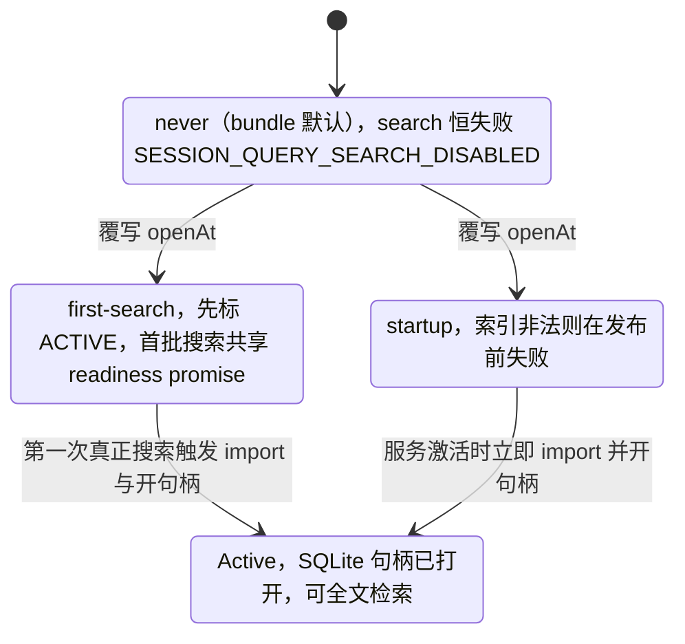

# session-query-sqlite

> `@deepseek-ai/dsh-session-query-sqlite` · bundle：`base` · 配置树 id：`session-query-sqlite` · v0.1.0-rc.5（commit `47f9438`）2026-08-14 核对

**一句话**：`ctx.sessionQuery` 的具体实现，用 SQLite FTS5 给会话语料做全文检索——但**默认是关的**（`openAt: never`），只有精确读、过滤和血缘追踪在跑。

## 它在树上长什么样

`packages/bundle/base/cordis.patch.yml:117`：

```yaml
- id: session-query-sqlite
  name: '@deepseek-ai/dsh-session-query-sqlite'
  config:
    path: ':memory:'
    openAt: never
```

bundle 在这行上方解释了为什么（`cordis.patch.yml:109`–`116`）：`openAt: never` 让 `ctx.sessionQuery` **仍然挂着**——精确读、标题、血缘追踪（会话导出、subagent-fork 的 Workspace 继承）照常可用——但 search 调用以 `SESSION_QUERY_SEARCH_DISABLED` 失败，SQLite 从不打开；Web 侧边栏搜索因此只匹配标题和 workspace 名。想开内容搜索的部署在更后面的 patch 层（profile `cordis.patch.yml` 或 `--patch` overlay）把 `openAt` 改成 `first-search` 或 `startup`，通常同时给一个耐久 `path`。

web-app 原样重述同一组值（`packages/bundle/web-app/cordis.patch.yml:30`–`33`），理由是把 Web 的值钉在一份临时内存索引上。

## 它注册了什么

| 类型 | 名字 | 说明 |
|---|---|---|
| service | `ctx.sessionQuery`（`SqliteSessionQueryEngine`，`packages/session-query/session-query-sqlite/src/index.ts:196`） | 继承抽象 `SessionQueryEngine`（`packages/session-query/session-query/src/index.ts:81`、`88`）；`inject = ['sessions']` 在基类 `:82` 声明、具体类 `src/index.ts:197` 覆写为同值 |
| 可选注入 | `sessionPersistence` | 动态观察：在 `ctx.inject(['sessionPersistence'], …)` 子上下文里绑定，卸载时解绑（`packages/session-query/session-query-sqlite/src/index.ts:235`–`244`） |

不监听任何会话事件（`docs/event-producer-consumer.md:41`–`44` 的四张监听器名单里都没有它），不注册工具、命令、prompt 段。默认树上也**没有** `tool-session-query` 那一行，所以这套检索面不对模型开放；代码里的消费者是 host 侧的 apiproxy——会话导出（`packages/host/apiproxy/src/session-export.ts:256`）和 fork 的 Workspace 继承（`src/api-proxy.ts:1517`）都走 `traceSession`。另有 `dsh-session-reference` 也 `Requires: sessionQuery`（`docs/config-catalog.md:1704`），但它不在任何 bundle 里。

## 配置项

| 字段 | 类型 | 默认值 | 作用 |
|---|---|---|---|
| `path` | `string` | **必填**（bundle 给 `':memory:'`） | 专用派生索引的 SQLite 路径；POSIX 上缺失目录与库按 owner-only 创建（`0700`/`0600`，再过 umask），已有权限保留 |
| `openAt` | `'startup' \| 'first-search' \| 'never'` | `'startup'`（`src/index.ts:201`），bundle 覆写为 `'never'` | 何时 import `node:sqlite` 并开句柄 |
| `journalMode` | `'wal' \| 'delete' \| 'truncate' \| 'persist'` | `'wal'`（`src/index.ts:202`） | SQLite journal 模式 |
| `defaultLimit` | `number` | `20`（`src/index.ts:76`、`203`） | 请求未给 `limit` 时的页大小，上限 `Number.MAX_SAFE_INTEGER - 1`（`src/query.ts:24`） |
| `maxLimit` | `number` | `100`（`src/index.ts:78`、`204`） | 允许的最大页大小，同一上限 |
| `snippetChars` | `number` | `240`（`src/index.ts:80`、`205`） | 摘要最大长度，按 Unicode code point 计 |
| `readWindowMax` | `number` | `50`（`packages/session-query/session-query/src/config.ts:6`，在 `src/index.ts:206` 取默认） | 继承的 `readEvent()` 的 `before`/`after` 原始事件数上限 |
| `persistedInspectConcurrency` | `number` | `4`（`config.ts:9`，在 `src/index.ts:207`–`211` 取默认） | 一次继承批量读里并发检查持久化日志的上限 |

三个 `openAt` 的区别（`README.md:19`）：`startup` 在服务激活时就 import 并开句柄，索引非法则在发布前失败；`first-search` 把服务直接标 ACTIVE，首批并发搜索共享一个 readiness promise，为的是让 Node 22 启动输出干净（把 SQLite 的实验性警告推迟到第一次真搜索，**不是消除**）；`never` 则连观察和对账都不跑。

三个取值决定 SQLite 句柄什么时候打开、以什么代价打开：



## 检索契约要点

- 查询串是**必填、trim 过、空白规范化的字面短语**；FTS5 语法（引号、`OR`、`NEAR`、`*`）一律当数据而非可执行 MATCH 语法（`README.md:9`）。
- 为了让 MATCH 待在受支持的外层谓词位置：跨会话请求最多编译 **14** 个会话+事件过滤谓词，会话内请求最多 **13** 个（固定的目标会话谓词占掉一格）；每个范围端点算一个谓词。超预算或超过 SQLite 32,766 个绑定的可移植上限，会在预备语句之前以 `SESSION_QUERY_INVALID_FILTER` 失败。
- 排序：实际 FTS5 高亮命中跨度数降序 → 文档 code-point 长度升序 → 事件时间 / 会话 id / seq 破平（`README.md:11`）。游标是 opaque branded 值，绑定规范化后的请求与服务实例；会话内游标能挺过无关会话的变化，跨会话游标不能。
- 三种 surface（`current` / `shadowed` / `log-only`）默认都可搜（`README.md:13`）。
- 源与索引生命周期：一台序列化状态机比较"源限定的轻量耐久快照修订"，只非侵入地 `inspect` 新的或变了的日志，**从不调用后端会做崩溃修复的 `load()`**（`README.md:17`）。TEMP 表放 live 行、遮蔽同会话的耐久基底，live 拥有者消失后基底重新显形。

## 模型看得见什么

**什么都看不见。** README 原文：`None, as this trusted search backend returns hits only to callers and registers no model-facing prompt, schema, tool, or message.`（`README.md:46`）KV Cache 同为 None。

## 什么时候你会想换掉它 / 怎么换

最常见的不是换实现，而是**把搜索打开**。在 profile 层按 id 覆写整个 config（patch 是替换而非合并，`packages/bundle/base/cordis.patch.yml:6`–`7`；只改 `config` 不带 `name` 是合法的 patch 形态）：

```yaml
- id: session-query-sqlite
  config:
    path: !!js dshHomePath('session-index.db')
    openAt: first-search
```

`dshHomePath` 由 boot 层 provide 进上下文（`packages/boot/app-boot/src/index.ts:770`），`!!js` 表达式在条目激活时求值。`first-search` 是折中：服务立刻可用，SQLite 的实验性警告推迟到真正搜索时；要开机就验索引合法性用 `startup`。**绝对不要把 `path` 指向会话持久化的数据库**（`README.md:23`）——库是可丢弃的，但重置有守卫：识别到的 schema 版本会先拒绝未知用户表，只有"已识别的不兼容 schema 且含派生表"才原地重建，无关库或权威库一律拒绝。

换成别的 provider 需要另一个实现同一 seam 的包；仓库里当前只有这一个具体实现（`docs/config-catalog.md:3107` 只列出抽象的 `dsh-session-query`）。真要换，也不能靠改这一行的 `name`——非 insert patch 里 `name` 是断言，不匹配会整条跳过（`vendor/include/src/index.ts:116`–`119`），得禁用旧行再 `insert` 新行。

## 坑与边界

来自 `README.md:52`–`57`：

- **没有调用方鉴权**——这是进程级可信服务，模型工具或 UI 必须自己实施访问策略。
- **同步执行查询**：`DatabaseSync` 在 MATCH 期间阻塞 JS 线程，已经在跑的语句无法中断。取消信号只在这些不可抢占调用的前后检查（`README.md:42`）。
- **只有 token 级召回，不是任意子串**：`unicode61` 分词器不匹配更大 token 内部的子串（`AI` 匹配不到 token `BRAID`）；要字面扫描请用 `ctx.sessionQuery.filterEvents()` 的 `text` 子句。
- **派生索引单拥有者**：一个路径只能由一个进程里的一个服务拥有，外部写入者和多进程共享不受支持——generation 与 TEMP 遮蔽状态是连接所有的。
