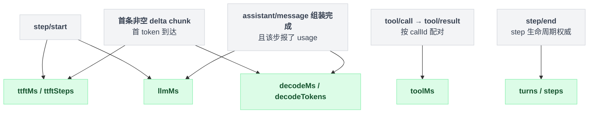
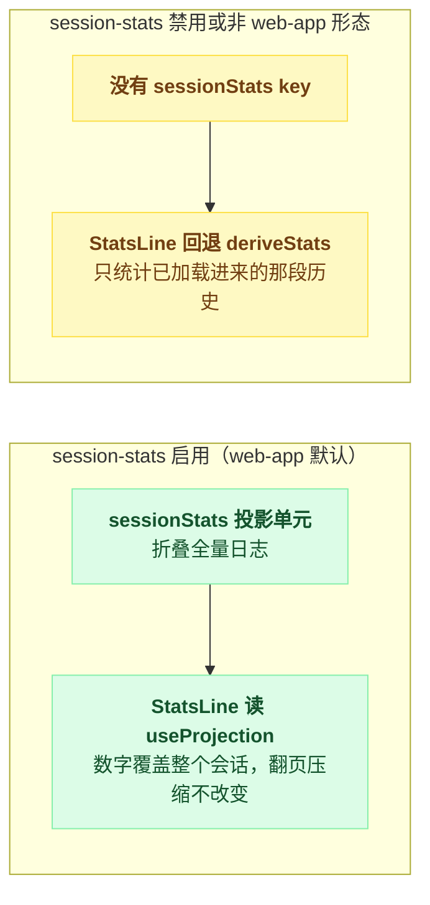

# session-stats

> `@deepseek-ai/dsh-session-stats` · bundle：`web-app` · 配置树 id：`session-stats` · v0.1.0-rc.5（commit `47f9438`）2026-08-14 核对；出处收在文末脚注。

**一句话**：往会话投影注册表里加一个 `sessionStats` 单元，从整条日志折出轮次/步数与 LLM、工具、首 token、解码四类墙钟时间——**翻页和压缩都改不动这些数字**。

## 它在树上长什么样

```yaml
- id: session-stats
  name: '@deepseek-ai/dsh-session-stats'
```

配置树上就这两行，上方带一句注释交代了用途和归属：它是 web-app 聊天统计条用的全量 turn/step 计数（对应 `sessionStats` 这个投影 key），投影注册表本身是 base 层的一行[^1]。

这两行里没有 `config`，也没有 `inject`——依赖是包自己用编译期常量声明的[^2]。

值得单独记一笔的是它的挂载范围。注册表 `session-projection` 本身是 base 层的行[^3]，各形态都有；而 `session-stats` 这一行只有 web-app 独有，其余 bundle 无此行。所以 `sessionStats` 这个 key 只在 Web 形态存在。

## 它注册了什么

| 类型 | 名字 | 说明 |
|---|---|---|
| 投影单元 | `sessionStats` | 注册进 `sessionProjections` 注册表[^4]，`stateVersion: 1`[^5] |
| 类型声明 | `SessionProjectionMap.sessionStats` | 唯一声明处[^6]，字段文档在同文件另一段[^7] |
| invariant | 包名占位 | 空实现：折叠是纯函数，wire payload 由注册表逐次 schema 校验，事件关系归 dsh-agent-loop[^8] |

**不注册 service、不监听任何事件、不注册工具或命令。** 它是 function plugin，只有一个 `apply`[^9]。

投递那一摊——快照、变更流、历史尾页、`session/projection` 推送帧、会话列表行——全归投影 seam[^10]。

## 配置项

无配置项。输出字段固定为八个[^11]：

| 字段 | 含义 | 折叠自 |
|---|---|---|
| `turns` | 至少含一个已关闭 step 的不同轮次数 | `step/end` 的 `turn` 与 `lastTurn` 比对[^12] |
| `steps` | 已关闭的 step 数 | `step/end` 计数，不是 `assistant/message` |
| `llmMs` | 模型墙钟时间之和 | `step/start` 到 `assistant/message`[^13] |
| `toolMs` | 工具墙钟时间之和 | `tool/call` 到 `tool/result`，按 `callId` 配对[^14] |
| `ttftMs` / `ttftSteps` | 首 token 延迟之和 / 计入的步数 | `step/start` 到第一条非空 delta chunk[^15] |
| `decodeMs` / `decodeTokens` | 解码时间与 provider 报的输出 token | 首 token 到组装完成，且该步报了 usage[^16] |

八个字段各自绑定一段事件区间，摊开看更清楚谁量谁：



换成一遍循环来看，这八个数就是同一趟扫描里各自累加出来的：

```
for e in 整条日志:
    if e is step/start:
        本步起点 = e.时刻                       // llmMs 与 ttftMs 共用这个起点

    if e is 本步首条非空 delta chunk:
        ttftMs += e.时刻 - 本步起点
        ttftSteps += 1
        首 token 时刻 = e.时刻

    if e is assistant/message 组装完成:
        llmMs += e.时刻 - 本步起点
        if 该步报了 usage:
            decodeMs     += e.时刻 - 首 token 时刻
            decodeTokens += usage 里 provider 报的输出 token

    if e is tool/call:
        pendingCalls[e.callId] = e.时刻
    if e is tool/result 且 Object.hasOwn(pendingCalls, e.callId):
        toolMs += e.时刻 - pendingCalls[e.callId]
        删掉这条挂起

    if e is step/end:
        steps += 1
        if e.turn != lastTurn:                  // 只有换了轮次才 +1
            turns += 1
            lastTurn = e.turn

    if e is turn/end:
        清空 pendingCalls                        // 没等到结果的不留到下一轮
```

折叠逻辑整体在这一段函数里[^17]。

schema 是 `.strict()` 的八个非负数[^18]。每个字段在第一条贡献事件到达前都是 0；注册表一旦组合，key 永远在，所以客户端读**值**而不是判 key 是否存在[^19]。

为什么数 `step/end` 而不是 `assistant/message`？README 说得很直白：它是 step 生命周期的权威，agent loop 在 `finally` 里每进一个 step 就恰好写一条。

于是完成、失败、取消、撞 max-tokens 的步都算。换成数组装消息，会把 max-tokens 的 usage-host 消息多算、把取消的步漏算[^20]。

## 模型看得见什么

README《Model Experience》原文[^21]：

> None, as the plugin only computes a client-facing read model of already-logged session events and touches no prompt, message, schema, stream, or tool result.

KV Cache 亦无影响[^22]。

## 什么时候你会想换掉它 / 怎么换

**不想要**：删掉或 `disabled: true`。

这里有个反直觉的点：Web 聊天页的 stats strip 不会消失，而是**整条退回窗口内折叠**——`StatsLine` 组件在拿不到这个投影时，会退回一个直接从已加载节点现算统计值的兜底函数，字段名两边刻意起成一样，就是为了能整体回退[^23]。

差别在口径：窗口折叠只统计已经加载进来的那段历史，翻页和压缩会让数字变。

两条路径的口径差异摊开看：



**想在别的形态里也有**：把这一行搬进对应 bundle 即可，前提是那棵树上有 `session-projection`（base 层已有）；不然 fiber 会一直 pending，什么都不注册[^24]。

**想改口径**：没有配置开关，折叠逻辑是编译进包的纯函数[^17]。要改只能自己写一个 key 不同的投影单元，并接管消费端。

## 坑与边界

README《Known Limitations》四条[^25]：

- **步数统计的是"尝试过的工作"，不是"可见产出"**：没产出任何可见内容就失败的步照样有 `step/end`，照样计数；被崩溃打断的步会在会话重载、崩溃恢复补上合成 `step/end` 之后才计入。
- **取消的步计数但不计时**：它没有组装出消息，所以那段部分流时间进不了任何墙钟字段；反过来，撞 max-tokens 的 usage-host 消息会贡献界面上看不到的模型时间。
- **口径是日志范围而非界面范围**：被压缩掉的那些步仍然计数——这些数字描述整个会话，不是当前模型可见的表面。
- **只在 web-app bundle 挂载**：别的形态没有 `sessionStats` key，消费者退回窗口内计数。

另外三处是读源码得到的细节。

`tool/result` 用 `Object.hasOwn` 查 `pendingCalls`，不是直接取值。原因是 `callId` 从模型/工具的 JSON 边界上来，`constructor`、`toString` 这类原型属性名必须读作"未匹配"，否则 `toolMs` 会被 NaN 污染[^26]。

`turn/end` 会清掉没等到结果的挂起调用，避免持久化状态无限增长[^27]。

它与 [session-title](./dsh-session-title.md) 注册的 `title` 单元同住一个 `sessionProjections` 注册表，两者互不相干。差别在挂载方式：title 那颗是 base 层、且用 `ctx.inject` 做可选挂载；本颗是硬 `inject`，没有注册表就整个不启动。

## 出处

[^1]: 配置树注释原文：「Whole-log turn/step counts for the chat stats strip (the sessionStats projection key); the projection registry itself is a base-layer row.」，坐标 `packages/bundle/web-app/cordis.patch.yml:84-85`。
[^2]: 依赖声明 `export const inject = ['sessionProjections']`：`packages/session/session-stats/src/index.ts:20`。
[^3]: `session-projection` 注册表的 base 层行：`packages/bundle/base/cordis.patch.yml:126-127`。
[^4]: `ctx.sessionProjections.register(sessionStatsProjectionDefinition)` 调用点：`src/index.ts:27-29`。
[^5]: `stateVersion: 1`：`src/projection.ts:182`。
[^6]: `SessionProjectionMap.sessionStats` 唯一声明处：`src/types.ts:41-46`。
[^7]: 字段文档：`src/types.ts:22-39`。
[^8]: invariant 空实现：`src/invariant.ts:17-26`。
[^9]: `apply` 单一导出：`src/index.ts:27`。
[^10]: 投影 seam 归属说明：`README.md:5`。
[^11]: 八个输出字段：`src/projection.ts:172-181`。
[^12]: `turns` 折叠逻辑：`src/projection.ts:155-162`。
[^13]: `llmMs` 折叠逻辑：`src/projection.ts:126`。
[^14]: `toolMs` 折叠逻辑：`src/projection.ts:140-154`。
[^15]: `ttftMs` / `ttftSteps` 折叠逻辑：`src/projection.ts:113-118`，累加在 `:129-131`。
[^16]: `decodeMs` / `decodeTokens` 折叠逻辑：`src/projection.ts:129-136`。
[^17]: 折叠逻辑全文：`src/projection.ts:105-171`。
[^18]: schema 定义（`.strict()` 八个非负数）：`src/projection.ts:65-74`。
[^19]: 读值不判 key 存在：`README.md:15`。
[^20]: 取消 / max-tokens 步的计数口径：`README.md:9`。
[^21]: Model Experience 原文：`README.md:28`。
[^22]: KV Cache 无影响：`README.md:32`。
[^23]: `StatsLine` 兜底表达式 `useProjection('sessionStats') ?? deriveStats(settledNodes)`：`packages/client/ui-conversation/src/client/chat/StatsLine.tsx:170-171`。
[^24]: fiber pending 说明：`README.md:24`。
[^25]: Known Limitations 四条：`README.md:36-39`。
[^26]: `Object.hasOwn` 查 `pendingCalls` 的原型污染防护：`src/projection.ts:147-149`。
[^27]: `turn/end` 清空挂起调用：`src/projection.ts:163-167`。
