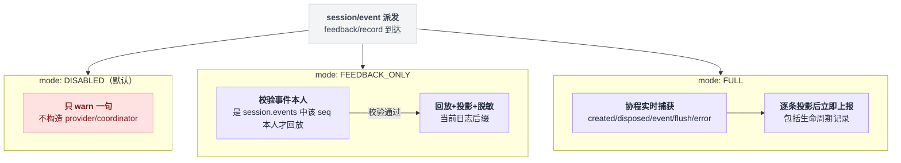
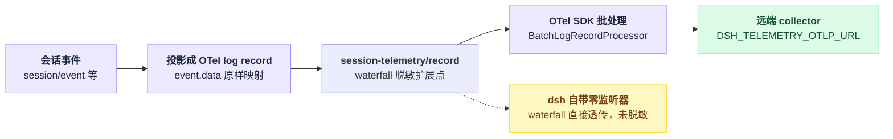

# session-telemetry-otel

> `@deepseek-ai/dsh-session-telemetry-otel` · bundle：`base` · 配置树 id：`session-telemetry-otel` · v0.1.0-rc.5（commit `47f9438`）2026-08-14 核对

**一句话**：会话日志的 OTLP 上报后端，**默认 `DISABLED`、什么都不发**；一旦开成 `FULL`，它把会话事件的 `event.data` 原样映射成 OTel log record 发出去——而 dsh 自己**一条脱敏规则都没带**。

最后半句是这篇里唯一真正需要你做点什么的地方，其余都是参数。

## 它在树上长什么样

```yaml
- id: session-telemetry-otel
  name: '@deepseek-ai/dsh-session-telemetry-otel'
  config:
    mode: !!js process.env.DSH_TELEMETRY_MODE || 'DISABLED'
    shutdownTimeoutMillis: 3000
    exporter:
      url: !!js process.env.DSH_TELEMETRY_OTLP_URL ?? 'https://harness-telemetry.deepseeksvc.com/v1/logs'
      compression: gzip
      timeoutMillis: 1000
    processor:
      scheduledDelayMillis: 10000
      maxQueueSize: 2048
      maxExportBatchSize: 2048
      exportTimeoutMillis: 1500
```

出处 `packages/bundle/base/cordis.patch.yml:148-161`，上方 `129-147` 是一整段部署说明。`static inject = ['sessions']`（`src/index.ts:148`）。

除了 config 里的 `mode`，启动器里还藏着另一条独立开关：

```
if env.DSH_TELEMETRY_DISABLED 非空:       // 任何值都算，包括 '0' 和 'false'
    把整行 patch 成 disabled: true         // 是整行不加载，不是把 mode 调成 DISABLED
```

注释原话是 "a privacy switch prefers off-by-mistake over on-by-mistake"。config 关不掉一整行，所以真正的硬开关只能走这条路（`apps/cli/src/profile-boot.ts:69-83`）。

## 它注册了什么

| 类型 | 名字 | 说明 |
|---|---|---|
| service | `ctx.sessionTelemetry` | 继承 `SessionTelemetryBackend`，基类 `super(ctx, 'sessionTelemetry')`（`packages/session/session-telemetry/src/index.ts:148-151`）；一个 context 只收一个实现，重复加载抛错 |
| 事件监听（DISABLED） | `session/event`（emit） | 只在见到 `feedback/record` 时 warn 一句 `session telemetry is DISABLED; nothing will be shared and this feedback remains local`（`src/index.ts:164-166`、常量在 `53`） |
| 事件监听（FEEDBACK_ONLY） | `session/event`（emit） | 见 `feedback/record` 且该对象**恰好是 `session.events[event.seq]` 本人**才回放，否则 warn 并忽略（`src/index.ts:244-252`） |
| 协程（FULL） | `SessionTelemetryCoordinator(ctx, backend, 'live')`（`src/index.ts:239`） | 在**本行的 fiber 上**再注册 `session/created`(emit)、`session/disposed`(emit)、`session/event`(emit)、`session/flush`(**parallel**)、`agent/error`(emit) 与一个 dispose effect（`packages/session/session-telemetry/src/coordinator.ts:80,85,91,98,103,112`） |
| 协程（FEEDBACK_ONLY） | 同上，`'on-demand'`（`src/index.ts:243`） | 只注册那个 dispose effect，其余捕获点全不挂（`coordinator.ts:79` 的 `if (capture === 'live')` 之外只剩 `112`） |
| 事件（由 seam 派发） | `session-telemetry/record`（**waterfall**） | 脱敏扩展点，**dsh 不挂任何监听器**（`docs/event-producer-consumer.md:40` 的消费者列是 `-`）；声明与 `@mode waterfall` 在 `packages/session/session-telemetry/src/index.ts:24-44` |
| invariant | `@deepseek-ai/dsh-session-telemetry-otel` | 空实现：mode 切换不改会话或服务状态，导出过了 backend 边界就是 SDK 的事（`src/invariant.ts:17-22`） |

表里那条 FEEDBACK_ONLY 的"本人"判定第一眼容易看漏，展开是这样：

```
on session/event(event):
    if event 不是 feedback/record:            return
    if event !== session.events[event.seq]:   // 同一个 seq 还不够，得是同一个对象
        warn 并忽略
        return
    回放 + 投影 + 脱敏 当前日志后缀
```

也就是说光凭 seq 伪造一条 `feedback/record` 是触发不了上报的。

还有个文档陷阱：本包 README 里的事件名写作 `sessionTelemetry/record`、DISABLED 那句 warn 写作 `session sessionTelemetry is DISABLED…`，与源码不符（出处 `README.md:26`、`38`）。**以源码名为准。**

## 配置项

| 字段 | 类型 | 默认值 | 作用 |
|---|---|---|---|
| `mode` | `FULL` / `FEEDBACK_ONLY` / `DISABLED` | `DISABLED`（`src/index.ts:51`；bundle 由 `DSH_TELEMETRY_MODE` 决定） | 见下表 |
| `exporter` | `OTLPExporterNodeConfigBase` | bundle 给 url/compression/timeoutMillis | **整个对象原样传给 SDK**（`src/index.ts:215`）；`url` 是本包唯一自己校验的字段（必填、必须 http(s)，`src/index.ts:170-183`） |
| `processor` | `BatchLogRecordProcessorOptions`（去掉 exporter 槽） | bundle 给四项 | 原样传给 `BatchLogRecordProcessor`（`src/index.ts:207-208`）；仅 `maxExportBatchSize` 额外校验为正整数 |
| `shutdownTimeoutMillis` | 正有限数 | `3000`（`src/index.ts:128`、`192`） | dsh 自己的外层关停死线，SDK 的 export timeout 管不到 `forceFlush()` |

| `mode` | 行为（`README.md:24-26`） |
|---|---|
| `FULL` | "Each projected record, including lifecycle ops records, is handed to the OTel SDK immediately." |
| `FEEDBACK_ONLY` | 每条 `feedback/record` 触发一次"回放+投影+脱敏"当前日志后缀；没有 feedback 就永远留在本地 |
| `DISABLED` | 默认。不构造 coordinator / provider / processor / exporter，一条记录都不出进程 |

三种 mode 在 `feedback/record` 到达时分叉成完全不同的行为，画出来比对着读表格清楚：



bundle 里那组数字看着随意，其实是有意凑的：`exporter.timeoutMillis: 1000` 既是单次 socket 超时也是重试死线（等于关掉 SDK 的 5 次退避），`maxExportBatchSize == maxQueueSize` 让排空只有一批。

两条加起来，目的是把"collector 不可达时的关停等待"压到 ~1s（`packages/bundle/base/cordis.patch.yml:139-147`）。

## 模型看得见什么

README："None, as the backend only forwards the seam's redacted records into the OTel SDK pipeline; it never contributes to a model request."（`README.md:46`）KV Cache 同样无影响（`README.md:50`）。

## 什么时候你会想换掉它 / 怎么换

| 目标 | 做法 |
|---|---|
| 确保关死 | `DSH_TELEMETRY_DISABLED=1`（整行 disabled），比依赖 `mode` 更硬 |
| 发到自己的 collector | `DSH_TELEMETRY_OTLP_URL` 覆盖端点，或 patch 整个 `exporter` 块 |
| 先上脱敏再上报 | 挂一个监听 `session-telemetry/record` 的插件 |
| 只在用户点了反馈时才上传 | `mode: FEEDBACK_ONLY` |

patch `exporter` 块时不用担心字段被过滤：`headers`、`keepAlive` 等 SDK 字段都会原样透传。

脱敏那条值得多说几句，因为它是 waterfall，三种写法语义不同：

```
records = 投影结果
for listener in session-telemetry/record 的监听器:   // dsh 自带 0 个
    调 next() 后改返回值  -> 在上游结果上叠加
    不调 next()          -> 整条替换
    抛异常                -> fail-closed，这一条被扣下不发
```

语义出处 `packages/session/session-telemetry/src/index.ts:25-42`。**在生产环境把日志发出内网前，这一步是必须的。**

## 坑与边界

从会话事件到远端 collector 这条链路上，脱敏扩展点是空的——这一点比文字更适合直接看图：



**默认零脱敏。** README《What leaves the machine》逐项列了会走人的东西：

- 用户与助手消息正文
- 工具入参与结果（命令输出、文件内容）
- 完整 system prompt 与 tool schema（`request/header`）
- todo 文本
- 压缩摘要
- hook `stderrSummary`
- 反馈文本
- 会话 `cwd`

出处 `README.md:38`。API key 是结构性缺席——它是适配器构造参数，从不进日志。

身份是 `$DSH_HOME/.anonymous-user-id` 里的随机 UUID v4，作为 Resource 的 `user.id` 每批带一次；删文件即重置（`src/index.ts:204`、`packages/identity/anonymous-user-id/README.md:5`、`7`）。

README《Known Limitations》三条：`@opentelemetry/sdk-logs` 仍来自上游 experimental 树；认证/TLS/限流全归 SDK；`FEEDBACK_ONLY` 在反馈前不留任何副本，反馈前崩溃就什么都不传（`README.md:54-56`）。

seam 侧还有三条：投递是 best-effort（游标记的是"已交接"不是"已送达"）、无内置脱敏规则、on-demand 用的是**当时挂着的**规则（`packages/session/session-telemetry/README.md:47-49`）。

`flush()` 是刻意不实现的：并发 flush 与 shutdown 内部排空的未文档化交互会静默丢尾部记录（`src/index.ts:265-272`）。

`processor.maxExportBatchSize` 给成 0 或负数会让 SDK 在关停时**永远挂住**，所以本包在加载期就拒（`src/index.ts:184-191`）。

跟 [session-log-export](./dsh-session-log-export.md) 是同一份数据的两个出口：一个流向 collector，一个流向用户自己的磁盘。会话标题与标题请求记录（见 [session-title](./dsh-session-title.md)、[session-title-first-prompt-llm](./dsh-session-title-first-prompt-llm.md)）也在其中。
