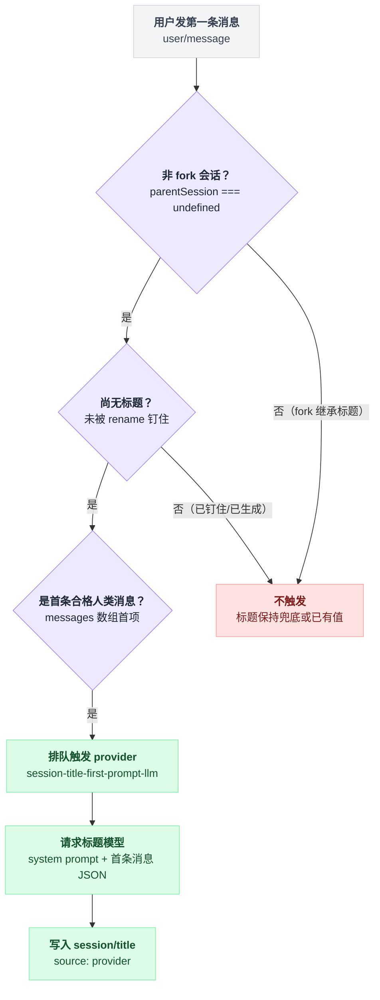

# session-title-first-prompt-llm

> `@deepseek-ai/dsh-session-title-first-prompt-llm` · bundle：`base` · 配置树 id：`session-title-llm` · v0.1.0-rc.5（commit `47f9438`）2026-08-14 核对

**一句话**：往 [session-title](./dsh-session-title.md) 的唯一 provider 槽位里插一个模型生成器——只拿**第一条**人类消息去问模型要一个标题，一次会话最多自动跑一次。

## 它在树上长什么样

```yaml
- id: session-title-llm
  name: '@deepseek-ai/dsh-session-title-first-prompt-llm'
  config:
    targetWords: 5
    targetCjkCharacters: 10
    maxInputBytes: 4096
    maxOutputTokens: 64
    timeoutMs: 60000
```

这段有个容易看漏的地方：**行 id 是 `session-title-llm`，包名却是 `...-first-prompt-llm`**。

id 是槽位名，不是包名的缩写。换成 all-prompts 版本时只换 `name`，id 原封不动。

依赖由包自己声明：`export const inject = ['sessionTitle', 'llm', 'sessions']`。

出处：yaml 见 `packages/bundle/base/cordis.patch.yml:46-53`，inject 见 `packages/session/session-title-first-prompt-llm/src/index.ts:12`。

## 它注册了什么

| 类型 | 名字 | 说明 |
|---|---|---|
| provider | `session-title-first-prompt-llm` | 通过 `registerSessionTitleLlmProvider(ctx, config, name, 'first-prompt', 选择器)` 注册进 `ctx.sessionTitle`（`src/index.ts:34-40`）；provider id 即插件名（`src/index.ts:11`，库侧 `SessionTitleProviderId(id)` 见 `packages/session/session-title-llm/src/index.ts:161`） |
| 消息选择器 | 取 `messages[0]` | 只喂第一条合格人类消息，空则抛错（`src/index.ts:36-38`） |
| 日志事件 | `session/title-llm-request` | 由共享库在**派发前**追加的 log-only 请求记录（声明 `packages/session/session-title-llm/src/index.ts:40-45`，追加 `262-269`） |
| invariant | `@deepseek-ai/dsh-session-title-first-prompt-llm` | 空实现：请求与结果校验全在共享库和 session-title 服务那边，本包无独立可变状态（`src/invariant.ts:17-21`） |

本包自己不监听任何事件、不注册工具、不注册命令。

真正的实现全在库包 `@deepseek-ai/dsh-session-title-llm`——它不是插件，是 library，列在 `docs/config-catalog.md` 的 "Library packages (no plugin entry)" 一节（`docs/config-catalog.md:3114`、`3146`）。

本包只提供"节奏 + 选谁"这两个参数。源码里那句 `jscpd` 注释写得直白："the field validators remain shared"（`src/index.ts:17`）。

触发时机不归本包管，归 session-title 服务：`first-prompt` 只在"非 fork、第一条合格消息、且尚无标题"时排队（`packages/session/session-title/src/index.ts:470-471`）。三个条件写成短路判断就是：

```
on 用户发来消息:
    if 会话是 fork 出来的:      return   // 标题从父会话继承，永不自动跑
    if 已经有标题:              return   // 被 rename 钉住的、或已生成过的，都不动
    if 这不是首条合格人类消息:   return
    排队触发 provider
```

三个条件在原文里分散在不同段落，串成判定树更好懂：



## 配置项

schema 是共享的。除成对的路由覆盖外全部必填，库不给默认值——README 原话 "Every field is required except the paired route override; there are no library defaults."（`packages/session/session-title-llm/README.md:17`）。所以下表"默认值"一列写的其实是 bundle 填的值，不是库的兜底。

| 字段 | 类型 | 默认值 | 作用 |
|---|---|---|---|
| `targetWords` | 正整数 | `5`（bundle 给） | 非 CJK 语言的目标词数，写进 system prompt |
| `targetCjkCharacters` | 正整数 | `10`（bundle 给） | 中日韩的目标字数，同样写进 system prompt |
| `maxInputBytes` | 正整数 | `4096`（bundle 给） | JSON 框好的用户提示的 UTF-8 字节上限，**超了直接失败，不截断**（`packages/session/session-title-llm/src/index.ts:240-244`） |
| `maxOutputTokens` | 正整数 | `64`（bundle 给） | 辅助请求输出上限 |
| `timeoutMs` | 正整数 | `60000`（bundle 给） | 端到端超时，上限受 `MAX_TIMER_DELAY_MS` 约束（`packages/session/session-title-llm/src/index.ts:77`、`124-126`） |
| `provider` / `model` | string | 未给（bundle 未写） | 显式路由，**要么都写要么都不写**；不写就继承当前 `request/header` 里的主请求路由 |

路由是两级回退，回退不成就报错：

```
if 配置里写了 provider + model:   用它
elif 有已记录的 request/header:    继承主请求的路由
else:                             报错 "no logged request route is available;
                                        configure provider and model together"
```

见 `packages/session/session-title-llm/src/index.ts:171-183`。

## 模型看得见什么

分两层看。

**主对话模型**：什么都看不见。README 的 Token effect 写的是 "The main agent request gains zero tokens."（`README.md:19`）

**标题模型**（另一次辅助请求）：README 原文 "The title model receives the shared title instruction and a JSON array containing only the first eligible human message."（`README.md:15`）

这次请求是这样拼出来的：

```
system = 固定四行指令:
           只回一行纯文本标题
           不许 Markdown / XML / 终端控制码
           不许代码
           用消息本身的语言
user   = "Generate the session title from this JSON array of human messages:\n"
         + JSON.stringify(messages)
请求打上 purpose: 'session-title'
```

system prompt 见 `packages/session/session-title-llm/src/index.ts:186-193`，用户消息见同文件 `196-198`，`purpose` 见同文件 `259`。

`purpose` 那个标记不是装饰：DeepSeek 适配器据此关掉 thinking，把那 64 个 token 全留给标题正文（`packages/session/session-title-llm/README.md:13`）。

## 什么时候你会想换掉它 / 怎么换

- **彻底关掉自动标题**：`- id: session-title-llm` + `disabled: true`。[session-title](./dsh-session-title.md) 的确定性兜底仍在，只是标题变成"首句前 5 个词"。
- **换成全量重算**：把 `name` 改成 `'@deepseek-ai/dsh-session-title-all-prompts-llm'`，config 字段一模一样（两包的 `Config` 都由 `SessionTitleLlmConfigFields` 拼出，`packages/session/session-title-all-prompts-llm/src/index.ts:18-26`）。代价是每条新人类消息都可能触发一次辅助请求，且输入随会话增长，超过 `maxInputBytes` 就整次失败并保留旧标题。
- **换便宜模型**：补 `provider` + `model` 两项（必须成对）。不写就跟着主对话的模型走——主对话换成贵模型时标题也跟着变贵。
- **自己写 provider**：实现 `SessionTitleProvider`（`docs/subsystems/session-title.md:132-145`）并 `ctx.sessionTitle.register()`，同时把本行停掉——槽位只有一个。

## 坑与边界

README 的《Known Limitations》摆了两条：第一句话可能早已代表不了一个长会话，要跟着变就用 all-prompts 版；fork 出来的子会话保留继承标题，**永远不会自动跑这个 provider**，哪怕它的种子首条消息来自父会话（`README.md:27-28`）。

自动那次失败后不会重试，只能靠 `ctx.sessionTitle.refresh()`（`README.md:5`）。

最容易踩的是日志那条：`session/title-llm-request` 在**校验通过、派发之前**就落盘，所以模型调用失败时这条记录仍在（`packages/session/session-title-llm/README.md:13`，代码顺序见同包 `src/index.ts:262-269` 早于 `272` 的 `ctx.llm.stream`）。它含完整 system prompt 与用户首句，会被 [session-telemetry-otel](./dsh-session-telemetry-otel.md) 上报、被 [session-log-export](./dsh-session-log-export.md) 导出。

输出侧拒绝一切非纯文本：

| 收到什么 | 结果 |
|---|---|
| tool-call | 按失败处理 |
| `max-tokens` | 按失败处理 |
| 非 `stop` 的 finish reason | 按失败处理 |

见 `packages/session/session-title-llm/src/index.ts:201-218`、`279-288`。

## 未确认

- ⚠️ `timeoutMs: 60000` 与 tool-web 的 `searchTimeoutMs: 60000`（`packages/bundle/base/cordis.patch.yml:418`）一致，但 bundle 注释未说明标题请求为何要 60s；未在源码中找到解释。
