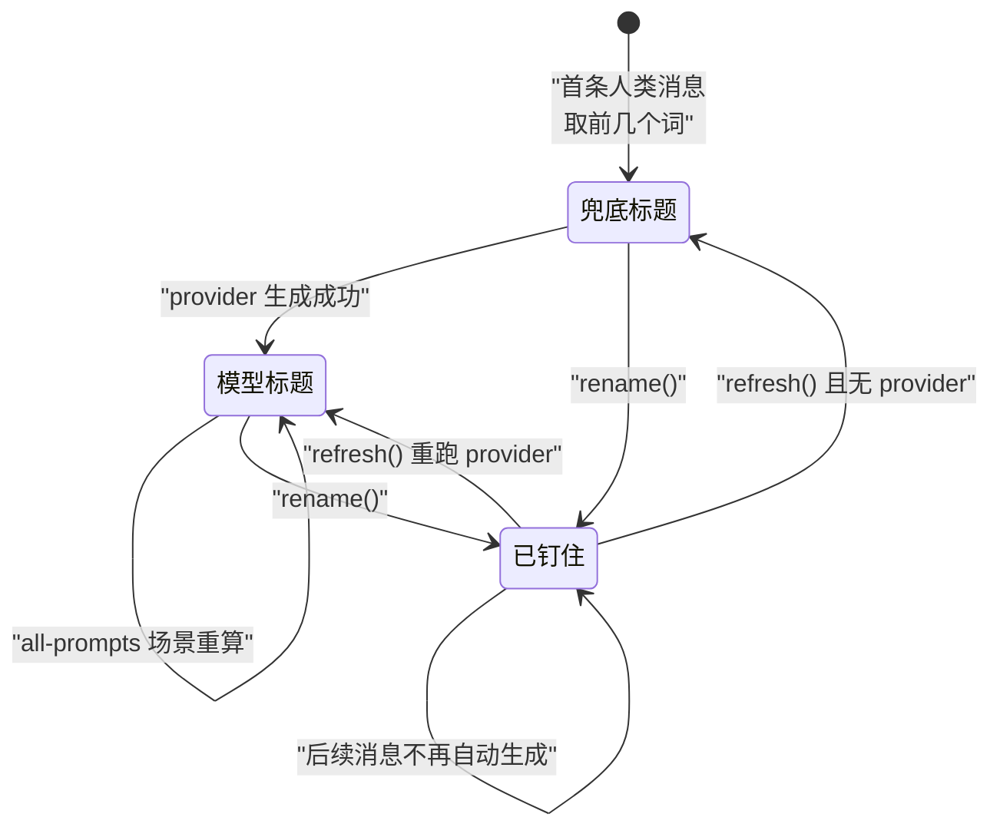

# session-title

> `@deepseek-ai/dsh-session-title` · bundle：`base` · 配置树 id：`session-title` · v0.1.0-rc.5（commit `47f9438`）2026-08-14 核对

**一句话**：会话标题是日志里的 `session/title` 事件流，最新一条即当前标题；插件先落一个确定性的"取首条人类消息前几个词"兜底标题，再把**唯一一个**异步 provider 槽位留给模型生成器。

所以这里没有"标题字段"这种东西。想知道现在叫什么，就是往回翻日志，翻到第一条 `session/title` 为止：

```
def 当前标题(session):
    for e in reversed(session.events):
        if e is session/title:
            return e.title
    return null            # 一条都没有，就还没有标题
```

## 它在树上长什么样

```yaml
- id: session-title
  name: '@deepseek-ai/dsh-session-title'
  config:
    fallbackMaxWords: 5
    fallbackMaxBytes: 40
    maxTitleBytes: 80
```

这一行不写 `inject`，依赖由服务类自己声明：`static inject = ['sessions']`。

出处 `packages/bundle/base/cordis.patch.yml:39-44`、`packages/session/session-title/src/index.ts:262`。

## 它注册了什么

| 类型 | 名字 | 说明 |
|---|---|---|
| service | `ctx.sessionTitle` | `SessionTitleService`，构造时 `super(ctx, 'sessionTitle')` |
| 日志事件 | `session/title` | log-only，payload = `title` / `messageSeqs` / `source` |
| 事件监听 | `session/event`（emit） | 只处理 `user/message` 和 `request/header` 两类 |
| 事件监听 | `llm/stream`（**waterfall**，`{ global: true, prepend: true }`） | 纯观察，见下 |
| 事件监听 | `session/disposed`（emit） | 中止该会话在飞的生成并删状态 |
| 投影单元 | `title`（`string \| null`） | 仅当 `sessionProjections` 存在时经 `ctx.inject` 挂上，`stateVersion: 1` |
| invariant | `@deepseek-ai/dsh-session-title` | `messageSeqs` 为空 ⟺ `source.kind === 'user'` |

出处：service `src/index.ts:277`；`session/title` 声明 `src/index.ts:94-102`、payload 类型 `src/index.ts:61-68`；`session/event` `src/index.ts:319-330`；`llm/stream` `src/index.ts:331-334`，派发模式见 `docs/event-producer-consumer.md:39`；`session/disposed` `src/index.ts:335-340`；投影单元 `src/index.ts:308-317`，类型声明在 `src/types.ts:15-24`；invariant 在 `internal/dispatch` 上拦截，append 发布前就失败（`src/invariant.ts:26-39`）。

`llm/stream` 那条值得单独说一句，因为参数长得很吓人：`prepend: true` 意味着它排在整条 waterfall 链的**最前面**，但它立刻 `return next()`，不改写请求。之所以要抢这个位置，是为了抓住"路由没变、因而不会再写 `request/header`"的那次主请求——那种情况下没有别的信号能通知它（`src/index.ts:502-515`）。

服务方法（`docs/subsystems/session-title.md:162-199`，由 `scripts/gen-cordis-catalog.ts` 从源码生成）：

| 方法 | 行为 |
|---|---|
| `get(session)` | `foldSessionTitle()` 取日志里最后一条 `session/title` |
| `rename(session, title)` | 同步接受用户改名，写 `source: {kind:'user'}`，**并把标题钉住** |
| `refresh(session, signal?)` | 显式重跑 provider，或无 provider 时物化兜底 |
| `register(provider)` | 装唯一那个 provider，第二次注册直接抛错 |

出处：`get` 见 `src/index.ts:348-350`、`191-201`；`rename` 见 `src/index.ts:363-383`、`466`；`refresh` 见 `src/index.ts:392-426`；`register` 见 `src/index.ts:434-459`。

"钉住"是这四个方法里唯一有状态残留的一条，也是最容易读漏的一条：`rename()` 之后，新用户消息不再排自动生成，标题就停在那儿了；而 `refresh()` 是"钉住"的唯一解法。

```
rename(session, title):
    写一条 session/title，source = {kind: 'user'}
    该会话此后不再自动排生成任务          # 钉住

refresh(session):
    if 有 provider:  重跑 provider，写新标题
    else:            物化兜底标题
    # 无论哪条分支，钉住状态被解开
```

标题在兜底、模型生成、用户钉住之间怎么转移，`get`/`rename`/`refresh` 三个方法凑在一起才是完整状态机：



## 配置项

| 字段 | 类型 | 默认值 | 作用 |
|---|---|---|---|
| `fallbackMaxWords` | 正整数 | `5`（bundle 给） | 兜底标题最多取几个空白分隔的词 |
| `fallbackMaxBytes` | 正整数 | `40`（bundle 给） | 兜底标题的 UTF-8 字节上限，不得大于 `maxTitleBytes` |
| `maxTitleBytes` | 正整数 | `80`（bundle 给） | 任何来源的标题都被截到这个字节数 |

"默认值"那一列写着"bundle 给"是有讲究的。README 明确："All limits are required; the library supplies no defaults."——bundle 那三行是**唯一**的默认值来源，schema 三项全 `.required()`，删掉 config 整行插件起不来。

截断本身不会切坏字符：按码点走，不切半个字符；文本先剥 OSC/CSI/ESC、控制字符与双向控制符，再压成一行。

出处：README 引文 `README.md:22`；schema 与 required 见 `src/index.ts:263-267`、`276-289`，其中 `fallbackMaxBytes ≤ maxTitleBytes` 的校验在 `src/index.ts:287-289`；截断 `src/normalize.ts:39-51`；清洗 `src/normalize.ts:22-31`。

## 模型看得见什么

README《Model Experience》："Nothing. `session/title` is log-only and never enters the session surface, `deriveMessages()`, system prompt, tool schemas, or request prefix."（`README.md:42`）

Token 与 KV Cache 对主请求都是零影响（`README.md:46`、`50`）。真正花钱的是 provider 那次辅助请求，记在 [session-title-first-prompt-llm](./dsh-session-title-first-prompt-llm.md) 名下。

## 什么时候你会想换掉它 / 怎么换

- **只想调长短**：改这三个数即可。中文标题按字节算，40 字节约等于 13 个汉字。
- **只要兜底、不要模型**：把 `session-title-llm` 那一行 `disabled: true`（见 [session-title-first-prompt-llm](./dsh-session-title-first-prompt-llm.md)），本行留着——服务本身不发任何请求。
- **换生成策略**：provider 槽位只有一个，`register()` 第二次调用立刻抛（`src/index.ts:436-438`）。要"多策略"只能自己写一个 provider 把优先级包进去（`README.md:55`）。仓库里现成的另一颗是 `@deepseek-ai/dsh-session-title-all-prompts-llm`（`all-prompts` 节奏，选择器是整份消息列表，每来一条新人类消息就重算，`packages/session/session-title-all-prompts-llm/src/index.ts:35`）。
- **整行拿掉**：`ctx.sessionTitle` 消失后，Web 的重命名 RPC 会返回 `internal: renaming is unavailable: this deployment mounts no session-title service`（`packages/host/apiproxy/src/api-proxy.ts:2337-2340`）。

## 坑与边界

README《Known Limitations》：不支持"删标题/退回自动"（只能靠 `refresh` 解钉）、不做搜索与列表索引；provider 注册表刻意只收一个实现（`README.md:54-55`）。

**fork 会继承标题事件**：子会话带着父的标题开始，`first-prompt` 节奏不会自动改名（`README.md:18`）。调度条件见 `src/index.ts:470-471` 的 `session.header.parentSession === undefined`——只有没有父会话的才排生成。

自动生成失败只 `logger.warn`，保留旧标题，不抛给主循环（`src/index.ts:533-536`）。

provider 交回来的结果不是照单全收，服务端还要过一遍校验，任何一项不合格就整条拒绝：

```
校验(result, 本次请求的 seq 集合):
    if result.title 为空:                  拒绝
    if result.messageSeqs 有重复:          拒绝    # 必须唯一
    if result.messageSeqs 不是递增的:      拒绝    # 必须有序
    if 有 seq 不在本次请求内:               拒绝
    否则接受
```

实现在 `src/index.ts:585-632`。

最后一条是隐私向的：标题事件会随会话日志一起被 [session-telemetry-otel](./dsh-session-telemetry-otel.md) 在 `FULL`/`FEEDBACK_ONLY` 下原样上报，也会被 [session-log-export](./dsh-session-log-export.md) 打进导出的 ZIP。标题文本来自用户的第一句话，注意这一点。

## 未确认

- ⚠️ `llm/stream` 那条 waterfall 监听虽然 `prepend`，但只读不改；"绝不影响主请求延迟"是读代码得出的（`src/index.ts:331-334` 立刻 `next()`），未实跑验证。
