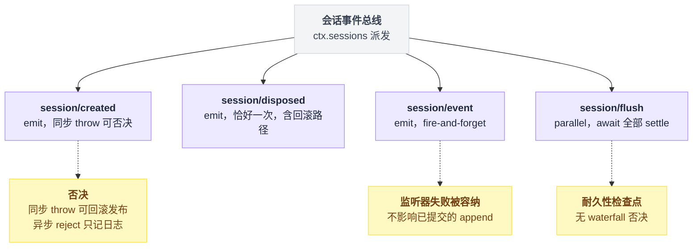
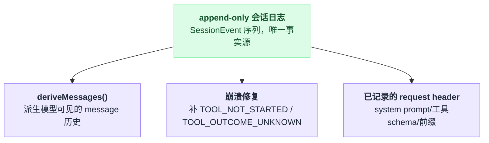

# session

> `@deepseek-ai/dsh-session` · bundle：`base` · 配置树 id：`session` · v0.1.0-rc.5（commit `47f9438`）2026-08-14 核对。出处收在文末脚注。

**一句话**：事件溯源的会话日志与内存 store（`ctx.sessions`），append-only 的 `SessionEvent` 序列是整段交互史的唯一事实源，发给模型的 message 历史是从它**派生**出来的，而不是它本身。

这句话里最容易读漏的是"派生"两个字。日志是账本，message 历史是账本算出来的一张报表——报表能变（`replace` 会遮蔽条目），**账本不会被改写**。后面几节的所有行为，基本都是这一条的推论。

## 它在树上长什么样

配置树里给它的那一行只写了 id 和 name，没有 `inject`、没有 `config`[^1]：

```yaml
- id: session
  name: '@deepseek-ai/dsh-session'
```

这是整棵树的地基，也是它后面"无配置项"的由来。

它**故意不实现持久化**。落盘、检索、投影全部由订阅它事件的插件完成[^2]。

## 它注册了什么

| 类型 | 名字 | 说明 |
|---|---|---|
| service | `ctx.sessions`（`SessionStore`） | 全仓唯一的会话存储服务[^3] |
| typert lookup | `session` | 在 `ctx.inject(['typert'])` 子上下文里注册，把 wire 上的 `sessionId` 解析回宿主侧 `Session` 对象[^4] |
| 事件（派发方） | `session/created`（**emit**） | 发布会话时同步宣告；监听器同步 throw 可以否决并回滚出配对的 disposal，返回的 Promise 拒绝只记日志、无法追溯否决[^5] |
| 事件（派发方） | `session/disposed`（**emit**） | 已宣告的会话离开 store 时恰好一次，含发布回滚路径[^6] |
| 事件（派发方） | `session/event`（**emit**） | 提交后的 append 通知，fire-and-forget；监听器失败被逐个容纳，不会让已提交的 append 失败[^7] |
| 事件（派发方） | `session/flush`（**parallel**，awaited） | 耐久性检查点：每个监听器都启动、调用方 await 全部 settle，**没有 waterfall 否决**[^8] |

四个事件都是 scope-filtered 派发，但两种口径：

| 事件 | 过滤依据 | 效果 |
|---|---|---|
| `session/created`、`session/event` | agent 作用域 | 该作用域的监听器只收到经这个 agent 上下文进入的会话/事件[^9] |
| `session/disposed`、`session/flush` | 会话自己的 owner scope | 跟着会话走，不跟着 agent 走[^10] |

四个事件的派发模式与否决语义各不相同，摊开看更直接：



这里有个坑：`session/created` 的否决只在**同步边界**上成立。写成异步监听器就白写了：

```
on('session/created', s => {
    if (不合法(s)) throw Error()      // 有效：发布被回滚，配对的 disposal 也吐出来
})

on('session/created', async s => {
    if (不合法(s)) throw Error()      // 无效：只是一个被记进日志的 rejected Promise
})
```

同步、异步这两种写法的分野出自源码本身[^11]。

本包不注册任何工具、命令或 prompt 段。

主要 API：`create(id?, {seed?, meta?})` / `flush(session)` / `fork(source, boundary?, childSessionId?)` / `get(id)` / `list()`[^12]。

需要与别的资源做有序拆卸时另有 `prepare` + `enter` + `announce` 三段式[^13]，`dsh-agent-loop` 用它保证 loop 的最后一次 flush 早于会话摘离。

`Session` 实例侧关键面[^14]：

| 成员 | 作用 |
|---|---|
| `append()` | 同步提交并冻结事件 |
| `deriveMessages()` | 增量投影 surface 得到模型可见历史 |
| `surface` | 有序投影视图，每次落地的 rewrite 都会改变 `replaceGeneration` |
| `header` | 一次写入、深冻结的创建元数据 |

另外 `session.events` 是随 append 失效的冻结快照缓存[^15]——拿到手就别攒着用。

## 配置项

无配置项。行为完全由调用方给的 `create`/`fork` 参数、以及订阅它的插件决定。

日志格式版本常量 `SESSION_FORMAT_VERSION = 0`[^16] 不可配。

## 模型看得见什么

Model Experience 恰好三块：派生 message 历史、崩溃修复结果、已记录的 request header[^17]。三块讲的是同一份 append-only 日志派生出的三条独立投影：



**一、派生 message 历史**[^18]

模型逐字收到 `user/message`、`assistant/message`、`tool/result` 三类 surface entry 里的完整 message，身份、角色、source、content block 都是创建时那份值，投影层不铸造新身份；工具调用长在 assistant message 里面。

chunk、边界、usage、hook 记录、todo 记录等 log-only 事件不产生任何 message。

token 与 KV Cache 的账这样算：

| 操作 | token | KV Cache |
|---|---|---|
| append | 已 append 的 surface entry 在后续 step 会被重发 | 保留可复用前缀 |
| `replace` | 把被遮蔽的条目移出未来输入，但不删除底层 raw log | 从**第一条被遮蔽的 message** 起让复用失效 |

这节唯一反直觉的地方：**事件日志本身仍然是 append-only、什么都没删，KV Cache 照样从被遮蔽处断掉。**

**二、崩溃修复结果**[^19]

恢复时按两种残缺形态补事件：

| 恢复时发现 | 补什么 | 给模型的指示 |
|---|---|---|
| assistant 请求了工具，却没有耐久的 `tool/call` | `TOOL_NOT_STARTED` | 原文是 `The tool call was interrupted before the Harness recorded it as started. Retry it if it is still needed.` |
| 有 `tool/call` 但无结果 | `TOOL_OUTCOME_UNKNOWN` | 要求模型只在只读或幂等时重试，有副作用则先核验外部状态或问用户 |

两条文案由本包拥有[^20]，[session-checkpoint-policy](./dsh-session-checkpoint-policy.md) 只负责把 call 记耐久。

完好会话零 token；修复结果追加在可复用前缀之后，不使更早的 KV 条目失效。

**三、已记录的 request header**[^21]

会话能重建 loop 当时真正发出去的 system prompt、工具 schema、call config 与会话前缀。

header 事件**不会**在 message 历史里多出一份拷贝——前缀是在 `deriveMessages()` 之外拼上去的，所以记录本身零重复 token、零失效；只有后续 header 换了前缀/prompt/schema 才会从第一处差异起让复用失效。

## 什么时候你会想换掉它 / 怎么换

**换不掉。**

它是 `ctx.sessions` 的唯一实现——全仓只有一处 `super(ctx, 'sessions')`[^22]，agent loop、工具管线、持久化、投影全部直接依赖它。配置目录把它列在"无配置项的可加载插件"小节里，且不带任何依赖子句[^23]。

真正可选的是它的伴生插件 `@deepseek-ai/dsh-session/invariant`[^24]：注册单调 seq、turn/step 包含关系、同 step 内 tool call/result 配对这三类关系不变量，加载或热重载时会回放已有会话。

三个 bundle 都没有 `invariants` 行，所以默认不生效——想开就自己插一行 `@deepseek-ai/dsh-invariants` 再插伴生行。

要改的其实是它周围的行：

| 想换的东西 | 去看 |
|---|---|
| 落盘后端 | [session-persistence-jsonl](./dsh-session-persistence-jsonl.md) |
| 耐久时机 | [session-checkpoint-policy](./dsh-session-checkpoint-policy.md) |
| 加派生读模型 | [session-projection](./dsh-session-projection.md) |

## 坑与边界

- **没有会话树/分支**（pi 风格 entry tree）——除非 `fork()` 的边界切法不够用，否则不做。
- **`fork()` 只能切活会话的稳定边界**：所选前缀必须结束在 turn 之外，且源会话必须在 store 里；已持久化但未加载的会话不能 fork。
- **`SESSION_FORMAT_VERSION` 钉死在 `0`**：预发布，不承诺兼容。`Session` 只接受当前 seed 形状，后端遇到更新版本报 "written by a newer harness — upgrade"，更旧的版本目前没有升级路径。未知事件类型同样拒绝重建，除非信封里标了 `ignorable`。
- **`TurnEndReasonMap` 缺 ACP 的 `refusal` / `max_turn_requests`**——等第一个 adapter 或 loop 真的发出来再加。

以上四条来自官方文档原文[^25]。

## 把这一节串起来

- **日志是账本，message 历史是报表**——`replace` 只遮蔽报表条目，底层 raw log 从不改写；
- **`session/created` 的否决只在同步边界上成立**——异步 throw 只是一个被记进日志的 rejected Promise，回滚不了任何东西；
- **KV Cache 会从被遮蔽处断掉，即便日志本身什么都没删**——这是"派生"这条不变量在缓存层的代价；
- **崩溃修复只补两种残缺形态，且补的是"要不要重试"的指示，不是替模型做决定**；
- **它本身换不掉**，因为它是 `ctx.sessions` 的唯一实现；真正能换的是它周围三块：落盘后端、耐久时机、派生读模型。

---

## 出处

[^1]: 配置树注册行：`packages/bundle/base/cordis.patch.yml:27`。
[^2]: "故意不实现持久化"，落盘/检索/投影由订阅方插件完成：`packages/core/session/README.md:11`。
[^3]: `ctx.sessions`（`SessionStore`）注册：`packages/core/session/src/index.ts:792`、`797`。
[^4]: typert lookup 在 `ctx.inject(['typert'])` 子上下文注册，解析 wire 上的 `sessionId`：`src/index.ts:798`–`806`。
[^5]: `session/created`：`src/index.ts:54`；派发模式见 `docs/event-producer-consumer.md:41`。
[^6]: `session/disposed`：`src/index.ts:64`；`event-producer-consumer.md:42`。
[^7]: `session/event`：`src/index.ts:76`；`event-producer-consumer.md:43`。
[^8]: `session/flush`：`src/index.ts:85`；`event-producer-consumer.md:44`。
[^9]: `session/created`、`session/event` 的 agent 作用域过滤：`src/index.ts:48`–`49`、`69`–`70`。
[^10]: `session/disposed`、`session/flush` 跟着会话自己的 owner scope：`src/index.ts:59`、`:79`–`80`。
[^11]: 同步 throw 可回滚发布、异步 reject 只记日志：`src/index.ts:44`–`47`。
[^12]: 主要 API：`README.md:15`–`19`。
[^13]: `prepare` + `enter` + `announce` 三段式：`README.md:25`–`27`。
[^14]: `Session` 实例侧关键面：`README.md:39`–`45`。
[^15]: `session.events` 冻结快照缓存：`README.md:43`。
[^16]: `SESSION_FORMAT_VERSION = 0`：`packages/core/session/src/types.ts:56`。
[^17]: Model Experience 三块：`README.md:95`–`137`。
[^18]: 派生 message 历史：`README.md:97`–`109`。
[^19]: 崩溃修复结果：`README.md:111`–`123`。
[^20]: 两条修复文案：`src/repair.ts:104`–`105`。
[^21]: 已记录的 request header：`README.md:125`–`137`。
[^22]: 唯一实现的 `super(ctx, 'sessions')` 调用：`src/index.ts:797`。
[^23]: "无配置项的可加载插件"小节收录、且无 `Requires:` 子句：`docs/config-catalog.md:3077`。
[^24]: 伴生插件 `@deepseek-ai/dsh-session/invariant`：插件名在 `packages/core/session/src/invariant.ts:18`，`inject = ['invariants']` 在 `:20`；加载/热重载回放已有会话：`README.md:7`。
[^25]: 坑与边界原文：`README.md:139`–`144`。
