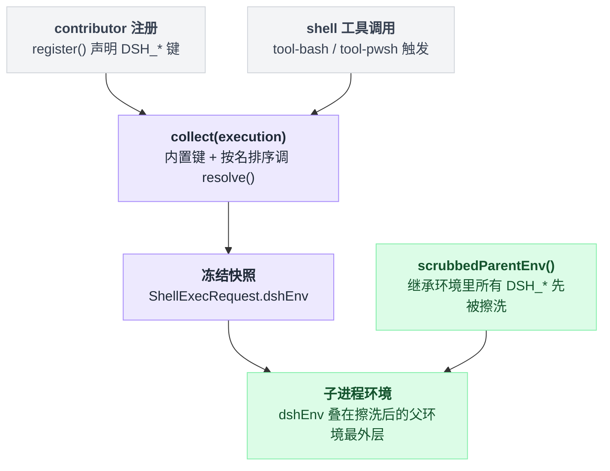

# shell-env

> `@deepseek-ai/dsh-shell-env` · bundle：`base` · 配置树 id：`shell-env` · v0.1.0-rc.5（commit `47f9438`）2026-08-14 核对

**一句话**：`ctx.shellEnv` 注册表——每次 shell 工具调用现场收集一份可信的 `DSH_*` 环境快照，内置事实归它自己所有，其他插件按声明注册键，重复占用或返回未声明键都当场炸。

## 它在树上长什么样

```yaml
- id: shell-env
  name: '@deepseek-ai/dsh-shell-env'
```

`packages/bundle/base/cordis.patch.yml:207-208`。没有 `inject`、没有 `config`——源码里 `export const inject: string[] = []`（`packages/shell/shell-env/src/index.ts:26`），也就是说它不等任何服务，加载即可用。行序本身不含加载语义（激活由服务可用性驱动，见 base bundle 12-13 行），它排在 `tool-bash` / `tool-pwsh` 前面只是给人读的分组。

web 档**不**关掉它（整份 patch 里 `shell-env` 只出现在注释中），并专门写了一段解释：它留在 host 平面，因为宿主要用它发布 `DSH_WEB_URL`/`DSH_WEB_MODE`，而「一行注入了服务」就是 host 平面归属的判据——注入发生在任何 session 存在之前（`packages/bundle/web-app/cordis.patch.yml:287-291`）。⚠️ 这段注释与本 commit 的源码对不上两处：它点名的 `apps/cli/src/web.ts` 不存在，真正注册在 `packages/bundle/web-app/src/index.ts:149-157`；`DSH_WEB_MODE` 全仓库只出现在注释里，没有任何代码注册它。

## 它注册了什么

| 类型 | 名字 | 说明 |
|---|---|---|
| service | `ctx.shellEnv` | `ShellEnvRegistry extends Service`，`super(ctx, 'shellEnv')`（`src/index.ts:89, 100`） |
| 内置 contributor | `session-persistence` | 由 `apply()` 自己注册，负责 `DSH_SESSION_JSONL`（`src/index.ts:203-216`） |
| 事件监听 | 无 | 纯注册表，不收发事件 |

服务的三个方法：`register(contributor)` 返回 disposer 且随调用方 plugin fiber 释放（`src/index.ts:110-145`）、`collect(execution)` 构造本次调用的快照（152-176）、`list()` 枚举声明但不执行 resolver（184-192）。

## 快照里有什么

| 变量 | 来源 | 何时出现 |
|---|---|---|
| `DSH_HOME` | `resolveDshHome(config.dshHome)`：config → 环境 `$DSH_HOME` → `~/.dsh` | 总是（`src/index.ts:101, 154`；解析实现 `packages/util/home-paths/src/index.ts:87-91`） |
| `DSH_SHELL` | 常量 `'1'`，标识「这是被管理的子进程」 | 总是（`src/index.ts:155`） |
| `DSH_SESSION_ID` | `execution.agent.session.header.id` | 有 agent 时（`src/index.ts:157-159`） |
| `DSH_SESSION_JSONL` | `sessionPersistence.locate()` 返回 `kind === 'jsonl'` 时的绝对路径 | 内置 contributor，且后端定位得到时（`src/index.ts:210-215`） |

前三个是**保留键**，任何 contributor 都不许占（`RESERVED_BASH_ENV_KEYS`，`src/index.ts:74-78`）。收集顺序：先内置，再按 contributor 名字排序依次调用 `resolve()`，最后按键名排序并 `Object.freeze`（`src/index.ts:161-175`）。

`DSH_SESSION_JSONL` 是位置提示，不是凭证：它可能在首次 flush 前还不存在、也可能不含当前缓冲中的这一轮（README.md:20）。

## 配置项

| 字段 | 类型 | 默认值 | 作用 |
|---|---|---|---|
| `dshHome` | string | 无（回落 `$DSH_HOME`，再回落 `~/.dsh`） | 暴露成 `DSH_HOME` 的 Harness 主目录 |

`src/index.ts:29-37`。base bundle 没写 config，所以走环境变量/默认路径。

## 怎么加自己的变量

仓库里有现成例子——web-app bundle 注册 `web-runtime` contributor 发布 `DSH_WEB_URL`（`packages/bundle/web-app/src/index.ts:149-157`，受 `surfaceContext` 开关控制，默认 `true` 且 web 档显式写 `true`：`src/index.ts:54`、`cordis.patch.yml:135`）：

```ts
ctx.inject(['shellEnv'], (runtimeCtx) => {
  runtimeCtx.shellEnv.register({
    name: 'web-runtime',
    variables: {
      [DSH_WEB_URL]: { description: 'Canonical local URL of the DeepSeek Harness Web GUI serving this session.' },
    },
    resolve: () => ({ [DSH_WEB_URL]: localWebUrl(runtimeCtx) }),
  })
})
```

注册期的六道校验（全部抛错，`src/index.ts:112-135`）：名字非空、名字不重复、键必须以 `DSH_` 开头且后缀匹配 `/^[A-Z][A-Z0-9_]*$/`、键不得是保留键、每个键必须有非空 description、键不得已被别的 contributor 占用。运行期还有一道：`resolve()` 返回未声明的键或非字符串值同样抛（`src/index.ts:165-170`）。

## 模型看得见什么

**它自己不产生任何模型可见文本**，不注册工具也不注册 prompt 段。模型是通过 [tool-bash](./dsh-tool-bash.md) / [tool-pwsh](./dsh-tool-pwsh.md) 的工具描述知道「环境事实藏在 `$DSH_*` / `$env:DSH_*` 里，需要时自己去看」——两个工具都刻意教通用约定，而不是点名具体变量，也不为此加常驻 prompt 段（README.md:39, 43）。因此 README 记它「No direct invalidation」：KV cache 的前缀变化归那两个消费者（README.md:47）。

## 什么时候你会想换掉它 / 怎么换

几乎没有换掉的理由——`tool-bash` / `tool-pwsh` 把它写进了 `inject`，卸了它两个 shell 工具都不会激活。真实需求通常是两种：

- **改 `DSH_HOME`**：给这一行加 `config: { dshHome: /path/to/home }`。
- **加自己的事实**：写一个注入 `shellEnv` 的小插件调 `register()`，如上例。不要去改这个包。

## 坑与边界

- **`list()` 只列 contributor 声明的变量**，注册表自有的内置键（`DSH_HOME`、`DSH_SHELL`、`DSH_SESSION_ID`）不在里面，所以诊断/prompt/UI 代码**不能**把 `list()` 当成完整环境目录（README.md:51）。源码里留了 `TODO(bash-env-list-builtins)`（`src/index.ts:178-179`）。
- **命名遗留**：对外服务名是 `shellEnv`，但内部类型名仍是 `BashEnvContributor` / `BashEnvVariable` / `BashEnvVariableInfo`，错误信息里也是 `bash env contributor …`（`src/index.ts:50, 116, 166`），effect 标签是 `'bashEnv.register()'`（143）。查日志时按 `bash env` 搜，不是 `shell env`。
- **快照走的是专用通道**：`ShellExecRequest.dshEnv`，不是普通 `env`；执行器把它叠在 explicit env 的最外层（`packages/shell/bash-local/src/index.ts:196`、`packages/shell/pwsh-local/src/index.ts:240`），而继承来的**所有** `DSH_*` 早在 subprocess 层就被删干净了——擦洗函数 `scrubbedParentEnv()` 定义在接缝包 `@deepseek-ai/dsh-subprocess`（`packages/subprocess/subprocess/src/index.ts:60-66`），由 [subprocess-local](./dsh-subprocess-local.md) 的 `childEnv()` 调用。嵌套 harness 与并发父子 agent 因此不会串身份，`process.env` 全程不被修改（README.md:39）。这条从注册到子进程的链路跨了好几个包，画出来比追代码快：



## 相关

消费者：[tool-bash](./dsh-tool-bash.md)（`ctx.shellEnv.collect(exec)`，`packages/shell/tool-bash/src/index.ts:341`）与 [tool-pwsh](./dsh-tool-pwsh.md)（`packages/shell/tool-pwsh/src/index.ts:363`）。快照最终落地的地方是 [subprocess-local](./dsh-subprocess-local.md) 的 `childEnv()`。
