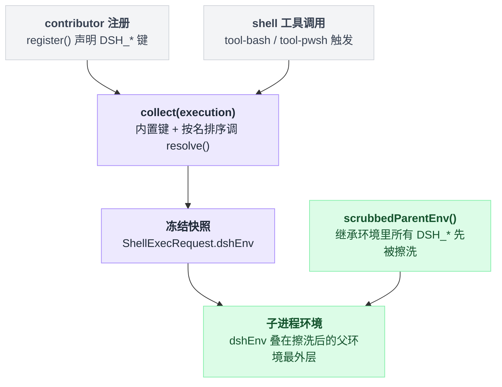

# shell-env

> `@deepseek-ai/dsh-shell-env` · bundle：`base` · 配置树 id：`shell-env` · v0.1.0-rc.5（commit `47f9438`）2026-08-14 核对。出处收在文末脚注，可照抄的代码收在文末附录。

**一句话**：`ctx.shellEnv` 注册表——每次 shell 工具调用现场收集一份可信的 `DSH_*` 环境快照，内置事实归它自己所有，其他插件按声明注册键，重复占用或返回未声明键都当场炸。

## 它在树上长什么样

```yaml
- id: shell-env
  name: '@deepseek-ai/dsh-shell-env'
```

两行，没有 `inject`、没有 `config`。源码里 `inject` 就是一个空数组[^1]，也就是说它不等任何服务，加载即可用。

行序不含加载语义——激活由服务可用性驱动，它排在 `tool-bash` / `tool-pwsh` 前面只是给人读的分组[^2]。

web 档**不**关掉它——整份 patch 里 `shell-env` 只出现在注释中。那段注释还专门解释了为什么留：它留在 host 平面，因为宿主要用它发布 `DSH_WEB_URL` / `DSH_WEB_MODE`，而「一行注入了服务」就是 host 平面归属的判据，注入发生在任何 session 存在之前[^3]。

⚠️ 这段注释与本 commit 的源码对不上两处：它点名的那个 CLI 入口文件其实不存在，真正的注册地点在 web-app bundle 的入口源码里；`DSH_WEB_MODE` 全仓库只出现在这段注释里，没有任何代码真正注册它[^4]。

## 它注册了什么

| 类型 | 名字 | 说明 |
|---|---|---|
| service | `ctx.shellEnv` | `ShellEnvRegistry extends Service`，`super(ctx, 'shellEnv')`[^5] |
| 内置 contributor | `session-persistence` | 由 `apply()` 自己注册，负责 `DSH_SESSION_JSONL`[^6] |
| 事件监听 | 无 | 纯注册表，不收发事件 |

服务只有三个方法：

| 方法 | 干什么 |
|---|---|
| `register(contributor)` | 返回 disposer，且随调用方 plugin fiber 释放[^7] |
| `collect(execution)` | 构造本次调用的快照[^8] |
| `list()` | 枚举声明，但不执行 resolver[^9] |

## 快照里有什么

| 变量 | 来源 | 何时出现 |
|---|---|---|
| `DSH_HOME` | `resolveDshHome(config.dshHome)`：config → 环境 `$DSH_HOME` → `~/.dsh` | 总是[^10] |
| `DSH_SHELL` | 常量 `'1'`，标识「这是被管理的子进程」 | 总是[^11] |
| `DSH_SESSION_ID` | `execution.agent.session.header.id` | 有 agent 时[^12] |
| `DSH_SESSION_JSONL` | `sessionPersistence.locate()` 返回 `kind === 'jsonl'` 时的绝对路径 | 内置 contributor，且后端定位得到时[^13] |

前三个是**保留键**，任何 contributor 都不许占[^14]。

`collect()` 的顺序是固定的：

```
snapshot = {}
snapshot += 内置键          // DSH_HOME / DSH_SHELL / DSH_SESSION_ID
for c in sorted(contributors, by=name):   // 按 contributor 名字排序
    snapshot += c.resolve()
return Object.freeze(sorted_by_key(snapshot))   // 最后按键名排序再冻结
```

也就是内置事实永远先落地，contributor 之间的先后只取决于名字字母序，出来的对象是冻的[^15]。

`DSH_SESSION_JSONL` 是位置提示，不是凭证：它可能在首次 flush 前还不存在、也可能不含当前缓冲中的这一轮[^16]。

## 配置项

| 字段 | 类型 | 默认值 | 作用 |
|---|---|---|---|
| `dshHome` | string | 无（回落 `$DSH_HOME`，再回落 `~/.dsh`） | 暴露成 `DSH_HOME` 的 Harness 主目录 |

base bundle 没写 config，所以走环境变量/默认路径[^17]。

## 怎么加自己的变量

仓库里有现成例子：web-app bundle 注册一个 `web-runtime` contributor 发布 `DSH_WEB_URL`，真实写法照抄[附录 A](#a-注册一个-shellenv-contributor)。这段受 `surfaceContext` 开关控制，默认 `true`，且 web 档显式写了 `true`[^18]。

注册期有六道校验，全部抛错：

| # | 校验 |
|---|---|
| 1 | 名字非空 |
| 2 | 名字不重复 |
| 3 | 键必须以 `DSH_` 开头，且后缀匹配 `/^[A-Z][A-Z0-9_]*$/` |
| 4 | 键不得是保留键 |
| 5 | 每个键必须有非空 description |
| 6 | 键不得已被别的 contributor 占用 |

以上六道校验都在同一处实现[^19]。运行期还有第七道：`resolve()` 返回未声明的键、或返回非字符串值，同样抛[^20]。

## 模型看得见什么

**它自己不产生任何模型可见文本**，不注册工具也不注册 prompt 段。

模型是通过 [tool-bash](./dsh-tool-bash.md) / [tool-pwsh](./dsh-tool-pwsh.md) 的工具描述知道「环境事实藏在 `$DSH_*` / `$env:DSH_*` 里，需要时自己去看」。两个工具都刻意只教通用约定，不点名具体变量，也不为此加常驻 prompt 段[^21]。

所以 README 记它「No direct invalidation」：KV cache 的前缀变化归那两个消费者[^22]。

## 什么时候你会想换掉它 / 怎么换

几乎没有换掉的理由——`tool-bash` / `tool-pwsh` 把它写进了 `inject`，卸了它两个 shell 工具都不会激活。真实需求通常是两种：

- **改 `DSH_HOME`**：给这一行加一个 `config`：

```yaml
- id: shell-env
  name: '@deepseek-ai/dsh-shell-env'
  config:
    dshHome: /path/to/home
```

- **加自己的事实**：写一个注入 `shellEnv` 的小插件调 `register()`，照抄附录 A。不要去改这个包。

## 坑与边界

**`list()` 只列 contributor 声明的变量。** 注册表自有的内置键（`DSH_HOME`、`DSH_SHELL`、`DSH_SESSION_ID`）不在里面，所以诊断/prompt/UI 代码**不能**把 `list()` 当成完整环境目录，源码里也留了一条对应的 TODO[^23]。

**命名遗留。** 对外服务名是 `shellEnv`，但内部类型名仍是 `BashEnvContributor` / `BashEnvVariable` / `BashEnvVariableInfo`，错误信息里也是 `bash env contributor …`，effect 标签是 `'bashEnv.register()'`[^24]。查日志时按 `bash env` 搜，不是 `shell env`。

**快照走的是专用通道**：`ShellExecRequest.dshEnv`，不是普通 `env`。执行器把它叠在 explicit env 的最外层，而继承来的**所有** `DSH_*` 早在 subprocess 层就被删干净了——擦洗函数 `scrubbedParentEnv()` 定义在接缝包 `@deepseek-ai/dsh-subprocess`，由 [subprocess-local](./dsh-subprocess-local.md) 的 `childEnv()` 调用[^25]。

嵌套 harness 与并发父子 agent 因此不会串身份，`process.env` 全程不被修改[^26]。

这条从注册到子进程的链路跨了好几个包，画出来比追代码快：



## 相关

消费者：[tool-bash](./dsh-tool-bash.md)（`ctx.shellEnv.collect(exec)`）与 [tool-pwsh](./dsh-tool-pwsh.md)，快照最终落地的地方是 [subprocess-local](./dsh-subprocess-local.md) 的 `childEnv()`[^27]。

---

## 附录：可以照抄的模板

### A. 注册一个 shellEnv contributor

web-app bundle 注册 `web-runtime` contributor 发布 `DSH_WEB_URL` 的真实写法[^18]：

```ts
// packages/bundle/web-app/src/index.ts:149
ctx.inject(['shellEnv'], (runtimeCtx) => {
  runtimeCtx.shellEnv.register({
    name: 'web-runtime',
    variables: {
      [DSH_WEB_URL]: { description: 'Canonical local URL of the DeepSeek Harness Web GUI serving this session.' },
    },
    resolve: () => ({ [DSH_WEB_URL]: localWebUrl(runtimeCtx) }),
  })
})
```

---

## 出处

[^1]: 树上位置：`packages/bundle/base/cordis.patch.yml:207-208`；空 `inject`：`packages/shell/shell-env/src/index.ts:26`。
[^2]: 激活由服务可用性驱动，行序只是分组：`packages/bundle/base/cordis.patch.yml:12-13`（同一份 base bundle 配置）。
[^3]: web 档保留 `shell-env` 的注释说明：`packages/bundle/web-app/cordis.patch.yml:287-291`。
[^4]: 注释点名的入口文件 `apps/cli/src/web.ts` 不存在；真实注册在 `packages/bundle/web-app/src/index.ts:149-157`；`DSH_WEB_MODE` 全仓库无代码注册，只出现在这段注释里。
[^5]: `src/index.ts:89, 100`。
[^6]: `src/index.ts:203-216`。
[^7]: `src/index.ts:110-145`。
[^8]: `src/index.ts:152-176`。
[^9]: `src/index.ts:184-192`。
[^10]: `resolveDshHome()` 调用点：`src/index.ts:101, 154`；解析实现：`packages/util/home-paths/src/index.ts:87-91`。
[^11]: `src/index.ts:155`。
[^12]: `src/index.ts:157-159`。
[^13]: `src/index.ts:210-215`。
[^14]: `RESERVED_BASH_ENV_KEYS`：`src/index.ts:74-78`。
[^15]: `collect()` 实现：`src/index.ts:161-175`。
[^16]: `README.md:20`。
[^17]: `src/index.ts:29-37`。
[^18]: `surfaceContext` 默认值：`src/index.ts:54`；web 档显式写 `true`：`cordis.patch.yml:135`；contributor 定义：`packages/bundle/web-app/src/index.ts:149-157`。
[^19]: 六道注册期校验：`src/index.ts:112-135`。
[^20]: 运行期第七道校验：`src/index.ts:165-170`。
[^21]: `README.md:39, 43`。
[^22]: `README.md:47`。
[^23]: `list()` 不含内置键：`README.md:51`；`TODO(bash-env-list-builtins)`：`src/index.ts:178-179`。
[^24]: 内部类型名与错误信息：`src/index.ts:50, 116, 166`；effect 标签：`src/index.ts:143`。
[^25]: 执行器叠加位置：`packages/shell/bash-local/src/index.ts:196`、`packages/shell/pwsh-local/src/index.ts:240`；`scrubbedParentEnv()` 定义：`packages/subprocess/subprocess/src/index.ts:60-66`。
[^26]: `README.md:39`。
[^27]: `packages/shell/tool-bash/src/index.ts:341`、`packages/shell/tool-pwsh/src/index.ts:363`。
