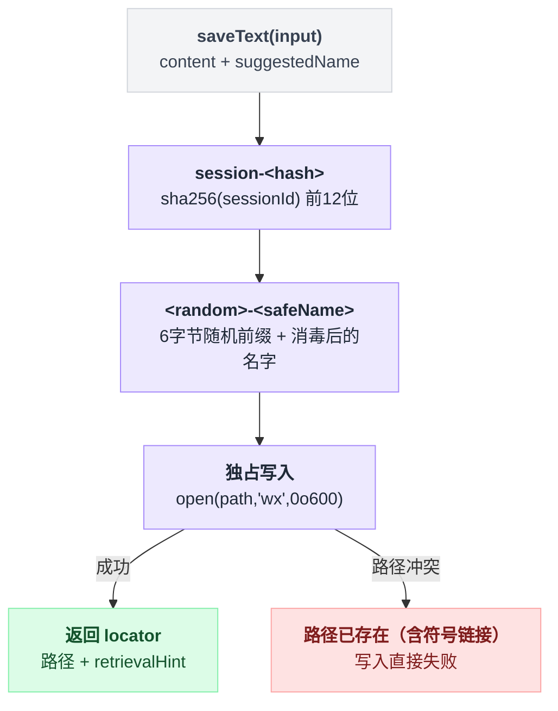

# spill-local

> `@deepseek-ai/dsh-spill-local` · bundle：`base` · 配置树 id：`spill-local` · v0.1.0-rc.5（commit `47f9438`）2026-08-14 核对

> ⚠️ **本篇未通过对抗式引用核验**：起草已完成，但逐条打开源码比对行号/字段名/英文引文的那一遍因会话额度耗尽未执行。文中 `path:line` 与配置字段请以源码为准，核验后本行会被移除。

**一句话**：spill 存储 seam 的本地文件系统实现——把工具的超大文本写进一个私有的、按 session 分目录的文件，返回文件路径作为 locator 和一句 `read`/`grep` 的取回提示。

## 它在树上长什么样

```yaml
    - id: spill-local
      name: '@deepseek-ai/dsh-spill-local'
```

`packages/bundle/base/cordis.patch.yml:346-347`。没有 `config`，所以 `root` 取默认的私有临时目录。它紧挨着自己的唯一消费者 [spill-policy](./dsh-spill-policy.md)（第 349 行）。

## 它注册了什么

| 类型 | 名字 | 说明 |
|---|---|---|
| service | `ctx.spillStore` | 抽象基类 `SpillStore` 的 `super(ctx, 'spillStore')` 完成注册（`packages/spill/spill/src/index.ts:47`）；本包是它的第一个实现 `LocalSpillStore` |
| 方法 | `saveText(input)` | seam 的唯一操作：原样持久化 `content`，返回 `{ locator, bytes, retrievalHint }`（`packages/spill/spill-local/src/index.ts:50-62`） |

**没有事件监听、没有工具、没有 prompt 段、没有命令。** 它不认识工具结果，也不决定什么时候该 spill——那是 spill-policy 的事。同一 context 内只能有一个 `spillStore` 实现，加载第二个会抛错（cordis 的重复服务行为）。

## 配置项

| 字段 | 类型 | 默认值 | 作用 |
|---|---|---|---|
| `root` | string | 私有 0700 临时目录 | spill 文件的根目录；给了就 `resolve()` 成绝对路径（`packages/spill/spill-local/src/index.ts:47`） |

默认根目录是懒创建的 `mkdtempSync(join(tmpdir(), 'dsh-spill-'))`（`packages/spill/spill-local/src/store.ts:27-30`），每进程一个。

## 存储布局

文件落在 `<root>/session-<hash>/<random>-<safeName>`：

- `session-<hash>`：`sha256(sessionId)` 的前 12 位十六进制（`packages/spill/spill-local/src/store.ts:73-76`），同一 session 的 spill 聚在一起，便于将来按 session 清理。
- `<random>-<safeName>`：6 字节随机十六进制前缀 + 经 `encodeSegment` 消毒成单个安全路径段的 `suggestedName`（`packages/spill/spill-local/src/store.ts:107-111`）。随机前缀是为了让共享 root 下无法预先植入符号链接。
- 写入是独占 + 仅属主：`open(path, 'wx', 0o600)`（`packages/spill/spill-local/src/store.ts:113`），任何已存在的路径（含符号链接）都会让写入失败，所以植入的目标改不了写入方向。目录以 `mode: 0o700` 创建。

README 把理由写得很直白："A predictable, world-readable root would let other local users read spilled tool output or plant symlinks."这条路径构造与独占写入的防护逻辑串起来看更直接：



## 模型看得见什么

**间接可见**。这个包自己不产生任何模型可见文本，它返回的 `locator`（本地路径）和 `retrievalHint` 会被消费者渲染进结果里。本实现的提示语固定为：

```text
Use read with offset/limit, or grep this path to search within it.
```

（`packages/spill/spill-local/src/index.ts:60`。）KV cache 方面 README 写的是 "No direct invalidation; the named consumer owns any request-prefix changes."

## 什么时候你会想换掉它 / 怎么换

- **想让 spill 文件落在已知位置**（便于排查或纳入清理任务）：给 `root` 一个绝对路径。
- **部署不在本机文件系统上**：locator 是本地路径、取回提示假设了本地 `read`/`grep`，远程或虚拟部署需要另写一个 `SpillStore` 后端，让 locator 和 retrievalHint 在那边有意义。写法就是继承 `SpillStore` 实现 `saveText` 并作为插件加载。
- **完全不需要 spill**：把它和 [spill-policy](./dsh-spill-policy.md) 一起 `disabled: true`。只关掉后端也不会崩——policy 拿不到 `ctx.spillStore` 时会 warn 并保留内联结果（`packages/spill/spill-policy/src/index.ts:142-146`）。

## 坑与边界

- **spill 文件在外部清理之前一直留着**：后端没有会话生命周期删除，也没有按龄retention 策略，因为持久化、恢复、fork 出来的 session 可能还引用着这些路径。
- **locator 要求消费者与文件系统同机**：跨机部署下这个 locator 对模型毫无意义。
- `saveText` 在真实存储失败（权限、ENOSPC）时是 **reject**，由调用方决定怎么降级；spill-policy 把 reject 当作 best-effort，保留内联结果（`packages/spill/spill/src/index.ts:41-43`）。
- fork 出来的 session 会继承种子日志里已有的 locator，这些文件不会被复制也不会重新归属；fork 之后产生的 spill 用子 session id（`docs/subsystems/spill.md:41`）。
