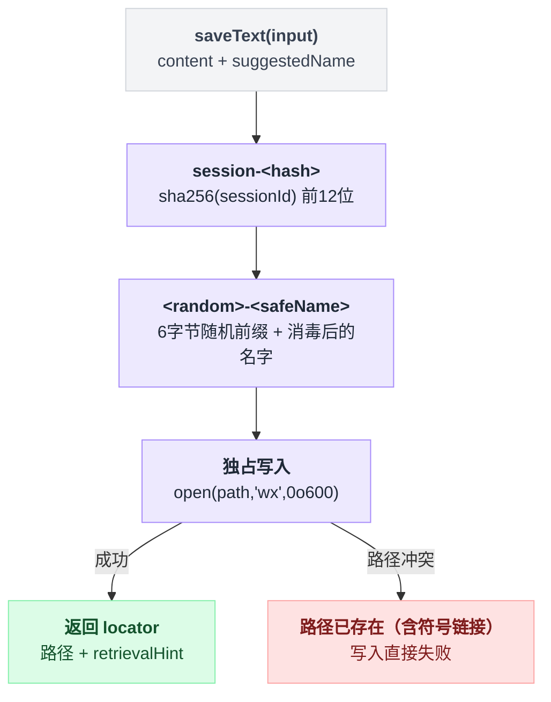

# spill-local

> `@deepseek-ai/dsh-spill-local` · bundle：`base` · 配置树 id：`spill-local` · v0.1.0-rc.5（commit `47f9438`）2026-08-14 核对；出处收在文末脚注。

> ⚠️ **本篇未通过对抗式引用核验**：起草已完成，但逐条打开源码比对行号/字段名/英文引文的那一遍因会话额度耗尽未执行。文中 `path:line` 与配置字段请以源码为准，核验后本行会被移除。

**一句话**：spill 存储 seam 的本地文件系统实现——把工具的超大文本写进一个私有的、按 session 分目录的文件，返回文件路径作为 locator 和一句 `read`/`grep` 的取回提示。

容易望文生义地以为，判断"这段结果该不该搬出去"的就是它。不是。它只管接到活之后怎么落盘——目录怎么分、名字怎么消毒、写入怎么防冲突；"值不值得搬"是隔壁 [spill-policy](./dsh-spill-policy.md) 的判断。

## 它在树上长什么样

```yaml
    - id: spill-local
      name: '@deepseek-ai/dsh-spill-local'
```

条目下面没有 `config`，所以 `root` 取默认的私有临时目录。

它在树上紧挨着自己的唯一消费者 [spill-policy](./dsh-spill-policy.md)——一个写文件，一个决定什么时候写[^1]。

## 它注册了什么

| 类型 | 名字 | 说明 |
|---|---|---|
| service | `ctx.spillStore` | 抽象基类 `SpillStore` 的 `super(ctx, 'spillStore')` 完成注册[^2]；本包是它的第一个实现 `LocalSpillStore` |
| 方法 | `saveText(input)` | seam 的唯一操作：原样持久化 `content`，返回 `{ locator, bytes, retrievalHint }`[^3] |

**没有事件监听、没有工具、没有 prompt 段、没有命令。**

上面这张"没有"清单其实是证据：它连工具结果长什么样都不知道，拿什么资格决定该不该搬——那双眼睛在 spill-policy 那边。

同一 context 内只能有一个 `spillStore` 实现，加载第二个会抛错（cordis 的重复服务行为）。

## 配置项

| 字段 | 类型 | 默认值 | 作用 |
|---|---|---|---|
| `root` | string | 私有 0700 临时目录 | spill 文件的根目录；给了就 `resolve()` 成绝对路径[^4] |

两条分支写出来是这样：

```
if 配置里给了 root:
    root = resolve(配置值)          // 转成绝对路径
else:
    root = mkdtempSync(join(tmpdir(), 'dsh-spill-'))   // 用到时才建，每进程一个
```

默认那条是懒创建的，也就是说没发生过 spill 就不会有目录[^5]。

## 存储布局

文件落在 `<root>/session-<hash>/<random>-<safeName>`。三个部分各有各的来历：

| 路径段 | 怎么来的 | 为什么 |
|---|---|---|
| `session-<hash>` | `sha256(sessionId)` 的前 12 位十六进制[^6] | 同一 session 的 spill 聚在一起，便于将来按 session 清理 |
| `<random>` | 6 字节随机十六进制前缀[^7] | 让共享 root 下无法预先植入符号链接 |
| `<safeName>` | `suggestedName` 经 `encodeSegment` 消毒成单个安全路径段[^7] | 名字里的分隔符不能把文件写到别处去 |

写入这一步才是防护的关键：

```
path = <root>/session-<hash>/<random>-<safeName>
mkdir(dirname(path), mode = 0o700)        // 目录仅属主可进
fd = open(path, 'wx', 0o600)              // 'wx' = 独占创建，仅属主可读写
    // 路径已存在 —— 包括它是个符号链接 —— 就直接失败
```

`wx` 的意思是"必须是我新建的"，所以就算有人抢先在那个路径上摆了一个指向别处的符号链接，写入也只会失败，不会顺着链接把内容写到目标去。加上随机前缀，抢先摆链接这件事本身也猜不中路径[^8]。

README 把理由写得很直白："A predictable, world-readable root would let other local users read spilled tool output or plant symlinks."这条路径构造与独占写入的防护逻辑串起来看更直接：



## 模型看得见什么

**间接可见**。这个包自己不产生任何模型可见文本，它返回的 `locator`（本地路径）和 `retrievalHint` 会被消费者渲染进结果里。

本实现的提示语是写死的一句话[^9]：

```text
Use read with offset/limit, or grep this path to search within it.
```

KV cache 方面 README 写的是 "No direct invalidation; the named consumer owns any request-prefix changes."

## 什么时候你会想换掉它 / 怎么换

- **想让 spill 文件落在已知位置**（便于排查或纳入清理任务）：给 `root` 一个绝对路径。
- **部署不在本机文件系统上**：locator 是本地路径、取回提示假设了本地 `read`/`grep`，远程或虚拟部署需要另写一个 `SpillStore` 后端，让 locator 和 retrievalHint 在那边有意义。写法就是继承 `SpillStore` 实现 `saveText` 并作为插件加载。
- **完全不需要 spill**：把它和 [spill-policy](./dsh-spill-policy.md) 一起 `disabled: true`。只关掉后端也不会崩——policy 拿不到 `ctx.spillStore` 时会 warn 并保留内联结果[^10]。

## 坑与边界

**spill 文件在外部清理之前一直留着。** 后端没有会话生命周期删除，也没有按龄 retention 策略，因为持久化、恢复、fork 出来的 session 可能还引用着这些路径。

**locator 要求消费者与文件系统同机。** 跨机部署下这个 locator 对模型毫无意义。

**真实存储失败时是 reject，不是静默降级。** 权限、ENOSPC 这类失败会让 `saveText` reject，由调用方决定怎么办；spill-policy 把 reject 当作 best-effort，保留内联结果[^11]。

**fork 出来的 session 会继承种子日志里已有的 locator。** 这些文件不会被复制也不会重新归属；fork 之后产生的 spill 用子 session id[^12]。

---

## 出处

[^1]: 节点声明：`packages/bundle/base/cordis.patch.yml:346-347`；spill-policy 紧随其后，声明在同文件 `:349`。
[^2]: `super(ctx, 'spillStore')` 完成服务注册：`packages/spill/spill/src/index.ts:47`。
[^3]: `saveText(input)`：`packages/spill/spill-local/src/index.ts:50-62`。
[^4]: `root` 字段解析：`packages/spill/spill-local/src/index.ts:47`。
[^5]: 懒创建分支：`packages/spill/spill-local/src/store.ts:27-30`。
[^6]: hash 生成：`packages/spill/spill-local/src/store.ts:73-76`。
[^7]: 随机前缀与文件名消毒：`packages/spill/spill-local/src/store.ts:107-111`。
[^8]: `wx` 独占创建：`packages/spill/spill-local/src/store.ts:113`。
[^9]: 取回提示原文出自源码写死的字符串：`packages/spill/spill-local/src/index.ts:60`。
[^10]: policy 拿不到 `ctx.spillStore` 时 warn 并保留内联结果：`packages/spill/spill-policy/src/index.ts:142-146`。
[^11]: `saveText` reject 由调用方处理，spill-policy 视为 best-effort：`packages/spill/spill/src/index.ts:41-43`。
[^12]: fork 后子 session 用自己的 session id 产生新 spill：`docs/subsystems/spill.md:41`。
