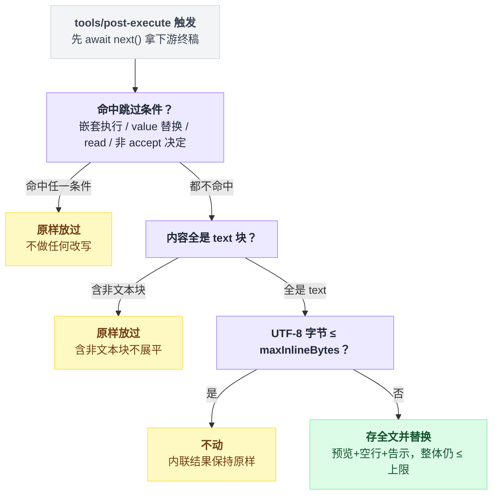

# spill-policy

> `@deepseek-ai/dsh-spill-policy` · bundle：`base` · 配置树 id：`spill-policy` · v0.1.0-rc.5（commit `47f9438`）2026-08-14 核对

> ⚠️ **本篇未通过对抗式引用核验**：起草已完成，但逐条打开源码比对行号/字段名/英文引文的那一遍因会话额度耗尽未执行。文中 `path:line` 与配置字段请以源码为准，核验后本行会被移除。

**一句话**：工具结果外溢策略——一个 `tools/post-execute` 的 waterfall 变换器，把超过 `maxInlineBytes` 的纯文本结果全文存进 `ctx.spillStore`，模型侧只留一段有界的头尾预览加一行「存在哪、怎么取」的告示。

## 它在树上长什么样

```yaml
    - id: spill-policy
      name: '@deepseek-ai/dsh-spill-policy'
      config:
        maxInlineBytes: 50000
```

这个值**只有 bundle 给**。字段本身的默认是「省略」，而省略不是「用个内置默认值」，是整个插件什么都不注册——真正的 no-op。

它紧跟在提供后端的 [spill-local](./dsh-spill-local.md)（第 346 行）之后。出处：`packages/bundle/base/cordis.patch.yml:349-352`，省略即空注册见 `packages/spill/spill-policy/src/index.ts:112-113`。

## 它注册了什么

| 类型 | 名字 | 说明 |
|---|---|---|
| 事件监听 | `tools/post-execute`（**waterfall**，`{ prepend: true }`） | 先 `await next()` 让下游 hook 定稿，再给它接受的内容封顶；能整体改写模型可见结果（`packages/spill/spill-policy/src/index.ts:190`、`:209`；派发模式见 `docs/event-producer-consumer.md:57`） |
| 事件监听 | `tools/code-dispatch-log`（**waterfall**，`{ prepend: true }`） | 同一套上限与替换管线，作用于 `run_code` 子调用结果的**持久日志副本**（`packages/spill/spill-policy/src/index.ts:217`、`:231`；派发模式见 `docs/event-producer-consumer.md:55`） |
| inject | `tools` | `export const inject = ['tools']`（`packages/spill/spill-policy/src/index.ts:73`）——它要的就是工具注册表的这两个扩展点 |
| 软引用 | `ctx.get('spillStore')` | 取不到就 warn 并保留内联结果（`packages/spill/spill-policy/src/index.ts:142-146`） |

**不注册任何 service，也不注册工具或 prompt 段。**

它自己什么都不发明：预览机制在 `@deepseek-ai/dsh-output-retention` 的 `TextRetainer`，存储在 `ctx.spillStore`。它只决定**什么时候**外溢，外加拼那行告示。

## 配置项

| 字段 | 类型 | 默认值 | 作用 |
|---|---|---|---|
| `maxInlineBytes` | number | *（省略）* | 纯文本结果的模型侧上下文上限，单位 UTF-8 字节，非负整数，加载期校验。**省略即整体禁用**；base bundle 给的是 `50000` |

校验放在加载期，不放在每次调用（`packages/spill/spill-policy/src/index.ts:117-119`）。

这个位置是故意选的：负数或小数不会在加载期被静静吞掉，而是会在 `TextRetainer` 里抛错，把每一次超长结果都变成 `isError`。坏配置必须让部署失败，而不是让工具失败。

## 判定顺序

触发点在 `tools/post-execute` 内部。谁被直接放过、谁才会走到字节封顶，分支关系是这样：



写成代码就是一路 early return：

```
on tools/post-execute(result):
    result = await next()          // 先让工具和下游 hook 跑完，封顶的是终稿

    if 命中任一跳过条件:  return result
    if 内容不是全 text 块: return result      // 含任何非文本块就不展平
    if utf8_len(内容) <= maxInlineBytes: return result

    存全文到 spillStore
    return 预览 + 空行 + 告示           // 整体仍 <= maxInlineBytes
```

第一步 `next()` 是关键：它封顶的是下游 hook 最终接受的内容，不是工具刚吐出来的原始内容。

四条跳过条件各有各的理由：

| 跳过条件 | 为什么 |
|---|---|
| 嵌套执行（`exec.parent` 存在） | 不在子调用层重复封顶 |
| 被接受的 value 替换 | 结果已被下游整体换掉 |
| `read` | 避免 `read → spill → read again` 循环 |
| 一切非 `accept` 决定 | `block` 的纠正反馈要原样通过 |

替换体的预算是先扣后分：

```
预算 = maxInlineBytes
预算 -= len(告示)              // 告示的字节成本先扣掉
头 = 预算 / 2
尾 = 预算 - 头                 // 剩下的对半分给头尾预览
```

所以「整体仍在 `maxInlineBytes` 之内」不是靠估的，是靠先给告示留位置。数告示占多少 UTF-8 字节、再从预算里扣掉，都在 `packages/spill/spill-policy/src/index.ts:171-172`。

## 模型看得见什么

超限的纯文本结果变成：

```text
<retained head/tail preview>

(Omitted N bytes. Full formatted result stored at: /…/session-…/…-web_fetch.txt. Use read with offset/limit, or grep this path to search within it.)
```

末尾那句取回提示由后端提供，本地后端的原文见 [spill-local](./dsh-spill-local.md)。

预算被压到极限时有两级退让：告示单独就填满预算，预览为空、只返回告示；连告示都超上限，就干脆保留内联原文。策略**永不**发出超过上限的替换。

Token 影响有个反直觉的地方。成功替换后至多 `maxInlineBytes` 字节，并且一直留在历史里直到压缩，全文不会再发给模型——这部分是意料之中的。

意料之外的是它对缓存友好：KV cache 是 append-only 的，新内容跟在可复用的请求前缀后面，不使已有缓存失效。这一点和 [compaction-basic](./dsh-compaction-basic.md)、[tool-result-pruner](./dsh-compaction-tool-result-pruner.md) 的 replace 语义正好相反。

## 什么时候你会想换掉它 / 怎么换

- **想放宽或收紧**：改 `maxInlineBytes`。注意它同时是替换体的总预算，调小会让预览一起变小。
- **想彻底关掉**：`disabled: true`，或者把 `maxInlineBytes` 从 config 里去掉（省略 = 真正的 no-op，一个监听都不注册）。
- **换存储位置**：不动这一行，换 [spill-local](./dsh-spill-local.md) 的 `root` 或整个 `spillStore` 后端即可，本策略只认 seam。
- **和压缩侧的分工**：见下表。

| | spill-policy | [tool-result-pruner](./dsh-compaction-tool-result-pruner.md) |
|---|---|---|
| 什么时候动手 | 工具执行时 | 压缩时 |
| 按什么算 | UTF-8 **字节** | **Unicode 码点** |
| 动谁 | 模型可见结果 | **已经进了 surface** 的工具结果 |
| 语义 | append-only | replace |
| 阈值 | base bundle 给 50000 字节 | 默认 8192 码点 |

两者都开时，先被 spill 压到 50000 字节以下的结果通常不会再触发 pruner。

## 坑与边界

- **只有最终的纯文本结果可外溢**：混合内容、`block` 反馈、`read` 一律放过；更早发生的 provider 截断或工具自有 retention 在这里救不回来。
- **装不下的告示会让这次替换整体作废**：极小的上限或极长的 locator 会导致超长原文继续内联，而后端其实已经写了一个没人引用的孤儿 spill 文件。
- **只看最终格式化的模型可见结果**，看不到工具内部资源或 canonical 值。如果 provider 已经截断过（例如 `web-fetch-http.maxBodyChars`），spill 文件里存的是工具返回的完整**格式化结果**，不是完整原始来源。
- **best-effort**：没有 session owner、没有 `ctx.spillStore` 后端、`saveText` reject——三种情况都只 warn 并返回原结果，绝不把一次成功的调用变成 `isError`，也不隐藏内联内容。
- 成功替换只改 `content`，canonical 的程序化值保持不变。
- dispatch-log 那一路**会**处理 `read` 子调用：日志副本不是模型上下文，不存在 read-again 循环，而 `read` 恰恰是产出巨型日志的那个工具。
