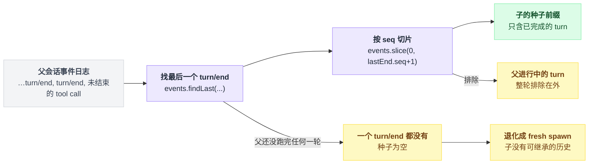

# subagent-fork-in-process

> `@deepseek-ai/dsh-subagent-fork-in-process` · bundle：`base` · 配置树 id：`subagent-fork-in-process` · v0.1.0-rc.5（commit `47f9438`）2026-08-14 核对。出处收在文末脚注。

> ⚠️ **本篇未通过对抗式引用核验**：起草已完成，但逐条打开源码比对行号/字段名/英文引文的那一遍因会话额度耗尽未执行。文中坐标与配置字段请以源码为准，核验后本行会被移除。

**一句话**：往 `ctx.subagents` 上注册名为 `fork` 的 provider——同样在本进程开子 Agent，但用父会话「到最后一个 `turn/end` 为止」的完整前缀做种子，所以子看得见父**已完成**的对话。

## 它在树上长什么样

```yaml
    - id: subagent-fork-in-process
      name: '@deepseek-ai/dsh-subagent-fork-in-process'
      config:
        providerName: fork
```

模块导出 `export const inject = ['subagents']`，配置目录把它记成 `Requires: subagents`[^1]。

和 [spawn](./dsh-subagent-spawn-in-process.md) 一样，`tools` 被刻意排除在 inject 之外。理由是结构化输出的捕获工具自己就用 `tools` 把关，再写进来只会改变本后端的 apply 时机，进而挪动委派工具在模型可见工具列表里的位置[^2]。

## 它注册了什么

它往 `ctx.subagents` 上注册了一个 provider，名字是 `fork`（由 `config.providerName` 决定）[^3]。无工具、无 prompt 段、**无事件监听**（无 waterfall）。

| 面 | 值 |
|---|---|
| `capabilities` | `{ outputSchema: true, depthLimit: true, toolFilter: true, persona: true }`，与 spawn 完全相同[^4] |
| `inheritsParentContext` | `true`[^5] |

### 种子边界（这个包唯一的实质差异）

一句话：**把父的事件日志切到最后一个 `turn/end`，切口之后的东西一概不给子。**

为什么要切？子 agent 启动的那一刻，父那一轮工具调用还开着：日志里有 assistant 的 tool call，却还没有对应的 tool result 和 `turn/end`。原样拷贝会给子一个不平衡的、非法的 session。

`completedTurnPrefix()` 干的事只有两步：

```
lastEnd = events.findLast(e => e.type === 'turn/end')

if lastEnd 不存在:            // 父还没跑完任何一轮
    return 空               // 种子直接省略，子等价于一次 fresh spawn
else:
    return events.slice(0, lastEnd.seq + 1)   // 含 lastEnd 自身
```

注意 `slice` 是拿 `seq` 当下标用的——这依赖 append 契约里那条 `seq === 数组下标`[^6]。

这条切片规则画出来是这样：



**种子只搬对话历史。** 子仍然拿到一个全新的扁平注册作用域，不继承父的工具限制或授权。

`prepareContinuable()` 同样取一次 `completedTurnPrefix`[^7]。这里的关键词是「一次」：fork 前缀**只在创建时捕获一次**，随后成为子自己持久 transcript 的一部分。所以后来的冷恢复回放的是那份前缀，而不是重新 fork 父的新历史。

## 配置项

| 字段 | 类型 | 默认值 | 作用 |
|---|---|---|---|
| `providerName` | `string` | `fork` | 在 `ctx.subagents` 上的注册名 |

base 显式写了 `fork`，与默认值一致[^8]。

## 模型看得见什么

| 谁 | 看得见 | 看不见 |
|---|---|---|
| 子 | 父那段平衡的已完成 turn surface 前缀，之后是逐字的新任务内容 | 父当前进行中的 turn |
| 父 | 子自己的最终输出，经 [tool-subagent](./dsh-tool-subagent.md) 拿到 | 继承前缀、子的中间过程 |

配置的 persona 在子的新作用域里遮蔽 prompt 文本；工具限制过滤它的全局 wire schema、可执行体查找与 Code Mode SDK 绑定，但不动独立的 guidance。

KV cache 上，子在同 provider、同 model 下可以复用那段逐字节相同的继承前缀——**这正是 fork 存在的理由**。

也正因如此，出厂组合把它绑死在 `backgroundMode: one-shot`。可续子会额外带上子作用域的 `report` 工具和它的 prompt 段，而这两个 delta 排的位置很致命：

```
可续子的上下文排布：
    [report 工具 schema]  ← delta 1
    [report 的 prompt 段] ← delta 2
    [继承来的父前缀]       ← 前面一变，这里整段作废
```

一句话：delta 排在继承历史**之前**，会把整段继承历史的复用全部作废。

## 什么时候你会想换掉它 / 怎么换

- 不需要「延续本对话」这种委派 → 直接把这一行连同 `tool-subagent-fork` 一起禁掉，模型就不再看到 `subagent_fork`。
- 想要可续的 fork 子 → 目前**没有出厂组合这么做**，见下节；真要试就把 `tool-subagent-fork` 的 `backgroundMode` 改成 `continuable`，代价是前缀复用失效。
- 想并存两套 fork 参数 → 再挂一行、改 `providerName`，再配一个新 `toolName` 的委派工具实例。

## 坑与边界

- **种子是一次性快照**——子只看到 fork 那一刻父的已完成 turn，之后父记了什么它都不知道，没有实时上下文共享。
- **没有任何出厂组合会创建可续的 fork 子**——`prepareContinuable` 实现着、缝也接受，但每份出厂 `cordis.yml` 都给 fork 委派工具设了 `backgroundMode: one-shot`，所以这条可续路径没有生产调用方。要重开，需要子的 system prompt 和工具 schema 与父逐字节一致，而 [`report` 返回通道](./dsh-tool-subagent-report.md) 目前恰恰破坏了这一点（源码 TODO 与 issue #2124）[^9]。
- 父一轮都没跑完时，fork 静默退化成 spawn——不是错误，但会让「子应该看到上下文」的预期落空。

---

## 出处

[^1]: 挂载点：`packages/bundle/base/cordis.patch.yml:300-303`；`inject` 声明：`packages/subagent/subagent-fork-in-process/src/index.ts:28`（下同文件简写为 `src/index.ts`）；配置目录记录：`docs/config-catalog.md:2176`。
[^2]: `tools` 排除在 `inject` 之外的理由：`src/index.ts:24-27`。
[^3]: provider 注册：`src/index.ts:92-94`。
[^4]: `capabilities` 声明：`src/index.ts:62`。
[^5]: `inheritsParentContext: true`：`src/index.ts:64`。
[^6]: `completedTurnPrefix()` 切片逻辑：`src/index.ts:48-54`；空种子退化分支：`src/index.ts:70-75`。
[^7]: `prepareContinuable()` 复用 `completedTurnPrefix()`：`src/index.ts:83-89`。
[^8]: `providerName` 字段定义：`src/index.ts:36-38`。
[^9]: `report` 返回通道与可续路径冲突的源码 TODO 与 issue #2124：`src/index.ts:77-82`。
