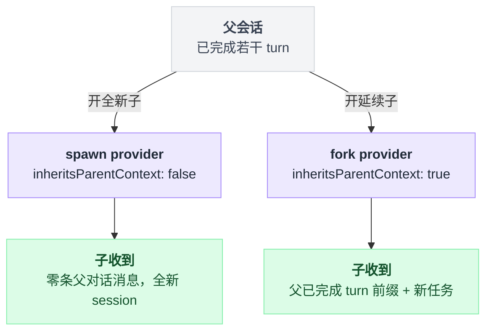

# subagent-spawn-in-process

> `@deepseek-ai/dsh-subagent-spawn-in-process` · bundle：`base` · 配置树 id：`subagent-spawn-in-process` · v0.1.0-rc.5（commit `47f9438`）2026-08-14 核对

> ⚠️ **本篇未通过对抗式引用核验**：起草已完成，但逐条打开源码比对行号/字段名/英文引文的那一遍因会话额度耗尽未执行。文中 `path:line` 与配置字段请以源码为准，核验后本行会被移除。

**一句话**：往 `ctx.subagents` 上注册名为 `spawn` 的 provider——在当前进程里开一个**全新**子 Agent，自己的 session、零父对话历史，复用宿主的 agent factory 与 LLM/工具服务。

## 它在树上长什么样

```yaml
    - id: subagent-spawn-in-process
      name: '@deepseek-ai/dsh-subagent-spawn-in-process'
      config:
        providerName: spawn
```

`packages/bundle/base/cordis.patch.yml:295-298`。YAML 没写 `inject`，模块导出 `export const inject = ['subagents']`（`packages/subagent/subagent-spawn-in-process/src/index.ts:22`），`docs/config-catalog.md:2192` 记为 `Requires: subagents`。

源码里特意注明 `tools` **不注入**：子 factory 在 setup 期已经提供了它，写在这里只会平白改变本 provider 的 apply 时机（`src/index.ts:20-21`）。

## 它注册了什么

| 类型 | 名字 | 说明 |
|---|---|---|
| provider | `spawn`（`config.providerName`） | `ctx.subagents.registerProvider(...)`，`src/index.ts:62-64` |

没有工具、没有 prompt 段、**没有任何事件监听**（所以也谈不上 waterfall 拦截）。注册动作本身会让缝发出 `subagent/provider-added`，[tool-subagent](./dsh-tool-subagent.md) 靠这个事件决定何时挂载委派工具。

provider 对象两个静态面（`src/index.ts:41-46`）：

| 面 | 值 |
|---|---|
| `capabilities` | `{ outputSchema: true, depthLimit: true, toolFilter: true, persona: true }` |
| `inheritsParentContext` | `false` |

四个能力全支持，理由是「it controls the child's creation window and can enforce all four features」。`inheritsParentContext: false` 会直接改变模型看到的工具描述文案——见 [tool-subagent](./dsh-tool-subagent.md)。

方法只有两个：`start()` 把请求原样丢给共享的 `startInProcessRun(request, {})`，不带 seed（`src/index.ts:48-53`）；`prepareContinuable()` 返回空对象 `{}`，因为新开的子没有种子可贡献，后续一切由 continuation manager 拥有（`:55-59`）。**有 `prepareContinuable` 就等于有可续能力**，这是缝的能力判定方式，所以 base 里 `tool-subagent` 能对它设 `backgroundMode: continuable`。

## 配置项

| 字段 | 类型 | 默认值 | 作用 |
|---|---|---|---|
| `providerName` | `string` | `spawn` | 在 `ctx.subagents` 上的注册名 |

定义在 `src/index.ts:30-32`；base 显式写了 `spawn`，与默认值一致。

## 模型看得见什么

- **子侧**：新子逐字收到那份独立任务内容，默认继承父的 model 与 workspace，看到全局 prompt 加上配置的子作用域 persona 影子。工具过滤会移掉该子的全局 wire schema、可执行体查找和 Code Mode SDK 绑定，但不影响独立注册的 guidance。它拿到的父对话消息是**零条**；过滤是可见性/组合，不是从父继承来的授权。
- **父侧**：只通过 [tool-subagent](./dsh-tool-subagent.md) 间接可见——父拿到的是子的最终输出或 stop-reason 错误。
- **KV cache**：与父的请求缓存互相独立；子历史只追加，而 persona、tool filter、生成的 SDK、provider 或 model 变了就换一条子前缀。

## 什么时候你会想换掉它 / 怎么换

这是 base 的默认后端，`tool-subagent`（`subagent` 工具）和 [tool-ralph](./dsh-tool-ralph.md) 都默认指向它，一般不动。两个 provider 从同一个父分岔出去，子侧拿到的东西完全不同：



会动的场景：

- 想让子**看得见**父已完成的对话 → 用 [fork provider](./dsh-subagent-fork-in-process.md)，base 已经并行装好了。
- 想让子跑在别的进程/别的产品里 → 换成 `-acp` / `-codex` / `-claude-code` / `-dsh-sdk` 之一，再新开一个 `tool-subagent` 实例绑过去。
- 想并存两套 spawn 参数 → 再挂一行本插件、改 `providerName`（比如 `spawn-lite`），然后新开一个 `toolName` 不同的委派工具。

## 坑与边界

- **fresh 意味着没有父的 transcript**——子继承 cwd、lineage、model 和显式配置的 persona/工具限制，但**一条父对话都不继承**；需要已完成 turn 的上下文时用 fork。
- 启动失败不会留下已发布的子；fulfillment 之后卸载 provider 也不会撤销已经交给持有者的 run（README「Behavior」）。
- 深度检查、persona 与 tool-filter 安装、结构化输出、必需 signal 的取消、一次性执行、结果读取和静默销毁**都不在本包**，全部由共享的 in-process driver 负责，读源码时别在这里找。

## 未确认

- ⚠️ `startInProcessRun` 的具体行为来自 `@deepseek-ai/dsh-subagent-in-process-driver`（本组之外），本篇只据 README 与调用点转述，未逐行核对该包。
