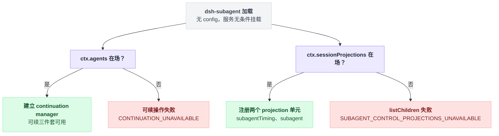
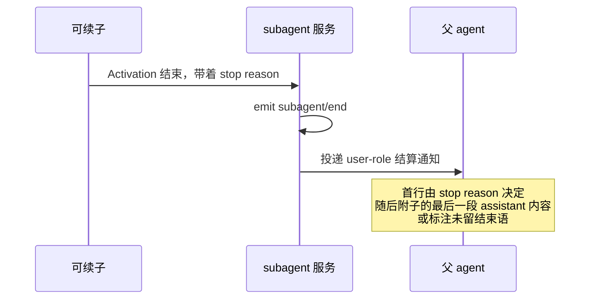

# subagent

> `@deepseek-ai/dsh-subagent` · bundle：`base` · 配置树 id：`subagent` · v0.1.0-rc.5（commit `47f9438`）2026-08-14 核对

> ⚠️ **本篇未通过对抗式引用核验**：起草已完成，但逐条打开源码比对行号/字段名/英文引文的那一遍因会话额度耗尽未执行。文中 `path:line` 与配置字段请以源码为准，核验后本行会被移除。

**一句话**：子 agent 能力缝本体——按名字注册的 provider registry，加上一次性子 agent 的 `start()`、可续子 agent 的 continuation manager、写进子会话日志的持久 descriptor，以及不依赖任何 query 服务的子/后代枚举。

## 它在树上长什么样

```yaml
    - id: subagent
      name: '@deepseek-ai/dsh-subagent'
```

配置树里就这两行，出处 `packages/bundle/base/cordis.patch.yml:292-293`。

没有 `config`，YAML 里也没有 `inject`——模块本身不导出 `inject`，服务无条件挂载。

但它有两块能力是可选的，靠内部注入各自补上：

```
加载 dsh-subagent:
    无条件挂载 ctx.subagents

    ctx.inject(['agents']) 拿到了吗?
        拿到 → 建 continuation manager               // 可续那一套才有着落

    ctx.inject(['sessionProjections']) 拿到了吗?
        拿到 → 注册 subagentTiming、subagent 两个 projection 单元
```

两个判定各走各的，缺一个不影响另一个。出处：continuation manager 见 `packages/subagent/subagent/src/index.ts:186-196`，projection 单元见 `:197-200`；base 里 `session-projection` 那行在 `packages/bundle/base/cordis.patch.yml:126`。

与 [bash 那种「一个 context 只能有一个执行器」的缝](./dsh-tool-bash.md) 不同，这里**多个 provider 共存**，按名字取用。base 里同时注册了 [`spawn`](./dsh-subagent-spawn-in-process.md) 和 [`fork`](./dsh-subagent-fork-in-process.md) 两个。取用逻辑在 `packages/subagent/subagent/src/index.ts:6-10`。

## 它注册了什么

| 类型 | 名字 | 说明 |
|---|---|---|
| service | `ctx.subagents` | `SubagentRuntime`，`packages/subagent/subagent/src/index.ts:129-133`、`:171` |
| 事件（发） | `subagent/provider-added`（emit） | provider 进注册表，声明在 `src/index.ts:140` |
| 事件（发） | `subagent/provider-removed`（emit） | provider 出注册表，`src/index.ts:146`；走 contained dispatch |
| 事件（发） | `subagent/start`（emit，按委派父 agent 作用域过滤） | 子已发布，`src/index.ts:157` |
| 事件（发） | `subagent/end`（emit，同一 carrier） | 子已落定，`src/index.ts:166` |
| 事件（收） | `agent/disposed`（emit） | 清理 closingScopes，`src/continuation.ts:379` |
| 事件（收） | `agent/inbox/claimed`（emit） | 子 inbox 认领即唤醒 Activation，`src/continuation.ts:1053` |
| 事件（收） | `agent/inbox/discarded`（emit） | 同上，`src/continuation.ts:1058` |
| projection 单元 | `subagentTiming`、`subagent` | `src/projection.ts:44-46`、`:142-144` |
| 会话事件词表 | `subagent/descriptor` | 版本 2，log-only、无 `surfaceOp`、不进模型历史，`src/descriptor.ts:37`、`:47` |
| 子作用域 prompt | `subagent:delegation`（context，order 120） | 每个进程内子 agent 都带，`src/child-agent.ts:170` |

派发模式全部是 `emit`，**没有 waterfall**：这个包不拦截任何东西。四个 `subagent/*` 的生产者与消费者记在 `docs/event-producer-consumer.md:48-51`。

服务 API 的主要面，行号都在 `src/index.ts`：

| 面 | 方法 | 行号 |
|---|---|---|
| provider 注册表 | `registerProvider` / `getProvider` / `list` | `:369`、`:392`、`:400` |
| 一次性 | `start` | `:414` |
| 可续三件套 | `startContinuable` / `followup` / `reportFrom` | `:212`、`:231`、`:270` |
| 其余单件 | `interrupt` / `registerContinuableSetup` / `drainContinuableDescendants` | `:255`、`:286`、`:304` |
| 枚举 | `listChildren` / `listDescendants` | `:339`、`:358` |

## 配置项

无配置项。行为完全由「注册了哪些 provider」和「`agents` / `sessionProjections` / 会话持久化是否在场」决定。

两块可选能力各自独立判定，缺了各有各的报法：

| 缺什么 | 后果 | 出处 |
|---|---|---|
| 没有 `ctx.agents` | 没有 continuation manager，所有可续操作以 `CONTINUATION_UNAVAILABLE` 失败 | `src/index.ts:458-465` |
| 没有 projection registry | `listChildren()` 以 `SUBAGENT_CONTROL_PROJECTIONS_UNAVAILABLE` 失败 | README「Collection model」一节 |



## 模型看得见什么

两处，都来自 README 的 Model Experience。

**一、结算通知（settlement notice）**

可续子的 Activation 一结束，父就收到一条 user-role 消息。这条消息是这么拼出来的：

```
可续子的 Activation 结束(stop_reason):
    emit subagent/end

    首行 ← 由 stop_reason 决定
        // completed 时是这句：
        // Background subagent <child-id> finished and will do no further work unless you send it more.

    if 子留下了最后一段 assistant 内容:
        正文 ← "Its closing message:" + 那段内容
    else:
        正文 ← "It left no closing message."

    以 user-role 消息投给父
    来源标 { kind: 'subagent-settled', form: 'notice', senderSessionId: <child-id> }
```

那个来源标记是有用途的：它把这条消息与子自己写的 `subagent-report` 区分开，「a transcript never credits the child with words the runtime wrote」。

这是本服务在父侧唯一的直接贡献。首行文案见 `src/continuation.ts:291-311`。

这条链路谁先谁后：



**二、子的委派范围声明**

每个进程内子的 runtime-context 快照里带 `subagent:delegation` 一段，告诉它三件事：权限在启动时就定死，需要审批的操作会被自动拒绝，超范围时应当在回复里说明限制而不是重试。

## 什么时候你会想换掉它 / 怎么换

基本不换。它是 Service Definition，换掉等于把整个子 agent 子系统摘掉——`tool-subagent`、`tool-subagent-control`、`tool-subagent-report` 全部失去 `inject` 依赖而不激活。

要调整行为，动的是它下面的 provider 和上面的工具：

- 想换传输：加载别的 provider 包（`-acp`、`-codex`、`-claude-code`、`-dsh-sdk`，见 `packages/subagent/README.md:13-16`），再给 [tool-subagent](./dsh-tool-subagent.md) 起一个新 `toolName` 实例指过去。
- 想给可续子加能力：用 `registerContinuableSetup()`，[tool-subagent-report](./dsh-tool-subagent-report.md) 就是这么把 `report` 装进每个可续子作用域的。
- 想关掉发现能力但保留投递：只禁用 [list-agents](./dsh-tool-subagent-control--list-agents.md) 那一行。

## 坑与边界

- **ACP 子仍是一次性、且不进枚举**——远端 run 在父的会话语料里没有本地子会话，`SubagentRun.localAgent` 是 `undefined`。
- **没有 host-user 续话**——`followup()` 要求「exact live direct parent」；只有 `interrupt()` 接受人类的持久父地址权限，因为停一个 turn 是幂等且不投递内容的。
- **不能打断进行中的 turn**——续话消息和唤醒式 report 一律排成后续 FIFO turn。
- **取消收敛期的唤醒缺口**——interrupt 信号发出后、driver 变 idle 前被接受的唤醒式 followup 会一直排队，直到下一次唤醒发送；issue #1838。
- **residency 是进程本地的**——Activation inbox 与所有权图不跨进程协调，两个 harness 进程共用一份持久化仍需要持久 mailbox 和跨进程租约。
- **已接受但未落日志的消息不会重放**——崩溃可能丢掉一条已接受的初始 prompt 或 followup。
- **report 没有持久 mailbox**——只保证「被接受」的身份，不是恰好一次投递，也没有读回执。
- **生命周期事件只能观察**——`subagent/end` 上没有可以影响 run 的续接或决策 API。

源码侧还有两处直接抛错的地方：

```
registerProvider(name, provider):
    if name 已在注册表:  throw DUPLICATE_PROVIDER        // src/index.ts:373-375

start(...):
    先做能力检查                                          // 在子创建之前做
    缺任何一个           →  throw UNSUPPORTED_CAPABILITY  // src/index.ts:481-496
```
