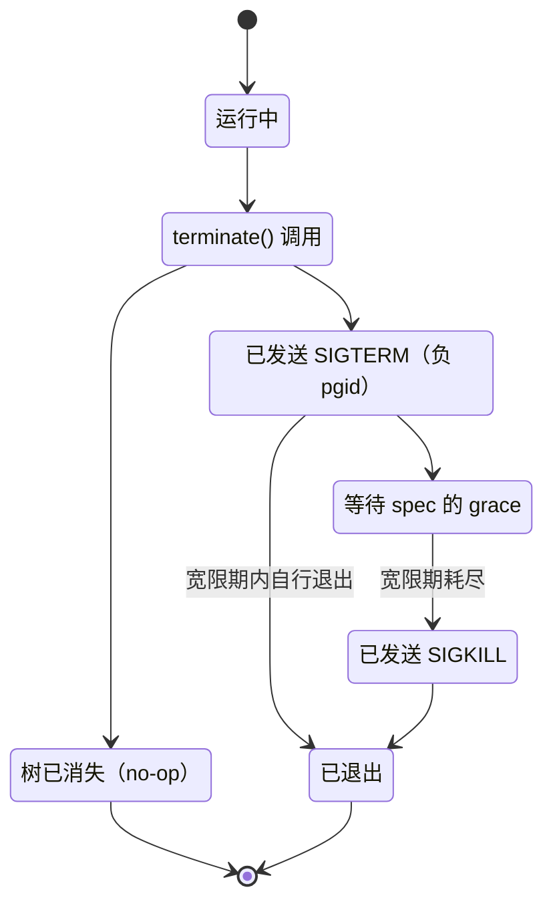

# subprocess-local

> `@deepseek-ai/dsh-subprocess-local` · bundle：`base` · 配置树 id：`subprocess` · v0.1.0-rc.5（commit `47f9438`）2026-08-14 核对。出处收在文末脚注。

**一句话**：`ctx.subprocess` 的本地实现——这棵树上所有子进程（shell 命令、ripgrep、LSP server、PTY 会话）最终都从这里 spawn；它负责分离进程树、平台正确的整树终止、有界输出收集与 spill、凭据擦洗，以及退出时的兜底清理。

## 它在树上长什么样

```yaml
- id: subprocess
  name: '@deepseek-ai/dsh-subprocess-local'
```

**配置树 id 是 `subprocess`，不是 `subprocess-local`**——`--dump-config` 里看到的就是 `subprocess`。这一点第一次翻配置的人很容易对不上号。

没有 `inject`、没有 `config`，两者都是刻意的。README 原文：「It has no config: every disposition, limit, terminal dimension, grace, and directory arrives from the calling capability seams」[^1]。

## 它注册了什么

| 类型 | 名字 | 说明 |
|---|---|---|
| service | `ctx.subprocess` | `LocalSubprocessRuntime extends SubprocessRuntime`，基类 `super(ctx, 'subprocess')`[^2]；一个 context 只允许一个实现，挂第二个会抛[^3] |
| 进程钩子 | Node `exit` 监听器 | 构造时经 `ctx.effect` 用 `prependListener` 在 Node 的 `exit` 事件上挂一个前置监听器，dispose 时先 await 正常清理再摘掉[^4] |
| 事件监听 | 无 | 不参与 cordis 事件总线 |

它要落地的抽象方法只有三个：`resolveExecutable()`、`spawn()`、`spawnTerminal()`[^5]。下面「关键行为」讲的全部内容，都挂在这三个方法和一个 exit 监听器上。

## 配置项

**无配置项。**

它的行为完全由调用方在 spec 上给：超时、宽限、输出上限、spill 上限、终端行列数、工作目录、stdio disposition，一律来自各能力接缝自己的配置。落到 shell 这一侧，就是 [bash-sandbox](./dsh-bash-sandbox.md) / [pwsh-sandbox](./dsh-pwsh-sandbox.md) 继承来的 `timeoutMs` / `maxOutputBytes` / `maxSpillBytes` / `graceMs`。

它也被列在配置总表「Loadable plugins with no config」那一组里[^6]。

## 关键行为

一句话地图：**分离进程树 → 整树终止 → 有界收集加 spill → 擦洗环境 → 偏移量读取 → 可执行查找 → 终端 → 两级清理。** 其中真正反直觉的只有三处：collect 模式保留的是尾部而不是头部、含分隔符的相对路径会被直接拒绝、宿主退出时的清理**不声称**已经静默。其余都是把平台差异抹平的例行工作。

### 进程树与终止

POSIX 上子进程按 `detached` 起，自己占一个进程组，发信号时用负 pgid 打整组，失败才回落到直接子进程；Windows 上走 `taskkill /PID <pid> /T /F`。

`terminate()` 是句柄**唯一**的终止动词，没有第二个入口：

```
terminate(handle):
    if 整树已消失:  return            // no-op，不报错
    向 -pgid 发 SIGTERM               // Windows: taskkill /PID <pid> /T /F
    等 spec 给的 grace
    if 还活着:      发 SIGKILL
```

配套的 `waitForExit()` 轮询的是**整棵树**的存活，不是顶层进程——所以调用方拆解时确认到的是真正的静默，而不是「领头的死了、后代还在」[^7]。

`terminate()` 内部的状态流转：



### 输出：三种 disposition

| disposition | 做什么 |
|---|---|
| `'pipe'` | 原始流原样交给调用方，协议分帧归消费者 |
| `'inherit'` | 透传父进程的描述符 |
| collect | 有界收集，超出上限保留**尾部**；配了 spill 上限时完整流另存私有临时文件 |

collect 保留尾部而不是头部，理由是错误和结果都堆在末尾——这条是照搬 pi/OpenCode 的判断[^8]。

### spill 文件的四条规矩

spill 文件是 `0600`、随机名，放在一个惰性创建的 `0700` per-process 目录下。

```
写入时:
    if 流超过 spill 上限:
        丢弃已经不完整的 spill 文件
        只返回标记为截断的尾部
结算时:
    封 fd
    if 最终 close 失败:
        不给出路径          // 宁可什么都不给，也不给一个不完整的文件
```

最后那条是这段代码的态度：**给不出完整文件时，返回「没有」比返回「一个残缺的路径」安全。**[^9]

### 环境：两轮擦洗

```
childEnv(spec):
    env = process.env
    删掉所有名字命中凭据形状的                 // SENSITIVE_ENV_PATTERN
    删掉所有 DSH_* 开头的                      // 全部，一个不留
    合入 spec 显式给的 env
    return env
```

凭据判据是一条正则，命中名字里出现 `KEY`、`PASSWORD`、`SECRET`、`TOKEN` 四个词根之一就算命中（内部叫 `SENSITIVE_ENV_PATTERN`）。

两种擦洗都大小写不敏感，原因不是洁癖——Windows 的环境变量名本身大小写不敏感，只匹配大写会漏[^10]。

### 读取是基于偏移量的

collect 模式的读**基于偏移量**，服务自己不持游标。

这带来一个具体的好处：「调用方持游标的增量读」（bash 的后台读路径走的就是这条）与「整流重读」可以并存，而且结算前后都可以[^11]。

### 可执行查找：宁可炸也不猜

```
resolveExecutable(name):
    if 绝对路径:            直接校验
    if 裸名:                走擦洗后的 PATH + 平台扩展名
    if 含分隔符的相对路径:   直接拒绝            // 接缝处就拒，不往下走
```

第三条不是没实现，是刻意不做：相对路径的解析基准未定义，**宁可炸也不猜**[^12]。

### 终端

`spawnTerminal` 分配 `node-pty`，桥接 UTF-8 文本，检查并向当前前台进程组发信号；终止时在杀掉顶层 shell 的**前后各扫一遍**后代[^13]。

### 两级清理

第一级是正常拆解：服务保留着活句柄，自己 dispose 时对每棵仍在跑的树升级终止，并 await 它退出[^14]。

第二级是宿主退出兜底。effect 活跃期间挂着的那个 `exit` 监听器会**同步**强杀所有还在活集合里的普通树与终端会话——POSIX 发 SIGKILL，Windows 跑 `taskkill /T /F`。

这个监听器有三条自我约束：**不创建任何 promise 或 timer**（保留宿主的退出码与诊断）、逐个目标包住失败、**不声称已静默**。最后一条是关键——它只是尽力杀，不承诺杀干净[^15]。

## 模型看得见什么

**没有直接可见面。** 它不注册工具、不注册 prompt 段、不产生任何模型可见文本。

README 的 Model Experience 一节原文是「Indirectly, through Consumers (today the bash executor family behind `dsh-tool-bash`), which own all model-facing rendering of process output and lifecycle.」[^16]，KV cache 那一节写的是「No direct invalidation」[^17]。

所以模型看到的截断标记、spill 路径、退出码，全部是 [tool-bash](./dsh-tool-bash.md) / [tool-pwsh](./dsh-tool-pwsh.md) 渲染出来的。

## 什么时候你会想换掉它 / 怎么换

基本不会。

它是本地部署下 `ctx.subprocess` 的唯一实现，被 bash 执行器家族、LSP、PTY 后端、ACP subagent 后端共同依赖[^18]，`tool-fs-search` 打包的 ripgrep 也走它[^19]。

真要换只有一种场景：**把执行世界搬到远端。** 那需要一个自己实现 `resolveExecutable` / `spawn` / `spawnTerminal` 的 provider，并且要注意接缝的硬约束——「可执行路径与挂载的文件系统 provider 属于同一个执行世界」[^20]。

换法本身很轻：把配置里那一行的 `name` 换掉即可，因为消费者只 `inject: ['subprocess']`。

## 坑与边界

**Windows 整树支持是尽力而为。** 终止走 `taskkill /PID <pid> /T /F` 且所有结果都被包住（树不存在、竞态、二进制缺失），存活性判断回落到直接子进程边界[^21]。

**终端进程检查只有 Linux/macOS。** 没有支持的平台实现时，终端原语直接失败；Linux 的精确探测覆盖 x64 与 arm64，macOS 用 `ps` 快照[^22]。

**守护化的终端后代仍可能逃逸。** macOS 上在任何前台快照之前就 reparent 的子进程，从 `node-pty` 根不可发现；Linux 上调用 `setsid` 的子进程同时离开进程树和被拥有的终端会话。本地 provider 不加持续的进程表监控[^23]。

**进程内清理依赖「JavaScript 可观测的退出」。** 这句话不抽象，展开就是一张分类表[^24]：

| 退出路径 | 结果 |
|---|---|
| `process.exit()`、默认的未捕获异常与未处理拒绝 | 触发 Node 的同步 `exit` 事件，清理生效 |
| 未安装 handler 的 `SIGTERM` / `SIGINT` / `SIGHUP` | 走 OS 默认处置，**绕过**该事件 |
| `SIGKILL`、致命 OOM、`process.abort()`、原生崩溃、断电 | 必须靠外部 supervisor / 容器 init |

**凭据擦洗是名字启发式。** 只认 `*KEY*`/`*PASSWORD*`/`*SECRET*`/`*TOKEN*`，`*PASSPHRASE*` 之类会漏；被误擦的变量的白名单是待办[^25]。

**完成的 spill 文件不删。** 有界的完整输出恢复文件（以及那个私有 per-process 目录）会在系统临时目录里堆积，直到外部有人清理；超限的不完整 spill 会立刻尝试删除，但删除失败仍可能留下一个有界文件[^26]。

## 相关

它是 [bash-sandbox](./dsh-bash-sandbox.md) 与 [pwsh-sandbox](./dsh-pwsh-sandbox.md) 的 `inject` 依赖，两者的声明都是 `static override inject = ['subprocess', 'sandbox', 'sandboxPolicy']`。

[shell-env](./dsh-shell-env.md) 收集的 `DSH_*` 快照，最终由这里的 `childEnv()` 在擦洗之后合入[^27]。

模型侧的呈现归 [tool-bash](./dsh-tool-bash.md) / [tool-pwsh](./dsh-tool-pwsh.md)。

---

## 出处

[^1]: 「没有 inject、没有 config」印证于树上那一行：`packages/bundle/base/cordis.patch.yml:163-164`；README 引文见 `README.md:5`。
[^2]: 本地实现类继承 `SubprocessRuntime` 并经基类构造注册：`packages/subprocess/subprocess-local/src/index.ts:37`、`packages/subprocess/subprocess/src/index.ts:104`。
[^3]: 一个 context 只允许一个 `ctx.subprocess` 实现，重复挂载会抛错：`docs/subsystems/subprocess.md:280`。
[^4]: exit 监听器的挂载与摘除：`src/index.ts:47-60`。
[^5]: 三个抽象方法行号（均在 `src/index.ts`）：`resolveExecutable()` 104-135、`spawn()` 146-157、`spawnTerminal()` 161-184。
[^6]: `docs/config-catalog.md:3085`；所在分组「Loadable plugins with no config」标题在同文件 `:3024`。
[^7]: 进程树按 `detached` 起、发信号用负 pgid、Windows 走 `taskkill`，以及 `waitForExit()` 轮询整棵树而非顶层进程：均见 `README.md:9`。
[^8]: collect 保留尾部而非头部、理由为"结果堆在末尾"、判断照搬 pi/OpenCode：`README.md:10`。
[^9]: spill 文件权限、per-process 目录、写入/结算两段规矩、"给不出完整文件时返回没有更安全"：均见 `README.md:10`。
[^10]: 环境擦洗大小写不敏感的原因（Windows 环境变量名本身大小写不敏感）：`packages/subprocess/subprocess/src/index.ts:44, 60-66`。
[^11]: 偏移量读取支持增量读与整流重读并存：`README.md:12`。
[^12]: 含分隔符的相对路径直接拒绝，理由是解析基准未定义：实现见 `src/index.ts:113-117`。
[^13]: 终端信号检查与终止时机（顶层 shell 前后各扫一遍后代）：`README.md:14`。
[^14]: 正常拆解阶段对每棵仍在跑的树升级终止并 await 退出：`src/index.ts:79-102`。
[^15]: exit 监听器三条自我约束（不建 promise/timer、逐个包住失败、不声称已静默）：`README.md:16`、`src/index.ts:62-77`。
[^16]: Model Experience 原文：`README.md:20`。
[^17]: KV cache 一节原文「No direct invalidation」：`README.md:24`。
[^18]: 作为 `ctx.subprocess` 唯一实现被 bash 执行器家族、LSP、PTY 后端、ACP subagent 后端共同依赖：`docs/subsystems/subprocess.md:5`。
[^19]: `tool-fs-search` 打包的 ripgrep 走它：`docs/tool-catalog.md:27`。
[^20]: 「可执行路径与挂载的文件系统 provider 属于同一个执行世界」：`docs/subsystems/subprocess.md:284`。
[^21]: Windows 整树终止走 `taskkill /PID <pid> /T /F`，结果被全部包住，存活性判断回落到直接子进程边界：`README.md:28`。
[^22]: 终端进程检查平台覆盖（Linux x64/arm64 精确探测，macOS 用 `ps` 快照）：`README.md:29`。
[^23]: 守护化终端后代逃逸的两种路径（macOS reparent、Linux setsid）：`README.md:30`。
[^24]: 三种退出路径与清理结果的分类：`README.md:31`。
[^25]: 凭据擦洗只认名字启发式、白名单待办：`README.md:32`。
[^26]: 完成的 spill 文件不清理、超限不完整 spill 删除失败仍可能留下有界文件：`README.md:33`。
[^27]: `shell-env` 收集的 `DSH_*` 快照由 `childEnv()` 在擦洗后合入：`src/spawn.ts:37-47`。
