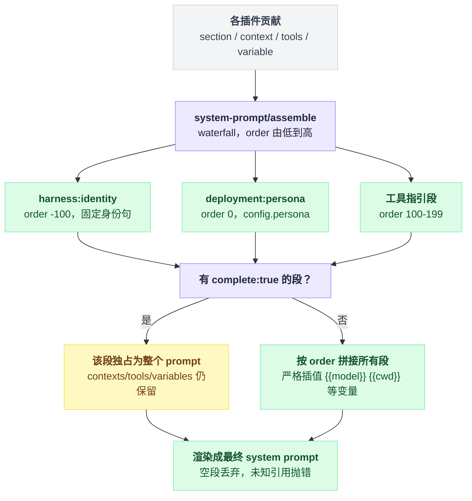

# system-prompt

> `@deepseek-ai/dsh-system-prompt` · bundle：`base` · 配置树 id：`system-prompt` · v0.1.0-rc.5（commit `47f9438`）2026-08-14 核对

**一句话**：system prompt 的装配注册表——插件往里塞有序 section、工具 schema 和具名变量，[agent-loop](./dsh-agent-loop.md) 每个 step 装配一次并渲染成完整 prompt；它自己拥有固定的 harness 身份句和全局部署 persona。

这个包的名字容易让人以为里面躺着一大段写死的 prompt 文本。其实它写死的只有一句话（那句 harness 身份句），剩下全是别人塞进来的——它是个注册表，不是个模板文件。

## 它在树上长什么样

```yaml
- id: system-prompt
  name: '@deepseek-ai/dsh-system-prompt'
  config:
    persona: ''
```

base 层刻意把 persona 留空，理由是"部署人格是部署方的选择"。

两个 mode bundle 则各自重述了完整值，而且用的是同一句：

```yaml
- id: system-prompt
  config:
    persona: >-
      You are a coding agent powered by the {{model}} model. Your working directory is {{cwd}}.
```

`{{model}}` / `{{cwd}}` 这两个变量不归本包，由 [agent-loop](./dsh-agent-loop.md) 注册。persona 是模板，不是纯文本——未知的引用、或者已注册但无值的引用，都会**严格抛错**，而不是悄悄渲染成空字符串。

出处：base 那段见 `packages/bundle/base/cordis.patch.yml:429`，留空的注释在 `:427`–`:428`；两个 mode 分别是 `packages/bundle/web-app/cordis.patch.yml:16` 与 `packages/bundle/headless/cordis.patch.yml:7`；变量注册在 `packages/core/agent-loop/src/index.ts:351`–`:353`；严格抛错见 `README.md:36`。

## 它注册了什么

| 类型 | 名字 | 说明 |
|---|---|---|
| service | `ctx.systemPrompt`（`SystemPrompt`） | `src/index.ts:338`、`:354` |
| prompt 段 | `harness:identity`，order `-100` | 文本恒为 `You are an AI agent powered by DeepSeek Harness.`；`includeHarnessIdentity: false` 时不注册（`src/index.ts:357`–`:362`） |
| prompt 段 | `deployment:persona`，order `0` | 取 config 的 `persona`（`src/index.ts:364`–`:369`；名字/order 常量在 `:128`、`:131`）；空串在渲染时被丢弃（`README.md:13`） |
| runtime context 抑制 | `includeRuntimeContext: false` ⇒ `suppressRuntimeContext()` | `src/index.ts:370` |
| 事件声明 + 派发（**waterfall**） | `system-prompt/assemble` | 声明 `src/index.ts:31`、派发 `:532`–`:533`；scope 过滤 |
| 事件声明 + 派发（emit） | `system-prompt/change` | 注册表变动时发（`src/index.ts:37`、`:349`），不做 scope 过滤（`README.md:29`） |

`system-prompt/assemble` 是**改 prompt 的正门**：它能改 sections、tools、variables，运行在 complete-section 约束生效之前。

已知监听方只有三个：本包自己、[agent](./dsh-agent.md)（`installModelSelection` 用它把选定的 provider/model 写进变量）、以及 `agent-presets`（`docs/event-producer-consumer.md:52`）。

### 服务面

| 方法 | 作用 |
|---|---|
| `section(section)` | 贡献有序段；层 = 调用方 scope，`agent.ctx` 只影响那一个 agent 并遮蔽同名全局段 |
| `context(context)` | 贡献动态 runtime context，每次装配求值一次 |
| `suppressRuntimeContext()` | 抑制该 scope 的全部动态 context，多次注册独立叠加 |
| `tools(provider)` | 贡献工具 schema；返回 `{ schemas, knownNames? }` |
| `variable(name, provider)` | 贡献 `{{name}}` 变量；scoped 变量遮蔽同名全局变量 |
| `assemble(context?)` | 装配一次，跑完 waterfall 后再落 complete-section 与 suppressor 约束 |

出处 `README.md:20`–`:25`。

section 的 order 是分带约定的，记住三个数就够：

| order | 归谁 |
|---|---|
| `-100` | harness 身份句 |
| `0` | 部署 persona |
| `100–199` | 工具指引 |

出处 `README.md:34`。

## 配置项

| 字段 | 类型 | 默认值 | 作用 |
|---|---|---|---|
| `includeHarnessIdentity` | `boolean` | `true` | 是否加那句 order `-100` 的固定开场白 |
| `includeRuntimeContext` | `boolean` | `true` | 为 `false` 时 context provider 根本不求值，连 waterfall 监听者加的 context 也在事后丢弃；其它服务与其强制逻辑照常 |
| `persona` | `string` | `''`（base）/ 上面那句（web、headless） | 唯一由 config 编写的 prompt 片段，渲染成 order 0 的 `deployment:persona`；空 ⇒ 渲染时丢弃 |
| `toolOrder` | `string[]` | 省略（⇒ 按名字字典序） | 显式的模型可见工具顺序，必须恰好含一个 rest 条目 `<unlisted-tools>`（`TOOL_ORDER_REST`，`src/index.ts:140`） |

schema 默认值在 `src/index.ts:339`–`:345`。

注意 `toolOrder` 的默认值是"省略"而不是"空数组"，这不是笔误：源码注释给的理由是空数组缺 rest 标记（`src/index.ts:343`）——一个 `[]` 是非法配置，所以只能用"未设置"这个状态来表达默认。

## 模型看得见什么

一句话：身份句 → persona → 按 order 排列的插件段，全部经过严格变量插值。

```
sections, contexts, tools, variables = 各插件贡献的东西
派发 system-prompt/assemble（waterfall），监听方可以改上面四样

if 存在 section 声明 complete: true:
    prompt = 该段独占            // contexts / tools / variables 仍然保留
else:
    prompt = 按 order 从低到高拼接所有段

渲染 prompt：严格插值 {{…}}，空段丢弃，未知引用抛错
```

空段消失；scoped 段和变量可以为单个 agent 遮蔽全局值。`complete: true` 那条分支值得单独记一下：它抢走的只是**文本**，waterfall 产出的 contexts、tools、variables 一样不少（`README.md:55`）。

从贡献到落地渲染，走的是这条装配管线：



固定开场白的原文就这一行：

```markdown
You are an AI agent powered by DeepSeek Harness.
```

出处 `README.md:60`，实现在 `src/index.ts:361`。

### renderPrompt 有多严

严到什么程度值得列个表，因为"严"和"透传"两种行为混在一起，只看散文容易记反：

| 写法 | 行为 |
|---|---|
| 未知引用 | 抛错 |
| 已注册但无值的引用 | 抛错 |
| 残缺的 `{{…}}` 组 | 抛错 |
| `{{{model}}}` 这种后面还跟着 `}}` 的畸形写法 | 抛错 |
| 孤零零一个 `{{`，后面再无 `}}` | 原样透传 |
| 替换进来的值本身含 `{{…}}` | 不会被二次扫描 |

设计理由原话是 "fail loud beats shipping a malformed prompt"。出处 `README.md:36`。

### token / KV cache

身份句是启用时的固定每请求开销；persona 与插件文本按渲染内容逐请求重复。

只要身份、persona、变量、段文本与顺序这几样渲染结果一致，前缀就稳定；反过来，任何改动都可能从第一个变化的 token 起让 KV cache 失效（`README.md:65`、`:69`）。

## 什么时候你会想换掉它 / 怎么换

答案是不会。它被一大批插件硬 inject：tools（`packages/core/tools/src/index.ts:788`）、agent-loop（`packages/core/agent-loop/src/index.ts:297`）、tool-fs（`packages/fs/tool-fs/src/index.ts:22`）、tool-fs-search（`packages/fs/tool-fs-search/src/index.ts:70`）、tool-jobs（`packages/jobs/tool-jobs/src/index.ts:22`）等等，不存在"换掉"的场景，只有改配置。

四种需求各有各的改法：

- **改部署人格**：patch 这一行的 `persona`。
- **按 agent 改人格**：不要动这一行，改用 `@deepseek-ai/dsh-persona`。它复用本包导出的 `PERSONA_SECTION` / `PERSONA_ORDER`（`packages/preset/persona/src/index.ts:23`），在挂载它的 scope 上注册同名段（`:61`–`:66`）；源码注释要求那必须是 agent scope，否则会和注册表自身的 persona 注册冲突（`:56`–`:57`）。web profile 的 preset 就是这么写的（`apps/cli/config/agent-presets/standard/agent.cordis.yml:24`）。
- **固定工具顺序**：加 `toolOrder`，别忘了那一条 `<unlisted-tools>`。
- **兼容型部署要自己写完整 prompt**：`includeHarnessIdentity: false` + 一个 `complete: true` 的 section（`dsh-persona` 也有 `complete` 开关，`packages/preset/persona/src/index.ts:41`–`:42`）。

## 坑与边界

来自 `README.md:87`–`:90`：

- **部署方写的 prompt 文本只能来自 config / 组合**——没有面向最终用户的 prompt 编辑 API。

- **没有字面 `{{…}}` 的转义语法**——每个完整组都会被插值，转义要等真有 prompt 需要时再做。

- **`toolOrder` 配错在装配时才炸（第一个 turn），不是启动时**。这条最容易踩，因为它其实是两级校验，只有形状那一级在加载时把关：

  ```
  加载时：
      if toolOrder 缺 rest 条目 or 多个 rest 条目 or 有重复项:
          抛错                      // 形状违规，启动就死

  assemble() 时：
      if 列出的名字对不上真实工具:
          reject                    // 名字违规，拖到第一个 turn 才发现
  ```

  形状检查在 `src/index.ts:146`–`:155`，名字检查在 `:170`–`:173`。名字写错在 shipped loop 下的表现是：该 turn 在发请求之前就失败。

- **同 order 的 section 靠注册顺序 tie-break**——那是插件加载顺序的产物，确定性依赖"用不同 order 带"的约定，不像工具顺序那样被规范化。
