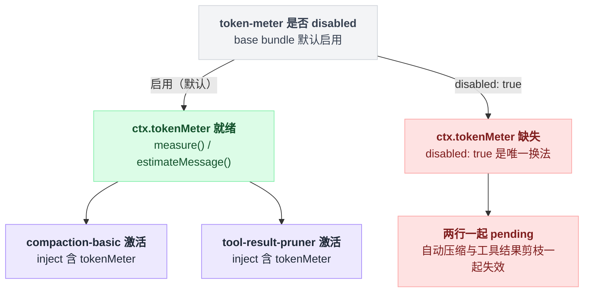

# token-meter

> `@deepseek-ai/dsh-token-meter` · bundle：`base` · 配置树 id：`token-meter` · v0.1.0-rc.5（commit `47f9438`）2026-08-14 核对

**一句话**：可重放的 token 计量服务 `ctx.tokenMeter`——按 session 独立地从持久日志折叠出"当前请求压力 + 逐节点表面定价"，让 compaction 之类的压力敏感插件共享同一套账，而不必依赖 `CompactionEngine`（`README.md:5`）。

## 它在树上长什么样

`packages/bundle/base/cordis.patch.yml:281`：

```yaml
- id: token-meter
  name: '@deepseek-ai/dsh-token-meter'
```

无 `config`、无 `inject`（包里没有 `static inject` / `export const inject`；`sessionProjections` 是可选子 fiber，不是硬依赖）。`web-app` 和 `headless` 都没有覆盖这一行。

它是 base 里两行的硬依赖，也是全仓库仅有的两个 `tokenMeter` 注入方：`compaction-basic`（`static inject = ['llm', 'tokenMeter', 'sessions']`，`packages/compaction/compaction-basic/src/index.ts:104`，bundle 行在 `:284`）和 `tool-result-pruner`（`static inject = ['tokenMeter']`，`packages/compaction/compaction-tool-result-pruner/src/index.ts:47`，bundle 行在 `:360`）。

这条 inject 链一旦断掉会连带两行一起失活，画出来比对照三处代码行号更直接：



## 它注册了什么

| 类型 | 名字 | 说明 |
|---|---|---|
| service | `ctx.tokenMeter`（`TokenMeter`） | `src/index.ts:74`、`:82` |
| 事件监听（emit） | `session/event` | `src/index.ts:95`。只对**已经有状态**的 session 同步（`if (this.states.has(session))`，`:96`），不给没人读过的 session 建状态 |
| session projection | `tokenUsage` | `src/usage-projection.ts:109` |
| session projection | `contextPressure` | `src/usage-projection.ts:165` |
| session projection | `contextBreakdown` | `src/breakdown-projection.ts:44` |
| 子入口 | `@deepseek-ai/dsh-token-meter/client` | 只导出浏览器安全的 projection 类型（`src/client.ts:7`） |

三个 projection 通过可选子 fiber 注册：`ctx.inject(['sessionProjections'], …)`（`src/index.ts:87`–`:91`）。没有这个注册表的组合里，计量服务本身照常工作，只是不产出 projection——README（`README.md:36`）：

```text
A composition without the projection seam keeps the measurement service's existing behavior.
```

卸载 token-meter 会一并移除这三个 key（同行）。服务面只有两个操作（`README.md:15`–`:16`）：

| 方法 | 语义 |
|---|---|
| `measure(session, requestHeader?)` | 同步一次并返回一份分离的、深度冻结的快照（`src/index.ts:116`）；`totalTokens` 是请求+响应压力，`surfaceTokens` 是纯表面启发式合计，且等于 `nodes[].tokens` 之和。传 `requestHeader` 只影响压力字段，表面字段永远描述当前 session |
| `estimateMessage(message)` | 用固定启发式给单条消息定价（`src/index.ts:155`） |

`logRevision` 是这次测量消费掉的持久事件数（`docs/subsystems/token-meter.md:5`；实现上取自 `state.consumedEvents`，`src/index.ts:140`）。

## 配置项

**无配置项**，而且是强制的：`TokenMeterConfig = Record<string, never>`（`packages/llm/token-meter/src/types.ts:12`，`docs/config-catalog.md` 里也只有这一行），构造时逐个 key 检查，任何 key 都抛 `TokenMeterConfig: unknown key "<key>" (no settings are supported)`（`src/index.ts:61`–`:65`，throw 在 `:63`）。

它的行为由一条写死的启发式决定：`four characters per token plus structural overhead for roles, blocks, and request-envelope fields`（`README.md:9`）。模型容量不归它管——那属于拥有具体 provider/model 路由的 adapter，从 `ctx.llm.resolveModelInfo().context` 读（同行）。

三个 projection 的口径值得记住（`README.md:28`–`:34`）：

- `tokenUsage`：整份持久日志的 `uncachedInputTokens` / `outputTokens` / `cacheReadTokens` / `cacheWriteTokens`；请求后来失败了 usage 也算，同一 `(turn, step)` 的最终 assistant usage 替换该样本而不是重复计。
- `contextPressure`：`pressureTokens`（最新 provider 报告的 prompt 大小，含 cache 读写，**不含**输出）、`projectedTokens`、`contextWindow`。占用率显示读的是 `projectedTokens`（`README.md:32`）。
- `contextBreakdown`：启发式的 `systemTokens` / `toolsTokens` / `messageTokens`，是**构成**而非账单尺寸；README 明确"三者不会加总成 `projectedTokens`……只能当近似构成展示，永远不要当总量"。

## 模型看得见什么

什么都看不见。README `Model Experience` 正文只有一句（`README.md:57`）：

```text
Indirectly, through consumers such as `dsh-compaction-basic`; the service itself adds no prompt, message, schema, tool, or model call.
```

KV cache 也没有直接影响，请求前缀的变化归那个具名消费者所有（`README.md:61`）。

## 什么时候你会想换掉它 / 怎么换

- **不要关**。它没有配置面，唯一的"换法"是 `disabled: true`；那样 `compaction-basic` 与 `tool-result-pruner` 两行会因缺少硬 inject 而不激活，自动压缩和工具结果剪枝一起失效。
- **想换计量口径**：本包只导出这一个服务，没有 provider 插槽。要换只能自己写一个提供 `ctx.tokenMeter` 的插件顶替这一行，并保持 `measure()` / `estimateMessage()` 契约。
- **需要精确的同边界数值**：README 的建议是在自己的请求边界上调 `measure()`，而不是去读 projection（`README.md:44`）。

## 坑与边界

来自 `README.md:65`–`:68`：

- **固定启发式是近似的**——没有可复用 provider usage 的内容按字符数加结构开销定价，不是 provider 的真实 tokenizer 或请求序列化器。
- **每次测量都克隆当前表面**——为了保证快照一致且不可变，读操作是 O(surface)，连"低于阈值"的压力检查也一样。
- **provider usage 只在请求信封逐字一致时可复用**——prompt、prefix、工具、provider、model 或 call config 任一变化都刻意回退到完整启发式估算。
- **缺失的 legacy source seq 按保守处理**——没有 `sourceEventSeqs` 的 assistant 消息分不清 provider 输出和监听器改写，折叠时不会声称自己知道那是空流还是精确的 chunk 流。

另外 README 单独用一节强调（`README.md:40`–`:42`）：占用率字段是各自独立的 last-wins 记录，**不是**对同一次请求的原子观测——切换模型时新容量会和上一条路由的样本配对，直到下一次请求报告 usage 为止。这被明确设计成"用户可见的参考数字，不是计费记录也不是门控输入"，harness 里没有任何决策读它，compaction 读的是 `measure()`。

## 未确认

- ⚠️ 上面所有关于运行时数值的描述都来自读源码与 README，没有实际跑过；`estimate.ts` 里"四字符一 token"的具体结构开销权重未逐项核对。
- ⚠️ `logRevision` 与 session 事件 `seq` 的数值关系（是否恰好等于下一个未读事件的 seq）未在源码中确认——`src/index.ts:140` 只表明它等于 `state.consumedEvents`。
