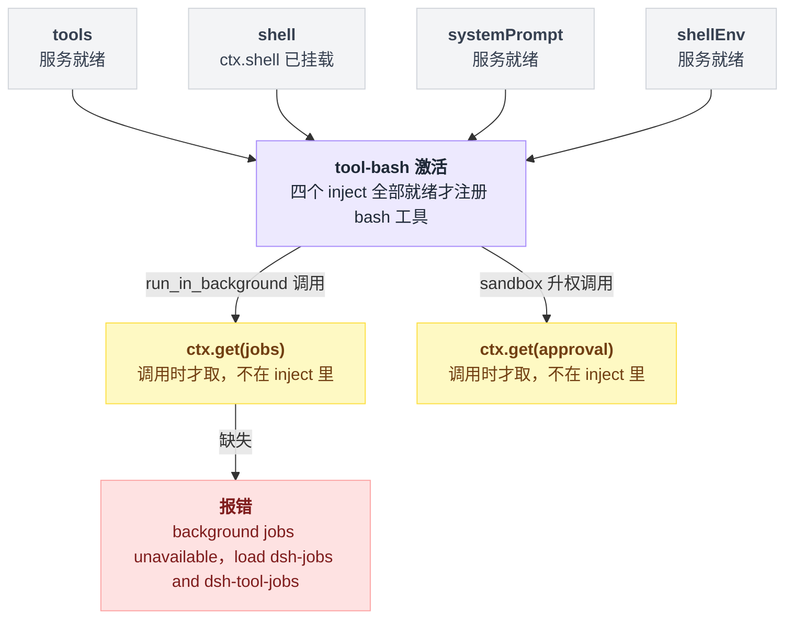
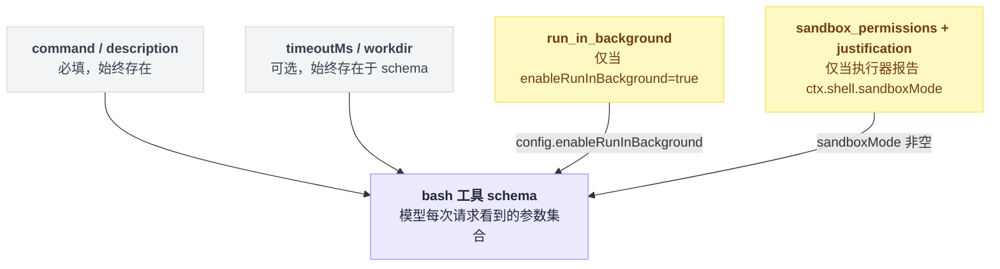

# tool-bash

> `@deepseek-ai/dsh-tool-bash` · bundle：`base` · 配置树 id：`tool-bash` · v0.1.0-rc.5（commit `47f9438`）2026-08-14 核对。出处收在文末脚注。

**一句话**：把 `ctx.shell` 执行器封装成模型可见的 `bash` 工具——负责参数校验、workdir 归属、沙箱升权审批、结果文本渲染，并把后台进程句柄适配进通用 `ctx.jobs` 运行时。

## 它在树上长什么样

```yaml
- id: tool-bash
  name: '@deepseek-ai/dsh-tool-bash'
  disabled: !!js process.platform === 'win32'
```

这一行既没有 `inject` 也没有 `config`。注入清单写在包里：

```ts
export const inject = ['tools', 'shell', 'systemPrompt', 'shellEnv']
```

四个服务全部就绪前，插件保持 pending。Windows 上整行禁用，那一侧由 [tool-pwsh](./dsh-tool-pwsh.md) 顶上[^1]。

web 档把它整行关掉，改由每个 session 自己挂 preset：

```yaml
- id: tool-bash
  disabled: true
```

注意这里是 `disabled` 而不是删除。base 是共享层，删掉的行会在某天有人重排组合时悄悄复活，这是留着这一行、只是禁用它的理由[^2]。

依赖分两档——四个 inject 是硬门槛，另有两个可选依赖不参与这道门槛、只在调用时才去要：



## 它注册了什么

| 类型 | 名字 | 说明 |
|---|---|---|
| 工具 | `bash` | `ctx.tools.register(defineTool(...))` 注册[^3] |
| prompt 段 | `tool:bash`（order 105） | 正文一句：`Check the [exit code: N] marker on every bash result; investigate failures before moving on.`[^4] |
| 事件监听 | 无 | 全包没有一处 `ctx.on` / `ctx.waterfall`，全仓事件总表里也没有它的行。逐调用的 allow/deny/ask 由 `tools/pre-execute`（waterfall，生产者是 `tools`，消费者是 hooks 家族与 `tool-jobs`）负责，不在本包[^5] |

模型看到的 schema 不是固定的，两个字段各自挂在不同的条件上：

```
schema = {
    command:      必填
    description:  必填
    timeoutMs:    可选，始终在
    workdir:      可选，始终在
}
if config.enableRunInBackground:
    schema += run_in_background
if ctx.shell.sandboxMode 被执行器报告:
    schema += sandbox_permissions   // 枚举 = ESCALATION_TARGETS
    schema += justification
```

`ESCALATION_TARGETS` 的值是 `['workspace-write', 'danger-full-access']`[^6]。



两个运行时可选依赖不写在 `inject` 里，而是调用时 `ctx.get`：

| 依赖 | 何时取 | 缺失时 |
|---|---|---|
| `jobs` | 走 `run_in_background` 时 | 报 `background jobs unavailable: load @deepseek-ai/dsh-jobs and @deepseek-ai/dsh-tool-jobs`[^7] |
| `approval` | 沙箱升权时 | —[^8] |

另有一条加载期硬校验，跟上面两条不同，它在加载时就把插件炸掉：执行器会限制但 `ctx.sandboxPolicy` 缺席，直接抛 `tool-bash: the mounted bash executor confines but ctx.sandboxPolicy is missing`[^9]。

## 配置项

| 字段 | 类型 | 默认值 | 作用 |
|---|---|---|---|
| `enableRunInBackground` | boolean | `true` | 关掉后 `run_in_background` 参数从 schema 里消失，且强行传入会在 execute 阶段被拒[^10] |

base bundle 没给它写 config，所以线上跑的就是默认值 `true`。

## 模型看得见什么

**系统提示**：上面那句 order 105 的固定文本，每个请求都在。README 明确它「Prefix-stable while the registration scope and prompt text are unchanged」，沙箱模式切换不会改动它[^11]。

**工具 schema**：`bash` 的定义。`run_in_background` 与 `sandbox_permissions`/`justification` 是条件字段，出现与否会改变前缀。

**前台结果文本**：三段拼起来。

```
text = stdout 尾部
if 有 stderr:                text += "[stderr] 段"
text += 标记行
if 输出为空:                 text = "(no output)"
if exitCode == 0 且无信号:   不产生退出标记
```

标记行原文精确为：

```
[output truncated; full output: <path-or-(unavailable)>]
[sandbox: file access denied under <mode> mode]
[timed out after <timeoutMs>ms]
[killed by signal: <signal>]
[exit code: <exitCode>]
```

这段拼装逻辑与 README 对渲染规则的说明一致[^12]。

**后台**：启动返回精确的 `started background job <jobId>`。此后的状态行、完成通知、列表、取消响应都归 `dsh-tool-jobs`[^13]。

**错误**：统一成 `Error: <message>`，稳定串见 README[^14]。

有个容易读反的地方：非零退出**不是** `isError`，它交给模型自己判读；只有 spawn 失败、abort 这类基础设施故障才是[^15]。

## 什么时候你会想换掉它 / 怎么换

- **只想关后台**：`- id: tool-bash` 加 `config: { enableRunInBackground: false }`。
- **想换执行器而不换工具**：不用动这一行。工具是 `ctx.shell` 的消费者，换 provider（[bash-sandbox](./dsh-bash-sandbox.md) ↔ `dsh-bash-local`）即可，沙箱字段随 `sandboxMode` 自动增减。
- **想要持久 shell**：本工具每次都是全新 `bash -c`，无状态。仓库里另有 `@deepseek-ai/dsh-tool-bash-persistent`（`inject = ['tools', 'terminals']`，走 PTY），但它不在任何 bundle 的 patch 里[^16]。
- **Windows**：直接用 [tool-pwsh](./dsh-tool-pwsh.md)，两者按 `process.platform` 互斥启用。

## 坑与边界

**回放时退出徽章靠解析文本。** 如果命令输出的最后一行恰好就是 `[exit code: N]` / `[killed by signal: …]`，回放会把它当成标记吃掉，徽章显示错误，而且该行会从卡片正文里消失[^17]。

**`bash` 主动退出 `timeout-policy` 预算。** 它保留执行器自己的超时路径；`timeout-policy` 只对在 `ToolDefinition` 上声明了 `timeoutMs` 的工具生效，而 `bash` 故意不声明[^18]。

**后台进程没有执行器超时**，必须靠 `job_kill`，或等 owner / 服务 dispose[^19]。

**模型拿不到 `stdin` / `env` / `stdoutMaxBytes`。** 这三个是 `ShellExecRequest` 上的可信进程内通道，工具层只按具名字段构造请求，模型多传的键被忽略[^20]。

**README 与源码有两处不一致，以源码为准：**

| 位置 | README 写的 | 源码实际 |
|---|---|---|
| inject 清单 | `['tools', 'bash', 'systemPrompt', 'bashEnv']` | `['tools', 'shell', 'systemPrompt', 'shellEnv']` |
| 错误文案 | `background execution is disabled for this bash tool` | `run_in_background is disabled for this deployment (enableRunInBackground: false)` |

坐标见脚注[^21]。

## 相关

[bash-sandbox](./dsh-bash-sandbox.md) 提供它消费的 `ctx.shell`；[shell-env](./dsh-shell-env.md) 提供每次调用注入的 `DSH_*` 快照[^22]；真正 spawn 进程的是 [subprocess-local](./dsh-subprocess-local.md)。

---

## 出处

[^1]: 树上的三行：`packages/bundle/base/cordis.patch.yml:210-212`；inject 清单：`packages/shell/tool-bash/src/index.ts:31`。
[^2]: web 档禁用两行：`packages/bundle/web-app/cordis.patch.yml:293-294`；理由所在段落：同文件 `:283-285`。
[^3]: `bash` 工具的注册调用：`packages/shell/tool-bash/src/index.ts:242-244`。
[^4]: prompt 段固定文本：`src/index.ts:236-240`（同[^3]文件）。
[^5]: 全仓事件总表（生成物）未见 `bash` 的行：`docs/event-producer-consumer.md`；`tools/pre-execute` 归属说明：`docs/event-producer-consumer.md:58`。
[^6]: 参数定义：`src/index.ts:245-270`；枚举取用位置：`src/index.ts:193`、`259-269`；枚举本身定义：`packages/sandbox/sandbox/src/escalation.ts:41`。
[^7]: 报错文案与触发点：`src/index.ts:354-357`。
[^8]: 调用点：`src/index.ts:226`。
[^9]: 加载期报错：`src/index.ts:195-197`。
[^10]: 三处实现：`src/index.ts:40-42`、`256-258`、`351-353`。
[^11]: `packages/shell/tool-bash/README.md:73-77`。
[^12]: 渲染实现：`src/render.ts:41-58`；README 对应段：`README.md:97`。
[^13]: `README.md:111`。
[^14]: `README.md:125`。
[^15]: `README.md:33`。
[^16]: `packages/shell/tool-bash-persistent/src/index.ts:402`。
[^17]: `README.md:137`。
[^18]: `README.md:138`；对应门禁包说明：`packages/guard/timeout-policy/README.md:57`。
[^19]: `README.md:139`。
[^20]: `README.md:45`。
[^21]: inject 清单：README 写 `['tools', 'bash', 'systemPrompt', 'bashEnv']`（`README.md:7`），源码是 `['tools', 'shell', 'systemPrompt', 'shellEnv']`（`src/index.ts:31`，同[^1]）。错误文案：README 写 "background execution is disabled for this bash tool"（`README.md:125`，同[^14]），源码实际输出 "run_in_background is disabled for this deployment (enableRunInBackground: false)"（`src/index.ts:352`）。
[^22]: `src/index.ts:341`。
