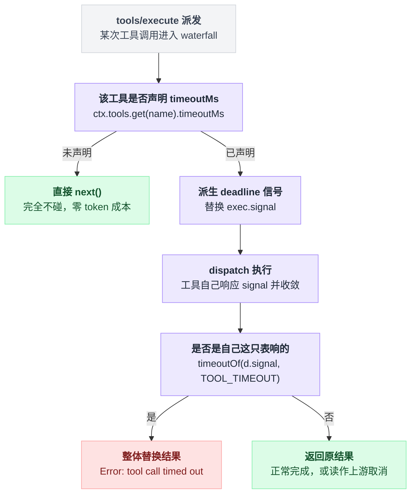

# tool-call-timeout-policy

> `@deepseek-ai/dsh-tool-call-timeout-policy` · bundle：`base` · 配置树 id：`timeout-policy` · v0.1.0-rc.5（commit `47f9438`）2026-08-14 核对。出处收在文末脚注。

**一句话**：一个 `tools/execute` 环绕拦截器，给自己声明了 `timeoutMs` 的工具装上协作式截止时间，超时就把结果整个换成结构化的 `TOOL_TIMEOUT`。

## 它在树上长什么样

在 base bundle 里，它写在这几行[^1]：

```yaml
    - id: timeout-policy
      name: '@deepseek-ai/dsh-tool-call-timeout-policy'
```

两行到底。没有 `inject` 行——它写在代码里；也没有 `config`——它压根没有配置项。

`web-app` 与 `headless` 两个 bundle 都没有覆写或禁用这一行，所以三个 profile 里它本身的行为一致。

这个插件的目录名和包名对不上号[^2]。源码顶部留着一条 FIXME：`settle the intended @deepseek-ai/dsh-timeout-guard rename before the first tagged release`，但紧接着又标了 `suggestion only`——所以这只是个待拍板的改名提议，不是已定事项[^3]。

## 它注册了什么

| 类型 | 名字 | 说明 |
|---|---|---|
| 插件形态 | function/namespace 插件 | 导出 `name` / `inject` / `apply`，**不是 service**[^4] |
| inject | `tools` | 既要挂它的 waterfall，也要读 `ctx.tools.get()`[^5] |
| 事件监听 | `tools/execute`（**waterfall**） | 环绕 dispatch，是唯一被允许替换 `exec.signal` 的钩子[^6] |
| 导出常量 | `TOOL_TIMEOUT` | 同时用作 `deadline()` 的分类码和替换结果里的 `error.code`[^7] |
| 工具 / prompt 段 / 命令 | 无 | 模型不知道它存在 |

它不注册任何工具，也不往 system prompt 里加任何字。它是 [dsh-tools](./dsh-tools.md) 的 `tools/execute` 消费者——全仓库这个事件只有它和 `session-checkpoint-policy` 两个消费者，两个都在 base 里[^8]。

拦截逻辑三步，写成示意代码是这样：

```
on tools/execute (waterfall) as (exec, next):
    预算 = ctx.tools.get(exec.name, exec.agent)?.timeoutMs
    if 没有预算:
        return next()                        // 完全不碰

    原信号 = exec.signal
    using d = deadline(原信号, 预算, TOOL_TIMEOUT)
    try:
        exec.signal = d.signal               // 派生信号顶上去
        结果 = next()                         // 真正 dispatch
    finally:
        exec.signal = 原信号                  // 还回去
    if timeoutOf(d.signal, TOOL_TIMEOUT):     // 是自己这只表响的吗
        return 整个替换掉的超时结果
    return 结果
```

两处容易读漏的细节。一是 `finally` 里恢复调用方原信号，为的是让 `tools/post-execute` 看到的不是这个可能已 abort 的信号。二是第 3 步的判定基于**信号**而非结果形状——因为下游 provider 抛出的上游取消错误，早已被注册表规整成普通 error 结果了，从结果形状上分不出来[^9]。

三步落成图，关键分岔在第 3 步——它要分清是自己的表响了，还是外层另一个取消先到：



## 配置项

**无配置项。** 预算不来自这个插件，而来自被调工具自己的 `ToolDefinition.timeoutMs`——README 原话 `so this plugin is **zero-config**`，且「不可能写错工具名」。注册表只校验它是正有限数，然后不管执行[^10]。

base 树上真正声明了 `timeoutMs` 的自带工具，README 只点了 web 那两个，源码里其实有四个：

| 工具 | base 下的实际值 |
|---|---|
| `web_search` | `60000`[^11] |
| `web_fetch` | base 里 `fetch: false`，**没挂载**[^12] |
| `glob` | `30000`（默认值，base 未覆写）[^13] |
| `grep` | 同上 `30000`[^14] |

`--profile web` 下这张表要重读一遍：`tool-web` 和 `tool-fs-search` 的 base 行都被 `disabled: true` 关掉了，注释说明这是因为 Web 面把模型可见的工具改成由每个会话自己挂 preset[^15]。

装机自带的 `standard` preset 又把两个都挂了回来，后者仍是 `fetch: false` + `searchTimeoutMs: 60000`[^16]。所以 web 下谁带 `timeoutMs`，取决于会话挂的是哪个 preset，而不是 base 那几行。

`bash` / `read` / `write` / `edit` 按 README 是**故意不声明**的。这里有个同名陷阱：`tool-bash` 里也有个 `timeoutMs`，但那是模型可传的调用参数，不是 `ToolDefinition.timeoutMs`——源码核对过了[^17]。

## 模型看得见什么

| 场景 | 模型这边的表现 |
|---|---|
| 工具 schema / system prompt | 不加 schema、不加 prompt |
| 正常调用 | 零 token |
| 截止时间赢了 | 多出一条结果文本，逐字是 `Error: tool call timed out after <ms>ms` |
| KV cache | README 说影响是 append-only |

超时结果的结构体是 `{ isError: true, error: { message, info: { name: 'ToolTimeoutError', code: 'TOOL_TIMEOUT' } } }`[^18]。

反直觉的一点：超时并不总是净成本——它反而能挡住一个更大的迟到结果进上下文。

## 什么时候你会想换掉它 / 怎么换

- **想给所有工具一个兜底预算**：换不了，这个插件没有配置。要么改各工具插件自己的 timeout 配置（如 `tool-web` 的 `searchTimeoutMs`、`tool-fs-search` 的 `timeoutMs`[^19]），要么自己写一个 `tools/execute` 插件按名字兜底。
- **不想要超时**：`- id: timeout-policy` + `disabled: true`，之后所有工具的 `timeoutMs` 声明都变成纯装饰。
- **要叠重试 / 沙箱 / 度量**：都挂同一个 `tools/execute`，注册顺序决定语义。

重试那条值得画出来，两种嵌套是两种完全不同的东西：

```
timeout( retry( attempt ) )    // timeout 注册在外
retry( timeout( attempt ) )    // timeout 注册在内
```

README 原话：`"timeout covers the whole retry operation" (timeout registered outer) versus "timeout covers each attempt" (timeout registered inner)`。

## 坑与边界

- **协作式，永远不是硬杀**。派生信号只负责通知，终止权在工具自己、以及它把 `exec.signal` 转发到的那个能力上；`dsh-timeout` 库不拥有任何 kill。声明 `timeoutMs` 等于承诺「我会响应 `exec.signal` 并静默收敛」——不响应的工具，超时后照跑。
- **没有全局兜底预算**（README: `No blanket budget`）——没声明就没截止时间。
- `timeoutOf` 用自有 code 做 scope，是为了不把**外层另一个 wrapper 先响的表**误读成自己超时；那种情况在这里读作普通的上游取消。
- 它替换的是最终模型可见结果，之后还要过 `tools/post-execute`[^20]。所以 [dsh-repeat-tool-reminder](./dsh-repeat-tool-reminder.md) 照样会看见这次调用并计数：模型反复调用同一个必超时的工具，会先吃 `TOOL_TIMEOUT`，再吃重复调用提醒。
- `TOOL_TIMEOUT` 不额外产生 session 事件，README 的理由是它就是最终的 `tool/result`，loop 已经记了。

它的 invariant 伴生插件是空实现[^21]，理由写在源码注释里：

> `No runtime invariant: this stateless policy plugin owns no package-local event history or mutable data relation beyond the seam it intercepts.`

## 出处

[^1]: `packages/bundle/base/cordis.patch.yml:343-344`。
[^2]: 目录路径是 `packages/guard/timeout-policy`，发布的包名是 `dsh-tool-call-timeout-policy`。
[^3]: `src/index.ts:6-9`。
[^4]: `name` / `inject` / `apply` 三处导出：`src/index.ts:28`、`:31`、`:55`。
[^5]: `src/index.ts:31`。
[^6]: `src/index.ts:56`。
[^7]: `src/index.ts:25`。
[^8]: 消费者关系见 `docs/event-producer-consumer.md:56`；两者挂载位置：`packages/bundle/base/cordis.patch.yml:343`、`:355`。
[^9]: 实现整体在 `src/index.ts:56-80`。
[^10]: 校验逻辑：`packages/core/tools/src/index.ts:1046-1049`。
[^11]: `web_search` 声明在 `packages/web/tool-web/src/search.ts:256`；base 下的值 `60000` 在 `packages/bundle/base/cordis.patch.yml:418`。
[^12]: `web_fetch` 声明在 `packages/web/tool-web/src/fetch.ts:476`；base 里 `fetch: false` 在 `cordis.patch.yml:417`。
[^13]: `glob` 声明在 `packages/fs/tool-fs-search/src/glob.ts:326`；默认值 `30000` 在 `packages/fs/tool-fs-search/src/search-core.ts:42`，base 未覆写。
[^14]: `grep` 声明在 `packages/fs/tool-fs-search/src/grep.ts:292`；默认值与 `glob` 共用同一处 `search-core.ts:42`。
[^15]: `tool-web` 关闭：`packages/bundle/web-app/cordis.patch.yml:407-408`；`tool-fs-search` 关闭：`:315-316`；解释性注释：`:276-285`。
[^16]: `apps/cli/config/agent-presets/standard/agent.cordis.yml:59-62`、`:247-251`。
[^17]: `tool-bash` 的调用参数版 `timeoutMs`：`packages/shell/tool-bash/src/index.ts:254`。
[^18]: `src/index.ts:41-48`。
[^19]: `packages/fs/tool-fs-search/src/index.ts:106`。
[^20]: `packages/core/tools/src/index.ts:1569-1599` → `:1743`。
[^21]: 空实现：`src/invariant.ts:21`；理由：同文件 `:18-19`。
