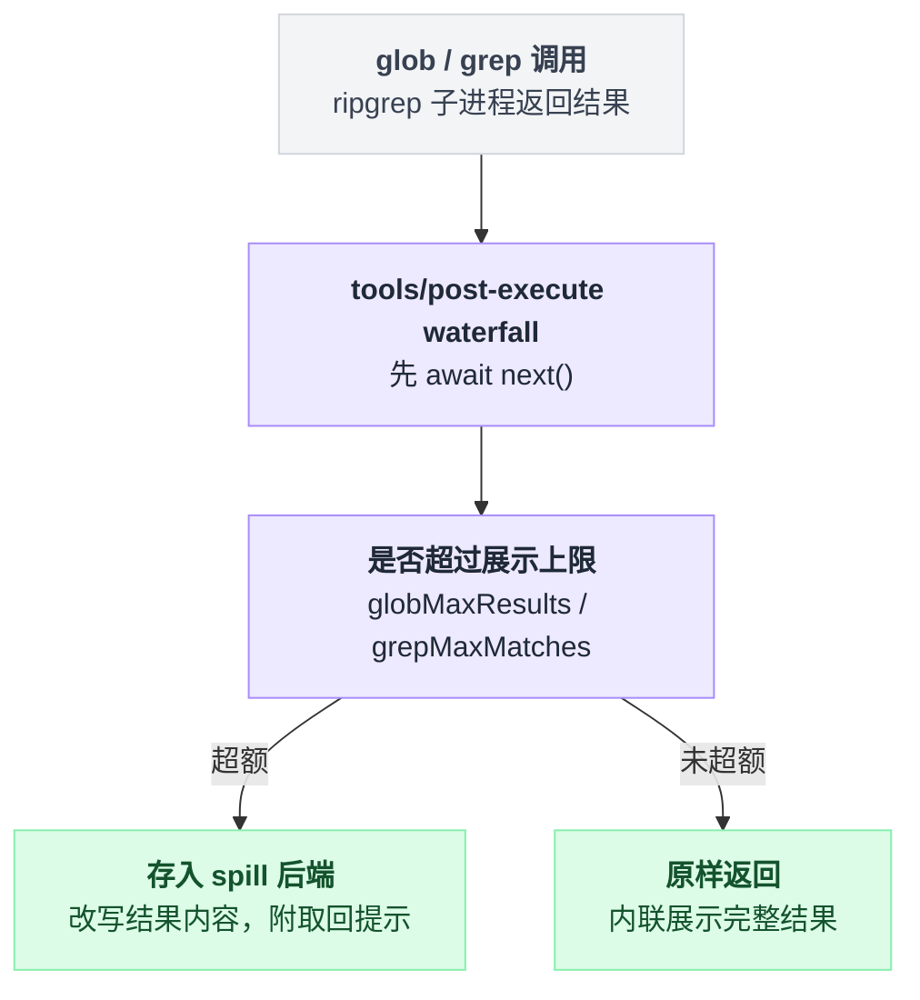
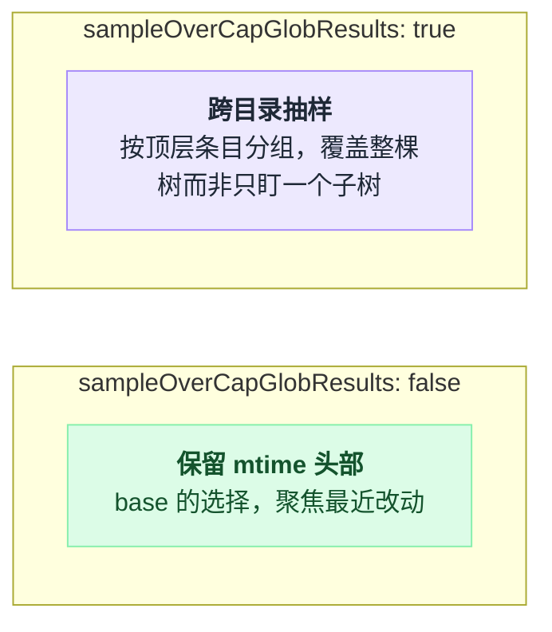

# tool-fs-search

> `@deepseek-ai/dsh-tool-fs-search` · bundle：`base` · 配置树 id：`tool-fs-search` · v0.1.0-rc.5（commit `47f9438`）2026-08-14 核对

**一句话**：模型面前的 `glob` / `grep` 两个发现类工具，底座是**随包发布的 ripgrep 二进制**（`@vscode/ripgrep`），经 `ctx.subprocess` 起进程，**不走 `ctx.fs`**，所以文件系统 provider 不必长出一套搜索 API。

## 它在树上长什么样

`packages/bundle/base/cordis.patch.yml:227-230`：

```yaml
- id: tool-fs-search
  name: '@deepseek-ai/dsh-tool-fs-search'
  config:
    sampleOverCapGlobResults: false
```

只有一个字段，而且是**必填无默认**的 `z.boolean().required()`。也就是说部署时必须显式表态：超额的 `glob` 页要怎么排。base 选了 `false`。

行内没有 `inject`，依赖全来自包导出：`inject = ['tools', 'systemPrompt', 'subprocess']`——注意这里**刻意不 inject `fs`**。而 `ctx.spillStore` 是用 `ctx.get()` 机会性读取的，因为 spill 本身可选，没有也得能跑。

出处：必填校验见 `packages/fs/tool-fs-search/src/index.ts:98`，inject 见 `src/index.ts:70`，spill 的机会性读取见 `src/search-core.ts:382`。

web profile 把这一行关掉了（`packages/bundle/web-app/cordis.patch.yml:315-316`），改由各 agent preset 重新挂载，且同样传 `sampleOverCapGlobResults: false`——code 见 `apps/cli/config/agent-presets/code/agent.cordis.yml:66-69`，standard 见 `:59-62`，cordis 见 `:60-63`。

## 它注册了什么

| 类型 | 名字 | 说明 |
|---|---|---|
| 工具 | `glob` | argv 是 `--files --glob=<pattern> --sort=modified --no-ignore --hidden` 加 VCS 元目录排除，只返回文件路径（构造在 `src/glob.ts:90-108`，注册在 `src/glob.ts:359`） |
| 工具 | `grep` | argv 是 `--json --regexp=<pattern>`（可选 `--glob=<include>`、`-- <path>`），逐行解析后按文件分组输出 `Line N: <preview>`（`src/grep.ts:112-117`、注册在 `src/grep.ts:339`） |
| prompt 段 | `tool:glob` order 103 | 文案随 `sampleOverCapGlobResults` 二选一（`src/glob.ts:301`） |
| prompt 段 | `tool:grep` order 104 | `src/grep.ts:276` |
| 事件监听 | `tools/post-execute`（**waterfall**） | 每个工具各挂一个：先 `await next()`，再在超额时把完整结果存进 spill 并**改写**结果内容（`src/glob.ts:361-373`、`src/grep.ts:341-364`；事件模式见 `docs/event-producer-consumer.md:57`） |

没有 service，也不派发 `fs/*`。

这里有个容易想当然的地方：它和 [fs-observation-policy](./dsh-fs-observation-policy.md) 的观察记录**完全无关**。`grep` 出来的路径不算读过，想编辑仍然要先用 [tool-fs](./dsh-tool-fs.md) 的 `read` 走一遍。

那两个 `tools/post-execute` 监听器也不是见调用就动手，只对本工具、非嵌套、已 accept 且非错误的调用生效（`src/direct-call.ts:23-26`）。

超额结果怎么处理，靠的正是这个 `tools/post-execute` 环节：



写成伪代码就是这么一段，注意 `await next()` 在前——它是 waterfall，先让下游把结果算完，自己再在回程上改写：

```
on tools/post-execute (waterfall):
    if 不是本工具 or 是嵌套调用 or 未 accept or 是错误:
        return next()                  // 四道闸门，任一不满足就不管
    结果 = await next()                 // 先放行，拿到完整结果
    if 结果条数 > 上限:
        存进 spill 后端
        改写结果内容：截断 + 省略计数 + 定位符 + 取回提示
    return 结果
```

两个工具都声明了 `timeoutMs`（`src/glob.ts:326`、`src/grep.ts:292`），由 `@deepseek-ai/dsh-tool-call-timeout-policy` 经 `exec.signal` 协作式执行；subprocess seam 的 terminate 升级才是硬杀。

这与 tool-fs 的"文件 IO 不设超时"形成对照——进程型工作才有可强制中断的截止时间。

## 配置项

| 字段 | 类型 | 默认值 | 作用 |
|---|---|---|---|
| `sampleOverCapGlobResults` | boolean | **必填**（base 给 `false`） | `true`=超额页按顶层条目抽样；`false`=保留按 mtime 排序的头部 |
| `globMaxResults` | number | `100` | 单次 `glob` 内联展示的路径上限（`src/glob.ts:26`） |
| `grepMaxMatches` | number | `250` | 单次 `grep` 内联保留的扁平匹配上限（`src/grep.ts:30`） |
| `grepMaxLineBytes` | number | `2000` | 单条匹配行预览的字节上限，切口保 UTF-8 边界（`src/grep.ts:36`） |
| `searchMetaMaxBytes` | number | `65536` | 单次搜索序列化 `presentationMeta` 的字节上限（`src/search-core.ts:64`） |
| `rawOutputMaxBytes` | number | `20000000` | 会去解析的 `rg` 原始 stdout 上限，超了报 `SEARCH_RAW_OUTPUT_OVERFLOW`（`src/search-core.ts:35`） |
| `graceMs` | number | `3000` | 交给 subprocess seam 的 terminate 宽限，受 `MAX_TIMER_DELAY_MS` 约束（`src/search-core.ts:52`，校验在 `src/index.ts:137-139`） |
| `stderrMaxBytes` | number | `65536` | `rg` stderr 诊断尾巴预算（`src/search-core.ts:49`） |
| `timeoutMs` | number | `30000` | 两个工具的协作式调用预算（`src/search-core.ts:42`） |

那个必填布尔值值得单独看一眼：两种取值下超额页的排序契约完全不同，模型看到的尾句提示也跟着换。



除必填项外，其余字段全部在 `apply` 里断言正整数（`src/index.ts:131-141`）。

## 模型看得见什么

两段 guidance 每次请求都在。`grep` 那段逐字为——

> Use the grep tool — not shell grep or rg — to search file contents. Use read on a matched file when you need surrounding context.

`glob` 那段随配置切换尾句：`sampleOverCapGlobResults: false` 时结尾是 `while a larger one keeps the modification-time-ordered head.`；`true` 时是 `while a larger one is sampled across top-level entries, so it spans the tree instead of one subtree.`（`src/glob.ts:298-305`）。

结果侧长这样：

| 场景 | 模型收到的东西 |
|---|---|
| `glob` 有结果 | 一行一路径 |
| `grep` 有结果 | 按文件分组，`Line <line>: <preview>`（`src/grep.ts:201`） |
| `glob` 空结果 | `No files found`（`src/glob.ts:233`） |
| `grep` 空结果 | `No matches found`（`src/grep.ts:230`） |
| 超额 | 尾部带省略计数、spill 定位符与取回提示，或明说完整结果没能保存 |
| 失败 | 结构化 code：`SEARCH_INVALID_PATTERN` / `SEARCH_FAILED` / `SEARCH_RAW_OUTPUT_OVERFLOW` / `SEARCH_ABORTED`（`src/search-core.ts:78-81`） |

超额这一行有个反直觉点：它**从不**变成 `isError`。截断只是展示策略，不是出错。

ripgrep 的退出码语义也由工具自己重新解释了一遍，不能照搬 shell 里的直觉：

```
rg 退出码 == 0  → 有结果，成功
rg 退出码 == 1  → 空结果，仍然算成功      // 不是失败
rg 其它退出码    → 才算失败
```

实现在 `src/search-core.ts:270-274`。

## 什么时候你会想换掉它 / 怎么换

换掉整包基本没必要——二进制随包发，注册也是无条件的。常见改法是切换超额排序契约或放宽上限：

```yaml
- id: tool-fs-search
  config:
    sampleOverCapGlobResults: true
    grepMaxMatches: 500
```

这里有个坑：patch 会**整体替换**该行的 `config`（`packages/bundle/base/README.md:21`："A patch replaces whole row configs … there is no deep-merge layer"）。所以 `sampleOverCapGlobResults` 必须重新写上，漏了就是 schema 校验直接失败。

想让超额结果可完整取回，就再挂一个 spill 后端（base 已有 `spill-local`，`packages/bundle/base/cordis.patch.yml:346-347`）。

## 坑与边界

**搜索与文件访问没有共享工作区证明。** 返回路径显示为相对 workdir（有 session 时取其 cwd，否则 `process.cwd()`，`src/search-core.ts:223-224`），只有 workdir 与 `ctx.fs` 根指向同一工作区时，才能用 `read` 跟读。包内不做任何跨服务运行时校验，远程 / 虚拟文件系统场景下这条会静默失效。

**二进制版本被依赖锁死。** `@vscode/ripgrep` 覆盖 macOS/Linux/Windows 的 x64/arm64；不支持的平台或安装损坏，调用一律 `SEARCH_FAILED`。

**schema 只暴露一页。** 没有 offset 分页、没有大小写开关、没有其他输出模式；完整超额输出依赖 spill 后端。

**抽样只按搜索根下第一层路径段分组。** 结果集中在更深的某个忙目录时，那一层以下仍然不均衡，递归平衡没做。

读源码另注：`--no-config` 被前置进 argv（`src/search-core.ts:228`），防止宿主的 `RIPGREP_CONFIG_PATH` 往非受限 spawn 里塞 `--pre` 预处理器；模型可控值都是普通 argv 元素，没有 shell 层，所以不存在引号转义问题。
