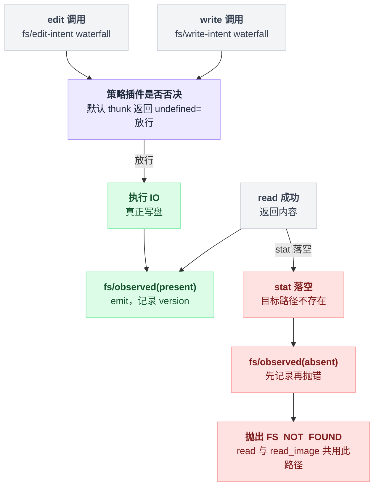

# tool-fs

> `@deepseek-ai/dsh-tool-fs` · bundle：`base` · 配置树 id：`tool-fs` · v0.1.0-rc.5（commit `47f9438`）2026-08-14 核对

**一句话**：模型面前的 `read` / `read_image` / `write` / `edit` 四个文件工具连同它们的执行器——工具名、schema、参数校验、读窗口、结果渲染都归它。

真正的 IO 走 `ctx.fs`，而"读过才准写"的策略由 [fs-observation-policy](./dsh-fs-observation-policy.md) 通过事件旁挂。这个分工是理解本包的关键：它只管"模型看到什么、参数长什么样、结果怎么渲染"，不管"该不该让它写"。

## 它在树上长什么样

配置树上就两行：

```yaml
- id: tool-fs
  name: '@deepseek-ai/dsh-tool-fs'
```

既没有 `config` 也没有 `inject`。所以四个读上限全取 schema 默认值；依赖由包自身导出声明，`inject = ['tools', 'fs', 'systemPrompt']`。

出处：配置见 `packages/bundle/base/cordis.patch.yml:224-225`，依赖声明见 `packages/fs/tool-fs/src/index.ts:22`。

web profile 的挂法不一样：它先把这个节点整个关掉（`disabled: true`），改由每个 agent preset 各挂一份。

这么绕一圈是有目的的——**工具与 prompt 段因此属于单个 session，而 `ctx.fs` 与策略插件仍留在 host 平面**。preset 文件自己的注释就是这么写的。

出处：web profile 关闭见 `packages/bundle/web-app/cordis.patch.yml:312-313`；三个 preset 各自的挂载点是 code `apps/cli/config/agent-presets/code/agent.cordis.yml:63-64`、standard `:56-57`、cordis `:57-58`；那段注释在 `code/agent.cordis.yml:61-62`。

## 它注册了什么

| 类型 | 名字 | 说明 |
|---|---|---|
| 工具 | `read` | 行号化 UTF-8 文本 + 分页页脚；`isConcurrencySafe: () => true`，可并发调度（`src/read.ts:76`、`src/read.ts:135`） |
| 工具 | `read_image` | 仅在 `ctx.attachments` 挂载时注册——`ctx.inject(['attachments'], …)` 包住注册（`src/index.ts:70`、`src/read-image.ts:131`） |
| 工具 | `write` | 整文件创建或覆写（`src/write.ts:69`） |
| 工具 | `edit` | 字面量替换，默认要求唯一匹配（`src/edit.ts:83`） |
| prompt 段 | `tool:read` order 100 | `src/read.ts:70` |
| prompt 段 | `tool:write` order 101 | `src/write.ts:63` |
| prompt 段 | `tool:edit` order 102 | `src/edit.ts:77` |
| 事件派发 | `fs/write-intent`（**waterfall**） | 单槽决策，默认 thunk 返回 `undefined`（裸 provider 无条件写）（`src/write.ts:111`） |
| 事件派发 | `fs/edit-intent`（**waterfall**） | 同上，默认 `undefined`（`src/edit.ts:126`） |
| 事件派发 | `fs/observed`（emit） | 成功之后记 `{ kind: 'present', version }`（`src/read.ts:162`、`src/write.ts:122`、`src/edit.ts:141`、`src/read-image.ts:200`）；**stat 落空时先记 `{ kind: 'absent' }` 再抛 `FS_NOT_FOUND`**，`read` 与 `read_image` 共用这条路径（`src/read-target.ts:26-28`） |

它**不注册任何 service**，也不 inject 策略服务。

三个事件由 `@deepseek-ai/dsh-fs` 在服务定义里声明，派发方是它，监听方是策略插件，两边不互相 import（`packages/fs/fs/src/index.ts:58`、`:66`、`:76`；生成目录见 `docs/event-producer-consumer.md:34-36`）。

两个 intent waterfall 是策略插件唯一能插手的决策点。写路径大致长这样：

```
def write(path, content):
    decision = emit_waterfall('fs/write-intent', path)   // 单槽，只有一个插件能答
    if decision is undefined:  放行                       // 裸 provider 的默认 thunk
    else:                      按 decision 处理
    真正写盘
    emit('fs/observed', { kind: 'present', version })     // 成功之后才发
```

`edit` 同构，只是换成 `fs/edit-intent`。而 `fs/observed` 分 present / absent 两条路径，读路径的 absent 分支顺序容易记反：

```
def read(path):
    st = stat(path)
    if st is None:
        emit('fs/observed', { kind: 'absent' })           // 先记
        raise FS_NOT_FOUND                                // 后抛
    ...
    emit('fs/observed', { kind: 'present', version })
```

画出来比对着三处代码行号拼快：



路径解析走 `ctx.fs.resolve`，cwd 取调用 agent 的 `exec.agent.session.header.cwd`，与 `dsh-tool-bash` 的 workdir 规则对齐（`src/session-cwd.ts:23-27`）。

## 配置项

| 字段 | 类型 | 默认值 | 作用 |
|---|---|---|---|
| `readLimit` | number | `2000` | 单次 `read` 返回的默认与最大行数（`src/read.ts:16`） |
| `readMaxLineLength` | number | `2000` | 单行截断前保留的字符数（`src/read-render.ts:11`） |
| `readMaxBytes` | number | `51200`（50 KiB） | 单次 `read` 选中行的字节上限（`src/read-render.ts:14`） |
| `readStreamMinSize` | number | `10485760`（10 MiB） | 到达此大小（或大小未知）改走 `streamText`（`src/read.ts:22`） |

四个值在 `apply` 里被断言为正整数，否则抛 `tool-fs: <name> must be a positive integer`（断言在 `src/index.ts:57-60`，报错文案在 `src/index.ts:49`）。

base bundle 一个都没覆盖。

## 模型看得见什么

README 的 Model Experience 一节写明：三段 guidance 每次请求都在，作用域内即使工具被 restriction 隐藏，prompt 段也不会消失（`packages/fs/tool-fs/README.md:70`）。

其中 read 那段原文逐字为——

> Use the read tool — not shell commands like cat — to inspect text files. Results include line numbers. Use offset and limit to continue reading large files.

成功的输出都是固定信封：

| 工具 | 成功时模型看到 |
|---|---|
| `read` | `<path>…</path>` / `<type>file</type>` / `<content>` + `<lineNumber>: <text>` + 空行 + 一行页脚 + `</content>`；页脚三选一，例如 `(End of file - total <total> lines)` |
| `write` | 五行信封里的 `Created file` 或 `Updated file` |
| `edit` | `The file <displayPath> has been updated successfully.`（`replace_all` 时换一句） |

read 的渲染在 `src/read-render.ts:152-170`。

失败一律统一成 `Error: <message>`，并保留结构化 `{ name, code }`。守卫类失败还会被本包的 error wrapper 追加一句补救指令，等于直接告诉模型下一步该干嘛：

| code | 追加的话 |
|---|---|
| `FS_STALE_VERSION` | `— re-read the file, then retry` |
| `FS_NOT_OBSERVED` | `— read the file, then retry` |

wrapper 实现在 `src/error.ts:14-17`、`:33`。

沙箱拒绝是另一条路：会被映射成与 bash 同款的 `[sandbox: …]` marker 加同轮升级提示（`src/sandbox.ts:124-130`）。

## 什么时候你会想换掉它 / 怎么换

它是模型侧文件能力的唯一实现，通常不换，只调参。想放宽单次读窗口：

```yaml
- id: tool-fs
  config:
    readLimit: 4000
    readMaxBytes: 102400
```

想换成把四个动作塞进一个工具的 `str_replace_editor` 风格接口，用 [tool-str-replace-editor](./dsh-tool-str-replace-editor.md) 顶替（minimal preset 就是这么干的）。

想去掉"读过才准写"，卸掉策略插件即可，本包不会因此报错——它调的是 `ctx.fs` 与事件，不是策略方法。

底下的 provider 换成 [fs-sandbox](./dsh-fs-sandbox.md) 时本包也无需改动：`ctx.fs.sandboxMode` 一旦非 `undefined`，`write` / `edit` 自动多出 `sandbox_permissions` 与 `justification` 两个参数（`src/write.ts:75`、`src/edit.ts:91`、`src/sandbox.ts:45`、`src/sandbox.ts:59`）。

## 坑与边界

- **不发目录列表工具**：`ctx.fs.listDir` 只服务 provider 侧代码（如 skill 发现），模型侧的发现能力在兄弟包 [tool-fs-search](./dsh-tool-fs-search.md)。
- **`read` 只处理 UTF-8 文本**；图片走扩展名路由的 `read_image`，PDF / 音视频未做，目录目标返回 `FS_NOT_REGULAR_FILE`（`src/read-target.ts:30-32`）。
- **`read_image` 的路由检查与并发换模型有竞态**：它在执行时检查当前路由模型，检查到下一次请求之间提交的切换可能把 image block 留在拒绝图片的路由上。
- **媒体类型由扩展名声明**，以 attachment store 的 magic-byte 校验为准；扩展名与实际格式不符时给改名建议而不是嗅探。
- **`fs/observed` 是 fire-and-forget**：present 观察在操作成功之后才发，absent 观察在抛 `FS_NOT_FOUND` 之前发；监听者按契约必须同步、只做副作用；本包不 guard 这个 emit，抛异常的监听者会变成工具的 `isError`。
- **文件 IO 没有超时**：`read` / `write` / `edit` 不接 `timeoutMs`，也不声明 `timeout-policy` 预算，取消只靠 `exec.signal`（`packages/fs/README.md:19-21`）。
- 工具结果卡片不内联渲染图片，只带持久引用。
