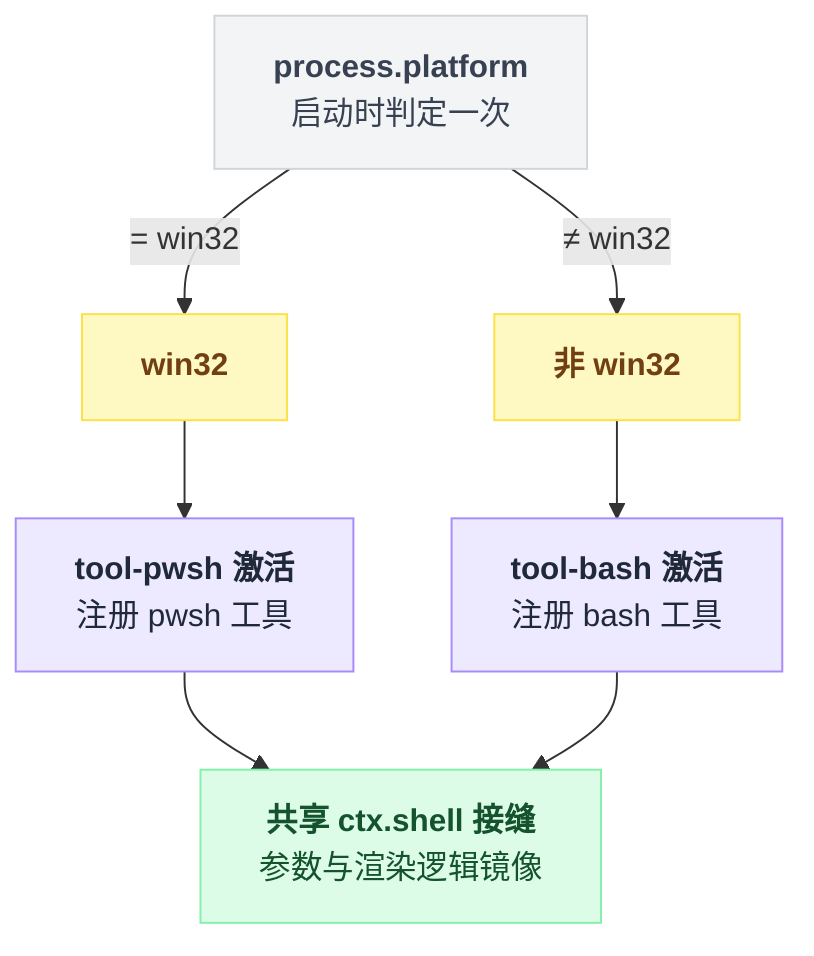

# tool-pwsh

> `@deepseek-ai/dsh-tool-pwsh` · bundle：`base` · 配置树 id：`tool-pwsh` · v0.1.0-rc.5（commit `47f9438`）2026-08-14 核对。出处收在文末脚注。

**一句话**：[tool-bash](./dsh-tool-bash.md) 的 PowerShell 方言孪生体——同一个 `ctx.shell` 接缝、同一套参数与渲染，只是命令走 `pwsh -Command`、路径用 `C:\...`、环境变量用 `$env:NAME`。

## 它在树上长什么样

```yaml
- id: tool-pwsh
  name: '@deepseek-ai/dsh-tool-pwsh'
  disabled: !!js process.platform !== 'win32'
```

这一行的 `disabled` 条件与 [tool-bash](./dsh-tool-bash.md) 严格互补，所以选型在启动时就定死了，一台机器上只会活一个：

```
if process.platform == 'win32':
    激活 tool-pwsh      // tool-bash 的 disabled 为真，整个关掉
else:
    激活 tool-bash      // 这里的 disabled 为真，整个关掉
两条分支最终都接到同一个 ctx.shell 接缝，参数与渲染逻辑互为镜像
```

注入清单：`export const inject = ['tools', 'shell', 'systemPrompt', 'shellEnv']`[^1]。

web 档同样整行关掉[^2]：

```yaml
- id: tool-pwsh
  disabled: true
```



## 它注册了什么

| 类型 | 名字 | 说明 |
|---|---|---|
| 工具 | `pwsh` | 注册点见脚注[^3] |
| prompt 段 | `tool:pwsh`（order 105） | 原文见下方[^4] |
| 事件监听 | 无 | 与 bash 侧一致，全包无 `ctx.on` / `ctx.waterfall` |
| jobs 类型扩展 | `JobKindMap.pwsh` | 在 `dsh-jobs` 的类型声明里做 declaration merging 扩展进来[^5] |

prompt 段正文（逐字）：

```text
Non-zero exits are reported as `[exit code: N]` markers; investigate failures before moving on. On Windows a killed process settles as `[exit code: 1]` without a signal marker; treat a bare exit 1 after an interruption as a termination, not a command failure.
```

参数面与 `bash` 逐字对齐：`command`、`description` 必填，`timeoutMs`、`workdir` 可选，`run_in_background` 与 `sandbox_permissions`/`justification` 同样是条件字段。这份重复是刻意的，源码用 `jscpd:ignore-start` 标了出来[^6]。

## 配置项

| 字段 | 类型 | 默认值 | 作用 |
|---|---|---|---|
| `enableRunInBackground` | boolean | `true` | 同 bash 侧：关掉即从 schema 移除参数，强行传入在 execute 阶段被拒[^7] |

base bundle 未给 config，跑的是默认值。

## 模型看得见什么

**系统提示**就是上面那段 order 105 文本。它比 bash 那句多一层 Windows 特有的教学——被强杀的进程结算成 `[exit code: 1]` 且**没有**信号标记，不要把它读成命令失败。

**工具描述**以 ``Execute a PowerShell command (`pwsh -Command`) and return its stdout/stderr.`` 起手，明确教「路径写原生 `C:\...`、环境变量读 `$env:NAME`」，并把 `$env:DSH_*` 作为环境事实的通用约定[^8]。

**前台结果**与 bash 共用同一套标记行[^9]：

| 标记 | 出现时机 |
|---|---|
| `[output truncated; full output: <path>]` | 输出被截断 |
| `[sandbox: file access denied under <mode> mode]` | 沙箱拒绝文件访问 |
| `[sandbox: escalation available — …]` | 组合公开升权时追加 |
| `[timed out after <timeoutMs>ms]` | 超时 |
| `[killed by signal: <signal>]` | POSIX-only，Windows 上实际不会出现 |
| `[exit code: <exitCode>]` | 非零退出 |
| 无任何标记 | 干净退出 |
| `(no output)` | 空体渲染 |

**后台**打印 `started background job <id>`，后续由 `job_output` / `job_kill` 接管。**错误**的稳定串与 bash 侧高度重合[^10]。

## 什么时候你会想换掉它 / 怎么换

| 想干什么 | 怎么改 |
|---|---|
| Windows 上仍用 bash 语义 | 这一行 `disabled` 改 `true`，`tool-bash` 的改 `false`，并保证 `ctx.shell` 由 bash 方言执行器提供 |
| 关掉后台 | `config: { enableRunInBackground: false }` |
| 非 Windows 上也跑 pwsh | 改 `disabled` 表达式即可，但 `ctx.shell` 必须换成 `dsh-pwsh-local` 或 [pwsh-sandbox](./dsh-pwsh-sandbox.md) |

第一条要注意：工具契约是方言绑定的，中间没有翻译层[^11]。

## 坑与边界

**read-only 模式下 PowerShell 会掉进 ConstrainedLanguage。** 这是一条踩下去很难自救的链子：

```
Windows ACL 沙箱 + read-only
  → 临时目录写入被拒
  → AppLocker 探测 fail closed
  → 语言模式降为 ConstrainedLanguage
  → Add-Type、非核心 .NET 静态成员（[System.IO.*]::、[math]::）、COM、反射
    全部报 "only core types"
  → 无法从内部提升
```

workspace-write 有私有 temp，探测能完成，通常保持 FullLanguage[^12]。

**两种受限模式都禁止 named pipe 打开**：受限命令里再 spawn 一个带管道 stdio 的子进程会拿到 EPERM[^12]。

**没有持久 shell / PTY**：每次都是全新 `pwsh -Command`。PTY 后端目前只有 Linux/macOS，Windows ConPTY 持久 shell 还在路线图上[^13]。

**session cwd 未做规范化**，这是与 bash 侧的已知平价缺口：

```
workdir 基准 = session.header.cwd          // 原样取用，不规范化
限制根       = canonicalize(workspace root) // 共享 policy 服务处理过
若 原始 cwd != 其规范形式 → 两者分叉
```

bash 侧用 `canonicalPath` 处理了同一问题，pwsh 侧这处缺口的位置与文档记录见脚注[^14]。

**加载期错误信息里写的是 "bash executor"**：`tool-pwsh: the mounted bash executor confines but ctx.sandboxPolicy is missing`[^15]——查日志时别被这个词误导，抛它的是 pwsh 包。

另有两处文档与源码对不上，以源码为准：

| 位置 | 文档写的 | 源码实际 |
|---|---|---|
| inject 清单 | `['tools', 'bash', 'systemPrompt', 'bashEnv']` | `['tools', 'shell', 'systemPrompt', 'shellEnv']` |
| 工具目录描述 | 「mirrors the bash tool call-for-call minus sandbox controls」 | 确实带 `sandbox_permissions` / `justification` 与 `approveEscalation` 调用 |

两处坐标都收在脚注里[^16]。README 也有升权描述，所以目录那句话的措辞已过时。

## 相关

[pwsh-sandbox](./dsh-pwsh-sandbox.md) 是它在 Windows 上消费的 `ctx.shell` provider；[shell-env](./dsh-shell-env.md) 提供 `DSH_*` 快照[^17]；底层进程机制在 [subprocess-local](./dsh-subprocess-local.md)。

---

## 出处

[^1]: 树上那三行：`packages/bundle/base/cordis.patch.yml:214-216`；inject 清单：`packages/shell/tool-pwsh/src/index.ts:49`。
[^2]: `packages/bundle/web-app/cordis.patch.yml:296-297`。
[^3]: `packages/shell/tool-pwsh/src/index.ts:252-253`。
[^4]: `src/index.ts:245-250`。
[^5]: `declare module '@deepseek-ai/dsh-jobs'` 扩展：`src/index.ts:42-46`。
[^6]: `jscpd:ignore-start` 标注：`src/index.ts:255`。
[^7]: `src/index.ts:57-60, 368-370`。
[^8]: `src/index.ts:107-115`。
[^9]: 标记行与 `(no output)`：README.md:83；`[killed by signal: …]` 是 POSIX-only：README.md:33。
[^10]: 后台启动串与错误稳定串：README.md:111。
[^11]: README.md:125。
[^12]: workspace-write 私有 temp 与 FullLanguage：README.md:123；named pipe 在两种受限模式下均禁止、EPERM：同为 README.md:123。
[^13]: PTY 后端现状与 Windows ConPTY 路线图：README.md:124。
[^14]: bash 侧 `canonicalPath` 实现：`packages/shell/tool-bash/src/index.ts:150`；pwsh 侧对应位置：`src/index.ts:151-157`；缺口记录：README.md:126。
[^15]: `src/index.ts:202`。
[^16]: inject 清单：文档写的见 README.md:7，源码实际见 `src/index.ts:49`（与[^1]同一处）；工具目录描述：文档写的见 `docs/tool-catalog.md:22`，源码里 `sandbox_permissions` / `justification` 与 `approveEscalation` 调用见 `src/index.ts:34, 232, 270-280`。
[^17]: `src/index.ts:363`。
