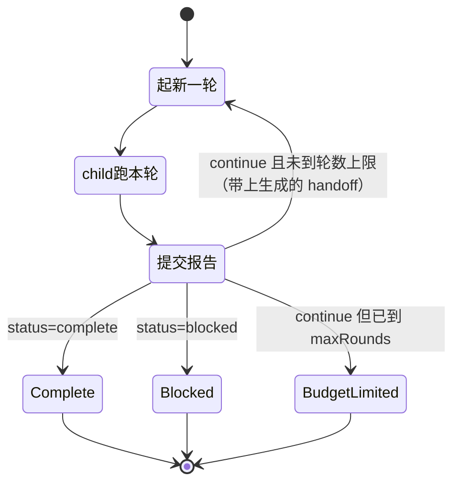

# tool-ralph

> `@deepseek-ai/dsh-tool-ralph` · bundle：`base` · 配置树 id：`tool-ralph` · v0.1.0-rc.5（commit `47f9438`）2026-08-14 核对

> ⚠️ **本篇未通过对抗式引用核验**：起草已完成，但逐条打开源码比对行号/字段名/英文引文的那一遍因会话额度耗尽未执行。文中 `path:line` 与配置字段请以源码为准，核验后本行会被移除。

**一句话**：一个 `ralph` 工具，前台跑一段**编译期写死的 workflow 脚本**，把同一个不可变 objective 交给一串全新的 child agent，一轮一个，轮间只传一份有大小上限的结构化 handoff。

README:5 把它的定位说得很清楚：`It demonstrates a specialized orchestration policy as an ordinary plugin over ctx.workflowEngine and ctx.subagents: no Ralph mode or fresh-agent loop is added to agent-loop, and the same-session goal domain remains independent.` —— 也就是说，Ralph 不是 agent 循环的一个模式，它就是一个普通插件。教程正文见 [27 章 RalphLoop](../27-RalphLoop.md)，同 session 的长任务对照见 [26 章 Goal 模式](../26-Goal模式.md)。

## 它在树上长什么样

```yaml
    # Fresh-agent Ralph iteration over a build-time-fixed script.
    - id: tool-ralph
      name: '@deepseek-ai/dsh-tool-ralph'
      config:
        subagentProvider: spawn
        maxRounds: 64
```

`packages/bundle/base/cordis.patch.yml:377-382`。没写 `inject`；源码里是 `export const inject = ['tools', 'workflowEngine', 'subagents', 'systemPrompt']`（`packages/workflow/tool-ralph/src/index.ts:20`），四个都是硬依赖。

注意 **`maxRounds: 64` 覆盖了源码默认的 256**（`src/index.ts:37`）。`spawn` 这个 provider 名来自 `packages/bundle/base/cordis.patch.yml:298` 的 `subagent-spawn-in-process`。

`web-app` bundle 在宿主平面关掉（`packages/bundle/web-app/cordis.patch.yml:398-399`），由 preset 挂回来，配置相同（`apps/cli/config/agent-presets/code/agent.cordis.yml:230-234`）。

## 它注册了什么

| 类型 | 名字 | 说明 |
|---|---|---|
| 工具 | `ralph` | `src/index.ts:412`；参数只有必填 `objective: string` 和可选 `maxRounds: number` |
| prompt 段 | `tool:ralph`，order **116** | `src/index.ts:407-411` |
| 伴生插件 | `./invariant`（`tool-ralph-invariant`） | `src/invariant.ts:21` 是**空 installer**，注释写明 `No runtime invariant: this model-facing orchestration adapter owns no independent event stream; workflow and subagent owners validate the runs and child lifecycles it starts.` |

**没有事件监听，没有 provide 任何 service，也不写会话事件**。它是纯消费方：`ctx.workflowEngine.start(...)`（`src/index.ts:447`）+ `ctx.subagents.getProvider(name)`（`src/index.ts:221`）。`docs/tool-catalog.md:32` 把它的运行期依赖列成 `ctx.tools`, `ctx.workflowEngine`, `ctx.subagents`, `ctx.systemPrompt`, `a calling Agent (exec.agent parents every fresh round)`。

## 配置项

| 字段 | 类型 | 默认值（源码 / base 实配） | 作用 |
|---|---|---|---|
| `subagentProvider` | `string` | `spawn` / `spawn` | 每一轮起 child 用的 provider 名 |
| `maxRounds` | `number` | `256` / **`64`** | 一次 run 的轮数默认值**兼**上限 |
| `maxHandoffChars` | `number` | `16384` / 未设 | 单轮报告序列化后的字符上限 |
| `maxResultChars` | `number` | `16384` / 未设 | 成功时给父 agent 的完整文本上限 |

schemastery 定义在 `src/index.ts:35-40`；`resolveConfig`（`src/index.ts:187-205`）又手写了一遍校验，README:34 解释原因：`including direct application outside Loader schema normalization`。

`maxRounds` 的双重身份要留意：模型可以在调用里传一个更小的 `maxRounds`，传大于部署上限的直接抛 `Ralph maxRounds <value> exceeds the deployment ceiling <ceiling>`（`src/index.ts:214`）。解析出来的值同时作为 `WorkflowStartRequest.maxTotalAgents` 传进引擎（`src/index.ts:452`，字段定义见 `packages/workflow/workflow/src/runtime-types.ts:29`），跟引擎自己的总 child 兜底对齐。

`maxResultChars` **只截渲染文本**，不动 canonical value 里已校验的报告，也不动跨轮 handoff（README:13、`src/index.ts:354-358`）。

## 固定脚本干了什么

脚本是模板字符串常量 `RALPH_SCRIPT`（`src/index.ts:90-177`），模型改不了它、看不见它、也选不了 provider。每轮 prompt 由 6 段拼成（`src/index.ts:155-162`），给 child 的只有：不可变 objective、当前轮次和上限、「共享工作区就是唯一真相源」的指令、上一轮的结构化 handoff。父对话和上一个 child 的 session **都不注入**。

一轮一个全新 child，靠 status 字段决定是继续开下一轮还是收敛到某个终态：



报告 schema 是 `{ status, summary, evidence, nextSteps, blocker }` 五个必填字段、`additionalProperties: false`（`src/index.ts:91-102`）。status 三态各有自己的合法性规则（`src/index.ts:125-143`）：

| status | 约束 |
|---|---|
| `continue` | `nextSteps` 非空，`blocker` 必须是空串 |
| `complete` | `evidence` 非空，`nextSteps` 必须为空，`blocker` 必须是空串 |
| `blocked` | `blocker` 必须是非空且已 trim 的字符串 |

同一套规则在跨 provider 边界的消费侧**又验了一遍**（`readReport`，`src/index.ts:247-280`；`readRunResult`，`src/index.ts:283-333`），包括按 key 集合精确匹配 `blocker,evidence,nextSteps,status,summary`。README:11 的说法是 `Invalid, missing, or oversized reports fail the workflow instead of being truncated or mistaken for cap exhaustion.`

终态三种成功值：`complete` / `blocked` / `budget-limited`；`budget-limited` 还额外要求 `roundsStarted === maxRounds`，否则报 `Ralph workflow returned budget-limited before the round limit`（`src/index.ts:307-308`）。

## 模型看得见什么

**父 agent 的每次请求**都带上 order 116 那段固定 guidance（`src/index.ts:410`）：

```markdown
Use the ralph tool ONLY when the direct human explicitly asks for a Ralph loop or fresh-agent iterative execution. Each Ralph round starts a fresh child with no conversation seed and uses the shared workspace as durable memory. Completion and blockers are worker reports, not independent evaluation. Use same-session goal tools for ordinary long-running objectives, and plain subagents or workflows for bounded delegation and fan-out.
```

**父只看得到一条终态结果**，中间 child 的消息和报告都不进父对话（README:76）。渲染文案刻意不把自我申报说成认证（`src/index.ts:361-376`）：

| 情况 | 文本开头 |
|---|---|
| `complete` | `Ralph worker reported completion after <n> round(s).` |
| `blocked` | `Ralph worker reported a blocker after <n> round(s).` |
| `budget-limited` | `Ralph reached its <n> round(s) limit; the worker reported work remaining.` |
| 某轮 child 挂了 | `Ralph round <n> child failed before producing a structured report.` + 上一份成功 handoff（`src/index.ts:386-391`），并且这是**抛错**不是成功返回（`src/index.ts:465`） |

截断标记是 `\n… [truncated]`（`src/index.ts:351`），并且计入 `maxResultChars` 本身。

每个 child 有独立的请求缓存；每一轮都要重新付一份 fresh context 的钱（README:81-84）。

跟同组的关系：base 把 [tool-todo](./dsh-tool-todo.md) 配成 `allowParallelInProgress: true`，理由之一就是这棵树上存在并发 child；但 Ralph 的每个 child 是独立 session，各自一张 todo 表，跨轮不继承——能跨轮的只有那份 handoff。[plan-mode](./dsh-plan-mode.md) 和它是两种「软约束」的对照：plan-mode 靠提示段劝，Ralph 靠 order 116 那段劝模型别乱调自己。

## 什么时候你会想换掉它 / 怎么换

- **调轮数上限**：改 `maxRounds`。base 已经从 256 收到 64，这是最常动的一个。
- **换 provider**：`subagentProvider` 换成另一个注册名，但必须满足三个硬条件（`requireFreshProvider`，`src/index.ts:219-232`）：已注册、`capabilities.outputSchema` 为真、`inheritsParentContext` 为假。任一不满足在调用当场抛错。README:34 强调 provider 能力是**每次调用前**才解析的，因为插件生命周期和 HMR 会改注册表。
- **换编排策略**：换不了。脚本是编译期常量，`WorkflowStartRequest.subagentProvider` 由部署方带进去，`so the fixed script cannot inspect or change routing and the ordinary model-written workflow tool gains no provider selector`（README:9）。要别的循环就照它的样子另写一个插件——README:5 说这个包本身就是个示范。
- **整个关掉**：`- id: tool-ralph` + `disabled: true`，web-app 就是这么做的。关掉后 `ralph` 工具和 order 116 那段一起消失，workflow 引擎和 subagent 注册表不受影响。

## 坑与边界

README:88-93 六条：

- **完成是 worker 自己宣布的**——没有独立评估器/验证器，evaluator 策略和 evaluator 驱动的续跑都是 deferred。
- **只有前台**——没有 job id、没有后台收集、没有进程恢复检查点、没有调度器、没有 wall-clock 启动策略。
- **工作区是唯一的跨轮长期记忆**——显式 handoff 只有那一份有界报告，没写进工作区的推理随 child 一起消失。
- **一轮一个 child**——轮内没有 fan-out，不能换模型/provider，没有 fork 上下文。
- **普通 child 失败就是整个 run 终止**——脚本报出失败轮次和上一份成功 handoff，但**不重试**（README:15：`Ralph does not retry that round.`）；致命的 workflow 基础设施故障可能在这份状态返回之前就结束。
- **只有轮数在兜底总开销**——token、价格、耗时预算都是 deferred。

读源码补充：

- **取消一律算错误，绝不当作部分成功**（`stopReasonError`，`src/index.ts:336-349`）。`exec.signal` 既传进引擎又桥到 `run.cancel()`（`src/index.ts:456-458`），`finally` 里 `await run.dispose()`（`src/index.ts:473`），所以父步骤被取消时会**等**引擎有界终止和 child 静默之后才返回。
- 首轮就挂时 `lastReport` 必须是 `null`，否则报 `Ralph workflow returned an invalid first-round failure`（`src/index.ts:315-320`）。
- 每轮 prompt 里明写 `Do not call the ralph tool: this round already is its worker.`（`src/index.ts:156`）——防递归靠的是提示，不是代码闸门。
- 空 objective（trim 后长度 0）当场拒（`src/index.ts:443`）。

## 未确认

- ⚠️ README:47 引用的 guidance 末句是 `plain subagents or workflowEngine for bounded delegation and fan-out`，而 `src/index.ts:410` 的实际文案是 `plain subagents or workflows for bounded delegation and fan-out`。模型真正看到的应以源码为准，但两处文档不一致，没找到哪边是待更新的。
- ⚠️ 伴生插件 `tool-ralph-invariant` 在默认 bundle 的 patch.yml 里没有对应行，默认树是否挂载未确认。
