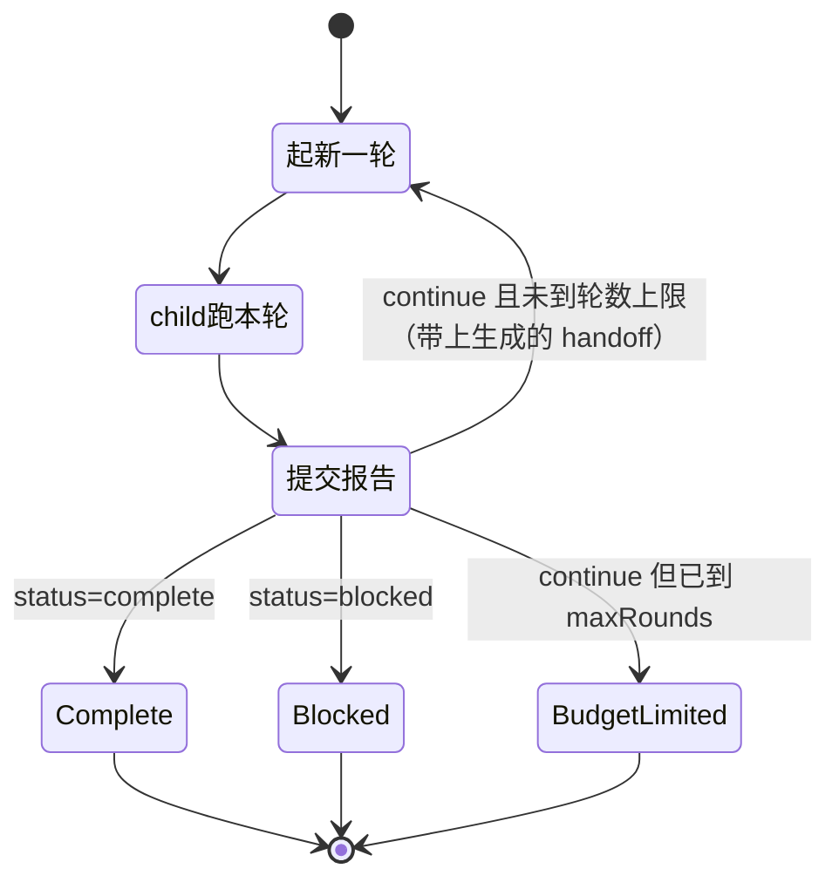

# tool-ralph

> `@deepseek-ai/dsh-tool-ralph` · bundle：`base` · 配置树 id：`tool-ralph` · v0.1.0-rc.5（commit `47f9438`）2026-08-14 核对。出处收在文末[脚注](#出处)，点角标可跳转。

> ⚠️ **本篇未通过对抗式引用核验**：起草已完成，但逐条打开源码比对行号/字段名/英文引文的那一遍因会话额度耗尽未执行。文中脚注坐标与配置字段请以源码为准，核验后本行会被移除。

**一句话**：一个 `ralph` 工具，前台跑一段**编译期写死的 workflow 脚本**，把同一个不可变 objective 交给一串全新的 child agent，一轮一个，轮间只传一份有大小上限的结构化 handoff。

它最容易被误会成 agent 循环里新加的一种模式。不是。README 把定位说得很直白[^1]：

> `It demonstrates a specialized orchestration policy as an ordinary plugin over ctx.workflowEngine and ctx.subagents: no Ralph mode or fresh-agent loop is added to agent-loop, and the same-session goal domain remains independent.`

Ralph 就是一个普通插件，用的全是公开的 `ctx.workflowEngine` 和 `ctx.subagents`，agent-loop 一行没动。

教程正文见 [27 章 RalphLoop](../27-RalphLoop.md)，同 session 的长任务对照见 [26 章 Goal 模式](../26-Goal模式.md)。

## 它在树上长什么样

```yaml
    # Fresh-agent Ralph iteration over a build-time-fixed script.
    - id: tool-ralph
      name: '@deepseek-ai/dsh-tool-ralph'
      config:
        subagentProvider: spawn
        maxRounds: 64
```

配置块里没写 `inject`，但源码里硬依赖四项能力：`tools`、`workflowEngine`、`subagents`、`systemPrompt`[^2]。

一个容易漏看的点：**`maxRounds: 64` 覆盖了源码默认的 256**[^3]。也就是说读源码得到的印象和实际部署差了四倍。

`spawn` 这个 provider 名不是凭空写的，来自 `subagent-spawn-in-process`[^4]。

`web-app` bundle 在宿主平面把它关掉了，再由 preset 挂回来，配置相同[^5]。

## 它注册了什么

| 类型 | 名字 | 说明 |
|---|---|---|
| 工具 | `ralph` | 参数只有必填 `objective: string` 和可选 `maxRounds: number`[^6] |
| prompt 段 | `tool:ralph`，order **116** | 固定 guidance 段的声明位置[^7] |
| 伴生插件 | `./invariant`（`tool-ralph-invariant`） | **空 installer**[^8] |

那个空 installer 的注释写明了为什么空：

> `No runtime invariant: this model-facing orchestration adapter owns no independent event stream; workflow and subagent owners validate the runs and child lifecycles it starts.`

**没有事件监听，没有 provide 任何 service，也不写会话事件**。它是纯消费方，全部动作就两句：调用 `workflowEngine.start` 起 workflow、调用 `subagents.getProvider` 取 provider[^9]。

它的运行期依赖清单里把它列成依赖 `ctx.tools`、`ctx.workflowEngine`、`ctx.subagents`、`ctx.systemPrompt`，以及“a calling Agent (exec.agent parents every fresh round)”[^10]。

## 配置项

| 字段 | 类型 | 默认值（源码 / base 实配） | 作用 |
|---|---|---|---|
| `subagentProvider` | `string` | `spawn` / `spawn` | 每一轮起 child 用的 provider 名 |
| `maxRounds` | `number` | `256` / **`64`** | 一次 run 的轮数默认值**兼**上限 |
| `maxHandoffChars` | `number` | `16384` / 未设 | 单轮报告序列化后的字符上限 |
| `maxResultChars` | `number` | `16384` / 未设 | 成功时给父 agent 的完整文本上限 |

schemastery 定义之后，`resolveConfig` 又手写了一遍同样的校验[^11]。看着像重复劳动，README 给了理由[^12]：`including direct application outside Loader schema normalization`——这个插件可能不经 Loader 直接被用，schema 那层就兜不住了。

`maxRounds` 的双重身份值得单独停一下。它既是默认值，又是天花板：

```
requested = 调用里传的 maxRounds ?? 配置里的 maxRounds
if requested > 配置里的 maxRounds:
    throw "Ralph maxRounds <value> exceeds the deployment ceiling <ceiling>"
// 模型只能往小了调，往大了调当场炸
```

解析出来的值同时作为 `WorkflowStartRequest.maxTotalAgents` 传进引擎，跟引擎自己的总 child 兜底对齐[^13]。

`maxResultChars` **只截渲染文本**，不动 canonical value 里已校验的报告，也不动跨轮 handoff[^14]。

## 固定脚本干了什么

脚本是模板字符串常量 `RALPH_SCRIPT`[^15]。模型改不了它、看不见它、也选不了 provider。

每轮 prompt 由 6 段拼成[^16]，给 child 的只有四样东西：不可变 objective、当前轮次和上限、「共享工作区就是唯一真相源」的指令、上一轮的结构化 handoff。

父对话和上一个 child 的 session **都不注入**。这是整个设计的核心——child 是真的全新，不是继承了上下文的分身。

一轮一个全新 child，靠 status 字段决定是继续开下一轮还是收敛到某个终态：



报告 schema 是 `{ status, summary, evidence, nextSteps, blocker }` 五个必填字段、`additionalProperties: false`[^17]。

status 三态各有自己的合法性规则：

| status | 约束 |
|---|---|
| `continue` | `nextSteps` 非空，`blocker` 必须是空串 |
| `complete` | `evidence` 非空，`nextSteps` 必须为空，`blocker` 必须是空串 |
| `blocked` | `blocker` 必须是非空且已 trim 的字符串 |

规则本身不复杂，复杂的是它验了两遍——生产侧一遍[^18]，跨 provider 边界的消费侧**又一遍**：

```
// 消费侧 readReport / readRunResult 做的事
if keys(report) != {blocker, evidence, nextSteps, status, summary}:   fail   // 精确匹配，多一个少一个都不行
if 报告不合上表三态规则:                                              fail
if 序列化后超 maxHandoffChars:                                        fail   // 不截断，直接失败
```

README 的说法是[^19]：`Invalid, missing, or oversized reports fail the workflow instead of being truncated or mistaken for cap exhaustion.` —— 关键在后半句：坏报告不会被误当成"额度耗尽"[^20]。

终态三种成功值：`complete` / `blocked` / `budget-limited`。其中 `budget-limited` 还额外要求 `roundsStarted` 等于 `maxRounds`，否则报错[^21]：`Ralph workflow returned budget-limited before the round limit`。

## 模型看得见什么

**父 agent 的每次请求**都带上 order 116 那段固定 guidance[^22]：

```markdown
Use the ralph tool ONLY when the direct human explicitly asks for a Ralph loop or fresh-agent iterative execution. Each Ralph round starts a fresh child with no conversation seed and uses the shared workspace as durable memory. Completion and blockers are worker reports, not independent evaluation. Use same-session goal tools for ordinary long-running objectives, and plain subagents or workflows for bounded delegation and fan-out.
```

**父只看得到一条终态结果**，中间 child 的消息和报告都不进父对话[^23]。

渲染文案刻意不把自我申报说成认证——注意每句里的 `reported` 这个词[^24]：

| 情况 | 文本开头 |
|---|---|
| `complete` | `Ralph worker reported completion after <n> round(s).` |
| `blocked` | `Ralph worker reported a blocker after <n> round(s).` |
| `budget-limited` | `Ralph reached its <n> round(s) limit; the worker reported work remaining.` |
| 某轮 child 挂了 | `Ralph round <n> child failed before producing a structured report.` + 上一份成功 handoff[^25]，并且这是**抛错**不是成功返回[^26] |

截断标记是 `\n… [truncated]`[^27]，并且计入 `maxResultChars` 本身。

每个 child 有独立的请求缓存；每一轮都要重新付一份 fresh context 的钱[^28]。

### 跟同组插件的关系

base 把 [tool-todo](./dsh-tool-todo.md) 配成 `allowParallelInProgress: true`，理由之一就是这棵树上存在并发 child。但对 Ralph 来说这个配置基本用不上：每个 child 是独立 session，各自一张 todo 表，跨轮不继承——能跨轮的只有那份 handoff。

[plan-mode](./dsh-plan-mode.md) 和它是两种「软约束」的对照：plan-mode 靠提示段劝，Ralph 靠 order 116 那段劝模型别乱调自己。

## 什么时候你会想换掉它 / 怎么换

- **调轮数上限**：改 `maxRounds`。base 已经从 256 收到 64，这是最常动的一个。
- **换 provider**：`subagentProvider` 换成另一个注册名，但必须满足三个硬条件，任一不满足在调用当场抛错：

```
// requireFreshProvider
p = registry[name]
assert p 存在                              // 已注册
assert p.capabilities.outputSchema         // 能返回结构化输出
assert not p.inheritsParentContext         // 必须是"全新"的，不能继承父上下文
```

  实现在这段校验逻辑里[^29]。README 强调 provider 能力是**每次调用前**才解析的，因为插件生命周期和 HMR 会改注册表[^30]。

- **换编排策略**：换不了。脚本是编译期常量，`WorkflowStartRequest.subagentProvider` 由部署方带进去[^31]：`so the fixed script cannot inspect or change routing and the ordinary model-written workflow tool gains no provider selector`。要别的循环就照它的样子另写一个插件——这个包本身就是个示范[^32]。
- **整个关掉**：`- id: tool-ralph` + `disabled: true`，web-app 就是这么做的。关掉后 `ralph` 工具和 order 116 那段一起消失，workflow 引擎和 subagent 注册表不受影响。

## 坑与边界

README 自己列了六条[^33]：

- **完成是 worker 自己宣布的**——没有独立评估器/验证器，evaluator 策略和 evaluator 驱动的续跑都是 deferred。
- **只有前台**——没有 job id、没有后台收集、没有进程恢复检查点、没有调度器、没有 wall-clock 启动策略。
- **工作区是唯一的跨轮长期记忆**——显式 handoff 只有那一份有界报告，没写进工作区的推理随 child 一起消失。
- **一轮一个 child**——轮内没有 fan-out，不能换模型/provider，没有 fork 上下文。
- **普通 child 失败就是整个 run 终止**——脚本报出失败轮次和上一份成功 handoff，但**不重试**[^34]：`Ralph does not retry that round.`；致命的 workflow 基础设施故障可能在这份状态返回之前就结束。
- **只有轮数在兜底总开销**——token、价格、耗时预算都是 deferred。

读源码还能补上四条：

**取消一律算错误，绝不当作部分成功**（`stopReasonError`）[^35]。取消路径上的收尾比想象中重：

```
exec.signal ──┬─> 传进引擎
              └─> 桥到 run.cancel()
finally:
    await run.dispose()        // 等引擎有界终止 + child 静默
// 所以父步骤被取消时，是"等干净了"才返回，不是立刻返回
```

signal 双路与 dispose 的坐标见脚注[^36]。

**首轮就挂时 `lastReport` 必须是 `null`**，否则报 `Ralph workflow returned an invalid first-round failure`[^37]。

**防递归靠的是提示，不是代码闸门。** 每轮 prompt 里明写 `Do not call the ralph tool: this round already is its worker.`[^38]——就这一句话，没有别的拦截。

**空 objective（trim 后长度 0）当场拒**[^39]。

## 出处

[^1]: 引文出自 `packages/workflow/tool-ralph/README.md:5`。
[^2]: 未在配置块写 `inject`，源码硬依赖声明为 `export const inject = ['tools', 'workflowEngine', 'subagents', 'systemPrompt']`：`packages/workflow/tool-ralph/src/index.ts:20`；对应配置块见 `packages/bundle/base/cordis.patch.yml:377-382`。
[^3]: 源码默认值 256：`packages/workflow/tool-ralph/src/index.ts:37`。
[^4]: provider 注册来源：`packages/bundle/base/cordis.patch.yml:298`（`subagent-spawn-in-process`）。
[^5]: `web-app` bundle 关闭：`packages/bundle/web-app/cordis.patch.yml:398-399`；agent preset 重新挂载：`apps/cli/config/agent-presets/code/agent.cordis.yml:230-234`。
[^6]: `ralph` 工具注册与参数 schema：`packages/workflow/tool-ralph/src/index.ts:412`。
[^7]: order 116 的固定 guidance 段声明：`packages/workflow/tool-ralph/src/index.ts:407-411`。
[^8]: 空 installer：`packages/workflow/tool-ralph/src/invariant.ts:21`。
[^9]: 两处调用坐标：`ctx.workflowEngine.start(...)`：`packages/workflow/tool-ralph/src/index.ts:447`；`ctx.subagents.getProvider(name)`：`:221`。
[^10]: 运行期依赖清单：`docs/tool-catalog.md:32`。
[^11]: schemastery 定义：`packages/workflow/tool-ralph/src/index.ts:35-40`；`resolveConfig` 重复校验：`:187-205`。
[^12]: 引文出自 `packages/workflow/tool-ralph/README.md:34`。
[^13]: 越界抛错：`packages/workflow/tool-ralph/src/index.ts:214`；传参：`:452`；字段定义：`packages/workflow/workflow/src/runtime-types.ts:29`。
[^14]: 引文依据 `packages/workflow/tool-ralph/README.md:13`；实现坐标 `packages/workflow/tool-ralph/src/index.ts:354-358`。
[^15]: `RALPH_SCRIPT` 常量：`packages/workflow/tool-ralph/src/index.ts:90-177`。
[^16]: prompt 拼装：`packages/workflow/tool-ralph/src/index.ts:155-162`。
[^17]: 报告 schema：`packages/workflow/tool-ralph/src/index.ts:91-102`。
[^18]: 生产侧校验：`packages/workflow/tool-ralph/src/index.ts:125-143`。
[^19]: 引文出自 `packages/workflow/tool-ralph/README.md:11`。
[^20]: `readReport`：`packages/workflow/tool-ralph/src/index.ts:247-280`；`readRunResult`：`:283-333`。
[^21]: 越界报错坐标：`packages/workflow/tool-ralph/src/index.ts:307-308`。
[^22]: 固定 guidance 内容：`packages/workflow/tool-ralph/src/index.ts:410`。
[^23]: 引文依据 `packages/workflow/tool-ralph/README.md:76`。
[^24]: 渲染文案：`packages/workflow/tool-ralph/src/index.ts:361-376`。
[^25]: 失败文案与携带上一份成功 handoff：`packages/workflow/tool-ralph/src/index.ts:386-391`。
[^26]: 抛错而非成功返回：`packages/workflow/tool-ralph/src/index.ts:465`。
[^27]: 截断标记：`packages/workflow/tool-ralph/src/index.ts:351`。
[^28]: 引文依据 `packages/workflow/tool-ralph/README.md:81-84`。
[^29]: provider 校验实现：`packages/workflow/tool-ralph/src/index.ts:219-232`。
[^30]: 引文依据 `packages/workflow/tool-ralph/README.md:34`。
[^31]: 引文出自 `packages/workflow/tool-ralph/README.md:9`。
[^32]: 引文出自 `packages/workflow/tool-ralph/README.md:5`。
[^33]: 引文依据 `packages/workflow/tool-ralph/README.md:88-93`。
[^34]: 引文出自 `packages/workflow/tool-ralph/README.md:15`。
[^35]: `stopReasonError`：`packages/workflow/tool-ralph/src/index.ts:336-349`。
[^36]: signal 双路：`packages/workflow/tool-ralph/src/index.ts:456-458`；dispose：`:473`。
[^37]: 首轮失败校验：`packages/workflow/tool-ralph/src/index.ts:315-320`。
[^38]: 该提示句：`packages/workflow/tool-ralph/src/index.ts:156`。
[^39]: 空 objective 校验：`packages/workflow/tool-ralph/src/index.ts:443`。
