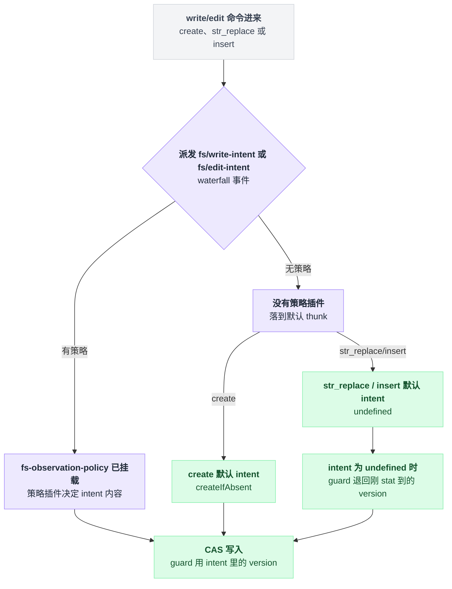

# tool-str-replace-editor

> `@deepseek-ai/dsh-tool-str-replace-editor` · bundle：`base` · 配置树 id：`tool-str-replace-editor` · v0.1.0-rc.5（commit `47f9438`）2026-08-14 核对

**一句话**：把 `view` / `create` / `str_replace` / `insert` 四个命令塞进**一个**名叫 `str_replace_editor` 的工具，跑在 `ctx.fs` 之上——与 [tool-fs](./dsh-tool-fs.md) 的四工具方案并行存在的另一套模型接口，共用同一套 `fs/*` 事件与沙箱策略。

## 它在树上长什么样

`packages/bundle/base/cordis.patch.yml:384-387`：

```yaml
- id: tool-str-replace-editor
  name: '@deepseek-ai/dsh-tool-str-replace-editor'
  config:
    maxOutputChars: 16000
```

行内无 `inject`；包自身导出 `inject = ['tools', 'fs']`（`packages/fs/tool-str-replace-editor/src/index.ts:494`）——注意**没有 `systemPrompt`**，它不贡献任何 prompt 段。

web profile 关掉这一行（`packages/bundle/web-app/cordis.patch.yml:318-319`）。真正把它用起来的是 minimal preset：那里开了一个 `isolate: { fs: true }` 的 group，用裸 `fs-local` 遮蔽 host 的沙箱 provider，再在同一 realm 里挂这个编辑器（`apps/cli/config/agent-presets/minimal/agent.cordis.yml:48-62`）。code / standard / cordis 三个 preset 都不挂它，改用 tool-fs。

## 它注册了什么

| 类型 | 名字 | 说明 |
|---|---|---|
| 工具 | `str_replace_editor` | 单工具四命令，路径必须绝对（`src/index.ts:422`、`src/index.ts:94-96`） |
| 事件派发 | `fs/write-intent`（**waterfall**） | 只在 `create` 分支，默认 thunk 返回 `{ kind: 'createIfAbsent' }`（`src/index.ts:252-257`） |
| 事件派发 | `fs/edit-intent`（**waterfall**） | `str_replace` 与 `insert` 各一次，默认 thunk 返回 `undefined`（`src/index.ts:284`、`src/index.ts:337`） |
| 事件派发 | `fs/observed`（emit） | `view`/`str_replace`/`insert` 命中缺失都记 `{ kind: 'absent' }`（共用 `statExisting`，`src/index.ts:100-113`，emit 在 `:108`），读到/改完记 `{ kind: 'present', version }`（`src/index.ts:235`、`:270`、`:321`、`:363`） |

无 service，无 prompt 段。这两个 waterfall 的唯一决策者是 [fs-observation-policy](./dsh-fs-observation-policy.md)；策略不在时落到默认 thunk。

与 tool-fs 的一个实现差异值得记：`str_replace` / `insert` 拿到 intent 后并不调 `ctx.fs.editText`，而是自己读全文、算好新内容再调 `writeText`；guard 用 intent 里的 version，**intent 为 undefined 时退回刚 stat 到的 version**（`src/index.ts:312-314`、`:354-356`）——也就是说即使没挂策略插件，它仍然做一次 CAS。

`create` / `str_replace` / `insert` 三条写路径都要先过一次 waterfall，`fs-observation-policy` 插件在不在场直接决定 intent 是谁给的：



沙箱侧由内部 `MutationPolicy` 处理：构造时若 `ctx.fs.sandboxMode !== undefined` 却拿不到 `ctx.sandboxPolicy`，直接抛 `tool-str-replace-editor: the mounted filesystem confines but ctx.sandboxPolicy is missing`（`src/index.ts:70-72`）。拒绝错误被映射成 `sandboxDenialMarker(mode)`（`src/index.ts:81-85`）——注意它**不追加**升级提示，也不注册 `sandbox_permissions` 参数，这点与 tool-fs 不同。

## 配置项

| 字段 | 类型 | 默认值 | 作用 |
|---|---|---|---|
| `maxOutputChars` | number | `16000` | 文件视图与目录视图保留的前缀字符数，超出追加固定 clipping 提示（`src/index.ts:506`、提示文本在 `src/index.ts:17`） |
| `description` | string | 内置编辑器指南 | 模型可见的工具描述（`src/index.ts:19-30`、`src/index.ts:507`） |

`apply` 校验 `maxOutputChars` 为正安全整数、`description` 非空（`src/index.ts:516-521`）。base 显式写了 `16000`，与默认值相同。

## 模型看得见什么

README 的 Model Experience 一节写明：模型只看到生成的 `str_replace_editor` schema（含配置里的 `description`），**插件不贡献独立的 system-prompt 段**（`packages/fs/tool-str-replace-editor/README.md:24`）；源码侧也确实没有任何 `ctx.systemPrompt.section` 调用。

默认 description 开头逐字为：

> Custom editing tool for viewing, creating and editing files

结果侧：`view` 返回带 6 位右对齐行号的文本（`src/index.ts:180`）或两层深的目录清单——目录清单过滤掉 `.` 开头项、`node_modules`、`__pycache__`（`src/index.ts:194-197`）。`create` 返回 `New file created successfully at: <path>`（`src/index.ts:271`），`str_replace` / `insert` 返回 `The file <path> has been edited successfully.`（`src/index.ts:322`、`:364`）。超长视图保留前缀并追加 `<response clipped>` 提示。

调用卡片：`view` 是 generic read 卡，`create` / `str_replace` 是 diff 卡，`insert` 是 generic edit 卡（`src/index.ts:372-417`）。

## 什么时候你会想换掉它 / 怎么换

它与 tool-fs 是**互斥的风格选择**，不是层级关系：想要单工具多命令的编辑器就留它、关 tool-fs；想要 `read`/`write`/`edit` 分开的接口就反过来。base 两个都挂着，取舍留给 profile 与 preset。

只想改文案或视图长度：

```yaml
- id: tool-str-replace-editor
  config:
    maxOutputChars: 32000
    description: |
      <你自己的编辑器指南>
```

patch 会整体替换该行 `config`，两个字段要一起写全（`packages/bundle/base/README.md:21`）。关掉它：

```yaml
- id: tool-str-replace-editor
  disabled: true
```

## 坑与边界

- 只处理 UTF-8 文本，二进制不支持。
- `str_replace` 故意拒绝零匹配与多匹配，且**没有** `replace_all` 参数；多匹配时报错里会列出所有命中行号（`src/index.ts:300-306`）。
- 每次变更都过 `fs/write-intent` 或 `fs/edit-intent`，解析当前 session 的沙箱策略，把强制执行委托给挂载的 filesystem 与策略插件——本包自己不判权限。
- 路径必须绝对，相对路径直接被拒并提示 `Maybe you meant /<path>?`（`src/index.ts:94-96`）。
- `view` 的目录分支用 `ctx.fs.listDir` 逐目录递归两层（`src/index.ts:185-214`）：每个目录一次 provider 调用，**串行**，没有条目数上限，只有输出字符上限；工具定义未声明 `timeoutMs`，取消只靠传下去的 `exec.signal`。

## 未确认

- ⚠️ `create` 分支先 `stat` 判存在再走 `fs/write-intent`（`src/index.ts:249`），与 tool-fs 的"零 stat"路径不同；这多出的一次 stat 与后续 `createIfAbsent` 之间的窗口如何表现，未实机验证，只能从代码推断由 provider 的 no-replace 发布兜底。
