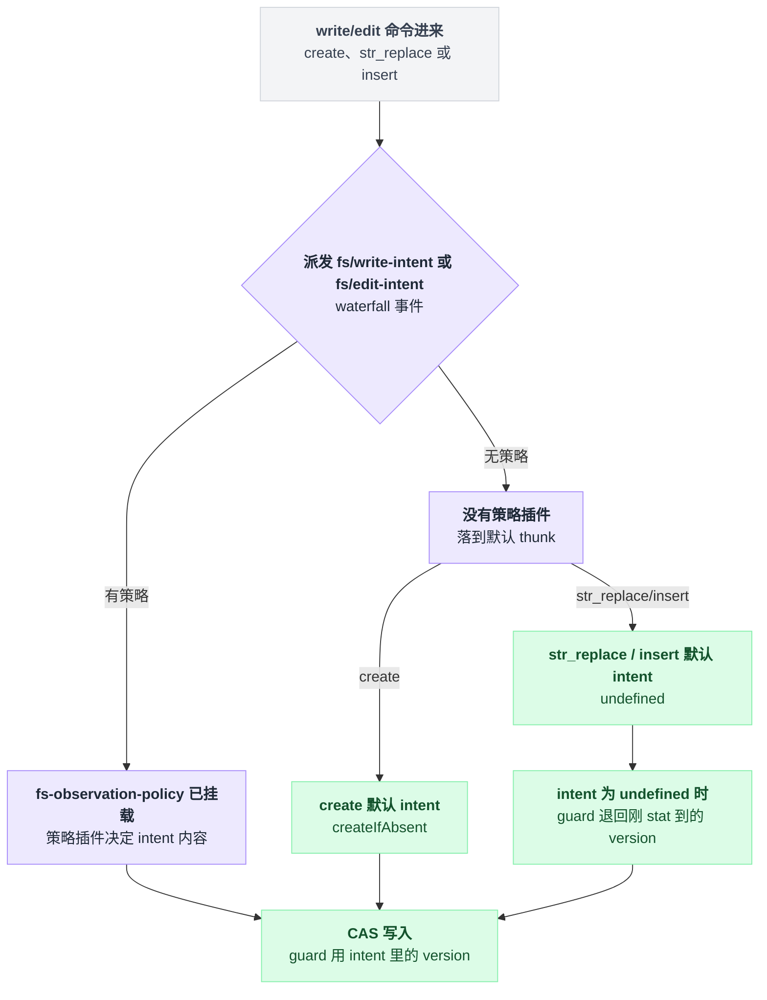

# tool-str-replace-editor

> `@deepseek-ai/dsh-tool-str-replace-editor` · bundle：`base` · 配置树 id：`tool-str-replace-editor` · v0.1.0-rc.5（commit `47f9438`）2026-08-14 核对。正文只讲机制，可照抄的配置片段收在文末附录，出处收在文末脚注。

**一句话**：把 `view` / `create` / `str_replace` / `insert` 四个命令塞进**一个**名叫 `str_replace_editor` 的工具，跑在 `ctx.fs` 之上——与 [tool-fs](./dsh-tool-fs.md) 的四工具方案并行存在的另一套模型接口，共用同一套 `fs/*` 事件与沙箱策略。

名字听着像是 tool-fs 的下一代：功能更全，接口更新。不是的。两者此刻同时挂在 base 这棵树上，谁也没有取代谁——区别只在摆法：一个工具四个命令，还是四个工具各管一摊。

## 它在树上长什么样

base bundle 里它的配置只有四行[^1]，`config` 下唯一的字段是 `maxOutputChars`。行内没有写 `inject`：依赖由包自身在代码里导出声明，是 `tools` 和 `fs` 两个[^2]。这里有一处容易漏看——它同样没有声明 `systemPrompt` 依赖，也就是说这个插件不往模型的系统提示词里加一个字[^2]。

"挂在 base 上"不等于"到处都在用"，四个落点，四种命运：

| 位置 | 状态 | 说明 |
|---|---|---|
| base bundle | 挂着 | 与 tool-fs 并存[^1] |
| web profile | 关掉 | 显式禁用[^3] |
| minimal preset | 真正用起来的地方 | 开一个 `isolate: { fs: true }` 的隔离分组，用裸 `fs-local` 遮蔽 host 的沙箱 provider，在同一个 realm 里单独挂这个编辑器[^4] |
| code / standard / cordis 三个 preset | 都不挂 | 改用 tool-fs |

只有 minimal 这一处，模型面前才真的只有它一个编辑器；其余地方要么两套都在（base），要么两套都关了自己另挂（web），要么用 tool-fs 顶替。

## 它注册了什么

一个工具名下挂着四个命令，路径必须写绝对路径[^5]。它往外发的事件不多，三种：

| 事件 | 模式 | 什么时候发、发什么 |
|---|---|---|
| `fs/write-intent` | waterfall | 只在 `create` 分支发一次，默认 thunk 给出 `{ kind: 'createIfAbsent' }`[^6] |
| `fs/edit-intent` | waterfall | `str_replace` 与 `insert` 各发一次，默认 thunk 给出 `undefined`[^7] |
| `fs/observed` | emit | 目标缺失时记 `absent`——`view`/`str_replace`/`insert` 共用同一段探测逻辑；读到或改完记 `present` 并带上版本号[^8] |

它不注册任何 service，也没有 prompt 段。两个 waterfall 是唯一的决策入口，唯一会接手的监听者是 [fs-observation-policy](./dsh-fs-observation-policy.md)；那个插件不在场时，两个事件都落到刚才说的默认 thunk。

### 没插件接管，写入是不是就没了保护？

直觉上该是"没了"——没有策略插件表态，这次写入照理该是无条件的。

不是的。它与 tool-fs 有一处实现上的分岔：`str_replace` 和 `insert` 拿到 intent 之后不调统一的编辑接口，而是自己读全文、在内存里算出新内容，再调写入接口：

```
version_now = stat(path).version   // 顺手记下刚看到的版本
intent      = 派发 fs/edit-intent  // 有策略插件就由它给，没有就是 undefined
old         = readText(path)
new         = 在 old 上做替换/插入
writeText(path, new, guard = intent?.version ?? version_now)
```

锁死一切的是最后一行的 `guard`：它取的是 intent 里的 version；intent 是 `undefined` 时，就退回刚才 stat 到的那个 version[^9]。换句话说，即便没有任何策略插件挂在这条链上，写入这一步依然是一次要比对版本号才放行的 CAS——没有旁路能绕开版本校验，能变的只是这个版本号从哪里来。

`create` / `str_replace` / `insert` 三条写路径都要先过一次 waterfall，策略插件在不在场直接决定这个 intent 是谁给的：



### 沙箱侧：出问题不等到写入那一刻才暴露

沙箱由内部的 `MutationPolicy` 处理，它在构造的那一刻就先做一次自检：如果挂载的文件系统本身是受限的（沙箱模式不是 `undefined`），却拿不到对应的沙箱策略对象，它当场抛错——`tool-str-replace-editor: the mounted filesystem confines but ctx.sandboxPolicy is missing`，不拖到真正写入那一刻才发现问题[^10]。拒绝时的报错会被映射成 `sandboxDenialMarker(mode)`[^11]。

与 tool-fs 不同的两点也在这里：它**不追加**升级提示，也**不注册** `sandbox_permissions` 这个参数[^11]——同样是被沙箱拒绝，模型从这个工具这里拿到的引导比从 tool-fs 少一截。

## 配置项

| 字段 | 类型 | 默认值 | 作用 |
|---|---|---|---|
| `maxOutputChars` | number | `16000` | 文件视图与目录视图保留的前缀字符数，超出就截断并追加固定的 clipping 提示[^12] |
| `description` | string | 内置编辑器指南 | 模型可见的工具描述[^13] |

`apply` 校验 `maxOutputChars` 为正安全整数、`description` 非空[^14]。base 显式写了 `16000`，其实跟不写时的默认值一样。

## 模型看得见什么

README 的 Model Experience 一节写明：模型只看到生成出来的 `str_replace_editor` schema（含配置里的 `description`），这个插件不贡献独立的 system-prompt 段[^15]；源码里也确实找不到一处往系统提示词里塞内容的调用。

默认 `description` 开头逐字为：

> Custom editing tool for viewing, creating and editing files[^13]

四个命令各自的返回与调用卡片：

| 命令 | 返回 | 调用卡片 |
|---|---|---|
| `view`（文件） | 带 6 位右对齐行号的文本[^16] | generic read |
| `view`（目录） | 两层深的目录清单，过滤掉以 `.` 开头的条目、`node_modules`、`__pycache__`[^17] | generic read |
| `create` | `New file created successfully at: <path>`[^18] | diff |
| `str_replace` | `The file <path> has been edited successfully.`[^19] | diff |
| `insert` | 同上[^19] | generic edit |

超长视图保留前缀并追加 `<response clipped>` 提示；四种命令各自对应哪种调用卡片，判定逻辑集中在同一处[^20]。

## 什么时候你会想换掉它 / 怎么换

它与 tool-fs 是**互斥的风格选择**，不是谁更先进谁更落后：想要单工具多命令的编辑器就留它、关掉 tool-fs；想要 `read`/`write`/`edit` 分开的接口就反过来。base 两个都挂着，取舍留给 profile 与 preset 去做。

只想改文案或视图长度，照抄[附录 A](#a-改文案或视图长度)。这里有个坑：patch 会把 `config` 这一行整体替换掉，两个字段要一起写全，只写一个会把另一个字段的值抹掉[^21]。

想彻底关掉它，照抄[附录 B](#b-关掉它)。

## 坑与边界

只处理 UTF-8 文本，二进制不支持。

`str_replace` 故意拒绝零匹配与多匹配，且**没有** `replace_all` 参数可以绕开。多匹配时报错里会把每一处命中的行号都列出来[^22]：

```
hits = 在全文中找 old_str 的所有出现
if len(hits) == 0:  报错「没找到」
if len(hits) > 1:   报错，并把每一处的行号都列出来
否则               替换这唯一的一处
```

路径必须绝对，相对路径直接被拒，并提示 `Maybe you meant /<path>?`[^23]。

每次变更都过 `fs/write-intent` 或 `fs/edit-intent`，解析当前 session 的沙箱策略，把强制执行这件事委托给挂载的文件系统与策略插件——本包自己不判权限，它只负责问一声。

`view` 的目录分支用 `ctx.fs.listDir` 逐层递归，深度封死在两层[^24]：

```
list(dir, depth):
    entries = ctx.fs.listDir(dir)     // 一个目录一次 provider 调用，串行
    for e in entries:
        收进清单
        if e 是目录 且 depth < 2:
            list(e, depth + 1)
```

没有条目数上限，只有输出字符上限；工具定义未声明 `timeoutMs`，取消只靠传下去的 `exec.signal`。目录多的时候，这条串行递归就是唯一会让你等的地方。

## 把这份摆法串起来

- **它不是 tool-fs 的升级版，是同一件事的另一种摆法**——一个工具四命令，还是四个工具各管一摊，base 两个都挂着，只有 minimal preset 真正只留它一个；
- **没插件接管，写入照样是 CAS**——guard 里的版本号缺了 intent 就退回刚 stat 到的那个，绕不开版本校验，能变的只是版本号从哪来；
- **沙箱检查在构造时就先自问一句**——拿不到策略对象直接抛错，不等到真正写入那一刻才暴露；
- **它比 tool-fs 沉默一截**——被沙箱拒绝时不追加升级提示，也不给模型多开一个 `sandbox_permissions` 参数；
- **`str_replace` 宁可报错也不猜**——零匹配、多匹配都不放行，没有 `replace_all` 这条捷径。

想留哪一套编辑器接口，看你更在乎"一个工具好记"还是"四个工具职责分明"——这是这份文档唯一没法替你做的决定。

---

## 附录：可以照抄的模板

### A. 改文案或视图长度

```yaml
- id: tool-str-replace-editor
  config:
    maxOutputChars: 32000
    description: |
      <你自己的编辑器指南>
```

### B. 关掉它

```yaml
- id: tool-str-replace-editor
  disabled: true
```

---

## 出处

[^1]: base bundle 的挂载配置：`packages/bundle/base/cordis.patch.yml:384-387`。
[^2]: 包自身导出 `inject = ['tools', 'fs']`，且未声明 `systemPrompt` 依赖：`packages/fs/tool-str-replace-editor/src/index.ts:494`。
[^3]: web profile 关闭：`packages/bundle/web-app/cordis.patch.yml:318-319`。
[^4]: minimal preset 的隔离分组与挂载点：`apps/cli/config/agent-presets/minimal/agent.cordis.yml:48-62`。
[^5]: 工具 `str_replace_editor` 与路径必须绝对的校验：`src/index.ts:422`、`:94-96`。
[^6]: `fs/write-intent` 只在 `create` 分支派发，默认 thunk 返回 `{ kind: 'createIfAbsent' }`：`src/index.ts:252-257`。
[^7]: `fs/edit-intent` 在 `str_replace`、`insert` 各派发一次，默认 thunk 返回 `undefined`：`src/index.ts:284`、`:337`。
[^8]: `fs/observed`：缺失探测共用 `statExisting`，emit 在 `src/index.ts:100-113`（`:108`）；成功后记 `present` 并带版本号在 `:235`、`:270`、`:321`、`:363`。
[^9]: CAS 的 guard 取值逻辑：`src/index.ts:312-314`、`:354-356`。
[^10]: `MutationPolicy` 构造期的硬检查：`src/index.ts:70-72`。
[^11]: 拒绝错误映射为沙箱拒绝标记，且不追加升级提示、不注册 `sandbox_permissions`：`src/index.ts:81-85`。
[^12]: `maxOutputChars` 与截断提示文案：`src/index.ts:506`、`:17`。
[^13]: `description` 字段与默认文案：`src/index.ts:19-30`、`:507`。
[^14]: `apply` 的字段校验：`src/index.ts:516-521`。
[^15]: README 的 Model Experience 一节：`packages/fs/tool-str-replace-editor/README.md:24`。
[^16]: `view`（文件）返回格式：`src/index.ts:180`。
[^17]: `view`（目录）返回格式：`src/index.ts:194-197`。
[^18]: `create` 返回文案：`src/index.ts:271`。
[^19]: `str_replace`/`insert` 返回文案：`src/index.ts:322`、`:364`。
[^20]: 调用卡片的类型判定逻辑：`src/index.ts:372-417`。
[^21]: patch 整体替换 `config` 字段的坑：`packages/bundle/base/README.md:21`。
[^22]: `str_replace` 零匹配/多匹配的报错逻辑：`src/index.ts:300-306`。
[^23]: 相对路径拒绝提示：`src/index.ts:94-96`（同[^5]）。
[^24]: `view` 目录分支的递归实现：`src/index.ts:185-214`。
