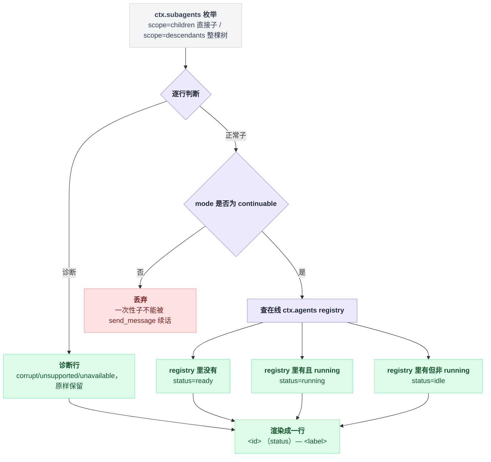

# tool-subagent-control/list-agents

> `@deepseek-ai/dsh-tool-subagent-control/list-agents` · bundle：`base` · 配置树 id：`tool-subagent-list-agents` · v0.1.0-rc.5（commit `47f9438`）2026-08-14 核对

> ⚠️ **本篇未通过对抗式引用核验**：起草已完成，但逐条打开源码比对行号/字段名/英文引文的那一遍因会话额度耗尽未执行。文中 `path:line` 与配置字段请以源码为准，核验后本行会被移除。

**一句话**：唯一的 `list_agents` 工具——把 `ctx.subagents` 的持久子目录投影成「只含可续子」的列表，并用在线 Agent registry 把状态细化成 `running` / `idle` / `ready`。

## 它在树上长什么样

```yaml
    - id: tool-subagent-list-agents
      name: '@deepseek-ai/dsh-tool-subagent-control/list-agents'
```

它没有 config。它是 [`tool-subagent-control`](./dsh-tool-subagent-control.md) 同一个包的**子路径入口**，走 `package.json` 里的 `exports['./list-agents']`。

之所以单独占一行而不是跟着根插件走，是为了让部署可以「只要投递、不要发现」——禁掉这行，模型就失去列举能力，投递能力照旧。

出处：配置树那两行见 `packages/bundle/base/cordis.patch.yml:310-311`；子路径入口见 `packages/subagent/tool-subagent-control/package.json`。

它的依赖比根插件多一层：

| 什么时候要 | 要什么 | 出处 |
|---|---|---|
| 加载时 inject | `['tools', 'subagents', 'agents']`，比根插件多一个 `agents` | `src/list-agents.ts:18` |
| 调用时 | session store、projection registry（base 里 `session-projection` 这一行） | `packages/bundle/base/cordis.patch.yml:126` |
| 任何时候 | **不需要任何 query 服务** | — |

多出来的那个 `agents` 就是为了状态细化——不读在线 registry 就分不出 `running` 和 `idle`。

web-app 把这一行 `disabled: true`（`packages/bundle/web-app/cordis.patch.yml:377-378`）。

## 它注册了什么

| 类型 | 名字 | 说明 |
|---|---|---|
| 工具 | `list_agents` | `src/list-agents.ts:92-191` |

**没有事件监听**（无 waterfall），没有 prompt 段，没有 service。整个插件就是一个工具。

调用入口的骨架很短，两件事：先确认自己是谁，再按 scope 分派。

```
caller = exec.agent?.sessionId
if caller 缺失:  直接抛错             // 不知道父是谁就没法列子

if scope == 'descendants':
    rows = ctx.subagents.listDescendants(caller, exec.signal)
else:                                 // children 是默认值
    rows = ctx.subagents.listChildren(caller, exec.signal)
```

取 caller 与缺失即抛见 `src/list-agents.ts:165-169`，两个 scope 的分派见 `:173-185`。两者的差别：

| scope | 读的服务方法 | 行内容 |
|---|---|---|
| `children`（默认） | `ctx.subagents.listChildren(parent.id, exec.signal)` | 直接子 |
| `descendants` | `ctx.subagents.listDescendants(parent.id, exec.signal)` | 整棵树，稳定前序，每行加 `parent=<id> depth=<n>` |

## 投影：丢掉一次性子，再给状态

拿到的是持久子目录的原始行，要经过一次过滤和一次在线状态查询才变成模型看到的列表。

```
for row in rows:
    if row 是诊断行:      原样保留，不查状态
    if row.mode != 'continuable':  丢弃      // 一次性子不能被 send_message 续话
    else:
        agent = ctx.agents 里查 row.id
        if agent 不存在:                status = 'ready'
        elif agent.status == 'running': status = 'running'
        else:                           status = 'idle'
```

关键在那句 `丢弃`：一次性子无法被 `send_message` 续话，所以模型不该选到它们。但**发现过程仍然穿过它们**去找更深的可续后代——过滤只发生在渲染这一层，不打断遍历。

`ready` 这个词是刻意挑的，意思是「可恢复而非终态」，不是一个等着被收取的结果。

投影规则在 `project()`（`src/list-agents.ts:66-85`），状态判定在 `statusOf()`（`:59-63`）。

从持久子目录到最终渲染行，中间要经过一次过滤和一次在线状态查询：



这里有个容易读错的地方：`descendants` 行里的 `parent` 是持久的**直接父 session id**，它可能指向一个根本没出现在输出里的普通 session。

对调用方而言，只有 depth-1 的子才是 `send_message` 的候选，更深的只能作为 `interrupt_agent` 的候选。

## 配置项

无配置项。行为由三样东西决定：

1. 调用 agent 的 session id（从 `exec.agent` 取，缺了直接抛，`src/list-agents.ts:165-169`）
2. `ctx.subagents` 的枚举结果
3. 在线 `ctx.agents` registry

## 模型看得见什么

schema 只有一个可选 `scope` 枚举（`children` / `descendants`）。输出是纯文本，每个可续子一行：

| 情况 | 渲染成 |
|---|---|
| 正常行 | `<id> [<status>] — <label>` |
| 诊断行 | `<id> [diagnostic: <reason>]`，reason ∈ `corrupt` / `unsupported` / `unavailable` |
| `descendants` 下 | 在破折号前插入 ` parent=<id> depth=<n>` |
| 一行都没有 | `(no subagents)` |

渲染实现在 `src/list-agents.ts:144-162`。诊断永远不暴露 descriptor 内容。

工具描述里明确劝阻轮询：「Use it to recall which ones you started, not to poll for completion — you are told when one finishes.」以及「The snapshot is not a delivery promise — `send_message` performs the authoritative check and may still fail.」

token 上它随列出的可续子数量线性增长。`descendants` 是整棵树，**没有游标也没有上限**——持久子很多的长命父，每次调用都要付整份列表的钱。

## 什么时候你会想换掉它 / 怎么换

- **不想让模型看到发现能力**：禁掉这一行，保留 [tool-subagent-control](./dsh-tool-subagent-control.md) 根行——投递照常，`send_message` 仍然是权威检查方。
- **UI 需要一次性子**：别改这个工具，直接消费服务侧的 `ctx.subagents.listChildren()`——服务结果里**包含**一次性 session-backed 子，只是这个模型工具把它们过滤掉了。
- 想加分页或删除？目前没有，见下节。

## 坑与边界

- **列表是快照，不是投递承诺**——它可能与发布、销毁或一条后续消息竞态，另一个进程也可能激活本进程报成 `ready` 的子；跨进程准确性需要共享租约。
- **没有分页也没有删除**——完整、稳定排序的集合全量返回；只要子 session 还在持久化里就一直列着，服务级的上限或删除操作是后续产品决定。
- **projection registry 没挂就 fail loud**——服务以 `SUBAGENT_CONTROL_PROJECTIONS_UNAVAILABLE` 报错，缺 session store 则是 `SUBAGENT_CONTROL_SESSION_STORE_UNAVAILABLE`（见 [subagent](./dsh-subagent.md)）。
- **取消会被观测**——每次持久化读都收到 `exec.signal`，读前后都重查取消，观察到的 abort 一律变成 `SubagentError` 的 `CANCELLED` 码。
- 还在创建窗口里、descriptor 尚未追加的运行中子会被**省略**（不是诊断），这是服务侧枚举的规则。
