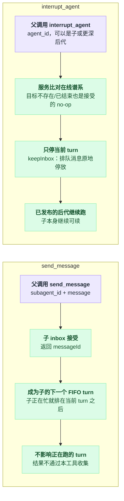

# tool-subagent-control

> `@deepseek-ai/dsh-tool-subagent-control` · bundle：`base` · 配置树 id：`tool-subagent-control` · v0.1.0-rc.5（commit `47f9438`）2026-08-14 核对。出处收在文末脚注。

> ⚠️ **本篇未通过对抗式引用核验**：起草已完成，但逐条打开源码比对行号/字段名/英文引文的那一遍因会话额度耗尽未执行。文中 `path:line` 与配置字段请以源码为准，核验后本行会被移除。

**一句话**：全局唯一的 `send_message` 和 `interrupt_agent` 两个工具，是 `ctx.subagents.followup()` / `interrupt()` 的薄适配层——父到子的方向；`list_agents` 在同包的[子路径插件](./dsh-tool-subagent-control--list-agents.md)里单独加载。

## 它在树上长什么样

```yaml
    - id: tool-subagent-control
      name: '@deepseek-ai/dsh-tool-subagent-control'
```

无 config。上方注释写着：可续后台子按委派工具逐个选择，而这个单独加载的 follow-up 工具注册的是**唯一一份全局 `send_message`**[^1]。

依赖只有两条：`tools` 和 `subagents`，文档目录里也记为 `requires tools · subagents`[^2]。注意它**不要求** `agents`——那是 list-agents 子插件的事。

之所以和 provider 绑定的 [tool-subagent](./dsh-tool-subagent.md) 分开：多个委派工具（base 里就有 `subagent` 和 `subagent_fork` 两个）不该各自注册一份重复的全局控制工具。web-app 把这一行禁用了[^3]。

## 它注册了什么

两个工具，坐标收在脚注里[^4]：

| 类型 | 名字 | 说明 |
|---|---|---|
| 工具 | `send_message` | 把消息投进子的 inbox |
| 工具 | `interrupt_agent` | 打断子当前的 turn |

**没有事件监听**（因此也没有 waterfall），没有 prompt 段，没有 service。

它也不做任何生命周期路由——residency 和冷恢复都属于 subagent 服务。

### send_message：投进 inbox 就结束

`send_message` 把 `exec.agent` 作为「授权投递的那个精确在线父」传下去，并把消息来源记成一个 coordinator/relay 标记，附带发送方的 session id[^5]。

服务保留这个来源，但**从不把它当成权限**。

每条消息通过 `Agent.followup()` 成为子的下一个 FIFO turn：子还在干活时消息就等着，所以它无法改变已经在跑的工作。`exec.signal` 只管到 inbox 接受为止，接受之后这个 turn 就没法再从这里取消了。

### interrupt_agent：权限交给服务去判

`interrupt_agent(agent_id)` 把 `exec.agent` 作为「精确在线祖先」权限交给 `ctx.subagents.interrupt()`[^6]。目标可以是直接子，也可以是更深的后代，**由服务而不是这个工具**去比对目标 Activation 记录的谱系。

它只停当前 turn（`keepInbox`），停完之后的世界是这样的：

| 对象 | 打断之后 |
|---|---|
| 当前 turn | 停 |
| 已排队的消息 | 原地停放，等下一次 `send_message` |
| 已发布的后代 | 继续跑 |
| 子本身 | 继续可续 |

调用在停止请求被接受时就返回，不等目标静默。至于什么算「被接受」：

| 调用形态 | 结果 |
|---|---|
| 目标不存在 / 已结束 | 被接受的 no-op |
| self / 兄弟 / 过期 / 非祖先调用者 | errored 结果 |

两个工具都在 `exec.agent` 缺失时直接抛[^7]：父权限和祖先权限都要求一个精确的在线调用 agent。

两个工具都是「接受即返回」，但接受之后各自影响的范围完全不同：



## 配置项

无配置项。

行为完全由 `ctx.subagents` 决定：投递路由、冷恢复、权限校验、interrupt 的谱系检查全在服务侧，这里只转发参数和 `exec.agent`。

## 模型看得见什么

`send_message` 取 `subagent_id` 和 `message`，描述里逐字说明三件事：它「becomes the subagent's next turn」、「This call returns no answer from the subagent」、以及「A failure means the message was NOT delivered.」。接受时渲染 `message queued as the next turn for subagent <subagent_id>`，规范输出里带被接受的 `messageId`。

`interrupt_agent` 取 `agent_id`，描述说明只有当前 turn 会停、已排队消息停放、它启动的 agent 继续跑、接受早于真正停止；渲染 `interrupt requested for agent <agent_id>`。目标不存在或已结束也照样渲染这行接受语。

token 上两者都只有一行短确认；被打断那一 turn 的中止只在子自己的 transcript 里可见。KV cache 上 schema 运行时不变，结果只追加。

## 什么时候你会想换掉它 / 怎么换

- **只要投递不要发现**：保留本行，把 [`tool-subagent-list-agents`](./dsh-tool-subagent-control--list-agents.md) 那一行禁掉。README 明确说这是支持的部署形态。
- **完全不要父到子的控制**：禁掉本行。**注意这不会影响委派工具启动可续子**——「Starting continuable work does not require `send_message` to be loaded.」模型仍然能拿到 `subagentId`，只是没法再往里发消息。
- **要子到父的方向**：那是另一个包 [tool-subagent-report](./dsh-tool-subagent-report.md)，两个方向互不依赖。

## 坑与边界

**排队的消息没有独立结果。** 接受只返回 inbox 的 `messageId`，子的工作落在它自己的持久 Session 里，永远不通过这个工具收集。拿到 `report` 授权的子可以另外回传内容，但那条消息不是本次调用的结果。

**不能改变进行中的 turn。** 每条消息都开一个后续 FIFO turn，发给正在忙的子只会排在当前 turn 之后。

**列表是快照，不是投递承诺。** 这条属于 list-agents，但会影响这里的用法——`interrupt_agent` 自己做权威的在线谱系检查，所以发现层的过期数据无法授予权限。

源码侧还有一个容易误判的地方：`SubagentRuntime` 里的 `interrupt` 方法包着一层可选链，只有组合里真的挂了 continuation manager 才会真正调用它。

```
if 组合里没有 continuation manager:
    this.continuations 是 undefined
    ?. 短路 → 什么都没停
    工具照样返回 { accepted: true }     // 「被接受」不等于「真的打断了」
```

也就是说，没有 continuation manager 的组合下它是被接受的 no-op[^8]。

---

## 出处

[^1]: 树上这两行见 `packages/bundle/base/cordis.patch.yml:307-308`，上方注释见 `:305-306`。
[^2]: 模块导出 `export const inject = ['tools', 'subagents']` 见 `packages/subagent/tool-subagent-control/src/index.ts:19`；依赖记录见 `docs/config-catalog.md:3090`。
[^3]: web-app bundle 把这一行 `disabled: true`：`packages/bundle/web-app/cordis.patch.yml:374-375`。
[^4]: `send_message` 的实现见 `packages/subagent/tool-subagent-control/src/index.ts:26-77`，`interrupt_agent` 见同文件 `:79-119`。
[^5]: 消息来源记录见 `src/index.ts:71`。
[^6]: `src/index.ts:116`。
[^7]: `src/index.ts:60-64`、`:109-113`。
[^8]: 实现在 `packages/subagent/subagent/src/index.ts:256`。
