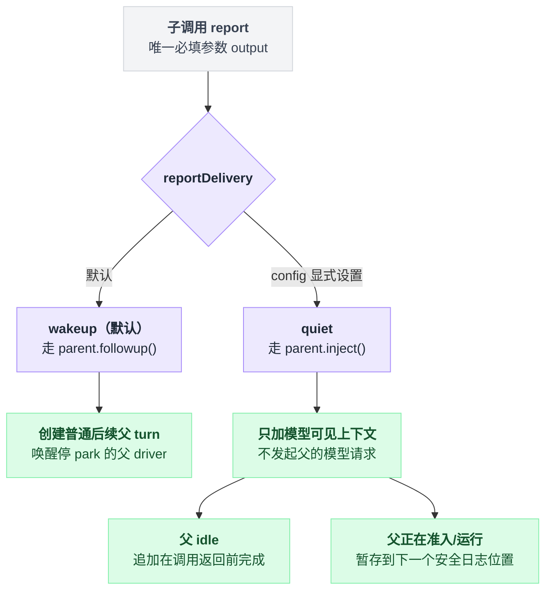

# tool-subagent-report

> `@deepseek-ai/dsh-tool-subagent-report` · bundle：`base` · 配置树 id：`tool-subagent-report` · v0.1.0-rc.5（commit `47f9438`）2026-08-14 核对。出处收在文末脚注。

> ⚠️ **本篇未通过对抗式引用核验**：起草已完成，但逐条打开源码比对行号/字段名/英文引文的那一遍因会话额度耗尽未执行。文中脚注坐标与配置字段请以源码为准，核验后本行会被移除。

**一句话**：给每个**可续的进程内子** agent 装上作用域局部的 `report` 工具和配套 prompt 段——子到父的返回通道，`ctx.subagents.reportFrom()` 的薄适配层。

## 它在树上长什么样

```yaml
    - id: tool-subagent-report
      name: '@deepseek-ai/dsh-tool-subagent-report'
```

两行，没有 `config`，所以 `reportDelivery` 吃默认值 `wakeup`。上方那行注释已经把定位讲完了：可选的直接子返回通道，root 和一次性 agent 身上都没有[^1]。

模块的依赖声明是这一行：

```ts
export const inject = ['subagents', 'tools', 'systemPrompt']
```

这里有个我第一遍看漏的地方。真正的注册只经过 `childCtx.tools` 和 `childCtx.systemPrompt`，父作用域的 `tools`、`systemPrompt` 其实用不上——那为什么还要声明？为了让 Loader 排序在**加载时**就失败，而不是拖到下一次子物化才炸。声明多了不是冗余，是把错误提前[^2]。

web-app **不禁用**这一行。理由挺绕，值得抄下来：它注册的是 singleton 上的一份 continuable setup，而不是本 agent 调用的工具；而这个 setup 列表**不是 scope-aware** 的——每个挂载的 preset 各来一份，于是第二个在线 session 上就会抛错[^3]。

## 它注册了什么

它一共注册三样东西[^4]：

| 类型 | 名字 | 说明 |
|---|---|---|
| continuable setup 贡献 | 匿名 | 调用 `ctx.subagents.registerContinuableSetup(...)` 注册 |
| 工具（子作用域） | `report` | 调用 `childCtx.tools.register(...)` 注册 |
| prompt 段（子作用域） | `tool:report`（order 117） | 调用 `childCtx.systemPrompt.section(...)` 注册 |

**没有事件监听**（无 waterfall），也**没有全局工具**。以下几种角色都永远看不到、也执行不了它：root、一次性子、远端 provider 的子、兄弟作用域、以及无 agent 的工具执行。

### 收件人是推出来的，不是传进来的

`report` 的 schema 里没有收件人参数。谁会收到，是服务自己算的：

```
收件人 = 发信子的 parentSession        // 持久的，不是调用现场传的
发信方 = exec.agent                    // 精确到那个在线 Agent，同时就是权限凭据
```

也就是说，"你是谁"和"你能发给谁"是同一个事实的两面，模型没有任何插手余地[^5]。

调用成功时返回的是父侧**已接受消息**的稳定 `MessageId`。这个"接受"的语义窄得需要单独列一下：

| 它是 | 它不是 |
|---|---|
| 父侧已接受该消息，并给出稳定 `MessageId` | 读回执 |
| | inbox 出现 id |
| | 父日志确认 |
| | turn 完成回执 |
| | 持久化 flush |

### 安装体与回滚

安装体导出为 `installReportTool`，接收 `childCtx`、`ctx`、`delivery` 三个参数，返回一个同时撤销工具与 prompt 段的 disposer[^6]。生成工具目录走的就是这条路径——因为全局 registry 没办法暴露一个作用域局部的 schema。

注册路径上的失败处理是这样的[^7]：

```
先注册 prompt 段
再注册 tool
    tool 注册失败 → 回滚已注册的 prompt 段
        回滚也失败 → 抛 AggregateError（两个错都带上）
```

## 配置项

只有一个字段[^8]：

| 字段 | 类型 | 默认值 | 作用 |
|---|---|---|---|
| `reportDelivery` | `'quiet' \| 'wakeup'` | `wakeup` | 每条被接受的 report 在父侧怎么调度 |

两个值在父侧引发的动作完全不同：

```
if delivery == wakeup:                 // 默认
    parent.followup()
    → 恰好创建一个普通的后续父 turn
    → 唤醒停 park 的父 driver
    → 从不改变进行中的 turn

if delivery == quiet:
    parent.inject()
    → 只加模型可见上下文，不发起父的模型请求
    if 父 idle:            追加在调用返回前就完成
    if 父正在准入或运行:    暂存到下一个安全日志位置
```

`wakeup` 之所以是默认，是因为已经 park 的父没有别的理由回头看——安静投递会让一条已接受的 report 一直没人读。

这是**部署级调度策略**，模型 schema 无法逐次选择或覆盖。

所以选哪个，本质上只在回答一个问题：愿不愿意让子唤醒父。



## 模型看得见什么

**子侧 schema**：一个必填 `output` 字符串。描述里塞了三件事——子要在结束前 report 一次、report 只到达启动它的那个 agent、且**不结束 turn**。还有一句专门防重复的：「A failed call may still have arrived, so do not blindly repeat it.」

**子侧 prompt 段 `tool:report`**：把同一项义务放在 schema 之外重说一遍，措辞更直白：那个 agent 共享你的 workspace，但不会自动收到你的 transcript、工具输出或推理，所以一句 "done" 什么也没给它；部分发现改变了它下一步该做什么时，也要提前 report。

注意这只是 guidance，不是强制。机制上一轮里调用零次或多次都接受，也没有任何运行时路径会拒绝一个从不 report 的子。

**子侧结果**：`report accepted by the agent that started you as message <messageId>`。

**父侧可见**：一条 user-role 消息，帧头是 `Background subagent <child-id> reported:`，后跟子的原样 `output`，来源标记为 `subagent-report`，并带着发信子的 session id[^9]。

token 上就是完整 `output` 加一行帧头，本包**不设上限**。

## 什么时候你会想换掉它 / 怎么换

**要一个没有返回通道的子**：直接不加载这个包。README 明说这是唯一手段——作用域局部注册**刻意**扛过子的全局 `toolFilter`，好让委派的 allow-list 无法把唯一的返回通道摘掉。

**不想让 report 唤醒父**：给这一行加 `config: { reportDelivery: quiet }`。代价是 park 住的父要等别的事把它叫醒才会读到。

**只要父到子的方向**：那是独立的 [tool-subagent-control](./dsh-tool-subagent-control.md)；可续模式两个包都不依赖。

## 坑与边界

**父已开始 host-owned 销毁时仍可能接受。** `AgentHandle.dispose()` 的顺序是先取消、等静默、最后才卸作用域并离开 registry，中间没有一个「销毁已开始」的信号。这个窗口里被接受的 report 会追加进父的 transcript，但那个父在本进程里不会再对它做任何事。

**接受弱于持久投递。** 没有持久 mailbox、没有幂等键、没有投递回执、没有重试协议、没有恰好一次保证。一侧记录接受之后进程挂掉，结果就是歧义的，外部重试可能造成重复 report。

**quiet 暂存的 report 不能立刻重建。** 接受确实返回了稳定 `MessageId`，但父 Session 要等待处理中的上下文到达普通日志边界之后，才能重建出帧化内容。

**授予等下一个 Activation，撤销立即生效。** 子已经 resident 之后再装这个包，`report` 和 guidance 要到它下一个 Activation 才有；卸载则立刻从 resident 子身上撤销。

**嵌套 report 只往上走一层。** 孙子只 report 给它的直接父，永远到不了顶层协调者——后者必须自己显式再 report 一次派生结论。

**没有限流。** 默认 `wakeup` 在嵌套子频繁 report 时会放大模型工作量；宁可容忍未读 report 的部署应该选 `quiet`。

它也是 [fork provider](./dsh-subagent-fork-in-process.md) 至今不做可续子的直接原因：`report` 工具和它的 prompt 段排在继承历史之前，会作废整段前缀复用。

---

## 出处

[^1]: 树上这两行见 `packages/bundle/base/cordis.patch.yml:332-333`，上方注释在 `:331`。
[^2]: `inject` 声明见 `packages/subagent/tool-subagent-report/src/index.ts:21`，理由写在同文件 `:18-20`。
[^3]: `packages/bundle/web-app/cordis.patch.yml:386-390`。
[^4]: 三处注册分别在 `packages/subagent/tool-subagent-report/src/index.ts:140-141`（continuable setup）、`:65-104`（report 工具）、`:24` 与 `:54-62`（prompt 段）。
[^5]: `packages/subagent/tool-subagent-report/src/index.ts:98-101`。
[^6]: `installReportTool(childCtx, ctx, delivery)` 的完整签名与安装体实现见 `packages/subagent/tool-subagent-report/src/index.ts:49-53`。
[^7]: 失败处理顺序见同文件 `:105-115`。
[^8]: `reportDelivery` 字段定义在 `packages/subagent/tool-subagent-report/src/index.ts:36-38`。
[^9]: 帧头格式见 `packages/subagent/subagent/src/continuation.ts:638`；来源标记的字段结构（`kind: 'subagent-report'` 与 `senderSessionId`）在同一处。
