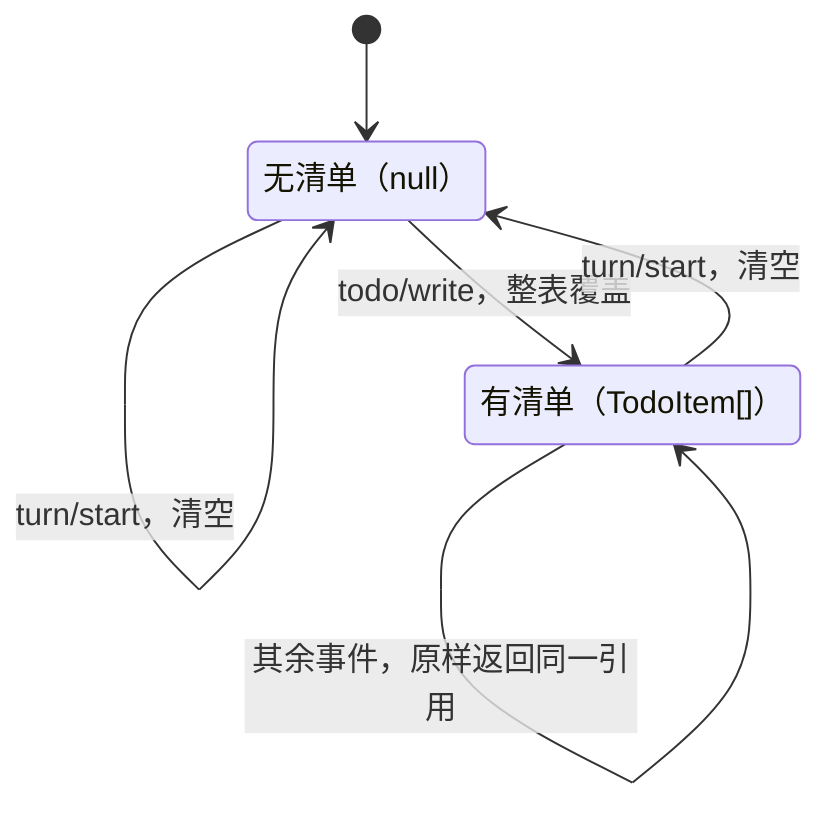

# tool-todo

> `@deepseek-ai/dsh-tool-todo` · bundle：`base` · 配置树 id：`tool-todo` · v0.1.0-rc.5（commit `47f9438`）2026-08-14 核对

> ⚠️ **本篇未通过对抗式引用核验**：起草已完成，但逐条打开源码比对行号/字段名/英文引文的那一遍因会话额度耗尽未执行。文中 `path:line` 与配置字段请以源码为准，核验后本行会被移除。

**一句话**：一个只有 `todo_write` 一件事的插件——模型每次把**整张任务清单**重发一遍，插件把快照原样 append 成一条 `todo/write` 会话事件，UI 从事件流里自己渲染。

README:5 的原话是：`The model-facing todo_write tool: the agent's whole task list, replaced wholesale on each call.`

## 它在树上长什么样

```yaml
    - id: tool-todo
      name: '@deepseek-ai/dsh-tool-todo'
      config:
        allowParallelInProgress: true
```

`packages/bundle/base/cordis.patch.yml:367-370`。这一行同样没写 `inject`，依赖声明在源码里：`export const inject = ['tools']`（`packages/todo/tool-todo/src/index.ts:23`）。

`web-app` bundle 在宿主平面关掉它，再由 preset 挂回来，配置一模一样。对应 `packages/bundle/web-app/cordis.patch.yml:404-405` 和 `apps/cli/config/agent-presets/code/agent.cordis.yml:241-244`。

**导出形态是个坑点，README 专门为它开了一节**（README:37）：`A function/namespace plugin: it exports name / inject / apply and NO default. A stray export default would collapse the module via the Loader's unwrapExports and drop inject`。

也就是说，只要有人手滑补一个 `export default`，Loader 的 `unwrapExports` 会把整个模块压扁，`inject` 跟着丢掉——事故复盘见 `docs/postmortem/0001-acp-default-export-drops-inject.md`。

这跟同组的 [plan-mode](./dsh-plan-mode.md) 正好相反，后者是 Service 类 + `export default`。

## 它注册了什么

| 类型 | 名字 | 说明 |
|---|---|---|
| 工具 | `todo_write` | `src/index.ts:149`；一个必填参数 `todos: array`，item 是 `{ content, status }` 且 `additionalProperties: false` |
| 会话事件 | `todo/write`（`{ todos: TodoItem[] }`） | `src/index.ts:213` 追加；类型声明在 `packages/core/session/src/types.ts:299`，注释写着 `Whole-list snapshot; latest write wins on replay. Log-only UI state; never derived history.` |
| projection unit | `todos` → `TodoItem[] \| null`，`stateVersion: 2` | `src/index.ts:135-148`，仅当 `ctx.sessionProjections` 已挂载 |
| 伴生插件 | `./invariant`（`tool-todo-invariant`） | `src/invariant.ts:24-39` |

**没有事件监听**——它不参与任何 waterfall，纯粹是个工具注册者。

`docs/event-producer-consumer.md:71` 确实把它列为 `internal/dispatch` 的消费方，但那条来自伴生插件（`src/invariant.ts:52`），不是主插件。第一遍读容易记成主插件在听事件，其实不是。

`todos` unit 的 fold 是「standing plan」语义，四种事件的处理写成伪代码就是：

```
fold(state, e):
    if e is todo/write:   return e.todos    // 整表覆盖，不合并
    if e is turn/start:   return null       // 新一轮开始，清空
    if e is turn/end:     return state      // 跑完的清单要留在屏幕上，不清
    otherwise:            return state      // 原样返回同一个引用，不产生新对象
```

一句话：只有开新一轮才清空，结束不清。实现在 `src/index.ts:140-144`。

同样四种事件画成状态机：



## 配置项

| 字段 | 类型 | 默认值 | 作用 |
|---|---|---|---|
| `allowParallelInProgress` | `boolean` | **无默认，必填**（`z.boolean().required()`，`src/index.ts:42`） | 允不允许同时有多条 `in_progress` |

README:19 讲清了为什么不给默认值：`It is a deployment choice, not a fixed rule: whether concurrent active tasks are legitimate depends on runtime concurrency the tool cannot observe.`

这个 flag **同时**改两样东西（README:21）——一样是模型看到的描述文案，一样是输入校验：

| 取值 | 工具描述那一句 | 输入校验 |
|---|---|---|
| `true` | `Mark every todo being actively worked on in_progress — several at once when work genuinely runs in parallel (e.g. concurrent subagents or background commands), one for sequential work; …`（`src/index.ts:51-55`） | 不限个数 |
| `false` | `Keep AT MOST ONE todo in_progress at a time; …`（`src/index.ts:57-59`） | 超过 1 条报 `invalid todos: at most one task may be in_progress (got <n>)` |

base 选 `true`，理由就摆在描述文案里：这棵树上有并发 subagent 和后台命令，还有 [tool-ralph](./dsh-tool-ralph.md) 那种一轮一个 child 的编排。

**但耐久层的 invariant 故意不跟着变**（README:21、`src/invariant.ts:16-23`）：`a log written while parallel work was allowed must still replay after a deployment tightens the policy, so the invariant stays silent on the active count.`

换句话说，收紧策略不能让昨天的日志今天回放不了。invariant 只管四件事：数组形状、`content` 非空且已 trim、不重复、`status` 在三值枚举内——唯独不管有几条在跑。

## 模型看得见什么

先给骨架：模型付的 token 分三笔——常驻的 schema、每次调用留在历史里的整张清单、以及一行结果。其中第二笔才是大头。

- **schema 固定开销**，只要工具可见就每次请求都付（README:49）。
- **每次调用的完整清单留在 assistant 的 arguments 里**，直到 compaction 才消失（README:63）。这是这个工具真正的 token 成本大头，不是那条结果。
- **成功结果只有一行**：`Updated todo list: <pending> pending, <inProgress> in progress, <completed> completed.`（`src/index.ts:201-204`）。

失败文案是稳定的四条（README:59）：

| 文案 | 出处 |
|---|---|
| ``Error: invalid todo: `content` must be a non-empty string`` | `src/index.ts:98` |
| `Error: invalid todos: duplicate content "<content>"` | `src/index.ts:101` |
| `Error: todo_write requires an owning agent session` | `src/index.ts:211` |
| `Error: invalid todos: at most one task may be in_progress (got <n>)`（仅 `false` 时） | `src/index.ts:108` |

还有一条容易想错：**`todo/write` 事件本身不是第二条模型消息**（README:59 结尾），它只是 UI 和 replay 的状态，模型看不到。

另外注意，[plan-mode](./dsh-plan-mode.md) 的默认 `section` 里有一句直接压制它（`packages/bundle/base/cordis.patch.yml:273`）：`Do not use todo_write to track this planning phase: it tracks implementation after an approved plan, while the plan itself belongs in exit_plan_mode.`

计划模式下这个工具虽然还在目录里，但提示层禁止用。

## 什么时候你会想换掉它 / 怎么换

- **收紧成单任务纪律**：把 `allowParallelInProgress` 改成 `false`。历史日志不受影响，原因见上面 invariant 那段。
- **换渲染**：换不了，也不需要——渲染根本不在这个包里。它只写 `todo/write`，Web 端从事件流自己画 plan strip（README:29），换 UI 就是换 client 包。
- **想要局部更新 / 读回工具 / 带 id 的 item**：没有，而且是明确切掉的（README:72-73）。要这些就得自己写一个新工具包，别改这个。
- **整个关掉**：`- id: tool-todo` + `disabled: true`。之后 `todos` 这个 projection key 会直接缺席，而不是给你一个空值——key 声明在 `src/types.ts:15-23`。

## 坑与边界

README:71-73 给了三条：

- **只有单一 owner**——清单属于调用它的那一个 agent session，没有 subagent / shared / swarm 作用域，非 agent 调用者直接拒绝。README:15 说这是 `a deliberate scope limit`。实践含义：Ralph 的每个 fresh child 都有自己独立的一张表，跨轮不继承。
- **item 形状故意最小**——只有 `content` + 三态 `status`，整表替换不需要稳定 id、优先级、进行时文案。
- **整表替换是唯一操作**——没有增量更新，没有读回工具，模型每次必须重发全表。

读源码还能补上几条。

`additionalProperties: false` 卡在参数 schema 层（`src/index.ts:160`），多一个 key 就在注册表边界失败。动机写在 `src/index.ts:82-89` 的注释里：`the logged snapshot must equal what the model believes it wrote, so a nested/extended item shape fails loud at the schema boundary instead of silently flattening`。

`content` 的校验顺序是先 trim 再判断，所以 `"a"` 和 `" a "` 算重复：

```
toTodoList(todos):
    for t in todos:
        c = trim(t.content)
        if c == "":            报错 content 必须非空
        if c 已经出现过:        报错 duplicate content
        记下 c
```

对应 `src/index.ts:96-103`。

排序、以及「保持清单最新」这件事，完全靠工具描述劝模型（README:25 末句），代码不管。

`execute` 是同步逻辑外面包了个 `Promise.resolve`（`src/index.ts:215`），所以 `session.append` 抛错会直接变成工具失败。
