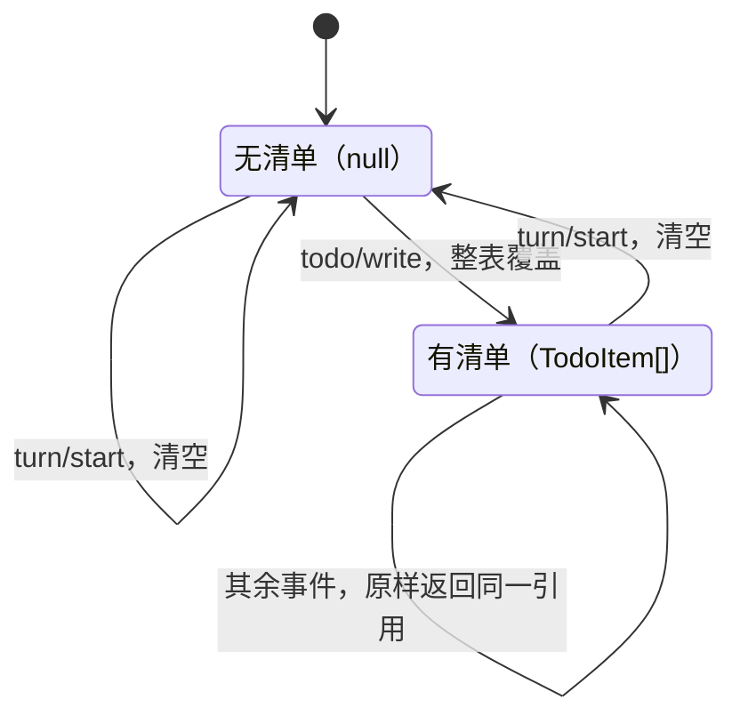

# tool-todo

> `@deepseek-ai/dsh-tool-todo` · bundle：`base` · 配置树 id：`tool-todo` · v0.1.0-rc.5（commit `47f9438`）2026-08-14 核对。出处收在文末[脚注](#出处)，点角标可跳转。

> ⚠️ **本篇未通过对抗式引用核验**：起草已完成，但逐条打开源码比对行号/字段名/英文引文的那一遍因会话额度耗尽未执行。文中脚注坐标与配置字段请以源码为准，核验后本行会被移除。

看到 `todo_write` 这个名字，很容易先猜一个方向：应该支持增量操作吧——加一条、勾掉一条、查一下现在都有啥。

不是的。**一句话**：这个插件只有 `todo_write` 一件事——模型每次要把整张任务清单重发一遍，插件把这份快照原样追加成一条 `todo/write` 会话事件，UI 自己从事件流里把它画出来。README 定义原话是[^1]：

> `The model-facing todo_write tool: the agent's whole task list, replaced wholesale on each call.`

## 它在树上长什么样

```yaml
    - id: tool-todo
      name: '@deepseek-ai/dsh-tool-todo'
      config:
        allowParallelInProgress: true
```

这一行没写 `inject`，容易让人以为它什么都不依赖；依赖声明其实躲在源码里，只依赖 `tools` 这一项能力[^2]。

`web-app` bundle 在宿主平面把它关掉，再由各 agent preset 挂回来，配置内容一模一样[^3]。

**导出形态是个坑点，README 专门为它开了一节**[^4]：这是一个函数/命名空间插件，导出 `name`、`inject`、`apply`，**不**导出默认值。一旦有人手滑补一个 `export default`，加载器会把整个模块压扁，`inject` 跟着一起丢掉——事故复盘留了档[^5]。

这跟同组的 [plan-mode](./dsh-plan-mode.md) 正好相反，后者是 Service 类，真的需要 `export default`。

## 它注册了什么

| 类型 | 名字 | 说明 |
|---|---|---|
| 工具 | `todo_write` | 一个必填参数 `todos: array`，item 是 `{ content, status }`，`additionalProperties: false`[^6] |
| 会话事件 | `todo/write`（`{ todos: TodoItem[] }`） | 追加时整表覆盖；类型声明的注释写着：整表快照，回放时以最后一次写入为准，只是给 UI 用的日志态，从来不是派生出来的历史记录[^7] |
| projection unit | `todos` → `TodoItem[] \| null`，`stateVersion: 2` | 仅当 `ctx.sessionProjections` 已挂载才生效[^8] |
| 伴生插件 | `./invariant`（`tool-todo-invariant`） | 校验内容见下面「坑与边界」一节[^9] |

**没有事件监听**——它不参与任何 waterfall，纯粹是个工具注册者。

全仓事件总表里[^10]，它确实被列成 `internal/dispatch` 的消费方——但那条监听来自伴生插件，不是主插件[^11]。第一遍读容易记成主插件在听事件，其实不是。

`todos` unit 的 fold 遵循「standing plan」语义：只有开新一轮才清空，跑完一轮不清；`todo/write` 到来时整表覆盖、不合并；其余事件原样返回同一个引用，不产生新对象[^12]。画成状态机：



一句话：只有开新一轮才清空，结束不清。

## 配置项

| 字段 | 类型 | 默认值 | 作用 |
|---|---|---|---|
| `allowParallelInProgress` | `boolean` | **无默认，必填**[^13] | 允不允许同时有多条 `in_progress` |

README 讲清了为什么不给默认值[^14]：

> `It is a deployment choice, not a fixed rule: whether concurrent active tasks are legitimate depends on runtime concurrency the tool cannot observe.`

这个 flag 同时改两样东西[^15]：模型看到的描述文案，和输入校验。

| 取值 | 工具描述那一句 | 输入校验 |
|---|---|---|
| `true` | `Mark every todo being actively worked on in_progress — several at once when work genuinely runs in parallel (e.g. concurrent subagents or background commands), one for sequential work; …`[^16] | 不限个数 |
| `false` | `Keep AT MOST ONE todo in_progress at a time; …`[^16] | 超过 1 条报 `invalid todos: at most one task may be in_progress (got <n>)` |

base 选 `true`，理由就摆在描述文案里：这棵树上有并发 subagent 和后台命令，还有 [tool-ralph](./dsh-tool-ralph.md) 那种一轮一个 child 的编排。

**但耐久层的 invariant 故意不跟着变**[^17]：

> `a log written while parallel work was allowed must still replay after a deployment tightens the policy, so the invariant stays silent on the active count.`

换句话说，收紧策略不能让昨天的日志今天回放不了。invariant 只管四件事：数组形状、`content` 非空且已 trim、不重复、`status` 在三值枚举内——唯独不管有几条在跑。

## 模型看得见什么

先给骨架：模型付的 token 分三笔——常驻的 schema、每次调用留在历史里的整张清单、以及一行结果。其中第二笔才是大头。

- **schema 固定开销**，只要工具可见就每次请求都付[^18]。
- **每次调用的完整清单留在 assistant 的 arguments 里**，直到 compaction 才消失[^19]。这是这个工具真正的 token 成本大头，不是那条结果。
- **成功结果只有一行**：`Updated todo list: <pending> pending, <inProgress> in progress, <completed> completed.`[^20]。

失败文案是稳定的四条[^21]：

| 文案 | 触发条件 |
|---|---|
| ``Error: invalid todo: `content` must be a non-empty string`` | `content` 为空 |
| `Error: invalid todos: duplicate content "<content>"` | trim 后内容重复 |
| `Error: todo_write requires an owning agent session` | 非 agent 调用者调用 |
| `Error: invalid todos: at most one task may be in_progress (got <n>)` | 仅 `allowParallelInProgress: false` 时，超过 1 条 `in_progress` |

四条文案的坐标一并见脚注[^22]。

还有一条容易想错：**`todo/write` 事件本身不是第二条模型消息**[^23]，它只是 UI 和 replay 的状态，模型看不到。

另外注意，[plan-mode](./dsh-plan-mode.md) 的默认 `section` 里有一句直接压制它[^24]：

> `Do not use todo_write to track this planning phase: it tracks implementation after an approved plan, while the plan itself belongs in exit_plan_mode.`

计划模式下这个工具虽然还在目录里，但提示层禁止用。

## 什么时候你会想换掉它 / 怎么换

- **收紧成单任务纪律**：把 `allowParallelInProgress` 改成 `false`。历史日志不受影响，原因见上面 invariant 那段。
- **换渲染**：换不了，也不需要——渲染根本不在这个包里。它只写 `todo/write`，Web 端从事件流自己画 plan strip[^25]，换 UI 就是换 client 包。
- **想要局部更新 / 读回工具 / 带 id 的 item**：没有，而且是明确切掉的[^26]。要这些就得自己写一个新工具包，别改这个。
- **整个关掉**：patch 里 `- id: tool-todo` 那一条加一行 `disabled: true`。之后 `todos` 这个 projection key 会直接缺席，而不是给你一个空值——key 声明在类型文件里写死了[^27]。

## 坑与边界

README 给了三条已知边界[^28]：

- **只有单一 owner**——清单属于调用它的那一个 agent session，没有 subagent / shared / swarm 作用域，非 agent 调用者直接拒绝，README 把这称为「一个刻意的作用域限制」[^29]。实践含义：Ralph 的每个 fresh child 都有自己独立的一张表，跨轮不继承。
- **item 形状故意最小**——只有 `content` 和三态 `status`，整表替换不需要稳定 id、优先级、进行时文案。
- **整表替换是唯一操作**——没有增量更新，没有读回工具，模型每次必须重发全表。

读源码还能补上几条。

`additionalProperties: false` 卡在参数 schema 层，多一个 key 就在注册表边界失败。动机是让日志快照和模型自认为写下的内容严格相等：一个嵌套/扩展过的 item 形状要在 schema 边界大声报错，而不是被悄悄拍平[^30]。

`content` 的校验顺序是先 trim 再判断，所以 `"a"` 和 `" a "` 算重复：trim 得到的字符串一旦为空就报错要求非空，一旦跟已出现过的重复就报重复内容，两条都不命中才记下这个值[^31]。

排序、以及「保持清单最新」这件事，完全靠工具描述劝模型，代码不管[^32]。

`execute` 是同步逻辑外面包了个 `Promise.resolve`[^33]，所以 `session.append` 抛错会直接变成工具失败。

## 把这一章串起来

- **它只有一件事，而且是全量的**——`todo_write` 每次都要求模型重发整张清单，没有增量更新，也没有读回工具；
- **导出形态是唯一的坑**——函数插件不许带 `export default`，补一个就会连累 `inject` 一起被压扁；
- **fold 只认「开新一轮」这一件事**——`todo/write` 整表覆盖，`turn/end` 和其余事件原样透传，只有 `turn/start` 清空；
- **并发开关同时改文案和校验，但耐久层故意不跟着变**——收紧策略之后，昨天在宽松策略下写下的日志今天仍要能回放；
- **真正的 token 成本在 arguments 里，不在结果里**——每次调用都要把整张清单重新背一遍，直到 compaction 才卸下来；
- **它没有事件监听，四种事件的处理走的是 projection 的 fold，不是订阅**——事件总表里那条 `internal/dispatch` 消费方来自伴生插件，读错了容易记成主插件在听事件；
- **计划模式下它被明文禁用**——`plan-mode` 的默认提示词直接告诉模型别在这个阶段用它；
- **单一 owner 是刻意的作用域限制**——没有 subagent / shared / swarm 共享，关掉插件后 `todos` 这个 key 直接消失，不是变成空值。

配置面只有一个开关；整表替换、单一 owner、无 `export default`，是这个插件不打算改变的三条边界。

---

## 出处

[^1]: 引文出自 `packages/todo/tool-todo/README.md:5`。
[^2]: 树上配置：`packages/bundle/base/cordis.patch.yml:367-370`；未写 `inject` 但依赖声明藏在源码里，`export const inject = ['tools']`：`packages/todo/tool-todo/src/index.ts:23`。
[^3]: web-app bundle 在宿主平面关闭该插件：`packages/bundle/web-app/cordis.patch.yml:404-405`；由各 agent preset 自行挂载一份，配置一致：`apps/cli/config/agent-presets/code/agent.cordis.yml:241-244`。
[^4]: 引文出自 `packages/todo/tool-todo/README.md:37`：`A function/namespace plugin: it exports name / inject / apply and NO default. A stray export default would collapse the module via the Loader's unwrapExports and drop inject`。
[^5]: 事故复盘：`docs/postmortem/0001-acp-default-export-drops-inject.md`。
[^6]: 工具 `todo_write` 的注册与 schema：`packages/todo/tool-todo/src/index.ts:149`。
[^7]: 会话事件 `todo/write` 的追加点：`packages/todo/tool-todo/src/index.ts:213`；类型声明与注释：`packages/core/session/src/types.ts:299`（原文 "Whole-list snapshot; latest write wins on replay. Log-only UI state; never derived history."）。
[^8]: projection unit `todos`：`packages/todo/tool-todo/src/index.ts:135-148`。
[^9]: 伴生插件 `tool-todo-invariant`：`packages/todo/tool-todo/src/invariant.ts:24-39`。
[^10]: 全仓事件总表：`docs/event-producer-consumer.md:71`。
[^11]: 该消费方来自伴生插件而非主插件：`packages/todo/tool-todo/src/invariant.ts:52`。
[^12]: fold 实现：`packages/todo/tool-todo/src/index.ts:140-144`。
[^13]: `allowParallelInProgress` 无默认、必填，`z.boolean().required()`：`packages/todo/tool-todo/src/index.ts:42`。
[^14]: 引文出自 `packages/todo/tool-todo/README.md:19`。
[^15]: 引文出自 `packages/todo/tool-todo/README.md:21`。
[^16]: 描述文案：`packages/todo/tool-todo/src/index.ts:51-55`（`true`）、`:57-59`（`false`）。
[^17]: 引文出自 `packages/todo/tool-todo/README.md:21`，实现见 `packages/todo/tool-todo/src/invariant.ts:16-23`。
[^18]: 引文出自 `packages/todo/tool-todo/README.md:49`。
[^19]: 引文出自 `packages/todo/tool-todo/README.md:63`。
[^20]: 成功结果文案：`packages/todo/tool-todo/src/index.ts:201-204`。
[^21]: 引文出自 `packages/todo/tool-todo/README.md:59`。
[^22]: 四条失败文案坐标：``Error: invalid todo: `content` must be a non-empty string``（`packages/todo/tool-todo/src/index.ts:98`）、`Error: invalid todos: duplicate content "<content>"`（`:101`）、`Error: todo_write requires an owning agent session`（`:211`）、`Error: invalid todos: at most one task may be in_progress (got <n>)`（`:108`）。
[^23]: 引文出自 `packages/todo/tool-todo/README.md:59` 段落末尾。
[^24]: `packages/bundle/base/cordis.patch.yml:273`。
[^25]: 引文出自 `packages/todo/tool-todo/README.md:29`。
[^26]: 引文出自 `packages/todo/tool-todo/README.md:72-73`。
[^27]: `todos` projection key 的类型声明：`packages/todo/tool-todo/src/types.ts:15-23`。
[^28]: 引文出自 `packages/todo/tool-todo/README.md:71-73`。
[^29]: 引文出自 `packages/todo/tool-todo/README.md:15`（原文 "a deliberate scope limit"）。
[^30]: `additionalProperties: false` 位置：`packages/todo/tool-todo/src/index.ts:160`；动机注释：`:82-89`（原文 "the logged snapshot must equal what the model believes it wrote, so a nested/extended item shape fails loud at the schema boundary instead of silently flattening"）。
[^31]: 校验顺序实现：`packages/todo/tool-todo/src/index.ts:96-103`。
[^32]: 引文出自 `packages/todo/tool-todo/README.md:25` 末句。
[^33]: `execute` 的 `Promise.resolve` 包裹：`packages/todo/tool-todo/src/index.ts:215`。
