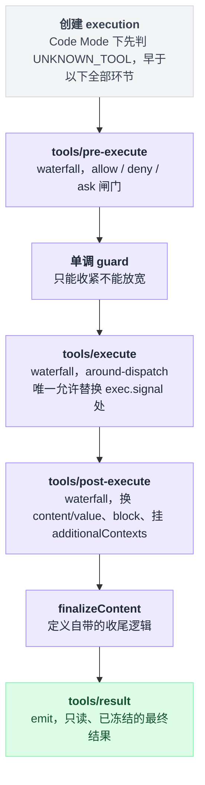

# tools

> `@deepseek-ai/dsh-tools` · bundle：`base` · 配置树 id：`tools` · v0.1.0-rc.5（commit `47f9438`）2026-08-14 核对。出处收在文末脚注，可照抄代码收在文末附录。

**一句话**：工具注册表兼执行管线本体——每个 `tool-*` 插件把 schema 和 executor 注册进它，每个拦截型插件挂在它开出的 waterfall 上，本组另外两篇都是它的下游。

## 它在树上长什么样

base bundle 里它只占两行[^1]：

```yaml
    # The tool registry. Presentation mode is a deployment choice; omitting it here
    # keeps the schema default (native).
    - id: tools
      name: '@deepseek-ai/dsh-tools'
```

YAML 里既没有 `inject` 也没有 `config`。依赖不是写在这儿的，而是写在类上——`static inject = ['systemPrompt']`[^2]；配置则全取 schema 默认值。

另外两个 bundle 都按 id 覆写了这一行的 config，`web-app` 和 `headless` 都写成 `mode: !!js process.env.DSH_TOOLS_MODE`。web-app 的注释原文是：

> `TEMPORARY workaround: DSH_TOOLS_MODE (native|code|both) opts a whole dsh process into Code Mode while per-session tool-presentation selection is being designed; unset keeps the schema default (native). Remove the env seam once the web UI owns the choice per session.`[^3]

有个地方容易读岔：`tools` 排在依赖它的 `timeout-policy`**之后**才登场。这不代表加载顺序倒置——base 文件头自己声明了 `Row order carries no load semantics (activation is service-availability driven); the grouping is for readers.`[^4]

## 它注册了什么

| 类型 | 名字 | 说明 |
|---|---|---|
| service | `ctx.tools`（`ToolRuntime`） | 服务声明与类定义[^5] |
| 静态注入 | `systemPrompt` | 构造时 `ctx.systemPrompt.tools(...)` 自动把 schema 灌进 prompt 组装[^6] |
| 机会性依赖 | `ctx.get('approval')` | 无静态 inject；未挂 approval 时 `ask` 退化为 deny[^7] |
| 事件 producer | `tools/pre-execute`（**waterfall**） | allow/deny/ask 闸门[^8] |
| 事件 producer | `tools/execute`（**waterfall**） | around-dispatch，**唯一允许替换 `exec.signal` 的位置**[^9] |
| 事件 producer | `tools/post-execute`（**waterfall**） | 换 content/value、block、挂 `additionalContexts`[^10] |
| 事件 producer | `tools/code-dispatch-log`（**waterfall**） | 只改 `run_code` 子调用的落库副本，模型看不到[^11] |
| 事件 producer | `tools/result`（emit） | 只读、已冻结的最终结果[^12] |
| 事件 producer | `tools/change`（emit） | 注册表变动，**故意不做 scope 过滤**[^13] |
| prompt 段 | `tools:code-only`（order 99） | 进程默认 `mode ≠ native` 时全局注册，`presentAs` 另按 agent 注册；`code` 下渲染禁令、`both` 下渲染空串[^14] |
| prompt 段 | `tools:sdk`（order 150） | 按运行时语言生成的 SDK 文本[^15] |
| 工具 | `run_code` | 保留传输，位于可过滤的注册层之外[^16] |

它自己**不监听任何事件**——`src/index.ts` 内一个 `ctx.on` 都没有。同包的 `invariant.ts` 才是监听方，听的是 `session/created` / `session/event` / `internal/dispatch`[^17]。

公开方法一共八个：`register`、`presentAs`、`restrict`、`guard`、`get`、`schemas`、`executionMode`、`execute`[^18]。

管线顺序（README 原文）：`tools/pre-execute` → 单调 guard → `tools/execute` → `tools/post-execute` → 定义自带的 `finalizeContent` → `tools/result`[^19]。

写成伪代码，注意 Code Mode 的那道判断在整条管线**之前**：

```
execute(call):
    exec = 创建 execution(call)
    if mode 是 code 且 call.tool 不是 run_code:
        return UNKNOWN_TOOL          // 这里就返回了，下面一行都跑不到

    决定 = waterfall(tools/pre-execute, exec)   // allow / deny / ask
    决定 = guard(决定)                          // 只能收紧，不能放宽
    结果 = waterfall(tools/execute, exec)       // around-dispatch，可换 exec.signal
    结果 = waterfall(tools/post-execute, 结果)  // 可换 content/value、block、挂 additionalContexts
    结果 = 定义自带的 finalizeContent(结果)
    emit(tools/result, freeze(结果))            // 只读，改不动
```

同样一条路径的流程图：



## 配置项

| 字段 | 类型 | 默认值 | 作用 |
|---|---|---|---|
| `mode` | `'native' \| 'code' \| 'both'` | `native` | 工具怎么呈现给模型：函数调用 / Code Mode / 两者 |
| `maxParallelSubCalls` | 正整数 | `10` | 一个 `run_code` 程序内并发子调用上限；`1` 退化为严格串行 |

schema 与 `Config` 接口定义处见脚注[^20]。

`code` / `both` 有个前置条件：需要一个 `ctx.codeRuntime`，且其 `language` 有已注册的 SDK renderer（TypeScript / Python）。否则不是运行时才报错，是 prompt 组装直接失败。

## 模型看得见什么

| mode | 模型看到的 |
|---|---|
| `native` | 每个可见定义的 name / description / JSON schema |
| `code` | `run_code` 的 schema、SDK 指令、生成的 SDK 块，外加 `tools:code-only` 规则 |
| `both` | 两者都发 |

`timeoutMs`、`isConcurrencySafe` 这类策略元数据**永不进模型**[^21]。

README 对 KV cache 的原话是 `Prefix-stable while visible definitions and their order are unchanged. Registration, disposal, or scoped restriction may invalidate reuse from the first changed schema token.`

`code` 模式下模型如果直呼其它工具，会在创建 execution 时就被判成 `UNKNOWN_TOOL`。这个判定早于 `tools/pre-execute`、approval 与 guard——**所以没有任何拦截器会看到这次调用**，你想在 `pre-execute` 里记一笔都记不到[^22]。

## 什么时候你会想换掉它 / 怎么换

**换不掉**。全仓库三十来个插件 `inject: ['tools']`，卸掉它整棵树起不来。

实际要动的是 `mode` 和 agent 级的可见性，照抄[附录 A](#a-换个呈现模式和并发上限)。

进程级的呈现开关只有 `mode` 一个，`maxParallelSubCalls` 只管 `run_code` 内的并发，别指望它影响呈现。

要按 agent 调整，走这两个方法：

| 想做的事 | 方法 |
|---|---|
| 单个 agent 换呈现模式（影子覆盖） | `ctx.tools.presentAs(mode)`[^18] |
| 单个 agent 收窄可见工具集 | `ctx.tools.restrict({allow\|deny})`[^18]，字段定义见脚注[^23] |

想加自己的拦截逻辑，不要改这个包：

- 可拒可问 → 挂 `tools/pre-execute`；可改可 block → 挂 `tools/post-execute`。模板拿 [dsh-repeat-tool-reminder](./dsh-repeat-tool-reminder.md)。
- 超时 / 重试 / 度量 → 挂 `tools/execute`。模板拿 [dsh-tool-call-timeout-policy](./dsh-tool-call-timeout-policy.md)。

## 坑与边界

README 的 Known Limitations 逐条：

- **`timeoutMs` 只是声明**。原文 `the registry never enforces deadlines; enforcement requires the @deepseek-ai/dsh-tool-call-timeout-policy wrapper`。注册表只校验它是正有限数，然后就不管了[^24]。
- **`tools/pre-execute` 故意不能改写 `exec.arguments`**。否则日志和渲染出的参数会和真正执行的脱节。
- **并发分类不是事件闸门**。`executionMode()` 直读定义，插件只能给自己拥有的定义声明 classifier。
- **subagent / workflow 的调用方自定义结构化输出仍必须是 object 根**。这是消费侧的限制，共享 schema 词汇表本身支持任意 JSON 根。
- **Code Mode 的中间值是 execution-local 且不限字节**。只有最外层 `run_code` 输出受 worker 的 `maxOutputBytes`（默认 64 MiB）约束，会话回放重建不出中间值。
- **SDK 语言跟着唯一那个 runtime 走，呈现方式按 agent 而非按工具**；`run_code` 每次运行状态全新，没有 REPL 式内核。

README 正文另外两条同样是边界：

- `restrict()` 不是权限边界。Public API 一节原文 `This is live visibility composition, not an authority boundary`[^25]。
- 取消是协作式的。`ABORTED_BEFORE_DISPATCH` / `ABORTED` 会被更具体的 deny、wrapper 失败、工具失败、post 策略失败或 `TOOL_TIMEOUT` 盖掉[^26]。

## 附录：可以照抄的模板

### A. 换个呈现模式和并发上限

```yaml
- id: tools
  config:
    mode: both
    maxParallelSubCalls: 4
```

## 出处

[^1]: base bundle 里 `tools` 条目（含注释与 `id`/`name` 两行）：`packages/bundle/base/cordis.patch.yml:422-425`（`id: tools` 本行在 `:424`）。
[^2]: `static inject = ['systemPrompt']`：`packages/core/tools/src/index.ts:788`。
[^3]: 两处覆写：`packages/bundle/web-app/cordis.patch.yml:35-41` 与 `packages/bundle/headless/cordis.patch.yml:17-20`；引用的注释原文出自前者。
[^4]: `timeout-policy` 条目在同文件 `packages/bundle/base/cordis.patch.yml:343`；文件头 "Row order carries no load semantics..." 声明在同文件 `:12-13`。
[^5]: `ToolRuntime` 声明：`packages/core/tools/src/index.ts:137-140`；类定义：`:787`。
[^6]: `packages/core/tools/src/index.ts:832`。
[^7]: `packages/core/tools/src/index.ts:1693-1706`。
[^8]: 声明：`packages/core/tools/src/index.ts:152`；派发：`:1475`。
[^9]: 声明：`packages/core/tools/src/index.ts:163`；派发：`:1573`。
[^10]: 声明：`packages/core/tools/src/index.ts:175`；派发：`:1743`。
[^11]: `packages/core/tools/src/index.ts:189`。
[^12]: 声明：`packages/core/tools/src/index.ts:197`；派发：`:1665-1666`。
[^13]: 声明：`packages/core/tools/src/index.ts:198-207`；派发：`:813`。
[^14]: 全局注册：`packages/core/tools/src/index.ts:833-836`；按 agent 注册的 `presentAs`：`:968-969`；`code`/`both` 两种渲染分支：`:51`、`:855-863`。
[^15]: SDK 文本生成：`packages/core/tools/src/code-mode.ts:23`、`packages/core/tools/src/index.ts:875-879`。
[^16]: `packages/core/tools/src/code-mode.ts:20`。
[^17]: `packages/core/tools/src/invariant.ts:77-84`。
[^18]: `register` `:1037`、`presentAs` `:946`、`restrict` `:1071`、`guard` `:1110`、`get` `:1204`、`schemas` `:1234`、`executionMode` `:1276`、`execute` `:1342`，均在 `packages/core/tools/src/index.ts`。
[^19]: `packages/core/tools/README.md:5`。
[^20]: schema：`packages/core/tools/src/index.ts:790-793`；`Config` 接口：`:654`。
[^21]: `packages/core/tools/src/index.ts:250-252`、`:259`。
[^22]: `packages/core/tools/src/index.ts:1373-1381`、`:1423-1443`。
[^23]: `restrict` 字段定义：`packages/core/tools/src/index.ts:680-685`。
[^24]: `packages/core/tools/src/index.ts:1046-1049`。
[^25]: `packages/core/tools/README.md:22`。
[^26]: `packages/core/tools/README.md:35`。
