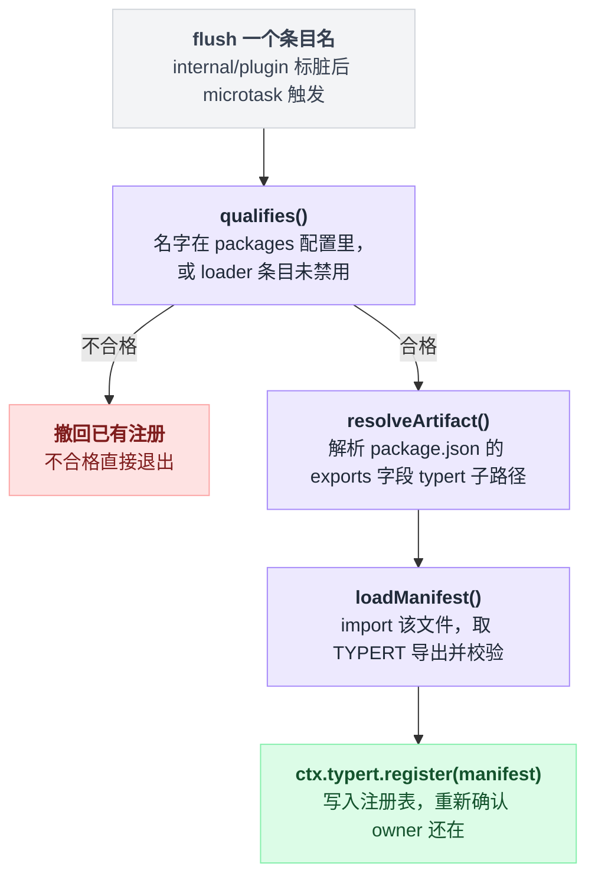

# typert-loader

> `@deepseek-ai/dsh-typert-loader` · bundle：`base` · 配置树 id：`typert-loader` · v0.1.0-rc.5（commit `47f9438`）2026-08-14 核对

**一句话**：扫描 loader 条目，把导出了 `./typert` 的包的生成产物 import 进来、校验完再塞进 [`ctx.typert`](./dsh-typert-registry.md)，条目卸载就撤回。

README 首句把边界说死了：

> Node-only Loader integration for generated Typert artifacts. The plugin requires `ctx.loader` and `ctx.typert`; it does not provide the registry itself.

出处 `packages/typert/loader/README.md:5`。注意末半句——**它自己不提供注册表**，只往别人的注册表里写。

## 它在树上长什么样

`packages/bundle/base/cordis.patch.yml:33`：

```yaml
    - id: typert-loader
      name: '@deepseek-ai/dsh-typert-loader'
```

两行，没写 `inject`、没写 `config`。两者都由包自己声明并取默认值。

`docs/config-catalog.md:2801` 那一节记的 `Requires: typert · loader`，来源就是源码里的 `export const inject = ['typert', 'loader']`（`packages/typert/loader/src/index.ts:44`）。

## 它注册了什么

| 类型 | 名字 | 说明 |
|---|---|---|
| service | 无 | 它是 `apply(ctx, config)` 型函数插件（`packages/typert/loader/src/index.ts:284`），`name = 'typert-loader'`（`:42`），不 provide 任何服务 |
| 事件监听 | `internal/plugin`（**emit**） | 每次 fiber 发布都把 `fiber.entry?.options.name` 标脏，microtask 里 flush（`packages/typert/loader/src/index.ts:411`）。该事件在 cordis 里声明为无 `@mode` 即 emit 模式（`vendor/cordis/src/events.ts:331`），派发点 `vendor/cordis/src/fiber.ts:302`——**不是 waterfall，拦不住也改不了任何东西** |
| 写入 | `ctx.typert.register(manifest)` | 每个合格包一条，disposer 存在 `registered` 表里，条目消失时调用（`packages/typert/loader/src/index.ts:383`、`:373`） |

没有工具、prompt 段、命令。

### 一次 flush 干了什么

先给骨架：**判合格 → 找产物文件 → import 并校验 → 写注册表**。四步里只有第三步的校验规则值得停下来看，前两步是解析路径的模板动作。

```
def flush(条目名):
    if not qualifies(条目名):
        撤回该名字已有的注册            # 之前注册过就在这里回收
        return

    产物路径 = resolveArtifact(条目名)   # createRequire(ctx.baseUrl) 解析 <pkg>/package.json
    manifest = loadManifest(产物路径)    # import() 取 TYPERT 导出，再跑校验
    ctx.typert.register(manifest)
    重新确认 owner 还在                  # import 是异步的，落地时条目可能已经没了
```

`qualifies()` 的判据是二选一：这个名字写在 `packages` 配置里，**或者**对应的 loader 条目满足 `fiber !== undefined && !entry.disabled`。

`resolveArtifact()` 读的是 `package.json` 的 `exports['./typert']`，接受两种写法：一个字符串，或者带 `default` 字符串的一层条件形式。

`loadManifest()` 里的 `validateTypertManifest()` 是真正卡人的地方，四条硬要求：

| 校验项 | 要求 |
|---|---|
| 包名 | 必须自洽 |
| `face` | 必须是 `host` |
| schema | 必须是 zod v4 实例 |
| 每个 invocation 的 codec | 必须是 `strict` |

出处：flush 主体 `packages/typert/loader/src/index.ts:368` 起；`qualifies()` 见 `:359`；`resolveArtifact()` 见 `:292`、`:320`，exports 形式见 `:62`；`loadManifest()` 见 `:343`、`:83`，四条校验分别在 `:88`、`:93`、`:105`、`:266`；register 后重新确认 owner 见 `:382`。

四步连起来是这样：



## 配置项

| 字段 | 类型 | 默认值 | 作用 |
|---|---|---|---|
| `packages` | `string[]` | `[]`（`packages/typert/loader/src/index.ts:54`） | 额外登记那些**藏在别的 loader 条目背后**的嵌套插件所属的包 |

为什么这个字段必须手写、不能自动推断？README 给了理由：

> Cordis fibers do not retain those nested plugins' npm specifiers, so this boundary is explicit; every configured package must resolve from the config tree and export `./typert`.

出处 `packages/typert/loader/README.md:9`。fiber 根本不记得嵌套插件的 npm specifier，所以这条边界只能人来划。

写进配置却解析不到、或者包里没有 `./typert` 导出，都会抛出指名道姓的错（`packages/typert/loader/src/index.ts:323`、`:336`）。

默认树上这个字段是空的，所以能被发现的只有 bundle 里那些直接写成 `name:` 的包。核对当天，仓库里真正导出 `./typert` 的业务包共 5 个：

`goal`、`commands`、`message-feedback`、`plugin-inventory`、`cordis-host-runner`。

导出目标形如 `./lib/typert.host.js`，见 `packages/goal/goal/package.json:33`。另有两个是 generator 的测试 fixture，不在树上。

## 模型看得见什么

README 的 Model Experience（`packages/typert/loader/README.md:15`）：

> None, as the loader only feeds [`ctx.typert`](./dsh-typert-registry.md); consumers own any model-visible projection.

KV Cache effect：“No direct effect.”（`packages/typert/loader/README.md:19`）源码核对一致：它只写注册表和日志。

## 什么时候你会想换掉它 / 怎么换

三种情况：

**一、有嵌套插件的包没被发现。** 别换插件，往这一行加 `config.packages`：

```yaml
- id: typert-loader
  config:
    packages:
      - '@your-scope/your-remote-package'
```

**二、不用 loader 组装**（测试、SDK 内嵌、手写 wire schema）。直接调 `ctx.typert.register()` 就行，README 的 Known Limitations 明说这条路一直留着（`packages/typert/loader/README.md:24`、源码模块注释 `packages/typert/loader/src/index.ts:21`）。

**三、想要 client face 的自动发现。** 现在没有，见下面「坑与边界」第一条。

关掉这一行本身不会让树崩：[typert-gateway](./dsh-api-gateway.md) 仍会用 SRC 兜底派发，只是所有严格校验（Zod codec、精确参数集）都退化了。

## 坑与边界

README 的 Known Limitations 两条（`packages/typert/loader/README.md:23`、`:24`）：只 import host face，client 运行时需要另一个组装 owner；loader 条目自动发现，嵌套或非 loader 插件必须显式 `packages` 或自己 `register()`。

以下是读源码补充的。

**缓存永不过期。** 包裁决存在 `artifactPath`（`packages/typert/loader/src/index.ts:302`），manifest 存在 `manifests`（`:304`）。注意裁决包括负面的那种——“这个包没有 typert 导出”也会被记住。README 的原话是 “adding an export requires a restart”（`packages/typert/loader/README.md:11`）。热加一个导出没用，得重启。

**失败的严重程度分两段。** 同一个错误在不同时机后果差很多：

| 时机 | 失败后果 |
|---|---|
| 激活期（已有条目那一轮） | 所有失败聚合成 `AggregateError` 抛出，整个 fiber 变 FAILED |
| 稳态期 | 一个包炸只写 `ctx.logger.error`，不牵连别人 |

出处：激活期 `packages/typert/loader/src/index.ts:432`；稳态期 `:420`、`:399`。

**子路径条目天然被跳过。** 像 base 里 `name: '@deepseek-ai/dsh-tool-subagent-control/list-agents'` 这种行（`packages/bundle/base/cordis.patch.yml:311`），`require.resolve('<name>/package.json')` 解析不到，于是缓存成 `null` 永久排除（`packages/typert/loader/src/index.ts:330`）。源码注释把 loader builtins 和 subpath rows 都归到这里。

**锚点是配置树的 `ctx.baseUrl`，不是本包 URL**（`packages/typert/loader/src/index.ts:289`、模块注释 `:285`），未设置直接抛错。这不是洁癖：pnpm 隔离式 node_modules 下用本包 URL 会看不见兄弟包。

**从源码跑（`tsx`）时基本什么也扫不到。** `./typert` 指向 `lib/typert.host.js`，那是构建产物；没跑过 `pnpm run build:lib:host`（`package.json:22`）就没有这个文件。结果是 Gateway 全程走 SRC 兜底（`docs/api-gateway.md:133`）。
