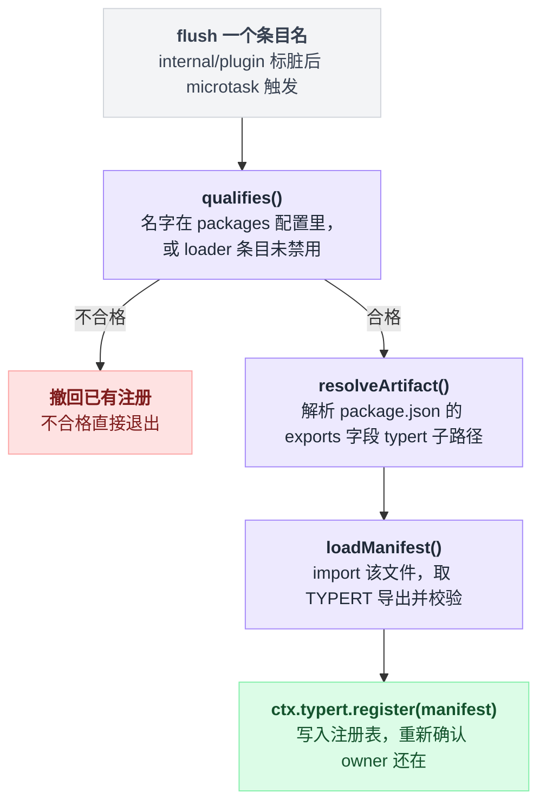

# typert-loader

> `@deepseek-ai/dsh-typert-loader` · bundle：`base` · 配置树 id：`typert-loader` · v0.1.0-rc.5（commit `47f9438`），2026-08-14 核对。正文只讲机制；可照抄的配置收在文末[附录](#附录可以照抄的配置)，出处收在[脚注](#出处)，点角标可跳转。

**一句话**：扫描 loader 条目，把导出了 `./typert` 的包的生成产物 import 进来、校验完再塞进 [`ctx.typert`](./dsh-typert-registry.md)，条目卸载就撤回。

名字里带着 typert，很容易先入为主，以为装上这一个插件类型系统就算接好了。不是的。README 第一句就把话说死：

> Node-only Loader integration for generated Typert artifacts. The plugin requires `ctx.loader` and `ctx.typert`; it does not provide the registry itself.

注意末半句——它自己不提供注册表，只往别人的注册表里写[^1]。它是个纯粹的搬运工：发现、导入、校验、登记，没有一步是"定义类型"。

## 它在树上长什么样

树上只有两行[^2]：

```yaml
    - id: typert-loader
      name: '@deepseek-ai/dsh-typert-loader'
```

没写 `inject`，没写 `config`——两者都由包自己声明并取默认值。文档目录里记的 `Requires: typert · loader`，来源就是源码里那句 inject 声明[^3]。

## 它注册了什么

它注册的东西不多，一张表说完[^4]：

| 类型 | 名字 | 说明 |
|---|---|---|
| service | 无 | `apply(ctx, config)` 型函数插件，不 provide 任何服务 |
| 事件监听 | `internal/plugin`（emit） | 每次 fiber 发布就把对应条目标脏，microtask 里统一 flush；这个事件是 emit 模式，不是 waterfall——拦不住也改不了任何东西 |
| 写入 | `ctx.typert.register()` | 每个合格包写一条，条目卸载时用存好的 disposer 撤回 |

没有工具、prompt 段、命令。

### 一次 flush 干了什么

先给骨架：判合格 → 找产物文件 → import 并校验 → 写注册表。四步里只有第三步的校验规则值得停下来看，前两步是解析路径的模板动作。

```
def flush(条目名):
    if not qualifies(条目名):
        撤回该名字已有的注册            # 之前注册过就在这里回收
        return

    产物路径 = resolveArtifact(条目名)   # createRequire(ctx.baseUrl) 解析 <pkg>/package.json
    manifest = loadManifest(产物路径)    # import() 取 TYPERT 导出，再跑校验
    ctx.typert.register(manifest)
    重新确认 owner 还在                  # import 是异步的，落地时条目可能已经没了
```

`qualifies()` 的判据是二选一：这个名字写在 `packages` 配置里，或者对应的 loader 条目满足"存在 fiber 且未被禁用"。

`resolveArtifact()` 读的是 `package.json` 的 `exports` 字段里 `./typert` 这个子路径，接受两种写法：一个字符串，或者带 `default` 字符串的一层条件形式。

`loadManifest()` 里的 `validateTypertManifest()` 是真正卡人的地方，四条硬要求[^5]：

| 校验项 | 要求 |
|---|---|
| 包名 | 必须自洽 |
| `face` | 必须是 `host` |
| schema | 必须是 zod v4 实例 |
| 每个 invocation 的 codec | 必须是 `strict` |

四步连起来是这样：



## 配置项

| 字段 | 类型 | 默认值 | 作用 |
|---|---|---|---|
| `packages` | `string[]` | `[]` | 额外登记那些**藏在别的 loader 条目背后**的嵌套插件所属的包 |

出处见[^6]。为什么这个字段必须手写、不能自动推断？README 给了理由：

> Cordis fibers do not retain those nested plugins' npm specifiers, so this boundary is explicit; every configured package must resolve from the config tree and export `./typert`.

fiber 根本不记得嵌套插件的 npm specifier，所以这条边界只能人来划[^7]。

写进配置却解析不到、或者包里没有 `./typert` 导出，都会抛出指名道姓的错[^8]。

默认树上这个字段是空的，所以能被发现的只有 bundle 里那些直接写成 `name:` 的包。核对当天，仓库里真正导出 `./typert` 的业务包共 5 个：`goal`、`commands`、`message-feedback`、`plugin-inventory`、`cordis-host-runner`；导出目标是各自构建产物里的宿主门面文件。另有两个属于 generator 的测试 fixture，不在树上[^9]。

## 模型看得见什么

README 的 Model Experience：

> None, as the loader only feeds [`ctx.typert`](./dsh-typert-registry.md); consumers own any model-visible projection.

KV Cache effect，原话是"No direct effect"[^10]。源码核对一致：它只写注册表和日志。

## 什么时候你会想换掉它 / 怎么换

三种情况：

**一、有嵌套插件的包没被发现。** 别换插件，往这一行加 `config.packages`，照抄[附录 A](#a-给-configpackages-追加一个隐藏包)。

**二、不用 loader 组装**（测试、SDK 内嵌、手写 wire schema）。直接调 `ctx.typert.register()` 就行，README 的 Known Limitations 明说这条路一直留着[^11]。

**三、想要 client face 的自动发现。** 现在没有，见下面「坑与边界」第一条。

关掉这一行本身不会让树崩：[typert-gateway](./dsh-api-gateway.md) 仍会用 SRC 兜底派发，只是所有严格校验（Zod codec、精确参数集）都退化了。

## 坑与边界

README 的 Known Limitations 两条[^12]：只 import host face，client 运行时需要另一个组装 owner；loader 条目自动发现，嵌套或非 loader 插件必须显式 `packages` 或自己 `register()`。

以下几条 README 没写，是读源码补充的。

**缓存永不过期。** 包裁决存在 `artifactPath`，manifest 存在 `manifests`。注意裁决包括负面的那种——"这个包没有 typert 导出"也会被记住。README 的原话是"adding an export requires a restart"[^13]。热加一个导出没用，得重启。

**失败的严重程度分两段。** 同一个错误在不同时机后果差很多：

| 时机 | 失败后果 |
|---|---|
| 激活期（已有条目那一轮） | 所有失败聚合成 `AggregateError` 抛出，整个 fiber 变 FAILED |
| 稳态期 | 一个包炸只写 `ctx.logger.error`，不牵连别人 |

差异出处见[^14]。

**子路径条目天然被跳过。** 像 base 里 `@deepseek-ai/dsh-tool-subagent-control/list-agents` 这种把嵌套插件也写成一行 `name:` 的条目，`require.resolve()` 解析不到对应的 `package.json`，于是缓存成 `null` 永久排除[^15]。源码注释把 loader builtins 和 subpath rows 都归到这里。

**锚点是配置树的 baseUrl，不是本包 URL**，未设置直接抛错[^16]。这不是洁癖：pnpm 隔离式 node_modules 下用本包 URL 会看不见兄弟包。

**从源码跑（`tsx`）时基本什么也扫不到。** `./typert` 指向 `lib/typert.host.js`，那是构建产物，没跑过构建脚本就没有这个文件[^17]。结果是 Gateway 全程走 SRC 兜底。

串起来看：typert-loader 从头到尾不裁决类型，它只负责发现、导入、校验、登记，而且只信一次扫描的结果——缓存不过期，新导出等重启，旧包卸载才撤回。想让它看见新东西，重启是唯一的办法。

---

## 附录：可以照抄的配置

### A. 给 config.packages 追加一个隐藏包

```yaml
- id: typert-loader
  config:
    packages:
      - '@your-scope/your-remote-package'
```

---

## 出处

[^1]: `packages/typert/loader/README.md:5`："Node-only Loader integration for generated Typert artifacts. The plugin requires `ctx.loader` and `ctx.typert`; it does not provide the registry itself."
[^2]: `packages/bundle/base/cordis.patch.yml:33`，未写 `inject`、`config`，两者均取包自身默认值。
[^3]: `inject = ['typert', 'loader']` 声明于 `packages/typert/loader/src/index.ts:44`；`docs/config-catalog.md:2801` 据此记为 `Requires: typert · loader`。
[^4]: `name = 'typert-loader'`：`packages/typert/loader/src/index.ts:42`；本体是 `apply(ctx, config)` 型函数插件：`:284`，不 provide 任何服务。`internal/plugin` 事件：每次 fiber 发布把 `fiber.entry?.options.name` 标脏、microtask 里 flush：`:411`；该事件在 cordis 里声明为无 `@mode` 即 emit 模式：`vendor/cordis/src/events.ts:331`；派发点：`vendor/cordis/src/fiber.ts:302`。写入 `ctx.typert.register(manifest)`：`:383`；disposer 存在 `registered` 表：`:373`。
[^5]: flush 主体：`packages/typert/loader/src/index.ts:368` 起；`qualifies()`：`:359`；`resolveArtifact()`：`:292`、`:320`；`exports` 两种写法见：`:62`；`loadManifest()`：`:343`、`:83`；四条校验分别在 `:88`（包名自洽）、`:93`（face=host）、`:105`（schema 为 zod v4 实例）、`:266`（codec=strict）；register 后重新确认 owner 还在：`:382`。
[^6]: `packages` 字段默认 `[]`：`packages/typert/loader/src/index.ts:54`。
[^7]: `packages/typert/loader/README.md:9`："Cordis fibers do not retain those nested plugins' npm specifiers, so this boundary is explicit; every configured package must resolve from the config tree and export `./typert`."
[^8]: 配置了却解析不到、或包里没有 `./typert` 导出时抛出指名道姓的错：`packages/typert/loader/src/index.ts:323`、`:336`。
[^9]: 核对当天（2026-08-14）导出 `./typert` 的业务包共 5 个：`goal`、`commands`、`message-feedback`、`plugin-inventory`、`cordis-host-runner`；导出目标示例（`goal` 包）：`./lib/typert.host.js`，见 `packages/goal/goal/package.json:33`。另有两个属于 generator 的测试 fixture，不在树上（原文未给出具体坐标）。
[^10]: README Model Experience，`packages/typert/loader/README.md:15`："None, as the loader only feeds `ctx.typert`; consumers own any model-visible projection."；KV Cache effect，`:19`："No direct effect."
[^11]: README Known Limitations，`packages/typert/loader/README.md:24`：直接调用 `ctx.typert.register()` 的路径始终留着；源码模块注释同一说法：`packages/typert/loader/src/index.ts:21`。
[^12]: README Known Limitations 两条：`packages/typert/loader/README.md:23`、`:24`。
[^13]: 缓存字段：`artifactPath`（`packages/typert/loader/src/index.ts:302`）、`manifests`（`:304`）；README 原话"adding an export requires a restart"：`packages/typert/loader/README.md:11`。
[^14]: 激活期失败聚合为 `AggregateError` 抛出，fiber 变 FAILED：`packages/typert/loader/src/index.ts:432`；稳态期单包失败只写 `ctx.logger.error`：`:420`、`:399`。
[^15]: 子路径行示例：`@deepseek-ai/dsh-tool-subagent-control/list-agents`，`packages/bundle/base/cordis.patch.yml:311`；解析失败缓存为 `null` 永久排除：`packages/typert/loader/src/index.ts:330`。
[^16]: 锚点为配置树 `ctx.baseUrl`：`packages/typert/loader/src/index.ts:289`，模块注释：`:285`。
[^17]: 构建脚本 `build:lib:host`：`package.json:22`；Gateway 全程走 SRC 兜底：`docs/api-gateway.md:133`。
