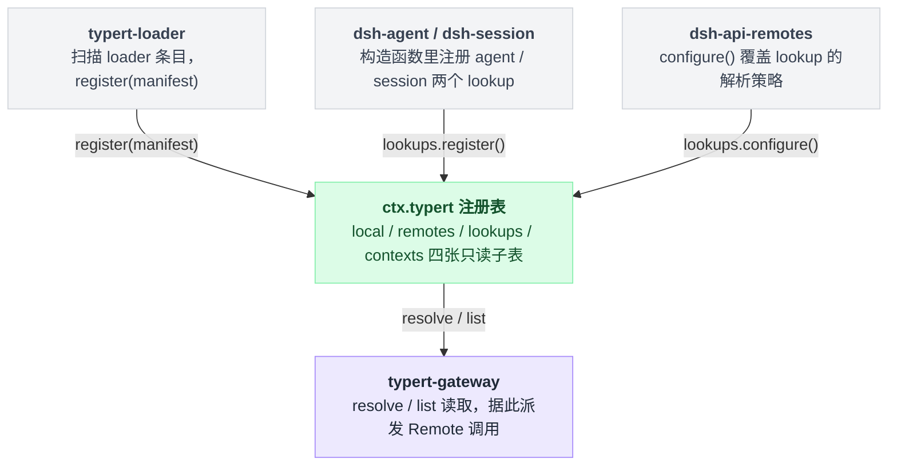

# typert

> `@deepseek-ai/dsh-typert-registry` · bundle：`base` · 配置树 id：`typert` · v0.1.0-rc.5（commit `47f9438`）2026-08-14 核对。出处收在文末脚注，可照抄代码收在附录。

**一句话**：一张进程内的表，存放构建期生成的包反射、Zod schema、Remote 调用描述符，以及 lookup / Context 提供者——所有登记都是 Cordis effect，随调用方 fiber 一起撤销。

名字里带着"registry"三个字，容易让人以为它会主动做点什么——校验、编排、往外推送。不是的：它自己一件事都不干，纯粹是同组另外两个插件之间的一张公告栏，[typert-loader](./dsh-typert-loader.md) 往上贴字，[typert-gateway](./dsh-api-gateway.md) 照着字条办事。

## 画面一：它只是一张公告栏，不干活

README 开篇把这层关系说得很直白[^1]：

> A contribution carries one package face's business reflection and optional live Zod schemas; `ctx.typert` registers both atomically and withdraws them with the calling Cordis fiber.

它怎么长在依赖树上，答案一样朴素：挂树配置里就两行，一个 id 一个 `name`，没有 `inject`、没有 `config`[^2]——配置目录文档把它列进"无配置插件"那一类[^3]。

## 它登记了什么：一个 service，四张子表，一层包级 API

| 类型 | 名字 | 说明 |
|---|---|---|
| service | `ctx.typert` | `TypertRegistry extends Service`，`super(ctx, 'typert')`[^4] |

没有事件监听——一个都没有，也没有工具、prompt 段、命令。

四个子注册表都是 getter：

| 子表 | 装什么 |
|---|---|
| `ctx.typert.local` | 本环境的 `InvocationDescriptor`，只读视图（`get` / `hasSeen` / `list` / `subscribe`）[^5] |
| `ctx.typert.remotes` | 消费端显式选中的 Remote contribution（`register` / `get` / `list` / `subscribe`）[^6] |
| `ctx.typert.lookups` | Host 对象查找：`register()` 由业务包给出稳定声明＋默认解析器，`configure()` 由 Host 组装层覆盖策略[^7] |
| `ctx.typert.contexts` | 作用域 Context：`registerHost()` / `configureHost()` / `registerClient()`[^8] |

四张子表之外还有一层包级 API，挂在 `ctx.typert` 自己身上：

| API | 干什么 |
|---|---|
| `register` | 写入一整批 contribution[^9] |
| `get` / `resolve` / `list` | 读[^10] |
| `getPackage` / `listPackages` | 按包读[^11] |
| `toJSONSchema` | 把 Zod schema 投影成 JSON Schema[^12] |

**三种身份都是拼出来的字符串，不能自己造：**

| 形式 | 组成 |
|---|---|
| 包面 | `<package>#<face>`，face 只能是 `host` / `client`[^13] |
| schema | `<package>#<name>`[^14] |
| 端点 | `<namespace>/<method>`[^15] |

## 画面二：谁能往上面写，谁只能读

配置项一个都没有——它的内容 100% 由运行时调用方决定。默认树上有三方人在动它：

| 谁 | 干了什么 |
|---|---|
| typert-loader | 自动扫描 loader 条目后写入，见 [typert-loader](./dsh-typert-loader.md) |
| `@deepseek-ai/dsh-agent` / `@deepseek-ai/dsh-session` | 构造函数里经 `ctx.inject` 注册 `agent` / `session` 两个 lookup[^16] |
| `@deepseek-ai/dsh-api-remotes` | 用 `configure()` 覆盖这两个 lookup 的解析策略[^17] |

谁写、谁读、谁改策略，画出来是这样：



`register` 和 `configure` 是两个角色的分工，不是同义词。业务包给声明和默认解析器，Host 组装层只换策略：

```
lookups.register(key, wire声明, 默认解析器)   // 业务包，一个 key 一辈子一次
lookups.configure(key, 新解析器)              // Host 组装层，可以来覆盖
    → effect 存活期间：resolve(key) 走新解析器
    → effect 结束：自动退回业务包给的默认解析器
```

## 模型看得见什么：默认一个字都看不到

README 的 Model Experience 原文[^21]：

> None, as the registry contributes no prompt, tool, or session event; consumers such as `cordis_inspect` own any model-visible projection.

KV Cache effect 一栏[^22]：

> No direct effect. A consumer that places reflection in a request owns the resulting prefix change.

补一句核对结果：那个 `cordis_inspect` 消费者（`@deepseek-ai/dsh-tool-cordis`，其 API 目录里有一条 `key: 'typert'`）[^23]**不在**默认三个 bundle 里，所以默认树上模型确实一个字都看不到。

## 什么时候你会想换掉它，又该怎么换

不建议换，也基本换不掉：Gateway 的 `static inject = ['typert']`、loader 的 `inject = ['typert', 'loader']` 都把 typert 列进启动期的硬依赖，关掉这一行会让两者一起卡在 pending，`/api` 上的 Remote 调用全部落空。

真正的可替换点在它内部而非这一行——lookup 解析策略用 `lookups.configure()` 覆盖，effect 生命周期结束就恢复业务包的默认策略[^18]。

想换一个存储实现，`register()` 也一直是公开的。README 说得直白[^19]：

> direct `ctx.typert.register()` supports other composition owners

浏览器侧另有一套：`./client` 子路径导出 `inject: []` 的同实现插件，由 `dsh.client` 元数据声明[^20]。同实现不等于同一张表——它和 base 这一行是两个进程里的两个实例，不共享内容。

## 源码读完才看得出的坑

README 的 Known Limitations 两条[^24]：注册表只存生成物，不合并 host/client 图、不解析 TypeScript 引用（那是 analyzer 与 emitter 的事）；schema key 不含 face，因为两个 face 跑在不同 context，同名 schema 从两个 face 注册进同一个 context 会被判重复。

**全批次原子。** 包面、schema、invocation id、端点任一重复，整个 contribution 被拒，什么都不写：

```
register(contribution):
    for 每个 包面/schema/invocation id/endpoint:
        if 已存在: 抛错，退出          // 一处冲突 = 整批作废
    真正写入                          // 走到这里才落表
```

没有"写进去一半"的中间态[^25]。

**`hasSeen` 是永不清空的历史集合**[^26]：

```
register(endpoint):   live.add(ep);  seen.add(ep)    // seen 只进不出
withdraw(endpoint):   live.delete(ep)                // seen 不动
hasSeen(ep) == true                                  // 撤销后依然 true
```

端点撤销后它仍返回 true，Gateway 靠这个拒绝退化成 SRC（见 [typert-gateway](./dsh-api-gateway.md)）——这是有意的单向门，代价是这张表随进程生命周期只增不减。

其余几条：

- **lookup 的 wire 声明在本次进程内不可改。** 同一 key 第二次 `register()` 若声明不一致直接抛 "changed its wire declaration during this registry lifetime"[^27]。
- **`subscribe()` 不是 Cordis 事件**，是插件内部的 listener 集合。监听器抛错只被 `ctx.logger.warn` 吞掉[^28]，别指望用 Cordis 的事件工具观察它。
- 名字校验很严：包名/schema 名不能为空、不能含 `#`；wire 字段只允许 `[A-Za-z0-9_$.-]`，且不能是 `.` 或 `..`[^29]。
- `toJSONSchema` **不缓存**[^12]，每次调用重新投影一份。

## 把它串起来

- **它是公告栏，不是执行者**——四张子表全是只读 getter，写和读都是别人的动作，模型默认一个字都看不到；
- **register 和 configure 不是同义词**——业务包用 register 给出一次性的声明和默认解析器，Host 组装层用 configure 换策略，effect 一撤销就退回默认；
- **一批 contribution 要么全进要么全不进**——包面、schema、invocation id、端点任一重复，整批被拒，没有"写了一半"的中间态；
- **hasSeen 只增不减**——端点撤销后它依然记得见过，这是 Gateway 拒绝退化成 SRC 的依据，代价是这张表随进程生命周期一路涨；
- **想换实现，改的是 `lookups.configure`，不是挂树那两行**——挂树那两行动不得，内部的解析策略才是真正的可替换点。

下次 `ctx.typert` 报错，先想想是不是两次冲突的 register 撞上了，而不是急着怀疑挂树配置。

---

## 附录：可以照抄的模板

### A. 在 bundle 树上挂上这个插件

```yaml
# packages/bundle/base/cordis.patch.yml:30
    - id: typert
      name: '@deepseek-ai/dsh-typert-registry'
```

没有 `inject`，也没有 `config`。

---

## 出处

[^1]: README 开篇："A contribution carries one package face's business reflection and optional live Zod schemas; `ctx.typert` registers both atomically and withdraws them with the calling Cordis fiber."：`packages/typert/registry/README.md:5`。
[^2]: 挂树两行（`id: typert`、`name: '@deepseek-ai/dsh-typert-registry'`）：`packages/bundle/base/cordis.patch.yml:30`。
[^3]: `docs/config-catalog.md:3151` 把它列进 Loadable plugins with no config。
[^4]: `TypertRegistry extends Service`，`super(ctx, 'typert')`：`packages/typert/registry/src/service.ts:446`、`:455`。
[^5]: `ctx.typert.local` getter：`packages/typert/registry/src/service.ts:467`。
[^6]: `ctx.typert.remotes` getter：`packages/typert/registry/src/service.ts:478`、`:187`。
[^7]: `ctx.typert.lookups` getter 在 `packages/typert/registry/src/service.ts:483`；`register()` 在 `:290`；`configure()` 在 `:263`。
[^8]: `ctx.typert.contexts` getter：`packages/typert/registry/src/service.ts:488`；`registerHost()` 在 `:402`。
[^9]: `register` 写入一整批 contribution：`packages/typert/registry/src/service.ts:499`。
[^10]: `get` / `resolve` / `list`：`packages/typert/registry/src/service.ts:527`、`:537`、`:558`。
[^11]: `getPackage` / `listPackages`：`packages/typert/registry/src/service.ts:568`、`:577`。
[^12]: `toJSONSchema`：`packages/typert/registry/src/service.ts:587`。
[^13]: 包面身份格式（face 只能是 `host` / `client`）：`packages/typert/registry/src/service.ts:58`、`:594`。
[^14]: schema 身份格式：`packages/typert/registry/src/service.ts:48`。
[^15]: 端点身份格式：`packages/typert/registry/src/service.ts:67`。
[^16]: `@deepseek-ai/dsh-agent` / `@deepseek-ai/dsh-session` 构造函数里经 `ctx.inject(['typert'], ...)` 注册 `agent` / `session` 两个 lookup：`packages/core/agent/src/index.ts:269`、`packages/core/session/src/index.ts:799`。
[^17]: `@deepseek-ai/dsh-api-remotes` 用 `configure()` 覆盖这两个 lookup 的解析策略：`packages/api/remotes/src/agent-lookup.ts:205`。
[^18]: effect 存活期间 resolve 走新解析器、effect 结束退回默认策略：`packages/typert/registry/src/service.ts:263`；README 对应说明：`packages/typert/registry/README.md:12`。
[^19]: README 原话 "direct `ctx.typert.register()` supports other composition owners"：`packages/typert/registry/README.md:20`。
[^20]: `./client` 子路径导出 `inject: []` 的同实现插件：`packages/typert/registry/src/client/index.ts:7`、`:13`；`dsh.client` 元数据声明：`packages/typert/registry/package.json:36`。
[^21]: Model Experience 原文 "None, as the registry contributes no prompt, tool, or session event; consumers such as `cordis_inspect` own any model-visible projection."：`packages/typert/registry/README.md:24`。
[^22]: KV Cache effect 原文 "No direct effect. A consumer that places reflection in a request owns the resulting prefix change."：`packages/typert/registry/README.md:28`。
[^23]: `cordis_inspect` 消费者（`@deepseek-ai/dsh-tool-cordis`）API 目录里的 `key: 'typert'` 条目：`packages/extensions/tool-cordis/src/api-catalog.ts:1943`。
[^24]: Known Limitations 两条：`packages/typert/registry/README.md:32`、`:33`。
[^25]: 全批次原子写入逻辑：`packages/typert/registry/src/service.ts:499`、`:120`、`:615`。
[^26]: `hasSeen` 只增不减：`packages/typert/registry/src/service.ts:143`、`:169`。
[^27]: 声明不一致直接抛 "changed its wire declaration during this registry lifetime"：`packages/typert/registry/src/service.ts:306`。
[^28]: `subscribe()` 是插件内部 listener 集合，非 Cordis 事件：`packages/typert/registry/src/service.ts:83`；监听器抛错被 `ctx.logger.warn` 吞掉：`:456`。
[^29]: 名字校验：包名/schema 名不能为空、不能含 `#`：`packages/typert/registry/src/service.ts:711`；wire 字段字符集与 `.`/`..` 限制：`:705`。
