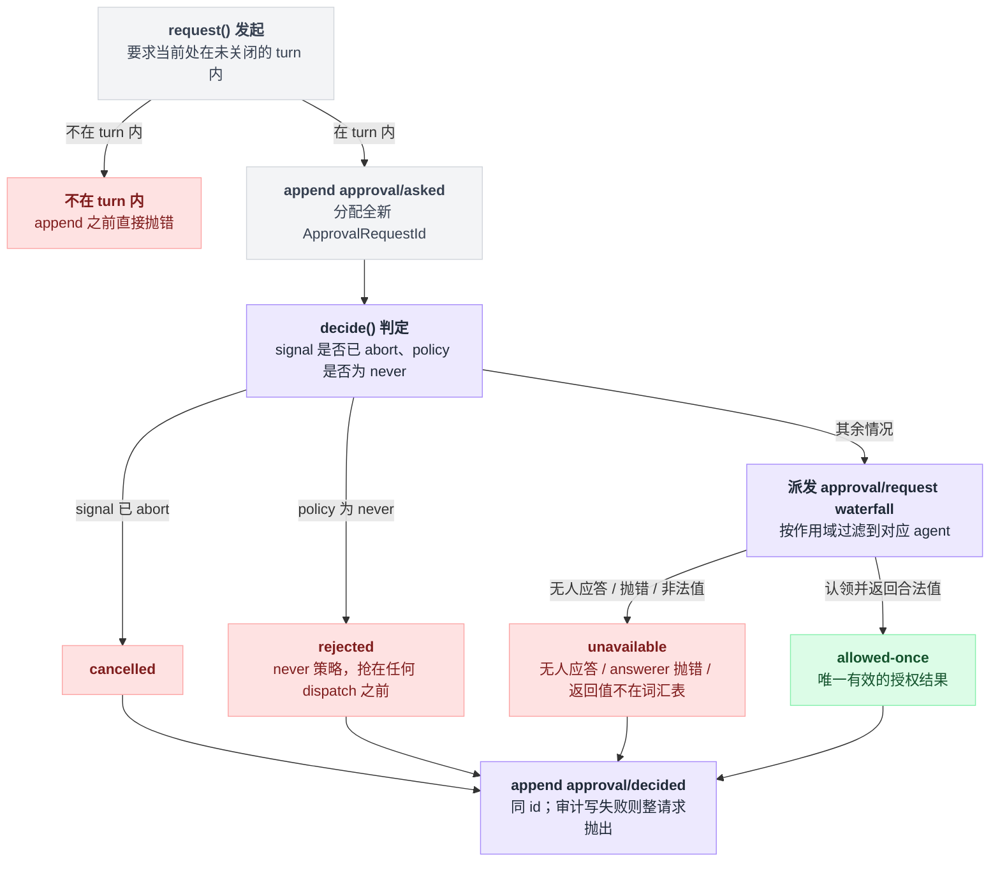

# user-approval

> `@deepseek-ai/dsh-user-approval` · bundle：`base` · 配置树 id：`approval` · v0.1.0-rc.5（commit `47f9438`）2026-08-14 核对

**一句话**：与渠道无关的一次性审批 seam（`ctx.approval`）——`request()` 只会返回 `allowed-once` / `rejected` / `cancelled` / `unavailable` 四种结果，没有 answerer 或 answerer 抛错一律算失败关闭，授权只对这一次被问的动作生效。

## 它在树上长什么样

```yaml
    - id: approval
      name: '@deepseek-ai/dsh-user-approval'
      config:
        policy: !!js "(process.env.DSH_PERMISSION_MODE ?? 'workspace-write') === 'danger-full-access' ? 'never' : 'ask'"
```

这里最值得记的是：`DSH_PERMISSION_MODE` 这一个环境变量同时管着两处。它决定本插件的 `policy`，也决定 [sandbox-policy](./dsh-sandbox-policy.md) 的 `mode`。

所以把整机开到 `danger-full-access` 时，审批会一起被关成 `never`；否则是 `ask`。插件 schema 自己的默认值也是 `ask`。

出处：bundle 配置见 `packages/bundle/base/cordis.patch.yml:188-191`，sandbox-policy 的 `mode` 在同文件 `175`；schema 默认见 `packages/interaction/user-approval/src/index.ts:194`。

## 它注册了什么

| 类型 | 名字 | 说明 |
|---|---|---|
| service | `ctx.approval` | `ApprovalService`，`super(ctx, 'approval')`（`src/index.ts:198`） |
| 事件（**声明并派发**，非监听） | `approval/request`（**waterfall**，`src/index.ts:28` 的 `@mode waterfall`） | 它是这条 waterfall 的生产者：`ctx.waterfall(scopeTarget(this, req.agent), 'approval/request', req, …)`（`src/index.ts:318-321`）。answerer 是别人注册的监听器，返回结果即认领、调 `next()` 即转交 |
| prompt 段 | `approval:policy`，`order: 115` | `ctx.inject(['systemPrompt'])` 可选挂载（`src/index.ts:204-216`） |
| session 事件 | `approval/asked` / `approval/decided` / `approval/policy` | 全是 log-only 审计/状态事件，**不进模型 transcript**（`src/index.ts:44-71`） |

waterfall 走 `@deepseek-ai/dsh-scope` 的作用域过滤派发：agent 作用域的监听器只会收到自己那个 agent 的请求（`src/index.ts:26`、`packages/core/scope/src/scoped-events.generated.ts:23`）。

仓库自动生成的收发表把生产者/消费者关系写死了：生产者是 `user-approval`（waterfall），消费者是 `acp` 和 `apiproxy`（`docs/event-producer-consumer.md:24`）。

### base bundle 里没有内置 answerer

两个已知的 answerer 都在 base 之外，而且认领请求的判据完全不同：

| answerer | 认领判据 | 不认领时 | 组合位置 |
|---|---|---|---|
| ACP 桥 | 只认领自己拥有、且带 `callId` 的请求 | `next()` | 不在任何 bundle 里 |
| web 端 api-proxy | 不看 agent 归属，去会话日志里配对一条尚未决定、未被别的挂起项认领的 `approval/asked` | 配不上就 `next()` | 由 web-app bundle 组合 |

出处：ACP 桥 `packages/acp/acp/src/index.ts:215-217`；api-proxy 认领逻辑 `packages/host/apiproxy/src/api-proxy.ts:1422`、转交在同文件 `1457`；组合位置 `packages/bundle/web-app/cordis.patch.yml:100`。

## 关键流程

一句话：**先确认在 turn 内 → 记 asked → 判定 → 记 decided**。判定这一步有三条捷径抢在派发之前，只有走到派发才轮得到 answerer。

```
request(req):
    if 当前没有未关闭的 turn:
        抛错                      // 在 append 任何东西之前就抛

    append approval/asked(新的 ApprovalRequestId)

    result = decide():
        if signal 已 abort:       return cancelled
        if 有效策略 == never:      return rejected    // 抢在任何 dispatch 之前
        r = waterfall('approval/request', req)        // 按作用域过滤到对应 agent
        if 无人应答:              return unavailable
        if answerer 抛错:         return unavailable  // 同步抛也算
        if r 不在词汇表里:         return unavailable  // 归一化
        return r

    append approval/decided(同一个 id)                // 写失败则整个请求抛出
    return result
```

`request()` 要求当前处在一个未关闭的 turn 里，是因为审计对必须被 turn 的提交/重放边界包住（`src/index.ts:259-265`、`127-134`）。

`never` 的短路为什么写在服务里而不是做成一个监听器？源码注释专门解释了：监听器即便用 `prepend: true` 也可能被别人插队，只有服务本身能保证这一刀落在所有 dispatch 之前（`src/index.ts:307-312`）。

answerer 抛错那条要注意 `317` 特意先进了 promise 链，所以同步抛出的错误也会被归到 `unavailable`，而不是穿透出去。归一化非法返回值在 `325-328`。

最后一步的失败模式也是刻意的：审计写失败会导致整个请求抛出，而不是返回一个没记账的决定。

五步连起来，含各条分支去向：



### 谁在消费它

工具管线的 `ask` 决策走这里，没组合审批服务就退化成拒绝（`packages/core/tools/src/index.ts:1693-1699`）。

沙箱升级（`sandbox_permissions`）也走这里。`approveEscalation()` 先校验「严格更宽」，再问审批：`allowed-once` 返回被批准的 mode，其余三种结果各抛一段不同的报错文案（`packages/sandbox/sandbox/src/escalation.ts:157-189`，分支在 `180-187`）。

把 `ctx.get('approval')` 传进去的是 `dsh-tool-bash`（`packages/shell/tool-bash/src/index.ts:226`）与 `dsh-tool-fs`（`packages/fs/tool-fs/src/sandbox.ts:100`）。

## 配置项

| 字段 | 类型 | 默认值 | 作用 |
|---|---|---|---|
| `policy` | `'ask' \| 'never'` | `ask`（bundle 按 `DSH_PERMISSION_MODE` 算） | 没有 `approval/policy` 覆盖的 session 的部署默认。`ask` 委派给组合好的 answerer（一个都没有就失败关闭）；`never` 不问任何人，每次 ask 确定性地 `rejected` |

会话级覆盖是最后一条 `approval/policy` 事件，`setApprovalPolicy(session, policy)` 是唯一写路径（`src/index.ts:142-147`）。

另有一个 `setPolicy(agent, policy)`，是「活 agent 切换」的版本——除了写事件，还会给模型注入一句切换通知（`226-237`）。

## 模型看得见什么

两条策略文本，逐字来自源码常量（`src/index.ts:102`、`100`；README 的 `26`、`32` 相同）：

```markdown
Approval policy: ask. Operations that require approval may ask through the configured answerers; without an available answerer, the request fails closed.
```

```markdown
Approval prompts are disabled in this session: actions that require approval are rejected automatically — do not request sandbox escalation (do not set `sandbox_permissions`).
```

运行中切换还会追加一句 `The approval policy changed from "<previous>" to "<policy>" (changed by the user).`（`src/index.ts:233`）。

README 的 Tool outcome 一节把边界划得很清楚：`approval/asked` / `approval/decided` 都是 log-only，模型只看到发问方最终的工具结果，**人类看到的审批 UI 不是上下文**。

策略上下文那一段还有两条效应：

| 效应 | 表现 | 出处 |
|---|---|---|
| Token effect | 策略消息只在首个请求和有效变化时各出现一次 | `README.md:37` |
| KV Cache effect | 只追加，`ask`/`never` 互切不会重写第一条 wire 消息 | `README.md:41` |

Tool outcome 一节本身在 `packages/interaction/user-approval/README.md:43-47`。

## 什么时候你会想换掉它 / 怎么换

- **CI / 无人值守**：`config.policy: never`，或直接把 `DSH_PERMISSION_MODE` 设成 `danger-full-access`（那会连带把沙箱开到底，两件事一起发生，别只想着关弹窗）。
- **自建审批渠道**：不用换插件，注册一个 `approval/request` waterfall 监听器即可，认领自己的请求、其余 `next()`。README 提醒：**每个部署只组合一个终结性 answerer**，兄弟监听器的顺序不是策略优先级机制（`README.md:9`）。
- **卸掉它**：[permission-presets](./dsh-permission-presets.md) 的 `static inject` 里有 `approval`，会跟着一起不启动；工具管线则退化为「需要审批 = 拒绝」。

## 坑与边界

README 的 Known Limitations and Deferred Work（`packages/interaction/user-approval/README.md:57-62`）：

- **请求只在开着的 turn 内有效**——空闲或 turn 之间的调用在审计之前就抛，跨 turn 的持久审批流程被推迟。
- **只有一次性授权**——词汇表里有 `allowed-once`，但没有 `allow-always`、记忆规则、撤销或授权存储；会话策略也只有 `ask` / `never`。
- **请求不带工具参数**——answerer 只看到工具名、原因和可选的 call id；ACP 机器渠道要求必须有 call id，没有的请求它直接 `next()` 转交。
- **没有内置 answerer**——headless 或组合不完整的部署解析为 `unavailable` 并失败关闭，服务本身永远不会去问人。
