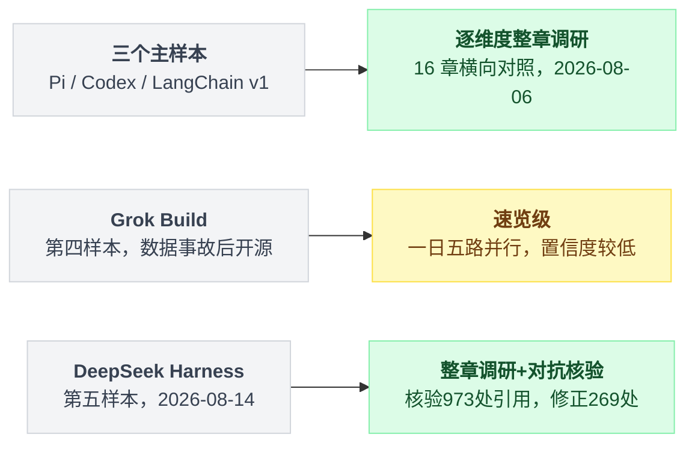
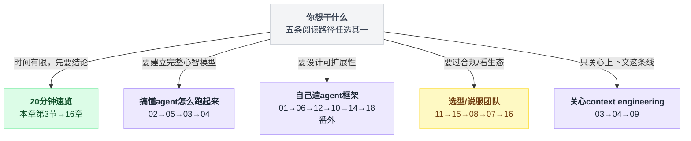
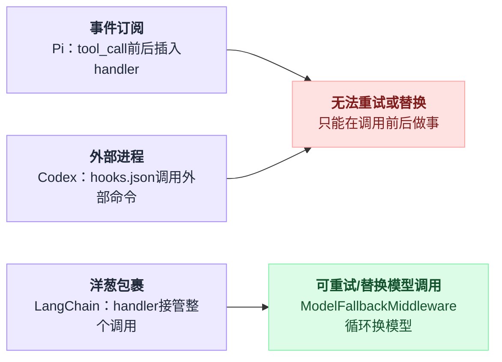
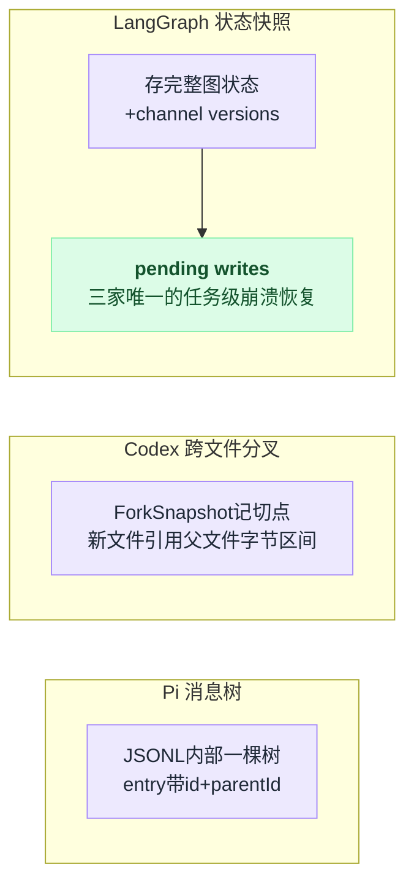

# 00 · 总览与阅读指南

> 调研时间：三个主样本与 Grok Build 是 **2026-08-06**，DeepSeek Harness 是 **2026-08-14**。所有仓库全部 clone 到本地读源码，文中版本号、行号、计数（crate 数、事件数、prompt 字符数等）均为各自调研当日实测；Codex 读的就是当天的 HEAD。这些项目都在高速迭代，本文档反映的是这两天的状态——具体的可信度说明与已修正的错误见第 6 节。

> **这套文档是什么**：把五个真实的 agent 系统的源码逐维度拆开对照。三个主样本是
> [earendil-works/pi](https://github.com/earendil-works/pi)、[openai/codex](https://github.com/openai/codex)、[langchain-ai/langchain v1](https://github.com/langchain-ai/langchain)，
> 后补的第四、第五个样本是 [xai-org/grok-build](https://github.com/xai-org/grok-build) 与 [deepseek-ai/deepseek-harness](https://github.com/deepseek-ai/deepseek-harness)（见下方两条补充说明）。
> 不是使用教程，是**架构解剖**。目标是让你读完之后，有能力自己设计一个 agent harness，并且知道每个决策点上有哪些选项、各自的代价是什么。

---

## 1. 三个对象

| | **Pi** | **Codex** | **LangChain v1** |
|---|---|---|---|
| 全名 | earendil-works/pi | openai/codex | langchain-ai/langchain |
| 本次读的版本 | v0.83.0 | rust-v0.146.1（HEAD `0a0ebb8`，2026-08-06） | langchain 1.3.14 |
| 语言 | TypeScript | Rust（96.2%） | Python |
| 规模 | 11 个 npm 包 | 130 个 Cargo crate | 3 层（langchain / langchain-core / langgraph）+ 17 个 partner 包 |
| 许可证 | MIT | Apache-2.0 | MIT |
| 出品 | Mario Zechner（libGDX 作者）→ Earendil Inc. | OpenAI | LangChain Inc. |
| 本质 | 成品 CLI，但内件全可换 | 一个引擎，六种产品形态 | 框架/库，不是成品 |
| 源码路径 | `/tmp/pi` | `/tmp/codex` | `/tmp/langchain` + `/tmp/langgraph` |

**先说清一件事**：三者定位不同，这本身就是最重要的结论之一，不要强行拉平。

- **Pi 和 Codex 是成品**（终端用户装了就能用），它们必须对"默认行为"负责。
- **LangChain v1 是框架**（开发者用它造自己的 agent），它对"默认行为"刻意保持沉默——比如 `create_agent()` **默认不带任何上下文压缩**，因为压缩策略是用户的事。

这条「框架 vs 产品」的轴贯穿全部 16 章。每次你看到 LangChain "什么都没做"，先想想是不是它本来就不该做。

**2026-08-06 补充第四个样本**：xAI 数据事故后开源的 [Grok Build](https://github.com/xai-org/grok-build)（Rust，155 万行）。全项目背景与总体判断见 [17 番外](./17-番外-GrokBuild全项目速览.md)，第 01–15 章各在章末有「第四个样本：Grok Build」小节，16 章总表已扩入 Grok 列。注意 Grok 的调研深度是速览级（一日五路并行读源码），置信度低于三个主样本的整章调研。

**2026-08-14 补充第五个样本**：DeepSeek 前一天开源的 [DeepSeek Harness](https://github.com/deepseek-ai/deepseek-harness)（`dsh`，TypeScript，219 个包）。它是五个样本里第一个**把 harness 本身当产品发布**的——口号"Everything is a Plugin"可以用 `grep` 验证：agent loop 是启动配置里的一行 YAML。全项目背景见 [18 番外](./18-番外-DeepSeekHarness全项目速览.md)，第 01–15 章各在章末有「第五个样本：DeepSeek Harness」小节，16 章总表已扩入 dsh 列。调研深度是**逐维度整章调研 + 逐条引用对抗核验**（15 路并行，核验 973 处 file:line 与英文引文），置信度与三个主样本同档、高于 Grok 列。

五个样本不是同一个置信度档位，读的时候要分清哪些结论是"整章调研"、哪些是"速览级"：



---

## 2. 怎么读

### 如果你只有 20 分钟

读本章的第 3 节（十个最值得记住的发现），再读 [16-横向总表与选型指南](./16-横向总表与选型指南.md)。

### 如果你想搞懂 agent 到底是怎么跑起来的

按这个顺序：**02 → 05 → 03 → 04**

Agent 循环是骨架，工具系统是四肢，上下文策略是它吃什么，压缩是它怎么在吃撑之后继续活着。这四章读完，你就有了一个完整的 agent 心智模型。

### 如果你要自己造一个 agent 框架

按这个顺序：**01 → 06 → 12 → 10 → 14**

架构分层决定了你未来能不能改；中间件决定了别人能不能扩展你；模型抽象层决定了你被哪家厂商绑定多深；会话持久化决定了你能不能做"回到某一步重来"这件事——而这件事比大多数人以为的重要得多。最后用第 14 章把状态架构（谁能写状态、真相源放哪、崩溃了怎么办）这条底层主线收拢。

读完再看 [18 番外](./18-番外-DeepSeekHarness全项目速览.md)：DeepSeek Harness 是把"可组合"这条路走到底的样本，**它的账单（第 5 节）比它的优点更值得你先读**。

### 如果你是要选型 / 说服团队

读 **11（安全）→ 15（遥测与数据边界）→ 08（MCP）→ 07（扩展分发）→ 16（选型）**

企业选型的决定性因素通常不是"哪个更聪明"，而是"合规能不能过"和"我们已有的工具怎么接进来"。

### 如果你关心 context engineering

读 **03 → 04 → 09**

分别对应：往窗口里塞什么、塞满了怎么办、跨会话怎么记住。这三件事经常被混为一谈，第 09 章开头专门做了概念澄清。

五条路径汇总成一张图，先看自己落在哪一支：



---

## 3. 十个最值得记住的发现

以下每一条都在正文里有源码出处，这里只给结论。

**1. Codex 的 `WireApi` 枚举只有一个变体。**

```rust
// codex-rs/model-provider-info/src/lib.rs:56
pub enum WireApi { #[default] Responses }
```

Chat Completions 支持已被完全删除，且手写了 `Deserialize` 专门为 `wire_api = "chat"` 报一句人话错误——这说明它是**刻意保留的报错锚点**，不是遗留代码。任何第三方 provider 想接进 Codex，必须自己提供 Responses 兼容端点。这道护城河不是商业条款写的，是类型系统写的。（→ [12 章](./12-模型抽象层.md)）

**2. Codex 的「一个引擎多种形态」是编译期可验证的事实。**

TUI 源码里 `codex_core::` 的引用数是 **0**，`codex_app_server_protocol::` 有 **1263** 处。也就是说 TUI 完全不认识核心引擎，只认识协议——它是一个纯客户端。这是把"一份代码支撑 CLI/IDE/桌面/云"这句 slogan 落到编译器能检查的层面。（→ [01 章](./01-架构思想与分层.md)）

**3. Pi 和 Codex 在 system prompt 规模上差约 7 倍，但这不是"谁更省"的问题。**

Pi 主体 prompt 展开后约 2300–2450 字符（≈600 token）；Codex 的 `instructions_template` 是 11114–21544 字符，而且**七个模型有七份不同的 prompt，连章节标题都不一样**（gpt-5.2 有 `## AGENTS.md spec` 和 `## Tool Guidelines`，5.6 已经删掉了）。这是「prompt 与模型协同训练」的直接证据：OpenAI 可以在训练时把行为烧进模型，于是 prompt 里就不用再写了。Pi 没有这个条件，它的赌注是"前沿模型天然懂 coding agent"。（→ [03 章](./03-上下文策略.md)）

**4. Pi 把该说的话写进工具描述和返回值，而不是 system prompt。**

因为 system prompt 每一轮都要付费，工具描述只在工具被展示时付费，返回值只在真正触发时付费。最漂亮的一处：`read` 工具读到一行超过 50KB 时，直接把兜底命令写进返回给模型的字符串里——

```
[Line N is X, exceeds 50KB limit. Use bash: sed -n 'Np' path | head -c 51200]
```

这是"把知识放在最接近使用时刻的地方"。（→ [03 章](./03-上下文策略.md)）

**5. 压缩的切点选择是三家分歧最技术性的地方，而且方向相反。**

Pi 用白名单枚举合法切点（`isCutPointMessage` 显式排除 `toolResult`），冲突时**向新的方向挪**；LangChain 的 `_find_safe_cutoff` 冲突时**向旧的方向回溯**到配对的 AIMessage。切错的后果是一样的：tool_call 和 tool_result 配对断裂，API 直接返回 400。

Codex 走了第三条路——它有**服务端压缩**（`compact_remote_v2.rs`），客户端只发请求，策略在 OpenAI 服务器上。另外还有一个 `compact_token_budget.rs` 是**跳过摘要直接开新窗口**。（→ [04 章](./04-压缩与长会话.md)）

**6. Codex 的 Code Mode 是本次调研里最激进的架构变化。**

GPT-5.6 三个模型的 `tool_mode` 都是 `code_mode_only`：模型不再看到几十个工具，**只看到 `exec` 和 `wait` 两个入口，改为写 TypeScript 去调工具**。所有工具的 JSON Schema 被 `render_json_schema_to_typescript` 渲染成 TS 类型签名塞进 `exec` 的 description，脚本跑在一个删掉了 `console`/`Atomics`/`SharedArrayBuffer`/`WebAssembly` 的裸 V8 里。

好处是一次调用里可以循环、判断、组合多个工具，省掉大量 round trip。代价是：强依赖专门训练过的模型、调试性下降、而且**声明期的 token 并没有真正省下**（只有 deferred 的那部分省了）。（→ [05 章](./05-工具系统与执行模型.md)）

**7. 三种拦截范式的能力天花板由范式本身决定，不是实现遗漏。**

- Pi = **事件订阅**（`pi.on('tool_call', handler)`）
- Codex = **外部进程**（hooks.json 调外部命令）
- LangChain = **洋葱包裹**（`wrap_model_call(request, handler)`）

前两者**无法重试或替换一次模型调用**——它们只能在调用前后做事。只有 LangChain 把 `handler` 交到拦截器手里，所以 `ModelFallbackMiddleware` 能循环调 N 次换模型。这是全套文档里最硬的一条结论。（→ [06 章](./06-中间件与钩子.md)）

三种范式并排放在一起，能力天花板的差距一眼就看出来：



**8. 同一个 to-do 功能，三家给了三种态度。**

Pi 的 README 原文：**"No built-in to-dos. They confuse models."** LangChain 做了 `TodoListMiddleware`（tool + system prompt + state_schema + after_model 校验四件套）。Codex 有内置的 `update_plan` 工具，还带一条约束"At most one step can be in_progress at a time"。

有意思的是两边都观察到了同一个失败模式——模型会被自己的 todo 列表带偏——一个选择不做，一个选择用 prompt 补丁按住。（→ [06 章](./06-中间件与钩子.md)）

**9. 「回到某一步重来」这件事，三家都做了，但在三个不同的抽象层次。**

- Pi：**消息树**。单个 JSONL 文件内部是一棵树（entry 带 `id` + `parentId`，当前位置是 active leaf），`/tree` 有完整 TUI 可以导航、折叠、打标签。
- Codex：**跨文件分叉**，用 `ForkSnapshot` 记切点，`ForkPersistence::Referenced` 模式下新文件只引用父文件的前缀字节区间。
- LangGraph：**状态快照 + time travel**。存的不是消息列表，而是每个 superstep 后的完整图状态 + channel versions + pending writes；`update_state(as_node=...)` 从任意历史点派生新分支。

而 **pending writes 是三家中唯一的任务级崩溃恢复**——节点执行到一半宕机，重启时不会重复已完成的写入。（→ [10 章](./10-会话持久化与分支.md)）

三种抽象层次并排对比，各自存的是什么、粒度在哪一层：



**10. 安全上，只有 Codex 真做了，Pi 明确拒绝并给出了自洽的论证。**

Pi 的 `docs/security.md` 原文：

> "A partial in-process sandbox would be **easy to misunderstand as a security boundary** while still depending on the host shell, filesystem, package managers, credentials, and extension code. Real isolation needs to come from the operating system or a virtualization/container boundary."

这个论证在技术上是对的。但它把责任外推给了使用方。作为补偿，Pi 把力气全花在了**供应链**（`.npmrc` 的 `min-release-age=2` 拒绝当日发布的依赖、`--ignore-scripts`、npm-shrinkwrap、可复现构建的 SHA256SUMS）。

Codex 反过来，三套 OS 原生沙箱（macOS Seatbelt 真 sbpl 文件、Linux bubblewrap+seccomp、Windows 受限令牌+capability SID）+ 16k 行自建 MITM 网络代理。最精彩的是 `WritableRoot` 那段防提权注释：确保 `.git/hooks`、`.codex` 这类"改了就能给 agent 提权"的目录不被 agent 写入。

而 LangChain 的"沙箱执行策略"实现是——**shell out 到 `codex sandbox` 命令**（`middleware/_execution.py:191` 的 `CodexSandboxExecutionPolicy`）。这大概是本次调研中最出人意料的一处发现。（→ [11 章](./11-安全沙箱与权限.md)）

### 第五个样本带来的两条修正（2026-08-14 补）

**A. 第 7 条的边界比原文窄。** DeepSeek Harness 是第一个把 Koa 式 `(payload, next)` 洋葱搬进 agent 主链路的**产品**（13 个 waterfall 拦截点），但它的 `next()` 是单程的——无参、游标共享、二次调用不重入。它照样做出了 `ModelFallbackMiddleware` 的等价物，办法是把重试循环留在 loop 里、插件只在 `agent/request-error` 上投一个 bit，重试次数落进 session log。所以真正必须的**不是 `handler` 回调，而是"谁拥有那个重跑的循环"**。（→ [06 章](./06-中间件与钩子.md) 第 9 节）

**B. "把 Claude Code 的文件约定当事实标准"这件事出现了第二条路线。** 第 17 章说配置格式正在向 `.claude/` 收敛；dsh 投了反对票——它抄机制（hook 协议桥、dynamic workflows 的 API 形状、skill frontmatter 字段名）但**发现路径全部收敛到中立命名**（`AGENTS.md`、`.agents/skills`、`~/.agents/skills`），全仓没有任何 `.claude/skills` 的发现路径。更彻底的一手：它把竞品做成了自己的 provider——`subagent-claude-code` / `subagent-codex` 把一次委派整个交给真的 Claude Code / Codex 进程，`llm-pi-ai` 直接把样本一 Pi 的 `@earendil-works/pi-ai` 当 npm 依赖装了进来。（→ [18 番外](./18-番外-DeepSeekHarness全项目速览.md) 第 4 节）

---

## 4. 一张图：agent harness 的完整解剖面

```
                      ┌─────────────────────────────────┐
                      │        用户输入 / CLI / IDE       │
                      └────────────────┬────────────────┘
                                       │
   ┌───────────────────────────────────▼───────────────────────────────────┐
   │                          Agent 循环  [第 02 章]                        │
   │   while(有活干) { 组装上下文 → 调模型 → 执行工具 → 结果回灌 }            │
   └──┬────────────┬─────────────┬──────────────┬───────────────┬──────────┘
      │            │             │              │               │
      ▼            ▼             ▼              ▼               ▼
 ┌─────────┐ ┌──────────┐ ┌───────────┐ ┌────────────┐ ┌──────────────┐
 │ 上下文   │ │  工具系统 │ │ 模型抽象层 │ │  中间件/钩子 │ │ 子 Agent 编排 │
 │ [03]    │ │  [05]    │ │  [12]     │ │  [06]      │ │  [13]        │
 │ prompt  │ │ schema   │ │ provider  │ │ 拦截点      │ │ 上下文隔离    │
 │ 截断    │ │ 并行执行  │ │ 流式/降级  │ │ 洋葱 vs 事件│ │ 结果回传      │
 └────┬────┘ └────┬─────┘ └───────────┘ └────────────┘ └──────────────┘
      │           │
      ▼           ▼
 ┌─────────┐ ┌──────────────┐        ┌──────────────┐  ┌───────────────┐
 │ 压缩     │ │ MCP/外部工具  │        │  安全沙箱     │  │ 扩展分发/信任  │
 │ [04]    │ │  [08]        │        │  [11]        │  │  [07]         │
 └─────────┘ └──────────────┘        └──────────────┘  └───────────────┘

      ┌──────────────────────┐          ┌──────────────────────┐
      │ 会话持久化与分支 [10]  │          │      记忆  [09]       │
      │ 存什么 / 怎么回到过去   │          │ 跨会话知识怎么留下     │
      └──────────────────────┘          └──────────────────────┘

                  底座：架构思想与分层  [01]
```

---

## 5. 章节索引

| 章 | 标题 | 一句话 | 谁最值得看 |
|---|---|---|---|
| [01](./01-架构思想与分层.md) | 架构思想与分层 | 三种分层哲学，以及「框架 vs 产品」这条主轴 | 要造框架的人 |
| [02](./02-Agent循环.md) | Agent 循环 | 手写 while vs 编译成图，停止条件与 steer | 所有人 |
| [03](./03-上下文策略.md) | 上下文策略 | prompt 规模、工具描述、AGENTS.md、截断 | 所有人 |
| [04](./04-压缩与长会话.md) | 压缩与长会话 | 切在哪、摘要写什么、prompt cache 的代价 | 做长任务的人 |
| [05](./05-工具系统与执行模型.md) | 工具系统与执行模型 | schema、并行竞态、Code Mode | 所有人 |
| [06](./06-中间件与钩子.md) | 中间件与钩子 | 三种拦截范式的能力天花板 | 要造框架的人 |
| [07](./07-插件与扩展分发.md) | 插件与扩展分发 | 打包、发现、加载、授信，以及 Skills | 做生态的人 |
| [08](./08-MCP与外部工具协议.md) | MCP 与外部工具协议 | 全面拥抱 / adapter 接入 / 明确拒绝 | 要接外部系统的人 |
| [09](./09-记忆.md) | 记忆 | 三个易混概念的澄清 + 自动提取的风险 | 做长期助手的人 |
| [10](./10-会话持久化与分支.md) | 会话持久化与分支 | 消息树 vs 状态快照 vs 跨文件引用 | 要做可靠性的人 |
| [11](./11-安全沙箱与权限.md) | 安全沙箱与权限 | 三套 OS 沙箱、审批疲劳、防提权 | 企业选型 |
| [12](./12-模型抽象层.md) | 模型抽象层 | 抹平一切 / 只走自家协议 / 能力档案 | 关心厂商锁定的人 |
| [13](./13-子Agent与多Agent编排.md) | 子 Agent 与多 Agent 编排 | 隔离上下文 vs 可观测性的权衡 | 做复杂任务的人 |
| [14](./14-状态同步与循环驱动.md) | 状态同步与循环驱动 | 循环怎么知道下一步：事件日志 vs Mutex 快照 vs 版本号调度 | 要造 harness / 关心崩溃恢复与分支的人 |
| [15](./15-遥测与数据边界.md) | 遥测与数据边界 | 六套遥测机制、硬编码 Statsig、脱敏与治理 | 关心数据外流 / 企业合规的人 |
| [16](./16-横向总表与选型指南.md) | 横向总表与选型 | 全维度对照 + 决策树 | 选型的人 |
| [17](./17-番外-GrokBuild全项目速览.md) | 番外：Grok Build 全项目速览 | 数据事故后开源的第四个样本，逐维度对到前 16 章 | 读完正篇想看第四种答案的人 |
| [18](./18-番外-DeepSeekHarness全项目速览.md) | 番外：DeepSeek Harness 全项目速览 | 第五个样本：一切皆插件，循环是一行 YAML——以及这条路的账单 | 想造可组合 harness 的人 |

---

## 6. 方法与可信度说明

**怎么做的**：三个仓库全部 clone 到本地读源码，不依赖二手文章。每个维度由独立的调查过程完成，之后做了一轮交叉核查（抽样验证代码片段是否与源码一致、英文引文是否逐字准确、行号是否对得上、各章之间有无矛盾）。

**核查发现并已修正的问题**：第 01 章曾把 Codex 的 legacy `notify` 桥接事件（`HookEvent::AfterAgent`，只有 1 个变体）误当成整个 hook 系统的表面积，导致"差距两个数量级"的结论被放大——实际是 hooks.json 的 11 个生命周期事件对 Pi 的 33 个，约 3 倍，且区别在形态而不在数量。此外修正了几处计数（Pi 事件数、prompt 字符数、provider 路由表条目数）。

**怎么看待「未确认」标记**：每章第 7 节列出了读源码时没搞清楚的点。这些不是敷衍——比如 Codex 的 `codex_mcp_interface.md` 文档声称 mcp-server 暴露 `thread/*` / `turn/*` RPC，但代码里找不到对应分发，实际只暴露 `codex` / `codex-reply`。**文档和代码不一致本身就是有价值的信息**，我们把它记下来而不是选一个信。

**时效性**：三个项目都在高速迭代（Pi 九个月发了 300+ 版本，Codex 的 HEAD 就是调研当天的 commit）。本文档反映的是 2026 年 8 月上旬的状态。尤其 Codex 的 Code Mode 和 multi-agent v2 都还在演进中。

**第五个样本的调研口径（2026-08-14 补）**：DeepSeek Harness 的调研方式与三个主样本同档——仓库 clone 到本地，**按 15 个维度并行读源码，每章成稿后再过一遍对抗式引用核验**（默认作者写错，逐条打开源码比对行号、逐字比对英文引文、重数每一个计数），共核验 973 处引用、修正 269 处。修正里有真错误：例如"原生监听器能改写 tool input"被证伪（`PreToolDecision` 只有 allow/deny/ask，parsed arguments 是 deep-frozen 的），"全仓唯一的迭代上限"被证伪（`tool-ralph` 还有一条）。**但仍有两条边界**：全部结论来自静态阅读，没有实跑过（未 `pnpm install`、未执行测试、未抓包）；219 个包没有逐包读完，外围包按仓库生成的目录文档取数。各章末的「本节未确认」共约 60 条是更细的边界清单。
