# 01 · 架构思想与分层

> **一句话导读**：agent harness 的本质是「一个 while 循环 + 一组工具 + 一个上下文管理器」，三个项目的全部架构差异，都来自它们对「谁拥有这个循环、谁拥有这份上下文」给出的不同答案。
>
> **本章涉及源码**
> - Pi：`package.json:16`（build 顺序即依赖分层）、`packages/agent/src/agent-loop.ts:170`、`packages/agent/src/types.ts:144`、`packages/coding-agent/README.md`（Philosophy）
> - Codex：`codex-rs/Cargo.toml:1`（130 个 workspace 成员）、`codex-rs/docs/protocol_v1.md`、`codex-rs/core/src/tasks/regular.rs:75`、`AGENTS.md:72`
> - LangChain v1：`langchain/agents/factory.py:1167`、`:1516`、`:1634`、`langgraph/pregel/main.py:450`

---

## 0. 先搞清楚：这是个什么东西

假设你已经会调 LLM API 了：发一段文本过去，拿一段文本回来。这是一次性的问答。

现在你想让它「干活」——读文件、跑命令、改代码。LLM 本身做不到这些，它只能吐字符串。于是 API 提供了一个约定：你在请求里附上一份「工具清单」（每个工具有名字、描述、参数 schema），模型如果想用工具，就不返回普通文本，而是返回一个结构化的「工具调用请求」，比如 `{name: "read_file", args: {path: "a.txt"}}`。

模型没法自己执行它。**执行的是你的代码。** 你读完文件，把内容作为「工具结果」塞回对话历史，再发一次请求。模型看到结果，可能继续调工具，也可能给出最终答复。

把这个过程写成伪代码，就是 agent harness 的全部：

```
messages = [system_prompt, user_input]
while True:
    response = llm(messages, tools=tool_list)     # ① 调模型
    messages.append(response)
    if not response.tool_calls:                   # ② 没有工具调用 → 收工
        break
    for call in response.tool_calls:              # ③ 执行工具
        result = tool_list[call.name](call.args)
        messages.append(result)
```

**这就是最小心智模型。** 三个部件：

1. **循环（loop）**——反复「调模型 → 执行工具 → 把结果塞回去」，直到模型不再要工具。
2. **工具集（tools）**——一组带 schema 的函数，是 agent 唯一能影响外部世界的手段。
3. **上下文（context）**——那个不断变长的 `messages` 数组，是 agent 唯一的记忆。

「harness」这个词本意是「马具/挽具」——套在牲口身上的那套皮带。模型是马，harness 是让马能拉车干活的那套装置。它不产生智能，它只是把智能接到现实世界上。

真实产品比这段伪代码多两个数量级的代码，但多出来的东西没有一样是新概念，全都是这三个部件被现实撑爆之后的补丁：`messages` 会超出上下文窗口 → 需要压缩；工具会删库 → 需要审批和沙箱；用户会在循环中途插话 → 需要 steering；循环会跑几十分钟 → 需要流式事件让 UI 有反应；进程会崩 → 需要会话持久化。

这些补丁不是凭空贴上去的，每一个都能追到三个部件里的某一处：

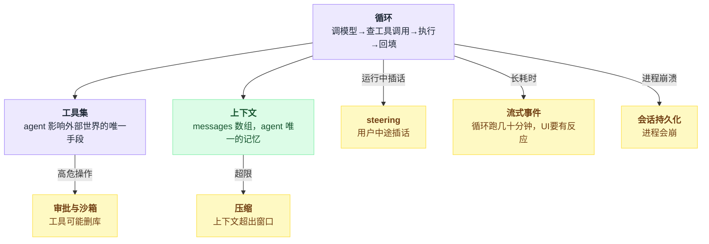

**架构分层，本质上就是回答：这些补丁分别贴在哪一层，谁有权改那个 `messages` 数组。**

## 1. 为什么这件事很难

### 1.1 上下文是唯一的全局可变状态，但所有人都想改它

`messages` 数组是整个系统的心脏。压缩要改它，注入项目说明（AGENTS.md）要改它，注入当前时间/git 状态要改它，隐私脱敏要改它，人工审批被拒绝后要往里塞一条「用户拒绝了」，工具结果太长要截断……

如果不设边界，每个功能都直接 `messages.push()`，你会得到一个谁也说不清最终发给模型的是什么的系统。而这直接决定了 KV cache 命中率——历史被中途改写一次，缓存全废，成本翻倍。Codex 的代码评审规则把这条写死成硬性条款（`AGENTS.md:95`）：「No history rewrite - the context must be built up incrementally.」

画出来就是一个多写家共抢一个写入口的形状：

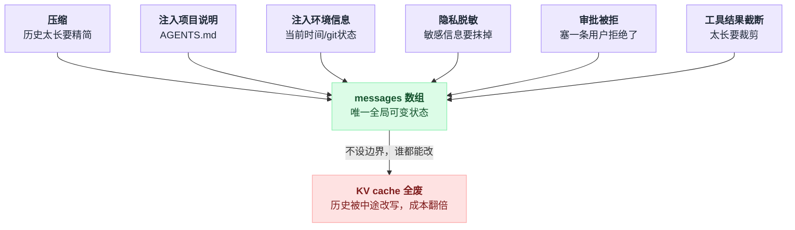

### 1.2 循环的控制反转

谁决定「再转一圈」？看起来是模型（有没有 tool_calls），但实际上有一堆人想插一脚：用户按了 Ctrl+C；用户在循环中途输入了新消息（steering）；上下文快满了，应该先压缩再继续；某个工具声明「我执行完就该收工了」；模型连续调了 50 次工具，该熔断了。

如果这些判断全塞进 while 循环体，循环会变成一个几百行的、谁都不敢碰的函数。如果抽成回调，回调之间的执行顺序和优先级又变成新的复杂度。

普通函数调用里，谁调用、谁决定停止是同一个人；控制反转之后，决定权分散到了循环外的一堆信号源手里：

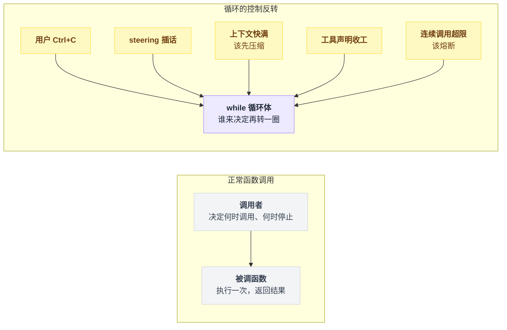

### 1.3 UI 和引擎的耦合方向

agent 跑一次可能几十秒到几十分钟。用户必须能实时看到「模型正在说什么」「正在执行哪个命令」。这意味着引擎必须持续往外吐事件流。

问题是：事件流的形状一旦被某个 UI 定死，就再也换不了 UI 了。反过来，如果为了通用性把事件设计得极度抽象，UI 层又得写一堆猜测逻辑。

### 1.4 可扩展性 vs 内核可演进性

用户想加自定义工具、换模型 provider、改 UI 渲染。你开放的扩展点越多，用户能做的事越多——但每个扩展点都是一条你以后不能随便改的公开契约。开放太多，内核就被钉死了。

这条张力上，三个项目做出了完全不同的选择，而且都不是「更好」，只是取舍不同。

---

## 2. Pi 的做法

### 2.1 一句话概括

**同心圆式的 npm 包分层**：从内到外依次是「LLM 协议适配 → agent 循环 → 编码 agent 产品」，越往外越有主张（opinionated）；产品层刻意做薄，把绝大多数功能推给进程内加载的 TypeScript 扩展。

### 2.2 机制拆解

Pi 是一个 npm workspace，10 个包。它没有单独写依赖图文档，但 `package.json` 里的 build 脚本是串行的 `cd && npm run build`，**这个顺序本身就是拓扑排序后的依赖分层**。

从 `package.json` 的构建顺序和各包 `dependencies` 交叉验证，得到这张图：

```
第 0 层（零内部依赖）：  tui        telemetry
第 1 层：                ai        （→ telemetry）
第 2 层：                agent     （→ ai, telemetry）   ← agent 循环在这里
第 3 层：                session-backends/sqlite-node（→ ai, agent）
第 4 层：                protocol  （零内部依赖，但排在这里）
第 5 层：                client    （→ protocol）
                        server    （→ ai, protocol）
第 6 层：                coding-agent（→ agent, ai, client, protocol, tui）← 产品在这里
```

换成依赖箭头看会更直观——谁指向谁、哪层是纯底座、哪层是产品出口：

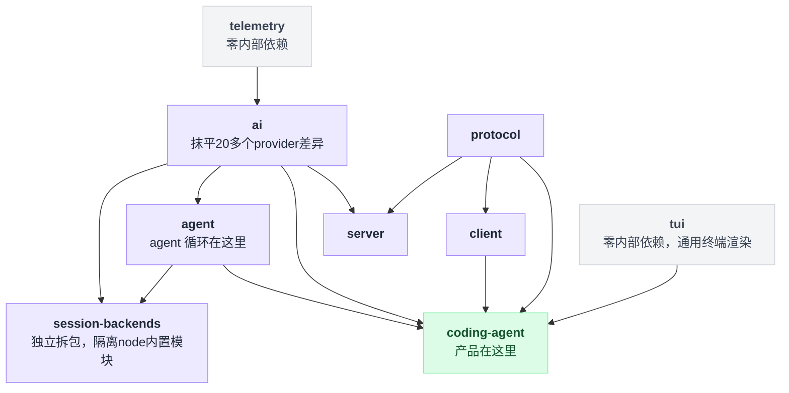

几个值得注意的边界决策：

**`tui` 不依赖任何内部包。** 它是一个通用的终端差分渲染库，对 agent 一无所知。这意味着 UI 层和引擎层是彻底解耦的——不是靠协议解耦，是靠「UI 库压根不知道 agent 存在」解耦。

**`ai` 层只管一件事：把 20 多个 provider 的 API 差异抹平成一个统一的流式接口。** 它甚至有自己的 CLI（`bin: {"pi-ai": "dist/cli.js"}`），可以独立使用。agent 层拿到的是 `Model` 和 `streamFn`，完全不知道背后是 Anthropic 还是 Bedrock。

**`agent` 层提供三个抽象层次**，从低到高：
- `agentLoop(prompts, context, config, signal, streamFn)`——纯粹的循环，无状态，事件流出。
- `Agent` 类——包了状态和订阅，`agent.prompt("hello")`。
- `AgentHarness`（`packages/agent/src/harness/`）——加上会话树、压缩、skills、prompt 模板、telemetry，约 9800 行。

**`session-backends` 被拆成独立包**，README 明说了理由（`packages/agent/README.md:13`）：「so the core package does not pull in runtime builtins or native SQLite dependencies by default」。核心包要能在浏览器里跑，所以任何碰 `node:` 内置模块的东西都得踢出去。monorepo 的 `check:browser-smoke` 脚本就是在守这条线。

### 2.3 源码

`package.json:16`（构建顺序 = 依赖分层，为可读性折行）：

```json
"build": "cd packages/tui && npm run build
       && cd ../telemetry && npm run build
       && cd ../ai && npm run build
       && cd ../agent && npm run build
       && cd ../session-backends/sqlite-node && npm run build
       && cd ../../protocol && npm run build
       && cd ../client && npm run build
       && cd ../server && npm run build
       && cd ../coding-agent && npm run build"
```

这是最朴素的做法——没有 nx、没有 turborepo，就是一串 `cd`。代价是加包要手动改这行；好处是依赖顺序对读代码的人一目了然，且不可能有隐藏的循环依赖（有的话 build 直接挂）。

再看循环本身。`packages/agent/src/agent-loop.ts:169`：

```typescript
// Outer loop: continues when queued follow-up messages arrive after agent would stop
while (true) {
    let hasMoreToolCalls = true;

    // Inner loop: process tool calls and steering messages
    while (hasMoreToolCalls || pendingMessages.length > 0) {
        if (!firstTurn) {
            await emit({ type: "turn_start" });
        } else {
            firstTurn = false;
        }

        // Process pending messages (inject before next assistant response)
        if (pendingMessages.length > 0) {
            for (const message of pendingMessages) {
                await emit({ type: "message_start", message });
                await emit({ type: "message_end", message });
                currentContext.messages.push(message);
                newMessages.push(message);
            }
            pendingMessages = [];
        }

        // Stream assistant response
        const message = await streamAssistantResponse(currentContext, config, signal, emit, streamFunction);
        newMessages.push(message);
        // ...
        const toolCalls = message.content.filter((c) => c.type === "toolCall");
        // ...
    }
}
```

逐段看：

- **双层循环**是对 §1.2 那个「谁决定再转一圈」问题的直接回答。内层管「模型还想调工具」和「用户插话了」；外层管「agent 已经想停了，但队列里还有后续消息」。两个语义被分开，而不是塞进一个复杂的布尔表达式。
- **`pendingMessages` 在调模型之前注入**，不是打断当前 turn。这是 steering 的实现方式：用户在 agent 干活时敲的字，会在下一次 LLM 调用前作为一条新的 user message 插进去。
- **循环体内没有任何策略判断**。压缩、熔断、模型切换全都不在这里——它们通过 config 上的回调注入。

两层循环加一个注入点，是这段代码的全部结构：

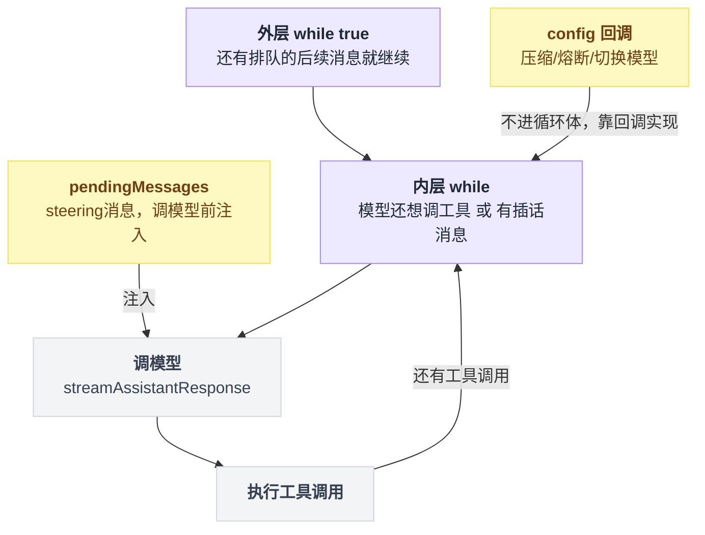

那些回调就是 Pi 划出的「循环可替换边界」，`packages/agent/src/types.ts:144` 的 `AgentLoopConfig`（节选，注释已删减）：

```typescript
export interface AgentLoopConfig extends SimpleStreamOptions {
    model: Model<any>;
    /** Converts AgentMessage[] to LLM-compatible Message[] before each LLM call. */
    convertToLlm: (messages: AgentMessage[]) => Message[] | Promise<Message[]>;
    /** Optional transform applied to the context before `convertToLlm`. */
    transformContext?: (messages: AgentMessage[], signal?: AbortSignal) => Promise<AgentMessage[]>;
    getApiKey?: (provider: string) => Promise<string | undefined> | string | undefined;
    shouldStopAfterTurn?: (context: ShouldStopAfterTurnContext) => boolean | Promise<boolean>;
    prepareNextTurn?: (context: PrepareNextTurnContext) => AgentLoopTurnUpdate | undefined | Promise<...>;
    getSteeringMessages?: () => Promise<AgentMessage[]>;
    getFollowUpMessages?: () => Promise<AgentMessage[]>;
    toolExecution?: ToolExecutionMode;
    beforeToolCall?: (context: BeforeToolCallContext, signal?: AbortSignal) => Promise<BeforeToolCallResult | undefined>;
    afterToolCall?: (context: AfterToolCallContext, signal?: AbortSignal) => Promise<AfterToolCallResult | undefined>;
}
```

注意 `convertToLlm` 是**必填**的。Pi 在 `AgentMessage`（应用层消息，可以是 UI 通知、自定义类型）和 `Message`（LLM 认识的三种角色）之间划了一道强制转换边界。README 里这样画（`packages/agent/README.md:57`）：

```
AgentMessage[] → transformContext() → AgentMessage[] → convertToLlm() → Message[] → LLM
                    (optional)                           (required)
```

这个设计的价值在于：**上下文里可以塞任何东西，但发给模型的是什么，永远由一个具名函数决定**。§1.1 那个「谁都能改 messages」的问题，Pi 是靠「随便改，但出口只有一个」来解的。

另外，注意这些回调的契约注释反复出现同一句话：「must not throw or reject」。循环本身不做错误恢复，它把「不许炸」的责任推给回调实现者。

### 2.4 代价与适用边界

**代价一：进程内扩展 = 零隔离。** Pi 的扩展是直接 `import` 进来的 TypeScript 模块。docs 里的警告写得很直白（`docs/packages.md:20`）：「Pi packages run with full system access. Extensions execute arbitrary code」。仓库根 README 也承认：「Pi does not include a built-in permission system for restricting filesystem, process, network, or credential access.」解法是把整个进程扔进容器。这是个自洽的选择——但它意味着 Pi 的安全边界在进程之外，harness 内部不设防。

**代价二：扩展 API 面积极大。** `packages/coding-agent/docs/extensions.md` 有 2987 行，光 `pi.*` 方法就 20 多个，事件类型 33 个（从 `project_trust` 到 `before_provider_headers` 到 `session_before_compact`）。这些全是公开契约。Pi 在 Philosophy 里明确用「不做」换「小内核」：

> **No MCP.** … **No sub-agents.** … **No permission popups.** … **No plan mode.** … **No built-in to-dos.** They confuse models. … **No background bash.** Use tmux.

这套「不做清单」是本章最值得注意的架构声明之一：它把功能边界（内核不做 X）转化为扩展点密度（内核必须开放足够多的钩子让你自己做 X）。省下来的复杂度并没有消失，只是从内核转移到了 API 契约上。

**代价三：包边界靠人守。** 10 个包、串行 build 脚本、`check:ts-imports` / `check:browser-smoke` 之类的自检脚本——都是约定，不是强制。Rust 那种「跨 crate 只能用 `pub` 项」的编译期强制在这里不存在。

---

## 3. Codex 的做法

### 3.1 一句话概括

**一个引擎，多个形态**：`codex-core` 是唯一的 agent 引擎，通过一条提交/事件队列协议（SQ/EQ）对外暴露；TUI、非交互 exec、MCP server、IDE 扩展全都是这条协议的客户端，而不是 core 的调用者。整个 workspace 拆成 **130 个 crate** 来强制边界。

### 3.2 机制拆解

`codex-rs/Cargo.toml` 的 `members` 列表有 130 项。这不是过度工程的产物，而是一条明确的架构纪律的结果。`AGENTS.md:72` 有一整节专门讲这件事：

> Over time, the `codex-core` crate … has become bloated because it is the largest crate, so it is often easier to add something new to `codex-core` rather than refactor out the library code you need…
>
> To that end: **resist adding code to codex-core**!
>
> - There is an existing crate other than `codex-core` that is an appropriate place for your new code to live.
> - It is time to introduce a new crate to the Cargo workspace for your new functionality. Refactor existing code as necessary to make this happen.
>
> Likewise, when reviewing code, do not hesitate to push back on PRs that would unnecessarily add code to `codex-core`.

**「新增功能默认应该是一个新 crate」是 Codex 最核心的架构约束。** 130 这个数字是这条约束跑了两年的结果。同一份文件里还配了两条辅助规则：Rust 模块目标 500 行以内、超 800 行就必须新开模块（`AGENTS.md:49`）；单次改动不超过 800 行（`AGENTS.md:125`）。

即便如此，`codex-core` 仍有 107 个直接依赖、`src/` 下 5 万多行代码。这条纪律是在跟熵赛跑，不是已经赢了。

**协议边界。** `codex-rs/docs/protocol_v1.md` 定义了整套词汇：

- `Codex`——核心引擎，「Runs locally, either in a background thread or separate process」，通过 SQ（Submission Queue）/ EQ（Event Queue）通信。
- `Session`——引擎的配置和状态。
- `Task`——响应一次用户输入的整段工作，一个 Session 同时只能跑一个 Task。
- `Turn`——Task 里的一次迭代：请求模型 → 收 SSE → 执行命令/补丁 → 输出。

文档里这句话是整个架构的立足点：

> The term "UI" is used to refer to the application driving `Codex`. This may be the CLI / TUI chat-like interface that users operate, or it may be a GUI interface like a VSCode extension. **The UI is external to `Codex`, as `Codex` is intended to be operated by arbitrary UI implementations.**

关于传输层：

> Can operate over any transport that supports bi-directional streaming. - cross-thread channels - IPC channels - stdin/stdout - TCP - HTTP2 - gRPC

**这条边界是真的，不是文档上的漂亮话。** 我在源码里验证过：

| crate | 代码里 `codex_core::` 的引用数 | `codex_app_server_protocol::` 的引用数 |
|---|---|---|
| `tui` | **0** | 1263 |
| `exec` | 25 | 122 |
| `app-server` | 148 | 806 |
| `mcp-server` | 25 | 0 |

TUI（Codex 最主要的用户界面，100 个依赖、大量文件）**一次都没有直接引用引擎类型**。它全程只跟 app-server 协议类型打交道。`app-server` 是唯一的适配器：它把 `codex-core` 的内部 API 翻译成 JSON-RPC。

一个引擎、一条 SQ/EQ 队列，外面挂着任意多个外壳：

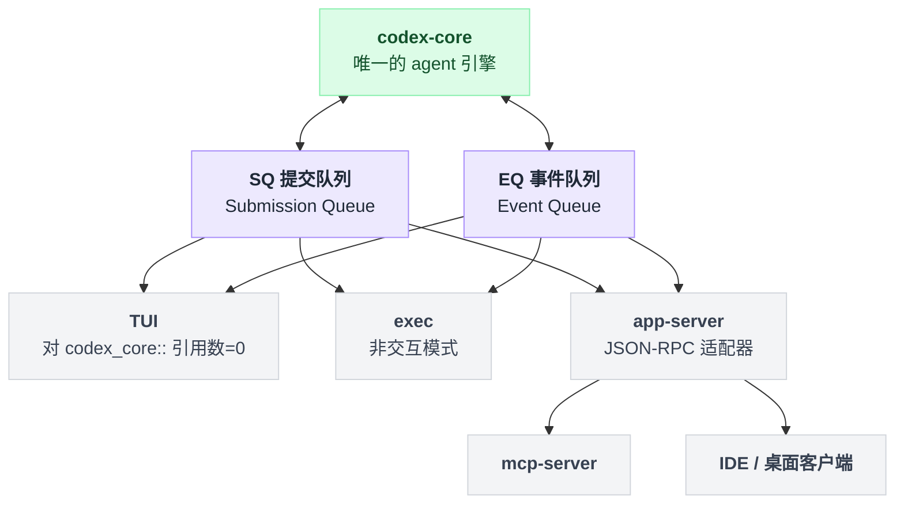

这解释了 `codex-cli` 为什么有那么长的子命令列表（`cli/src/main.rs:127`）：`exec`、`review`、`mcp-server`、`app-server`、`remote-control`、`app`（桌面应用）、`exec-server`、`cloud`……**它们是同一个引擎的不同外壳**，而不是不同的功能模块。

### 3.3 源码

`codex-rs/Cargo.toml:1`（130 个成员的开头一段，注意分组方式）：

```toml
[workspace]
members = [
    "aws-auth",
    "analytics",
    "agent-graph-store",
    "agent-identity",
    "backend-client",
    "bwrap",
    "ansi-escape",
    "async-utils",
    "app-server",
    "app-server-transport",
    "app-server-daemon",
    "app-server-client",
    "app-server-protocol",
    # ... 共 130 项
    "ext/agent",
    "ext/connectors",
    "ext/extension-api",
    "ext/goal",
    "ext/guardian",
    "ext/mcp",
    "ext/skills",
    # ...
    "utils/absolute-path",
    "utils/cache",
    "utils/pty",
    # ...
]
```

三个前缀构成了三个语义分区：`app-server-*` 是协议与传输，`ext/*` 是可插拔的功能扩展（agent 生成、连接器、guardian 审批、MCP、skills……），`utils/*` 是无业务语义的工具库。**`ext/` 这一组是 Codex 版本的「不做清单」的反面**——Pi 说「MCP 我不做，你自己写扩展」，Codex 说「MCP 我做，但它必须是 `ext/mcp` 这个独立 crate，不许进 core」。

三个前缀分区加上那条「新功能默认新开 crate」的纪律，就是 130 个 crate 长出来的骨架：

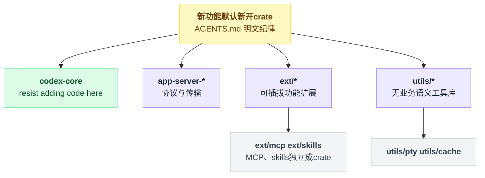

再看循环。Codex 的 turn 循环在 `codex-rs/core/src/tasks/regular.rs:73`：

```rust
let mut next_input = input;
let mut prewarmed_client_session = prewarmed_client_session;
loop {
    let last_agent_message = run_turn(
        Arc::clone(&sess),
        Arc::clone(&ctx),
        next_input,
        prewarmed_client_session.take(),
        cancellation_token.child_token(),
    )
    .instrument(run_turn_span.clone())
    .await?;
    if !sess.input_queue.has_pending_input(&sess.active_turn).await {
        return Ok(last_agent_message);
    }
    next_input = Vec::new();
}
```

这段和 Pi 的**外层** while 循环是同一个东西：「agent 想停了，但输入队列里还有排队的用户消息，继续」。工具调用的内层迭代在 `run_turn` 里面。差别在于 Codex 把它拆成了独立函数 + tracing span，而 Pi 是嵌套 while——两种都行，但 Codex 的形式让每个 turn 在 telemetry 里天然是一个可观测单元。

注意 `cancellation_token.child_token()`：中断是通过 Tokio 的取消令牌树传播的，而不是 Pi 那种传一个 `AbortSignal` 到处透传。这是 Rust 异步生态的惯用法，也让「Ctrl+C 停掉整个 task 树」变成一行代码。

`AGENTS.md:91` 的上下文规则，是 §1.1 那个问题的硬性答案：

```
### Model visible context

Codex maintains a context (history of messages) that is sent to the model in inference requests.

1. No history rewrite - the context must be built up incrementally.
2. Avoid frequent changes to context that cause cache misses.
3. No unbounded items - everything injected in the model context must have a bounded size and a hard cap.
4. No items larger than 10K tokens.
5. Highlight new individual items that can cross >1k tokens as P0. These need an additional manual review.
6. All injected fragments must be defined as structs in `core/context` and implement ContextualUserFragment trait
```

第 6 条是关键：**想往上下文里塞东西？必须先在 `core/context` 定义一个结构体并实现 `ContextualUserFragment`。** 这把「谁能改 messages」从一个约定变成了类型系统能检查的东西——你没法随手 push 一个字符串进去。第 3、4 条把「一定要有上限」写成了评审清单。

### 3.4 代价与适用边界

**代价一：130 个 crate 的编译和认知成本。** 全量 clippy 慢到 `AGENTS.md` 专门写「Prefer scoping with `-p` to avoid slow workspace-wide Clippy builds」，还得叮嘱「be patient with the command and never try to kill them using the PID」。要在这个 workspace 里加一个跨领域的功能，你得先想清楚它属于哪个 crate——这是实打实的前置认知负担。

**代价二：协议是内部产物，不是公开契约。** `protocol_v1.md` 自己打脸开头就说「NOTE: The code might not completely match this spec」，并且说明 `Op`/`EventMsg` 都是 `non_exhaustive` 的 Rust 枚举，「In the current codebase these are primarily in-process Rust types rather than a stable serde wire contract」。真正对外承诺的是 app-server v2 JSON-RPC——但 `AGENTS.md` 里关于它的规范细到了「Never use `#[serde(skip_serializing_if = "Option::is_none")]` for v2 API payload fields」这种程度，说明这层稳定性是靠大量人工纪律换来的。

**代价三：终端用户的扩展面极窄。** Codex 的 plugin 就是一份声明式清单（`plugin/src/manifest.rs:17`）：

```rust
pub struct PluginManifestPaths<Resource> {
    pub skills: Vec<Resource>,
    pub mcp_servers: Option<PluginManifestMcpServers<Resource>>,
    pub apps: Option<Resource>,
    pub hooks: Option<PluginManifestHooks<Resource>>,
}
```

只有四类资源：skills（markdown 提示）、MCP servers（子进程）、apps、hooks（外部命令）。**没有任何「加载用户代码进本进程」的入口。** 而 hooks 这一类实际上是两套并存的机制：主力是 `hooks.json` 驱动的 **11 个生命周期事件**（`hooks/src/lib.rs:19` 的 `HOOK_EVENT_NAMES`、`protocol/src/protocol.rs:1502` 的 `HookEventName`，由 `ClaudeHooksEngine` 分发，feature `CodexHooks` 为 `Stage::Stable` 且 `default_enabled: true`，详见第 06 章）；另有 1 个 legacy `notify` 桥接事件，就是 `hooks/src/types.rs:92` 里这个只有单变体的枚举：

```rust
#[derive(Debug, Clone, Serialize)]
#[serde(tag = "event_type", rename_all = "snake_case")]
pub enum HookEvent {
    AfterAgent {
        #[serde(flatten)]
        event: HookEventAfterAgent,
    },
}
```

注意它只覆盖 `legacy_notify_argv` 这条旧路径（`hooks/src/registry.rs:66`、`:93`），不要拿它代表整个 hook 系统的表面积。把两套加起来，Codex 的用户可见拦截点是 11 个，Pi 是 33 个——**约 3 倍的差距，不是数量级差距**。真正的区别不在数量而在形态：Pi 的事件是进程内的 TS 回调，Codex 的事件是 JSON-over-stdio 的外部命令。**Codex 的可替换性给的是「换外壳」（换 UI、换传输、换前端形态），至于「换内件」，它给的是一条声明式、跨进程的窄通道。** `ext/*` 那些扩展 crate 才是给 Codex 团队自己用的编译期扩展点，普通用户碰不到。

---

## 4. LangChain v1 的做法

### 4.1 一句话概括

**这里根本没有 while 循环**。`create_agent()` 是一个编译器：它把 model、tools 和一串 middleware 编译成一张 **LangGraph 状态图**，由 LangGraph 的 Pregel 运行时按「计划-执行-更新」的批同步并行模型驱动。循环是图里的一条回边，不是代码里的 `while`。

这是和另外两个项目的**范式级差异**，不是风格差异。

### 4.2 机制拆解

先看依赖分层，`libs/langchain_v1/pyproject.toml:26`：

```toml
dependencies = [
    "langchain-core>=1.5.3,<2.0.0",
    "langgraph>=1.2.5,<1.3.0",
    "pydantic>=2.7.4,<3.0.0",
]
```

只有三个。分工是：

- **`langchain-core`**——抽象定义层。`BaseChatModel`、`BaseTool`、`BaseMessage`、`Runnable`。它不包含任何 provider 实现（那些在 `langchain-openai` 等可选 extra 里）。
- **`langgraph`**——运行时。状态图、Pregel 调度、checkpointer、channel。
- **`langchain`（v1 本体）**——只有 6 个子模块：`agents`、`chat_models`、`embeddings`、`messages`、`tools`、`rate_limiters`。核心逻辑几乎全在 `agents/factory.py` 这一个 2053 行的文件里。

**`create_agent` 做的事是编译，不是执行。** 它的返回类型说明了一切（`factory.py:833`）：

```python
) -> CompiledStateGraph[
    AgentState[ResponseT], ContextT, InputAgentState, OutputAgentState[ResponseT]
]:
```

返回的是一张编译好的图对象。你后续 `.invoke()` / `.stream()` 它，实际驱动执行的是 LangGraph 的 Pregel 引擎。

**Pregel 是什么。** `langgraph/pregel/main.py:454` 的类文档说得很清楚：

> Pregel combines **actors** and **channels** into a single application. **Actors** read data from channels and write data to channels. Pregel organizes the execution of the application into multiple steps, following the **Pregel Algorithm**/**Bulk Synchronous Parallel** model.
>
> Each step consists of three phases:
> - **Plan**: Determine which **actors** to execute in this step. …
> - **Execution**: Execute all selected **actors** in parallel, until all complete, or one fails, or a timeout is reached. During this phase, channel updates are invisible to actors until the next step.
> - **Update**: Update the channels with the values written by the **actors** in this step.
>
> Repeat until no **actors** are selected for execution, or a maximum number of steps is reached.

从输入到落地执行，链路是「编译一次、循环跑很多次」：

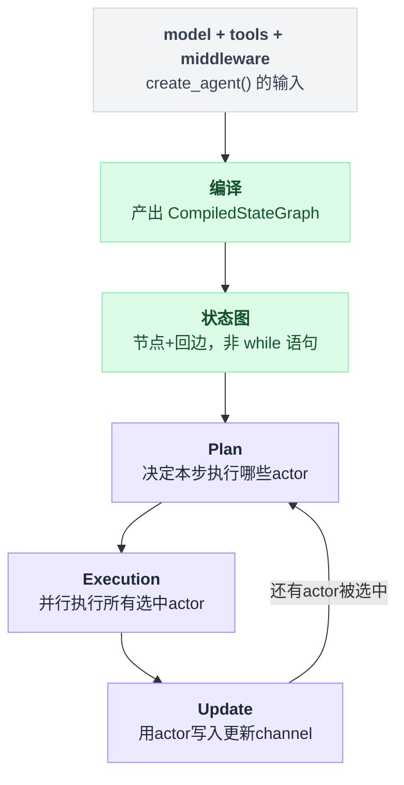

这是从 Google 那篇图计算论文（Pregel, 2010）借来的模型。「每一步内部，channel 的更新对 actor 不可见」这条隔离保证，意味着 agent 的每次状态转移是原子的、可快照的——这直接换来了 checkpointer（断点续跑）、time travel（回到任意历史状态重跑）、以及 human-in-the-loop 中断。

**Pi/Codex 的 while 循环拿不到这些**，因为它们的状态藏在栈帧和局部变量里，而 LangGraph 的状态全在 channel 里。

**middleware 怎么变成图节点。** 这是本章最值得看的一段。`AgentMiddleware` 定义了六个钩子（`middleware/types.py:383`）：`before_agent`、`before_model`、`after_model`、`after_agent`（状态转换型），以及 `wrap_model_call`、`wrap_tool_call`（包装型）。

两类钩子的编译方式完全不同：

- **状态转换型 → 变成独立的图节点**，节点名是 `f"{m.name}.before_model"` 这种。
- **包装型 → 不产生节点**，而是在 `model` / `tools` 节点内部层层包住实际调用（洋葱模型，类似 Express 中间件）。

### 4.3 源码

`factory.py:1167`，建图：

```python
    state_schemas: list[type] = [*(m.state_schema for m in middleware), base_state]

    resolved_state_schema, input_schema, output_schema = _resolve_schemas(state_schemas)

    # create graph, add nodes
    graph: StateGraph[
        AgentState[ResponseT], ContextT, InputAgentState, OutputAgentState[ResponseT]
    ] = StateGraph(
        state_schema=resolved_state_schema,
        input_schema=input_schema,
        output_schema=output_schema,
        context_schema=context_schema,
    )
```

注意第一行：**每个 middleware 可以声明自己的 `state_schema`，编译时把所有 middleware 的 schema 和基础 schema 合并**。这意味着 middleware 不只是拦截器，它还能往 agent 的共享状态里加字段——比如 `todo.py` 中间件往 state 里加一个 todo 列表，`model_call_limit.py` 加一个调用计数器。这是 Pi 的回调和 Codex 的 hook 都做不到的：那两者的钩子只能读写既有结构，不能扩展状态类型。

`factory.py:1516`，加节点：

```python
    # Use sync or async based on model capabilities
    graph.add_node("model", RunnableCallable(model_node, amodel_node, trace=False))

    # Only add tools node if we have tools
    if tool_node is not None:
        graph.add_node("tools", tool_node)

    # Add middleware nodes
    for m in middleware:
        if (
            m.__class__.before_agent is not AgentMiddleware.before_agent
            or m.__class__.abefore_agent is not AgentMiddleware.abefore_agent
        ):
            ...
            graph.add_node(
                f"{m.name}.before_agent", before_agent_node, input_schema=resolved_state_schema
            )
        if (
            m.__class__.before_model is not AgentMiddleware.before_model
            or m.__class__.abefore_model is not AgentMiddleware.abefore_model
        ):
            ...
            graph.add_node(
                f"{m.name}.before_model", before_node, input_schema=resolved_state_schema
            )
        # ... after_model / after_agent 同理
```

`m.__class__.before_agent is not AgentMiddleware.before_agent` 这个判断是在问：**这个 middleware 有没有真的重写这个钩子？** 没重写就不加节点。这是编译期优化——图里不会出现空转的 pass-through 节点。同时它也说明为什么 `AgentMiddleware` 是抽象基类而不是协议：需要拿基类方法做同一性比较。

`factory.py:1606`，连边——这段是整个编译过程的核心：

```python
    # Determine the entry node (runs once at start): before_agent -> before_model -> model
    if middleware_w_before_agent:
        entry_node = f"{middleware_w_before_agent[0].name}.before_agent"
    elif middleware_w_before_model:
        entry_node = f"{middleware_w_before_model[0].name}.before_model"
    else:
        entry_node = "model"

    # Determine the loop entry node (beginning of agent loop, excludes before_agent)
    # This is where tools will loop back to for the next iteration
    if middleware_w_before_model:
        loop_entry_node = f"{middleware_w_before_model[0].name}.before_model"
    else:
        loop_entry_node = "model"

    # Determine the loop exit node (end of each iteration, can run multiple times)
    loop_exit_node = (f"{middleware_w_after_model[0].name}.after_model"
                      if middleware_w_after_model else "model")

    # Determine the exit node (runs once at end): after_agent or END
    exit_node = (f"{middleware_w_after_agent[-1].name}.after_agent"
                 if middleware_w_after_agent else END)

    graph.add_edge(START, entry_node)
```

四个锚点节点：`entry_node`（整个 agent 跑一次）、`loop_entry_node`（每轮开头）、`loop_exit_node`（每轮结尾）、`exit_node`（整个 agent 结束）。**`before_agent` 和 `before_model` 的区别就是「循环外」和「循环内」——它是靠 `loop_entry_node` 跳过 `before_agent` 实现的**，不是靠运行时判断「这是第几轮」。

四个锚点摆到图里，「循环外只跑一次」和「循环内每轮都跑」的边界一眼可见：

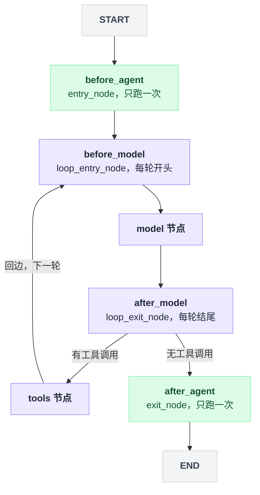

然后是那条回边（`factory.py:1646`）：

```python
        graph.add_conditional_edges(
            "tools",
            RunnableCallable(
                _make_tools_to_model_edge(
                    tool_node=tool_node,
                    model_destination=loop_entry_node,
                    structured_output_tools=structured_output_tools,
                    end_destination=exit_node,
                ),
                trace=False,
            ),
            tools_to_model_destinations,
        )
```

**`tools → loop_entry_node` 这条条件边，就是 §0 伪代码里那个 `while`。** 它不是控制流语句，是图里的一条有向边。第三个参数 `tools_to_model_destinations` 是「这条边可能通向哪些节点」的静态声明——LangGraph 需要它来做图校验和可视化。

middleware 还能主动跳转。`factory.py:2026`：

```python
        def jump_edge(state: dict[str, Any]) -> str:
            return (
                _resolve_jump(
                    state.get("jump_to"),
                    model_destination=model_destination,
                    end_destination=end_destination,
                )
                or default_destination
            )

        destinations = [default_destination]

        if "end" in can_jump_to:
            destinations.append(end_destination)
        if "tools" in can_jump_to:
            destinations.append("tools")
        if "model" in can_jump_to and name != model_destination:
            destinations.append(model_destination)

        graph.add_conditional_edges(name, RunnableCallable(jump_edge, trace=False), destinations)
```

middleware 在返回的 state 更新里写 `jump_to: "end"`，就能提前终止整个 agent。但**它能跳到哪里，是在编译期由 middleware 声明的 `can_jump_to` 静态决定的**——运行时想跳到一个没声明的目标，图里压根没有那条边。这是「受控的 goto」：灵活性有了，但可达性图仍然是静态可分析的。

最后 `factory.py:1804`：

```python
    return graph.compile(
        checkpointer=checkpointer,
        store=store,
        interrupt_before=interrupt_before,
        interrupt_after=interrupt_after,
        debug=debug,
        name=name,
        cache=cache,
        transformers=...,
    )
```

`interrupt_before` / `interrupt_after` 接的是**节点名列表**。你可以说「在 `tools` 节点前停下来等人确认」。人工审批在 Pi/Codex 里是引擎必须内建的一套请求-响应机制，在这里是运行时的一个通用能力——因为一切都是节点。

### 4.4 代价与适用边界

**代价一：调试的是图，不是调用栈。** 出了问题，异常栈里全是 `Pregel._loop` → `RunnableCallable.invoke` 这类框架帧，看不出「模型第几轮调用哪个工具时炸的」。这就是 LangSmith 这类追踪工具在 LangChain 生态里不是可选项而是必需品的原因（`factory.py:1795` 甚至硬编码了 `config["metadata"] = {"ls_integration": "langchain_create_agent"}`）。Pi 和 Codex 的栈是真栈，`await` 链条肉眼可读。

**代价二：middleware 顺序有隐含语义。** 看 `entry_node` 取 `middleware_w_before_agent[0]`（第一个）而 `exit_node` 取 `middleware_w_after_agent[-1]`（最后一个）——**before 类钩子按声明顺序正序执行，after 类逆序执行**。这是洋葱模型的正确语义，但它是从编译代码里推出来的，不是 API 上写着的。middleware 之间有状态依赖时，顺序错了很难查。

**代价三：这一层不管产品的事。** LangChain v1 没有 TUI、没有会话文件格式、没有沙箱、没有 provider 认证流程、没有 skill 加载。它给你 `create_agent()` 和一堆 middleware（`middleware/` 目录下有 summarization、pii、human_in_the_loop、shell_tool、todo、model_fallback、tool_selection 等 20 个模块），剩下的是你的活。**拿它跟 Pi/Codex 比「功能多少」是错的比法**——它是造 agent 的库，不是 agent。

**代价四：范式绑定。** 用了 `create_agent`，你就绑定了 LangGraph 的状态图模型、channel 语义、checkpointer 接口。这套抽象很强，但它不是可选的——你没法只要 middleware 不要 Pregel。

---

## 5. 三方横向对比

| 维度 | Pi | Codex | LangChain v1 |
|---|---|---|---|
| **循环形态** | 嵌套 `while(true)`，外层管跟进消息、内层管工具调用（`agent-loop.ts:170`） | `loop { run_turn(...) }`，工具迭代在 `run_turn` 内（`tasks/regular.rs:75`） | 无循环语句；`tools → model` 是图里的一条条件边（`factory.py:1646`） |
| **执行引擎** | 直接 async/await，栈即控制流 | Tokio task + CancellationToken 树 | LangGraph Pregel，BSP「计划-执行-更新」三阶段 |
| **模块单元** | 10 个 npm 包，build 脚本串行 `cd` 定义顺序 | 130 个 Cargo crate，分 `app-server-*` / `ext/*` / `utils/*` 三区 | 3 个 pip 包（core=抽象、langgraph=运行时、langchain=agent 工厂） |
| **边界强制手段** | 约定 + 自检脚本（`check:ts-imports`、`check:browser-smoke`） | Cargo 依赖图 + 评审规则（"resist adding code to codex-core"） | Python 包依赖 + 类型注解；无跨模块强制 |
| **UI 与引擎耦合** | `tui` 包对 agent 零依赖；`coding-agent` 同进程组装 | TUI 对 `codex_core::` 引用数 = **0**，全走 app-server 协议（1263 处） | 无 UI 层 |
| **上下文改写入口** | 任意 push `AgentMessage`，但出口只有必填的 `convertToLlm` | 必须实现 `ContextualUserFragment` 并定义在 `core/context`；禁止历史重写 | middleware 返回 state 更新，由 channel reducer 合并 |
| **上下文硬约束** | 无（靠 `transformContext` 自行处理） | 单项 ≤10K token、必须有上限、>1K token 需人工评审（`AGENTS.md:95`） | 无（`SummarizationMiddleware` 可选） |
| **用户可替换：模型 provider** | 可（内置 30+ 家；`pi.registerProvider()` 加自定义） | 部分（`model-provider-info` 配置驱动，非任意代码） | 可（任何 `BaseChatModel` 实现） |
| **用户可替换：工具集** | 可（`--tools`/`--exclude-tools` 增删内置；`pi.registerTool()` 加新的） | 部分（MCP server 加新工具；内置 shell/apply_patch 不可换） | 完全（`tools=[...]` 就是入参，没有内置工具） |
| **用户可替换：循环本身** | 库用户可（直接调 `agentLoop`）；CLI 用户不可 | 不可 | 可（改图 / 直接用 LangGraph 手写图） |
| **用户可替换：UI** | 可（extension 能替换编辑器、加 widget、状态栏、overlay） | 可（写任意 app-server 客户端就是新前端） | 不适用 |
| **用户扩展载入方式** | 进程内 `import` 任意 TS/JS——全权限 | 声明式清单：skills / MCP servers / apps / hooks，无进程内代码 | 进程内 Python 类（本来就是库） |
| **用户可见的钩子数量** | 33 个事件类型（`packages/coding-agent/docs/extensions.md`） | **11** 个 `hooks.json` 生命周期事件（`CodexHooks` 为 Stable 且默认开启），另有 1 个 legacy `notify` 桥接事件 `HookEvent::AfterAgent` | 6 个 middleware 钩子 + 任意图节点 |
| **中断/续跑** | `AbortSignal` 透传；会话文件持久化 | CancellationToken 树；rollout 文件持久化 | checkpointer + `interrupt_before/after`，可 time travel |
| **定位** | 成品 CLI + 可复用的库（三层都发 npm） | 成品引擎 + 多形态外壳（exec / tui / mcp-server / app-server / desktop / cloud） | 纯框架，无成品 |

表格里「循环形态」那一行并排画出来，三种形状的差异比文字更直观：

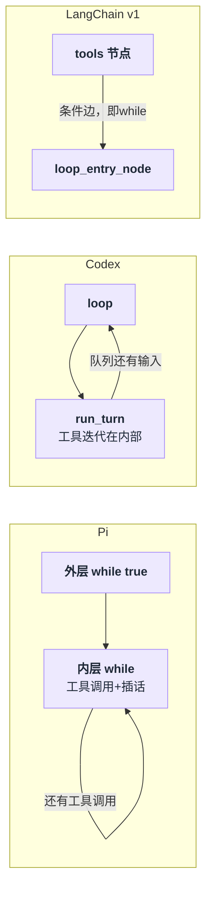

关于「框架 vs 产品」这条轴，有一个观察值得单独说：

**Pi 和 LangChain 都发布库，但库的位置不一样。** Pi 的 `pi-agent-core` 是从产品里切出来的一层（同一个 monorepo、同一个版本号 0.83.0、同步发版），它的 API 形状被 `pi-coding-agent` 的需求塑造。LangChain 的 `create_agent` 没有下游产品约束它，所以它可以更抽象——但也因此对「一个真实的编码 agent 需要什么」缺乏直接反馈。

**Codex 和 Pi 都是产品，但「产品」的边界不一样。** Pi 的产品边界是「一个 CLI 进程」；Codex 的产品边界是「一个引擎 + 一族外壳」。这解释了为什么 Codex 需要一条正式协议而 Pi 不需要——Pi 的 UI 和引擎在同一个进程同一个语言里，函数调用就够了。

---

## 6. 可以拿走的工程经验

**1. 把「什么发给模型」收敛到一个具名函数。**
Pi 的 `convertToLlm` 是必填的、唯一的出口；Codex 用 `ContextualUserFragment` trait 强制所有注入物先成为类型。做法不同，效果一样：你能指着一个地方说「模型看到的就是这里算出来的」。适用条件——只要你的上下文里有超过一种消息来源（用户输入 + 工具结果 + 系统注入），就该做这件事。反面案例是各处直接 `messages.push()`，那样上下文会变成没人能复现的黑盒。

**2. 把「本次循环还要不要继续」和「整件事还要不要继续」拆成两层循环。**
Pi（`agent-loop.ts:170` 的双层 while）和 Codex（`regular.rs:75` 的 `loop` 包 `run_turn`）独立收敛到了同一个形状。内层的退出条件是模型行为（还有没有 tool_calls），外层的退出条件是外部输入（队列里还有没有消息）。混在一起写会得到一个谁都不敢改的布尔表达式。

**3. 用「构建顺序」或「依赖图」把分层做成机器可验证的。**
Pi 的 build 脚本是串行 `cd`——朴素，但有循环依赖会直接 build 失败。Codex 用 Cargo 依赖图。**关键不是用什么工具，是让分层违规在 CI 里报错，而不是靠人在评审时发现。** 我在 Codex 里能验证「TUI 对 `codex_core::` 引用数为 0」，正是因为这条边界是编译期的；Pi 的同类边界（core 包不许碰 `node:` 内置模块）就得靠专门写的 `check:browser-smoke` 脚本守。

**4. 如果你打算长期演进，先想清楚「哪些扩展点是给用户的、哪些是给自己的」。**
Codex 把这条分得最干净：`ext/*` 那些 crate 是团队自己的编译期扩展点（可以随时重构），用户拿到的只有 skills / MCP / hooks 这几种声明式资源（几乎不会变）。Pi 走反方向，把 33 个事件全开放给用户——换来极强的可定制性，代价是这 33 个契约以后都动不了。**两条路都通，但混着走会死**：如果你的内部扩展点也是公开 API，你会失去重构自由。

**5. 「不做某个功能」是一个可以写进文档的架构决策，前提是你说清楚替代路径。**
Pi 的 Philosophy 一节把 No MCP / No sub-agents / No permission popups / No plan mode / No to-dos / No background bash 逐条列出，每条都给了替代方案（用 tmux、用 TODO.md、写扩展、跑容器）。这比默默不做有价值得多——它让用户知道这是决策不是遗漏，也让内核有理由保持小。适用条件：你得真的有替代路径，否则这就是甩锅。

**6. 上下文注入项要有硬性大小上限，而且写进评审清单。**
Codex 的六条规则里最实用的是第 3、4 条：「everything injected in the model context must have a bounded size and a hard cap」「No items larger than 10K tokens」。这类问题不会在测试里暴露（小仓库跑得好好的），只会在真实大项目上炸——所以它必须是评审规则，不是运行时检查。

---

## 7. 本章存疑

1. **Pi 的 `protocol` / `client` / `server` 三个包的确切用途未完全确认。** 从依赖关系看（`client → protocol`，`server → ai + protocol`，`coding-agent → client + protocol`），它像是 RPC 模式（`--mode rpc`）和远端 session 的支撑层，但 `packages/server` 到底是本地进程还是可部署服务，我没有读它的源码确认。⚠️ 未确认。

2. **Codex 的 `codex-core-api` crate 定位。** 它的文档注释写「Public facade for thread management APIs built on `codex-core`」，而且只有 16 个内部依赖、全是 `pub use` 重导出。它看起来是给 SDK（`/tmp/codex/sdk` 下有 python / typescript）用的稳定门面，但我没有确认 SDK 是否真的走这条路，还是走 app-server JSON-RPC。⚠️ 未确认。

3. **Codex `codex-exec` 同时引用 `codex_core::`（25 处）和 app-server 协议（122 处）的原因。** 与 TUI 的纯协议客户端形态不一致。可能是迁移中间态，也可能是非交互模式有意图省掉一层 IPC。⚠️ 未确认。

4. **LangChain v1 的 `wrap_model_call` / `wrap_tool_call` 具体如何组合成洋葱。** 本章确认了它们不产生图节点——`wrap_tool_call` 被 `_chain_async_tool_call_wrappers` 串成一条链后作为参数传给 `ToolNode`（`factory.py:1068`），`wrap_model_call` 则在 `model` 节点内部以 `awrap_model_call_handler(request, _execute_model_async)` 的形式调用（`factory.py:1510`）。但多个 middleware 的包装先后顺序、以及 `wrap_*` 与 `before/after_*` 混用时的相对次序，我只读到了编译入口，没有跟进 `_chain_*` 的实现。这部分留到 middleware 章节展开。

5. **Pi 的 `AgentHarness`（`packages/agent/src/harness/`，约 9800 行）与 `Agent` 类的职责划分。** 本章只确认了它是更高一层的抽象（含会话树、lane、压缩、skills），没有梳理 `AgentHarness` → `Agent` → `agentLoop` 三者的调用关系。⚠️ 未确认。

6. **【已更正】本章早期对 Codex hooks 表面积的估计偏低。** 初稿把 `hooks/src/types.rs:92` 的 `HookEvent::AfterAgent` 当成了 Codex hooks 的全部，据此写下「只有 1 个事件」「差距是两个数量级」。第 06 章的核实结果是：那个单变体枚举只是 legacy `notify` 命令的桥接 payload（`hooks/src/registry.rs:66`、`:93`），真正面向用户的是 `hooks.json` 驱动的 11 个生命周期事件（`HOOK_EVENT_NAMES`，`CodexHooks` feature 为 `Stage::Stable` + `default_enabled: true`）。3.3 节和第 6 节对照表已按此更正，对应的「数量级差距」结论也已改为「33 vs 11，约 3 倍」。同时更正的还有 Pi 的事件数（33，非 40+）和 `packages/coding-agent/docs/extensions.md` 的行数（2987，非 1700+）。

---

## 8. 第四个样本：Grok Build

> 调研时间 2026-08-06，`xai-org/grok-build` commit `a5589e9`；全项目背景与事故经过见 [17 番外](./17-番外-GrokBuild全项目速览.md)。本节只看分层维度。

**一句话**：Grok Build 在「TUI↔引擎」这条轴上落在 Pi 和 Codex 的正中间——**直接链接，但通信走进程内 ACP 消息**；协议不自研，外采 Zed 的 `agent-client-protocol`，并把它膨胀成了整个产品的内部 RPC 面。

### 8.1 规模：81 个 crate，TUI 比引擎大

81 个 workspace member、1,547,925 行 .rs（2,513 个文件，含测试；仅 `tests/` 目录就有 14.6 万行）。单 crate 排序是本节最反直觉的事实：**TUI（`xai-grok-pager`，48.6 万行）比 agent core（`xai-grok-shell`，37.6 万行）还大**。最大单文件是 `xai-grok-shell/src/agent/config.rs`，12,717 行。一个命名陷阱：`crates/codegen/` 下 64 个 crate 全是手写代码（占仓库 95% 行数），目录名由来仓内无解释（⚠️ 未确认，推测是 monorepo 路径残留）；真正入库的生成物只有 14 行的加密 prompt 字节文件。

### 8.2 分层：第三种形态

Codex 的铁律是 TUI 对 `codex_core::` 引用数为 0（本章 3.2 节）；Pi 是同进程直接调用。Grok Build 两者都不是：`xai-grok-pager/Cargo.toml:99` 直接依赖 `xai-grok-shell`，但 agent 跑在同进程**独立 OS 线程**上，TUI 经 `xai-acp-lib` 的内存 channel 与之收发 ACP 消息——`pager/src/acp/spawn.rs:1-4` 原话："Agent spawning — creates the agent process and ACP channels. Simplified to only support GrokShell (in-process) mode. Subprocess and remote modes can be added later if needed."

即：**协议形状的边界 + 直接链接**。消息格式上它随时可以把 agent 挪到子进程或远端（协议已经是 ACP），但编译期没有任何东西阻止 TUI import 引擎类型——Codex 用 crate 边界买到的「违规即编译错误」，Grok 没有买。

协议本体外采 Zed 的 `agent-client-protocol = "0.10.4"`（根 Cargo.toml:97，开着 `unstable` feature），`xai-acp-lib` 只是传输胶水。ACP 内外统一：进程内 TUI、`grok agent stdio` 的 IDE 嵌入、headless 全走同一套消息；`xai-grok-shell/src/extensions/` 下有 150+ 个 `x.ai/*` 扩展方法（fs/git/worktree/terminal/session/subagent/hooks/plugins…）——ACP 在这里已经从「编辑器协议」变成了整个产品的内部 RPC 面。这是对「自研协议 vs 外采协议」的一次真实投票：外采省掉了协议设计，代价是把大量产品语义塞进厂商前缀的扩展方法里。

### 8.3 一个引擎四种形态

入口全在 `xai-grok-shell/src/agent/app.rs`：TUI（进程内线程）、编辑器嵌入（`run_stdio_agent`，:277，注释明说服务对象包括 "grok-desktop, IDE clients, the agent SDKs, a parent agent's subagent harness"）、headless（`run_headless`，:409）、常驻 leader 服务（`run_leader`，:974，socket + WebSocket bridge 多客户端）。

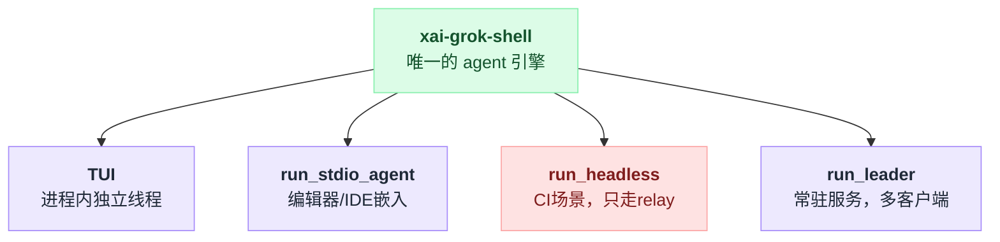

反直觉的一处：**headless 强制要求 grok.com 登录会话，唯一传输是 relay（WebSocket），没有本地 fallback**——app.rs:421-424 原话："Headless's only transport is the relay (no IPC fallback), so a session is required."，API-key 用户被指去 stdio 模式。CI 场景反而是绑云最深的形态，与 Codex 的 `codex exec`（纯本地可跑）形成对照。

### 8.4 「开源」的边界

与 Codex 同款只读镜像模式：仓库从内部 monorepo 周期同步，根目录 `SOURCE_REV` 记录 monorepo commit SHA；`CONTRIBUTING.md:3-4` 原话 "This repository does **not** accept external pull requests or unsolicited patches."，且明确不提供 CLA。两个本系列独有的姿态：发行二进制启用 obfstr/cryptify **编译期字符串+控制流混淆**（xai-grok-pager-bin/Cargo.toml:66-68 "Binary hardening"）；README.md:135-139 坦承 tool 实现移植自 openai/codex 和 sst/opencode（"in-tree source ports"）。

### 8.5 本节未确认

- `crates/codegen/` 目录名的真实由来。⚠️ 未确认。
- 81 个 member 未逐一排查（`xai-grok-announcements`、`xai-gix-status` 等外围 crate 未读），分层结论基于主干 crate。

---

## 9. 第五个样本：DeepSeek Harness

> 调研时间 2026-08-14，`deepseek-ai/deepseek-harness` v0.1.0-rc.5（commit `47f9438`）；全项目背景见 [18 番外](./18-番外-DeepSeekHarness全项目速览.md)。本节只看分层维度。

**一句话**：本章的主问题是「谁拥有那个 while 循环」，dsh 给的答案是**把这个问题从代码里删掉**——agent loop 不是一个模块也不是一个 crate，它是启动配置树里的**一行 YAML**（`packages/bundle/base/cordis.patch.yml:436`），可以被上层 patch 关掉或顶替。它在「模块单元」轴上比 Codex 更极端（219 个包 vs 130 个 crate），在「UI 与引擎耦合」轴上给出了四家都没有的形态：**同一个插件框架同时跑在 Node 侧和浏览器侧**。

### 9.1 Cordis 不是 DI 容器的比喻，是三个可读的原语

vendor 的 `@deepseek-ai/cordis` v4.0.1（`vendor/cordis/package.json`，作者仍是上游 Shigma，MIT）**全部只有 2,693 行**（`vendor/cordis/src/*.ts`，9 个文件）。整套「一切皆插件」压在三个东西上：

| 原语 | 实现 | 它解决本章的哪个问题 |
|---|---|---|
| `Context` | `context.ts:42`，构造函数里 `new Proxy(this, ReflectService.handler)`（`:74`）；`extend()`/`isolate()`/`intercept()` 全是**原型链上再套一层**（`:99`/`:121`/`:141`），从不改父 context | §1.4 的扩展点密度：每个插件拿到的是自己那层 ctx，改不到别人的 |
| `Service` | `service.ts:42`，`super(ctx, name)` 里直接 `ctx.reflect.provide(name, self, ...)`（`:57`）——**声明服务 = 构造实例**，没有注册表登记步骤 | 服务即 `ctx.<name>`，替换一个 provider 就换掉整条能力 |
| `Fiber.effect()` | `fiber.ts:418`，收集 disposer，**逆序**在 fiber 卸载时跑（`:431` `disposables.splice(0).reverse()`） | §1.4 的另一半：注册即 effect，插件卸载自动回滚，所以「热替换一个插件」是可行操作而不是重启 |

事件总线有 5 种派发模式（`vendor/cordis/src/events.ts:32`）：`'emit' | 'parallel' | 'serial' | 'bail' | 'waterfall'`。**`waterfall` 就是洋葱**，且是框架自带的。本章 §4 只把洋葱记在 LangChain middleware 名下（`:437`「类似 Express 中间件」），并未断言它独有；dsh 的差别在于洋葱是事件总线的一种派发模式——60 个总线事件里有 13 个是 waterfall（口径：`docs/event-producer-consumer.md` 生成表逐行统计，41 emit / 13 waterfall / 1 serial / 1 parallel / 4 未标注），包括 `llm/stream`、`agent/pre-step`、`agent/request-error`。

### 9.2 「一切皆插件」的可证伪版本：agent-loop 的运行期依赖者 = 1

`docs/architecture.md:11` 原话：

> Every part of the product is a plugin, including the model adapter, the tool registry, the session log, and the agent loop itself, so every part is replaceable from configuration.

这句话是口号还是事实，有一个和 Codex「TUI 对 `codex_core::` 引用数 = 0」同构的量化验法。dsh 的 `docs/module-graph.md` 说依赖图取自 **`peerDependencies`（"the canonical runtime-dependency signal"）**，我照这个口径把 219 个 `packages/*/*/package.json` 全数了一遍：

| peer 依赖者数量 | 包 | 性质 |
|---|---|---|
| **219 / 219** | `@deepseek-ai/cordis` | 框架 |
| 218 | `dsh-invariants` | 运行期不变量 |
| 80 / 78 / 58 / 43 | `dsh-session` / `dsh-llm` / `dsh-agent` / `dsh-tools` | **接口包** |
| **1** | **`dsh-agent-loop`** | **唯一的循环实现** |

那唯一的 1 是 `packages/examples/agent-spine-demo`。另有 24 个包在 `devDependencies` 里引它（只为测试），`packages/bundle/base` 在 `dependencies` 里引它（bundle 的职责就是安装插件）。**产品代码里没有任何一行运行期依赖具体循环。**

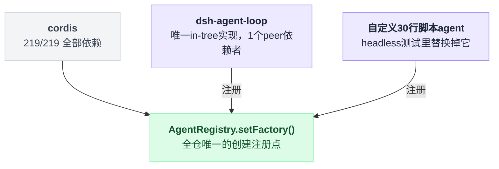

机制上闭环也验得掉：`AgentRegistry.setFactory()`（`packages/core/agent/src/index.ts:372`）是全仓唯一的 agent 创建注册点，且「已注册就抛」（`:374`）；`dsh-agent-loop` 自己也只是个普通调用方——`packages/core/agent-loop/src/index.ts:350`：

```ts
// packages/core/agent-loop/src/index.ts:350
ctx.effect(() => ctx.agents.setFactory(this), 'agentLoop.setFactory()')
```

`packages/bundle/headless/tests/headless.spec.ts:59` 就是这么把整个循环换成 30 行脚本 agent 的（`:59-91`）。**这是本系列四个样本里第一次出现「循环本身是可替换的运行期实体」**——Pi 的 `agentLoop` 是库函数（CLI 用户换不了）、Codex 的循环写死在 `codex-core`、LangChain 是编译成图（换的是图不是循环）。

### 9.3 产品是一份 78 行的 YAML

`dsh` 的可执行入口 `apps/cli/src/*.ts` 总共 **832 行**，它对自己的描述是（`apps/cli/src/args.ts:120`）："dsh: boot a DeepSeek Harness profile — an ordered stack of plugin-bundle patch layers under your own overrides."

组合是四层，顺序在 `apps/cli/src/dump-config.ts:32-49` 里逐行可读：**bundle 层（按 `dsh.profile.bundles` 顺序）→ profile 自己的 `cordis.patch.yml` → home 级 → `--patch` 覆盖层**，全部叠在一个空的 entry list 上。

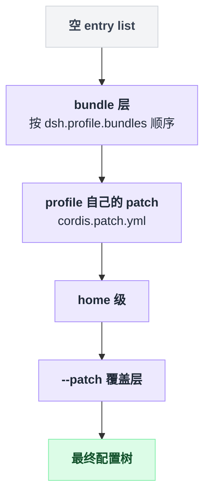

patch 语义在 `vendor/include/src/index.ts:58` 的 `applyEntryPatches()`：按 `id` 命中就**整体替换该行的 config**（不是深合并），带 `insert` 就追加新行。

数出来的规模：

| 层 | 文件 | 内容 |
|---|---|---|
| `dsh-base` | `packages/bundle/base/cordis.patch.yml` | 1 个顶层 `insert`，**78 行插件行** |
| `dsh-web-app` | 同上 | 27 个按 id 改写 + 2 个 insert 列表共 51 行 → web profile 共 **129 行** |
| `dsh-headless` | 同上 | 3 个改写 + 3 行插入 → headless 共 **81 行** |

`headless` 那 3 个改写里有一个特别能说明问题（`packages/bundle/headless/cordis.patch.yml:14`）：`- id: hmr` / `disabled: true`——关掉热重载不用改代码，改配置行。而 agent loop 那行（`packages/bundle/base/cordis.patch.yml:436`）长这样：

```yaml
- id: agent-loop
  name: '@deepseek-ai/dsh-agent-loop'
  config:
    agents: []
```

用户装第三方插件也是这条路：`dsh plugin --profile tui add <package>` 是个 pnpm 转发器（`apps/cli/src/plugin.ts:1-10`），装完按「装了什么」而非「依赖 diff」重新对账 `dsh.profile.bundles`——**任何声明了 `dsh.bundle` 的 npm 包都会自动成为一个 patch 层**。

### 9.4 host 面 vs client 面：dsh 版的「引用数 = 0」

本章 §3.2 的铁律是 TUI 对 `codex_core::` 引用数 0，靠 crate 边界买到「违规即编译错误」；§8.2 说 Grok 没买。dsh 买了，而且是两道：

**第一道在类型系统。** 仓库有两个互斥的 TS program：`tsconfig.host.json` 和 `tsconfig.client.json`，根 `tsconfig.json` 是空 solution，注释写死（`tsconfig.json:7`）："NEVER add include/files entries, and NEVER flatten this solution into a single ts.Program"。理由是 `tsconfig.host.json:2-4`：两侧都用 declaration merging 往同一个 cordis `Context` 上挂同名 key（`sessions`、`loader`，名字见 `tsconfig.client.json:3-5`），**"one program cannot see both"**——这不是纪律，是「合并了就编不过」。

**第二道在打包器。** `packages/client/tsdown.client.ts:215` 有个叫 `dsh-client-bundle-purity` 的 rollup 插件，对任何 `@deepseek-ai/` 的值导入做白名单，不在名单里直接 throw（`:221-224` 原话）：

> `client bundle purity: "${source}" is not a platform module (CLIENT_EXTERNALS), an inline-safe wire layer, or a generated /remote contribution — cross-plugin value imports are forbidden; collaborate through cordis services (type-only imports are erased and never reach this gate)`

放行的一共四条：`CLIENT_EXTERNALS` 平台模块（`:65`）、vendored 库（`:41`）、生成的 `/remote`（`:44`），以及最关键的 inline-safe 正则（`:33`）：`/^@deepseek-ai\/dsh-(host-apiproxy|session|llm|tools|brand)(\/|$)/`。我把 39 个 client 包的 `src/` 全量 grep 了一遍：跨出 client 组的**值导入只有 23 行**，全部落在 `dsh-host-apiproxy` 的 `/api`、`/client`、`dsh-llm` 的 `/brand`、`/message`、`dsh-session` 的 `/surface` 和 `dsh-settings` 这些无运行期身份的 wire 层；对 `dsh-agent-loop` 的引用数是 **0**，对 `dsh-agent` 的引用全是 `/types` 子路径（类型导入编译期即被擦除），`dsh-tools` 只多一处 `/presentation` 的类型导出。

**但真正反直觉的是第三点：浏览器里也跑 cordis。** `packages/client/web/src/platform.ts:8-9` 把 `@deepseek-ai/cordis` 列进浏览器的 `PLATFORM_MODULES`（和 react 并列），`packages/client/web/src/boot.tsx:134` 直接 `this.ctx = new Context()`，`:163` `await ctx.plugin(Loader)`。前端 39 个包里 114 处 `from '@deepseek-ai/cordis'`，UI 侧的运行期能力（插槽、会话、命令等 9 处）是 `extends Service` 的 cordis 服务，靠 `ctx.plugin()` 装配。

所以 dsh 在「UI 与引擎耦合」这条轴上是**第四种形态**（§8.2 把 Grok 记为第三种）：不是 Codex 的「UI 是协议客户端」，不是 Pi 的「同进程直接调」，不是 Grok 的「直接链接 + 进程内 ACP」——而是**两个独立的 cordis 应用各自持有自己的插件树，中间隔一条 HTTP/WS 线**（`dsh-host-apiproxy`）。同一套 `ctx.plugin` / `Service` / `effect` 心智模型两边通用，而两侧的类型世界被强制不可相交。

四家在这条轴上摆到一起，正好是耦合程度从紧到松的一条线：

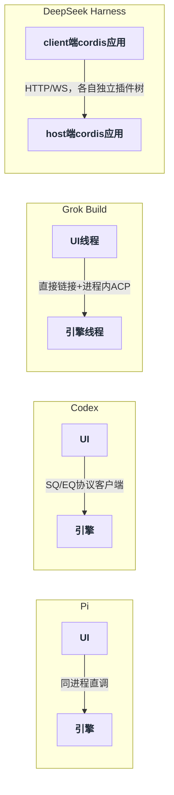

### 9.5 上下文改写入口：不是数组，是投影 + 运行期断言

本章 §1.1 的问题在 dsh 这里被换掉了前提：**没有 `messages` 数组可以 push**。循环每次请求都现场投影（`packages/core/agent-loop/src/agent.ts:341`）：

```ts
// packages/core/agent-loop/src/agent.ts:341
turn, step, assembly.tools, system, this.session.deriveMessages(), signal,
```

写入口是 append-only 的 session log（44 个持久事件类型、24 个命名空间，口径：`docs/persistence-catalog.md` 的 `#### ` 条目），其中**只有 3 个能进模型可见面**：`user/message`、`assistant/message`、`tool/result`（`packages/core/session/src/types.ts:343` `SurfaceEventType` 的三个成员，该文档里逐条带 `— surface` 徽章）。

比 Pi 的必填 `convertToLlm` 和 Codex 的 `ContextualUserFragment` trait 更进一步的是，dsh 把这条约束做成了**运行期断言**——而且断言本身是个插件（`packages/core/agent-loop/src/invariant.ts:39-42`）：

三家给同一个问题（谁能改 messages）的答案，是约束力依次加码的一条线：

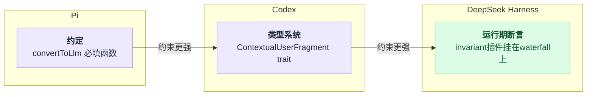

```ts
const expected = session.deriveMessages()
if (JSON.stringify(options.messages) !== JSON.stringify(expected)) {
  fail(`llm request for session "..." diverges from the dispatch-time durable derivation (log-reconstruction desync)`)
}
```

它挂在 `llm/stream` waterfall 上、`prepend: true`（`:54`，`:20` 注释说明是为了防止短路的 replay 监听器把检查静音掉）。**219 个包每一个都有 `src/invariant.ts`（219/219，实数）**，这是 `packages/AGENTS.md:18` 的硬条款："Every package owns `./invariant`"。

### 9.6 框架 vs 产品：它同时是两者，而且有证据

本章 §5 末尾把三家分成「成品 CLI + 库」「成品引擎 + 多外壳」「纯框架」。dsh 落在一个新格子上：

- **它是框架**：230 个 package.json（219 个 `packages/*/*` + 2 apps + 9 vendor）**全部 `publishConfig.access: public`，零 private 包**。连 cordis 本体都以 `@deepseek-ai/cordis` 重新发版。
- **它是产品**：`npx @deepseek-ai/dsh web` 起 Web UI（README:20-23）。
- **关键是它对二者关系的表态**（`CONTRIBUTING.md:19`，逐字）："We do not believe that packages in the official repository are inherently more important than packages created by the community. You may consider this repository an idea, an official showcase, and a source of inspiration, but not a mandate from us."

代码支持这个表态：产品 = 一份 bundle patch，社区插件和官方插件走**完全相同**的 `dsh.bundle` 声明入口，没有特权通道。代价也真实——`packages/core/*/src` 只有 13,462 行（其中 agent-loop 1,643 行），而 `packages/client/*/src` 有 71,896 行，占 `packages/*/*/src` 全部 227,203 行的 31.6%（口径：`.ts/.tsx/.vue`，不含 `tests/`、`vendor/`、`apps/`）。和 Grok「TUI 比引擎大」同款结论，但 dsh 的这条边界是机器守的。

一条本章可以直接吸收的经验，是 §6 第 3 条（把分层做成机器可验证的）的第三种做法：**Codex 用 crate 依赖图、Pi 用自检脚本，dsh 用「实现包的 peerDependencies 入度」**——想知道「这个东西是不是真的可替换」，数它的运行期依赖者就行，不用读一行代码。

### 9.7 本节未确认

- ⚠️ `dsh --profile web --dump-config` 未实际运行（需先 `pnpm install && pnpm run build`）。129 这个行数是我按 web profile 用到的两份 `cordis.patch.yml`（base + web-app）的 `- id:` 条目静态相加的，patch 之间若有同 id 覆盖，实际树可能少于此数。
- ⚠️ `docs/i18n/style-samples.md:9` 保存了一段**别处已不存在**的架构原文：它称 dsh 是 "the foundation of **DeepSeek Code**"（该产品名全仓只出现在这组中英对照里，即 `:9` 与 `:11`），并出自 "the microkernel design discussion"。`:13` 那条依赖规则——"extension plugins depend on interfaces, never on `dsh-agent-loop` (the loop is swappable); the sanctioned exception is the composition bundle `dsh-agent-spine-demo`"——我按 peerDependencies 逐包核对过，与代码完全一致（9.2）。但 "DeepSeek Code" 指什么、这段文本原属哪份文档，仓内无解释。
- ⚠️ `packages/host/apiproxy` 用 `dependencies`（而非全仓通行的 `peerDependencies`）引了 25 个 dsh 包，是 219 个包里 22 个例外之一。是有意（host 侧不共享实例）还是历史残留，未确认。
- ⚠️ 只读了 `packages/core/*`、`packages/bundle/*`、`packages/boot/*`、`packages/client/*` 与 vendor 全部；其余 45 个包组按生成文档（`module-graph.md`、`event-producer-consumer.md`、`persistence-catalog.md`）取数，未逐包核对源码。
