# 02 · Agent 循环

> **一句话导读**：agent loop 表面上是「调模型 → 跑工具 → 把结果塞回去 → 再调模型」的 while，真正的复杂度全在「什么时候退出」「谁能打断它」「错误算不算一次迭代」这三件事上；Pi 用嵌套 while + 回调钩子，Codex 用三层任务/回合/采样嵌套 + 取消令牌，LangChain v1 干脆不写循环——它把循环编译成一张图，交给 LangGraph 的 BSP 引擎执行。
>
> **本章涉及源码**
> - Pi：`packages/agent/src/agent-loop.ts`、`packages/agent/src/agent.ts`、`packages/agent/src/types.ts`、`packages/coding-agent/src/core/agent-session.ts`、`packages/agent/docs/harness-v2.md`
> - Codex：`codex-rs/core/src/tasks/regular.rs`、`codex-rs/core/src/session/turn.rs`、`codex-rs/core/src/session/input_queue.rs`、`codex-rs/core/src/responses_retry.rs`、`codex-rs/core/src/client.rs`、`codex-rs/docs/protocol_v1.md`
> - LangChain v1：`langchain/agents/factory.py`、`langchain/agents/middleware/model_retry.py`、`tool_retry.py`、`model_call_limit.py`、`langgraph/pregel/_loop.py`、`langgraph/pregel/main.py`

---

## 0. 先搞清楚：这是个什么东西

一次普通的 LLM API 调用是「一问一答」：你发一段文本，它回一段文本，交易结束。

而 agent 要的是「一问、若干次动手、再答」。做法其实很土：在请求里额外告诉模型「你可以调这几个函数」，模型于是可能不回答文本，而是回一个结构化的 `tool_call`——比如 `{"name":"read_file","arguments":{"path":"a.txt"}}`。

这个调用不会自己执行，模型只是把它「说」出来。真正去读文件的是你的程序。读完之后，你把文件内容作为一条 `tool_result` 消息追加到对话里，**再发一次完整的对话**给模型。模型看到结果，可能继续调工具，也可能直接给出最终答案。

把这个过程写成伪代码，就是 agent loop 的全部本质：

```
messages = [system_prompt, user_message]

while true:
    response = llm(messages, tools=my_tools)   # 一次采样
    messages.append(response)

    if response 里没有 tool_call:
        break                                   # 模型不想再动手了，收工

    for call in response.tool_calls:
        result = my_tools[call.name](call.args)  # 真正执行
        messages.append(tool_result(call.id, result))
```

有三个点容易忽略。

第一，每一轮都要把**完整历史**重新发一遍——LLM 无状态，所谓「对话」是客户端每次重放出来的假象。

第二，退出条件写在模型那一侧：模型不再调工具，循环才结束；程序自己是不知道任务做没做完的。

第三，工具执行完全由你的进程负责，模型只是提出请求，所以权限、超时、沙箱都是你的问题。

这十几行伪代码能跑通一个玩具 agent。本章讲的是：从这十几行到能上生产，中间被迫加进去的那几千行都在解决什么。

## 1. 为什么这件事很难

**难点一：停不下来 / 停太早。** 上面的伪代码只有一个退出条件。真实系统至少还要处理这四种：

| 情况 | 得怎么办 |
|---|---|
| token 预算耗尽 | 上下文塞满了，得先压缩再继续，不能直接崩 |
| 迭代次数超限 | 模型陷入「读文件—读文件—读文件」的死循环，得有个熔断 |
| 输出被 `max_tokens` 截断 | 这时 tool_call 的 JSON 参数可能只写了一半，执行它是危险的 |
| 工具说「任务已完成」 | 比如一个 `submit_answer` 工具，明确表示别再问模型了 |

每多一个退出条件，`break` 的位置就多一个，而不同 `break` 的清理逻辑还不一样。

**难点二：错误算不算一次迭代。** 网络断了、provider 返回 503、WebSocket 掉线——这些不是「模型的回答」，重试它们不应该污染对话历史，也不该消耗迭代预算。

但错误发生的位置差别很大：连接建立时失败可以直接重发；流已经吐了一半才断，你手里有个半截的 assistant 消息，是丢弃重来还是接着拼？

工具执行失败又是另一回事——那通常**不该重试**，而该把错误文本当成 tool_result 喂回模型，让模型自己决定换个方式。同样是「出错」，一类要对用户和模型都不可见，另一类必须对模型可见。

**难点三：用户在模型跑的时候插话。** 终端用户看着 agent 跑偏了，想说一句「不对，先看 config.ts」。这时候有三种处理：

| 方案 | 做法 | 代价 |
|---|---|---|
| (a) 打断 | 打断当前请求、丢弃、重开一轮 | 响应最快但浪费 token，且历史会留下半截消息 |
| (b) 排队 | 等当前这一轮（模型回复 + 工具执行）完全结束后再注入 | 实现最干净，但用户要等 |
| (c) 流式抢占 | 模型还在吐字时就把新消息推进去 | 需要 provider 支持，几乎没人做 |

选 (b) 还要再决定：一次注入队列里全部消息，还是一次只放一条？以及「模型已经停了才发来的消息」和「模型正忙时发来的消息」要不要走同一条路径？

**难点四：并行工具 vs 流式输出的交织。** 模型一次可以返回多个 tool_call。串行执行简单且行为可预测，但三个独立的文件读取白白串成三倍延迟。

并行执行则带来一串新问题：结果消息的顺序必须和 tool_call 的顺序对齐（否则 provider 会拒绝），但事件流给 UI 的顺序按完成先后才自然；写文件类工具并行跑会互相踩；用户按 Ctrl-C 时已经在跑的工具怎么收尾。

更激进一点：模型的 tool_call 是流式吐出来的，第一个 tool_call 完整到达时，后面的文本还没传完——要不要**立刻**开始执行第一个工具，让工具执行和网络传输重叠？这能省掉可观的延迟，但让「一轮」的边界变得模糊。

下面看三家怎么在这四个维度上取舍。

---

## 2. Pi 的做法

### 2.1 一句话概括

一个 792 行的纯函数式循环文件，核心是**双层 while**（内层跑 turn，外层等 follow-up），退出点和注入点全部以回调钩子的形式开放给上层；重试**不在循环里**，而是靠一个专门的 `agentLoopContinue()` 入口，由应用层驱动。

### 2.2 机制拆解

**两个入口，一个循环体。** `agentLoop(prompts, ...)` 用于「带着新消息开始」，`agentLoopContinue(context, ...)` 用于「不加新消息、直接从当前历史继续」，两者最终都调用同一个 `runLoop()`。

`agentLoopContinue` 存在的唯一理由就是重试和恢复：出错后应用层把失败的 assistant 消息从历史里摘掉，然后 `continue()`，循环就会拿着「最后一条是 user 或 toolResult」的历史重新发一次请求。这个前置条件是硬校验的，因为 provider 不接受以 assistant 结尾的请求（`agent-loop.ts:74`）。

**双层循环的分工。** 先看形状：

```
pendingMessages = steer 队列.排空()                    // 进循环前先查一次

while true:                                            // 外层：只在「agent 本来要停了」时才转
    hasMoreToolCalls = true
    while hasMoreToolCalls or pendingMessages 非空:    // 内层：一轮接一轮跑 turn
        把 pendingMessages 注入历史
        message = 采样一次
        执行 message 里的 toolCalls
        pendingMessages = steer 队列.排空()            // 每个 turn 结束都查一次

    followUp = followUp 队列.排空()                    // 只有要停了才查这条队列
    if followUp 为空: break
    pendingMessages = followUp
```

内层 `while (hasMoreToolCalls || pendingMessages.length > 0)` 负责一轮接一轮地跑 turn；外层 `while (true)` 只在内层跑完之后做一件事：问 `getFollowUpMessages()` 还有没有排队的消息，有就塞回 `pendingMessages` 继续内层。

这对应两条独立队列——`steer()` 队列在**每个 turn 结束后**被排空并注入下一次请求，`followUp()` 队列只在**agent 本来要停了**的时候才被查看。两条队列各有 `"all"` / `"one-at-a-time"` 两种排空模式。出处：`agent.ts:283-290`（两条队列的查看时机）、`agent.ts:141-154`（排空模式）。

**三种停止方式。** 除了「模型没返回 tool_call」这个默认出口，还有三个：

| 出口 | 触发条件 | 典型用途 |
|---|---|---|
| `shouldStopAfterTurn` 回调 | 返回 true | 「上下文快满了，本轮结束后先去压缩」这类优雅停机 |
| 整批 `terminate: true` | 这一批**全部**工具都标了 terminate 才真的停 | `shouldTerminateToolBatch`（`agent-loop.ts:582`） |
| `stopReason` | 为 `"error"` 或 `"aborted"` | 直接返回 |

**截断消息的特殊处理。** 如果 `stopReason === "length"`，说明输出被 token 上限砍断，这时流式解析器会用「尽力挽救」的 JSON 解析器把半截参数补全成一个能通过 schema 校验的对象——于是你会得到一个**看起来合法但静默残缺**的 tool_call。

Pi 的选择是：整批全部不执行，每个都返回一条错误 tool_result，让模型重发（`failToolCallsFromTruncatedMessage`）。

**两步上下文转换。** `AgentMessage` 是 `Message`（LLM 认识的三种角色）的**超集**，应用可以通过 TypeScript 声明合并往里加自定义消息类型（`types.ts:310-319`）。

每次请求前先跑可选的 `transformContext()`（`AgentMessage[] → AgentMessage[]`，用于压缩/剪枝），再跑必需的 `convertToLlm()`（`AgentMessage[] → Message[]`，用于过滤掉纯 UI 消息）。这让「会话里有 UI 专属消息」和「发给模型的必须干净」两个需求解耦。

**事件流。** 一次 `prompt()` 的事件序列是严格嵌套的：`agent_start` → (`turn_start` → `message_start`/`message_update`*/`message_end` → `tool_execution_start`/`update`*/`end` → `message_start`/`end`(toolResult) → `turn_end`)* → `agent_end`。

`message_update` 只对 assistant 消息发出，且携带原始的 `assistantMessageEvent`（text_delta / thinking_delta / toolcall_delta），所以 UI 既能拿到增量 token 也能拿到当前完整快照。

把上面这几段机制拼起来，双层循环加三种停止方式长这样：

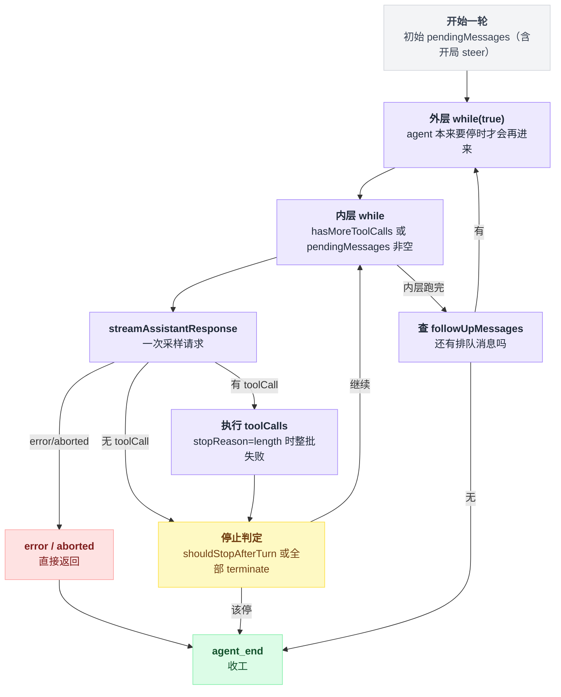

### 2.3 源码

主循环全貌，注意内外两层的边界：

`packages/agent/src/agent-loop.ts:163`

```typescript
	let currentContext = initialContext;
	let config = initialConfig;
	let firstTurn = true;
	// Check for steering messages at start (user may have typed while waiting)
	let pendingMessages: AgentMessage[] = (await config.getSteeringMessages?.()) || [];

	// Outer loop: continues when queued follow-up messages arrive after agent would stop
	while (true) {
		let hasMoreToolCalls = true;

		// Inner loop: process tool calls and steering messages
		while (hasMoreToolCalls || pendingMessages.length > 0) {
			if (!firstTurn) {
				await emit({ type: "turn_start" });
			} else {
				firstTurn = false;
			}

			// Process pending messages (inject before next assistant response)
			if (pendingMessages.length > 0) {
				for (const message of pendingMessages) {
					await emit({ type: "message_start", message });
					await emit({ type: "message_end", message });
					currentContext.messages.push(message);
					newMessages.push(message);
				}
				pendingMessages = [];
			}

			// Stream assistant response
			const message = await streamAssistantResponse(currentContext, config, signal, emit, streamFunction);
			newMessages.push(message);

			if (message.stopReason === "error" || message.stopReason === "aborted") {
				await emit({ type: "turn_end", message, toolResults: [] });
				await emit({ type: "agent_end", messages: newMessages });
				return;
			}
```

第一行 `getSteeringMessages()` 在**进入循环之前**就调了一次——因为用户可能在上一轮结束到这一轮开始之间的空档里打了字。内层循环的初始条件 `hasMoreToolCalls = true` 保证至少跑一轮。

注意 steering 消息是在**发请求之前**注入的，也就是说它排在上一轮的 tool_result 之后、这一轮的采样之前，模型能看到它。

`agent-loop.ts:203` 起是这一轮的收尾：

```typescript
			const toolCalls = message.content.filter((c) => c.type === "toolCall");

			const toolResults: ToolResultMessage[] = [];
			hasMoreToolCalls = false;
			if (toolCalls.length > 0) {
				const executedToolBatch =
					message.stopReason === "length"
						? await failToolCallsFromTruncatedMessage(toolCalls, emit)
						: await executeToolCalls(currentContext, message, config, signal, emit);
				toolResults.push(...executedToolBatch.messages);
				hasMoreToolCalls = !executedToolBatch.terminate;
				// ...
			}

			await emit({ type: "turn_end", message, toolResults });
			// ... prepareNextTurn 可以换模型/换 context/换 thinking level
			if (await config.shouldStopAfterTurn?.({ message, toolResults, context: currentContext, newMessages })) {
				await emit({ type: "agent_end", messages: newMessages });
				return;
			}

			pendingMessages = (await config.getSteeringMessages?.()) || [];
		}

		// Agent would stop here. Check for follow-up messages.
		const followUpMessages = (await config.getFollowUpMessages?.()) || [];
```

`hasMoreToolCalls` 这个变量名有点误导——它实际是「这一批工具跑完了，还要不要继续循环」。没有 tool_call 时它是 `false`，循环靠 `pendingMessages.length > 0` 才可能续命。

`prepareNextTurn` 是个容易忽略的扩展点：它允许在两轮之间**换模型、换整个 context、换 thinking level**，压缩（compaction）就是靠它把压缩后的历史换进去的。

并行工具执行的排序处理，是这段代码里最有信息量的部分：

`packages/agent/src/agent-loop.ts:522`

```typescript
		finalizedCalls.push(async () => {
			const executed = await executePreparedToolCall(preparation, signal, emit);
			const finalized = await finalizeExecutedToolCall(/* ... */);
			await emitToolExecutionEnd(finalized, emit);
			return finalized;
		});
		if (signal?.aborted) break;
	}

	const orderedFinalizedCalls = await Promise.all(
		finalizedCalls.map((entry) => (typeof entry === "function" ? entry() : Promise.resolve(entry))),
	);
	const messages: ToolResultMessage[] = [];
	for (const finalized of orderedFinalizedCalls) {
		const toolResultMessage = createToolResultMessage(finalized);
		await emitToolResultMessage(toolResultMessage, emit);
		messages.push(toolResultMessage);
	}
```

两种顺序被刻意分开了：`tool_execution_end` 事件在每个工具的闭包里发，所以**按完成先后**到达 UI（快的工具先出结果，体验好）；而 `toolResult` 消息在 `Promise.all` 之后按数组下标发，所以**按 assistant 里的源顺序**进历史（provider 要求的顺序）。

预处理阶段（参数校验、`beforeToolCall` 权限检查）仍然是串行的，只有 `execute()` 并发。另外，只要批次里有任何一个工具声明了 `executionMode: "sequential"`，整批降级为串行——写文件类工具就是这么保护自己的（`agent-loop.ts:419-425`）。

两条顺序线在哪里分岔、又在哪里各走各的，画出来更直观：

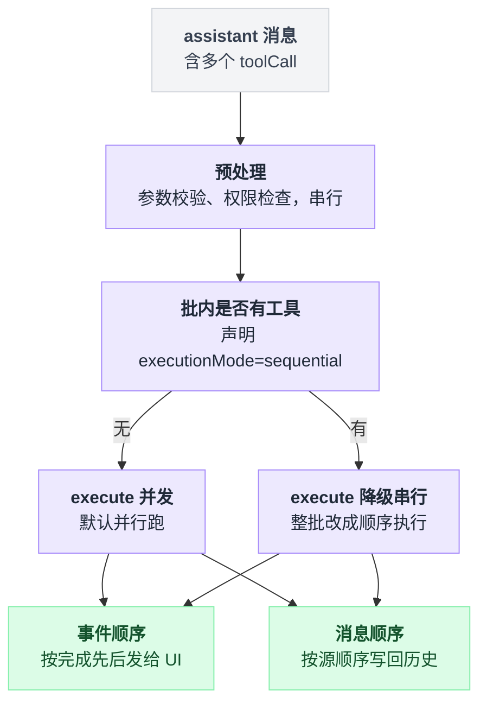

重试逻辑**不在这个文件里**。它在应用层：

`packages/coding-agent/src/core/agent-session.ts:1063`

```typescript
	private async _runAgentPrompt(messages: AgentMessage | AgentMessage[]): Promise<void> {
		this._isAgentRunActive = true;
		try {
			await this.agent.prompt(messages);
			while (await this._handlePostAgentRun()) {
				await this.agent.continue();
			}
		} finally { /* ... */ }
	}
```

`_handlePostAgentRun()` 依次判断：是可重试错误吗（`_prepareRetry` 会指数退避、把失败的 assistant 消息从 `agent.state.messages` 里摘掉，然后返回 true）→ 需要压缩吗 → 队列里还有消息吗。任一为真就再跑一次 `agent.continue()`。

这个设计的含义是：**低层循环对「重试」这个概念一无所知**，它只知道有 error 就退出；重试是一个「摘掉最后一条消息 + 重新进入循环」的应用层操作。

### 2.4 代价与适用边界

好处是低层循环短、无状态、可测试，所有策略（重试、压缩、限流）都在一个地方（`agent-session.ts`）而不是散在循环里。代价有三条。

其一，**用户 steer 不是抢占式的**。消息只在 turn 边界注入，如果模型正在跑一个 60 秒的 bash 命令，你的「停下」要等它跑完。真正的即时打断只有 `abort()`，那是取消整个 run。

其二，**重试的正确性依赖应用层守规矩**。`agentLoopContinue` 的注释明确写了「最后一条消息必须能转成 user 或 toolResult，否则 provider 会拒绝，而这里没法校验，因为 `convertToLlm` 一轮只调一次」。这个约束是文档约束，不是类型约束。

其三，**没有持久化，崩了就没了**。这正是 `packages/agent/src/harness/` 那套实验性设计要解决的问题：`docs/harness-v2.md` 提出把会话拆成「树（对话）+ lane（并行执行位）+ 每 lane 的 operation log（记录做了什么、还要做什么）+ 全局 facts」四部分，让崩溃后能从最后一个安全边界恢复。

同时它把所有 I/O（持久化写、provider 请求、工具执行、钩子、定时器）收敛到一个注入的 `Effects` 边界后面，于是测试可以用 `drive: "manual"` 在每个 effect 前挂起、逐步驱动、甚至模拟崩溃重开。

这套东西目前是 scaffold 状态（文档 §21 自称是 implementation-status 的唯一真相来源），生产用的仍是本节这个 `agent-loop.ts`。

---

## 3. Codex 的做法

### 3.1 一句话概括

三层嵌套循环——`Task`（外，管排队输入）→ `Turn`（中，管采样与自动压缩）→ `sampling request`（内，管重试与流式事件），配合一个贯穿全程的 `CancellationToken`；最有辨识度的一点是**工具在模型流还没结束时就开始执行**。

### 3.2 机制拆解

**协议层的三级词汇。** `docs/protocol_v1.md` 定义得很清楚：`Codex` 引擎通过一对队列 SQ（Submission Queue，UI → 引擎）/ EQ（Event Queue，引擎 → UI）与前端通信。三级包含关系是：

| 单位 | 约束 | 对应 Pi 的什么 |
|---|---|---|
| `Session` | 同时最多跑一个 `Task` | — |
| `Task` | 由一串 `Turn` 组成；「一个 Turn 没有产出输出」就终止 Task | — |
| `Turn` | 中层 | 更接近 Pi 的整个 run |
| sampling request | 内层 | 对应 Pi 的「turn」 |

表里「没有产出输出」这句得解释一下，不然容易读成「模型没吐字」。这里的**输出指的是采样请求的结果**：`model_needs_follow_up` 为 false，这个 Turn 就算没产出输出——`protocol_v1.md` 的词汇定义里，这正是 Task 的终止条件。下面「停止条件」那段的 `needs_follow_up` 就是它的代码形态。

这个词汇表和 Pi 的 turn 概念对不上，下文按 Codex 自己的叫法。三层的骨架是：

```
// 外层 Task：RegularTask::run
loop:
    run_turn(...)
    if input_queue 没有待处理输入: return

// 中层 run_turn
run_pre_sampling_compact()                  // 回合开始前的预压缩
loop:
    排空 pending input                       // 受 can_drain_pending_input 控制
    step_context = 一次性冻结（context + 广告出去的工具 + 路由）
    结果 = run_sampling_request(step_context)
    根据结果决定：继续 / 压缩后重来 / 收尾

// 内层 run_sampling_request：重试壳
预算 = provider.info().stream_max_retries()
loop:
    try_run_sampling_request()              // 真正处理 SSE / WebSocket 事件流
    失败 → handle_retryable_response_stream_error 退避后重来
```

**外层：`RegularTask::run`。** 极短，只做一件事——反复调 `run_turn`，直到 `input_queue` 里没有待处理输入。

**中层：`run_turn`。** 这是 400 行的主体。进入前先跑 `run_pre_sampling_compact`（回合开始前的预压缩）。循环体依次：排空 pending input → 捕获 `StepContext`（一次性冻结这一步用的 context、工具列表、路由，保证「上下文、广告出去的工具、实际的工具调用」三者是同一份视图）→ 发采样请求 → 根据结果决定是继续、压缩后重来、还是收尾。

**内层：`run_sampling_request` 与 `try_run_sampling_request`。** 前者是重试壳：拿 `provider.info().stream_max_retries()` 做预算，失败就 `handle_retryable_response_stream_error` 退避后重来。后者才是真正处理 SSE / WebSocket 事件流的地方。

**steer 的语义。** UI 在 Task 运行中发来的 `Op::UserInput` 走 `steer_input`（`session/mod.rs:3989`）：拿 `active_turn` 锁，检查任务类型可 steer（`Review` 和 `Compact` 任务拒绝 steer），然后追加到该 turn 的 `pending_input`。**不打断正在跑的采样请求**。

下一次循环开头的 `get_pending_input` 会把它排进历史。`can_drain_pending_input` 这个布尔变量控制两个例外：turn 刚开始时不排（让本次的新输入先被采样）、自动压缩之后不排（让模型/工具的续接先恢复，再谈 steer）。

**边流边跑工具。** `try_run_sampling_request` 持有一个 `FuturesOrdered<BoxFuture<ResponseInputItem>>` 叫 `in_flight`。每当流里到达一个 `OutputItemDone` 且它是个工具调用，对应的 future 就 `push_back` 进去**立刻开始执行**，而流继续接收后面的事件。

等流结束，`drain_in_flight` 按 `FuturesOrdered` 的顺序（即入队顺序 = 模型输出顺序）依次取结果写入历史。这样工具执行的时间和模型剩余输出的传输时间是重叠的。

**传输层降级。** `ModelClientSession::stream` 优先走 Responses over WebSocket，失败则 `try_switch_fallback_transport` 永久关掉本 session 的 WebSocket，退回 HTTP SSE。重试预算耗尽也会触发同样的降级，并且降级后**重试计数归零**，等于额外送一轮重试预算。

**停止条件。** `needs_follow_up = model_needs_follow_up || has_pending_input`。前者由流里是否出现工具调用等决定——它为 false 就是协议里说的「这个 Turn 没有产出输出」；后者是 steer 队列。

为 false 时先跑 stop hook——hook 可以「阻止停止」并给出一段续接 prompt，把它记进历史后 `continue`，循环再跑一轮（`stop_hook_active` 标志防止无限阻止）。

**取消。** `CancellationToken` 从 Task 层往下派生子令牌（`cancellation_token.child_token()`）。`Op::Interrupt` → `abort_all_tasks` → `handle_task_abort`：先 cancel 令牌，等最多 `GRACEFULL_INTERRUPTION_TIMEOUT_MS` 让任务优雅收尾，超时就 `handle.abort()` 硬杀，最后往历史里写一条「被中断」的标记项，让下一轮模型知道上一轮是被打断的。

三层嵌套 + 取消令牌的整体骨架：

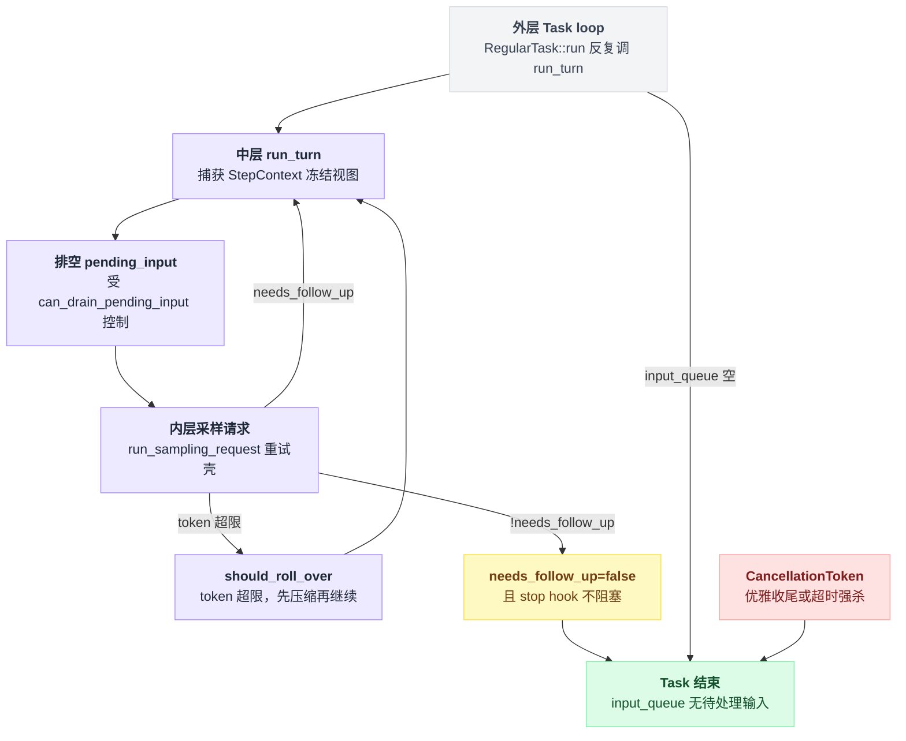

### 3.3 源码

外层循环，全文只有这几行有实质逻辑：

`codex-rs/core/src/tasks/regular.rs:71`

```rust
        let mut next_input = input;
        let mut prewarmed_client_session = prewarmed_client_session;
        loop {
            let last_agent_message = run_turn(
                Arc::clone(&sess),
                Arc::clone(&ctx),
                next_input,
                prewarmed_client_session.take(),
                cancellation_token.child_token(),
            )
            .instrument(run_turn_span.clone())
            .await?;
            if !sess.input_queue.has_pending_input(&sess.active_turn).await {
                return Ok(last_agent_message);
            }
            next_input = Vec::new();
        }
```

`next_input = Vec::new()` 是关键：第二次及以后的 `run_turn` 不带新输入，因为待处理输入已经在 `input_queue` 里，由 `run_turn` 内部自己去排。这和 Pi 的「外层循环查 follow-up 队列」是同构的设计。

中层循环的排空点与上下文冻结：

`codex-rs/core/src/session/turn.rs:273`

```rust
    let mut next_step_context = Some(first_step_context);
    loop {
        // Note that pending_input would be something like a message the user
        // submitted through the UI while the model was running. Though the UI
        // may support this, the model might not.
        let pending_input = if can_drain_pending_input {
            sess.input_queue
                .get_pending_input(&sess.active_turn)
                .await
                .0
        } else {
            Vec::new()
        };

        if run_hooks_and_record_inputs(&sess, &turn_context, &pending_input).await {
            break;
        }
        // ...
        // Capture once so context, advertised tools, and tool calls share one request view.
        let step_context = match next_step_context.take() {
            Some(step_context) => step_context,
            None if pending_input.is_empty() => {
                sess.capture_step_context(Arc::clone(&turn_context), &cancellation_token).await?
            }
            None => { /* 有新用户输入时，需要重新解析所需的 MCP server 再捕获 */ }
        };
```

注意 `None` 分支的区别：如果这一轮有新的用户输入，要先 `required_mcp_servers_for_input` 重新算一遍这条消息可能需要哪些 MCP server（用户可能 @ 了一个之前没启用的插件），再捕获 StepContext。「有没有新输入」直接影响这一步的工具集合。

采样后的分支决策：

`codex-rs/core/src/session/turn.rs:423`

```rust
                let should_roll_over = needs_follow_up
                    && (sess.take_new_context_window_request().await || token_limit_reached);
                // ...
                // as long as compaction works well in getting us way below the token
                // limit, we shouldn't worry about being in an infinite loop.
                if should_roll_over {
                    if let Err(err) = run_auto_compact(/* ... */).await { /* ... */ }
                    if run_pending_session_start_hooks(&sess, &turn_context).await {
                        return Ok(None);
                    }
                    can_drain_pending_input = !model_needs_follow_up;
                    continue;
                }

                if !needs_follow_up {
                    last_agent_message = sampling_request_last_agent_message;
                    let stop_outcome = run_turn_stop_hooks(/* ... */).await;
                    if stop_outcome.should_block { /* 记录续接 prompt 后 continue */ }
                    if stop_outcome.should_stop { break; }
                    // ...
                    break;
                }
                continue;
```

那句注释值得注意——压缩后 `continue` 回到循环顶部，如果压缩没能把 token 降下去，这里就是个死循环。代码的防御手段是「相信压缩效果」，没有硬性的迭代上限。这是个有意识接受的风险。

重试与降级：

`codex-rs/core/src/responses_retry.rs:31`

```rust
    if *retries >= max_retries
        && client_session.try_switch_fallback_transport(
            &turn_context.session_telemetry,
            &turn_context.model_info,
        )
    {
        sess.send_event(turn_context, EventMsg::Warning(WarningEvent {
            message: format!("Falling back from WebSockets to HTTPS transport. {err:#}"),
        })).await;
        *retries = 0;
        return Ok(());
    }

    if *retries < max_retries {
        *retries += 1;
        let delay = err.retry_delay().unwrap_or_else(|| backoff(retry_count));
        // 第一次 WebSocket 重试在 release 构建里静默，避免噪音
        let report_error = retry_count > 1 || cfg!(debug_assertions)
            || !sess.services.model_client.responses_websocket_enabled();
        if report_error { sess.notify_stream_error(/* "Reconnecting... n/max" */).await; }
        tokio::time::sleep(delay).await;
        return Ok(());
    }
    Err(err)
```

`*retries = 0` 那一行是全文最实用的一个技巧：预算耗尽不等于放弃，而是「换一条路再给一次完整预算」。`err.retry_delay()` 优先用 provider 在 429 响应里给的建议延迟，没有才退回本地指数退避。

边流边执行工具：

`codex-rs/core/src/session/turn.rs:2344`

```rust
                let output_result =
                    match handle_output_item_done(&mut ctx, item, previously_streamed_item)
                        .instrument(handle_responses).await
                    {
                        Ok(output_result) => output_result,
                        Err(err) => break Err(err),
                    };
                if let Some(tool_future) = output_result.tool_future {
                    in_flight.push_back(tool_future);
                }
```

以及流结束后的收尾（`turn.rs:2705`）：`if in_flight.is_empty() { None } else { Some(begin_tool_blocking()) }` —— 这里专门开了一个计时器区分「等模型」和「等工具」两段时间，说明这两段的重叠程度是他们持续在观测的指标。

把这段时序摊开看，工具执行和模型剩余输出的传输是这样重叠的：

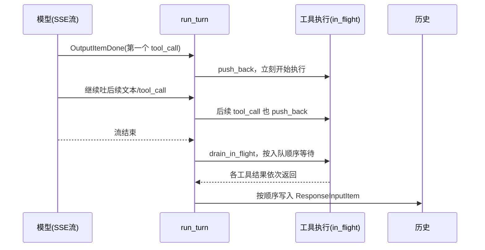

### 3.4 代价与适用边界

Codex 这套的强项在于延迟：预热 WebSocket、边流边跑工具、传输降级，三个优化都是冲着 TTFT 和端到端时间去的。同时 `CancellationToken` 树 + 优雅超时 + 中断标记项，让打断在语义上是干净的。

代价是复杂度极高且高度耦合。`run_turn` 一个函数 400 行，里面同时处理压缩、hook、analytics、MCP server 解析、token 预算、错误分类，控制流有十几个 `break`/`continue`/`return` 出口，任何一条新路径都得考虑对其余所有出口的影响。

第二，`Session` 一次只能有一个 `Task`（协议文档明确写了这条），并行任务的官方建议是「每条工作线起一个 `Codex` 实例」。

第三，压缩后 `continue` 没有迭代上限，防御靠的是「压缩一定有效」这个假设。

---

## 4. LangChain v1 的做法

### 4.1 一句话概括

**它不写循环。** `create_agent()` 编译出一张 LangGraph 图——`model` 节点 → 条件边 → `tools` 节点 → 条件边回 `model`——循环是图上的一条环边；真正的执行引擎是 LangGraph 的 Pregel，一个 BSP（Bulk Synchronous Parallel）超步（superstep）调度器。

这是本章「谁拥有循环控制权」这条线索里最不一样的一家，跟另外几家的手写 while 并排放一起看更清楚：

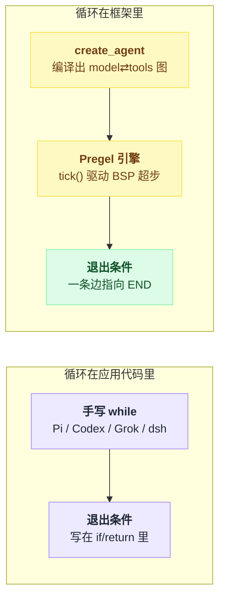

### 4.2 机制拆解

**图的形状。** 节点只有两个必需的：`model` 和 `tools`。中间件按 hook 类型展开成额外节点：`X.before_agent`、`X.before_model`、`X.after_model`、`X.after_agent`。

`factory.py:1606-1632` 计算出四个关键位置——`entry_node`（整个 run 的入口，含 before_agent）、`loop_entry_node`（**循环的入口，不含 before_agent**，所以 before_agent 只跑一次）、`loop_exit_node`（每轮末尾）、`exit_node`（含 after_agent 或 END）。

tools → model 的边指向 `loop_entry_node` 而非 `entry_node`，这一个字的差别就是「每轮都跑」和「只跑一次」的区别。

**退出条件写在边函数里。** `_make_model_to_tools_edge` 返回的闭包就是整个 agent 的「要不要继续」判断，它按优先级检查六件事：

| 优先级 | 判断 |
|---|---|
| 1 | 中间件设的 `jump_to` → 显式跳转 |
| 2 | 没有 AIMessage（历史被清空了） |
| 3 | 模型没调工具（**经典退出条件**） |
| 4 | 有待执行的 tool_call → 扇出到 tools |
| 5 | 本轮产生了结构化输出 |
| 6 | 兜底回 model |

**并行工具靠 `Send` 扇出。** 待执行的 tool_call 不是打包成一个「tools 节点调用」，而是每个 tool_call 一个 `Send("tools", [tool_call])`。

在 Pregel 里这意味着**同一个超步内的 N 个独立任务**，由 runner 并发执行，结果在超步结束时统一写回 `messages` 通道。并行是运行时白送的，`create_agent` 自己没写一行并发代码。

**Pregel 的超步语义。** 这是它和手写 while 最本质的差别：`main.py:2959` 的注释写得很直白——「与 BSP / Pregel 模型类似，计算按步推进，只要还有 channel 更新就继续；第 N 步的 channel 更新只在第 N+1 步可见；在一步之内 channel 保证不可变，更新只在步与步的过渡点应用」。

`loop.tick()` 计算这一步该跑哪些任务（`prepare_next_tasks`），runner 并发跑完，`loop.after_tick()` 一次性 `apply_writes` 提交所有写入。没有任务可跑了，`status = "done"`，循环结束。

一次 `tick()` 内部的推进顺序：

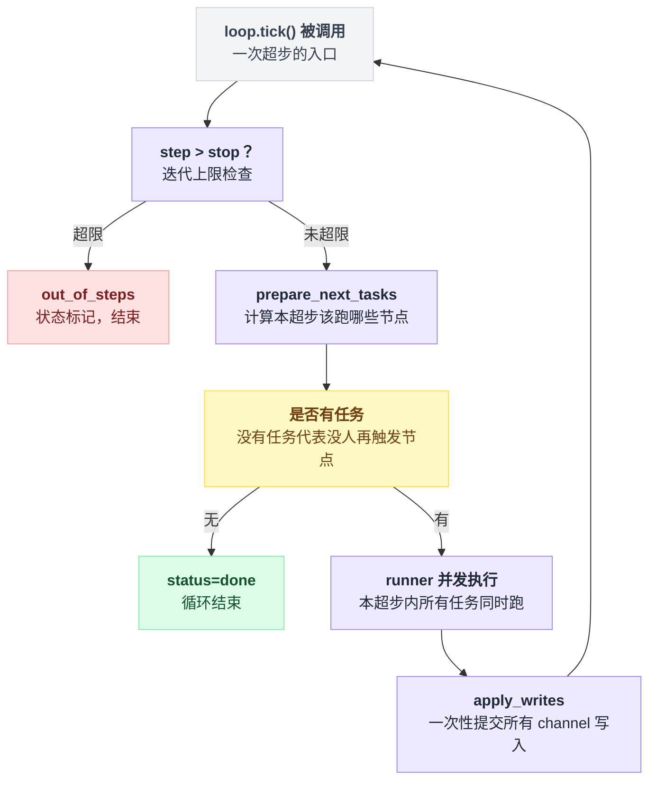

**迭代上限是 `recursion_limit`。** `tick()` 开头就是 `if self.step > self.stop: self.status = "out_of_steps"`，`stop = step + recursion_limit + 1`。

有意思的是 `create_agent` 把它硬编码成 `9_999`（`factory.py:1792`，附了一条 langgraph issue 链接）——因为中间件节点把每一轮 agent 迭代拆成了好几个超步，默认的 25 步限制会被中间件数量而不是 agent 行为提前耗尽。这是「图化」带来的一个真实副作用。

**循环控制以中间件形式暴露。** 这一点是 LangChain v1 与另外两家最大的分工差异：Pi 和 Codex 把「重试几次」「最多几轮」写死在循环里，LangChain 把它们做成可插拔的中间件：

| 中间件 | 挂点 | 做什么 |
|---|---|---|
| `ModelCallLimitMiddleware` | `before_model` / `after_model` | 前者检查计数，超了就返回 `{"jump_to": "end"}`；后者加计数 |
| `ToolCallLimitMiddleware` | — | — |
| `ModelRetryMiddleware` | `wrap_model_call` | 在 handler 外面套 for 循环 + 指数退避 + jitter |
| `ToolRetryMiddleware` | `wrap_tool_call` | 同结构，失败时产出 `status="error"` 的 ToolMessage |

这四个中间件的存在，本身就是「循环控制被外置」的证据。

**中断靠 checkpointer，不靠信号。** LangGraph 没有 abort signal 这类东西。人机交互的做法是 `HumanInTheLoopMiddleware` 在 `after_model` 里调 `interrupt(...)`，抛出 `GraphInterrupt`，Pregel 在 checkpointer 里存下当前状态并退出；用户之后带 `Command(resume=...)` 重新 invoke，从 checkpoint 恢复。

这是**持久化中断**而不是**取消**——好处是能跨进程、跨天恢复，坏处是没法「立刻停下一个正在跑的工具」。

### 4.3 源码

条件边的接线：

`libs/langchain_v1/langchain/agents/factory.py:1646`

```python
        graph.add_conditional_edges(
            "tools",
            RunnableCallable(
                _make_tools_to_model_edge(
                    tool_node=tool_node,
                    model_destination=loop_entry_node,
                    structured_output_tools=structured_output_tools,
                    end_destination=exit_node,
                ),
                trace=False,
            ),
            tools_to_model_destinations,
        )
        # ...
        graph.add_conditional_edges(
            loop_exit_node,
            RunnableCallable(
                _make_model_to_tools_edge(
                    model_destination=loop_entry_node,
                    structured_output_tools=structured_output_tools,
                    end_destination=exit_node,
                ),
                trace=False,
            ),
            model_to_tools_destinations,
        )
```

第三个参数是「可能的目的地列表」，只用于画图和校验；实际路由由那个闭包在运行时返回。

退出判断本体：

`libs/langchain_v1/langchain/agents/factory.py:1892`

```python
    def model_to_tools(state: dict[str, Any]) -> str | list[Send] | None:
        # 1. If there's an explicit jump_to in the state, use it
        if jump_to := state.get("jump_to"):
            return _resolve_jump(jump_to, model_destination=model_destination,
                                 end_destination=end_destination)

        last_ai_message, tool_messages = _fetch_last_ai_and_tool_messages(state["messages"])

        # 2. if no AIMessage exists (e.g., messages were cleared), exit the loop
        if last_ai_message is None:
            return end_destination

        tool_message_ids = [m.tool_call_id for m in tool_messages]

        # 3. If the model hasn't called any tools, exit the loop
        # this is the classic exit condition for an agent loop
        if len(last_ai_message.tool_calls) == 0:
            return end_destination

        pending_tool_calls = [
            c for c in last_ai_message.tool_calls
            if c["id"] not in tool_message_ids and c["name"] not in structured_output_tools
        ]

        # 4. If there are pending tool calls, jump to the tool node.
        if pending_tool_calls:
            return [Send("tools", [tool_call]) for tool_call in pending_tool_calls]
```

第 4 步的 `pending_tool_calls` 过滤是为了支持 HITL：中间件可以「伪造」ToolMessage 塞进 state（比如用户拒绝了某个调用），那个 tool_call 就不再 pending，也就不会真的执行。第 6 步（有 tool_call 但全都不 pending）回到 model，正是这个场景的收尾。

超步调度：

`libs/langgraph/langgraph/pregel/_loop.py:599`

```python
    def tick(self) -> bool:
        """Execute a single iteration of the Pregel loop.

        Returns:
            True if more iterations are needed.
        """

        # check if iteration limit is reached
        if self.step > self.stop:
            self.status = "out_of_steps"
            return False

        # prepare next tasks
        self.tasks = prepare_next_tasks(
            self.checkpoint, self.checkpoint_pending_writes, self.nodes,
            self.channels, self.managed, self.config, self.step, self.stop,
            for_execution=True, ...
        )
        # ...
        # if no more tasks, we're done
        if not self.tasks:
            self.status = "done"
            return False
```

注意这里的退出条件跟 agent 语义毫无关系——它只关心「还有没有被触发的节点」。agent 的「模型没调工具就停」被翻译成了「model_to_tools 边返回 END，于是没有新任务被触发」。这个翻译层是整套设计的核心，也是它的代价来源。

循环控制中间件的典型形态：

`libs/langchain_v1/langchain/agents/middleware/model_call_limit.py:167`

```python
    @hook_config(can_jump_to=["end"])
    @override
    def before_model(self, state, runtime) -> dict[str, Any] | None:
        thread_count = state.get("thread_model_call_count", 0)
        run_count = state.get("run_model_call_count", 0)

        thread_limit_exceeded = self.thread_limit is not None and thread_count >= self.thread_limit
        run_limit_exceeded = self.run_limit is not None and run_count >= self.run_limit

        if thread_limit_exceeded or run_limit_exceeded:
            if self.exit_behavior == "error":
                raise ModelCallLimitExceededError(...)
            if self.exit_behavior == "end":
                limit_ai_message = AIMessage(content=_build_limit_exceeded_message(...))
                return {"jump_to": "end", "messages": [limit_ai_message]}
        return None
```

`thread_limit` 和 `run_limit` 的区分只有在有 checkpointer 时才有意义：thread 是跨多次 invoke 的整条会话，run 是单次 invoke。这是「循环状态本身也被 checkpoint」带来的能力，Pi 和 Codex 都没有等价物。

### 4.4 代价与适用边界

把循环编译成图，换来三样东西：并行、checkpoint/恢复、以及任意插点（想在 model 之前加个节点就加，不用改循环）。对「要造 agent 的开发者」来说这是对的抽象——你要改的行为多半是往流程里插东西，而不是重写 while。

代价也很实在。

第一，**调试路径变长**：一次「模型 → 工具 → 模型」在栈上是若干个超步、若干次 channel 写入、若干个 RunnableCallable，出错时的 traceback 跟你脑子里的 agent 循环对不上。

第二，**流式是旁路的**：`model_node` 里是老老实实的 `model_.invoke(messages)`（`factory.py:1427`），token 流靠 `StreamMessagesHandler` 这个回调处理器从 LLM 侧捞出来（`pregel/_messages.py:49`），不是循环结构的一部分。这意味着「边流边执行工具」这类优化在这个架构里做不了——超步的语义要求节点跑完才提交写入。

第三，`recursion_limit=9999` 这个 hack 说明抽象是有泄漏的：图的步数和 agent 的轮数不是一回事，而用户配的限制是按前者算的。

---

## 5. 三方横向对比

| 维度 | Pi | Codex | LangChain v1 |
|---|---|---|---|
| 循环形态 | 手写嵌套 `while`（内层 turn / 外层 follow-up） | 手写三层：`Task` loop → `run_turn` loop → `run_sampling_request` retry loop | 无显式循环；`model→tools→model` 环边 + Pregel 超步调度 |
| 循环所在文件/行数 | `agent-loop.ts`（792 行，循环体约 120 行） | `regular.rs`（91 行）+ `turn.rs`（2750 行，`run_turn` 约 400 行） | `factory.py` 只负责接线；执行在 `pregel/_loop.py::tick` |
| 默认退出条件 | assistant 消息里无 toolCall | `needs_follow_up == false`（无工具调用且无 pending input） | `model_to_tools` 边返回 `end_destination` → 无任务可调度 |
| 额外退出口 | `shouldStopAfterTurn` 回调、整批 `terminate:true`、`stopReason` 为 error/aborted | stop hook 的 `should_stop`、错误分类后 `break`、`Op::Interrupt` | 中间件 `jump_to:"end"`、`return_direct` 工具、结构化输出产出 |
| 硬迭代上限 | 无 | 无（压缩后 `continue`，靠「压缩有效」假设兜底） | `recursion_limit`（create_agent 设为 9999）+ 可选 `ModelCallLimitMiddleware` |
| 模型请求重试 | **不在循环内**；应用层摘掉失败消息后 `agentLoopContinue()`（`agent-session.ts:1084`） | 循环内 `run_sampling_request`，预算来自 provider；耗尽后降级传输并**重置计数** | `ModelRetryMiddleware.wrap_model_call`（用户自选是否装）+ Pregel 节点级 `RetryPolicy` |
| 工具错误处理 | 捕获异常转成错误 tool_result 回喂模型 | 同左（`ResponseInputItem` 携带错误输出） | `ToolRetryMiddleware` 重试，耗尽后产 `status="error"` 的 ToolMessage |
| 工具并行 | 默认 parallel；预处理串行、`execute` 并发；事件按完成序、消息按源序；任一工具标 `sequential` 则整批降级 | 边收流边 `push_back` 到 `FuturesOrdered`，与模型输出传输重叠；结果按入队序落历史 | 每个 tool_call 一个 `Send`，同超步内由 runner 并发；无源序/完成序区分（超步末统一提交） |
| 用户 steer 时机 | turn 边界注入；两条队列（steer 每轮查 / followUp 仅在将停时查），各有 all / one-at-a-time 模式 | 下一次采样请求前排空 `input_queue`；`can_drain_pending_input` 在回合首和压缩后临时关闭；Review/Compact 任务拒绝 steer | 无原生 steer；只能 `interrupt()` + checkpoint + `Command(resume=...)` 重新进入 |
| 中断 | `AbortSignal`，传给 streamFn 和每个 `tool.execute` | `CancellationToken` 树 + 优雅超时 + 强杀 + 往历史写「被中断」标记项 | 无取消原语；靠 `GraphInterrupt` 挂起并持久化 |
| 流式与循环的关系 | 流事件被 `message_update` 转发，循环内联消费 | 流事件驱动内层循环本身（工具在流未结束时已启动） | 旁路：节点内 `invoke()`，token 由回调处理器捞出 |
| 崩溃恢复 | 无（`harness/` + `docs/harness-v2.md` 的 lanes + operation log + 确定性步进是未落地设计） | 有 rollout 记录，但 Task 本身不可恢复 | checkpointer 原生支持，`thread_model_call_count` 之类的循环状态也一并持久化 |

---

## 6. 可以拿走的工程经验

**1. 把「重试」和「循环」分开。** Pi 的 `agentLoopContinue()` 是个值得抄的接口：循环只管「从当前历史往下跑」，重试是「摘掉最后一条失败消息 + 重新进入循环」的外部操作。这样循环体里不会出现 `retryCount` 这种把两件事搅在一起的状态。

适用条件：你的历史是可变数组且能安全地 pop 最后一条；如果历史已经落盘或已发给下游，得先设计好回滚。

**2. 重试预算耗尽时先换路，再放弃。** Codex 在 `responses_retry.rs:44` 用 `*retries = 0` 实现「WebSocket 重试用完 → 降级到 HTTP → 重新给满预算」。任何有多条传输路径（多 provider、多 region、多协议）的系统都该有这一层。

前提是要有明确的「降级是单向的、session 级的」语义，否则会在两条路之间反复横跳。

**3. 并行工具要区分两种顺序。** 事件顺序（给 UI，按完成先后最自然）和消息顺序（给 provider，必须按源顺序）是两件事。Pi 用「闭包内发事件 + `Promise.all` 后按下标发消息」把它们分开（`agent-loop.ts:522-548`）。如果你只维护一种顺序，要么 UI 卡顿要么 provider 报错。

**4. 给「有副作用的工具」一个降级开关。** Pi 的 `executionMode: "sequential"` 是**工具级**声明，而且只要批次里有一个这样的工具，整批降级串行（`agent-loop.ts:419-425`）。比逐工具加锁简单得多，代价是偶尔过度保守。适合工具数量不多、写操作工具占少数的场景。

**5. 输出被截断时，整批工具调用都别执行。** 这是个真实的坑：流式 JSON 解析器为了鲁棒性会「尽力挽救」半截参数，挽救出来的对象可能通过 schema 校验但语义残缺（少了一个数组元素、路径被截短）。`stopReason === "length"` 时全批失败、回喂错误让模型重发，比赌一把安全得多。

**6. 循环控制参数化 ≠ 做成中间件。** LangChain 把 max_retries / max_model_calls / max_tool_calls 都做成独立中间件，好处是可组合、可按需装载、状态能跟着 checkpoint 走；代价是这些约束变成了**可选的**，用户不装就没有任何熔断。

如果你在做产品（而非框架），更该学 Codex/Pi 的做法——把熔断写死在循环里，只把阈值做成配置。框架和产品在这条轴上的答案本来就不同。

---

## 7. 本章存疑

- **Pi 的 `harness/` 实际完成度。** `docs/harness-v2.md` 自己声明「§1–20 描述的是目标状态，§21 才是真相来源」，我没有逐条核对 §21 与 `src/harness/*.ts` 的对应关系。文中关于 lanes / operation log / `drive: "manual"` 的描述均按设计文档转述，**⚠️ 未确认**其中哪些已经可运行。
- **Codex 压缩后 `continue` 的死循环防护。** `turn.rs:434` 的注释说「只要压缩能把 token 降到远低于上限，就不用担心死循环」，但我没有找到显式的迭代计数或熔断。若压缩本身持续失败（比如摘要模型不可用且 fallback 也失败），是否真的会无限循环，**⚠️ 未确认**。
- **Codex `preempt_for_mailbox_mail` 的完整语义。** `turn.rs:2360` 有一条在 reasoning / commentary item 之后检查 mailbox 并提前 `break` 出流循环的分支，注释标了「todo: remove before stabilizing multi-agent v2」。这条路径与常规 steer 的关系（是否会丢弃已收到但未处理的流内容）**⚠️ 未确认**。
- **LangChain `Send("tools", ...)` 的并发上限。** 每个 tool_call 一个 Send，同超步并发执行，但 runner 是否有并发度限制、由哪个配置控制，我没有在 `pregel/_runner.py` 里定位到确切答案，**⚠️ 未确认**。
- **任务指引中提到的 LangChain `agents/_execution.py`** 在 1.3.14 的代码树里不存在；同名文件位于 `agents/middleware/_execution.py`，内容是持久化 shell 的执行策略（子进程/沙箱/Docker），与 agent 循环无关。本章据此改用 `factory.py` + LangGraph Pregel 作为循环执行的证据来源。

---

## 8. 第四个样本：Grok Build

> 调研时间 2026-08-06，`xai-org/grok-build` commit `a5589e9`；全项目背景见 [17 番外](./17-番外-GrokBuild全项目速览.md)。本节只看循环维度。

**一句话**：三层嵌套手写 loop，形状是 Codex 同族；但它在两个三家都没做透的地方走出了新东西——**停止前要过三道闸**，以及**把"模型转圈"当一等失败模式硬编码熔断**。

### 8.1 循环形状：三层手写 loop

| 层 | 位置 | 职责 |
|---|---|---|
| L0 会话 actor | `xai-grok-shell/src/session/acp_session_impl/run_loop.rs:123` `run_session()`，`loop { tokio::select! { biased; … } }` | 事件多路复用：命令通道、状态事件、定时器、model-switch watch |
| L1 prompt 外层轮 | `turn.rs:849` | goal-loop 续跑 + stop gate 重开轮 |
| L2 采样内层轮 | `turn.rs:2004`（`process_conversation_turn` 内） | 经典 build request → sample → 执行工具 → continue |

一次只跑一个 turn：prompt 进 `VecDeque` FIFO，单个 `running_task` 槽，"arming a new one aborts the previous"（tasks_cancel.rs:109）。

与 Pi 的双层 while、Codex 的 Task→run_turn→sampling 三层同构——四个样本里三个产品全部收敛到"手写嵌套 loop"，图调度依然只有 LangChain 一家。

### 8.2 停止条件：无 toolCall 只是必要条件，还要过三道闸

`turn.rs:2499` 起，`tool_calls.is_empty()` 之后依次是：

1. **TodoGate**：todos 未清时注入 reminder 并 `continue` 强迫模型继续，每 prompt 有 `max_fires_per_prompt` 上限（turn.rs:2506-2551）——Pi 的立场是 "to-dos confuse models" 干脆不做，Codex 用 prompt 约束按住，Grok 则把 todo 完成度做成了**停止条件的一部分**；
2. **插话二次排水**：pending 插话排到了就 `continue` 不停（turn.rs:2554-2570，两次检查夹住收尾竞态窗口）；
3. **stop gate**：`Completed` 后还要问一道 `StopGateDecision`，`KeepWorking { feedback }` 时把 feedback 作为用户消息 push 进对话并重开一轮（turn.rs:896-906）——Claude Code stop-hook 的同款语义，对照 Codex 的 `should_stop`。

三道闸的先后顺序、以及各自怎么把循环拉回去，画出来是这样：

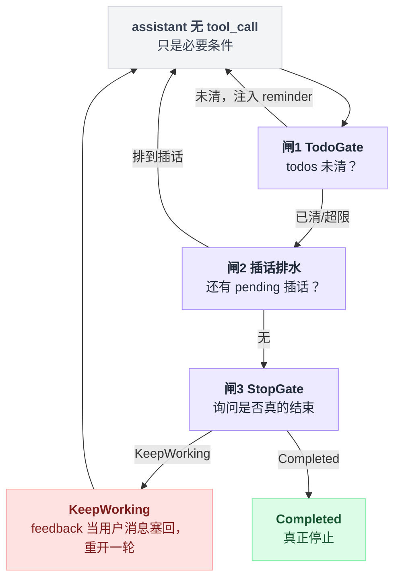

硬上限：`max_turns` 是 `Option<usize>`，`None` = 无限（来自 CLI `--max-turns`），检查在 turn.rs:2697-2708。默认值来源只追到 spawn 参数，⚠️ 未确认全部调用方的默认。

### 8.3 防转圈：四个样本里唯一的显式 stationarity 熔断

```rust
// turn.rs:2724-2728
const MAX_CONSECUTIVE_IDENTICAL_TOOL_CALLS: u32 = 16;
const NUDGE_AFTER_IDENTICAL_TOOL_CALLS: u32 = 8;
const MAX_CONSECUTIVE_TRUE_NOOPS: u32 = 4;
```

连续相同 (tool, args) 签名 8 次注入 nudge、16 次硬停；`run true` 类空转 4 次即停；常量之间还有编译期 `const _: () = assert!(...)` 断言。

硬停返回专用变体 `TurnOutcome::StationarityEnded`，类型注释明确"Distinct from Completed so recovery/goal/stop-hook cannot re-open the sampling loop"——防的是熔断被 8.2 的三道闸（尤其 stop gate）重新点火。

本章 §5 对照表里 Pi/Codex 的"硬迭代上限"都填的是"无"，LangChain 靠 recursion_limit 兜底；Grok 是唯一按**行为模式**（而非次数上限）熔断的。

两条判定路径、以及为什么熔断结果要单独开一个变体：

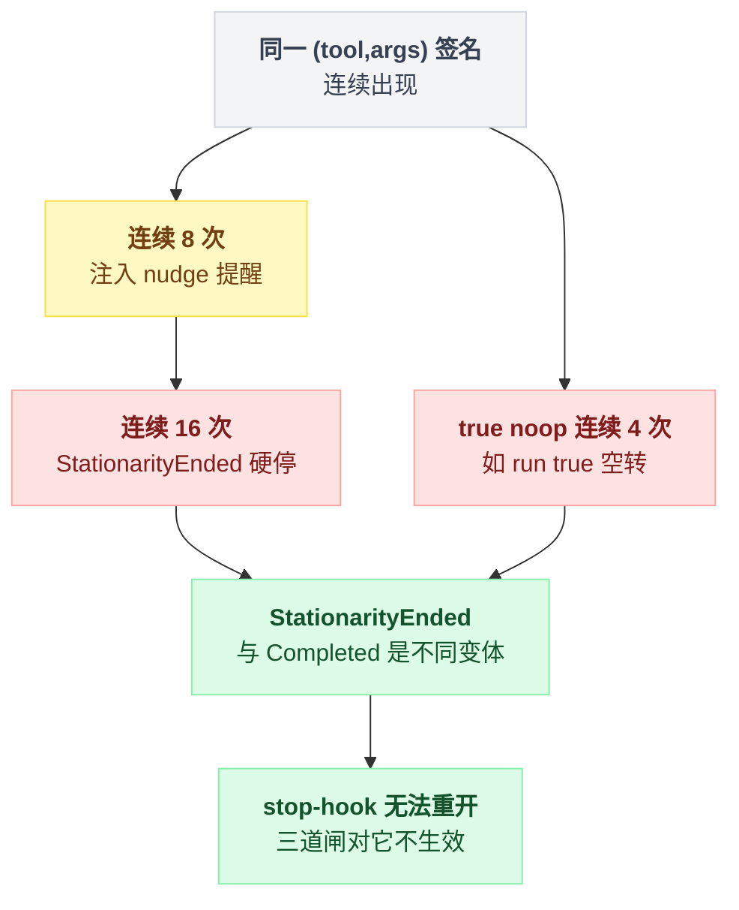

### 8.4 用户插话：排队与打断两种范式并存

本章写过 Pi 的 steer 队列和 Codex 的 abort-and-replace。Grok 两个都要：

- **默认 Pi 式排队，且更激进**：插话进 `InterjectionBuffer`（抽成共享 crate `xai-interjection-core`，注释说是为了 "so the server-side agent loop can adopt the same semantics"），"An interjection never cancels the turn"（interjection.rs:332）；排水点在**同一 turn 内**的循环边界（内层 loop 顶部 turn.rs:2078 + 收尾前两次），不必等 turn 结束——Pi 是 turn 边界注入，Grok 是循环边界注入。注入形态是独立的合成用户消息，"never appended to tool results"。
- **显式 Codex 式硬中断**：普通 prompt 可带 `send_now` 标志（commands.rs:233 "Cancel-and-send: cancel the running turn and run this prompt next"），走真 `task.abort()` + 先杀前台终端进程。
- **唯一能被插话打断的工具**是 sleep/wait 类：用 `tokio::select!` 挂在 `wait_for_pending_interjection` 上，插话到达即中止该工具返回合成结果（tool_calls.rs:562-580）。采样流本身不被插话打断——此推断基于排水点分布，⚠️ 未逐行核验 `run_turn_via_sampler` 内部。

### 8.5 本节未确认

- `max_turns` 各调用方的默认值。⚠️ 未确认。
- SSE 采样流中途是否存在插话检查点（按排水点清单推断为无，置信度高）。⚠️ 未逐行确认。

---

## 9. 第五个样本：DeepSeek Harness

> 调研时间 2026-08-14，`deepseek-ai/deepseek-harness` v0.1.0-rc.5（commit `47f9438`）；全项目背景见 [18 番外](./18-番外-DeepSeekHarness全项目速览.md)。本节只看循环维度。

**一句话**：三层手写 loop，形状是 Codex / Grok 同族；但循环体只有 192 行，因为两件东西被拿走了——**历史**（每次请求的 messages 由 session log 投影出来，并有运行时断言）和**策略**（重试、压缩、停止、防转圈全是插件监听的事件）。它的第五种答案是：停不停不由钩子的返回值决定，而由停止边界上**重读一次 inbox** 决定。

### 9.1 循环形状：三层，192 行

| 层 | 位置 | 循环体 | 职责 |
|---|---|---|---|
| L0 turn | `packages/core/agent-loop/src/agent.ts:212`（`kick()`） | `while (await this.turn()) {}` | 排队的 prompt 一个一个开 turn |
| L1 step | `agent.ts:263`（`turn()`） | `while (true)` | claim inbox → 一次模型请求 → 跑工具 → 再来一步 |
| L2 request | `agent.ts:339`（`step()`） | `while (true)` | 一次请求的重试壳，turn/step 号不变 |

与 Codex 的 `Task → run_turn → sampling`、Grok 的 L0/L1/L2 完全同构——**五个样本里四个产品全部收敛到手写嵌套 loop，图调度依然只有 LangChain 一家**。

差别在体量：三层加起来是 `agent.ts:210-401`，192 行（`packages/core/agent-loop/src/` 六个文件共 1643 行，其中 `index.ts` 713 行全是工厂与生命周期，与循环无关）；对照 Codex 一个 `run_turn` 就 400 行。

五个样本收敛成的两派，到这里可以合成一张全景图：

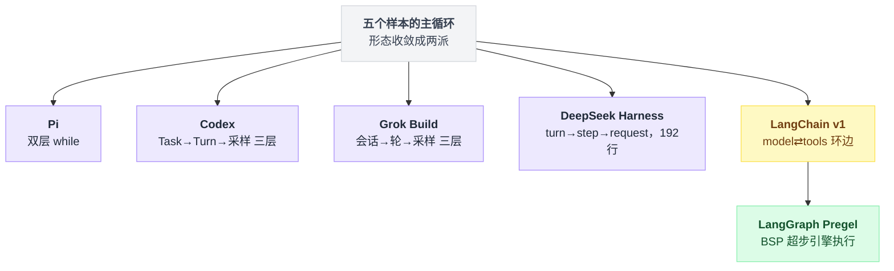

### 9.2 turn / step 的定义：文档给了定义，代码逐条对得上

`docs/architecture.md:65` 原话：`A **step** is one model request plus the tools it calls. A **turn** is zero or more steps: it opens before its first input is claimed and closes once nothing is owed.`

所以 dsh 的 **step ≈ Pi 的 turn**，dsh 的 **turn ≈ Codex 的 Turn**（本章 §3.2 已指出 Codex 的 Turn 更接近 Pi 的整个 run）。

`docs/architecture.md:63-83` 那张 Turn flow 时序逐条对到代码，无偏差：`turn/start`(agent.ts:255) → claim(`packages/core/agent/src/inbox.ts:71`) → `agent/pre-step`(agent.ts:234) → `step/start`(:279) → `user/message`(:283) → `agent/request`(:438) → `assistant/chunk*`(:349) → `assistant/message`(:381) → `tool/call*`(tool-calls.ts:263) → `tool/result*`(:281) → `step/end`(agent.ts:292) → `agent/turn-stopping`(:296) → `turn/end`(:319)。

关键差异：**turn / step 边界是 durable session event，不是 UI 事件流**。Pi 的 `turn_start`、Grok 的轮次都是发给上层的活事件，dsh 直接写进日志——重启后还能数出这个会话跑过几个 turn（`agent.ts:92` 就是靠 `findLast(event => event.type === 'turn/start')` 恢复计数的）。

### 9.3 停止条件：一个 serial 事件 + 一次重读 inbox（第五种答案）

```typescript
// packages/core/agent-loop/src/agent.ts:295-299
if (turnEnds && this.inbox.nextStep.length === 0) {
  await this.dispatch.serial('agent/turn-stopping', { turn, signal })
  signal.throwIfAborted()
}
if (turnEnds && this.inbox.nextStep.length === 0) break
```

同一个条件为什么要读两遍？把它和前四家并排写成伪代码就清楚了：

```
// 前四家：回调决定
if 该停了:
    decision = 问钩子("还要不要继续")     // 谁的返回值赢，取决于监听器顺序
    if decision 说继续: continue

// dsh：数据决定
if 该停了 and inbox.nextStep 为空:
    发 'agent/turn-stopping'              // 事件没有 next()，监听器无从否决
                                          // 想续跑就在这里 steer/inject 往 inbox 塞消息
if 该停了 and inbox.nextStep 为空:        // 同一个条件再读一次
    break                                 // 还是空 → 真停；被塞了东西 → 循环继续
```

`agent/turn-stopping` 是 serial、**没有 `next()`**（`docs/architecture.md:84` 原话："`agent/turn-stopping` is serial and has no `next()`"），监听器既不能否决也不能返回决定。它想续跑，办法是在监听器里调 `agent.steer(...)`（或任何往 next-step 塞消息的 API，如 `agent.inject(...)`）往 inbox 塞一条消息——于是紧接着的**第二次** `this.inbox.nextStep.length === 0` 读到非空，`break` 不成立，循环继续。事件声明处的原话把这个设计说透了（`packages/core/agent/src/runtime-types.ts:266`）：

> Data decides, so listener order cannot change the outcome.

这是本章的第五种答案。Pi 的 `shouldStopAfterTurn` 回调、Codex 的 `stop_outcome.should_block`、Grok 的 `StopGateDecision::KeepWorking` **都是返回值决定**——监听器顺序有意义，只有一个能赢；dsh 把停止决策改成读共享队列，几个插件可以同时想续跑而不打架。

测试直接叫它 `/loop pattern`（`packages/core/agent-loop/tests/loop.spec.ts:766`），生产用例是把 Claude Code / Codex 的 Stop hook 桥成 `steer`（`packages/hooks/hooks-claude-code/src/index.ts:270`、`packages/hooks/hooks-codex/src/index.ts:260`）。

反向也是数据：任一工具结果带 `concludesTurn` 就提前收尾（`tool-calls.ts:157` → `agent.ts:399`）。对照 Pi 的 `terminate: true` 要**整批**都标才生效，dsh 是**任一**即可，但文档明确它不短路已提交的 next-step 工作。默认出口仍是老规矩：assistant 消息里没有 tool call（`agent.ts:394`）。

「回调决定」和「数据决定」这两条路径的分岔点：

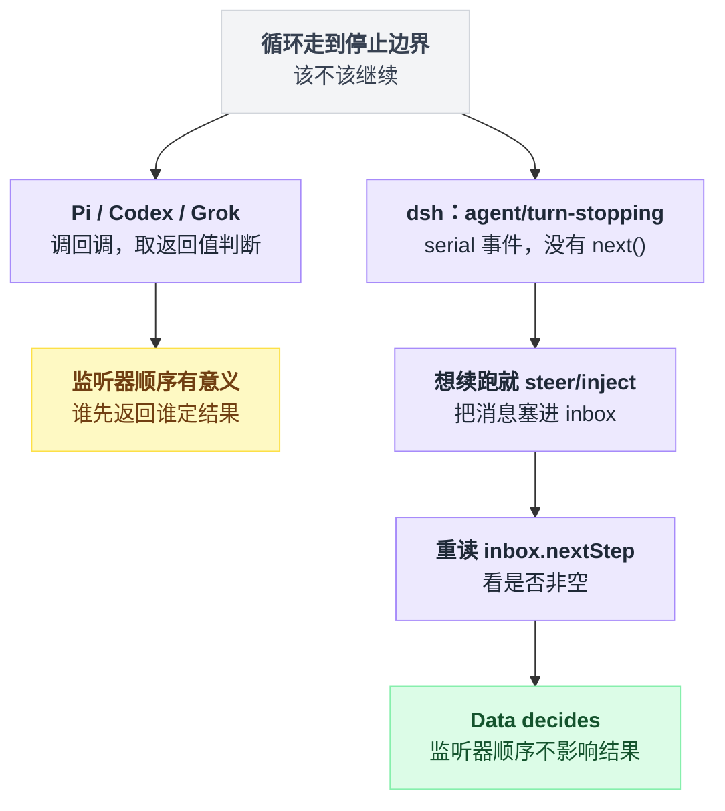

### 9.4 硬上限：核心循环里一个都没有，而且它知道

`rg 'maxSteps|maxTurns|maxIterations|recursionLimit'` 在 `packages/**/src/**/*.ts` 里**零命中**；`agent.ts` 里也搜不到 limit / budget / cap。

核心循环之外确实有上限，但一个都不在 loop 里：

| 上限 | 值 | 管什么 | 出处 |
|---|---|---|---|
| goal 子系统 `maxGoalRounds` | 默认 **256** | 只约束 `goal-round-driver` 那条自动续跑线；超了是 `ctx.goals.block(...)` 把目标标成 `round-limit`，不是停循环 | `packages/goal/goal/src/index.ts:187`；block 逻辑在 `goal-round-driver/src/index.ts:166-170` |
| ralph 工具 `maxRounds` | schema 默认 **256**，CLI 三个 preset 都配成 **64** | 工具脚本里 `for` 循环开新 subagent 的预算，管不到 agent loop | `packages/workflow/tool-ralph/src/index.ts:37`、`:153` |
| subagent `maxDepth` | 默认 **3** | 递归上限 | `packages/subagent/tool-subagent/src/index.ts:98` |

两处 hook 桥接直接承认这个洞，其中一处点名了 Codex：

```typescript
// packages/hooks/hooks-codex/src/index.ts:257-259
// TODO(stop-loop-guard): Codex supplies `stop_hook_active` so a Stop hook can
// avoid continuing the same turn indefinitely. It is always false here, so an
// unconditionally blocking hook force-continues every step until it self-limits.
```

本章 §5 对照表「硬迭代上限」一栏，dsh 填：**核心循环无；仅目标线 `maxGoalRounds`(256) 与 ralph 工具线 `maxRounds`(256，预设 64)**。

这比 Pi/Codex 的「无」还要靠后一格——Codex 至少还有「压缩一定有效」这个假设兜底，dsh 连假设都不需要，因为它压根不自己决定续跑。

### 9.5 防转圈：第二个做 stationarity 检测的样本，第一个明确选择不熔断

`packages/guard/repeat-tool-reminder`（base bundle 默认装载，`packages/bundle/base/cordis.patch.yml:390-394`）：签名 = `[tool 名, 参数深度 key 排序后 stringify]`（`src/index.ts:195`，参数规范化在 `:89-105`），连续命中同一签名，在 3 / 5 / 8 次时注入提醒——3 次是温和版，5/8 次是详细版（点名工具、连续次数、参数原文，参数预览截到 500 字符）。

两个值得抄的细节。其一，计数放在 `tools/post-execute` 而不是 pre，因为**被拒绝的调用也走这条 waterfall**——注释原话是 "a model hammering a denied call is exactly the loop worth breaking"（`:184-187`）。其二，`agent/pre-step` 里只要 claim 到的消息带 `source.kind === 'user'` 就清零计数链（`:229-231`）——用户插话换了上下文，跨插话的重复不算转圈。

但它 **never vetoes**（`:209` "Observe-and-enrich, never veto"），没有任何次数会终止循环。对照 Grok 的 8 次 nudge / 16 次 `StationarityEnded` 硬停：**§8.3「四个样本里唯一的显式熔断」这个结论在第五个样本之后依然成立**。

工具层另有 `packages/guard/timeout-policy`：合作式超时，工具声明 `timeoutMs`，wrapper 把 `exec.signal` 临时换成 deadline signal，超时后把结果整个替换成结构化的 `TOOL_TIMEOUT`，不 race、不抛弃 tool promise（`src/index.ts:56-80`）。

### 9.6 重试与压缩共用一个 waterfall，重试次数写在日志里

L2 循环体本身不知道「重试」是什么：出错就发 `agent/request-error` waterfall，默认返回 `undefined` = 终止，监听器返回 `{ kind: 'retry' }` 才 `continue`（`agent.ts:354-370`）。重试**不新开 step**，turn/step 号不变。

两个真实监听器共用这一个点：

- `packages/llm/llm-retry`：退避 + 追加 `llm/retry` 会话事件；下一次的重试序号是用 `agent.session.events.findLast(...)` 从**日志**里读回来的（`src/index.ts:182-189`），不是本地计数器——重试预算跨进程重启存活。
- `packages/compaction/compaction-basic`：只认 `CONTEXT_WINDOW_EXCEEDED_CODE`，压缩后确认 `surface.replaceGeneration` 真的推进了才返回 retry，并自带 `maxOverflowRetries`（`src/index.ts:179-222`）。

对照 §6 经验 1「把重试和循环分开」：Pi 是应用层摘掉失败消息后 `continue()`，dsh 更彻底——循环连历史数组都不持有，所以重试根本不需要摘任何东西。

截断处理则是 §6 经验 5 的第二次独立验证：`if (finish.kind === 'max-tokens') return { kind: 'max-tokens' }` 写在取 `toolCalls` **之前**（`agent.ts:391-393`），半截 tool call 一个都不执行；而且 max-tokens 在一个 turn 内是 sticky 的（`:288-290`），后面正常完成的 step 不会把 turn 结局降级回 completed。

### 9.7 历史不在循环里：request.messages 必须逐字等于 deriveMessages()

`buildRequest` 的消息直接来自 `this.session.deriveMessages()`（`agent.ts:341`），而 agent-loop 自带一个 invariant 插件在 `llm/stream` 上 prepend 全局监听器做断言：

```typescript
// packages/core/agent-loop/src/invariant.ts:39-41
const expected = session.deriveMessages()
if (JSON.stringify(options.messages) !== JSON.stringify(expected)) {
  fail(`llm request for session "..." diverges from the dispatch-time durable derivation (log-reconstruction desync)`)
```

四个既有样本的循环都持有一个可变消息数组（Pi 的 `currentContext.messages`、Codex 的 turn 历史、LangChain 的 `messages` 通道），**dsh 的循环里没有任何「当前历史」变量**。

代价是硬的：任何模型可见的东西必须先变成 session event 才能进请求，插件不能顺手改 messages——`agent/request` waterfall 的文档原话是 "Model-visible content must use logged channels; this waterfall cannot mutate messages."（`runtime-types.ts:235-236`）。

### 9.8 用户插话：一个 inbox、两个队列、排队不打断，但 inbox 本身是持久的

inbox 只有两个 target（`'next-turn'` / `'next-step'`），三个别名 API 是它的固定组合（`agent.ts:122-132`）：

| API | 进哪个队列 | 是否唤醒 |
|---|---|---|
| `followup` | next-turn | 唤醒 |
| `steer` | next-step | 唤醒 |
| `inject` | next-step | **不唤醒** |

`docs/architecture.md:86` 那句 "Some messages wake it immediately; injected context waits in the inbox until another message does" 说的就是 `inject` 的 `wakeup: false`。

claim 发生在 pre-step，顺序是「先全部 next-step，再最多**一条** next-turn」（`packages/core/agent/src/inbox.ts:71-77`）——等于把 Pi 的 `"all"` / `"one-at-a-time"` 两种排空模式**分别定死**给了两个队列。注入粒度是 **step 边界**（同 Grok 的循环边界，比 Pi 的 turn 边界细）；采样流和正在跑的工具都不会被插话打断。

两点是四家都没有的。其一，**inbox 是 durable projection**——每次 splice 写一条 `agent/inbox/spliced` 事件（`inbox.ts:186`），构造时从日志重放（`:32-39`），所以「用户排了三条还没被消费的话」也能跨重启恢复。

其二，**打断与补话是一个原子操作**：`cancel(cause)` 默认清空 inbox 并 abort 当前 turn 的 signal（`agent.ts:134-139`），而 abort 之后再发来的唤醒消息会被自动改写 target 到 `next-turn` 并 latch 住，等旧 driver 收敛到 idle 后自动开新 turn（`agent.ts:116-119` + `:172-193`）。

`AgentCancelCause` 是 `user | parent | hook | disposed` 的类型级枚举，durable `turn/end` 也照原样记下它——`{ kind: 'aborted'; reason: TurnEndCancelCause }`（`packages/core/session/src/types.ts:143-158`，`agent.ts:304` 写入），只有历史导入的粗粒度记录才落到 `legacy` 变体。

三个写入口、两个队列、claim 时的排空顺序：

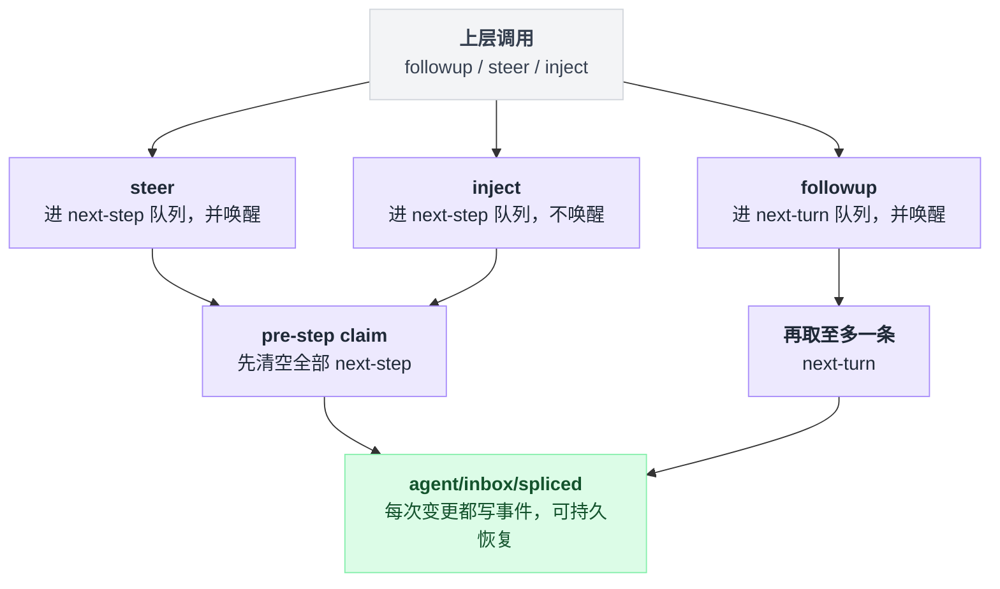

### 9.9 它最像谁 / 哪里是第五种答案

| 维度 | dsh 的位置 |
|---|---|
| 循环形状 | 与 Codex / Grok 三层同构，无新意，但体量小一个数量级 |
| 停止条件 | **第五种答案**：数据（inbox）决定，不是钩子返回值决定 |
| 硬迭代上限 | 比 Pi/Codex 还空一格：核心零上限，只有目标线与 ralph 工具线有 256 |
| 防转圈 | Grok 的检测机制 + 明确不熔断的立场 |
| 历史来源 | **第五种答案**：唯一不持有历史数组、且有运行时断言的 |
| 插话 | Pi 式排队 + Grok 式 step 粒度 + 唯一持久化的 inbox |
| 重试位置 | 与 Pi 同侧（循环外），但落点是插件事件而非应用层代码 |

不推翻本章任何既有结论；补强两条——经验 1「重试与循环分开」被推到极致，经验 5「截断整批不执行」被第二次独立验证。

可新增一条：**把「要不要继续」从返回值改成共享队列**，代价是没人能否决续跑（谁塞谁赢），收益是多个插件可以同时续跑而不需要约定优先级。

### 9.10 本节未确认

- ⚠️ `docs/architecture.md:119` 的表格写 "`agent/turn-stopping` stops a turn"，但代码里这个事件既不能否决也不能提前结束（它本来就在停止边界上），实际能力是**反向**的强制续跑。这处措辞与代码不符，我没有在任何测试或注释里找到与「stop a turn」对应的实现。
- ⚠️ 全仓有 13 个包共 14 处注册 `agent/pre-step`，我只逐行读了 `goal-round-driver`、`compaction-basic`、`repeat-tool-reminder` 三个；是否有别的插件在 pre-step 里实现了步数上限，未逐个核对。
- `DEFAULT_MAX_PARALLEL_TOOL_CALLS = 10`（`packages/core/agent-loop/src/constants.ts:6`）：全仓 bundle / preset 的 yml、yaml、json 里 grep `maxParallelToolCalls` 零命中，没有任何一处覆盖它；⚠️ 运行时用户配置（settings 分节）能否改成别的值，未核。
