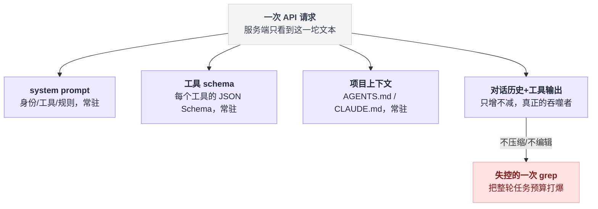
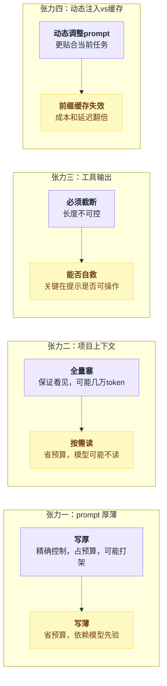
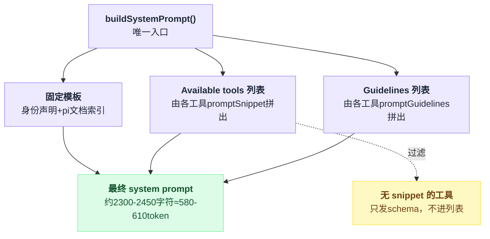
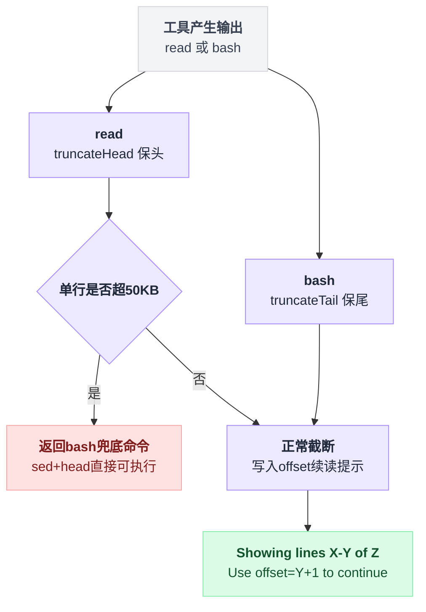
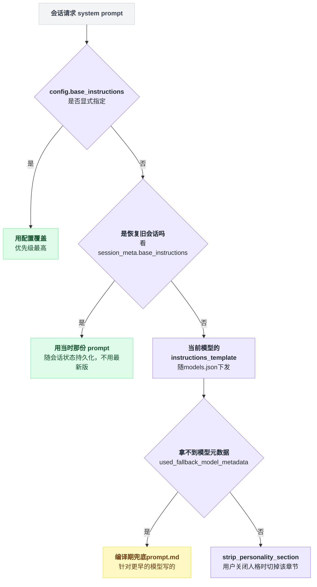
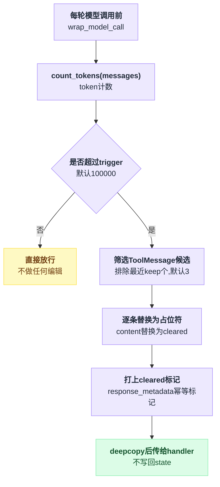
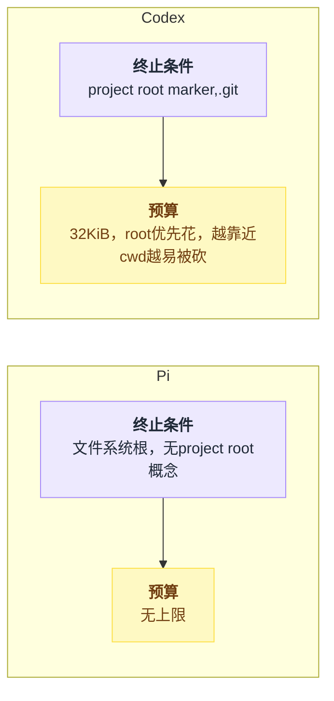
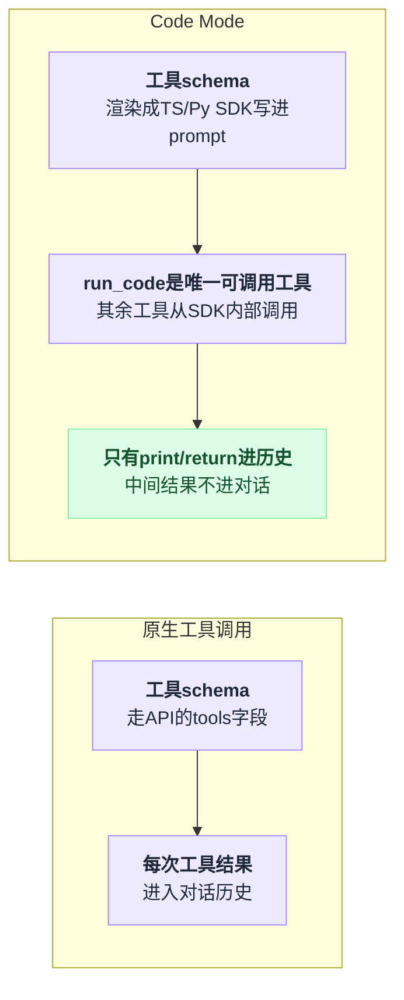
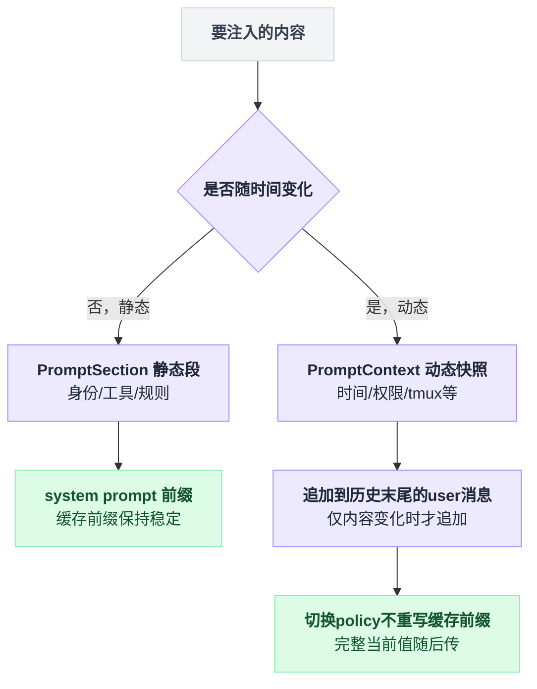

# 03 · 上下文策略

> **一句话导读**：一个 agent 的质量上限，很大程度上不由 loop 写得多漂亮决定，而由「每次请求往上下文窗口里塞了什么」决定；Pi 把 system prompt 压到不足 500 token 并赌模型先验，Codex 把 4400 token 的 prompt 当成模型资产随模型目录下发，LangChain v1 干脆不提供任何默认 prompt、只给注入点和编辑中间件。
>
> **本章涉及源码**
> - Pi：`packages/coding-agent/src/core/system-prompt.ts`、`packages/coding-agent/src/core/resource-loader.ts`、`packages/coding-agent/src/core/tools/truncate.ts`、`packages/coding-agent/src/core/tools/read.ts`、`packages/coding-agent/src/core/agent-session.ts`
> - Codex：`codex-rs/core/src/agents_md.rs`、`codex-rs/models-manager/models.json`、`codex-rs/models-manager/src/model_info.rs`、`codex-rs/utils/string/src/truncate.rs`、`codex-rs/core/src/tools/handlers/{get_context_remaining_spec,new_context_window_spec,tool_search,shell_spec}.rs`、`codex-rs/core/src/context/`
> - LangChain v1：`langchain/agents/factory.py`、`langchain/agents/middleware/context_editing.py`、`file_search.py`、`tool_selection.py`、`provider_tool_search.py`、`_redaction.py`、`pii.py`、`_execution.py`

---

## 0. 先搞清楚：这是个什么东西

大模型没有记忆。

每一次 API 调用，服务端拿到的只有你这一次发过去的那一坨文本——之前说过什么、读过哪个文件、跑过什么命令，全部要**再发一遍**。所谓「对话」只是客户端把历史重新拼进请求里造出来的幻觉。

**上下文窗口（context window）** 就是这一坨文本的长度上限，单位是 token（约等于 4 个英文字符）。一个典型的现代模型是 27 万 token 左右——`codex-rs/models-manager/models.json` 里 `gpt-5.6-sol` 的 `context_window` 就是 `272000`。

听起来很宽裕。但把一次真实的编码任务拆开看，抢这块地的有四路人马：

| 成分 | 装什么 | 增长方式 |
|---|---|---|
| system prompt | 你是谁、有什么工具、什么该做什么不该做 | 常驻，每轮都发 |
| 工具 schema | 每个工具的名字、描述、JSON Schema 参数 | 常驻，10 个工具轻松吃掉几千 token |
| 项目上下文 | 仓库里的 `AGENTS.md` / `CLAUDE.md`，写着「本项目用 pnpm 不用 npm」这类规矩 | 常驻 |
| 对话历史 + 工具输出 | 用户说的话、模型的回复、每次 `read`/`bash` 返回的内容 | **只增不减** |

第 4 项是真正的吞噬者。一个 `cat` 大文件、一次 `npm test` 的完整输出，几万 token 就没了。

而且它一旦进了历史，就永远占着位置——除非你压缩它（第 04 章）或者编辑它（本章）。

四路人马里前三路常驻、第四路只增不减，画出来是这样：



于是有了 **token 预算（token budget）** 这个概念：把窗口当成一笔钱，常驻部分是固定房租，工具输出是浮动开销，你必须给每一项定上限，否则某一次失控的 `grep` 就能把整轮任务打爆。

「往里塞什么、塞多少、什么时候踢出去」，这件事现在有个名字叫 **上下文工程（context engineering）**。

它比 prompt 好不好听重要得多：prompt 写得再漂亮，如果模型看不到关键文件，或者关键文件被 20 万行日志挤出了窗口，结果一样是错的。

---

## 1. 为什么这件事很难

四条互相拉扯的线，后面五个项目就是在这四条线上各选了一个点。

**张力一：prompt 写厚还是写薄。**

写厚（几千 token 的详细行为规范）能精确控制模型，但代价有两个：占预算；以及跟模型自己经过 RL 训练形成的默认行为**打架**——你写「先读文件再改」，模型本来就会，你写了反而可能触发它进入某种「按清单办事」的僵硬模式。

写薄则完全依赖模型先验，一旦换成能力弱的模型，行为立刻崩坏。

**张力二：项目上下文全量塞还是按需读。**

全量把所有 `AGENTS.md` 拼进 system prompt，保证模型一定看见，但一个巨型 monorepo 的说明文件加起来可能几万 token，而且大部分跟当前任务无关。

反过来只告诉模型「有这些文件，需要时自己 read」，省了预算，但模型可能压根不去读。

**张力三：工具输出长度不可预测。**

`grep` 可能返回 3 行，也可能返回 30 万行。必须截断。

但截断本身是有损的，关键在于**截断之后模型还能不能自救**——它知不知道被截了？知不知道怎么拿到剩下的部分？一个只写了 `[truncated]` 的截断和一个写了 `[Showing lines 1-2000 of 8431. Use offset=2001 to continue.]` 的截断，对 agent 行为的影响天差地别。

**张力四：动态注入 vs prompt 缓存。**

所有 provider 的 prompt 缓存都是**前缀匹配**的：只要请求开头的字节流跟上次一致，这段就不重新计费。这意味着 system prompt 和工具 schema 一变，整个缓存作废，成本和延迟都翻倍。

所以「根据当前任务动态调整 prompt / 动态增删工具」这件听起来很聪明的事，其实跟省钱是直接冲突的。Pi 的文档明确警告了这一点：激活一个带 `promptSnippet` 的工具会重建 system prompt，即使 provider 支持延迟加载工具 schema，前缀缓存照样失效[^1]。

四张张力两两对立，画出来是：



---

## 2. Pi 的做法

### 2.1 一句话概括

主体 system prompt 不到 30 行、约 600 token，工具描述里直接把 token 预算和续读方式写给模型，其余全部押在「模型已经被 RL 训练得知道怎么当 coding agent」这个假设上。

### 2.2 机制拆解

**system prompt 由三部分拼装**，全在 `buildSystemPrompt()` 一个函数里：

```
prompt = 固定模板                                  // 下面 2.3 全文贴出
       + "Available tools:\n" + 每个可见工具的 promptSnippet   // 一行字
       + "Guidelines:\n"      + 每个激活工具的 promptGuidelines // 数组
                              + 两条无条件的通用规则

可见工具 = 激活工具里「提供了 promptSnippet 的」那些
```

关键设计是「**工具自己声明它要往 prompt 里加什么**」。`read` 工具在自己的定义里写 `promptGuidelines: ["Use read to examine files instead of cat or sed."]`，这条 bullet 只有在 `read` 处于激活状态时才会出现在 system prompt 里。工具集一变，`_rebuildSystemPrompt()` 负责重新收集[^2]。

还有一条容易漏掉的规则：`visibleTools` 只保留**提供了 snippet 的**工具。也就是说一个只有 `description` 没有 `promptSnippet` 的工具，虽然 schema 会发给模型，但不会出现在 `Available tools` 列表里——这正是给动态加载的工具留的后门，避免它们污染缓存前缀[^3]。

三部分拼装、外加这道过滤，画出来是：



**项目上下文文件的发现规则**，五条[^4]：

| 环节 | 规则 |
|---|---|
| 候选文件名 | 按优先级 `AGENTS.override.md` → `AGENTS.md` → `AGENTS.MD` → `CLAUDE.md` → `CLAUDE.MD`，每个目录只取第一个命中的 |
| 起点 | 先加全局配置目录（`~/.pi`）里的一份 |
| 终点 | 从 cwd 一路向上走到文件系统根，**没有 project root 的概念，不会在 `.git` 处停下** |
| 顺序 | 收集时用 `unshift`，最终顺序是「离根最近的在前，cwd 的在最后」——越具体的规则越靠后，符合「后面的覆盖前面的」直觉 |
| worktree 特判 | 嵌套 worktree 里的 `AGENTS.md` 会屏蔽主仓库同名文件，避免同一份规则被加载两遍（`findShadowedContextFile`） |

拼进 prompt 时包在 `<project_context>` / `<project_instructions path="...">` 标签里，**带上原始路径**——这样模型知道每条规则来自哪，也知道该去哪改。

**截断策略**：`truncate.ts` 提供 `truncateHead` / `truncateTail` 两个函数，双限制、谁先触发算谁：

```
DEFAULT_MAX_LINES = 2000
DEFAULT_MAX_BYTES = 50 * 1024   // 50KB
GREP_MAX_LINE_LENGTH = 500      // grep 单行上限
```

`read` 用 head（要文件开头），`bash` 用 tail（要错误信息和最终结果，那些在末尾）。两者都**保证不返回半行**——tail 有一个例外：最后一行本身就超 50KB 时会切半行。

两条路径 + 一个边界情况，合起来是一棵小决策树：



### 2.3 源码

主体模板全文[^5]：

```typescript
	let prompt = `You are an expert coding assistant operating inside pi, a coding agent harness. You help users by reading files, executing commands, editing code, and writing new files.

Available tools:
${toolsList}

In addition to the tools above, you may have access to other custom tools depending on the project.

Guidelines:
${guidelines}

Pi documentation (read only when the user asks about pi itself, its SDK, extensions, themes, skills, or TUI):
- Main documentation: ${readmePath}
- Additional docs: ${docsPath}
- Examples: ${examplesPath} (extensions, custom tools, SDK)
- When reading pi docs or examples, resolve docs/... under Additional docs and examples/... under Examples, not the current working directory
- When asked about: extensions (docs/extensions.md, examples/extensions/), themes (docs/themes.md), ...
- When working on pi topics, read the docs and examples, and follow .md cross-references before implementing
- Always read pi .md files completely and follow links to related docs (e.g., tui.md for TUI API details)`;
```

逐段看。

**第一句**只做身份声明，没有任何「你要 careful、你要 professional」的形容词堆砌。

**Available tools** 占位符展开后是 4 行 `- read: Read file contents` 这种。

**Guidelines** 默认展开是 9 条，来源是这么凑出来的[^6]：

| 来源 | 条数 | 备注 |
|---|---|---|
| `bash` 触发的「用 bash 做 ls/rg/find」 | 1 | 默认集里没有 grep/find/ls 才成立 |
| `read` | 1 | — |
| `write` | 1 | — |
| **`edit`** | **4** | guidelines 最长，容易被漏数 |
| 无条件项 | 2 | `- Be concise in your responses`、`- Show file paths clearly when working with files` |

`_rebuildSystemPrompt()` 会把所有激活工具的 guidelines 全部 push 进去，不做筛选[^7]。

**最长的一段居然是 pi 自己的文档索引**——18 行模板里 8 行在讲「用户问 pi 本身怎么用的时候去哪读文档」。这是个很诚实的取舍：作者认为「怎么写代码」不用教，「pi 自己的 API 长什么样」模型不可能知道，必须教。

把占位符按默认工具集展开后实测 **约 2300–2450 字符 ≈ 580–610 token**。这个数把 `edit` 的 4 条 guidelines 计入在内——它们约占 500 字符，漏掉就会少算四分之一；区间的浮动来自模板里那三个文档绝对路径，长度随安装位置变。

相比之下 Codex 的模板是 17730 字符 ≈ 4400 token，差约 7 倍。作者对外宣称的「总计 < 1000 token」应该是算上了工具 schema；⚠️ 仓库里没找到这句话的出处，此处只报我自己量出的数。

工具描述即 prompt[^8]：

```typescript
		description: `Read the contents of a file. Supports text files and images (jpg, png, gif, webp, bmp). Images are sent as attachments. For text files, output is truncated to ${DEFAULT_MAX_LINES} lines or ${DEFAULT_MAX_BYTES / 1024}KB (whichever is hit first). Use offset/limit for large files. When you need the full file, continue with offset until complete.`,
```

这句描述干了三件在别处通常要写进 system prompt 的事：**声明预算**（2000 行 / 50KB）、**给出规避手段**（offset/limit）、**给出完整读取的操作协议**（continue with offset until complete）。

而且数值是从常量插值出来的——改常量，模型看到的描述自动跟着改，不会出现「文档说 2000 行、代码实际 1000 行」的漂移。

截断信息写进返回值[^9]：

```typescript
								if (truncation.firstLineExceedsLimit) {
									// First line alone exceeds the byte limit. Point the model at a bash fallback.
									const firstLineSize = formatSize(Buffer.byteLength(allLines[startLine], "utf-8"));
									outputText = `[Line ${startLineDisplay} is ${firstLineSize}, exceeds ${formatSize(DEFAULT_MAX_BYTES)} limit. Use bash: sed -n '${startLineDisplay}p' ${path} | head -c ${DEFAULT_MAX_BYTES}]`;
									details = { truncation };
								} else if (truncation.truncated) {
									// Truncation occurred. Build an actionable continuation notice.
									const endLineDisplay = startLineDisplay + truncation.outputLines - 1;
									const nextOffset = endLineDisplay + 1;
									outputText = truncation.content;
									if (truncation.truncatedBy === "lines") {
										outputText += `\n\n[Showing lines ${startLineDisplay}-${endLineDisplay} of ${totalFileLines}. Use offset=${nextOffset} to continue.]`;
```

第一个分支是全书我最喜欢的一处细节：遇到单行超过 50KB 的文件（minified JS、一行的 JSON），`read` 工具**放弃自己，把一条现成的 bash 命令写进返回值交给模型**。不抛错、不返回空、不留下让模型瞎猜的余地——直接给出下一步该敲什么。

第二个分支同理。`Showing lines X-Y of Z` 后面那句 `Use offset=… to continue` 里填的不是随手写的数，而是局部变量 `nextOffset`，它的值就是 `endLineDisplay + 1`——加法在工具里做完了，模型不需要自己算[^10]。

这个小设计后面还会再遇到两次：Codex 不要它（截断提示只报丢了多少、不给游标），dsh 却几乎原样抄了同一句话术（第 9.5 节）。

这就是 Pi 的核心手法：**该说的话不写在 system prompt 里（每轮都要付费），而写在工具输出里（只在真正发生时付一次费）**。

向上遍历的实现[^11]：

```typescript
		const ancestorContextFiles: Array<{ path: string; content: string }> = [];

		const shadowedContextFile = findShadowedContextFile(resolvedCwd);
		let currentDir = resolvedCwd;

		while (true) {
			const contextFile = loadContextFileFromDir(currentDir);
			const isShadowed =
				shadowedContextFile !== undefined && canonicalizePath(contextFile?.path ?? "") === shadowedContextFile;
			if (contextFile && !isShadowed && !seenPaths.has(contextFile.path)) {
				ancestorContextFiles.unshift(contextFile);
				seenPaths.add(contextFile.path);
			}

			const parentDir = dirname(currentDir);
			if (parentDir === currentDir) break;
			currentDir = parentDir;
		}
```

剥掉细节就是这么一个循环：

```
dir = cwd
while true:
    f = dir 里第一个命中的候选文件
    if f 存在 且 不是被 worktree 遮蔽的 且 没收过:
        unshift 进结果          // 越靠近根的越靠前
    parent = dirname(dir)
    if parent == dir: break     // 唯一的终止条件：文件系统根
    dir = parent
```

注意这个循环的**终止条件只有文件系统根**。它不看 `.git`，不看任何 project root marker。跑在 `/home/me/work/proj/src` 下就会去查 `/home/me/work`、`/home/me`、`/home`、`/` 里有没有 `AGENTS.md`。

### 2.4 代价与适用边界

- **换模型即退化**。整套设计的前提是模型自己知道「先看再改」「不要 `cat` 大文件」。用 GPT-4 级别以下或者未经 agentic 训练的开源模型，这个 prompt 撑不住。
- **项目上下文文件没有任何字节上限**。`loadProjectContextFiles` 一路读到根、全量拼进 system prompt，没有 budget 参数。一个 200KB 的 `AGENTS.md` 会无声地吃掉 5 万 token，而且因为它在 prompt 前缀里，每轮都在。（对比 Codex 的 32 KiB 硬预算。）
- **向上遍历到文件系统根**在共享机器和 home 目录里可能捡到意外的文件。
- **guideline 是全局无条件的**。所有 `promptGuidelines` 都会被拼进去，没有「只在相关任务时出现」的机制。工具一多，Guidelines 段会线性膨胀。

---

## 3. Codex 的做法

### 3.1 一句话概括

system prompt 不属于 harness，属于**模型**：每个 model slug 在模型目录里带一份自己的 `instructions_template`，随 catalog 从服务端刷新，本地 `prompt.md` 只是离线兜底；harness 只负责变量替换和拼装。

### 3.2 机制拆解

**prompt 与模型绑定。** `models.json` 里每个模型的 `model_messages.instructions_template` 就是它的 system prompt。实测各 slug 的长度：

| slug | 模板字符数 | ≈token | 章节结构 |
|---|---|---|---|
| gpt-5.6-sol / terra / luna | 17730 | ~4400 | Personality / Working with the user / Rules for getting work done / Destructive Actions / Using skills |
| gpt-5.5 | 19754 | ~4900 | General / Frontend guidance / Editing constraints / Working with the user |
| gpt-5.4 / 5.4-mini | 12896 / 11114 | ~3200 / ~2800 | General / Editing constraints / Frontend tasks / Working with the user |
| gpt-5.2 | 21544 | ~5400 | How you work / AGENTS.md spec / Planning / Task execution / Tool Guidelines |

同一个 harness 版本，7 个模型 7 份不同的 prompt，连章节标题都不一样。

`gpt-5.2` 有 `## AGENTS.md spec` 和 `## Tool Guidelines`（教模型怎么用 `apply_patch` 和 `update_plan`），到 `gpt-5.6` 这两节直接消失了——说明这些行为已经训进模型里，不需要再教。这是「prompt 和模型协同训练」最直接的证据。

选择顺序在源码注释里写得很清楚[^12]：

```
// 1. config.base_instructions override
// 2. conversation history => session_meta.base_instructions
// 3. rendered instructions_template for current model
```

第 2 条值得停一下：**恢复一个旧会话时用的是当时那份 prompt**，而不是当前模型的最新版。prompt 被当成会话状态的一部分持久化了。

`BASE_INSTRUCTIONS = include_str!("../prompt.md")` 是编译期嵌进二进制的兜底版本，只有在拿不到模型元数据（`used_fallback_model_metadata`）时才用[^13]。

**personality 是模板变量。** 模板里有 `{{ personality }}` 占位符，`instructions_variables` 里给了 `personality_default` / `personality_friendly` / `personality_pragmatic` 三份人格文本；用户关掉人格时 `strip_personality_section()` 会把整个 `# Personality` 章节从模板里切掉。

三级 fallback 加上人格裁剪，选择顺序是这样的：



**AGENTS.md 的规范就写在文件头。** `codex-rs/core/src/agents_md.rs` 开头的模块注释本身就是规格说明书（下面贴）。相比 Pi 的差异有四处：

| # | Codex | Pi 对应处 |
|---|---|---|
| 1 | 有 project root 概念：向上走到第一个含 `project_root_markers`（默认 `.git`）的目录就停，**不越过 project root** | 一路走到文件系统根 |
| 2 | **收集路径上的每一个**，不是找到就停 | 每个目录取第一个命中 |
| 3 | 有字节预算：`project_doc_max_bytes` 默认 32 KiB（`AGENTS_MD_MAX_BYTES`），逐文件递减，超了就 `truncate` | 无上限 |
| 4 | **默认不读 `CLAUDE.md`**：`default_project_doc_fallback_filenames()` 返回空 vec，候选名只有 `AGENTS.override.md` 和 `AGENTS.md`，其余要用户在配置里显式加 | 候选名单里就带 `CLAUDE.md` |

拼接分隔符是 `\n\n--- project-doc ---\n\n`，而且只在「从用户级/内部指令切换到项目级指令」的那一次插入（`legacy_text()`），项目文件之间用普通空行——这个 marker 是给模型看的「工作区规则从这里开始」的路标，不是通用分隔符。

最终这段文本以 **user 角色**的消息注入，包在 `# AGENTS.md instructions` + `<INSTRUCTIONS>` 里（`core/src/context/user_instructions.rs`），而不是塞进 system prompt。

这是个刻意的分层：system prompt 是模型的（不可变），项目规则是用户的（可变、可被后续对话覆盖）。

顺带一提，`core/src/context/` 下有 **35 个**这样的「上下文片段」类型：环境快照、权限说明、当前时间提醒、插件说明、多 agent 提示、token 预算……Codex 往上下文里注入的东西远不止 prompt 和 AGENTS.md。

**工具描述反而极简。** `exec_command` 的 description 只有一句：`"Runs a command in a PTY, returning output or a session ID for ongoing interaction."` 因为怎么用 shell、什么时候用 `apply_patch`、不许 `git reset --hard`——全都在那 4400 token 的 prompt 里。

但参数里藏了一个很关键的东西：

```
"max_output_tokens": "Output token budget. Defaults to 10000 tokens; larger requests may be capped by policy."
```

**token 预算是模型自己可以调的参数**。模型知道自己接下来要跑一条会刷屏的命令，可以主动把预算调低。

**截断是中间截断。** `utils/string/src/truncate.rs` 的做法跟 Pi 的「head 或 tail 二选一」完全不同：

```
Pi:     [========保留========]------丢弃------      // read
        ------丢弃------[========保留========]      // bash

Codex:  [==保留一半==]…N tokens truncated…[==保留一半==]
```

预算对半分给头和尾，中间挖掉，插一个 `…N tokens truncated…` 的标记。保头是为了看见命令和早期错误，保尾是为了看见最终结果和退出信息。

默认策略来自模型元数据 `truncation_policy: {mode: "tokens", limit: 10000}`，token↔byte 的换算用固定的 `APPROX_BYTES_PER_TOKEN = 4`。

**让模型自己管上下文。** 两个工具：

- `get_context_remaining`：返回 `{tokens_left: int|null}`
- `new_context`：`"Start a new context window. Does not clear, reset, or otherwise affect environment state."`

加上 `TokenBudgetRemainingContext` 这个 developer 角色的消息，直接告诉模型 `You have N tokens left in this context window.`。

**工具太多时用 BM25，不是向量。** `tool_search.rs` 用 `bm25` crate 在本地对所有工具的 `search_text` 建索引，模型调 `tool_search(query, limit)` 拿回匹配工具的完整 schema。被延迟的工具在 spec 里标 `defer_loading: true`，一开始不发 schema，只在模型搜到时才加载。

### 3.3 源码

规范即注释[^14]：

```rust
//! AGENTS.md discovery and user instruction assembly.
//!
//! Project-level documentation is primarily stored in files named `AGENTS.md`.
//! Additional fallback filenames can be configured via `project_doc_fallback_filenames`.
//! We include the concatenation of all files found along the path from the
//! project root to the current working directory as follows:
//!
//! 1.  Determine the project root by walking upwards from the current working
//!     directory until a configured `project_root_markers` entry is found.
//!     When `project_root_markers` is unset, the default marker list is used
//!     (`.git`). If no marker is found, only the current working directory is
//!     considered. An empty marker list disables parent traversal.
//! 2.  Collect every `AGENTS.md` found from the project root down to the
//!     current working directory (inclusive) and concatenate their contents in
//!     that order.
//! 3.  We do **not** walk past the project root.
```

「没找到 marker 就只看 cwd」和「空 marker 列表禁用向上遍历」这两条，正好堵上了 Pi 那个「一路走到 `/`」的口子。

预算逐文件递减[^15]：

```rust
    let mut remaining: u64 = max_total as u64;
    let mut loaded = LoadedAgentsMd::default();

    for p in paths {
        if remaining == 0 {
            break;
        }

        let mut data = match fs.read_file(&p, /*sandbox*/ None).await { /* ... */ };
        let size = data.len() as u64;
        if size > remaining {
            data.truncate(remaining as usize);
        }
        // ...
            remaining = remaining.saturating_sub(data.len() as u64);
    }
```

预算是**全局共享**的：靠近 project root 的文件先花钱，越靠近 cwd 的越可能被砍。

这个方向值得商榷——直觉上离 cwd 越近的规则越具体、越该保留。⚠️ 没找到讨论这个取舍的注释。

另外 `data.truncate(remaining)` 是**按字节硬切**，会切在 UTF-8 字符中间（后面 `String::from_utf8_lossy` 兜底），也会切在句子中间。

中间截断的实现[^16]：

```rust
    let total_bytes = s.len();
    let (left_budget, right_budget) = split_budget(max_bytes);
    let (removed_chars, left, right) = split_string(s, left_budget, right_budget);
    let marker = format_truncation_marker(
        use_tokens,
        removed_units(use_tokens, total_bytes.saturating_sub(max_bytes), removed_chars),
    );

    assemble_truncated_output(left, right, &marker)
```

`split_budget` 就是 `(budget/2, budget - budget/2)`。

标记是 `…{N} tokens truncated…`——**告诉模型丢了多少**，但**不告诉它怎么拿回来**。这是跟 Pi 最本质的分歧：Pi 的截断提示是可操作的（`Use offset=2001 to continue`），Codex 的是纯信息性的，因为它假设模型自己会去重跑一条更精确的命令。

### 3.4 代价与适用边界

- **prompt 不可移植**。用非 OpenAI 模型跑 Codex，拿不到 `instructions_template`，退化到编译期嵌进去的 `prompt.md`（针对更早的模型写的）。这套设计根本没打算支持第三方模型。
- **prompt 由服务端下发，用户无法审计版本变化**。`models.json` 是缓存，`RefreshStrategy` 会去拉新的。今天和明天你的 agent 可能拿到不同的 system prompt，而 CLI 版本号没变。
- **4400 token 常驻**，加上 35 种上下文片段，起步就吃掉窗口的 2% 以上——对 272k 窗口不算什么，但如果模型换成 32k 窗口的就很难受。
- **32 KiB 项目文档预算按字节硬切**，且优先保留离 root 近的文件。

---

## 4. LangChain v1 的做法

### 4.1 一句话概括

框架不写 prompt、不发现任何项目文件、不设任何默认预算；它提供的是**一个参数、一个注入点、一组可选中间件**——上下文工程是使用者的责任。

### 4.2 机制拆解

**system prompt 就是一个可选参数。** `create_agent(system_prompt=...)` 接受 `str` 或 `SystemMessage`，默认 `None`（即完全没有 system prompt）。它被存在 `ModelRequest.system_message` 上，调模型时才拼到最前面。

**中间件通过 `request.override()` 改 prompt。** 这是 v1 的核心扩展点。

`TodoListMiddleware` 是标准范例：在 `wrap_model_call` 里把自己的 prompt 片段追加到现有 system message 的 content blocks 后面，然后把改过的 request 传给 handler。注意它是**追加 content block 而不是字符串拼接**，这样多模态和 provider 的缓存标记都能保住。

**`ContextEditingMiddleware` 是本章 LangChain 最重要的东西**——它对标 Anthropic 的 `clear_tool_uses_20250919`：当总 token 超过阈值，把**旧的工具结果内容**替换成 `[cleared]` 占位符，保留最近 N 个。

这跟压缩（第 04 章）是两条不同的路：压缩是把历史揉成摘要，上下文编辑是**原地打洞**，消息结构完全不动，只把最占地方的 payload 挖空。

「原地打洞」的每一步：



默认参数：

| 参数 | 默认值 | 含义 |
|---|---|---|
| `trigger` | `100_000` | 超 10 万 token 才动 |
| `keep` | `3` | 最近 3 个工具结果不动 |
| `clear_at_least` | `0` | 不设最小回收量 |
| `clear_tool_inputs` | `False` | 默认只清结果不清调用参数 |
| `exclude_tools` | `()` | 无豁免工具 |

token 计数有两档：`approximate` 用 `count_tokens_approximately`（默认 4 字符/token，每条消息额外 3 token，图片按 85 token 计），`model` 用 provider 的精确接口。

**工具描述 = Python docstring。** 这是 LangChain 跟另外两个最大的形式差异：`@tool` 装饰器直接把函数 docstring 变成 tool description，Args 段变成参数描述。`file_search.py` 里的 `grep_search` 就是这么写的。

好处是「文档」和「给模型的 prompt」是同一份文本，不可能漂移。坏处是**给人看的说明和给模型看的指令被迫合并**，写给模型的行为约束会同时出现在 API 文档里。

**工具太多有两条路**（对应 Codex 的 `tool_search`）：

- `LLMToolSelectorMiddleware`：调**另一个（通常更小的）模型**做结构化输出，从全量工具里挑出相关的几个，再把裁剪后的工具集交给主模型。`max_tools` 限量，`always_include` 保底，`on_parsing_failure` 有四种降级策略。代价是每轮多一次模型调用。
- `ProviderToolSearchMiddleware`：不自己选，把工具标成 `defer_loading` 然后交给 **provider 的服务端 BM25**。目前只认两家：`anthropic` → `tool_search_tool_bm25_20251119`，`openai` → `tool_search`。provider 认不出来就直接抛 `ValueError`。

**独有维度：上下文里的敏感信息。** Pi 和 Codex 都没有的东西——`_redaction.py` + `pii.py` 提供内置探测器（email / credit card / IP / MAC / URL）和四种处理策略：`block`（抛异常中断）、`redact`（整体替换）、`mask`（部分遮蔽）、`hash`（哈希化）。

还有一个 `_PIIStreamTransformer`：流式输出时维持一个 128 字符的滑动窗口（`_DEFAULT_STREAM_LOOKBACK`），确保跨 delta 边界的信用卡号也能在吐给下游之前被拦住。

**检索：没有 RAG。** `langchain/embeddings/` 在 v1 包里只有 `__init__.py` 和 `base.py`，跟 `agents/` 没有任何连接。agent 找文件靠 `FilesystemFileSearchMiddleware` 提供的 `glob_search` / `grep_search`，后者优先 `rg --json` 子进程、失败降级到纯 Python 正则遍历。

### 4.3 源码

唯一的注入点[^17]：

```python
        model_, effective_response_format = _get_bound_model(request)
        messages = request.messages
        if request.system_message:
            messages = [request.system_message, *messages]

        output = model_.invoke(messages)
```

四行。框架对 system prompt 的全部处理就是「如果有就放最前面」。

没有默认值、没有模板、没有工具列表拼装、没有 cwd 注入——Pi 和 Codex 各自几百行的那套东西，在这里全部是使用者的作业。

原地打洞的实现[^18]：

```python
    def apply(self, messages: list[AnyMessage], *, count_tokens: TokenCounter) -> None:
        """Apply the clear-tool-uses strategy."""
        tokens = count_tokens(messages)

        if tokens <= self.trigger:
            return

        candidates = [
            (idx, msg) for idx, msg in enumerate(messages) if isinstance(msg, ToolMessage)
        ]

        if self.keep >= len(candidates):
            candidates = []
        elif self.keep:
            candidates = candidates[: -self.keep]
```

整个策略写成伪代码就三步：

```
if count_tokens(messages) <= trigger: return      // 默认 10 万 token 以下不动

candidates = 所有 ToolMessage
candidates = candidates 去掉最后 keep 个            // keep >= 总数时清空，一条都不动

for (idx, msg) in candidates:
    if msg 已带 cleared 标记: continue             // 幂等：apply 每轮都会重跑
    messages[idx] = msg 的副本，content 换成 [cleared]，打上 cleared 标记
```

真正的替换[^19]：

```python
            messages[idx] = tool_message.model_copy(
                update={
                    "artifact": None,
                    "content": self.placeholder,
                    "response_metadata": {
                        **tool_message.response_metadata,
                        "context_editing": {"cleared": True, "strategy": "clear_tool_uses"},
                    },
                }
            )
```

注意 `response_metadata` 里打了 `cleared: True` 的标记，循环开头会跳过已清理的——这是幂等性保证，因为这个 `apply` 每一轮都会重新跑一遍。

每轮全量 deepcopy[^20]：

```python
        edited_messages = deepcopy(list(request.messages))
        for edit in self.edits:
            edit.apply(edited_messages, count_tokens=count_tokens)

        return handler(request.override(messages=edited_messages))
```

**编辑结果不写回 state**，只作用于这一次请求。

所以每一轮模型调用都要：全量 `deepcopy` 消息列表 → 全量 `count_tokens` → 重新遍历清理。在一个 10 万 token 的历史上，这是每轮一次的 O(n) 深拷贝加多次 token 统计（`clear_at_least > 0` 时每清一条还要重算一次，最坏 O(n²)）。

### 4.4 代价与适用边界

- **默认是零上下文工程**。不给 `system_prompt` 就真的没有 system prompt。想要 Pi/Codex 那种「读 AGENTS.md、拼工具列表、注入 cwd」，全部自己写。这对「造一个特定领域 agent」是对的（框架不该猜你的领域），对「造一个通用 coding agent」意味着你要重做本章前两节的所有工作。
- **上下文编辑的性能成本**如上，且因为不落 state，UI 里看到的历史和实际发给模型的历史是两份东西。
- **`ProviderToolSearchMiddleware` 强绑 provider**，且那两个 type 字符串是版本戳的，provider 一升级就可能失效（源码注释自己也这么警告）。
- **PII 探测是正则**，`detect_email` 就是一条 `\b[A-Za-z0-9._%+-]+@...` 的模式。够用于挡住明显泄漏，不构成合规保证。
- `LLMToolSelectorMiddleware` 每轮多一次 LLM 往返，延迟和成本都要算进去。

---

## 5. 三方横向对比

| 维度 | Pi | Codex | LangChain v1 |
|---|---|---|---|
| 默认 system prompt 规模 | 约 2300–2450 字符 / ≈580–610 token（实测展开值） | 11114–21544 字符 / ≈2800–5400 token，随 slug 不同 | 0（无默认） |
| prompt 归属 | harness 源码里的字符串模板 | 模型资产，随 `models.json` 从服务端下发，按 slug 版本化 | 使用者，`create_agent(system_prompt=)` |
| prompt 里教不教「怎么写代码」 | 不教（只教 pi 自己的文档在哪） | 教（编辑约束、破坏性命令、自主性、前端指引、最终答案格式） | 不适用 |
| 工具列表进 prompt | 是，由各工具 `promptSnippet` 拼；无 snippet 的工具不进列表 | 否，只走 tool schema | 否，只走 tool schema |
| 工具描述风格 | 中等，把预算和续读协议写进 description | 极简一句话，规则全在 system prompt 里；但暴露 `max_output_tokens` 让模型自调预算 | Python docstring 自动转换 |
| 项目上下文文件名 | `AGENTS.override.md` / `AGENTS.md` / `AGENTS.MD` / `CLAUDE.md` / `CLAUDE.MD` | `AGENTS.override.md` / `AGENTS.md`，`CLAUDE.md` 需配置 `project_doc_fallback_filenames` | 不做 |
| 向上遍历终点 | 文件系统根 | project root（默认 `.git` marker），不越过 | — |
| 同一路径多个文件 | 每个目录取第一个命中，全部收集 | 每个目录取第一个命中，全部收集 | — |
| 项目文档字节预算 | 无上限 | 32 KiB（`project_doc_max_bytes`），跨文件共享、按字节硬切 | — |
| 注入位置 | system prompt 内，`<project_context>` 标签 | user 角色消息，`# AGENTS.md instructions` + `<INSTRUCTIONS>` | — |
| 工具输出默认上限 | 2000 行 或 50KB，谁先到算谁 | 10000 token（`truncation_policy`，模型元数据下发） | shell 工具 100 行，字节上限默认关闭 |
| 截断方向 | read 保头 / bash 保尾，不切半行 | 保头 + 保尾，挖中间 | 保头 |
| 截断提示 | 可操作：`Use offset=2001 to continue`，单行超限时直接给出 bash 兜底命令 | 信息性：`…N tokens truncated…` | 信息性：`... Output truncated at 100 lines` |
| 让模型自管上下文 | 无 | `get_context_remaining` + `new_context` 工具 + `You have N tokens left` developer 消息 + `max_output_tokens` 参数 | 无（有 `ContextEditingMiddleware` 由框架代管） |
| 工具过多的解法 | `setActiveTools()` 动态激活 + provider 原生 defer_loading | `tool_search` 工具（本地 `bm25` crate）+ `defer_loading` | `LLMToolSelectorMiddleware`（额外一次 LLM 调用）或 `ProviderToolSearchMiddleware`（服务端 BM25） |
| 检索方式 | ripgrep（缺失时自动下载） | shell + rg，无内建检索工具 | ripgrep 子进程，失败降级 Python 正则 |
| 向量库 / embedding 检索 | 无 | 无 | 无（`langchain/embeddings` 与 agent 未连接） |
| 上下文敏感信息处理 | 无 | 无 | `PIIMiddleware`：5 种探测器 × 4 种策略 + 流式 128 字符 lookback |

表里「项目文档字节预算」这一行最值得单独画一遍——终止条件和预算方向两个项目完全相反（第五个样本 DeepSeek Harness 的做法见第 9 章，这里先并排放 Pi 和 Codex）：



---

## 6. 可以拿走的工程经验

**1. 把 token 预算和自救指令写进工具的 description 和返回值，而不是 system prompt。**

Pi 的 `read` description 用常量插值声明「2000 行 / 50KB」，截断时把 `offset=2001` 算好塞进返回值，单行超限时直接给出 `sed -n '123p' file | head -c 51200`。

适用条件：任何输出长度不可控的工具。收益是双重的——省下常驻 prompt 空间，并且这些提示只在真正触发时才计费。

反例是把「如果输出被截断了，你应该用 offset 继续读」写进 system prompt：每轮都付费，而且发生率可能不到 5%。

**2. 截断提示必须可操作，而不只是告知丢了多少。**

`…5000 tokens truncated…` 和 `Showing lines 1-2000 of 8431. Use offset=2001 to continue.` 对模型行为的差别是巨大的：前者模型只能猜（通常是重跑一遍同样的命令），后者模型直接知道下一步。

如果你的工具做了截断，至少要给出「总量」和「下一个游标」。

**3. 项目上下文文件必须有字节预算和遍历终点。**

Codex 的 `project_root_markers`（默认 `.git`）+ `project_doc_max_bytes`（32 KiB）是最小可用配置。Pi 的「一路走到文件系统根、无字节上限」在 monorepo 或共享 home 目录里是个隐患。

同时要注意预算的**分配方向**——Codex 是先到先得（root 优先），如果你认为越具体的规则越重要，应该反过来从 cwd 开始花预算。

**4. 需要动态调整 prompt 或工具集时，先算清楚缓存账。**

prompt 缓存是前缀匹配的。「根据当前任务动态裁剪工具列表」听起来省 token，但每次裁剪结果不同 = 每次缓存全失效，净成本很可能是负的。

Pi 的做法值得抄：让工具的 `promptSnippet`/`promptGuidelines` 可选，动态加载的工具**只用 tool schema、不进 system prompt**，这样至少 system prompt 前缀是稳定的。

**5. 「上下文编辑」比「压缩」更适合处理工具输出。**

LangChain 的 `ClearToolUsesEdit` 只把旧工具结果的 content 换成 `[cleared]`，消息结构、tool_call_id 配对、推理链全部保留。相比整段摘要，它风险低、可幂等重放（靠 `response_metadata` 标记）、且不需要额外的模型调用。

适用条件：你的历史膨胀主要来自工具输出而不是长对话。反过来，如果膨胀来自用户和模型的大段讨论，编辑救不了，得上压缩。

**6. 如果你的 agent 会接触用户数据，上下文的敏感信息处理是个真实的缺口。**

Pi 和 Codex 都不做（它们假设本地单用户环境）。一旦 agent 跑在服务端、日志会被留存、或者输出会转发给第三方，就需要 LangChain `PIIMiddleware` 那一层。

注意它的流式实现细节：必须维持一个 lookback 缓冲区，否则跨 chunk 边界的敏感串会漏出去——这个坑自己实现时很容易踩。

---

## 7. 本章存疑

- **Pi 作者「system prompt 总计 < 1000 token」的说法**：仓库的 README 和 `docs/` 里没找到这句话。我实测展开后的主体模板是约 2300–2450 字符 ≈ 580–610 token；加上 4 个默认工具的 JSON Schema 会明显超过 1000 token，所以这个口径大概率不含工具 schema，或者指的是更早的版本。⚠️ 未确认原始出处和口径。
- **Codex 的 AGENTS.md 预算分配方向**：`read_agents_md` 里 `remaining` 是先到先得，靠近 project root 的文件先花预算，最靠近 cwd（通常最具体）的最容易被截。源码里没有注释说明这是有意为之还是遍历顺序的副产品。⚠️ 未确认。
- **`gpt-5.6-sol` 的 `auto_compact_token_limit` 是 `null`**，而 `truncation_policy` 是 tokens/10000。压缩触发时机是否完全交给别的机制，留到第 04 章确认。
- **`tool_mode: "code_mode_only"`** 出现在 gpt-5.6 系列的模型元数据里，`core/src/tools/code_mode/` 是一整个模块。它跟工具 schema 如何进上下文显然有关，自己有一套 `TruncationPolicy::Tokens(max_output_tokens)`[^67]，但本章没有展开。⚠️ 未展开。
- **Pi 的 `formatSkillsForPrompt`** 把所有 skill 的 name/description/location 全量列进 system prompt（`<available_skills>`），skill 一多这段会线性膨胀，且没有任何数量或字节上限。这是否有实际约束（比如 skill 数量本身很少）未验证。

---

## 8. 第四个样本：Grok Build

> 调研时间 2026-08-06，`xai-org/grok-build` commit `a5589e9`；全项目背景见 [17 番外](./17-番外-GrokBuild全项目速览.md)。本节只看上下文维度。

**一句话**：把 Pi 的"最小 prompt"路线推到更极端——system prompt 只有 4.6KB 且在二进制里 XOR 混淆，环境信息全部下放首条 user 消息；项目约定文件上则做出了全系列最意外的选择：**没有 GROK.md，原生认 CLAUDE.md 全家桶**。

### 8.1 System prompt：4.6KB、混淆存储、两档分化

主模板 `xai-grok-agent/templates/prompt.md` 实测 **4,638 字节 / 45 行**（subagent 版 4,741 字节；给 codex 兼容工具集配的 `apply_patch_prompt.md` 反而有 21,360 字节）。开头逐字："You are ${{ system_prompt_label }} released by xAI. …Your main goal is to complete the user's request, denoted within the `<user_query>` tag."

内容只有 6 个小节（action_safety / tool_calling / background_tasks / output_efficiency / formatting / user_guide），最后一节指向 `~/.grok/docs/user-guide/` **让模型自己去读文档**——与 Pi 的"只教 pi 自己的文档在哪"同一哲学。**工具列表不进 system prompt**，只以 `${{ tools.by_kind.read }}` 这类占位符按 kind 引用真实工具名（工具集可整体换皮）。

**模板在二进制里是 XOR 混淆的**。注释原话是 "Templates are XOR-obfuscated by `scripts/encrypt_templates.py` (obfuscation, not security — seeds live in-repo) so they don't appear as obvious plaintext in `strings` output"，解密到 `Zeroizing<String>` 用完清零[^21]。明文就在仓库里——防的是对发行二进制的 strings 提取，不防读源码。

per-model 分化只有两档：

- `system_prompt_label` 换身份名，五级解析 env → 用户 per-model → 用户全局 → 远端 per-model → 远端全局 → "Grok"[^22]
- `use_concise` 开关——切到 concise 模型时**就地改写会话里的 System item** 为 `COMPACT_SYSTEM_PROMPT`，只有两句话[^23]

对照 Codex 的七模型七 prompt：Grok 是一个模板 × 标签替换，站在了光谱的另一端。

环境信息（`<user_info>`、`<git_status>`、项目布局）全在**首条 user 消息前缀**，用户真实请求包 `<user_query>` 标签[^24]——本章 §5 表里"prompt 归属"这一行，Grok 的答案是"几乎什么都不放在 system prompt 里"。

### 8.2 项目约定文件：没有 GROK.md

识别名单是 `Agents.md / Claude.md / CLAUDE.md / CLAUDE.local.md / AGENT.md / AGENTS.md`，`claude.agents` 兼容开关（默认开）再追加 `.claude/CLAUDE.md` 和 `.claude/CLAUDE.local.md`[^25]。

**名单里没有任何 GROK.md**——自家品牌没有专属文件名，Claude/Cursor 生态被当一等公民（rules 目录认 `.grok/rules` + `.claude/rules` + `.cursor/rules`）。

注入行为的三个特征：

1. **全文 verbatim、无截断**：测试用例明言 "No cap: the full content is delivered verbatim, with no truncation marker"[^26]——与 Codex 的 32KiB 硬预算相反，与 Pi 的无上限相同，本章 §6 第 3 条的隐患同样适用于它。
2. **会话中动态发现只报路径不报内容**：agent 访问初始链之外的文件时，向上最多走 10 层找新 AGENTS.md，"path-only reminders — the agent decides whether to read them"[^27]，每会话/每压缩周期提醒一次——把"要不要花这个 token"的决定权交给模型。
3. **压缩后原文重注入**，不依赖摘要模型转述（详见 04 章第 8 节）。

### 8.3 工具输出截断：按工具分策略，bash 是"保头尾掐中间 + 全量落盘给路径"

| 工具 | 上限 | 策略与话术 |
|---|---|---|
| 通用 | `DEFAULT_TOOL_OUTPUT_BYTES = 40_000`（注释自标 "≈ 10 000 tokens"） | — |
| bash/终端 | 20,000 字符 | **保头保尾掐中间**，全量输出落盘，话术给路径：` [truncated: showing first/last {shown} of {total} - full output at: {path}]`[^28]——可操作截断的又一实现，且比 Pi 的 offset 续读更进一步：模型可以对全量日志 grep |
| 长行 | bash 用 `soft_wrap_line`（2000 字/行折行**不丢字**）；grep 用 `truncate_line`（丢弃） | 注释原话："The problem with long lines isn't size — it's that the model has no structure to anchor on"[^29] |
| read_file | 25,000 token / 1,000 行 | — |
| MCP | `MCP_MAX_OUTPUT_BYTES = 20_000` **字节** | 注释点名 "Some agents use MAX_MCP_OUTPUT_TOKENS; we bound by bytes" |

全库 token 估算统一 bytes/4 粗估[^30]——四个样本里唯一完全不引入 tokenizer 的。

### 8.4 本节未确认

- 远端 settings 对 system prompt 的 per-model 覆盖能力边界（五级解析里"远端"两级的实际下发内容不可见）。⚠️ 未确认。

---

## 9. 第五个样本：DeepSeek Harness

> 调研时间 2026-08-14，`deepseek-ai/deepseek-harness` v0.1.0-rc.5（commit `47f9438`）；全项目背景见 [18 番外](./18-番外-DeepSeekHarness全项目速览.md)。本节只看上下文维度。

**一句话**：把 Pi 的「工具自带 prompt 片段」升级成一个有序、唯一命名、可遮蔽的注册表——harness 自己只写一句话，其余 prompt 全由插件按 `order` 认领；并且**把 system prompt 劈成两半**：静态段进 system prompt（缓存前缀稳定），动态事实一律变成日志化的 user 消息追加在历史末尾。这是本章「张力四」出现的第一个完整解法。

### 9.1 system prompt 是注册表，不是模板

`ctx.systemPrompt` 有四个注册口：`section()`（静态段）、`context()`（动态快照）、`tools()`（工具 schema 提供者）、`variable()`（`{{name}}` 变量）。每次 **step**（不是每轮）调一次 `assemble()`[^31]。

systemPrompt 插件构造函数自带的段只有一句话[^32]：

```ts
this.section({ name: 'harness:identity', order: -100,
  text: 'You are an AI agent powered by DeepSeek Harness.' })
```

persona 槽（`deployment:persona`，order 0）默认空字符串，由部署配置填。shipped 的 `code` / `standard` preset 填的也只有一句[^33]：`You are a coding agent powered by the {{model}} model. Your working directory is {{cwd}}.`

其余 prompt 文本全部由**工具包自己注册**，排序约定写在类型注释里[^34]：「`-100` is the harness identity, `0` the deployment persona, tool guidance uses 100–199」。实测 `packages/**/src`（不含 tests）里有 **28 个源码文件**调用 `systemPrompt.section()`，其中 20 个是 `tool:*` 段（`tool:read` 100 / `tool:write` 101 / `tool:edit` 102 / `tool:glob` 103 / `tool:grep` 104 / `tool:bash`·`tool:pwsh` 105 / `tool:jobs`·`tool:pty` 106 / … / `tool:ralph` 116）。

相比 Pi 的 `promptGuidelines`，多了三件事：

- 同名重复注册直接抛错
- agent scope 的注册**遮蔽**同名全局注册（报错文案就是这么写的，preset 换 persona 靠的是重名遮蔽而非删了再加）[^35]
- `toolOrder` 配置项把工具 schema 的排列顺序也钉死（必须含 `<unlisted-tools>` 占位）[^36]，未配置则按名字字典序——缓存前缀里连工具顺序都是确定的

还有一个 `complete: true`：某个 section 声明自己就是完整 prompt，assemble 照跑完 waterfall（工具、变量照常解析），最后把这段还原成唯一 section，文档原话是 listeners "cannot add to or replace that scope's system prompt"[^37]。`minimal` preset 用它把整个 prompt 压成一句 `You are a helpful software engineer assistant.`[^38]。

**per-model 分化：零**。全库唯一跟模型有关的是 `{{model}}` 变量（注册 `provider`/`model`/`cwd` 三个，全库仅此三处 `systemPrompt.variable()`）[^39]，插进 persona 那句话。对照 Codex 的七模型七 prompt、Grok 的两档，dsh 站在最远端：prompt 与模型完全解耦。

### 9.2 实测字节数：750 B 到 45 KB，差 60 倍，而且由配置决定

仓库里有 13 个 golden snapshot 直接存着组装出来的 system prompt（`*/system-prompt.expected.md`，另有 2 个是 `packages/test-support` 的占位 fixture），可以直接量：

| 快照 | 字节 | 行 | 说明 |
|---|---|---|---|
| `acp-agent/pwsh-tool-turn` | 750 | 7 | 最小工具集 |
| `apps/web/fresh-round-trip` | 1,448 | 7 | Web GUI 定位段，无工具段 |
| `acp-agent/text-turn` | 3,466 | 24 | 标准编码工具集 |
| `acp-agent/web-fetch` | 3,681 | 26 | + web 工具 |
| `acp-agent/code-mode-turn` | 28,062 | 443 | **Code Mode** |
| `acp-agent/advanced-toolchain` | 45,165 | 627 | Code Mode + 全工具 |

常规模式 **3.3–3.8 KB**（13 个快照里非 Code Mode 的实测区间 3,346–3,791 字节），落在 Pi（2.3 KB）与 Grok（4.6 KB）之间，远小于 Codex（11–21 KB）。

**Code Mode 是本章的第五种答案**：工具 schema 不再走 API 的 `tools` 字段，而是渲染成一份 TypeScript SDK **写进 system prompt**（`tools:sdk` 段，order 150；渲染器 `ts-types.ts`，另有 `py-types.ts` 的 Python 版），同时插入 `tools:code-only`（order 99）：``run_code` is the only tool you can call directly — a tool call naming any other tool fails. Reach every tool the SDK declares below from inside the program.`[^40]。

代价明码标价——prompt 从 3.4 KB 涨到 28–45 KB；收益写在 SDK 说明里[^41]：

> ONLY what you print or return comes back to you — intermediate tool results never enter the conversation, so extract just what you need.

即**用常驻 prompt 的膨胀，换掉工具输出对历史的污染**。本章第 0 节说「第 4 项（对话历史 + 工具输出）是真正的吞噬者」，Code Mode 是四个既有样本里都没有的、从结构上掐掉它的做法。

而且 `tools:sdk` 的 text 按 **scope** 求值[^42]，同进程里 native session 与 code-mode session 各看各的 prompt。

两种模式的差别，本质是「工具结果进不进历史」：



### 9.3 静态段 / 动态 context 二分：对「张力四」的第一个完整解法

`PromptContext` 与 `PromptSection` 注册接口相同，去向完全不同。文档原话[^43]：「`PromptContext` is the cache-safe counterpart to `PromptSection`」。

**动态事实永远不进 system prompt**，而是渲染成一条 user 消息追加在历史末尾，且只在文本变化时才追加。开头固定 `Current runtime context. This snapshot supersedes earlier runtime-context snapshots.`，全清空时发 `Current runtime context: none. Earlier runtime-context snapshots no longer apply.`[^44]。

动机注释逐字[^45]：

> The complete current value travels after retained history, so switching policy does not rewrite the stable system-prompt cache prefix.

这是本章「张力四」第一次出现完整解法：按会不会变来分流，而不是在同一个模板里小心拼接：



同一逻辑贯穿全库：`time-context` / `tmux-context` / `agent-instructions` / skill catalog 全部不进 system prompt，都走 `agent/pre-step` 追加 user 消息；`session-reference` 不走 pre-step，而是随用户输入以 `additionalContext` 附带[^46]。

其中 `agent-instructions` 与 skill catalog 包 `<system-reminder>` 并带「整份替换旧的」措辞[^47]，`time-context` / `tmux-context` 则是不带包裹的逐步追加。Pi 把 skill 目录全量列进 system prompt（本章 §7 存疑项）的膨胀问题，dsh 用这条路直接绕开了。

配套约束是 **"Model-visible means logged"**：**渲染后的 system prompt 全文与工具 schema 本身也写进会话日志**——`request/header` 事件的 `EpochHeader` 带 `system?: string` 与 `tools?: ToolSchema[]`，首次 append，之后只在 header 变化时再 append（reason 分 `initial`/`resume`/`change`）[^48]。

四个既有样本没有一个把 system prompt 当成可回放的日志事实——本章对 Codex 的批评「prompt 由服务端下发，用户无法审计版本变化」，在 dsh 里是结构上不可能发生的。

### 9.4 项目约定文件：认 AGENTS.md + CLAUDE.md，没有 DSH.md；预算从 cwd 往回花

默认配置[^49]：

```ts
const DEFAULT_PROJECT_ROOT_MARKERS = ['.git'] as const
const DEFAULT_INSTRUCTION_FILE_CANDIDATES = ['AGENTS.md', 'CLAUDE.md'] as const
const DEFAULT_LOCAL_INSTRUCTION_FILE_CANDIDATES = ['AGENTS.local.md', 'CLAUDE.local.md'] as const
const DEFAULT_MAX_SOURCE_BYTES = 1_048_576
```

跟 Grok 一样**没有自家品牌文件名**（无 `DSH.md`），但多一层 local overlay；同目录**每个存在的候选都读**（不是找到就停），只按 trimmed 内容去重[^50]——正好覆盖本仓库自己那个 `CLAUDE.md → AGENTS.md` symlink。另有固定的 user-global `$DSH_HOME/AGENTS.md`。

project root 判定与 Codex 一致（`.git` marker，找不到就只看 cwd），不越过 root，堵住了 Pi 走到 `/` 的口子[^51]。

三个别人没有的点。

**1. 预算方向跟 Codex 相反。** `code` preset 配 `maxBytes: 65536`（`standard`/`cordis` 同值）。超了先丢**最宽泛的**[^52]：

```
files = [user-global, project-root, …, cwd]      // 从宽泛到具体
start = 0
while 总字节 > maxBytes 且 还剩多于一个文件:
    start += 1                                   // files.slice(start)：保留后缀
    // user-global 与 project root 先被牺牲，离 cwd 最近的最后才动

if 只剩一个文件仍超:
    二分查找一个截断点，截到刚好放得下
```

本章 §6 第 3 条说「如果你认为越具体的规则越重要，应该反过来从 cwd 开始花预算」——dsh 就是那个反过来的实现。

**2. 把砍了什么告诉模型。** 渲染逻辑生成 `Workspace instruction budget 65536 bytes: omitted <路径…>; truncated <路径> from <N> to <M> bytes`[^53]。Pi / Grok 无上限、Codex 静默硬切，dsh 是唯一把项目文档的预算损失报给模型的。

**3. 抗注入转义。** 整段包 `<system-reminder>`，body 里出现的 `</system-reminder>` 被替换成 `<\/system-reminder>`；测试里真的会建一个名叫 `scope</system-reminder>` 的目录来验它，录制结果在 `snapshots/agent-instructions/session.jsonl`[^54]。

注入形态是 **user 消息、全文 verbatim**，角色选择与 Codex 同侧、与 Pi/Grok 相反。baseline 落进日志后不逐轮重发，但也不是一次性的——它不再出现在可见历史里（如压缩后）或工作区身份变化时会重建，并以 `This complete workspace instruction baseline replaces all earlier workspace instruction baselines.` 声明替换[^55]。

会话中动态发现的嵌套 `AGENTS.md`（工具成功 touch 到文件时触发）注入的是**全文**（`Additional instructions from: <path>` + 内容），不是 Grok 的 path-only 提醒；文件改了发 `Updated instructions from: …`，删了发 `Instructions removed: …`[^56]——**四个既有样本都没有「约定文件变更同步」这回事**。

代价写在代码里：有一条 `TODO(total-instruction-read-bound)`，承认目前只有 per-file 1 MiB 上限、没有整批读取的总量上限，渲染预算是**全部读完之后**才施加的[^57]。

### 9.5 工具输出：spill —— 全量落盘 + 头尾预览 + 定位符，做成横切插件

单工具上限跟 Pi **数值完全一样**：`READ_LIMIT = 2000` 行、`READ_MAX_BYTES = 50 * 1024`、单行 `READ_MAX_LINE_LENGTH = 2000` 字[^58]；续读话术也几乎一模一样：`(Showing lines X-Y of Z. Use offset=Y+1 to continue.)`，字节触顶时是 `(Output capped. Showing lines X-Y. Use offset=Y+1 to continue.)`[^59]。

新东西是 **`spill-policy`**：挂在 `tools/post-execute` waterfall 上的**跨全部工具**的结果转换器[^60]：

```
on tools/post-execute(result):
    if result 是 read 工具的:     跳过模型侧这条臂   // 否则 read → spill → read again 死循环
    if 纯文本 且 字节数 > maxInlineBytes:            // 配置值 50000
        全文写入 session 级 spill artifact
        模型侧换成：头一半 + 尾一半 的预览 + 通知 + 定位符
    if spill 失败:               原样返回            // 绝不把成功调用变成 isError
```

`maxInlineBytes` 配置为 **50000** 字节；本地后端的恢复话术是 `Use read with offset/limit, or grep this path to search within it.`；`read` 的例外与「spill 失败不改 isError」写在模块注释里[^61]。Grok 的 bash「全量落盘给路径」在这里被提升成了对所有工具生效的一层策略。

最值得抄的是 `packages/util/output-retention`：把本章 §6 第 2 条写成了库契约。库只负责统计口径（`describeOmitted` 输出 `Omitted <N> bytes.`），**恢复话术强制由工具提供**——注释逐字[^62]：「The library never owns recovery words — only the tool knows the action ("narrow the pattern", "fetch a more specific URL", "read the spill file") — so `recovery` supplies them」。

head / tail / headTail 三种策略在同一个库里[^63]，等于把 Pi（head|tail 二选一）与 Codex/Grok（挖中间）统一成一个可选参数。

图片附件走内容寻址存储（`ctx.attachments`），模型消息里只放不透明引用，默认单图 5 MiB / 每条 20 张 / 每条合计 100 MiB / 4000 万像素[^64]——⚠️ 本章其余四个样本均未涉及附件配额，无从对照，只能说 dsh 明确设了一整套。

**没有**让模型自管上下文的工具（无 `get_context_remaining` 类），也**没有** PII / 脱敏层（`packages/settings/settings/src/redact.ts` 只脱敏配置里的 secret，与模型上下文无关）。这两格 dsh 跟 Pi 站在一起，LangChain 的 `PIIMiddleware` 仍是独一份。

### 9.6 补进本章坐标系

| 维度 | dsh 的答案 | 最像谁 |
|---|---|---|
| 默认 system prompt 规模 | 常规 3.3–3.8 KB；Code Mode 28–45 KB（实测 golden snapshot） | 介于 Pi 与 Grok；Code Mode 超过 Codex |
| prompt 归属 | 插件注册表：harness 一句 + 部署 persona 一句 + 每工具一段 | Pi 的极化版 |
| per-model 分化 | 无（只有 `{{model}}` 变量） | 比 Grok 更彻底 |
| 工具 schema 进 prompt | native 否（走 schema 字段）；Code Mode 是（渲染成 TS/Py SDK） | **第五种答案** |
| system prompt 可审计性 | 全文 + 工具 schema 落 `request/header` 日志事件 | **第五种答案** |
| 项目文件名单 | `AGENTS.md`/`CLAUDE.md` + `.local.md` 覆盖层 + `$DSH_HOME/AGENTS.md`，无 `DSH.md` | Grok（无自家品牌名） |
| 项目文档预算与方向 | 64 KiB，**先丢最宽泛的**，并把 omitted/truncated 报给模型 | **第五种答案**（正是 §6-3 建议的方向） |
| 注入位置 | user 消息、`<system-reminder>` 包裹、落日志不逐轮重发（仅在不可见或身份变化时重建） | 角色同 Codex，落日志独有 |
| 动态上下文 | 不进 system prompt，作为可替换 user 快照追加在历史末尾 | **第五种答案**（对张力四） |
| 工具输出上限 | 单工具 2000 行 / 50KB（同 Pi）；全局 spill 阈值 50000 字节 | Pi + Grok 的并集 |
| 截断话术 | `Use offset=N to continue` + spill 路径 + 库层强制的 recovery 契约 | Pi / Grok 的制度化版本 |

**是否推翻本章既有结论**：没有推翻，但把 §6 的两条从「建议」变成了「已有实现」——第 2 条（可操作截断）被做成带类型的库契约，第 3 条（预算该从 cwd 往回花）被反向实现且带报告。

真正新增的一条本章没写过的经验是：**把「什么会随时变」和「什么必须稳」在类型层面分成两种注册，比在一个模板里小心翼翼拼字符串省事得多**——`PromptSection` / `PromptContext` 这个二分只花了一个接口的成本，同时解决了缓存前缀、可审计性和压缩后重建三个问题。

### 9.7 本节未确认

- ⚠️ **文档比代码承诺得强**：文档写 `agent.inject()`「it lands in the next admitted request」，而 JSDoc 明确说「It may miss a request whose pre-step already claimed its batch.」——以代码为准[^65]。
- ⚠️ 9.2 的字节数来自仓库内 golden snapshot，测的是 `examples/acp-agent` 与 `apps/web` 的测试配置，不等于 `npx dsh web` 默认 profile 的实际值。`code` 与 `standard` 两个 preset 的 persona 与 `maxBytes` 逐字相同，差别是 `code` 多一行 `tool-presentation`（即 Code Mode）[^66]——这一行决定了默认 prompt 是 3 KB 档还是 28 KB 档；但 CLI 究竟默认选哪个 preset，未在配置里找到显式声明（`preset.yml` 只有 `order`：standard 1 / code 2 / minimal 3 / cordis 4）。
- ⚠️ 本节所有数字都是**字节数**，没有 token 口径：dsh 的 prompt 装配路径上既无 tokenizer 也无 bytes/4 之类的粗估常量，`packages/llm/token-meter` 只服务压缩与 UI。
- ⚠️ `maxSourceBytes` 1 MiB 的 per-file 上限之上没有总量上限（自标 TODO）[^57]，极端情况下一次 baseline 会把多个 1 MiB 文件全读进内存后才施加 64 KiB 渲染预算——实际影响未做压测。

---

## 出处

[^1]: Pi 文档对该行为的警告：`docs/extensions.md:2363`。
[^2]: `_rebuildSystemPrompt()` 的实现：`packages/coding-agent/src/core/agent-session.ts:1024`。
[^3]: `visibleTools` 过滤实现：`packages/coding-agent/src/core/system-prompt.ts:82`。
[^4]: 项目上下文文件发现规则的实现：`packages/coding-agent/src/core/resource-loader.ts:70`、`:118`。
[^5]: 主体 system prompt 模板全文：`packages/coding-agent/src/core/system-prompt.ts:121`。
[^6]: 各来源坐标：`bash` 触发项 `system-prompt.ts:79`（默认集里没有 grep/find/ls 才成立）；`read` 的 guideline `read.ts:214`；`write` 的 guideline `write.ts:192`；`edit` 的 4 条 `edit.ts:299-304`（guidelines 最长，容易被漏数），均在 `packages/coding-agent/src/core/tools/` 下。
[^7]: `_rebuildSystemPrompt()` 全量 push guidelines：`packages/coding-agent/src/core/agent-session.ts:1033`。
[^8]: 工具描述原文：`packages/coding-agent/src/core/tools/read.ts:212`。
[^9]: 截断信息写进返回值的实现：`packages/coding-agent/src/core/tools/read.ts:290`。
[^10]: `nextOffset` 的计算与拼接：`packages/coding-agent/src/core/tools/read.ts:254`。
[^11]: 向上遍历祖先目录的实现：`packages/coding-agent/src/core/resource-loader.ts:134`。
[^12]: system prompt 选择顺序的注释：`codex-rs/core/src/session/mod.rs:637`。
[^13]: 编译期兜底常量：`codex-rs/models-manager/src/model_info.rs:17`。
[^14]: AGENTS.md 规范即模块头注释：`codex-rs/core/src/agents_md.rs:1`。
[^15]: 预算逐文件递减的实现：`codex-rs/core/src/agents_md.rs:105`。
[^16]: 中间截断的实现：`codex-rs/utils/string/src/truncate.rs:55`。
[^17]: system prompt 唯一注入点：`libs/langchain_v1/langchain/agents/factory.py:1423`。
[^18]: 原地打洞策略的 `apply()`：`libs/langchain_v1/langchain/agents/middleware/context_editing.py:79`。
[^19]: 占位符替换的实现：`libs/langchain_v1/langchain/agents/middleware/context_editing.py:129`。
[^20]: 每轮全量 deepcopy 的调用点：`libs/langchain_v1/langchain/agents/middleware/context_editing.py:251`。
[^21]: XOR 混淆模板解密与清零：`xai-grok-agent/src/prompt/template.rs:1-33`。
[^22]: `system_prompt_label` 五级解析：`xai-grok-agent/util/config/resolve/system_prompt.rs:5-8`。
[^23]: `use_concise` 切换 `COMPACT_SYSTEM_PROMPT` 的实现：`xai-grok-agent/src/prompt/template.rs:55-57`。
[^24]: 环境信息前缀与 `<user_query>` 标签拼装：`xai-grok-agent/src/prompt/user_message.rs:4,66`。
[^25]: 项目约定文件识别名单与 `claude.agents` 兼容开关：`xai-grok-tools/src/types/compat.rs:401-415`。
[^26]: 全文 verbatim 无截断的测试：`format_agents_md_section_delivers_full_content`，`xai-grok-tools/src/agents_md.rs:484-499`。
[^27]: 动态发现 path-only 提醒的实现：`xai-grok-tools/src/agents_md_tracker.rs:1-47`。
[^28]: bash 保头尾掐中间、全量落盘给路径的实现：`xai-grok-agent/src/bash/mod.rs:405-410`。
[^29]: 长行处理注释：`xai-grok-agent/util/truncate.rs:4-77`。
[^30]: bytes/4 粗估常量：`xai-token-estimation/src/lib.rs:17-19`。
[^31]: 每 step 调一次 `assemble()`：`packages/core/agent-loop/src/agent.ts:230`。
[^32]: harness identity 段的注册：`packages/core/system-prompt/src/index.ts:358-362`。
[^33]: `code` preset persona 句：`apps/cli/config/agent-presets/code/agent.cordis.yml:35`。
[^34]: 排序区间约定的类型注释：`packages/core/system-prompt/src/index.ts:57-59`。
[^35]: agent scope 遮蔽同名全局注册的报错文案：`packages/core/system-prompt/src/index.ts:316-318`。
[^36]: `toolOrder` 配置项的实现：`packages/core/system-prompt/src/index.ts:140-178`。
[^37]: `complete: true` 的文档原话：`packages/core/system-prompt/src/index.ts:24-26`。
[^38]: `minimal` preset 用 `complete: true` 压缩 prompt：`apps/cli/config/agent-presets/minimal/agent.cordis.yml:8-13`。
[^39]: `{{model}}` 等三个变量的注册：`packages/core/agent-loop/src/index.ts:351-353`。
[^40]: Code Mode 的 SDK 渲染段与 `tools:code-only` 段：`packages/core/tools/src/code-mode.ts:23`、`packages/core/tools/src/index.ts:58`。
[^41]: SDK 说明原文：`packages/core/tools/src/ts-types.ts:257`。
[^42]: `tools:sdk` 按 scope 求值的实现：`packages/core/tools/src/index.ts:875-890`。
[^43]: `PromptContext` 的文档原话：`docs/subsystems/system-prompt.md:73`。
[^44]: 动态快照追加与开头/清空文案：`packages/core/agent-loop/src/runtime-context.ts:64-71`、`:13`；固定文案位置：`packages/core/system-prompt/src/index.ts:239`。
[^45]: 切换 policy 不重写缓存前缀的动机注释：`packages/interaction/user-approval/src/index.ts:202-203`。
[^46]: 各上下文片段追加位置：`packages/context/time-context/src/index.ts:200-208`、`packages/skill/tool-skill/src/index.ts:254-276`、`packages/context/session-reference/src/index.ts:212`。
[^47]: 「整份替换旧的」措辞：`packages/context/agent-instructions/src/render.ts:10-15`。
[^48]: "Model-visible means logged" 与日志事件字段：`docs/architecture.md:96`、`packages/core/session/src/types.ts:201-210`、`packages/core/agent-loop/src/agent.ts:458-470`。
[^49]: 项目约定文件默认配置常量：`packages/context/agent-instructions/src/config.ts:11-14`。
[^50]: 同目录多候选全读、按内容去重：`packages/context/agent-instructions/src/files.ts:360-378`。
[^51]: project root 判定（`.git` marker）：`packages/context/agent-instructions/src/files.ts:176-191`。
[^52]: `maxBytes: 65536`：`apps/cli/config/agent-presets/code/agent.cordis.yml:40`；保留后缀与二分截断算法：`packages/context/agent-instructions/src/render.ts:289-294`、`:249-273`。
[^53]: 预算损失报告文案的生成：`packages/context/agent-instructions/src/render.ts:217-225`。
[^54]: 抗注入转义实现：`packages/context/agent-instructions/src/render.ts:81-83`；对应测试：`examples/acp-agent/tests/acp.snapshot.ts:73`。
[^55]: baseline 替换声明与重建逻辑：`packages/context/agent-instructions/src/render.ts:15`、`packages/context/agent-instructions/src/index.ts:133-146`。
[^56]: 动态发现嵌套 AGENTS.md 的注入与变更话术：`packages/context/agent-instructions/src/index.ts:350-366`、`packages/context/agent-instructions/src/render.ts:151`、`:171-184`。
[^57]: 总量上限缺失的 TODO：`packages/context/agent-instructions/src/files.ts:333-335`。
[^58]: 单工具截断常量：`packages/fs/tool-fs/src/read.ts:16`、`packages/fs/tool-fs/src/read-render.ts:11,14`。
[^59]: 续读话术：`packages/fs/tool-fs/src/read-render.ts:158`。
[^60]: 跨工具结果转换器：`packages/spill/spill-policy/src/index.ts:190`。
[^61]: `maxInlineBytes` 配置：`packages/bundle/base/cordis.patch.yml:352`；预览与定位符组装：`packages/spill/spill-policy/src/index.ts:95-108,163-175`；本地后端恢复话术：`packages/spill/spill-local/src/index.ts:60`；`read` 例外与 isError 处理：`packages/spill/spill-policy/src/index.ts:29-32`。
[^62]: `describeOmitted` 统计口径：`packages/util/output-retention/src/index.ts:412-421`；recovery 契约注释：`:426-428`。
[^63]: head / tail / headTail 三种策略：`packages/util/output-retention/src/index.ts:94-110`。
[^64]: 图片附件配额：`packages/attachment/attachment-local/src/index.ts:13-20`。
[^65]: 文档与 JSDoc 的表述差异：`docs/architecture.md:120`、`packages/core/agent/src/runtime-types.ts:135-142`。
[^66]: `code` preset 的 `tool-presentation` 行：`apps/cli/config/agent-presets/code/agent.cordis.yml:1-6,259-260`。
[^67]: Code Mode 自己的截断策略：`codex-rs/core/src/tools/code_mode/mod.rs:304`。
