# 04 · 压缩与长会话

> **一句话导读**：上下文窗口是硬上限，长会话必须在某个时刻把旧消息换成摘要——而这件事的全部难点，都在「从哪儿切」「摘成什么」「切完之后历史怎么重建」这三个问题上。
>
> **本章涉及源码**
> - Pi：`packages/coding-agent/docs/compaction.md`、`packages/coding-agent/src/core/compaction/compaction.ts`、`.../branch-summarization.ts`、`.../utils.ts`、`packages/coding-agent/src/core/session-manager.ts`、`packages/coding-agent/src/core/agent-session.ts`、`packages/coding-agent/src/core/messages.ts`
> - Codex：`codex-rs/core/src/compact.rs`、`compact_remote.rs`、`compact_remote_request.rs`、`compact_remote_v2.rs`、`compact_remote_history.rs`、`compact_token_budget.rs`、`codex-rs/core/src/session/turn.rs`、`codex-rs/core/src/session/context_window.rs`、`codex-rs/protocol/src/openai_models.rs`、`codex-rs/prompts/templates/compact/*.md`、`codex-rs/models-manager/models.json`
> - LangChain v1：`langchain/agents/middleware/summarization.py`、`langchain/agents/middleware/context_editing.py`、`langchain/agents/factory.py`

五个样本、九个小节，先摊开看一眼整篇怎么走：

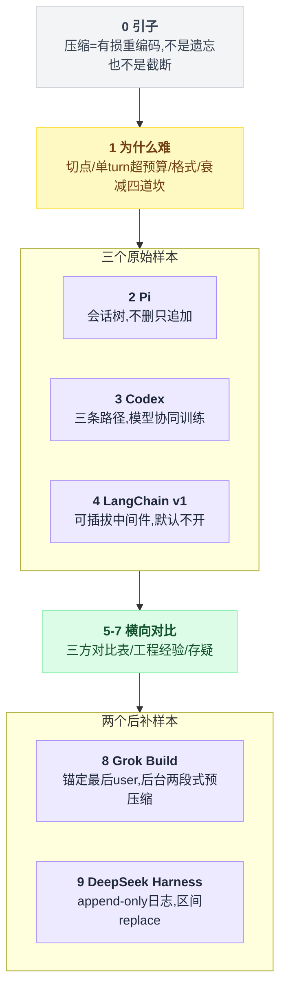

---

## 0. 先搞清楚：这是个什么东西

你可以把一次 agent 会话想成一叠一直在变厚的纸。每轮对话，agent 都把**整叠纸**重新交给模型看一遍——模型是无状态的，它不记得上一次说过什么，你不把历史塞进请求里，它就什么都不知道。

问题是这叠纸有厚度上限，也就是上下文窗口（context window）。

而 agent 恰恰是最能把纸堆厚的用法：一次 `read` 工具调用可能返回 3000 行代码，一次 `bash` 可能吐出几万字符的编译日志。人类聊天要几百轮才能撑爆的窗口，coding agent 可能十几轮就到顶。到顶之后 API 直接返回错误，会话彻底卡死。

**压缩（compaction，也叫 summarization）就是在快撑爆之前，把最旧的那一摞纸抽出来，让一个 LLM 读完写成一页纸的摘要，然后用这一页纸替换掉那一摞。**最近的若干轮原样保留——因为正在做的事需要精确细节，而三小时前那次探索只需要知道结论。

上下文快撑爆时其实有三条路可走，先把它们摆在一起：

| 做法 | 做了什么 | 成本 | 后果 |
|---|---|---|---|
| 遗忘 | 信息直接消失 | 零 | agent 重复劳动 |
| 截断 | 无脑丢掉前 N 条消息 | 零 | 信息损失不可控 |
| 压缩 | 有损重编码：原文没了，结构化信息留下 | 一次 LLM 调用（几秒 + 真金白银的 token 费用） | 换取一份可控的信息保留 |

压缩留下的所谓「结构化信息」，具体指「目标是什么、做到哪一步、下一步干嘛、改过哪些文件」这几样。

而遗忘之后 agent 会重复劳动：再读一遍同一个文件、再犯一遍同一个错。**压缩的核心 KPI 就是让 agent 不重复劳动。**

三条路怎么分岔，画出来更直接：

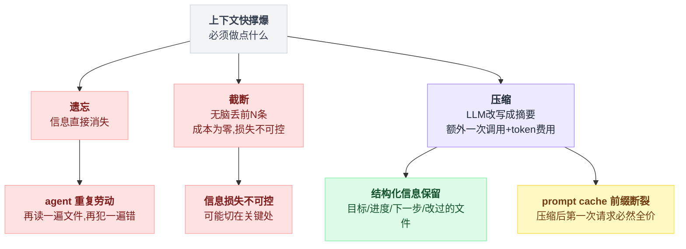

还有一个不那么直觉的成本：**prompt cache**。

主流 API 会缓存请求前缀，前缀不变就便宜十倍。压缩会把历史的中段整个替换掉，缓存前缀从此断裂——压缩之后的第一次请求必然是全价。

所以压缩不是「免费的清理」，它是一笔一次性支出，触发得太勤会明显烧钱。

---

## 1. 为什么这件事很难

四道坎：切点切错会报错、单个 turn 就能超预算、摘要格式既要给模型看又不能让模型接话、反复压缩会信息衰减。第一道是刚性的（切错就 400），后三道是质量问题。

### 1.1 切点切错会直接让 API 报错

这是最刚性的约束。工具调用在协议层是**成对**的：assistant 消息里有一个 `tool_call`（带 id），后面必须跟一条 `tool_result`（带同样的 id）。

如果你的切点正好落在 `tool_result` 上，保留下来的历史就是一条无主的 tool result，模型 API 会直接拒绝请求（OpenAI/Anthropic 都会报 400）。

反过来切在 assistant 上是安全的：assistant 带着它的 tool call 一起被保留，后面的 tool result 也在保留区。

结论是**合法切点必须显式枚举**，不能靠「往前数 N 条」这种朴素规则。

切点合不合法，一张图能说清楚：

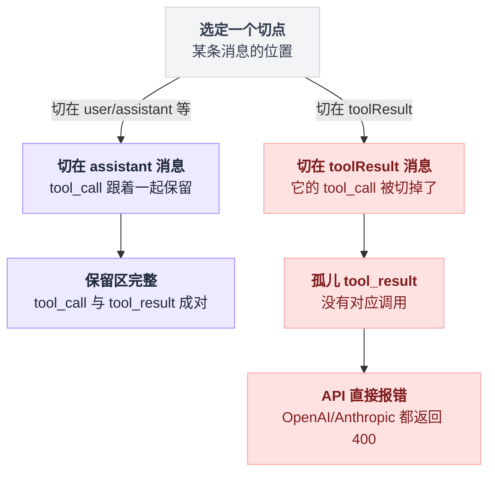

### 1.2 单个 turn 就能超预算

设计上大家都想「按 turn 边界切」，一个 turn = 一条用户消息 + 后续所有 assistant/tool 往返。

但 coding agent 里一个 turn 完全可能自己就 8 万 token——用户说一句「重构这个模块」，agent 读了 40 个文件。

这时候没有可用的 turn 边界，只能切在 turn 中间。而 turn 中间被切开的前半段是没有上下文的（读者不知道这一堆工具调用是为了什么），摘要质量会崩。

### 1.3 摘要格式：既要给模型看，又不能让模型接话

摘要是喂给「下一个 LLM」的交接文档，不是给人看的。两个坑：

一是**格式必须结构化**。自由散文式的摘要，模型很难从中判断「哪些事已经做完了不要重做」。所以三家都收敛到了带固定小节的模板。

二是**序列化的对话文本会被模型当成真对话继续**。你把历史打包成一段文本发给模型让它总结，如果这段文本长得像对话，模型很可能不写摘要而是直接回答对话里最后那个问题。必须显式加角色标记 + 系统提示压住。

### 1.4 反复压缩的信息衰减

第 N 次压缩时，输入里包含第 N-1 次的摘要。摘要的摘要的摘要——每一层都在丢信息，而且丢得不可逆。Codex 甚至在每次本地压缩完成后直接弹一条警告告诉用户这件事（见 3.3）。

还有一个具体的坑，第一次读的时候很容易滑过去：如果第 N 次压缩从「第 N-1 次的压缩点」起算，那么上一次幸存下来的那些消息会**在没有被任何摘要覆盖的情况下被丢弃**——它们既不在旧摘要里（旧摘要没总结它们），又被新的切点甩出了保留区。

Pi 专门处理了这个 case，做法见 2.3。

---

## 2. Pi 的做法

### 2.1 一句话概括

以「session 是一棵 entry 树」为前提，压缩不删除任何东西——只追加一条 `CompactionEntry`，重建上下文时靠 `firstKeptEntryId` 跳过被摘要覆盖的那一段；切点在合法消息类型上枚举求解，单 turn 超预算时降级为「两段式摘要」。

### 2.2 机制拆解

**触发条件**有三个入口（`agent-session.ts`）：

| 入口 | 条件 | reason |
|---|---|---|
| `/compact [instructions]` | 用户手动，可带聚焦指令 | `manual` |
| 阈值 | `contextTokens > contextWindow - reserveTokens`（默认 reserve=16384） | `threshold` |
| 溢出恢复 | 上一次请求已经报了 context overflow / 被截断 | `overflow` |

溢出恢复这条路会先把失败的那条 assistant 消息从 agent 内存状态里摘掉，压缩完再重试一次；`_overflowRecoveryAttempted` 保证只重试一次，避免死循环。摘掉失败消息的代码在 `agent-session.ts` 里处理[^1]。

**保留量**由 `keepRecentTokens`（默认 20000）控制，从最新往回累加估算 token，够了就在附近找一个合法切点。

**摘要落盘**成一条 `CompactionEntry`，字段包括 `summary`、`firstKeptEntryId`、`tokensBefore`、`usage`、`details: { readFiles, modifiedFiles }`。原始消息**一条都不删**，只是不再进入 LLM 上下文。

三个入口怎么走到同一套切点搜索，画一张流程图：

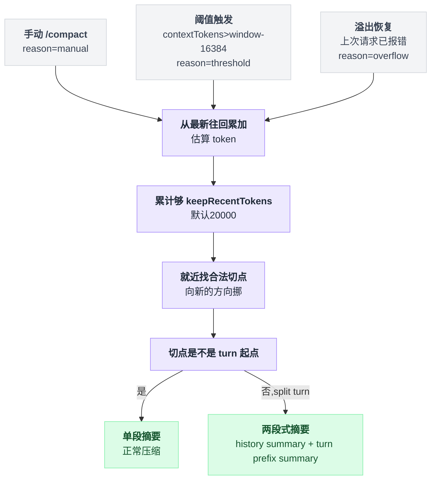

### 2.3 源码

先看合法切点的枚举——这是 1.1 那条硬约束的直接体现[^2]：

```typescript
function isCutPointMessage(message: AgentMessage): boolean {
	switch (message.role) {
		case "user":
		case "assistant":
		case "bashExecution":
		case "custom":
		case "branchSummary":
		case "compactionSummary":
			return true;
		case "toolResult":
			return false;
	}
	return false;
}
```

`toolResult` 是唯一被明确排除的类型。函数上方的注释写得很清楚：*"When we cut at an assistant message with tool calls, its tool results follow it and will be kept."*——切在 assistant 上，它的 tool result 自然落在保留区里，配对不会断。

切点求解的循环长这样：

```
accumulated = 0
cutIndex = cutPoints[0]                    // 兜底：从第一条消息开始全留（不含 header）
for i = 最新 → 最旧:
    t = 这条 entry 展开成 context message 后的估算 token
    if t == 0: continue                    // 空消息跳过，不计入预算
    accumulated += t
    if accumulated >= keepRecentTokens:    // 预算耗尽
        cutIndex = 第一个 >= i 的合法切点     // 注意方向：往「更新」的一侧找
        break

startsTurn  = cutIndex 这条是不是 turn 起点
isSplitTurn = (not startsTurn) and 能找到它所属 turn 的起点
```

关键在倒数第四行：**找到预算耗尽的位置 `i` 之后，是再往后（更新的方向）找最近的合法切点**——宁可少留一点，也不能切在非法位置。实现如下[^3]：

```typescript
	// Walk backwards from newest, accumulating estimated message sizes
	let accumulatedTokens = 0;
	let cutIndex = cutPoints[0]; // Default: keep from first message (not header)

	for (let i = endIndex - 1; i >= startIndex; i--) {
		const entry = entries[i];
		const messageTokens = sessionEntryToContextMessages(entry).reduce(
			(sum, message) => sum + estimateTokens(message), 0,
		);
		if (messageTokens === 0) continue;
		accumulatedTokens += messageTokens;

		// Check if we've exceeded the budget
		if (accumulatedTokens >= keepRecentTokens) {
			// Find the closest valid cut point at or after this entry
			for (let c = 0; c < cutPoints.length; c++) {
				if (cutPoints[c] >= i) { cutIndex = cutPoints[c]; break; }
			}
			break;
		}
	}
	// ...
	const cutEntry = entries[cutIndex];
	const startsTurn = isTurnStartEntry(cutEntry);
	const turnStartIndex = startsTurn ? -1 : findTurnStartIndex(entries, cutIndex, startIndex);
	return {
		firstKeptEntryIndex: cutIndex,
		turnStartIndex,
		isSplitTurn: !startsTurn && turnStartIndex !== -1,
	};
```

token 估算用的是 `chars/4` 启发式（`estimateTokens`，图片按 4800 字符算），作者注释说这是刻意保守的（overestimate）。

如果切点不是 turn 起点，`isSplitTurn = true`，进入两段式摘要（`compact()`[^4]）：先对完整的历史部分生成一份 history summary（maxTokens = `0.8 * reserveTokens`），再对被切开的 turn 前缀单独生成一份 turn prefix summary（maxTokens = `0.5 * reserveTokens`，用一个不同的、更窄的模板：`## Original Request` / `## Early Progress` / `## Context for Suffix`），最后拼成：

```
{historyText}

---

**Turn Context (split turn):**

{turnPrefixText}
```

**重复压缩的起点**——这是 1.4 那个具体坑的解法[^5]：

```typescript
	let previousSummary: string | undefined;
	let boundaryStart = 0;
	if (prevCompactionIndex >= 0) {
		const prevCompaction = pathEntries[prevCompactionIndex] as CompactionEntry;
		previousSummary = prevCompaction.summary;
		const firstKeptEntryIndex = pathEntries.findIndex((entry) => entry.id === prevCompaction.firstKeptEntryId);
		boundaryStart = firstKeptEntryIndex >= 0 ? firstKeptEntryIndex : prevCompactionIndex + 1;
	}
```

`boundaryStart` 取的是**上一次的 `firstKeptEntryId`**，不是上一次的压缩点。

也就是说，上次幸存下来的那批消息，这次会被**重新纳入摘要范围**——它们的内容会进入新摘要，然后才被丢弃。文档里的原话：*"This preserves messages that survived the earlier compaction by including them in the next summarization pass as well."*[^6]

同时 `previousSummary` 被传下去，走 `UPDATE_SUMMARIZATION_PROMPT` 这条「增量更新」路径而不是从头重写。

1.4 那个坑具体怎么补上，对照着看：

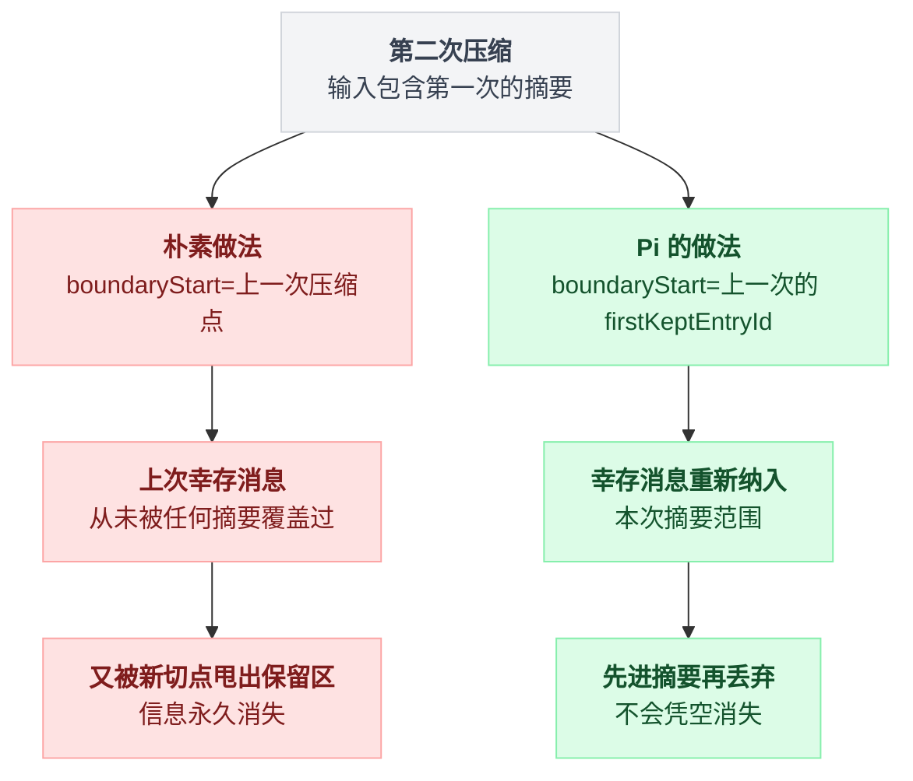

**序列化防接话**[^7]：

```typescript
export function serializeConversation(messages: Message[]): string {
	const parts: string[] = [];
	for (const msg of messages) {
		if (msg.role === "user") {
			const content = contentText(msg.content, "");
			if (content) parts.push(`[User]: ${content}`);
		} else if (msg.role === "assistant") {
			// ... thinking / text / toolCall 分别打标
			if (thinkingParts.length > 0) parts.push(`[Assistant thinking]: ${thinkingParts.join("\n")}`);
			if (msg.content.some((block) => block.type === "text")) parts.push(`[Assistant]: ${contentText(msg.content)}`);
			if (toolCalls.length > 0) parts.push(`[Assistant tool calls]: ${toolCalls.join("; ")}`);
		} else if (msg.role === "toolResult") {
			const content = contentText(msg.content, "");
			if (content) parts.push(`[Tool result]: ${truncateForSummary(content, TOOL_RESULT_MAX_CHARS)}`);
		}
	}
	return parts.join("\n\n");
}
```

三个设计点叠在一起：

1. 整段历史被压成**一条 user 消息**里的纯文本（外面还裹 `<conversation>` 标签），不是真的 message 数组，模型不会认为自己在续对话；
2. 每条都带 `[User]:` / `[Assistant thinking]:` 这种角色前缀；
3. tool result 截断到 `TOOL_RESULT_MAX_CHARS = 2000` 字符，并附上「还有多少字符被截断」的标记。

第三点是纯经济考虑——文档说 tool result（尤其 `read` 和 `bash`）是上下文体积的主要来源，摘要用不着全文。

系统提示再兜一层[^8]：*"Do NOT continue the conversation. Do NOT respond to any questions in the conversation. ONLY output the structured summary."*

**压缩请求本身的隔离**[^9]：

```typescript
export async function completeSummarization(
	model: Model<any>, context: Context, options: SimpleStreamOptions,
	streamFn?: StreamFn, retry?: RetryPolicy, callbacks?: RetryCallbacks,
): Promise<AssistantMessage> {
	// Summaries are standalone requests, so isolate routing and avoid cache writes that cannot be reused.
	const requestOptions: SimpleStreamOptions = {
		...options,
		cacheRetention: "none",
		sessionId: uuidv7(),
	};
	// ...
}
```

摘要请求用**全新的 routing session ID**、并关闭 prompt cache 写入。理由写在注释里：这是一次性 prompt，缓存下来也没人会复用，写缓存反而要多付 cache-write 费用。

这是个很容易被忽略的细节——很多实现会顺手复用主会话的 session/cache 配置，白花钱还污染缓存。（这条结论在第 9 节遇到了一个正面反例，到那里再说。）

**历史重建**在 session-manager 里，是纯函数式的树遍历[^10]：

```typescript
	const contextEntries: SessionEntry[] = [compaction];
	let foundFirstKept = false;
	for (let i = 0; i < compactionIdx; i++) {
		const entry = path[i];
		if (entry.id === compaction.firstKeptEntryId) foundFirstKept = true;
		if (foundFirstKept) contextEntries.push(entry);
	}
	contextEntries.push(...path.slice(compactionIdx + 1));
	return contextEntries;
```

摘要放最前，然后是 `firstKeptEntryId` 之后的所有原始 entry，再接上压缩之后新产生的 entry。摘要最终以 user 消息的形式进入上下文，外面裹一层说明[^11]：

```
The conversation history before this point was compacted into the following summary:

<summary>
...
</summary>
```

**摘要模板**[^12]是固定六节：`## Goal` / `## Constraints & Preferences` / `## Progress`（下分 Done / In Progress / Blocked）/ `## Key Decisions` / `## Next Steps` / `## Critical Context`，末尾要求 *"Preserve exact file paths, function names, and error messages."*。

摘要生成完之后，代码再机械地拼上文件清单：

```
<read-files>
path/to/a.ts
</read-files>

<modified-files>
path/to/b.ts
</modified-files>
```

这两个列表**不依赖 LLM 生成**，而是从被摘要消息里的 `read` / `write` / `edit` 工具调用参数直接抽出来[^13]，并且从上一次压缩的 `details` 里累加继承[^14]。

这是很聪明的一手：文件路径是最不能容忍幻觉的信息，把它从 LLM 手里拿走交给确定性代码。

### 2.4 代价与适用边界

- 一次 split turn 压缩要打**两次** LLM 调用，延迟叠加。
- token 估算是 `chars/4`，跨语言（中文、代码）误差不小；不过它只用来定切点，真正的触发判定用的是 provider 返回的真实 `usage`（`estimateContextTokens` 会优先用最后一条 assistant 的 usage，只对其后的尾巴做估算）。
- 「不删除只追加」意味着 session 文件会一直增长；换来的是压缩完全可回溯、可以用 `/tree` 跳回压缩前的任意点。
- **分支摘要（branch summarization）**是 Pi 独有的第二套机制：用 `/tree` 跳到另一条分支时，把即将被抛弃的那条分支（从旧叶子回溯到公共祖先）总结成一条 `BranchSummaryEntry`，挂到新位置上[^15]。它复用同一套序列化 + 系统提示，但用自己的模板和自己的前言（*"The user explored a different conversation branch before returning here."*）。这个机制只在有会话树的产品里成立——LangChain 和 Codex 都是线性历史，压根没有这个问题。

---

## 3. Codex 的做法

### 3.1 一句话概括

压缩被建模成一种特殊的 turn，有三条互斥的实现路径（本地摘要 / 服务端 `/compact` 端点 / 干脆不摘要直接开新窗口），压缩后的历史是**「若干条原始 user 消息 + 一条摘要」**——中间所有的 assistant 输出和工具往返全部丢弃。

### 3.2 机制拆解

**触发点三处**，都在 `codex-rs/core/src/session/turn.rs`：

| 触发时机 | 入口函数 |
|---|---|
| `/compact` 手动 | `run_compact_task` / `run_remote_compact_task` / `run_manual_compact_task` |
| turn 开始前 | `run_pre_sampling_compact` |
| turn **进行中**（模型还要继续工作，但 token 已经到顶） | `run_auto_compact(..., CompactionPhase::MidTurn)` |

第 2 条还额外覆盖了两种「模型切换」场景（`maybe_run_previous_model_inline_compact`）：模型的 `comp_hash`（压缩兼容性哈希）变了，或者用户从大窗口模型切到小窗口模型且当前上下文塞不下——都用**旧模型**先压一次，避免新模型第一句话就溢出。

**阈值**[^16]：

```rust
    // Force compaction once the buffered window or the model's full context window is reached.
    let full_context_window_limit_reached =
        full_context_window_limit.is_some_and(|limit| active_context_tokens >= limit);
    let token_limit_reached = buffered_auto_compact_limit
        .is_some_and(|limit| auto_compact_scope_tokens >= limit)
        || full_context_window_limit_reached;
```

`auto_compact_scope_limit` 来自配置项 `model_auto_compact_token_limit`，没配的话取模型默认值[^17]：

```rust
    pub fn auto_compact_token_limit(&self) -> Option<i64> {
        let context_limit = self
            .resolved_context_window()
            .map(|context_window| (context_window * 9) / 10);
        let config_limit = self.auto_compact_token_limit;
        if let Some(context_limit) = context_limit {
            return Some(config_limit.map_or(context_limit, |limit| std::cmp::min(limit, context_limit)));
        }
        config_limit
    }
```

即**窗口的 90%**，且配置值只能更小不能更大。`models.json` 里所有模型的 `auto_compact_token_limit` 都是 `null`，所以实际生效的就是 272000 × 0.9 ≈ 244800。

还有一个 `model_auto_compact_token_limit_scope`：`Total` 表示按完整上下文计算，`BodyAfterPrefix` 表示只计算「本压缩窗口内新增的部分」（减掉 prefill 基线）——后者是为了让「携带的前缀很大」的场景不至于一开局就触发压缩。

**三条实现路径的分发**[^18]：

```rust
    if turn_context.config.features.enabled(Feature::TokenBudget) {
        crate::compact_token_budget::run_inline_auto_compact_task(...).await?;
        return Ok(());
    }
    match turn_context.provider.capabilities().remote_compaction {
        RemoteCompactionSupport::V2 if ...Feature::RemoteCompactionV2... => { run_inline_remote_auto_compact_task_v2(...) }
        RemoteCompactionSupport::V1 | RemoteCompactionSupport::V2 => { run_inline_remote_auto_compact_task(...) }
        RemoteCompactionSupport::Unsupported => { run_inline_auto_compact_task(...) }  // 本地
    }
```

三条实现路径怎么分发，画成判定树：

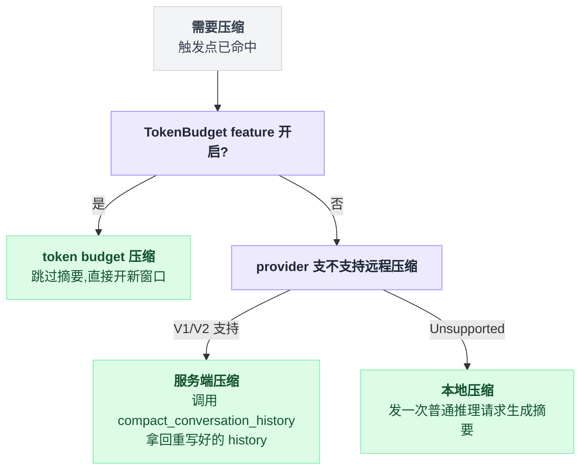

- **本地压缩**（`compact.rs`）：Codex 自己把整个历史 + 摘要 prompt 发一次普通推理请求，拿回摘要文本。
- **服务端压缩**（`compact_remote*.rs`）：调 `model_client.compact_conversation_history(...)`，**由服务端返回一份重写好的 history**（`Vec<ResponseItem>`）。这是 Pi 和 LangChain 都没有的形态——压缩策略被搬到了模型提供方，客户端只负责清洗返回结果。
- **token budget 压缩**（`compact_token_budget.rs`）：**跳过摘要**，直接开一个新的上下文窗口。

第三条最反直觉，它的注释把设计意图讲得很直白[^19]：

```rust
/// Runs token-budget manual compaction as a normal compaction lifecycle.
///
/// Token-budget compaction skips model/server summarization and installs a fresh context window
/// instead. It is still modeled as compaction so compact hooks and `ContextCompaction` turn items
/// observe the same lifecycle as local or remote compaction.
```

配套的还有一个「提前收尾」机制：`TokenBudgetConfig` 里有 `reminder_threshold_tokens` 和 `reminder_message_template`（模板里 `{n_remaining}` 会被替换成剩余 token 数），在还剩一定预算时先给模型发一条提醒，让它自己把当前工作收个尾、把关键信息写进产出里。

`auto_compact_fallback_prompt` + `auto_compact_fallback_buffer_tokens` 则是在阈值之上再留一小段缓冲，专门用来让模型做一次「记笔记」。

**这等于把摘要的责任从压缩器转移给了模型自己。**

### 3.3 源码

本地压缩最关键的一段，是压缩完之后**新历史怎么拼**。先看意思：

```
收下的 = []
for m in 历史里的所有 user 消息，从最新往最旧:
    if 累计 token + m 会超过 COMPACT_USER_MESSAGE_MAX_TOKENS(20_000):
        把 m 按 token 截断后收下; break
    收下的 += m

新历史 = 倒序回正(收下的)                       // 全部作为 user 消息 push 进去
新历史.push(user 消息: SUMMARY_PREFIX + 摘要正文)
// assistant 回复、reasoning、工具调用与结果：一条都不留
```

也就是说，**Codex 的压缩后历史 = 近 2 万 token 的原始用户指令 + 一条摘要**。实现在 `build_compacted_history_with_limit`[^20]，调用方长这样[^21]：

```rust
    let history_snapshot = sess.clone_history().await;
    let history_items = history_snapshot.raw_items();
    let summary_suffix = get_last_assistant_message_from_turn(history_items).unwrap_or_default();
    let summary_text = format!("{SUMMARY_PREFIX}\n{summary_suffix}");
    let user_messages = collect_user_messages(history_items);

    let mut new_history = build_compacted_history(Vec::new(), &user_messages, &summary_text);
```

这和 Pi「保留最近 20k token 的完整往返」是完全相反的取舍：Codex 认为用户说过的话是最不能丢的锚点（用户指令通常很短、信息密度极高），而 agent 自己做过的事全部交给摘要。

模型侧也被明确告知了这一点——`models.json` 的 `instructions_template` 里写着：

> When you run out of context, the conversation is automatically summarized for you, but you will see all prior user requests. Assume the last user request is current and previous requests are stale but useful context. […] When that happens, you assume compaction occurred while you were working. Do not restart from scratch […] treat a turn spanning compactions as one logical chain of events.

摘要前缀本身也是写给模型看的第二人称交接词（`prompts/templates/compact/summary_prefix.md`）：

> Another language model started to solve this problem and produced a summary of its thinking process. You also have access to the state of the tools that were used by that language model. Use this to build on the work that has already been done and avoid duplicating work.

摘要 prompt 则短得多（`prompts/templates/compact/prompt.md`，全文 9 行），只有四个要点：progress and key decisions / important context and constraints / what remains / critical data and references。没有 Pi 那种带 checkbox 的严格模板。

**mid-turn 压缩的特殊性**——这段注释是本章最有信息量的一处[^22]：

```rust
/// Controls whether compaction replacement history must include initial context.
///
/// Pre-turn/manual compaction variants use `DoNotInject`: they replace history with a summary and
/// clear `reference_context_item`, so the next regular turn will fully reinject initial context
/// after compaction.
///
/// Mid-turn compaction must use `BeforeLastUserMessage` because the model is trained to see the
/// compaction summary as the last item in history after mid-turn compaction; we therefore inject
/// initial context into the replacement history just above the last real user message.
pub(crate) enum InitialContextInjection {
    BeforeLastUserMessage { world_state: Arc<WorldState>, step_context: Arc<StepContext> },
    DoNotInject,
}
```

*"the model is **trained to** see the compaction summary as the last item in history"*——压缩后历史的**物理排布顺序**是模型训练时约定好的契约。

这在三个项目里是独一份的：Pi 和 LangChain 的压缩都是纯客户端行为，摘要放哪儿是自由设计；Codex 的压缩行为则是模型侧协同训练过的。

所以 `insert_initial_context_before_last_real_user_or_summary`[^23] 要费一大段逻辑去找「最后一条真实 user 消息」的位置，只为了保证摘要仍然是最后一项。

**服务端压缩**的客户端侧只有请求和清洗两步[^24]：

```rust
    let new_history = sess
        .services
        .model_client
        .compact_conversation_history(
            &prompt, &turn_context.model_info, turn_state,
            CompactConversationRequestSettings { effort, summary, service_tier },
            &turn_context.session_telemetry, compaction_trace, &responses_metadata,
        )
        .await?;
```

返回的 history 不能直接信任，要过一遍白名单[^25]：

| 角色 | 处理 |
|---|---|
| `developer` | 全丢（避免重复注入 stale 指令） |
| `user` | 只保留能解析成 `TurnItem::UserMessage` 或 `HookPrompt` 的（滤掉会话前缀包装） |
| reasoning / function call / function call output / web search | 全丢 |

V2 路径[^26]在此之上还有一个 `RETAINED_MESSAGE_TOKEN_BUDGET = 64_000` 的保留预算和 `MAX_RETAINED_AGENT_MESSAGE_TOKENS = 10_000` 的单条上限。

**信息衰减**在 Codex 里不是隐忧，是直接告诉用户的既成事实[^27]：

```rust
    let warning = EventMsg::Warning(WarningEvent {
        message: "Heads up: Long threads and multiple compactions can cause the model to be less accurate. Start a new thread when possible to keep threads small and targeted.".to_string(),
    });
```

### 3.4 代价与适用边界

- 丢弃全部 assistant/tool 往返是极其激进的。好处是压缩后上下文极小、恢复余量最大；坏处是「刚刚那次 grep 输出了什么」这类紧邻的操作细节完全靠摘要转述——如果摘要漏了，agent 就得重跑一次。
- 服务端压缩把质量和延迟都外包了：客户端拿不到摘要文本（`CompactedHistoryMetadata { message: String::new(), .. }`，remote 路径这个字段是空的），只能拿到重写后的 history；换来的是策略可以随模型一起迭代、不用发客户端版本。代价是**只对 OpenAI 后端可用**（`RemoteCompactionSupport::Unsupported` 时才 fallback 到本地）。
- 「模型被训练成期待摘要在最后」是强耦合：换一个模型这个契约就不成立。这是产品型 agent 才能吃到的红利，也是框架永远吃不到的。
- 压缩请求自身也可能超窗。Codex 的处理是从最旧一端逐条丢弃后重试（`history.remove_first_item()`[^28]），注释写的是 *"Trim from the beginning to preserve cache (prefix-based) and keep recent messages intact."* ——⚠️ 未确认：从头部删除会改变前缀，「preserve cache」这个理由在字面上和 prefix cache 的语义有点冲突，我没找到能解释这句话的其他代码。

---

## 4. LangChain v1 的做法

### 4.1 一句话概括

压缩不是内建能力，而是一个**可插拔的中间件（middleware）**——`SummarizationMiddleware` 挂在 `before_model` 钩子上；同时官方还提供了完全不同的第二条路线 `ContextEditingMiddleware`：不摘要，直接把老的 tool result 原地清空。

两条路线并排摆出来更好比：

```mermaid
flowchart TD
    subgraph M1["SummarizationMiddleware"]
        A1["<b>触发</b><br/>tokens/messages/fraction 可组合"]
        A2["<b>找安全切点</b><br/>向旧回溯,拉回配对 AIMessage"]
        A3["<b>LLM 生成摘要</b><br/>HumanMessage 插最前"]
        A4["<b>REMOVE_ALL_MESSAGES</b><br/>原地覆写 state"]
    end
    subgraph M2["ContextEditingMiddleware"]
        B1["<b>触发</b><br/>trigger=100000 token"]
        B2["<b>从最旧 tool result 开始</b><br/>逐条清空 content"]
        B3["<b>换成占位符</b><br/>默认「cleared」"]
        B4["<b>state 不变</b><br/>只在发给模型的副本上裁剪"]
    end

    A1 --> A2 --> A3 --> A4
    B1 --> B2 --> B3 --> B4

    classDef main fill:#ede9fe,stroke:#a78bfa,color:#1f2937
    classDef data fill:#dcfce7,stroke:#86efac,color:#14532d
    classDef entry fill:#f3f4f6,stroke:#d1d5db,color:#374151
    classDef danger fill:#fee2e2,stroke:#fca5a5,color:#7f1d1d
    classDef note fill:#fef9c3,stroke:#fde047,color:#713f12
    class A1,B1 entry
    class A2,A3,B2,B3 main
    class A4,B4 data
```

### 4.2 机制拆解

这是「框架 vs 产品」这条轴上最典型的一处分野。

Pi 和 Codex 的压缩是**必然发生**的产品行为（Pi 可以 `"enabled": false` 关掉，但代码在那儿）；LangChain 的 `create_agent()` **默认不带任何压缩**——`factory.py` 里没有任何地方自动插入 `SummarizationMiddleware`，它只在 `middleware/__init__.py` 里被导出。

你不显式传，长会话就是会撑爆。

代价是配置面暴露得非常宽：

| 参数 | 可取什么 |
|---|---|
| `trigger` | `("tokens", 3000)` / `("messages", 50)` / `("fraction", 0.8)`；也可以是 `{"tokens": 4000, "messages": 10}`（子句内 AND）；还可以是这些的 list（子句间 OR） |
| `keep` | 同样三种度量，默认 `("messages", 20)` |
| `summary_prompt`、`token_counter`、`trim_tokens_to_summarize` | 全部可换，`trim_tokens_to_summarize` 默认 4000 |
| `model` | 摘要用的模型是独立参数——可以用一个便宜的小模型专门做摘要 |

触发判定还有个细节：token 数优先用**真实 usage**。`_should_summarize_based_on_reported_tokens` 会去翻最后一条 `AIMessage` 的 `usage_metadata.total_tokens`，但只有在这条消息的 `model_provider` 和当前模型的 `ls_provider` 匹配时才采信（`_provider_matches`，带一张 provider 别名表）——防止混用多个模型时拿错模型的 token 数当判据。

### 4.3 源码

主流程短得惊人[^29]：

```python
        messages = state["messages"]
        self._ensure_message_ids(messages)

        total_tokens = self.token_counter(messages)
        if not self._should_summarize(messages, total_tokens):
            return None

        cutoff_index = self._determine_cutoff_index(messages)
        if cutoff_index <= 0:
            return None

        messages_to_summarize, preserved_messages = self._partition_messages(messages, cutoff_index)

        summary = self._create_summary(messages_to_summarize)
        new_messages = self._build_new_messages(summary)

        return {
            "messages": [
                RemoveMessage(id=REMOVE_ALL_MESSAGES),
                *new_messages,
                *preserved_messages,
            ]
        }
```

历史重建方式和 Pi 截然不同：`RemoveMessage(id=REMOVE_ALL_MESSAGES)` 是 LangGraph 的一个特殊哨兵，语义是「清空 messages 通道」，然后把摘要 + 保留消息重新写进去。

**这是真的原地覆写**——state 里旧消息没了。（历史仍可从 checkpointer 的旧快照里翻出来，但当前 state 不含。）

摘要以 `HumanMessage` 的形式插在最前[^30]：

```python
    @staticmethod
    def _build_new_messages(summary: str) -> list[HumanMessage]:
        return [
            HumanMessage(
                content=f"Here is a summary of the conversation to date:\n\n{summary}",
                additional_kwargs={"lc_source": "summarization"},
            )
        ]
```

切点安全处理是本章最值得对照的一段——它和 Pi 走的是**相反方向**。先看机制：

```
if messages[cut] 不是 ToolMessage: return cut     // 绝大多数情况直接放行

ids = {} ; idx = cut
while messages[idx] 是 ToolMessage:               // 把连续的这一批 ToolMessage 的 id 全收集
    ids += messages[idx].tool_call_id
    idx += 1

for i = cut-1 → 0:                                // 往旧的方向找配对的那条 AIMessage
    if messages[i] 是带 tool_calls 的 AIMessage and ids 与它的 id 有交集:
        return i                                  // 把 AIMessage 一起纳入保留区

return idx                                        // 兜底：找不到配对，反过来向新跳过这批孤儿
```

一句话：**Pi 是「切点往新的方向挪，多总结一点」；LangChain 默认是「切点往旧的方向挪，多保留一点」**，只有在找不到配对 AIMessage 的异常情况下才反过来向前跳过这些孤儿 ToolMessage。源码如下[^31]：

```python
    @staticmethod
    def _find_safe_cutoff_point(messages: list[AnyMessage], cutoff_index: int) -> int:
        """Find a safe cutoff point that doesn't split AI/Tool message pairs.

        If the message at `cutoff_index` is a `ToolMessage`, search backward for the
        `AIMessage` containing the corresponding `tool_calls` and adjust the cutoff to
        include it. ...
        """
        if cutoff_index >= len(messages) or not isinstance(messages[cutoff_index], ToolMessage):
            return cutoff_index

        # Collect tool_call_ids from consecutive ToolMessages at/after cutoff
        tool_call_ids: set[str] = set()
        idx = cutoff_index
        while idx < len(messages) and isinstance(messages[idx], ToolMessage):
            tool_msg = cast("ToolMessage", messages[idx])
            if tool_msg.tool_call_id:
                tool_call_ids.add(tool_msg.tool_call_id)
            idx += 1

        # Search backward for AIMessage with matching tool_calls
        for i in range(cutoff_index - 1, -1, -1):
            msg = messages[i]
            if isinstance(msg, AIMessage) and msg.tool_calls:
                ai_tool_call_ids = {tc.get("id") for tc in msg.tool_calls if tc.get("id")}
                if tool_call_ids & ai_tool_call_ids:
                    return i  # 把 AIMessage 一起纳入保留区

        # Fallback: no matching AIMessage found, advance past ToolMessages
        return idx
```

这里有个对不上的地方：`_find_safe_cutoff` 的 docstring 说的是 *"This is aggressive with summarization"*，和 `_find_safe_cutoff_point` 实际的向后回溯行为对不上——⚠️ 未确认，看起来是 docstring 没跟上一次行为修改（git 历史未查）。

按 token 保留时走二分（`_find_token_based_cutoff`，行 654-701），找到「后缀 token 数不超过预算」的最早下标，然后同样过一遍 `_find_safe_cutoff_point`。

**给摘要模型的输入也要限流**[^32]：

```python
    def _trim_messages_for_summary(self, messages: list[AnyMessage]) -> list[AnyMessage]:
        try:
            if self.trim_tokens_to_summarize is None:
                return messages
            return cast("list[AnyMessage]", trim_messages(
                messages, max_tokens=self.trim_tokens_to_summarize,
                token_counter=self.token_counter, start_on="human",
                strategy="last", allow_partial=True, include_system=True,
            ))
        except Exception:
            return messages[-_DEFAULT_FALLBACK_MESSAGE_COUNT:]
```

默认只把**最后 4000 token** 的待摘要内容喂给摘要模型。

这个默认值相当激进：如果你的 trigger 是 100k token，那被丢弃的 96k 里有 92k 从来没被任何模型看过一眼，直接消失。这是 LangChain 和另外两家最大的行为差异，也是一个必须显式覆盖的默认值。

序列化用 `get_buffer_string(..., format="xml")`——同样是「打成一段文本」而不是真消息数组，防接话逻辑和 Pi 一致。

摘要调用失败不抛异常，返回 `f"Error generating summary: {e!s}"` 当摘要正文（行 838）——会话不会崩，但上下文里会多一句错误信息，⚠️ 这个降级行为在生产环境需要自己监控。

**第二条路线**：`ContextEditingMiddleware` 完全不做摘要[^33]。

```python
@dataclass(slots=True)
class ClearToolUsesEdit(ContextEdit):
    trigger: int = 100_000          # 超过多少 token 触发
    clear_at_least: int = 0         # 至少回收多少 token
    keep: int = 3                   # 最近几条 tool result 必须保留
    clear_tool_inputs: bool = False # 是否连 tool call 的参数一起清空
    exclude_tools: Sequence[str] = ()
    placeholder: str = DEFAULT_TOOL_PLACEHOLDER   # "[cleared]"
```

它从最旧的 tool result 开始，逐条把 `content` 换成 `"[cleared]"`，直到回收够 `clear_at_least` 个 token。

**消息结构完全不动**——AIMessage 和 ToolMessage 的配对关系原样保留，所以根本不存在切点问题。

而且它挂的是 `wrap_model_call` 而不是 `before_model`，对 `deepcopy` 出来的副本做修改，**state 里的原始消息不受影响**——也就是说这是「发给模型时才裁剪」，不是「永久性改写历史」。

这条路线的取舍非常清晰：零 LLM 调用、零延迟、零幻觉风险、消息 id 前缀不变（对 prompt cache 更友好，因为只有中段内容变了，不过前缀缓存仍然会从第一条被清空的消息处断裂）；代价是被清空的 tool result 内容**真的没了**，没有任何摘要兜底。它是 Anthropic `clear_tool_uses_20250919` 的模型无关实现。

### 4.4 代价与适用边界

- 默认不启用 = 新手最容易踩的坑。框架把决策权交给用户，也把失败责任交给了用户。
- `trim_tokens_to_summarize=4000` 的默认值和「trigger 通常是几万 token」这个典型配置严重不匹配，几乎一定要覆盖。
- 保留区**不做「摘要之后第一条必须是什么」的约束**：摘要是 HumanMessage，紧跟其后的保留消息完全可能是一条带 tool_calls 的 AIMessage。协议上合法，但语义上会出现「用户说了一段摘要 → 助手直接开始调工具」这种没有触发因的序列。
- 没有跨压缩的累积状态（Pi 的 `<read-files>` / `<modified-files>`，Codex 的 window 编号）。第二次压缩的输入里包含第一次那条摘要 HumanMessage（它就在保留区里往前排），但没有任何机制保证摘要模型会保留它——纯靠 prompt 里那句「不要重复已完成的动作」。
- 真正的价值在**可替换性**：`AgentMiddleware` 是公开基类，你可以直接写一个自己的压缩中间件（比如把旧消息存进向量库、需要时检索回来），不用 fork 任何东西。Pi 用 extension 事件（`session_before_compact`）也能做到类似的事，但那是在 Pi 的框子里定制；LangChain 是整个机制本来就是你的。

---

## 5. 三方横向对比

| 维度 | Pi | Codex | LangChain v1 |
|---|---|---|---|
| 是否默认开启 | 是（`enabled: true`） | 是 | **否**，必须显式挂 middleware |
| 触发条件 | `contextTokens > window − 16384`；`/compact`；overflow 恢复重试 | `tokens ≥ min(config, window×0.9)`；turn 前 / turn 中 / `/compact`；模型切换 | 用户定义：tokens / messages / fraction，可 AND/OR 组合 |
| token 来源 | 优先真实 usage，尾部用 chars/4 估算 | 真实 usage（`get_total_token_usage`） | 近似计数，若最后一条 AIMessage 的 provider 匹配则采信其 `usage_metadata` |
| 保留多少 | `keepRecentTokens=20000` 的**完整往返** | 近 20k token 的**原始 user 消息**，其余全丢 | 默认最近 20 条消息（可改为 token / fraction） |
| 合法切点 | 显式白名单：user/assistant/bashExecution/custom/两种 summary；`toolResult` 排除 | 不存在切点概念——按消息**类型**过滤重建 | 命中 ToolMessage 时向前回溯到配对的 AIMessage |
| 切点冲突时的方向 | 向新的方向挪（多总结） | N/A | 向旧的方向挪（多保留） |
| 单 turn 超预算 | split turn，两次 LLM 调用生成两段摘要合并 | 不特殊处理（反正 assistant 消息全丢） | 不特殊处理 |
| 重复压缩起点 | 上一次的 `firstKeptEntryId`（幸存消息重新纳入） | 上一个 window（`advance_auto_compact_window`） | 上一条摘要 HumanMessage 之后（无显式机制） |
| 摘要模板 | 6 节固定 markdown + 机械生成的 `<read-files>`/`<modified-files>` | 9 行自由要点 + `SUMMARY_PREFIX` 第二人称交接词 | 4 节（SESSION INTENT / SUMMARY / ARTIFACTS / NEXT STEPS），可整体替换 |
| 防「模型接话」 | `[User]:` 前缀序列化 + `<conversation>` 包裹 + 系统提示 | 摘要 prompt 作为一条普通 user 消息追加在真实历史后 | `get_buffer_string(format="xml")` + prompt 末尾显式约束 |
| 待摘要内容限流 | tool result 截断到 2000 字符 | `COMPACT_USER_MESSAGE_MAX_TOKENS=20000`（保留区）；V2 保留预算 64k | `trim_tokens_to_summarize=4000`（**只喂最后 4k token**） |
| 压缩请求的 cache | 显式 `cacheRetention: "none"` + 新 sessionId | 复用 turn 的 client session（sticky routing 跨重试保持） | 无特殊处理，标记 `lc_source: "summarization"` 供追踪过滤 |
| 历史重建 | 追加 `CompactionEntry`，重建时跳过区间（**原始数据永不删除**） | `replace_compacted_history()` 整体替换 | `RemoveMessage(REMOVE_ALL_MESSAGES)` + 重写 state |
| 服务端压缩 | 无 | **有**（`/compact` 端点，V1/V2），仅 OpenAI 后端 | 无 |
| 不摘要的降级路径 | 无 | **有**（token budget：直接开新窗口 + 提前提醒模型收尾） | **有**（`ContextEditingMiddleware`：清空老 tool result） |
| 分支/树场景 | **有**（branch summarization） | 无（线性历史） | 无（线性历史） |
| 可定制程度 | extension 事件 `session_before_compact` 可取消/接管 | 配置项 + `experimental_compact_prompt_file`；策略选择由 feature flag 和 provider 能力决定 | 整个中间件可替换，`AgentMiddleware` 是公开基类 |
| 模型侧协同 | 无 | **有**（instructions_template 明写压缩语义；mid-turn 摘要位置是训练契约） | 无 |

---

## 6. 可以拿走的工程经验

1. **切点必须用白名单枚举，不能用「往前数 N 条」。**照抄 Pi 的 `isCutPointMessage`：显式列出哪些消息类型可以当切点，`toolResult` 一律返回 false。如果你的消息类型会增长（比如以后加了 `bashExecution`、`custom`），用 `switch` 穷举而不是 `if (role !== "toolResult")`——前者在加新类型时会被类型检查器拦下来，后者会静默地把新类型当成合法切点。

2. **文件路径这类高精度信息，从 LLM 手里拿走。**Pi 的 `<read-files>` / `<modified-files>` 是从工具调用参数里机械抽取 + 跨压缩累加的，不经过摘要模型。任何「不能有幻觉」的结构化事实（改过的文件、跑过的命令、创建的资源 ID）都应该这么处理。适用条件：你的工具调用参数是结构化的、路径/ID 在固定字段里。

3. **重复压缩要从上一次的保留边界起算，不是从上一个压缩点起算。**否则上次幸存下来的消息会在从未被任何摘要覆盖的情况下永久消失。这个 bug 只在第二次压缩时才暴露，测试很容易漏。

4. **压缩请求要显式关掉 prompt cache 写入、并用独立的 routing session。**摘要 prompt 是一次性的，写缓存纯亏钱；共用主会话的 session id 还可能污染 sticky routing。Pi 的 `cacheRetention: "none"` + `uuidv7()` 两行就搞定。适用条件：你的 provider 支持显式控制缓存写入（Anthropic 的 cache_control、OpenAI 的部分接口）。

5. **认真考虑「不摘要」的降级路线。**Codex 的 token budget 模式（提前提醒模型收尾 → 直接开新窗口）和 LangChain 的 `ContextEditingMiddleware`（清空老 tool result）都是零 LLM 调用的方案。在「上下文膨胀主要来自巨大的 tool result、而非复杂的推理链」这个很常见的场景里，清掉老的 tool result 往往比摘要更划算：没有延迟、没有幻觉、结构不变。先量一下你的上下文里 tool result 占比多少再决定用哪条路。

6. **把「压缩发生过」这件事写进系统提示。**Codex 在 instructions_template 里明确告诉模型「你可能看到的是摘要而不是完整历史，不要从头再来，把跨压缩的一个 turn 当成一条逻辑链」。即便你没法像 OpenAI 那样训练模型，一句系统提示的边际成本几乎为零，能显著减少「压缩后 agent 重新开始探索」这个失败模式。

7. **给摘要模型的输入限流值要和触发阈值一起设。**LangChain 默认 `trigger` 由你定（常见几万 token），但 `trim_tokens_to_summarize` 默认只有 4000——两者不匹配时，绝大部分被丢弃的内容从没被任何模型读过。要么调大它，要么像 Pi 那样只截断 tool result（保留消息骨架）而不是整体截断。

---

## 7. 本章存疑

1. **Codex 的一处注释**[^34]：`// Trim from the beginning to preserve cache (prefix-based) and keep recent messages intact.` ——从历史头部删除 item 会改变请求前缀，按 prefix cache 的语义这恰恰会**破坏**缓存。我没找到能解释这句话的其他代码（可能指的是某种非前缀的缓存机制，或者注释已过时）。⚠️ 未确认。

2. **LangChain `_find_safe_cutoff` 的 docstring** 写 *"This is aggressive with summarization - if the target cutoff lands in the middle of tool messages, we advance past all of them (summarizing more)"*，但它调用的 `_find_safe_cutoff_point` 实际行为是**向后回溯**到配对的 AIMessage（保留更多），只在找不到配对时才向前跳过。看起来是行为改过而 docstring 没跟上。⚠️ 未确认（未查 git 历史）。

3. **Codex 服务端压缩端点的实际策略**在客户端源码里看不到——`compact_conversation_history` 只是一次 HTTP 调用，服务端怎么切、用什么模型、摘要模板长什么样，完全不可见。本章关于 remote compaction 的描述仅限于客户端能观察到的部分（请求构造 + 返回结果的白名单清洗）。

4. **Pi 的 `keepRecentTokens` 与 `reserveTokens` 的相互作用**：触发时上下文已经 ≥ `window − 16384`，压缩后保留 ~20000 token 加上摘要。如果 `keepRecentTokens` 被用户配得比 `reserveTokens` 还大很多，压缩完可能仍然接近阈值从而立刻再次触发。代码里没看到对这两个值的相互校验，也没看到压缩后的「冷却期」（只有 `assistantIsFromBeforeCompaction` 这个基于时间戳的防抖，防的是用旧 usage 误触发，不是防连环压缩）。⚠️ 未确认是否存在实际的连环压缩风险。

---

## 8. 第四个样本：Grok Build

> 调研时间 2026-08-06，`xai-org/grok-build` commit `a5589e9`；全项目背景见 [17 番外](./17-番外-GrokBuild全项目速览.md)。本节只看压缩维度。

**一句话**：客户端 full-replace 压缩，但切点既不是 Pi 的"白名单向新挪"也不是 LangChain 的"向旧回溯"，而是**第四种哲学：钉死在语义锚点——最后一条真实 user 消息**；并且它是四个样本里唯一对**压缩延迟**做工程优化的（prefire 两段式后台预压缩）。

### 8.1 切点：语义锚点，不是 token 预算

`recent_messages: extract_messages_since_last_real_user(conversation)`——**最后一条真实 user 消息（排除合成前缀和 `__auto_continue__` 哨兵）之后的全部消息原样保留**，之前的整体换成 LLM 摘要[^35]。

压缩后历史结构有注释给出的公式[^36]：

```
[SP, UP', AGENTS_MD?, UQ_last?, recent…, summary, reminder?]
```

即原 system prompt + user 前缀 + **AGENTS.md 原文** + 最后真实 user query（`<user_query>` 包裹）+ verbatim 尾巴 + 摘要 + `<system-reminder>`。

两个本章前文呼应点：

- **AGENTS.md 原文重注入**，注释原话 "Re-inject AGENTS.md as a user message so project instructions survive compaction verbatim (not dependent on the summarizer)"[^37]——第 1 节讲的"项目指令被摘要丢失"风险，Grok 用结构保证而非摘要质量保证。
- 尾巴放不下时的**降级梯子**："verbatim → fitted → lossy input ladder"[^38]：先原样、再裁剪、最后只留 last_user_query。

tool-pair 配对安全靠什么？切点是 user 消息，天然不会落在 tool_call/tool_result 之间——**用锚点类型回避了 Pi/LangChain 要处理的配对断裂问题**。

库里另有一套按 token 预算回溯、"向新方向 snap"的 `select_turns_to_compact`（注释同样点名 orphan tool results 会被 API 以 400 拒绝）[^39]，但那是 Grok **chat** 侧的 intra 压缩用的，不是 grok-build 主路径。

### 8.2 触发与 prefire 两段式：把压缩延迟藏进后台

自动阈值 **85%**，判定用 bytes/4 估算：

| 项 | 值 |
|---|---|
| 默认阈值常量 | `DEFAULT_AUTO_COMPACT_THRESHOLD_PERCENT: u8 = 85`[^40] |
| 解析五级（依次回落） | env `GROK_AUTO_COMPACT_THRESHOLD_PERCENT` → 用户 per-model → 用户全局 → 远端 per-model → 远端全局 → 85 |
| 另有四类触发 | 手动 `/compact [text]`、context-length 错误恢复、preflight overflow、切小窗口模型[^41] |

**prefire 两段式**是这一节的重点，机制是这样的：

```
if 用量 >= 阈值-10% 且 NOTE1 尚未缓存:
    后台跑: NOTE1 = 摘要(前 95% 历史)     // 按估算 token 权重分割
                                          // split 点同样做 tool-pair 边界 snap
    NOTE1.fingerprint = 前缀指纹

if 用量 >= 85%:                           // 真到阈值了
    最终摘要 = 重写(NOTE1 + 最后 5% 尾巴)  // 前台只需要等这一次

// rewind / 历史编辑 → 指纹对不上 → NOTE1 作废
```

分割比例常量是 `TWO_PASS_DEFAULT_SPLIT_FRACTION = 0.95`，指纹字段是 `fingerprint_prefix`[^42]。

Pi/Codex/LangChain 的压缩都是同步阻塞在触发点的——这是四个样本里唯一把压缩延迟当性能问题处理的。

把压缩延迟藏进后台是怎么做到的，时序图摆一下：

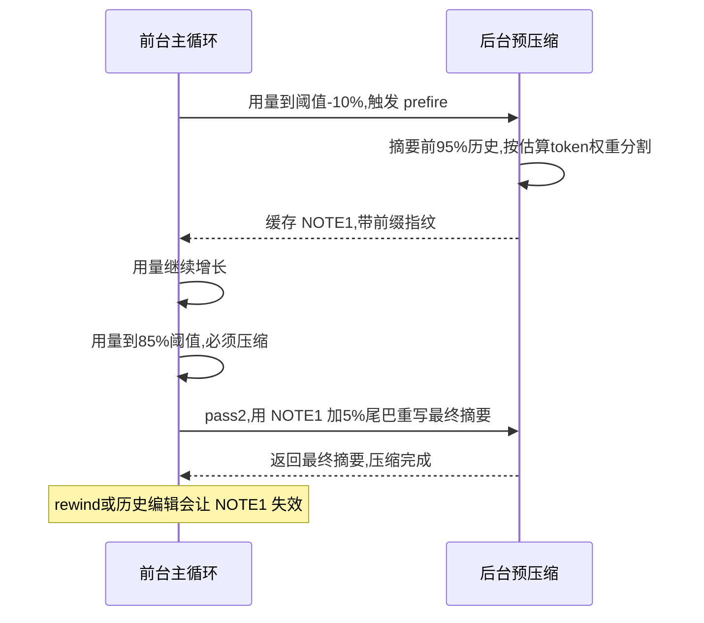

失败处理：默认 3 次尝试、单次 120s 超时；**摘要 < 500 字符判 degenerate 触发重试**，注释给了经验依据："the smallest healthy prod summary observed was ~3,242 chars"[^43]。

### 8.3 摘要 prompt：第四家也收敛到结构化模板

第 1 节说"三家都收敛到了带固定小节的模板"——第四家同样如此，而且是 9 节：`full_replace_summary_prompt.txt`（4,058 字节）要求 Primary Request and Intent / Key Technical Concepts / Files and Code Sections / Errors and Fixes / Problem Solving / All User Messages / Pending Tasks / Current Work / Optional Next Step。

三句值得逐字记录：

- 目标句："produce a faithful, concise summary … so that a successor assistant can continue the work seamlessly after the earlier turns are discarded. … A focused summary that fits is far more useful than an exhaustive one that gets cut off"。
- 链式压缩的传递句："If earlier turns include a prior compaction summary … treat it as authoritative for the early history and carry its still-relevant information forward"。
- 防注入句："Do NOT include this summarization instruction itself — it is a system-generated compaction prompt, not a real user message"；结尾还有一段防摘要模型误读压缩残档的："those files are an out-of-band memory channel for a FUTURE work agent, not for you. … Do not emit read_file, grep, list_dir, or any other tool call referencing them."

一个热知识：压缩请求默认带工具定义且 `tool_choice: auto`[^44]，所以 prompt 里才需要 "IMPORTANT: Do NOT call or use any tools"。

压缩后的 `<system-reminder>` 还会重建**活动状态**：Running Background Tasks / TODO List / Running Subagents 三节[^45]——压缩不丢后台任务和 todo，这是另外三家都没显式处理的。

### 8.4 压缩残档：被丢弃的上下文可以被找回

`CompactionMode::Summary/Transcript/Segments` 三档（session/compaction_segments.rs）：Segments 模式把被压掉的消息写进会话目录 `compaction/`，摘要尾部附 transcript_hint 指路——模型事后可以 `read_file` 找回被压缩的细节。

对照 Pi 的"压缩不删数据、日志里都在"（但模型自己够不着）和 Codex 的服务端黑盒：Grok 把"可找回"做成了**模型可自助**的。

### 8.5 本节未确认

- grok-build 侧压缩用会话当前模型；chat 侧配置里出现了专用压缩模型名 `grok-4.20`（未发布型号）[^46]。远端 settings 是否会给 build 侧也指定专用压缩模型，⚠️ 未确认。
- prefire pass1 与主循环采样的并发资源竞争（是否共享限流预算），⚠️ 未确认。

---

## 9. 第五个样本：DeepSeek Harness

> 调研时间 2026-08-14，`deepseek-ai/deepseek-harness` v0.1.0-rc.5（commit `47f9438`）；全项目背景见 [18 番外](./18-番外-DeepSeekHarness全项目速览.md)。本节只看压缩维度。

**一句话**：压缩在 dsh 不是「重建历史」而是**在 append-only 日志上对 model-visible surface 做一次 `replace` 区间替换**——切点因此不是一个点而是一个两端都必须「tool-call 括号平衡」的区间，起点恒等于 surface 头节点；方向上最像 LangChain（向旧回退、多保留），结构上最像 Pi（原始数据一条不删），但**摘要请求刻意构造成会话的真前缀以命中 provider KV cache**，是四家都没有的第五种答案，且与本章经验 4（Pi 的 `cacheRetention:"none"`）正面相左。

### 9.1 切点：头锚定区间 + 括号计数，不是「往哪边挪一条消息」

`selectCompactableRange()` 干的事：

```
keepFromIdx = 从最新往回累加 priced node，够 retainTokens 就停在这里
while keepFromIdx > 0 且 该处 tool-call 括号不平衡:
    keepFromIdx -= 1                 // 保留区往「旧」的方向长
if keepFromIdx == 0: return null     // 全都得留，没得压

压缩区间 = [ surfaceNodes[0] , surfaceNodes[keepFromIdx] 之前 )
//          ↑ 起点恒为会话最头，不是上一次的压缩点
```

对应源码如下[^47]，回退循环那几行是：

```ts
// region.ts:122-127（省去 oxlint pragma 行）
while (keepFromIdx > 0) {
  if (toolPairingBalancedBefore(session, surfaceNodes[keepFromIdx]!)) break
  keepFromIdx -= 1
}
if (keepFromIdx === 0) return null
```

`keepFromIdx -= 1` = **保留区往旧的方向长**，和 LangChain 同向、和 Pi 反向。但压缩区间的 `start` 永远是 `surfaceNodes[0]`[^48]，即**每次都从会话最头上压到保留尾之前**。

三个连带结论：

1. 上一次的 summary checkpoint 必然在本次压缩区间里 → 本章 1.4 那个「幸存消息从未被任何摘要覆盖」的坑**在结构上不可能发生**，Pi 需要 `boundaryStart = 上次 firstKeptEntryId` 才能修的事，dsh 是免费的。
2. 合法性判据不是「消息类型白名单」而是**括号匹配**：`assistant/message` 里每个 `tool-call` block +1、每个 `tool/result` −1，某个 cut 合法 ⟺ 该处未闭合调用数为 0[^49]，并按 `surface.replaceGeneration` 做增量缓存。这是本章「合法切点必须显式枚举」的第五种实现——枚举变成了计数。
3. `compactRegion(start, end, …)` 是公开 API：**任意区间**都能压，两端各查 `toolPairingBalancedBefore/After`，不平衡直接抛错[^50]。文档明说区间「preserve tool-call/result pairing but not whole turns」（非代码注释）[^51]——**允许压掉一个超大 turn 的前半段**，正是本章 1.2 说的那种情况，而且不需要 Pi 的两段式摘要。

回头看，五家在「切点到底往哪边挪」这件事上给出了五种不同答案：

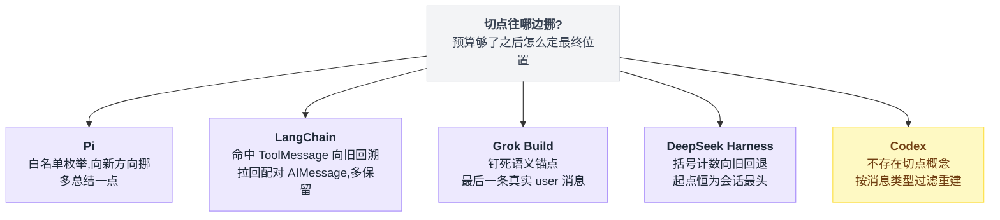

### 9.2 压缩与 session log：只追加，surface 是投影

session log 是 append-only 的唯一事实源，模型历史是它的投影。

`SurfaceOp` 有且只有两种，`'append'` 和 `{ op:'replace', start, end }`，后者「Used by compaction; any surface-replacing producer may use it」[^52]。

一次成功压缩**追加 4 条事件**：`compaction/start` → `compaction/summary`（log-only，不进 surface）→ 一条带 `surfaceOp:{op:'replace'}` 的 `user/message` → `compaction/end`[^53]。被遮蔽的节点全部列进新节点的 `sourceEventSeqs`，日志里一个字都没删。

日志是事实源，surface 只是它的一个投影，画出来看结构：

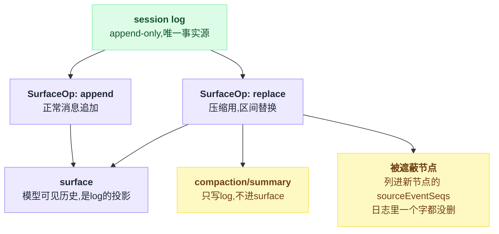

锁的语义值得抄：`compaction/end` 最后写，所以**中途崩溃留下的是可检测的孤儿 start，而不是一条谎称压缩完成的 end**[^54]（断言「successful `compaction/end` requires one `compaction/summary`」[^55]）。

失败的尝试也照样落日志、照样闭合，`ManualCompactionErrorCode` 有六种：`busy|cancelled|changed|summary|commit|persistence`[^56]。

### 9.3 摘要请求复用 KV cache——本章经验 4 的反例

摘要指令不是 system prompt，而是**贴在被压历史后面的最后一条 user 消息**，前面原样铺会话自己的 system prompt、tool schemas 和区间消息：

```ts
// compaction-basic/src/summarizer.ts:24-30（注释原文）
 * Keeping the conversation's own system prompt, tools, and message prefix in
 * front of it makes the auxiliary call a genuine prefix of the last routed
 * request, so the provider's KV cache is reused instead of invalidated.
```

`buildSummarizationInput()` 的注释同样点名 *"the call is a genuine prefix of the conversation and reuses the provider's KV cache"*[^57]。

这套只有在**区间头锚定**时才成立——正因为压缩区间总是从头开始，它才恰好是上一次真实请求的前缀。

Pi 的结论（摘要是一次性 prompt，写 cache 纯亏钱）在 dsh 被反过来用：既然前缀已经是热的，就只多付「一条指令」的 uncached input。**本章经验 4 应降级为「取决于你的切点是否头锚定」**：Codex/LangChain/Pi 的摘要输入都不是会话前缀，dsh 的是。

代价是每次压缩都要把整段被压区间原样重放一遍当输入（上限约 threshold 减保留尾，不随会话总长增长——区间头就是上一次的 checkpoint），且请求里带着全套 tools[^58]，所以 prompt 里必须写「do not call any tool」——和 Grok 8.3 撞上的是同一个坑。

这次调用还带 `purpose:'compaction'`，llm-deepseek 适配器据此加一个 `x-deepseek-harness-compact: '1'` 请求头[^59]。

同一个问题（摘要请求要不要写缓存），Pi 和 dsh 给出了相反答案：

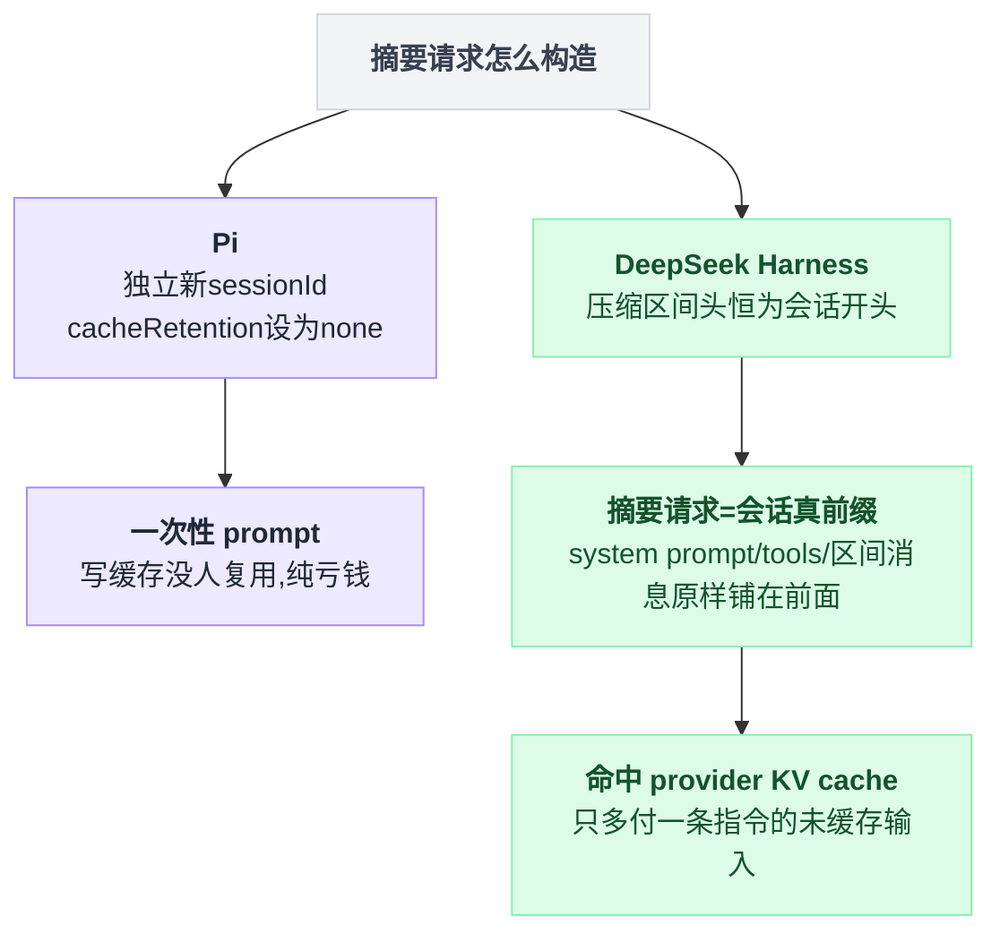

### 9.4 摘要模板：8 节 + 三条防线

`COMPACTION_INSTRUCTION`[^60] 要求 `## Primary Request and Intent / Key Technical Concepts / Files and Code / Errors and Fixes / Pending Jobs / Current Work / Next Step / Critical Context` **八节一节不许少**（"Write \"(none)\" for an empty section — never drop a section."）。

第五家继续印证本章 1.3：所有人都收敛到固定小节模板。

三句逐字值得记：

- 链式压缩：*"If the conversation already contains a `<compacted-summary>` block, it is a PRIOR checkpoint. Do not copy it forward verbatim: preserve still-true facts, drop stale ones, and merge newer information into a single consolidated summary under the same structure."*[^61]
- 防自指：*"Do NOT mention this summarization request or that the context was compacted."*[^62]
- 落盘前言（写进那条替换 user 消息）[^63]：*"This is an automatically generated checkpoint condensing an earlier span of the conversation to free up context. … Continue the task directly from the messages that follow, without acknowledging this checkpoint."*

三道机械防线，都不靠模型自觉：

| 防线 | 行为 |
|---|---|
| 摘要含图片 | 直接拒[^64] |
| `max-tokens` 截断 | 视为失败而非将就（"incomplete checkpoint"）[^65] |
| 框好的摘要 token 数必须严格小于被遮蔽内容 | 否则抛错、本次压缩作废（surface 不动）[^66] |

最后一条是四家都没有的守恒断言。

### 9.5 两条零 LLM 路径：pruner 在压缩前，spill 在进上下文前

- **`ctx.toolResultPruner`**（`compaction-tool-result-pruner`）：确定性 head/middle/tail 剪枝，默认 `thresholdChars 8192 / headChars 4096 / tailChars 1024`，中段换成 `'\n\n[... tool result middle pruned ...]\n\n'`[^67]，按 **Unicode code point** 切以免劈开代理对。压力和 overflow 两条路都**先剪再选区间再重新计量**[^68]，剪完若已降到阈值以下就**根本不叫模型**。和 LangChain 的 `ContextEditingMiddleware` 相比：那个改的是 deepcopy、state 不动；dsh 是**落进日志的 `replace` 事件**[^69]，原事件仍在日志里被 `sourceEventSeqs` 引着——持久且可回放。
- **`packages/spill`**（3 个包 / 664 行）：`tools/post-execute` 上把超过 `maxInlineBytes`（base bundle 配 50000）的纯文本结果**整份存盘**，模型侧只留 head/tail 预览 + locator + retrievalHint[^70]，模型可以自己 `read`/`grep` 取回（提示词在 spill-local 包里）[^71]。这是 Grok「压缩残档可自助找回」的前置版：**大结果压根不进上下文**，从源头减少压缩频次。best-effort：存盘失败就保留原文，绝不把成功的工具调用变成 `isError`（同文件 154-161 行）。

### 9.6 token 计量：anchor + 有符号 delta，能表示「变小了」

`ctx.tokenMeter` 固定启发式 `chars/4` + 每块 4 token 结构开销 + 每条消息 4 token role 开销[^72]。

真正的差异在基线：以最近一次成功请求的 provider usage 为锚，**只在「请求信封完全一致」且「provider 报的总数不低于同口径启发式价」时才采信 usage**[^73]，此后用**有符号** `surfaceDeltaTokens` 跟踪 surface 的增减。

Pi/LangChain 的「usage + 尾巴估算」只能加不能减，压缩后要等下一次真实 usage 才知道降了多少；dsh 因为每次 `replace` 前都紧挨着写一条报价事件（`compaction/summary` 或 `compaction/prune` 的 `shadowedTokenCount`），压缩当场就能把占用算下去（`projectedTokens`，注释原话是让占用「answers for the next request rather than the last one」）[^74]。

阈值、保留量与重试都有校验，摆成表：

| 项 | 值 |
|---|---|
| `thresholdRatio` / `retainRatio` | 0.8 / 0.16，按模型 contextWindow 缩放[^75] |
| 互校验（加载期） | `retainRatio >= thresholdRatio` 在插件加载期就报错[^76] |
| 互校验（缩放后） | 还有一道 `retainTokens >= thresholdTokens`[^77] |
| `compactionRetries` | 默认 1（最多压两轮），两轮后仍超阈值就抛 |
| 异常吞掉 | `agent/pre-step` 监听器吞掉异常继续本轮[^78] |
| 兜底 | `agent/request-error` 上的 overflow 恢复，`maxOverflowRetries` 默认 1；恢复路径 `retainTokens=0`，只保留最后一个 surface 节点[^79] |

那两道互校验，正是本章存疑 4 里 Pi 缺的那个。

### 9.7 AGENTS.md 不是「重注入」，是「重新武装」

Grok 8.1 靠在重建历史时把 AGENTS.md 原文塞回去。dsh 走的是完全另一条路。

dsh 里 system prompt 根本不在 surface 上（它在 `request/header` 事件里，而 `SurfaceEventType` 只有 user/assistant/tool 三种）[^80]，每次请求重新渲染，压缩碰不到。

而目录级 AGENTS.md 是以 `user/message` 形式注入 surface 的，`visibleBaselineSource()` **按 `session.surface.nodes` 判定可见**（另加一批尚未落盘的 authority 消息）[^81]，一旦被压缩遮蔽就视作「不存在」，下一次 pre-step 自动重新组装并注入。

README 的说法是 *"Compaction re-arms a scope after its context event leaves the visible surface even when the cached version is unchanged."*（已在代码中逐行确认）[^82]。

**声明式对账 vs 结构化重建**，这是第五种答案，而且注入方完全不知道「压缩」这回事。

### 9.8 压缩是不是 capability seam：是，配置级可换

`ctx.compaction` 是标准三角：Service Definition `dsh-compaction`（抽象类 `CompactionEngine`）/ Provider `dsh-compaction-basic` / 人类 Consumer `dsh-command-compact`[^83]。

换后端只是改一行 bundle 配置：挂 `compaction-basic`、pruner、spill 各一行[^84]。

子类只需覆盖 `summarize()` 这一个钩子（注释：*"Override this sole hook for a template or remote summarizer"*）[^85]——Codex 的 remote compaction 在 dsh 是一个子类，不是一条分支。

四包 `packages/compaction/*/src/*.ts` 共 **2,880 行**（`wc -l`，不含 tests：compaction 792 / compaction-basic 1,621 / pruner 331 / command-compact 136）。

注意两处产品取舍与另外四家都不同：`/compact` **不接受任何参数**[^86]，没有 Pi/Grok 的聚焦指令；且手动压缩**要求 agent 空闲**，有开着的 turn 直接返回 `busy`[^87]。

### 9.9 本节未确认

- ⚠️ 文档[^83] 把 `dsh-command-compact` 写成 seam 的 Consumer，而另一份文档[^88]的 Consumer 列填的是 `compaction-basic`、并注明「there is no model-facing compact tool」。两处口径不一致，未影响代码行为。
- ⚠️ 头锚定 + 全套 tool schemas 的摘要请求，成本全靠 KV cache 抵消。仓库里没有找到对「第 N 次压缩的摘要请求实际 cache 命中率 / 花费」的任何度量或回归测试，这条设计的收益未被验证。
- ⚠️ 有一处测试[^89]提到编号事故 `CBR-001`（替换 checkpoint 高 seq 落在 surface 头部导致的回归），但 `docs/postmortem/` 只有 0001–0004、无对应条目，全仓库仅该测试文件出现过该编号（第 21、217 行），事故原始记录未公开。

---

## 出处

[^1]: Pi，`packages/coding-agent/src/core/agent-session.ts:2017-2020`，摘掉失败 assistant 消息、避免溢出恢复死循环重试的代码位置。
[^2]: Pi，`packages/coding-agent/src/core/compaction/compaction.ts:308`，`isCutPointMessage()` 定义。
[^3]: Pi，`packages/coding-agent/src/core/compaction/compaction.ts:415`，切点求解循环的实现。
[^4]: Pi，`packages/coding-agent/src/core/compaction/compaction.ts:845-882`，`compact()` 里的两段式摘要（split turn）分支。
[^5]: Pi，`packages/coding-agent/src/core/compaction/compaction.ts:726`，`boundaryStart` 取上一次 `firstKeptEntryId` 的实现。
[^6]: Pi，`packages/coding-agent/docs/compaction.md:79`："This preserves messages that survived the earlier compaction by including them in the next summarization pass as well."
[^7]: Pi，`packages/coding-agent/src/core/compaction/utils.ts:109`，`serializeConversation()` 的实现。
[^8]: Pi，`packages/coding-agent/src/core/compaction/utils.ts:156`，系统提示原文。
[^9]: Pi，`packages/coding-agent/src/core/compaction/compaction.ts:562`，`completeSummarization()` 的实现。
[^10]: Pi，`packages/coding-agent/src/core/session-manager.ts:441`，历史重建的树遍历实现。
[^11]: Pi，`packages/coding-agent/src/core/messages.ts:11`，摘要外层说明文案。
[^12]: Pi，`packages/coding-agent/src/core/compaction/compaction.ts:467-498`，摘要模板定义。
[^13]: Pi，`packages/coding-agent/src/core/compaction/utils.ts:29-56`，`<read-files>`/`<modified-files>` 抽取逻辑。
[^14]: Pi，`packages/coding-agent/src/core/compaction/compaction.ts:42-70`，跨压缩累加继承逻辑。
[^15]: Pi，`packages/coding-agent/src/core/compaction/branch-summarization.ts:108-146`，分支摘要实现。
[^16]: Codex，`codex-rs/core/src/session/context_window.rs:74`。
[^17]: Codex，`codex-rs/protocol/src/openai_models.rs:468`，`auto_compact_token_limit()` 的实现。
[^18]: Codex，`codex-rs/core/src/session/turn.rs:1155-1235`，三条实现路径的分发逻辑。
[^19]: Codex，`codex-rs/core/src/compact_token_budget.rs:21`。
[^20]: Codex，`codex-rs/core/src/compact.rs:629`，`build_compacted_history_with_limit()`。
[^21]: Codex，`codex-rs/core/src/compact.rs:342`，调用方代码。
[^22]: Codex，`codex-rs/core/src/compact.rs:57`，`InitialContextInjection` 枚举定义与注释。
[^23]: Codex，`codex-rs/core/src/compact.rs:559`，`insert_initial_context_before_last_real_user_or_summary()`。
[^24]: Codex，`codex-rs/core/src/compact_remote_request.rs:77`。
[^25]: Codex，`codex-rs/core/src/compact_remote.rs:341`，返回 history 的白名单清洗。
[^26]: Codex，`codex-rs/core/src/compact_remote_v2.rs:444`。
[^27]: Codex，`codex-rs/core/src/compact.rs:383`，衰减警告事件。
[^28]: Codex，`codex-rs/core/src/compact.rs:304-313`，`history.remove_first_item()` 与相关注释。
[^29]: LangChain v1，`langchain/agents/middleware/summarization.py:399`，`SummarizationMiddleware` 主流程。
[^30]: LangChain v1，`langchain/agents/middleware/summarization.py:737`，`_build_new_messages()`。
[^31]: LangChain v1，`langchain/agents/middleware/summarization.py:779`，`_find_safe_cutoff_point()`。
[^32]: LangChain v1，`langchain/agents/middleware/summarization.py:867`，`_trim_messages_for_summary()`。
[^33]: LangChain v1，`langchain/agents/middleware/context_editing.py:57`，`ClearToolUsesEdit` 数据类定义。
[^34]: Codex，`codex-rs/core/src/compact.rs:306`，注释原文："Trim from the beginning to preserve cache (prefix-based) and keep recent messages intact."
[^35]: Grok Build，`xai-chat-state/src/compaction_utils.rs:581-582`，`extract_messages_since_last_real_user()` 用法。
[^36]: Grok Build，`xai-grok-compaction/src/code_compaction/assemble.rs:62-90`，压缩后历史结构公式。
[^37]: Grok Build，`xai-grok-compaction/src/code_compaction/assemble.rs:73-79`。
[^38]: Grok Build，`full_replace_compaction.rs:19-21`。
[^39]: Grok Build，`select.rs:29-64`，`select_turns_to_compact()`。
[^40]: Grok Build，`config.rs:13`，`DEFAULT_AUTO_COMPACT_THRESHOLD_PERCENT`。
[^41]: Grok Build，`session/compaction.rs:1-8`。
[^42]: Grok Build，`session/two_pass.rs:1-13`。
[^43]: Grok Build，`config.rs:15-31`。
[^44]: Grok Build，`resolve/compaction.rs:4-34`。
[^45]: Grok Build，`reminder.rs:116-211`。
[^46]: Grok Build，`intra_compaction/config.rs:208`。
[^47]: DeepSeek Harness，`packages/compaction/compaction-basic/src/region.ts:98-134`；回退循环见 `:122-127`（省去 oxlint pragma 行）。
[^48]: DeepSeek Harness，`packages/compaction/compaction-basic/src/region.ts:130-133`。
[^49]: DeepSeek Harness，`packages/compaction/compaction/src/tool-pairing.ts:29-37, 62-68`。
[^50]: DeepSeek Harness，`packages/compaction/compaction-basic/src/region.ts:327-333`。
[^51]: DeepSeek Harness，`docs/subsystems/compaction.md:86`。
[^52]: DeepSeek Harness，`packages/core/session/src/types.ts:365-374`。
[^53]: DeepSeek Harness，`packages/compaction/compaction-basic/src/region.ts:189、447-465、215`。
[^54]: DeepSeek Harness，`docs/subsystems/compaction.md:19`。
[^55]: DeepSeek Harness，`packages/compaction/compaction/src/invariant.ts:214-216`。
[^56]: DeepSeek Harness，`packages/compaction/compaction/src/index.ts:28-35` 与 `packages/compaction/command-compact/src/index.ts:23-55`，`ManualCompactionErrorCode` 枚举定义与抛出处。
[^57]: DeepSeek Harness，`packages/compaction/compaction-basic/src/region.ts:488-494`，`buildSummarizationInput()` 注释。
[^58]: DeepSeek Harness，`packages/compaction/compaction-basic/src/summarizer.ts:158`。
[^59]: DeepSeek Harness，`packages/llm/llm-deepseek/src/adapter.ts:292-294`。
[^60]: DeepSeek Harness，`packages/compaction/compaction-basic/src/summarizer.ts:31-66`，`COMPACTION_INSTRUCTION`。
[^61]: DeepSeek Harness，`packages/compaction/compaction-basic/src/summarizer.ts:65`。
[^62]: DeepSeek Harness，`packages/compaction/compaction-basic/src/summarizer.ts:63`。
[^63]: DeepSeek Harness，`packages/compaction/compaction-basic/src/summarizer.ts:69-70`。
[^64]: DeepSeek Harness，`packages/compaction/compaction-basic/src/summarizer.ts:220-222`。
[^65]: DeepSeek Harness，`packages/compaction/compaction-basic/src/summarizer.ts:206-209`。
[^66]: DeepSeek Harness，`packages/compaction/compaction-basic/src/region.ts:373-378`。
[^67]: DeepSeek Harness，`packages/compaction/compaction-tool-result-pruner/src/config.ts:10-14`（默认阈值）与 `:7`（中段占位符文案）。
[^68]: DeepSeek Harness，`packages/compaction/compaction-basic/src/index.ts:283-291、308-311`。
[^69]: DeepSeek Harness，`packages/compaction/compaction-tool-result-pruner/src/index.ts:167-173`。
[^70]: DeepSeek Harness，`packages/spill/spill-policy/src/index.ts:190-209`。
[^71]: DeepSeek Harness，`packages/spill/spill-local/src/index.ts:60`。
[^72]: DeepSeek Harness，`packages/llm/token-meter/src/estimate.ts:13-19`。
[^73]: DeepSeek Harness，`packages/llm/token-meter/src/index.ts:125-137、246-248`。
[^74]: DeepSeek Harness，`packages/compaction/compaction-basic/src/usage-projection.ts:142-162、203`，`projectedTokens`。
[^75]: DeepSeek Harness，`packages/compaction/compaction-basic/src/config.ts:20、23`。
[^76]: DeepSeek Harness，`packages/compaction/compaction-basic/src/config.ts:185-190`。
[^77]: DeepSeek Harness，`packages/compaction/compaction-basic/src/config.ts:148-154`。
[^78]: DeepSeek Harness，`packages/compaction/compaction-basic/src/index.ts:155-163`。
[^79]: DeepSeek Harness，`packages/compaction/compaction-basic/src/index.ts:179-223`。
[^80]: DeepSeek Harness，`packages/core/session/src/types.ts:200-210、343-346`。
[^81]: DeepSeek Harness，`packages/context/agent-instructions/src/index.ts:52-57`、`state.ts:140-148`。
[^82]: DeepSeek Harness，`packages/context/agent-instructions/README.md:53`。
[^83]: DeepSeek Harness，`docs/subsystems/compaction.md:5`。
[^84]: DeepSeek Harness，`packages/bundle/base/cordis.patch.yml:284-285`（挂 `compaction-basic`）、`:360-365`（挂 pruner）、`:346-352`（挂 spill）。
[^85]: DeepSeek Harness，`packages/compaction/compaction-basic/src/index.ts:236-246`。
[^86]: DeepSeek Harness，`packages/compaction/command-compact/src/index.ts:13、62-63`。
[^87]: DeepSeek Harness，`packages/compaction/compaction-basic/src/region.ts:172-175`。
[^88]: DeepSeek Harness，`docs/capability-seams.md:457`。
[^89]: DeepSeek Harness，`packages/compaction/compaction-basic/tests/compaction-loop-repro.spec.ts:20-25`。
