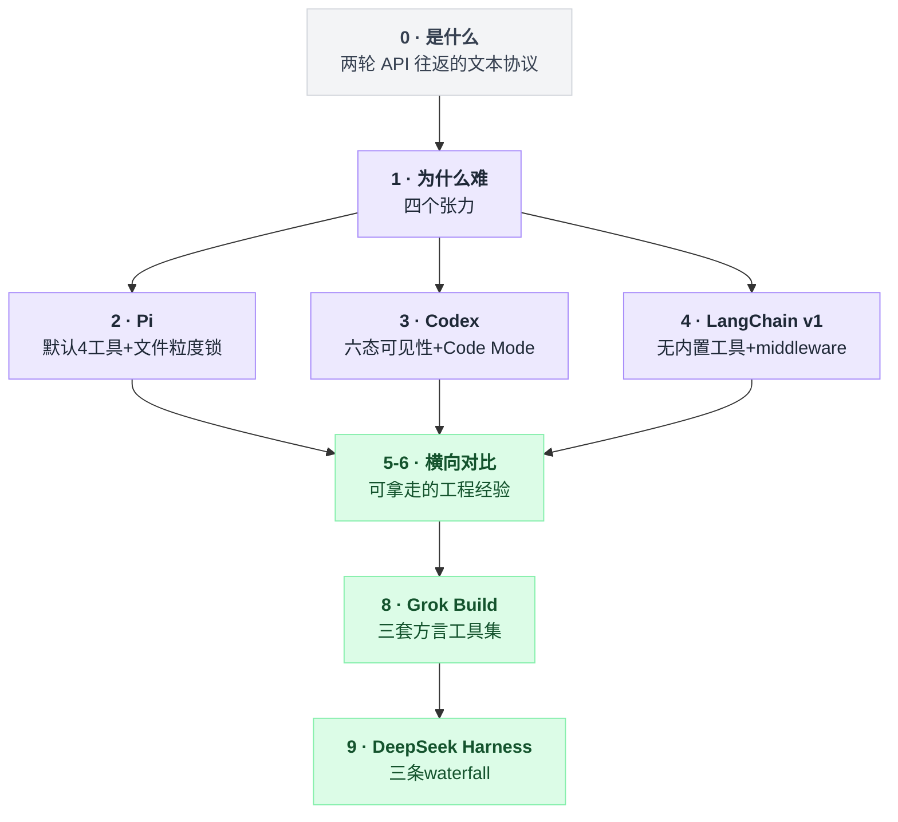
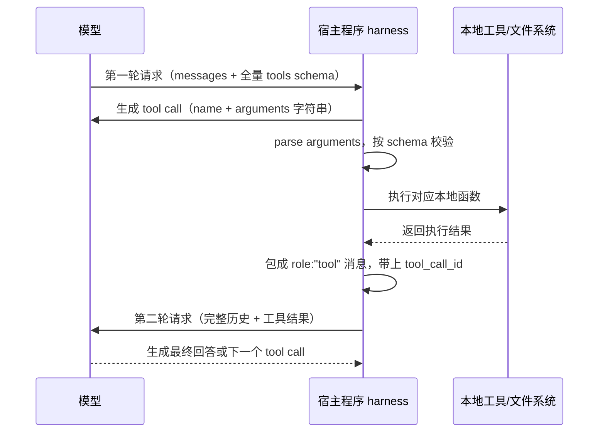
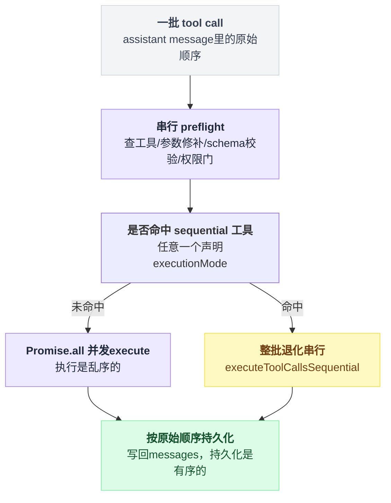
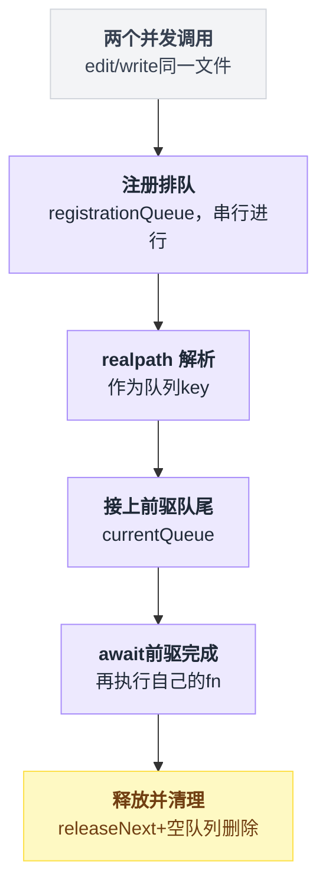
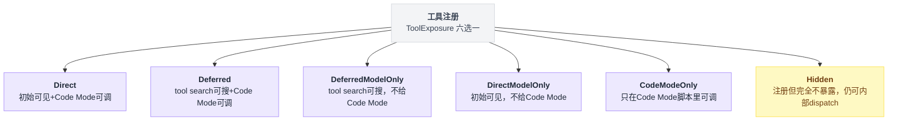
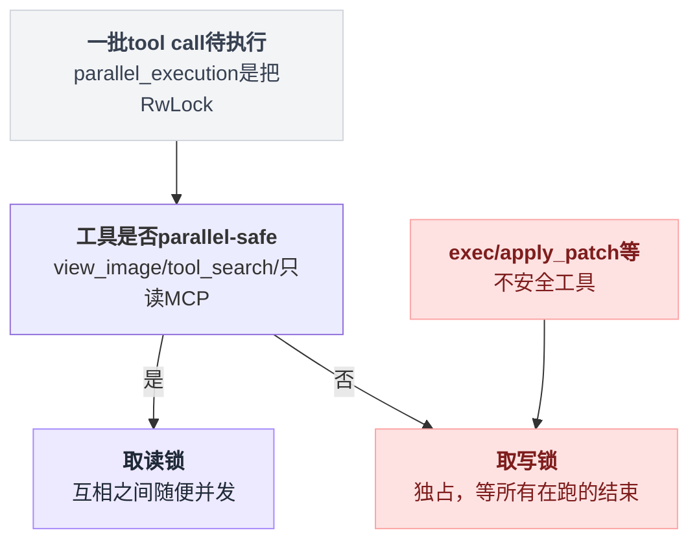
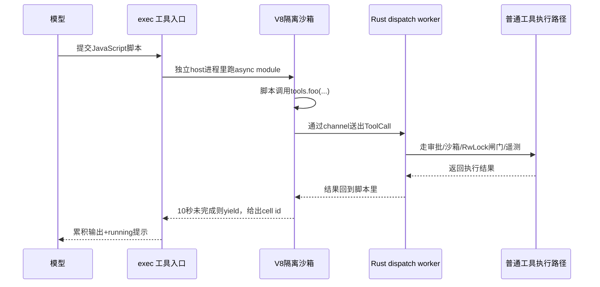
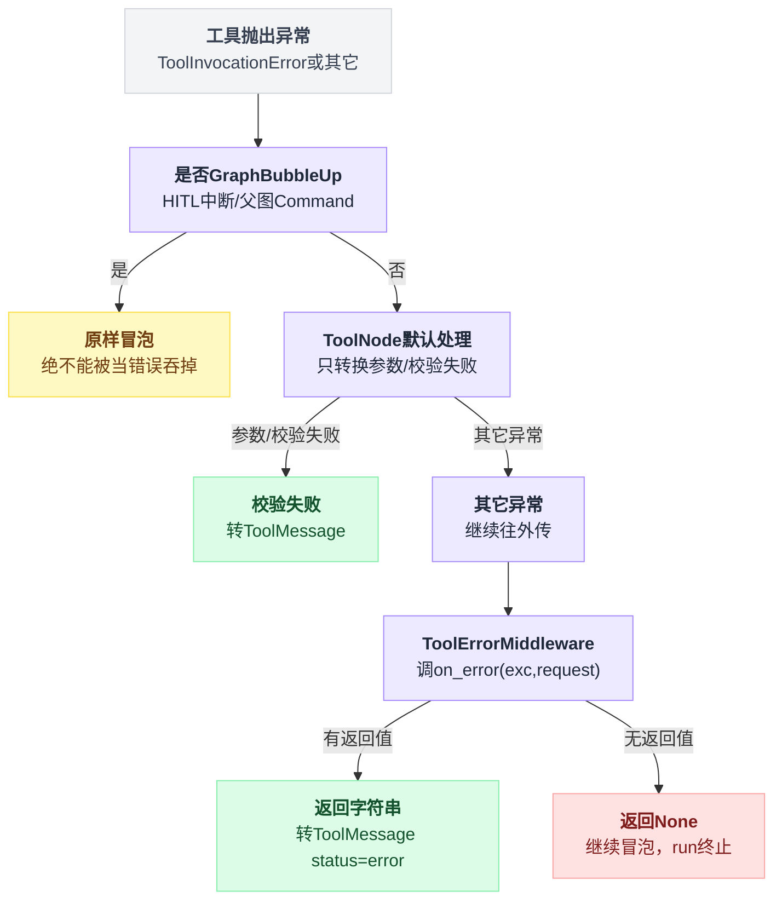
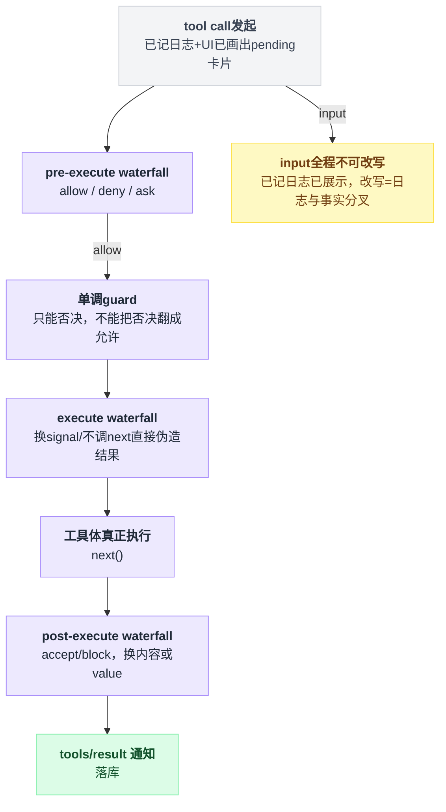
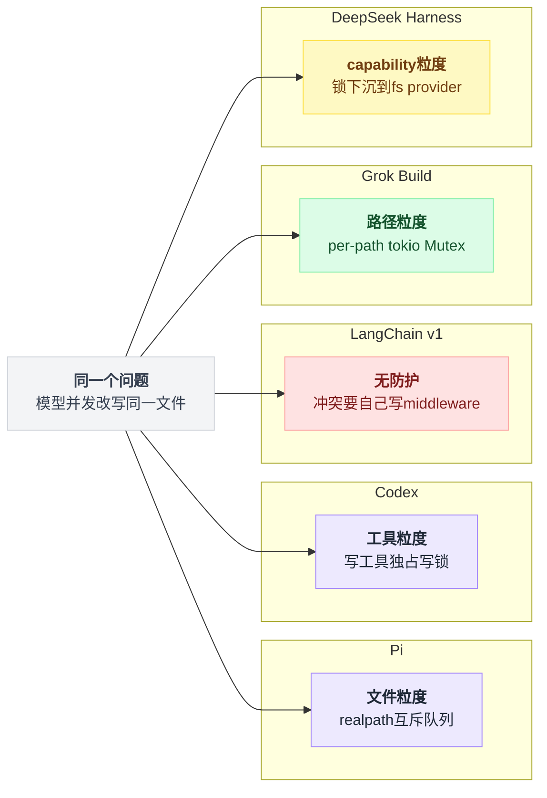

# 05 · 工具系统与执行模型

> **一句话导读**：工具（tool）不是"模型会执行的函数"，而是一套「JSON Schema 当文档 / 模型吐结构化调用 / 宿主真执行 / 结果回灌上下文」的四步循环；三个项目在**工具怎么定义、谁能看见、并行时怎么防打架、输出爆炸怎么截断**上给出了完全不同的答案，其中 Codex 的 Code Mode 干脆把工具调用换成了"让模型写 JavaScript"。
>
> **本章涉及源码**
> - Pi：`packages/coding-agent/src/core/tools/`（`index.ts` / `bash.ts` / `edit.ts` / `file-mutation-queue.ts` / `output-accumulator.ts` / `truncate.ts` / `tool-definition-wrapper.ts`）、`packages/agent/src/agent-loop.ts`
> - Codex：`codex-rs/core/src/tools/spec_plan.rs`、`parallel.rs`、`orchestrator.rs`、`handlers/apply_patch_spec.rs` + `handlers/apply_patch.lark`、`handlers/tool_search.rs`、`code_mode/`、`codex-rs/code-mode-protocol/src/description.rs`、`codex-rs/code-mode-runtime/src/runtime/globals.rs`、`codex-rs/tools/src/tool_executor.rs`、`codex-rs/features/src/lib.rs`
> - LangChain v1：`langchain_core/tools/base.py` + `convert.py`、`langgraph/prebuilt/tool_node.py`、`langchain/agents/middleware/tool_error.py` / `tool_retry.py` / `tool_call_limit.py` / `tool_selection.py` / `tool_emulator.py` / `provider_tool_search.py` / `shell_tool.py`

全文顺着这条主线展开：先拆协议本质和四个张力，再依次看 Pi / Codex / LangChain v1 各自的答案，横向对比收敛出可复用经验之后，再用 Grok Build 和 DeepSeek Harness 两个追加样本检验这些结论。



---

## 0. 先搞清楚：这是个什么东西

先把一个常见误解拆掉：**模型不会执行任何代码**。它只会生成 token。

所谓 function calling（也叫 tool calling），本质是一套双方约好的文本协议。你发 HTTP 请求给模型时，除了 `messages`，还多带一个 `tools` 数组，每个元素长这样：

```json
{ "name": "read", "description": "读取一个文件的内容",
  "parameters": { "type": "object",
                  "properties": { "path": { "type": "string", "description": "文件路径" } },
                  "required": ["path"] } }
```

这段 JSON Schema 同时扮演两个角色：**给模型看的说明书**（模型靠 `description` 判断什么时候该用），以及**语法约束**（很多 provider 会用它做 constrained decoding，保证吐出来的参数一定是合法 JSON）。

模型读完之后，如果它觉得该读文件，就不会输出普通文本，而是输出一个结构化片段：`{ id: "call_abc", name: "read", arguments: "{\"path\":\"a.ts\"}" }`。这个东西叫 tool call。

接下来全是**宿主程序（harness）的活**：解析 name、把 arguments 从字符串 parse 成对象、按 schema 校验、找到对应的本地函数、执行、拿到结果。然后把结果包成一条新消息（`role: "tool"`，带上刚才那个 `call_abc` 作为 `tool_call_id`）追加进 `messages`，再发一次完整请求。模型这才"看到"文件内容。

所以一次工具调用要花掉**两轮 API 往返**，而且工具返回的每一个字节都变成了上下文里的 token，会跟着后续所有轮次一起重发。

这个来回具体长什么样：



三件事记住就够了：

1. **schema 常驻**。每一轮请求都要把所有工具的完整 schema 重新发一遍，工具越多、描述越长，固定开销越大。
2. **参数不可信**。arguments 是模型生成的，可能字段缺失、类型错、JSON 截断，甚至路径指向 `/etc/passwd`。宿主必须当成外部输入来校验。
3. **结果占地方**。一条 `find /` 的输出可以是几百 MB，直接塞回去会瞬间撑爆上下文。

## 1. 为什么这件事很难

**（一）工具描述是常驻税，但工具又不能太少。**
每轮请求都全量重发 schema。20 个 MCP 工具、每个 300 token 的描述，就是 6000 token 的固定成本，还没开始干活就烧掉了。更糟的是，工具一多模型的选择准确率会下降——描述相近的工具会互相干扰。但删工具又会让 agent 能力受限。这个张力有三种解法：少给（Pi）、按需发现（Codex 的 tool search / defer_loading）、外部筛选（LangChain 的 `LLMToolSelectorMiddleware`）。

**（二）并行执行会踩到共享状态。**
现代模型一次 assistant message 可以带多个 tool call。并发执行能把三次文件读取的延迟从 3×N 压到 N，收益很实在。但如果模型同时发出两个针对同一个文件的 `edit`，两个协程都"读原文 → 改 → 写回"，后写的会覆盖前写的——经典的 lost update。而且这个 bug 是概率性的，测试里未必复现。

**（三）输出截断没有正确答案。**
截头（保留开头）适合看编译错误的第一条，截尾（保留结尾）适合看测试的最终结论。截行数还是截字节？一行 50MB 的 minified JS 能让"截 2000 行"这个策略完全失效。而且被截掉的部分不能就这么丢了——模型可能真的需要它。

**（四）工具报错要能自愈，但不能什么都往模型里塞。**
工具抛异常时，如果直接让异常冒泡，整个 agent run 就崩了。正确做法是把错误转成一条 `role: "tool"` 的消息喂回去，让模型自己改参数重试。但也不能无脑全转——内部的数据库连接串异常、鉴权 token 泄漏在异常消息里，都会被写进上下文并可能被模型复述出来。

## 2. Pi 的做法

### 2.1 一句话概括

用「`createXToolDefinition()` / `createXTool()` / `XOperations`」三件套的工厂模式定义工具，7 个内置工具**默认只开 4 个**；并行执行时靠一个按 `realpath` 分桶的文件互斥队列防止写冲突。

### 2.2 机制拆解

**工厂三件套。** 每个工具文件导出三样东西：

- `XOperations` —— 一个纯 I/O 接口（比如 `EditOperations` 只有 `readFile` / `writeFile` / `access` 三个方法）
- `createXToolDefinition(cwd, options)` —— 返回带渲染逻辑的完整定义，`options.operations` 可以替换掉默认的本地实现
- `createXTool(cwd, options)` —— 把 definition 用 `wrapToolDefinition()` 剥掉 TUI 渲染部分，变成 core runtime 用的 `AgentTool`

`XOperations` 是整个设计的枢纽：把「工具的语义」和「工具怎么落地到具体系统」分开了。`EditOperations` 的注释直说了这是给远程用的——换成 SSH 实现，`edit` 工具就在远端机器上跑；换成 micro-VM 的 RPC 实现，就是沙箱执行。工具的 schema、prompt 提示、diff 渲染全都不用动。

**7 个工具，默认只开 4 个。** `allToolNames` 里有 `read / bash / edit / write / grep / find / ls`，但 `AgentSession` 构造时默认激活的只有前四个。grep/find/ls 的能力交给 `bash` 去做（模型自己写 `rg`、`fd`）。这是明确的取舍：省下三份 schema 的常驻 token，代价是模型得自己拼命令行，且这些命令的输出没有专用工具那样的结构化截断。

**并行执行 = 串行 preflight + 并发 execute + 按序持久化。** `executeToolCalls()` 分两条路。默认走 parallel：对每个 tool call **先串行地**跑 `prepareToolCall()`（查工具、`prepareArguments()` 兼容性修补、schema 校验、`beforeToolCall` 钩子/权限门），把通过的包成一个闭包塞进数组；全部 preflight 完之后才 `Promise.all` 并发跑 `execute`。结果用 `for` 循环按 assistant message 里 tool call 出现的原始顺序写回 messages——**执行是乱序的，持久化是有序的**，这样 session 文件和重放行为是确定的。

这三步落成图是这样：



单个工具可以声明 `executionMode: "sequential"`（示例见 `examples/extensions/tic-tac-toe.ts`），只要这一批里有任何一个这样的工具，整批就退化成串行。

**文件互斥队列。** `withFileMutationQueue()` 只被 `edit.ts` 和 `write.ts` 用。key 是 `realpath` 解析后的绝对路径——这样通过软链接指向同一个 inode 的两个不同路径会落进同一个队列。不同文件之间仍然完全并行。

排队本身分两段——先排"谁能拿到队尾"，再排"谁能真正执行"：



**输出累积与截断。** `OutputAccumulator` 用流式 `TextDecoder` 边收边解码，只在内存里保留 `maxBytes * 2` 的滚动尾巴，一旦总量超过阈值（默认 2000 行 / 50KB，两者先到先算）就开一个 temp 文件把**原始字节**全量落盘，然后在返回给模型的文本末尾附一行 `[Showing lines 4831-5000 of 5000. Full output: /tmp/pi-bash-xxx.log]`。模型想看全的，可以自己再 `read` 那个文件。

### 2.3 源码

`packages/coding-agent/src/core/tools/file-mutation-queue.ts:28`

```typescript
/**
 * Serialize file mutation operations targeting the same file.
 * Operations for different files still run in parallel.
 */
export async function withFileMutationQueue<T>(filePath: string, fn: () => Promise<T>): Promise<T> {
	const registration = registrationQueue.then(async () => {
		const key = await getMutationQueueKey(filePath);
		const currentQueue = fileMutationQueues.get(key) ?? Promise.resolve();

		let releaseNext!: () => void;
		const nextQueue = new Promise<void>((resolveQueue) => { releaseNext = resolveQueue; });
		const chainedQueue = currentQueue.then(() => nextQueue);
		fileMutationQueues.set(key, chainedQueue);

		return { key, currentQueue, chainedQueue, releaseNext };
	});
	registrationQueue = registration.then(() => undefined, () => undefined);

	const { key, currentQueue, chainedQueue, releaseNext } = await registration;
	await currentQueue;
	try {
		return await fn();
	} finally {
		releaseNext();
		if (fileMutationQueues.get(key) === chainedQueue) fileMutationQueues.delete(key);
	}
}
```

这里有个容易忽略的细节：**注册本身也要排队**（`registrationQueue`）。因为 `getMutationQueueKey()` 里的 `realpath()` 是异步的，如果两个并发调用同时进来，可能都读到 `fileMutationQueues.get(key)` 的旧值，双双挂在同一个前驱上，链就断了。用一个全局的 `registrationQueue` 把"读旧队尾 + 写新队尾"这一段变成原子操作，代价是所有文件的注册动作互相串行——但注册只是一次 `realpath`，很便宜。

`edit.ts` 里对这个队列还有一条重要注释（`edit.ts:312` 附近）：不能在 abort 事件监听器里 reject，否则队列锁会在文件写入还没落盘时就被释放；正确做法是每个 `await` 之后手动检查 `signal.aborted`。这是把"取消"和"互斥"两个机制正确组合的典型坑。

`packages/agent/src/agent-loop.ts:419`

```typescript
const hasSequentialToolCall = toolCalls.some(
    (tc) => currentContext.tools?.find((t) => t.name === tc.name)?.executionMode === "sequential",
);
if (config.toolExecution === "sequential" || hasSequentialToolCall) {
    return executeToolCallsSequential(...);
}
return executeToolCallsParallel(...);
```

`packages/agent/src/agent-loop.ts:540`

```typescript
const orderedFinalizedCalls = await Promise.all(
    finalizedCalls.map((entry) => (typeof entry === "function" ? entry() : Promise.resolve(entry))),
);
const messages: ToolResultMessage[] = [];
for (const finalized of orderedFinalizedCalls) {
    const toolResultMessage = createToolResultMessage(finalized);
    await emitToolResultMessage(toolResultMessage, emit);
    messages.push(toolResultMessage);
}
```

`finalizedCalls` 是个异构数组：preflight 阶段就失败的直接是结果对象，通过的是待执行的闭包。`Promise.all` 之后顺序天然跟原数组一致，所以持久化循环不用额外排序。

`packages/coding-agent/src/core/tools/bash.ts:52`

```typescript
/**
 * Pluggable operations for the bash tool.
 * Override these to delegate command execution to remote systems (for example SSH).
 */
export interface BashOperations {
	exec: (
		command: string,
		cwd: string,
		options: {
			onData: (data: Buffer) => void;
			signal?: AbortSignal;
			timeout?: number;
			env?: NodeJS.ProcessEnv;
		},
	) => Promise<{ exitCode: number | null }>;
}
```

整个 bash 工具的可替换面就这一个方法。除此之外还有一层更轻的钩子 `BashSpawnHook`（`bash.ts:156`），签名是 `(ctx: {command, cwd, env}) => {command, cwd, env}`——它不接管执行，只在 spawn 前重写这三个字段。想给所有命令加 `nix develop -c` 前缀、想把 cwd 重定向到 worktree、想注入额外环境变量，用 hook 就够了，不用重写 `BashOperations`。两层扩展点分得很清楚。

### 2.4 代价与适用边界

- 文件互斥队列只覆盖 `edit` 和 `write`。**`bash` 完全不在保护范围内**——模型并行发一个 `edit a.ts` 和一个 `bash "sed -i ... a.ts"`，照样会打架。这是有意的：bash 命令做了什么无法静态分析。
- 队列是**进程内**的全局 `Map`。多个 Pi 进程、或者 `BashOperations` 换成远程实现之后同时操作同一台机器，都不受保护。
- 默认只给 4 个工具节省了 token，但把 grep/find 的输出截断质量交给了模型写的命令行。`grep.ts` 里有专门的 `GREP_MAX_LINE_LENGTH = 500` 单行截断逻辑，模型自己跑 `rg` 是享受不到的。

## 3. Codex 的做法

### 3.1 一句话概括

一张 1300 行的 `build_tool_router` 按 feature flag / 模型能力 / 环境形态动态组装工具表，工具有**六种可见性**；并行控制用一把 `RwLock` 巧妙实现；而在最新的 GPT-5.6 系列模型上，工具表对模型**几乎完全隐藏**——模型只能看见 `exec` 和 `wait` 两个入口，真正的工具调用要在 V8 沙箱里写 JavaScript 完成。

### 3.2 机制拆解

**六态可见性。** Codex 不是简单的"注册/不注册"，而是把「模型初始工具表里有没有」「能不能被 tool search 搜到」「能不能在 Code Mode 脚本里调」拆成三个正交维度：

```rust
// codex-rs/tools/src/tool_executor.rs:49
pub enum ToolExposure {
    Direct,             // 初始工具表可见 + Code Mode 可调
    Deferred,           // 初始不可见，tool search 能搜到 + Code Mode 可调
    DeferredModelOnly,  // tool search 能搜到，但不给 Code Mode
    DirectModelOnly,    // 初始工具表可见，但不给 Code Mode
    CodeModeOnly,       // 只在 Code Mode 脚本里可调
    Hidden,             // 注册但完全不暴露（仍可被内部 dispatch）
}
```

`Hidden` 的实际用途很有意思：当 `UnifiedExec` 特性开启时，旧的 `ShellCommandHandler` 仍然以 `Hidden` 注册（`spec_plan.rs:921`），这样历史会话里的 `shell` 调用还能被正确 dispatch，但新请求里模型看不到它。

六个状态是同一个源头按两条轴（初始可见性 / Code Mode 可调性）拆出来的：



**按需发现（tool search）。** `ToolSearchInfo::from_tool_spec()` 把工具 spec 转成搜索条目时，会把 `defer_loading` 置为 `Some(true)` 并**丢掉 `output_schema`**（`tools/src/tool_search.rs:37`），只保留名字和描述进 BM25 索引（`handlers/tool_search.rs` 用了 `bm25` crate）。模型初次只看到一个 `tool_search` 工具，搜到之后 provider 侧才把完整 schema 加载进来。

**并行闸门用读写锁。** 这是全章我最喜欢的一个小设计：

```rust
// codex-rs/core/src/tools/parallel.rs:153
let _guard = if supports_parallel {
    Either::Left(lock.read().await)
} else {
    Either::Right(lock.write().await)
};
```

`parallel_execution` 是一把 `RwLock<()>`，不保护任何数据，纯粹当信号量用。声明自己 parallel-safe 的工具拿**读锁**（互相之间随便并发），不安全的工具拿**写锁**（独占，等所有在跑的并发工具结束，且期间不让新的进来）。一行代码同时表达了「并行组内并发」和「串行工具与所有人互斥」。

哪些工具算 parallel-safe？`view_image`、`tool_search`、以及 MCP 工具里那些 `readOnlyHint` 为真的（`handlers/mcp.rs:110` 的注释：*"Correctly implemented MCP servers should tolerate parallel calls to tools that advertise themselves as read-only"*）。exec / apply_patch 这类都不是。注意 Codex 没有 Pi 那种细到文件粒度的锁——它是**工具粒度**的粗锁。



**沙箱降级重试。** `ToolOrchestrator::run()` 是个三段式状态机：① 按 `AskForApproval` 策略决定要不要弹审批；② 在选定沙箱下跑第一次；③ 如果失败原因是 `SandboxErr::Denied`，且工具声明了 `escalate_on_failure()`，就带上"为什么被拒"的理由再弹一次审批，用户批准后在无沙箱下重试。这让"命令因为写了 workspace 外的路径被 seccomp 挡住"这种情况从硬失败变成了一次可交互的升级。

**用 Lark 语法约束 patch 格式。** `apply_patch` 不是普通的 function tool，而是 `ToolSpec::Freeform`，带一个 grammar：

`codex-rs/core/src/tools/handlers/apply_patch.lark`

```lark
start: begin_patch hunk+ end_patch
begin_patch: "*** Begin Patch" LF
end_patch: "*** End Patch" LF?

hunk: add_hunk | delete_hunk | update_hunk
add_hunk: "*** Add File: " filename LF add_line+
delete_hunk: "*** Delete File: " filename LF
update_hunk: "*** Update File: " filename LF change_move? change?

filename: /(.+)/
add_line: "+" /(.*)/ LF -> line
change_context: ("@@" | "@@ " /(.+)/) LF
change_line: ("+" | "-" | " ") /(.*)/ LF
eof_line: "*** End of File" LF
```

`codex-rs/core/src/tools/handlers/apply_patch_spec.rs:9`

```rust
const APPLY_PATCH_LARK_GRAMMAR: &str = include_str!("apply_patch.lark");

pub fn create_apply_patch_freeform_tool(include_environment_id: bool) -> ToolSpec {
    let definition = if include_environment_id {
        APPLY_PATCH_LARK_GRAMMAR.replace(
            "start: begin_patch hunk+ end_patch",
            "start: begin_patch environment_id? hunk+ end_patch\nenvironment_id: \"*** Environment ID: \" filename LF",
        )
    } else { APPLY_PATCH_LARK_GRAMMAR.to_string() };
    ToolSpec::Freeform(FreeformTool {
        name: "apply_patch".to_string(),
        description: "The `apply_patch` tool can be used to edit files. This is a FREEFORM tool, so do not wrap the patch in JSON.".to_string(),
        defer_loading: None,
        format: FreeformToolFormat { r#type: "grammar".to_string(), syntax: "lark".to_string(), definition },
    })
}
```

这个 grammar 被**上传给 provider**，用于约束采样（constrained decoding）——模型在生成 patch 时，非法 token 的概率直接被 mask 成 0。所以 `*** Begin Patch` 写错、hunk 头缺失这类语法错在物理上不可能发生，parser 只需要处理语义错（比如上下文行匹配不上）。而且因为是 freeform，patch 内容**不用做 JSON 转义**——省掉大量 `\n` `\"` 的转义 token，也避开了"模型在长 JSON 字符串里漏个引号导致整次调用作废"的老问题。

需要 environment_id 时它是直接对 grammar 文本做字符串替换来插一条产生式的——朴素但有效。

### 3.3 Code Mode：让模型写代码而不是填表

这是 Codex 这一版最激进的改动。

**动机。** 回到第 1 节的张力（一）和（二）。传统 function calling 每调一次工具就是一次完整的模型往返：模型输出 tool call → 停下 → 宿主执行 → 结果全文进上下文 → 模型再看一遍全部历史再决定下一步。想"读 20 个文件然后统计里面 import 了哪些包"，就是 20 次往返、20 份文件全文进上下文，然后模型还得自己在脑子里做聚合。

但这件事用代码写就是五行。Code Mode 的赌注是：**让模型写一段脚本，在一个能直接调用所有工具的运行时里跑完，只把最终结果回灌**。20 次往返压成 1 次，19 份中间产物根本不进上下文。

**模型看到什么。** `tool_mode: "code_mode_only"`（`codex-rs/models-manager/models.json` 里 `gpt-5.6-sol` / `gpt-5.6-terra` / `gpt-5.6-luna` 三个模型都是这个值），对应 feature：

```rust
// codex-rs/features/src/lib.rs:107
/// Restrict model-visible tools to code mode entrypoints (`exec`, `wait`).
CodeModeOnly,
```

过滤逻辑在 `spec_plan.rs:619`：

```rust
fn is_hidden_by_code_mode_only(
    turn_context: &TurnContext, tool_name: &ToolName, exposure: ToolExposure,
) -> bool {
    let tool_mode = effective_tool_mode(turn_context);
    tool_mode == ToolMode::CodeModeOnly
        && exposure.is_available_in_code_mode()
        && codex_code_mode::is_code_mode_nested_tool(&codex_tools::code_mode_name_for_tool_name(tool_name))
}
```

而 `is_code_mode_nested_tool` 的定义就是"名字既不是 `exec` 也不是 `wait`"。所以 code-mode-only 会话里，模型的工具表就剩两项。

**schema 到哪去了。** 没消失，而是被**渲染成 TypeScript 类型签名，拼进 `exec` 这一个工具的 description**。`render_json_schema_to_typescript()` 递归处理 `type` / `enum` / `anyOf` / `allOf` / `items` / `properties`，并把每个字段的 `description` 变成 `//` 注释。看这个测试断言就一目了然（`code-mode-protocol/src/description.rs:866`）：

```rust
let description = augment_tool_definition(definition).description;
assert!(description.contains(
    r#"weather_tool(args: {
  // look up weather for a given list of locations
  weather: Array<{ location: string; }>;
}): Promise<{
  // human readable weather forecast
  forecast: string;
}>;"#
));
```

最终 `exec` 的 description 是这样组装的（`build_exec_tool_description`）：一段固定的运行时说明 + 可选的 MCP `CallToolResult<T>` 类型前导 + 按 namespace 分组的、每个工具一节 `### \`tool_name\`` 加它的 TS 声明。

这里有个真实的权衡：**这不是免费的**。20 个工具的 JSON Schema 换成了 20 个工具的 TS 声明，token 只是形态变了不是没了。省下的是**执行阶段**的往返和中间产物，不是**声明阶段**的开销。而 TS 签名比等价的 JSON Schema 紧凑（没有 `"type":` `"properties":` 这些结构噪声），算是顺带的收益。

对于 deferred 工具则真的省了——它们的 TS 声明**不进 description**，只留一句指引：*"Some deferred nested tools may be omitted from this description. They are still available on the global `tools` object and listed in `ALL_TOOLS`. To find one, filter `ALL_TOOLS` by `name` and `description`."* 模型要用就在脚本里自己过滤 `ALL_TOOLS`。

**运行时长什么样。** `exec` 的 description 头几行写得很清楚：

`codex-rs/code-mode-protocol/src/description.rs:14`

```
Run JavaScript code to orchestrate/compose tool calls
- Evaluates the provided JavaScript code in a fresh V8 isolate as an async module.
- All nested tools are available on the global `tools` object, for example `await tools.exec_command(...)`.
- Nested tool methods take either a string or an object as their input argument.
- Runs raw JavaScript -- no Node, no file system, no network access, no console.
- Accepts raw JavaScript source text, not JSON, quoted strings, or markdown code fences.
- You may optionally start the tool input with a first-line pragma like `// @exec: {"yield_time_ms": 10000, "max_output_tokens": 1000}`.
- When the JS code is fully evaluated, the isolate's lifetime ends and unawaited promises are silently discarded.
```

注意 "no Node, no file system, no network access"——这是**裸 V8**，不是 Deno 也不是 Node。脚本本身完全没有 I/O 能力，唯一能碰外部世界的通道就是 `tools.*`。全局环境是这么搭起来的：

`codex-rs/code-mode-runtime/src/runtime/globals.rs:15`

```rust
pub(super) fn install_globals(scope: &mut v8::PinScope<'_, '_>) -> Result<(), String> {
    let global = scope.get_current_context().global(scope);
    delete_global(scope, global, "console")?;
    delete_global(scope, global, "Atomics")?;
    delete_global(scope, global, "SharedArrayBuffer")?;
    delete_global(scope, global, "WebAssembly")?;

    let tools = build_tools_object(scope)?;
    let all_tools = build_all_tools_value(scope)?;
    // ... setTimeout / clearTimeout / text / image / audio / generatedImage
    //     / store / load / notify / yield_control / exit
    set_global(scope, global, "tools", tools.into())?;
    set_global(scope, global, "ALL_TOOLS", all_tools)?;
    ...
}
```

删掉 `Atomics` / `SharedArrayBuffer` 是防 Spectre 类侧信道的标准动作；删 `WebAssembly` 是砍掉一整块 JIT 攻击面；删 `console` 是因为没有输出通道——脚本要给模型看东西必须显式调 `text()` / `image()`。另外 `V8JitMode::Disabled` 可以让整个进程以 `--jitless` 启动（`v8_init.rs:47`），彻底关掉运行时代码生成，代价是执行速度。默认是 JIT 开启，且 `Feature::CodeModeHost` 默认 `true`——V8 跑在一个**独立的 host 进程**里，通过 stdio 与主进程通信，进程隔离是最外一层防线。

**嵌套调用怎么回到 Rust。** `tools.foo(...)` 触发一个 V8 callback，消息通过 channel 送回主进程的 dispatch worker，最后走的是**和普通工具调用完全同一条路径**：

`codex-rs/core/src/tools/code_mode/mod.rs:341`

```rust
let call = ToolCall {
    tool_name: tool_name.with_default_namespace(),
    call_id: format!("{PUBLIC_TOOL_NAME}-{}", uuid::Uuid::new_v4()),
    payload, encrypted_function_args: None,
};
...
let result = tool_runtime
    .handle_tool_call_with_source(call, ToolCallSource::CodeMode { cell_id: ..., runtime_tool_call_id }, cancellation_token)
    .await?;
Ok(result.code_mode_result())
```

这一点很关键：**审批、沙箱、`RwLock` 并行闸门、遥测全都照常生效**。Code Mode 不是绕过安全机制的后门，它只是换了个调用发起方（`ToolCallSource::CodeMode` 而不是模型直发）。同时 `exec` 不能递归调 `exec`（显式检查并报错）。

从模型提交脚本到拿到最终结果，链路绕了一圈又回到了普通工具调用那条路：



**长时间运行怎么办。** 脚本可能跑很久。`exec` 默认 10 秒（`yield_time_ms`）就"让出"——返回目前积累的输出加一句 `Script running with cell ID ...`，而脚本**继续在后台跑**。模型拿到 cell id 后可以调 `wait` 取增量输出，也可以 `terminate: true` 掐掉。脚本里还能主动 `yield_control()` 把当前输出立刻推给模型。加上 `store(key, value)` / `load(key)` 可以跨 `exec` 调用共享状态，整个模式其实很像 Jupyter：一个个 cell，有持久 session。

### 3.4 代价与适用边界

- **模型必须真的会写 JS。** 只有 `gpt-5.6-*` 三个模型默认开这个模式，其它模型 `tool_mode: null`。这是强模型依赖的能力，不是通用方案。
- **调试性变差。** 传统模式下每个 tool call 在 UI 上都是一条独立记录；Code Mode 下用户看到的是一段脚本和最终输出，中间发生了什么要靠 `code_cell_trace` 单独还原。代码里为此专门做了 `rollout_thread_trace.start_code_cell_trace()` 和一整套 analytics 事件（`CellStarted` / `ChildStarted` / `CellClosed`），可见这不是小工作量。
- **失败模式变了。** 以前是"参数填错了"，现在是"脚本第 12 行 TypeError"。模型得会读 JS 的 stack trace。而且"unawaited promises are silently discarded"——脚本写错忘了 await，工具调用会静默丢失。
- **schema 常驻的开销没有本质改善**（非 deferred 部分只是换了编码形式）。真正的收益全在多步组合场景，单次工具调用反而多了一层间接。
- 并行锁是工具粒度的，Codex 没有 Pi 那样的文件级互斥——它靠的是 `apply_patch` / `exec` 都不 parallel-safe，直接拿写锁独占。更保守，也更慢。

## 4. LangChain v1 的做法

### 4.1 一句话概括

**LangChain 不提供任何文件编辑工具**——它是框架，工具是用户的事。它提供的是「把 Python 函数自动变成工具」的转换器，以及一整排围绕工具调用生命周期的 middleware。

### 4.2 机制拆解

**`@tool` 装饰器：从函数签名生成 schema。** 这是 LangChain 最经典也最被抄袭的设计。你写：

```python
@tool
def search(query: str, limit: int = 10) -> str:
    """Search the knowledge base.

    Args:
        query: The search query.
        limit: Max results to return.
    """
    ...
```

`create_schema_from_function()` 干这几件事：
1. 用 pydantic 的 `validate_arguments` 从函数签名反推出一个 model（这一步顺带拿到了类型 → JSON Schema 的映射）
2. 剔除 `self` / `cls` / `FILTERED_ARGS`，以及所有标注了 `InjectedToolArg` / `ToolRuntime` 的参数——**这些是运行时由框架注入的，不能让模型看见**
3. `_infer_arg_descriptions()` 解析 docstring（可选 Google style 严格模式），函数的一句话摘要变成工具 description，`Args:` 段的每行变成对应字段的 description
4. `_create_subset_model()` 把上面这些拼成最终的 args_schema

`langchain_core/tools/base.py:334`

```python
    # supplied at runtime rather than by the model, so they should not appear in
    # the generated schema.
    if not include_injected:
        for existing_param in sig.parameters:
            if (_is_injected_arg_type(sig.parameters[existing_param].annotation)
                    and existing_param not in filter_args_):
                filter_args_.append(existing_param)

    description, arg_descriptions = _infer_arg_descriptions(
        func, parse_docstring=parse_docstring, error_on_invalid_docstring=error_on_invalid_docstring,
    )
    ...
    return _create_subset_model(
        model_name, inferred_model, list(valid_properties),
        descriptions=arg_descriptions, fn_description=description,
    )
```

注意这里有一个双 schema 的微妙设计：`include_injected=True` 时生成的 schema 用于**校验**（注入参数确实会出现在最终 kwargs 里），`include_injected=False` 生成的用于**发给模型**。同一个函数两套视图。

**并行执行。** `ToolNode` 同步路径用 `executor.map`（线程池），异步路径用 `asyncio.gather`：

`langgraph/prebuilt/tool_node.py:821`

```python
        with get_executor_for_config(config) as executor:
            outputs = list(
                executor.map(self._run_one, tool_calls, input_types, tool_runtimes)
            )
```

**没有任何互斥或冲突检测**。这是框架定位的直接后果：LangChain 不知道你的工具做什么，无从判断哪两个会打架。要防冲突得自己在工具里加锁，或者写个 `wrap_tool_call` middleware。

**错误处理是三层。** 最内层是 `ToolNode` 自己的 `handle_tool_errors`，默认值 `_default_handle_tool_errors` 只把**参数绑定/校验失败**（`ToolInvocationError`）转成 ToolMessage，其它异常一律 re-raise。往外一层是 `ToolErrorMiddleware`，让用户提供 `on_error(exc, request) -> str | None`：返回字符串就转成 `ToolMessage(status="error")`，返回 `None`（或什么都不返回）就让异常继续冒泡。

`langchain/agents/middleware/tool_error.py:143`

```python
        try:
            return handler(request)
        except GraphBubbleUp:
            # Control-flow signals (interrupts, parent commands) must propagate.
            raise
        except Exception as exc:
            if self.on_error is None:
                ...
            content = self.on_error(exc, request)
            if content is None:
                raise
            return ToolMessage(
                content=cast("str | list[str | dict[Any, Any]]", content),
                tool_call_id=request.tool_call["id"], name=tool_name, status="error",
            )
```

两个设计决策值得学：① **默认不处理**（opt-in），类的 docstring 明说了理由——*"arbitrary internal exceptions are never serialized to the model or end user unless you choose to surface them"*；② `GraphBubbleUp`（human-in-the-loop 的 interrupt、父图的 Command）必须原样冒泡，不能被当成工具错误吞掉。这个坑很隐蔽——用 `except Exception` 包一切的实现会把 HITL 打断信号变成一条错误消息。

`ToolRetryMiddleware` 是第三层，它在 `wrap_tool_call` 里放了个 for 循环重复调 `handler(request)`，可配 `retry_on`（异常类型元组或谓词函数）、指数退避、`on_failure`。文档明确写了组合顺序：retry 要放在 error 的**内层**，且 `on_failure="error"`，这样重试耗尽后的异常才会到达 error 中间件。

三层叠起来，一次异常实际走的判断链是这样：



**其余工具相关 middleware。** 都挂在同一套 `wrap_tool_call` / `wrap_model_call` 钩子上：

| middleware | 解决第 1 节的哪个张力 |
|---|---|
| `LLMToolSelectorMiddleware` | （一）：调一个小模型先从 N 个工具里选出 ≤ `max_tools` 个，再 `request.override(tools=...)` |
| `ProviderToolSearchMiddleware` | （一）：给工具打 `extras["defer_loading"]`，改用 provider 原生的 server-side tool search |
| `ToolCallLimitMiddleware` | 失控循环：按 thread / run 计数，超限可 `continue`（屏蔽该工具）/ `error` / `end` |
| `LLMToolEmulatorMiddleware` | 测试：用 LLM 假装执行工具，不真跑 |
| `ToolRetryMiddleware` / `ToolErrorMiddleware` | （四） |

`LLMToolSelectorMiddleware` 还带了个 `transformers = (InternalCallTransformer,)`，把选择器那次模型调用的 token 从 `run.messages` 里摘出去——不然筛工具本身反而污染了上下文。

**唯一自带的"真"工具：`ShellToolMiddleware`。** 它维护一个**持久 shell session**（`ShellSession` 类，`shell_tool.py:125`），支持 `restart`、`startup_commands` / `shutdown_commands`、输出脱敏规则（`redaction_rules`）。注册方式就是在 `__init__` 里用 `@tool` 装饰一个闭包然后 `self.tools = [self._shell_tool]`。除此之外还有个 `FilesystemFileSearchMiddleware` 提供只读的文件搜索。**没有 read / write / edit / apply_patch**。

### 4.3 代价与适用边界

- 不内置文件工具是**定位决定的，不是遗漏**。LangChain 面向的是"我要造一个客服 agent / 数据分析 agent"的开发者，文件编辑不是通用需求。但这也意味着想用 LangChain 造 coding agent，第 2、3 节里 Pi 和 Codex 花大力气解决的截断、互斥、diff 生成、沙箱，全都得自己写一遍。
- 没有输出截断策略。工具返回什么就是什么，撑爆上下文得靠 `SummarizationMiddleware` 或 `ContextEditingMiddleware` 事后补救。
- 没有沙箱。`ShellToolMiddleware` 是直接 `subprocess`，没有 seccomp / landlock / seatbelt 那一层。
- `@tool` 从 docstring 推 description 很优雅，但也意味着**改注释就是改 prompt**。一次无心的文档润色可能改变 agent 行为，而这不会被任何测试捕获。

## 5. 三方横向对比

| 维度 | Pi | Codex | LangChain v1 |
|---|---|---|---|
| 工具定义方式 | TypeBox schema + 工厂函数三件套 | Rust trait `ToolExecutor` + `ToolSpec` 枚举（Function / Freeform / Namespace / ToolSearch / WebSearch） | `@tool` 装饰器从函数签名 + docstring 反推 pydantic model |
| 内置文件工具 | 7 个（read/write/edit/bash/grep/find/ls），默认激活 4 个 | `apply_patch`（Lark 语法约束）+ `exec_command` / `shell` / `write_stdin` / `view_image` 等 | **无**。只有 `ShellToolMiddleware` + `FilesystemFileSearchMiddleware` |
| 工具可见性控制 | 二态：active / 不 active（`setActiveToolsByName`） | 六态 `ToolExposure`（Direct / Deferred / DeferredModelOnly / DirectModelOnly / CodeModeOnly / Hidden） | 二态，靠 middleware 在 `wrap_model_call` 里 `request.override(tools=...)` 动态改 |
| 按需发现 | 不做 | `tool_search` + `defer_loading`，BM25 索引，丢弃 output_schema | `ProviderToolSearchMiddleware`（委托给 provider 的 server-side search）+ `LLMToolSelectorMiddleware`（自己用小模型筛） |
| 并行执行 | 串行 preflight → `Promise.all` → 按 source order 持久化 | `tokio::spawn` + `RwLock`：parallel-safe 取读锁，其余取写锁 | `executor.map`（sync）/ `asyncio.gather`（async），无闸门 |
| 并发写冲突防护 | **文件粒度**：`withFileMutationQueue`，key = `realpath` | **工具粒度**：写工具不声明 parallel-safe，直接独占 | 无 |
| 逃生舱 | 单工具 `executionMode: "sequential"` 使整批退化串行 | `supports_parallel_tool_calls() -> false` | 自己写 middleware |
| 输出截断 | `OutputAccumulator` + `truncate`，2000 行 / 50KB 先到先算，超限全量落 temp 文件并在结果里给路径 | `truncate_text` + 模型级 `truncation_policy`（`models.json` 里 `{mode: "tokens", limit: 10000}`），Code Mode 另有 `max_output_tokens` | 无 |
| 错误回灌 | `executePreparedToolCall` catch 全部异常 → `createErrorToolResult` → `isError: true` | `FunctionCallError::RespondToModel`（回灌）vs `::Fatal`（终止 run），两级分明 | 三层：`ToolNode.handle_tool_errors`（默认只处理校验错）→ `ToolErrorMiddleware`（opt-in）→ `ToolRetryMiddleware` |
| 沙箱 / 审批 | 无内置（靠 `beforeToolCall` 钩子和扩展自己实现） | `ToolOrchestrator`：审批 → 沙箱执行 → denied 后带理由升级重试 | 无 |
| 远程/替换执行后端 | `XOperations` 接口整体替换（注释明写为 SSH 场景），外加轻量 `spawnHook` 改写 command/cwd/env | 多 environment 抽象（local / remote），`include_environment_id` 进 schema | 用户自己在工具函数里实现 |
| 最激进的一步 | 默认只给 4 个工具，其余交给 bash | **Code Mode**：模型只见 `exec` / `wait`，工具在 V8 沙箱里以 JS 方法调用 | 把工具生命周期全部 middleware 化 |

## 6. 可以拿走的工程经验

1. **写冲突要在能确定"资源身份"的最细粒度上加锁。** Pi 用 `realpath` 作为互斥队列的 key，而不是用户传进来的原始路径——软链、`./a.ts` 和 `a.ts`、相对路径都会归一到同一把锁。适用条件：你能静态知道一次工具调用会碰哪些资源。做不到的（比如 bash 里任意的 `sed -i`）就老实退化成工具粒度独占，像 Codex 那样。
2. **"注册进队列"这一步本身也需要串行。** 只要计算锁 key 涉及异步操作（`realpath`、DNS、数据库查询），"读队尾 + 写队尾"就不是原子的。Pi 用一个全局 `registrationQueue` 把这段串起来，开销可忽略但消除了一整类竞态。
3. **用读写锁当并发分组的信号量。** 不需要保护数据也可以用 `RwLock`：一类任务拿读锁互相并发，另一类拿写锁全局独占。比自己维护"当前并发数 + 条件变量"简洁得多，且天然公平。适用于"大部分操作互相兼容、少数操作要求独占"的场景。
4. **超限的输出落盘，然后把路径告诉模型。** 别只给一句 `[truncated]`。Pi 的做法是超限时开 temp 文件写全量原始字节，返回的文本末尾附 `Full output: /tmp/xxx.log` —— 模型需要的话自己 `read` 或 `grep` 那个文件。这把"截断"从信息丢失变成了信息分层。
5. **错误回灌要分两级，并且默认保守。** 区分"该让模型看到并自己修的错"（参数校验失败、命令 exit code 非 0）和"该终止整个 run 的错"（Codex 的 `FunctionCallError::Fatal`）。LangChain 更进一步：`ToolErrorMiddleware` 默认什么都不处理，必须显式返回内容才转成 ToolMessage，理由是内部异常消息可能带敏感信息。同时**永远不要吞掉控制流信号**（LangChain 的 `GraphBubbleUp`），否则 human-in-the-loop 会静默失效。
6. **格式固定的大块输入用 grammar 约束采样，而不是 JSON。** Codex 的 `apply_patch` 用 Lark grammar 定义 patch 格式并上传给 provider，换来两个好处：语法错在采样层就不可能产生；patch 正文不用 JSON 转义，省 token 也避开长字符串里漏引号的经典失败。适用条件：provider 支持 constrained decoding（OpenAI custom tools / grammar 格式），且你的格式确实能用上下文无关文法描述。
7. **把 I/O 抽成可替换接口，工具的其余部分完全不用动。** Pi 的 `EditOperations` 只有三个方法，换成 SSH 实现就得到远程编辑，schema、prompt 提示、diff 渲染全部复用。再配一个更轻的 `spawnHook`（只改 command/cwd/env，不接管执行）覆盖 80% 的简单定制。两层扩展点比一个大而全的插件接口好用。

## 7. 本章存疑

- Codex 的 Code Mode 到底能省多少 token、多少往返，仓库里没有 benchmark 数据，本章关于"收益全在多步组合场景"的判断来自对 `build_exec_tool_description` 组装逻辑的推理，**未经实测验证**。
- `Feature::CodeModeOnly` 的 `stage` 是 `UnderDevelopment`、`default_enabled: false`（`features/src/lib.rs:936`），但 `models.json` 里三个 GPT-5.6 模型的 `tool_mode` 直接写死 `"code_mode_only"`。`requested_tool_mode()` 里 `model_info.tool_mode` 优先于 feature flag，所以这三个模型上它是默认生效的。⚠️ 未确认：这三个模型在当前版本是否已经对普通用户可用。
- Pi 的 `constrainedSampling?: false | ConstrainedSamplingConfig` 字段（`extensions/types.ts:463`）说明它也有 provider 侧约束采样的挂钩，但 7 个内置工具都没有使用它，具体协议形态本章未追查。
- `withFileMutationQueue` 只保护 `edit` / `write`。⚠️ 未确认：Pi 是否在别处（比如扩展系统或 `beforeToolCall`）对 bash 里的文件写入做了额外协调。从 `bash.ts` 全文看是没有的。
- LangChain 的 `ToolNode` 同步路径用线程池并发。⚠️ 未确认：CPU 密集型工具在 GIL 下的实际并行度，以及框架是否有相关文档提示。

## 8. 第四个样本：Grok Build

> 调研时间 2026-08-06，`xai-org/grok-build` commit `a5589e9`；全项目背景见 [17 番外](./17-番外-GrokBuild全项目速览.md)。本节只看工具系统维度。

**工具实现是移植来的，且仓库自己承认。** README.md:135-139 原话："in-tree source ports (including openai/codex and sst/opencode tool implementations)"，crate 级 notice 在 `xai-grok-tools/THIRD_PARTY_NOTICES.md`。这直接导致了本章其他三家都没有的形态——**三套方言工具集并存**（注册处 `xai-grok-tools/src/registry/types.rs:676-760`）：

- 主命名空间 `grok_build`：`run_terminal_cmd` / `read_file` / `search_replace` / `list_dir` / `grep` / `todo_write` / `task`（子代理）/ `web_search` / `web_fetch` / `lsp` / `workflow` / `enter_plan_mode` 等约 30 个，外加图像/视频生成类；
- `codex::apply_patch/list_dir/grep_files/read_file`——配 21KB 的 apply_patch prompt（就是 Codex 那份，加密常量名直接叫 `CODEX_PROMPT_ENC`）；
- `opencode::bash/read/edit/write/grep/glob/todowrite/skill`。

换个 agent_type（`grok-build` / `codex` / `explore` / `plan` 等，`xai-grok-agent/src/config.rs:219-228`）就能让模型说另一家的工具方言。另有实验性 `grok_build_hashline` 工具集：编辑寻址用 `行号:hash→内容` 锚点，锚点过期时错误响应里带上新锚点让模型立刻重试，批量编辑原子生效（`subagent_prompt.md:10-13`："edits are atomic — if any anchor is stale, ALL edits are rejected"）——对第 2.4 节 Pi 的"从返回值里学"和 Codex apply_patch 的失败重试，这是第三种答案：**把重试需要的信息直接放进错误里**。

**Schema 与描述**：schema 走 Rust 类型派生（`T::Args: serde::Deserialize + schemars::JsonSchema`，注册时 `generate_schema::<T::Args>()`，registry/types.rs:562, 612-613）；工具 description 本身是 MiniJinja 模板，可按 kind 引用当前工具集的真实工具名（如 lsp 描述里的 `$`），还支持 per-client 的工具名/参数名 override（`ToolConfig.name_override`，registry/types.rs:56-63）——工具描述随工具集整体换皮，这是三套方言并存的配套设施。

**并行执行**：一个回合的全部已批准 tool call 收进 `FuturesUnordered` 全并发（`acp_session_impl/tool_calls.rs:611`），结果按完成序回灌。竞态防护的粒度介于 Pi 和 Codex 之间：`lock_path_for_args` 从参数抽 `file_path|path|target_file`，同批非只读调用命中同一路径时共享一把 per-path `tokio::sync::Mutex` 按模型发出顺序串行（`tool_dispatch.rs:57-59`），其余全并发——比 Pi 的 `withFileMutationQueue`（只保护 edit/write 工具）覆盖面广，比 LangChain 的全并发多一层文件保护，又不像 Codex 用 `FuturesOrdered` 牺牲完成序（状态层面的对照展开在 [14 章](./14-状态同步与循环驱动.md)和 17 番外第 3 节）。

**没有 Code Mode，它的位置被 Rhai workflow 占了。** `workflow` 工具（`grok_build/workflow/mod.rs:8-51` + `xai-workflow` crate）让模型内联提交 Rhai 脚本，但 host 函数只有 `agent()` / `parallel()` / `phase()` / `log()` / `complete()`（engine.rs:461-710）——脚本编排的是**子 agent**而不是工具，预算默认 128 个 agent、上限 1024，支持 `validate_only` 干跑和断点续跑；`sleep()`/`exit()` 被显式注册为报错函数防滥用。与 Codex Code Mode 的本质区别：Codex 让模型写代码**替代**工具调用省往返；Grok 的脚本层不暴露工具，工具调用仍由每个子 agent 传统方式发——它赌的不是"省 token"而是"可编程的多智能体编排"。

**MCP 工具是二段式延迟加载**：`search_tool`（BM25 检索 MCP 工具）+ `use_tool`（按检索到的 schema 转发调用），与 Codex 的 `defer_loading` 转 tool search 同构（详见 [08 章](./08-MCP与外部工具协议.md)第 8 节）。

本节未确认：hashline 工具集的启用条件（实验 flag 具体门控）未追查；`deploy_app` 是 stub，实际能力未验证；Rhai workflow 的 token 开销与收益无 benchmark。

---

## 9. 第五个样本：DeepSeek Harness

> 调研时间 2026-08-14，`deepseek-ai/deepseek-harness` v0.1.0-rc.5（commit `47f9438`）；全项目背景见 [18 番外](./18-番外-DeepSeekHarness全项目速览.md)。本节只看工具系统与执行模型。

**一句话**：工具注册表本身是一个 Cordis 插件（`packages/core/tools`，`src/index.ts` 1946 行），围绕它的**三条 waterfall**（`tools/pre-execute` / `tools/execute` / `tools/post-execute`）把审批、沙箱、超时、重试、输出溢写、外部 hook 全部做成了可拆装的层；并行调度、写冲突防护、输出截断分别落在三个不同的层次上——**四家里"关注点分离"做得最狠的一个**，代价是任何一件事都要跨三四个包才看得全。

### 9.1 三条 waterfall：能改结果，能换执行，唯独不能改 input

`docs/tool-execution-pipeline.md` 那张 mermaid 图逐条对到了代码，顺序无出入（`packages/core/tools/src/index.ts:1475` 起 pre-execute waterfall → `:1487` 单调 guard → `:1573` execute waterfall → `:1743` post-execute waterfall → `:1666` `tools/result` 通知）。三条 waterfall 的能力边界差别很大：

| 事件 | 返回值 | 能做什么 | 不能做什么 |
|---|---|---|---|
| `tools/pre-execute` (`index.ts:152`) | `PreToolDecision` = `allow` / `deny` / `ask` | 拦截、弹审批 | **改写 arguments** |
| 单调 guard (`index.ts:704-711`) | `string \| undefined` | 只能否决 | 没有 allow 分支——"listener ordering cannot turn a denial back into permission" |
| `tools/execute` (`index.ts:163`) | `ToolExecutionResult` | 换 `exec.signal`、**不调 `next()` 直接伪造结果** | 改 call identity |
| `tools/post-execute` (`index.ts:175`) | `PostToolDecision` = `accept{content\|value}` / `block{feedback}` | 换内容、换 value、追加 `additionalContexts` | 同时换 content 和 value |

`tools/execute` 是真正的洋葱层：`packages/guard/timeout-policy/src/index.ts:56-81` 就是一个完整示范——把 `exec.signal` 换成带 deadline 的派生信号 → `await next()` → finally 恢复原信号 → 只在**自己那把计时器**超时时用 `TOOL_TIMEOUT` 结构化结果顶替返回值。测试里也有完全不调 `next()` 直接返回结果的用法（`packages/core/tools/tests/tools.spec.ts:510`），所以"替换执行本身"是被支持的；但注册表仍会用**当前可见的工具定义**去做输出 schema 校验，工具中途被卸载则整体降级为 `UNKNOWN_TOOL`（同文件 `:535-547`）。

**"不能改写 input"是有成文理由的硬规定**，不是没做：

```ts
// packages/core/tools/src/index.ts:583-586
 * Pre-dispatch decision. `allow` runs the call; `deny` materializes an error;
 * `ask` runs only after an approval service returns `allowed-once` and otherwise
 * denies. Input rewriting is excluded because arguments are already logged and
 * presented.
```

这是 18 番外那条 **"Model-visible ⟺ logged"** 不变量在工具层的直接后果：`tool/call` 事件在执行前就落库（`packages/core/agent-loop/src/tool-calls.ts:167, 261-264`），UI 的 pending 卡片也已经按 args 画出去了，改 input 会让日志与事实分叉。最硬的证据是 dsh 自己实现了 **Claude Code 与 Codex 两套原生 hook 协议的桥**（`packages/hooks/hooks-claude-code`、`hooks-codex`，跑在同一对 pre/post waterfall 上），而 Claude Code hook 里那个改写工具入参的 `updatedInput` 字段——**解析、记日志、warn，然后忽略**：

```ts
// packages/hooks/hooks-claude-code/src/index.ts:175-176
if (output.updatedInput !== undefined) {
  ctx.logger.warn(`hooks-claude-code: ${point} hook requested updatedInput, which is not yet honored (ignored)`)
}
```

契约类型上标的是 "PARSED but NOT honored — input rewrite is deferred"（`packages/hooks/hook-protocol/src/types.ts:131-136`）。这是第 06 章"洋葱范式"那条结论在**工具粒度**上的补强：dsh 的 tool 层确实拿到了 LangChain `wrap_tool_call` 级别的能力（重试、超时、替换执行、替换结果），但**故意在入参这一格上收了手**。

三条 waterfall 各自能做什么、不能做什么，落成图：



### 9.2 并行：策略串行 / 执行重叠 / 结果按模型序提交

`packages/core/agent-loop/src/tool-calls.ts` 把注册表的管线切成三个 scheduler 阶段（`prepare` / `dispatch` / `finalize|finish`，接口见 `packages/core/tools/src/index.ts:452-460`），然后：

- `prepare`（pre-execute + guard + 审批）**严格串行、按模型序**（`tool-calls.ts:169`，注释 `:215` "Ordered pre-execute may await; only dispatch/body overlaps"）；
- `dispatch`（execute waterfall + 工具体）进一个**滚动池**并发，上限 `maxParallelToolCalls`，默认 10（`packages/core/agent-loop/src/constants.ts:6`），且是用户可改的 settings 项（`agent-loop/src/index.ts:244-251`，`1` 即完全串行）；
- `finalize`（post-execute + `finalizeContent` + `tool/result` 落库）**只沿连续的模型序游标推进**（`tool-calls.ts:146-160` 的 `commitReady`）。

分类是 `ToolDefinition.isConcurrencySafe?(args)`，且**fail-closed 到 exclusive**：未声明、返回非 `true`、抛异常、工具不可见，一律独占（`packages/core/tools/src/index.ts:1276-1285`）。exclusive 调用形成屏障，池子排空后单独跑。还有一条别家没有的细节：**每次启动前重新分类**（`tool-calls.ts:200-204`），所以一批调用跑到一半时插件卸载/注册表变化，能立刻在剩余调用上竖起屏障。

对照本章第 5 节表格：这是**"Pi 的形状 + Codex 的粒度 + 一个滚动池"**。与 Pi 的差别在于 Pi 是"全部 preflight 完再 `Promise.all`"，dsh 是"边 preflight 边补池"；与 Codex `FuturesOrdered`、Grok `FuturesUnordered` 的差别在于 dsh 的完成序与提交序**解耦**——执行乱序，提交严格模型序，和 Pi 的取舍一致。

反直觉的一点：**全仓库声明并发安全的工具只有 8 个**——`read`、`read_image`（`packages/fs/tool-fs/src/read.ts:135`、`read-image.ts:162`）、`session_trace` / `session_event_trace` / `session_event_read` 三个只读会话工具（`packages/session-query/tool-session-query/src/index.ts:91,104,119`；同包的两个 `session_*_search` 反而没声明）、`subagent`（`packages/subagent/tool-subagent/src/index.ts:368`，`subagent_fork` 是同一插件的第二份挂载）、`web_search` / `web_fetch`。`bash`、`edit`、`write`、`grep`、`glob` **全部是 exclusive**。也就是说默认配置下，dsh 的一步多调用绝大多数时候仍然是串行的。另外 `isConcurrencySafe` 签名收的是 `args`（理论上可以按路径分流），但**没有任何一个 shipped 工具用到这个参数**。

### 9.3 写冲突：锁不在工具里，也不在调度器里，在 fs provider 里（第五种答案）

本章第 6 节第 1 条经验是"在能确定资源身份的最细粒度上加锁"。dsh 给出的是第五种落点：**锁下沉到 capability seam 之下**。工具层、调度器层**完全没有**任何路径锁；真正的互斥在文件系统 provider 里：

```ts
// packages/fs/fs-local/src/index.ts:74-77
/** Per-targetKey tail promise: serializes mutating ops so the read→guard→write
 * window can't interleave, making concurrent writes/edits deterministically
 * ordered (one wins, the rest see the new version and reject as stale). */
private locks = new Map<string, Promise<unknown>>()
```

`targetKey` 由 `resolve()` 产出，本地后端的口径是 "normalizes + realpaths"（`packages/fs/fs/src/index.ts:107-116`），与 Pi 的 `realpath` key 同构。但锁只是一半，另一半是**乐观并发控制**：`editText()` 在锁内先比对 `version`，不匹配就抛 `FS_STALE_VERSION`（`fs-local/src/index.ts:227-240`）。`read` 敢声明 `isConcurrencySafe: () => true`，理由就写在它旁边——`// Observation races fail closed because guarded mutations re-check the version in-lock`（`tool-fs/src/read.ts:134`）。read-before-edit 这条策略本身又是另一个独立插件（`packages/fs/fs-observation-policy`，只挂 `fs/*` 事件，不改任何 schema）。

代价与收益都很清楚：**收益**是 `ctx.fs` 的每一个消费者——`tool-fs`、`str_replace_editor`、Code Mode 里的嵌套调用、将来指向远端沙箱的 provider——自动继承这把锁，调度器一个字都不用知道"文件"是什么；**代价**是和 Pi 一样，`bash` 里的 `sed -i` 完全绕过它（bash 走 `ctx.shell`/`ctx.subprocess`，不经 `ctx.fs`），而且锁依旧是进程内的 `Map`。

### 9.4 Code Mode：有，但是可选的第三态

dsh 有和 Codex Code Mode 同位的东西：保留工具 `run_code`（`packages/core/tools/src/code-mode.ts:20`）。差异点全部在取舍上：

| | Codex Code Mode | dsh `run_code` |
|---|---|---|
| 开关 | 由模型 `tool_mode` 决定，GPT-5.6 三个模型默认开 | 注册表 `mode` 配置，**三态** `native`（默认）/ `code` / `both`（`index.ts:651, 791`），另有 per-agent 的 `presentAs()`（`index.ts:946`） |
| 语言 | JavaScript | SDK 投影侧声明 **TypeScript 与 Python** 两种（`CodeSdkLanguage`，`code-mode.ts:80`），schema 文案随运行时语言切换；但仓库里唯一的 `CodeRuntime` 实现只有 TypeScript 一个（worker-thread，`language = 'typescript'`） |
| 运行时 | 裸 V8 isolate，删 `Atomics`/`SharedArrayBuffer`/`WebAssembly`，可 jitless，独立 host 进程 | **Node worker_thread**，`stripTypeScriptTypes` 去类型后跑 |
| 安全姿态 | 进程隔离是最外层防线 | 源码自认**不是**安全边界 |
| 预算 | `yield_time_ms` 让出 + `wait` 取增量 | 事件循环**实测忙时** 60s + 墙钟 600s + 堆 512MB + 输出 64MB（`packages/code-runtime/code-runtime-worker-thread/src/index.ts:240-243`） |

那句自认值得逐字引：

```
// packages/code-runtime/code-runtime-worker-thread/src/index.ts:3-5
This is containment, not a security boundary:
model code has bash-equivalent trust despite an empty environment, a heap cap, measured
event-loop busy-time and wall-time budgets, and termination that also stops synchronous loops.
```

逻辑很直白：既然同一个 agent 手里本来就有 `bash`，给脚本再多的 V8 加固也提不高实际安全下限——**这恰好是对 Codex 那套 isolate 硬化投入的一个反向论证**，两家的分歧值得记下来。

管线一致性上 dsh 比 Codex 更彻底：sub-call 走完**整条 guarded pipeline**，且**沿用同一套并发契约**（提交序启动、exclusive 形成屏障、上限 `maxParallelSubCalls` 默认 10，`code-mode.ts:350-355`）。sub-call 落两条日志事件 `tool/code-dispatch-start` / `tool/code-dispatch`（`packages/core/tools/src/types.ts:10-56`），但 **log-only：`deriveMessages()` 忽略它们**，所以中间产物进 UI 和回放、不进模型上下文——这正是 Codex 用 `code_cell_trace` 单独补的那块可观测性，在 dsh 是 session log 的自然产物。`mode: 'code'` 下模型直发原生工具名会被拒为 `UNKNOWN_TOOL`，错误文案是 ``only `run_code` is callable directly``（`index.ts:1440-1442`）。

**但它没在产品里默认打开**：`packages/bundle/base/cordis.patch.yml:422-423` 的注释写着 "omitting it here keeps the schema default (native)"，web/headless profile 只留了一个临时环境变量口子 `DSH_TOOLS_MODE`，注释自称 "TEMPORARY workaround ... while per-session tool-presentation selection is being designed"（`packages/bundle/web-app/cordis.patch.yml:37-41`）。所以 Code Mode 在 dsh 是**能力齐备但默认关闭**，与 Codex 的"新模型上默认生效"是两种成熟度。

### 9.5 输出爆炸：三层，且都不在工具里

本章第 6 节第 4 条"超限落盘 + 把路径告诉模型"，dsh 认同并做了三遍，分处三个生命周期：

| 层 | 位置 | 默认阈值 |
|---|---|---|
| 工具自己 | `bash` 保留尾部 + 溢写路径（`packages/shell/tool-bash/src/render.ts:13-14`：`[output truncated; full output: …]`）；`str_replace_editor` 走 `maxOutputChars` | `bash` 64000 字节（`bash-local` 的 `maxOutputBytes` 默认值，base 未覆写）；`str_replace_editor` 16000 字符（base 配置） |
| **通用 spill 策略** | `packages/spill/spill-policy`——一个 `tools/post-execute` 监听器，超限就把全文存进 `ctx.spillStore`，回灌头尾预览 + locator | `maxInlineBytes: 50000`（`bundle/base/cordis.patch.yml:349-352`） |
| 压缩时回溯裁剪 | `@deepseek-ai/dsh-compaction-tool-result-pruner`，对**历史里的**旧工具结果头尾裁剪 | 阈值 8192 / 头 4096 / 尾 1024（同文件 `:360-365`） |

关键差别不在阈值，在**归属**：Pi 的 `OutputAccumulator` 是 bash 工具自带的，LangChain 干脆没有；dsh 的第二层是**与工具无关的通用插件**，任何工具的纯文本结果都自动受保护。它的自我约束也写得很清楚（`spill-policy/src/index.ts:18-35`）：省略配置就完全不注册；只处理纯文本结果；跳过 `read` 以免形成 `read → spill → read again` 循环；溢写失败只 log，"A spill failure must NEVER turn a successful tool call into an `isError`"。同一个插件的第二条手臂用 `tools/code-dispatch-log` waterfall 去裁**日志里那份** Code Mode sub-call 结果，程序拿到的值不动。

### 9.6 工具清单、可见性与 UI 渲染意图

**清单口径**：`packages/*/tool-*` 共 **21 个包**；生成的 `docs/tool-catalog.md`（该文件由 `pnpm run gen-tool-catalog` **实际 boot 每个插件、读 `ctx.tools.schemas()`** 产出，不是 AST 静态扫描）列出 **24 个贡献工具的包 / 52 个 `### <tool>` 小节 / 51 个不同名字**（`bash` 由 `tool-bash` 与 `tool-bash-persistent` 各贡献一次）。但**默认 profile 装的远没有这么多**：`packages/bundle/base/cordis.patch.yml` 只挂了 18 行工具插件（非 Windows 下 17 行生效），模型在根 agent 上看到的大约是 **25 个名字**——`bash` / `job_kill|job_list|job_output` / `read|write|edit|read_image` / `glob|grep` / `skill` / `exit_plan_mode` / `send_message|interrupt_agent|list_agents` / `subagent|subagent_fork` / `workflow` / `todo_write` / `create_goal|get_goal|update_goal` / `ralph` / `str_replace_editor` / `web_search`（`web_fetch` 被 `fetch: false` 关掉，`:415-418`），另加只在可续子 agent 里可见的 `report`。`terminal_*`、`lsp`、`session_*`、`schedule_*`、`ask_user_question`、`cordis_*` **一个 shipped profile 都没装**。这个数量级站在 Pi（默认 4）和 Grok（约 30 + 三套方言）之间，偏 Grok。

**可见性**不是 Codex 那种六态枚举，而是**分层视图**：全局注册 / scope 注册（近的遮蔽远的）/ 每 scope 的 `allow`+`deny` 交集限制 / 呈现模式 `native|code|both`。scope 由 `packages/core/scope` 提供，agent loop 每个活 agent 一个 scope，preset 的常驻挂载是其父 scope；注册视图**沿父链向下继承**，事件准入**沿父链向上扩散**。这套东西的定位写得很直白——"Scopes route trusted same-process plugins; they are not sandboxes or authority boundaries."（`packages/core/scope/README.md`，Design contract 一节）。

**UI 渲染意图是 `ToolDefinition` 的一等成员**：`presentCall(args)` / `presentResult(args, result)` 返回 provider 中立的 tagged 视图——`ToolCallView = generic | terminal | diff`（`packages/core/tools/src/presentation.ts:46`），`ToolResultView = generic | terminal | diff | search | read | web`（`:140`），外加 `ToolCallKind` 八分类（`read|edit|delete|move|search|execute|fetch|other`，`:15`）与 `FileLocation{path, line?}`（编辑器"跟随高亮"）。契约要求这两个方法**纯函数、无副作用**，因为 UI 会在实时流式**和** session log 回放两条路径上各调一次；结果侧的 `meta` 被持久化进 `tool/result` 事件（`agent-loop/src/tool-calls.ts:285-287`），所以回放能画出一模一样的卡片。⚠️ 其它四家是否也把渲染意图放进工具定义、还是留在 client 侧按工具名 switch，本章前文未考察，未核。

**一个被证伪的猜测**：`packages/typert` 与工具 schema **无关**。`packages/core/tools` 对 typert 零引用；工具 schema 走自己那套 DSL（`schema.ts` 617 行 + `json-schema.ts` 656 行的受限 JSON Schema 子集，越界抛 `UNSUPPORTED_SCHEMA`），Code Mode 的 SDK 声明是同一份 store 的第二个投影（`ts-types.ts` / `py-types.ts`，`ts-types.ts:2-5` 原话 "two projections of the same store"）。typert 是**全工作区 TypeScript 类型图生成器 + 运行时反射注册表**，服务的是 Cordis service/event 反射、API gateway 和 client 契约。它唯一与工具沾边的通路是 `packages/extensions/tool-cordis`：`cordis_inspect_*` 把 typert 反射投影给模型，配合 `cordis_define` / `cordis_run` 让模型**在活进程里定义并运行一个新的 Cordis 插件**，而运行中的动态包**可以注册额外的模型可见工具**。这比 Code Mode 更激进——Code Mode 跑的是一段程序，这个写的是一个能改变工具表本身的插件。它的信任姿态同样坦白："The sandbox isolates globals but is not a security boundary. … Treat this toolset like bash access."（`packages/extensions/tool-cordis/README.md`，Trust stance）。该工具集**不在 base / headless / web-app 任何一个 bundle profile 里**（只在 `examples/` 的示例配置里挂载，另在 Python SDK 单文件 exe 的依赖闭包内）。

### 9.7 它最像谁，推翻了什么

**最像 Codex**：有 Code Mode，有工具粒度（而非文件粒度）的并发分类且 fail-closed，有把工具 schema 投影成语言声明的 SDK 渲染器。**但没有 Codex 的 `ToolExposure` 六态、没有 tool search / BM25 按需发现、没有 grammar 约束采样**——`apply_patch` 那条路线 dsh 完全没走，编辑走的是 `edit`（字面串替换 + 版本号）和 `str_replace_editor`。

**三处是第五种答案**：① 写冲突锁**下沉到 fs provider**，靠 per-realpath FIFO + 乐观版本号，而不是在工具或调度器里加锁；② 输出限流做成**与工具无关的三层通用策略**（执行时溢写 / 压缩时回溯裁剪），而不是每个工具自己截；③ **UI render intent 进 `ToolDefinition`**，且要求纯函数以便回放重放（dsh 一侧属实，是否为"第五种"未核，见 9.6 的说明）。

同一个问题（模型并发发出两个改写同一文件的调用），五个项目给出的落点越来越靠底层：



**对本章既有结论的影响**：第 5 节表格里"并发写冲突防护"一栏，此前的三个答案是"文件粒度（Pi）/ 工具粒度（Codex）/ 无（LangChain）"，Grok 补了"dispatcher 里的 per-path 锁"；dsh 说明还有第五格——**capability 粒度**，谁用这个 seam 谁自动受保护。第 6 节第 1 条经验因此要加一句限定：锁的最佳落点不一定是"能确定资源身份的最细粒度"，而是"资源身份的**定义者**"，那通常是 provider 而不是工具。另外第 3 节关于 Code Mode 的判断"这是强模型依赖的能力"被部分补强也被部分修正：dsh 让它可选、可 per-agent 切换、还多一个 `both` 态，说明这件事不必是模型级的二选一。

### 9.8 本节未确认

- ⚠️ 三层输出限流的实际节省无 benchmark；`maxInlineBytes: 50000` 与 pruner 的 8192/4096/1024 这组数字的来历未在仓库中找到依据。
- ⚠️ `run_code` 相对原生 function calling 的 token / 往返收益同样没有实测数据；本节只核对了机制，没有跑过。
- ⚠️ `isConcurrencySafe(args)` 收 `args` 但 shipped 工具全部忽略它。未确认这是刻意留给下游部署的扩展点，还是尚未用上的接口。
- ⚠️ 只逐行核对了 `fs-local` 这一个 provider 的锁与版本号。`packages/fs/fs-sandbox`、`packages/e2b` 等其它 fs 后端是否同样保证 read→guard→write 原子性，未核。
- ⚠️ "base bundle 约 25 个模型可见名字"是按 `cordis.patch.yml` 的插件行逐条推算的，未实际跑 `dsh --dump-config` 或 boot 后读 `ctx.tools.schemas()` 核对；`read_image` 需要 `ctx.attachments` 才注册（`packages/fs/tool-fs/src/index.ts:70`），该服务在 base 里是否始终存在未逐条追。
- ⚠️ `CodeSdkLanguage` 声明了 python，但仓库里没有 Python `CodeRuntime` 后端。这条投影是留给下游的挂钩还是有未开源的实现，未核。
- ⚠️ 其它四家把 UI 渲染意图放在哪一层（工具定义内 vs client 侧 switch），第 05 章原文未考察，本节的"独有"判断因此撤下。
- ⚠️ `docs/tool-execution-pipeline.md` 与 `docs/tool-catalog.md` 都是生成物且有 CI 门禁（`pnpm run doc-sync` / `verify-tool-catalog`）；本节抽查的管线顺序、事件名与代码一致，**未发现文档与代码不符之处**，但只抽查了主干，未做全量比对。
