# 06 · 中间件与钩子：agent 的可拦截性

> **一句话导读**：同一个需求「危险命令要人工确认」，Pi 让你写一段 TypeScript 订阅 `tool_call` 事件、Codex 让你在 `hooks.json` 里挂一个外部命令、LangChain v1 让你实现一个 `wrap_tool_call` 洋葱层——三种拦截范式的能力上限、失败模式和信任模型完全不同。
>
> **本章涉及源码**
> - Pi：`packages/coding-agent/src/core/extensions/types.ts`、`packages/coding-agent/src/core/extensions/runner.ts`、`packages/coding-agent/src/core/agent-session.ts`、`packages/coding-agent/docs/extensions.md`、`packages/coding-agent/examples/extensions/*.ts`
> - Codex：`codex-rs/hooks/`（整个 crate）、`codex-rs/core/src/tools/hook_names.rs`、`codex-rs/core/src/hook_runtime.rs`、`codex-rs/core/src/tools/registry.rs`、`codex-rs/config/src/hook_config.rs`、`codex-rs/features/src/lib.rs`
> - LangChain v1：`langchain/agents/middleware/types.py`、`langchain/agents/factory.py`、`langchain/agents/middleware/{human_in_the_loop,model_fallback,model_call_limit,todo,tool_retry,pii}.py`

---

## 0. 先搞清楚：这是个什么东西

写过 Web 后端的人都见过这段结构：

```js
app.use(logger)        // 记日志
app.use(auth)          // 没登录就 401，请求根本到不了业务代码
app.use(compress)      // 业务返回后，把响应体压缩再发出去
app.get("/user", handler)
```

`logger`、`auth`、`compress` 就是**中间件（middleware）**。它们的价值在于：业务代码 `handler` 一行没改，但请求进来之前被看了一眼、被拦下、返回之后又被改了一遍。

框架在自己的执行路径上留了几个**拦截点（interception point）**，第三方代码可以插进去。

Agent 需要的是同一件事，只是执行路径不一样。一个 agent 的一轮运行大致是：

```
用户输入 → 组装消息 → 调 LLM → LLM 说「执行 rm -rf /tmp/x」→ 跑工具 → 结果塞回消息 → 再调 LLM → ……
```

这条链路上每个箭头都是一个潜在拦截点。而且需求非常真实：

- 「我要把每次工具调用记到审计日志」——需要在「跑工具」前后各看一眼；
- 「碰到 `rm -rf` 必须弹窗让人点确认」——需要在跑工具前**能把它拦下来**；
- 「我们公司的模型网关要求每个请求带 `X-Tenant-Id` 头」——需要改 HTTP 请求本身；
- 「用户消息里的邮箱地址不能发给模型」——需要改发出去的消息内容；
- 「主力模型挂了自动切备用模型」——需要**把这次调用整个重做一遍**。

注意最后一条和前面几条的性质不一样。前面几条是「看一眼 / 改一改 / 否决掉」，最后一条要求**控制调用本身是否发生、发生几次**。

这就是「事件回调」和「洋葱包裹」的分水岭，也是本章反复要回到的那条线。

一个有用的心智模型：把拦截点分成三档能力。

| 档位 | 能做什么 | 典型用途 |
|---|---|---|
| **观察 observe** | 只能读，改了也没用 | 日志、指标、UI 提示 |
| **改写 mutate** | 能改输入或输出 | 注入 header、脱敏、补充上下文 |
| **控制 control** | 能否决、能替换、能重试 | 权限门、fallback、缓存 |

三家 harness 的差异，本质上就是它们给每个拦截点开放到了哪一档。同一条主链路上，拦截点挂的位置和它开放的能力档位画出来是这样：

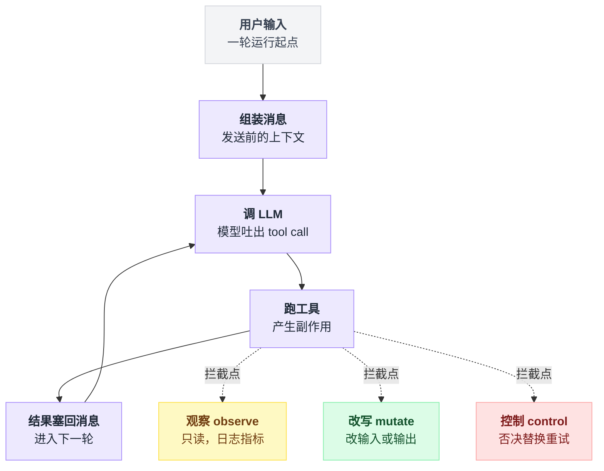

## 1. 为什么这件事很难

难点有五层，从浅到深：**拦截点放哪、能力怎么分、多个拦截器怎么合、异步和异常怎么办、凭什么让你的代码跑进来**。

**拦截点放在哪，决定了你能拦到什么。** 「工具调用前」听起来是一个点，其实至少是三个不同的位置：模型刚吐出 tool call 时、工具参数校验后、真正执行时。

放太早，你看到的参数还没被规范化；放太晚，工具可能已经产生副作用。Pi 就把它拆成了 `tool_execution_start`（UI 用）和 `tool_call`（拦截用）两个事件，顺序是前者先于后者。

**「能改」和「能中止」是两种不同的授权，混在一起会出事。** 如果拦截器返回值既能表示「我改了参数」又能表示「我不让跑」，那一个 handler 忘了写 `return` 就可能意外放行或意外阻断。

三家给出的答案不一样：Pi 干脆规定「改参数靠原地 mutate `event.input`，返回值**只**用来 block」；Codex 用进程退出码（`exit 2` = 阻断）和 stdout JSON 两条独立通道；LangChain 则用「你调不调 `handler()`」这个动作本身来表达。

**多个拦截器同时存在时，顺序和合并规则必须是确定的。** 两个扩展都想改同一个工具参数怎么办？一个说 allow 一个说 deny 听谁的？「先注册的在外层还是内层」？

这些规则如果不写死，行为就会随加载顺序漂移。而且顺序在请求方向和响应方向上往往是相反的——洋葱模型天然处理这件事，事件模型则需要额外约定。

**异步和错误传播是隐藏的地雷。** 拦截器可以是异步的（要弹 UI、要调 HTTP、要 spawn 进程），那 agent loop 就得等它。等多久？超时了算放行还是算阻断？拦截器自己抛异常算什么？

「日志 handler 抛异常导致整个 agent 崩掉」和「权限 handler 抛异常导致危险命令被放行」是两种相反的灾难，一个系统必须为不同拦截点选择不同的 fail-open / fail-closed 策略。

**最后一层，是信任。** 拦截器是在 agent 进程里跑的代码。它能读会话历史、能改发给模型的内容、能拿到 API key。

谁有资格往这里塞代码？企业管理员想要「只允许我下发的 hook」，个人用户想要「装个社区插件就能用」。这两个诉求在同一套机制里很难同时满足。

## 2. Pi 的做法

### 2.1 一句话概括

Pi 提供一个**事件总线**：扩展是一个导出工厂函数的 TypeScript 文件，用 `pi.on("事件名", handler)` 订阅，共 **33 个事件**，其中约三分之一的 handler 可以通过返回值改写数据或否决操作。

### 2.2 机制拆解

扩展是一个默认导出函数的 `.ts` 文件，从 `~/.pi/agent/extensions/`（全局）和 `.pi/extensions/`（项目级，需项目被信任后才加载）自动发现。它由 Pi 直接 import 执行，跑在同一个进程里，拥有完整系统权限。

文档原文的警告没打折扣：「Extensions run with your full system permissions and can execute arbitrary code. Only install from sources you trust.」[^1]

33 个事件按阶段分组如下——这张表就是完整清单，因为 `pi.on()` 的重载签名本身就是清单[^2]：

| 分组 | 事件 | 能力 |
|---|---|---|
| 启动 | `project_trust` | **控制**：返回 `{trusted: "yes"/"no"/"undecided", remember?}` 决定是否信任项目 |
| | `resources_discover` | **改写**：追加 skill/prompt/theme 路径 |
| 会话 | `session_start`、`session_info_changed`、`session_shutdown`、`session_compact`、`session_tree` | 观察 |
| | `session_before_switch`、`session_before_fork` | **控制**：`{cancel: true}` |
| | `session_before_compact` | **控制**：`{cancel}` 或直接返回自定义 `compaction` 结果 |
| | `session_before_tree` | **控制**：`{cancel}` 或替换 `summary` / 改写摘要指令 |
| Agent | `before_agent_start` | **改写**：注入消息、替换 `systemPrompt`（多扩展返回时**链式叠加**） |
| | `agent_start`、`agent_end`、`agent_settled`、`turn_start`、`turn_end` | 观察 |
| | `message_start`、`message_update` | 观察 |
| | `message_end` | **改写**：替换整条消息（强制校验 role 不变） |
| | `context` | **改写**：替换整个 `messages[]`（每次 LLM 调用前） |
| Provider | `before_provider_headers` | **改写**：原地 mutate headers，`null` 值删除该 header |
| | `before_provider_request` | **改写**：返回值整个替换 HTTP payload |
| | `after_provider_response` | 观察（status + headers，在消费流之前） |
| 工具 | `tool_execution_start`、`tool_execution_update`、`tool_execution_end` | 观察（UI 用） |
| | `tool_call` | **控制**：`{block, reason}`；改参数靠原地 mutate `event.input` |
| | `tool_result` | **改写**：patch `content`/`details`/`isError`/`usage` |
| 输入 | `input` | **控制**：`action` 取 `continue` / `transform`（改写文本）/ `handled`（扩展自行处理，不进 agent） |
| | `user_bash` | **控制**：替换 bash 执行实现，或直接返回执行结果 |
| 模型 | `model_select`、`thinking_level_select` | 观察 |

表里值得单独点出的是 `before_provider_headers` 和 `before_provider_request`——它们把拦截点一路下探到了 **HTTP 层**。

这在三家里是独一份的：你可以完整替换掉发给 provider 的 JSON body。Pi 官方示例里就有靠这个做自定义 provider、改写 payload 的完整代码[^3]。

### 2.3 源码

handler 的类型签名极简，返回值类型由事件决定：

```typescript
// packages/coding-agent/src/core/extensions/types.ts:1188
/** Handler function type for events */
export type ExtensionHandler<E, R = undefined> = (event: E, ctx: ExtensionContext) => Promise<R | void> | R | void;
```

注意 `R = undefined` 是默认值——**大多数事件的 handler 返回什么都没用**，返回类型就是 `void`。只有在 `pi.on()` 重载里显式写了第二个类型参数的事件才有改写能力。

这是一个用类型系统表达权限分级的干净做法。

`tool_call` 的结果类型把「改」和「否决」明确分开了：

```typescript
// packages/coding-agent/src/core/extensions/types.ts:1071
export interface ToolCallEventResult {
	/** Block tool execution. To modify arguments, mutate `event.input` in place instead. */
	block?: boolean;
	reason?: string;
}
```

多个 handler 怎么合，写成伪代码就三行：

```
result = 空
for ext in 已加载扩展:                 // 加载顺序，串行 await
    for handler in ext 的 tool_call handlers:
        r = await handler(event, ctx)  // handler 可以原地改 event.input
        if r:
            result = r
            if r.block: return r       // 第一个 block 就短路，deny 优先
return result
```

也就是：**deny 优先、后来的改写盖住先前的、谁都没说话就放行**。实现在下面这段：

```typescript
// packages/coding-agent/src/core/extensions/runner.ts:932
	async emitToolCall(event: ToolCallEvent): Promise<ToolCallEventResult | undefined> {
		const ctx = this.createContext();
		let result: ToolCallEventResult | undefined;

		for (const ext of this.extensions) {
			const handlers = ext.handlers.get("tool_call");
			if (!handlers || handlers.length === 0) continue;

			for (const handler of handlers) {
				const handlerResult = await handler(event, ctx);

				if (handlerResult) {
					result = handlerResult as ToolCallEventResult;
					if (result.block) {
						return result;
					}
				}
			}
		}

		return result;
	}
```

这段代码有三个细节值得单独看。

**串行 `await`**，不是并发——所以 handler 之间可以看到彼此对 `event.input` 的修改。

**第一个 block 短路返回**，deny 优先。

以及最容易看漏的一条：**这里没有 `try/catch`**。对比同一个文件里的 `emitContext`、`emitToolResult`、`emit`，它们全都包了 try/catch 并把异常转成 `emitError` 诊断信息后**继续执行**。`emitToolCall` 是唯一的例外，异常会一路冒到调用方：

```typescript
// packages/coding-agent/src/core/agent-session.ts:479
	private _installAgentToolHooks(): void {
		this.agent.beforeToolCall = async ({ toolCall, args }) => {
			const runner = this._extensionRunner;
			if (!runner.hasHandlers("tool_call")) {
				return undefined;
			}

			try {
				return await runner.emitToolCall({ /* ... */ });
			} catch (err) {
				if (err instanceof Error) {
					throw err;
				}
				throw new Error(`Extension failed, blocking execution: ${String(err)}`);
			}
		};
```

错误信息写得很直白：`Extension failed, blocking execution`。

这就是第 1 节说的那条分界线的一个具体答案——**观察类事件 fail-open（扩展崩了不影响 agent），安全类事件 fail-closed（扩展崩了就不让跑）**。

把 `emitToolCall` 的串行遍历、短路和这层 fail-closed 包装画在一起：

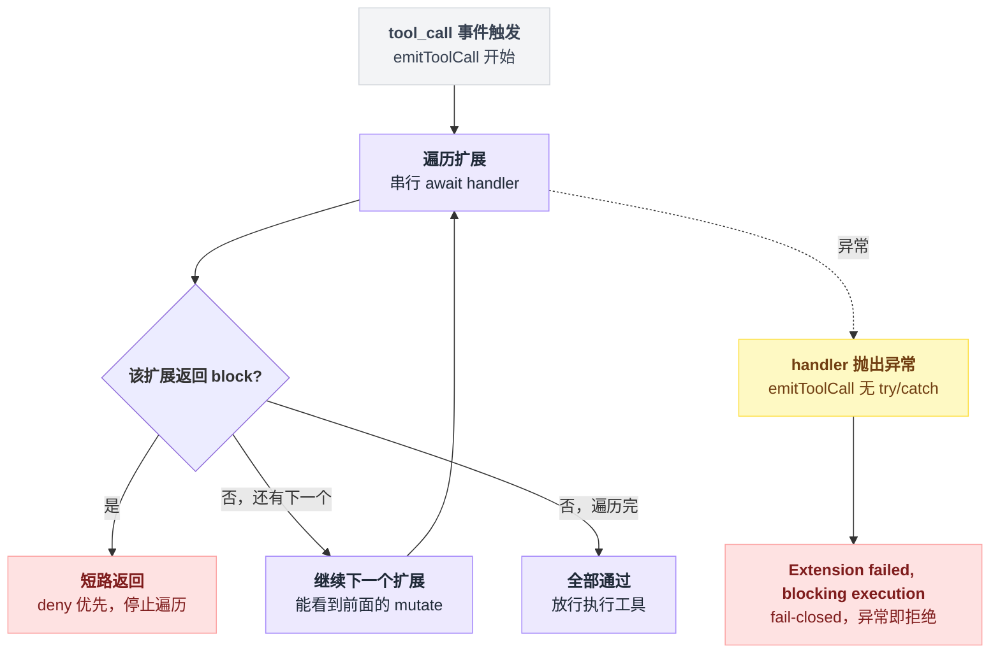

一个完整的权限门扩展只有二十几行：

```typescript
// packages/coding-agent/examples/extensions/permission-gate.ts
export default function (pi: ExtensionAPI) {
	const dangerousPatterns = [/\brm\s+(-rf?|--recursive)/i, /\bsudo\b/i, /\b(chmod|chown)\b.*777/i];

	pi.on("tool_call", async (event, ctx) => {
		if (event.toolName !== "bash") return undefined;

		const command = event.input.command as string;
		const isDangerous = dangerousPatterns.some((p) => p.test(command));

		if (isDangerous) {
			if (!ctx.hasUI) {
				// In non-interactive mode, block by default
				return { block: true, reason: "Dangerous command blocked (no UI for confirmation)" };
			}

			const choice = await ctx.ui.select(`⚠️ Dangerous command:\n\n  ${command}\n\nAllow?`, ["Yes", "No"]);

			if (choice !== "Yes") {
				return { block: true, reason: "Blocked by user" };
			}
		}

		return undefined;
	});
}
```

`ctx.hasUI` 这个分支是关键设计：拦截器必须显式处理「没人可问」的情况，而例子给的默认答案是**拒绝**。

`ctx.ui.select()` 是个异步调用，agent loop 就停在这里等——这也解释了为什么 `emitToolCall` 必须串行 await。

### 2.4 代价与适用边界

**能力上限被卡在「事件回调」这个形状上。** 你能改进去的、能改出来的、能说不，但你**不能包住一次调用**。

想实现「模型调用失败自动换模型重试」，Pi 的事件模型给不了——`before_provider_request` 只能改一次 payload，`after_provider_response` 只能看状态码，没有任何一个 handler 手里握着「重新执行这次调用」的把手。Pi 里模型 fallback 是内建能力（模型注册表 + retry 逻辑），不是扩展能力。

这是范式本身的天花板，不是实现遗漏。

**同进程执行 = 零隔离。** 扩展能读你的 `~/.aws/credentials`。Pi 的缓解手段是 `project_trust` 事件门控项目级扩展加载，全局扩展则完全靠用户自觉。相比 Codex 的 hash 信任机制，这一层是薄的。

**33 个事件是很大的 API 表面积。** 每个事件的语义（什么时候触发、并行工具模式下顺序如何、handler 能看到多新的 session 状态）都要文档化。

扩展文档有 2987 行、是全仓最长的文档，这不是巧合[^4]——文档里甚至要专门解释「在默认并行工具执行模式下，同一条 assistant 消息的兄弟工具调用会先串行预检、再并发执行，所以 `tool_call` 不保证能在 `ctx.sessionManager` 里看到兄弟工具的结果」这种细节。

API 表面积的成本是实打实的。

## 3. Codex 的做法

### 3.1 一句话概括

Codex 把拦截点做成**外部进程调用**：`hooks.json` 里为 11 个生命周期事件配置 shell 命令，Codex 把事件序列化成 JSON 写进子进程 stdin，读 stdout 的 JSON（或 exit code）决定后续行为——并且这套协议是**照着 Claude Code 抄的**。

### 3.2 机制拆解

feature flag 的注释毫不掩饰这一点：

```rust
// codex-rs/features/src/lib.rs:93
    /// Enable Claude-style lifecycle hooks loaded from hooks.json files.
    CodexHooks,
```

它是 `Stage::Stable`、`default_enabled: true`，配置 key 为 `hooks`，legacy 别名 `codex_hooks`[^5]。

11 个事件写死在一个常量数组里：

```rust
// codex-rs/hooks/src/lib.rs:19
/// Hook event names as they appear in hooks JSON and config files.
pub const HOOK_EVENT_NAMES: [&str; 11] = [
    "PreToolUse",
    "PermissionRequest",
    "PostToolUse",
    "PreCompact",
    "PostCompact",
    "SessionStart",
    "SessionEnd",
    "UserPromptSubmit",
    "SubagentStart",
    "SubagentStop",
    "Stop",
];
```

各事件的能力从 `Outcome` 结构体一眼可见（`hooks/src/events/*.rs`）：

| 事件 | 输出能力 |
|---|---|
| `PreToolUse` | `should_block` + `block_reason`、`updated_input`（改写工具参数）、`additional_contexts`（给模型追加上下文） |
| `PermissionRequest` | `decision`：`Allow` 或 `Deny{message}` |
| `PostToolUse` | `should_block`、`feedback_message`、`additional_contexts` |
| `UserPromptSubmit` | `should_stop`、`additional_contexts` |
| `SessionStart` | `should_stop`、`additional_contexts` |
| `Stop` | `should_stop`、`should_block` + `block_reason`、`continuation_fragments`（往下一轮塞 prompt 片段） |
| `PreCompact` / `PostCompact` / `SessionEnd` / `SubagentStart` / `SubagentStop` | `should_stop` 为主 |

注意**没有任何一个事件能改模型请求本身**——没有 header 钩子，没有 payload 钩子，没有 messages 改写钩子。

Codex 的钩子只覆盖「工具 / 提示词 / 会话」三条边界，不下探到 provider 层。

### 3.3 源码

配置格式是 `事件名 → MatcherGroup[] → HookHandlerConfig[]`，`matcher` 是正则，`command` 是 shell 字符串[^6]：

```json
{
  "hooks": {
    "PreToolUse": [
      {
        "matcher": "Bash",
        "hooks": [
          { "type": "command", "command": "/usr/local/bin/guard.sh", "timeout": 30 }
        ]
      }
    ]
  }
}
```

同一套结构也能写在 `config.toml` 的 `[hooks]` 下；两处都写会产生一条 warning[^7]。

**最有信息量的一处细节**是 matcher 的兼容别名：

```rust
// codex-rs/core/src/tools/hook_names.rs:32
    /// Returns the hook identity for file edits performed through `apply_patch`.
    ///
    /// The serialized name remains `apply_patch` so logs and policies can key
    /// off the actual Codex tool. `Write` and `Edit` are accepted as matcher
    /// aliases for compatibility with hook configurations that describe edits
    /// using Claude Code-style names.
    pub(crate) fn apply_patch() -> Self {
        Self {
            name: "apply_patch".to_string(),
            matcher_aliases: vec!["Write".to_string(), "Edit".to_string()],
        }
    }
```

同一个文件里，`spawn_agent()` 接受别名 `Agent`，shell 类工具的 hook 名直接就叫 `bash() -> Self::new("Bash")`——一个大写 B 的 `Bash`，在一个内部工具全是 snake_case 的 Rust 代码库里。

这是刻意的：**让为 Claude Code 写的 hooks.json 能原封不动地在 Codex 上跑**。

注释还特别强调 payload 里序列化出去的仍是规范名 `apply_patch`，别名只参与选择，「so audit logs and downstream policy decisions stay stable」——兼容做在匹配层，审计口径不受污染。

多个 hook 的执行方式和 Pi 相反，是**并发**的。合并规则写成伪代码是这样：

```
results = 并发跑所有 handler，各自记下 completion_order（谁先跑完）
block   = results.任一个 should_block                  // deny 优先，幂等
rewrite = results 里带 updated_input 的，取 completion_order 最大的那个
输出顺序 = 按 configured_order 排序                     // 只为报告稳定，不影响裁决
```

也就是说：**裁决用「任一 deny」，改写用「最后跑完的赢」，而给人看的报告用配置顺序**——三个顺序各管各的。

```rust
// codex-rs/hooks/src/engine/dispatcher.rs:88
pub(crate) async fn execute_handlers<T>(
    shell: &CommandShell,
    handlers: Vec<ConfiguredHandler>,
    input_json: String,
    cwd: &Path,
    turn_id: Option<String>,
    parse: fn(&ConfiguredHandler, CommandRunResult, Option<String>) -> ParsedHandler<T>,
) -> Vec<ParsedHandler<T>> {
    let mut pending = FuturesUnordered::new();
    for (configured_order, handler) in handlers.into_iter().enumerate() {
        // ...
    }

    let mut completed = Vec::new();
    let mut completion_order = 0;
    while let Some((configured_order, mut parsed)) = pending.next().await {
        parsed.completion_order = completion_order;
        completion_order += 1;
        completed.push((configured_order, parsed));
    }
    completed.sort_by_key(|(configured_order, _)| *configured_order);
    completed.into_iter().map(|(_, parsed)| parsed).collect()
}
```

并发跑、按配置顺序排序输出（报告稳定），但同时记录 `completion_order`。为什么要两个顺序？因为合并规则不同：block 是「任一个说 block 就 block」（`results.iter().any(...)`），而 `updated_input` 的冲突则按**完成顺序**取最后一个：

```rust
// codex-rs/hooks/src/events/pre_tool_use.rs:145
/// Chooses the rewrite from the hook that actually finished last.
///
/// Hook results stay in configured order for stable reporting, but the
/// `PreToolUse` contract resolves competing rewrites by completion order.
fn latest_updated_input(...) -> Option<Value> { /* max_by_key(completion_order) */ }
```

这是并发换来的代价：两个 hook 同时想改参数时，结果取决于谁先跑完——**不确定**。Pi 的串行 mutate 至少是确定的。

两个 hook 并发跑、结果按完成顺序取舍，时序摆出来是这样：

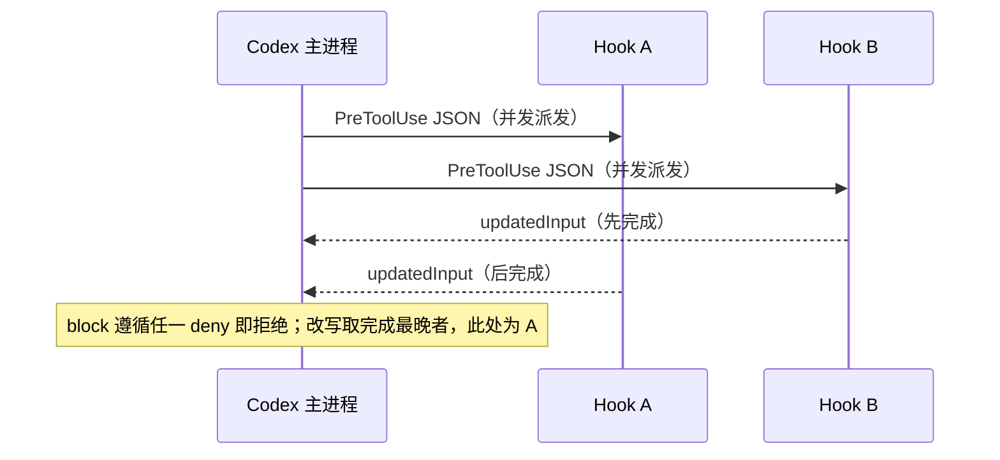

hook 跑完之后怎么解析结果，是一张小契约表：

| 情况 | 判定 |
|---|---|
| stdout 吐 JSON | 认 `hookSpecificOutput.permissionDecision: allow\|deny\|ask`、`updatedInput`、`additionalContext` |
| 退出码 2 + stderr 写理由 | block |
| 退出码 2 但 stderr 为空 | 判 `Failed`，**不是** block——协议不允许含糊 |
| 其他非零退出码 | 一律 `Failed`（不阻断） |
| 跑太久 | 由 `timeout(handler.timeout_sec, child.wait_with_output())` 兜底 |

2 是 deny 的专用码，不是"随便一个非零值"——同族的 Grok Build 干脆给它起了个名字，`GATE_EXIT_CODE = 2`（详见第 8 节）[^8]。

超时的默认值分两档：`SessionEnd` 默认 1 秒、上限 3 秒，其他 hook 默认 10 分钟[^9]。

被 block 之后，Codex 把它变成一条给模型看的错误：

```rust
// codex-rs/core/src/hook_runtime.rs:210
    if (tool_name.name() == "Bash" || tool_name.name() == "apply_patch")
        && let Some(command) = tool_input.get("command").and_then(Value::as_str)
    {
        PreToolUseHookResult::Blocked(format!(
            "Command blocked by PreToolUse hook: {reason}. Command: {command}"
        ))
    } else { /* ... */ }
```

它被包成 `FunctionCallError::RespondToModel(message)`[^10]——**模型会看到这条拒绝理由并可以据此调整**，而不是静默失败。

**信任模型**是 Codex 相对另外两家最厚的一层。每个 hook 的配置（事件名 + matcher + 归一化后的 handler）会算一个 hash，只有 hash 与用户已批准的 `trusted_hash` 相符才会被装载：

```rust
// codex-rs/hooks/src/engine/discovery.rs:651
fn hook_trust_status(is_managed: bool, current_hash: &str, trusted_hash: Option<&str>) -> HookTrustStatus {
    if is_managed {
        HookTrustStatus::Managed
    } else {
        match trusted_hash {
            Some(trusted_hash) if trusted_hash == current_hash => HookTrustStatus::Trusted,
            Some(_) => HookTrustStatus::Modified,
            None => HookTrustStatus::Untrusted,
        }
    }
}
```

改一个字符，`Trusted` 立刻变 `Modified`，hook 就不再执行。

企业侧还有 `allow_managed_hooks_only`，开启后只有 `is_managed`（来自 MDM / 企业托管配置 / 系统层）的 hook 能跑：

```rust
// codex-rs/hooks/src/engine/discovery.rs:60
impl HookDiscoveryPolicy {
    fn allows(self, source: &HookHandlerSource<'_>) -> bool {
        !self.allow_managed_hooks_only || source.is_managed
    }
}
```

这个开关**只在 requirements 层（MDM / 企业配置）生效，写在普通 `config.toml` 里不算数**——有专门的测试固定了这个行为[^11]。

否则用户自己就能给自己"提权"，策略形同虚设。

装载前的判定逻辑收拢成一张图：

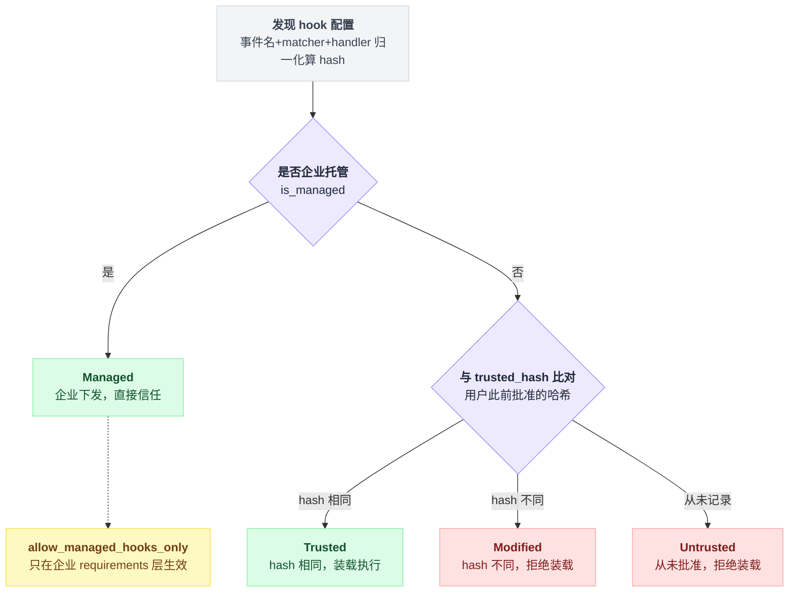

### 3.4 代价与适用边界

**进程边界买来的隔离，代价是延迟和贫瘠的接口。** 每次 `PreToolUse` 都要 fork/exec 一个进程、序列化 JSON、等 stdout。对高频事件这不便宜。

而且 hook 只能看到 JSON payload 里给的字段——`tool_name`、`tool_input`、`cwd`、`transcript_path` 等[^12]。想读完整会话？只给一个 `transcript_path` 让你自己去解析文件。

**没有 provider 层拦截。** 想给模型请求加 header、想改 messages、想做 fallback，hooks 一律无能为力。Codex 的定位很清楚：hooks 是**策略与审计**设施，不是扩展框架。

**并发执行导致改写冲突不确定。** 上面那个 `latest_updated_input` 就是明证。实践上应该保证同一事件同一 matcher 下最多一个 hook 会返回 `updatedInput`。

**协议兼容性是产品决策，不是技术必然。** 抄 Claude Code 的 `hooks.json` 意味着 Codex 继承了那套 schema 的所有形状（`hookSpecificOutput` 这种嵌套、exit code 2 这种约定）。

好处是生态可迁移，坏处是以后想演进协议会被兼容性绑住。schema 里 `turn_id` 字段的描述就已经写着 `"Codex extension: ..."`——分叉已经开始了。

## 4. LangChain v1 的做法

### 4.1 一句话概括

LangChain v1 的 `AgentMiddleware` 基类同时提供两种钩子：**节点式**（`before_agent`/`before_model`/`after_model`/`after_agent`，被编译成 LangGraph 图里的真实节点，返回 state 更新）和**洋葱式**（`wrap_model_call`/`wrap_tool_call`，拿到一个 `handler` 回调，可以不调、调一次、调多次）——后者是 Pi 和 Codex 都没有的能力档位。

### 4.2 机制拆解

基类的钩子清单如下，每个都有 `a` 前缀的 async 版本[^13]：

| 钩子 | 形状 | 能力 |
|---|---|---|
| `before_agent` / `abefore_agent` | 节点 | 返回 state 更新；配 `@hook_config(can_jump_to=[...])` 可返回 `{"jump_to": "end"}` 短路 |
| `before_model` / `abefore_model` | 节点 | 同上 |
| `wrap_model_call` / `awrap_model_call` | 洋葱 | **拿到 `handler`，可重试 / 短路 / 改 request / 改 response** |
| `after_model` / `aafter_model` | 节点 | 返回 state 更新；可 `jump_to` |
| `wrap_tool_call` / `awrap_tool_call` | 洋葱 | 同 `wrap_model_call`，针对单次工具执行 |
| `after_agent` / `aafter_agent` | 节点 | 返回 state 更新 |

外加两个非钩子的扩展点：`tools`（中间件自带工具，会被合并进 agent 的工具集）和 `state_schema`（中间件可以往 agent state 里加自己的字段）。

这两个在另外两家都没有对应物——中间件在 LangChain 里不只是拦截器，它可以**往 agent 里加东西**。

`wrap_model_call` 的 docstring 把能力说得很清楚[^14]：

> The handler callback executes the model request and returns a `ModelResponse`. Middleware can call the handler multiple times for retry logic, skip calling it to short-circuit, or modify the request/response. Multiple middleware compose with first in list as outermost layer.

### 4.3 源码

洋葱是怎么套起来的？先看伪代码：

```
composed = handlers[最后一个]                  // 最内层
for h in handlers[倒数第二个 .. 第一个]:        // 从右往左
    composed = 用 h 包住 composed
composed(request, 真正执行模型的函数)           // 列表第一个 = 最外层
```

一句话：**从右往左折叠，所以列表第一个中间件最后被包上，也就跑在最外层。**

```python
# langchain/agents/factory.py:293
    def compose_two(
        outer: _ModelCallHandler[ContextT] | _ComposedModelCallHandler[ContextT],
        inner: _ModelCallHandler[ContextT] | _ComposedModelCallHandler[ContextT],
    ) -> _ComposedModelCallHandler[ContextT]:
        """Compose two handlers where outer wraps inner."""

        def composed(request, handler):
            accumulated_commands: list[Command[Any]] = []

            def inner_handler(req: ModelRequest[ContextT]) -> ModelResponse:
                # Clear on each call for retry safety
                accumulated_commands.clear()
                inner_result = inner(req, handler)
                # ... 归一化
            outer_result = outer(request, inner_handler)
            return _to_composed_result(outer_result, extra_commands=accumulated_commands or None)

        return composed

    # Compose right-to-left: outer(inner(innermost(handler)))
    composed_handler = compose_two(handlers[-2], handlers[-1])
    for h in reversed(handlers[:-2]):
        composed_handler = compose_two(h, composed_handler)
```

`accumulated_commands.clear()` 那一行的注释「Clear on each call for retry safety」值得停一下：因为外层随时可能把内层再跑一遍，所有内层的副作用累积都必须是**幂等可重置**的。

这是洋葱模型的隐藏税——一旦允许重试，整条链上的状态管理复杂度就上去了。

最里层就是真正的模型调用[^15]，`model_node` 只是把它交给组合好的洋葱：

```python
# langchain/agents/factory.py:1455
        has_structured_output = initial_response_format is not None
        if wrap_model_call_handler is None:
            model_response = _execute_model_sync(request)
            return _build_commands(model_response, has_structured_output=has_structured_output)

        result = wrap_model_call_handler(request, _execute_model_sync)
```

而节点式钩子被编译成 LangGraph 的真实节点[^16]，节点名就是 `f"{m.name}.before_model"`。关键在**方向**：`before_*` 按中间件列表正序连边，`after_*` 反序：

```python
# langchain/agents/factory.py:1750
    # Add after_model middleware edges
    if middleware_w_after_model:
        graph.add_edge("model", f"{middleware_w_after_model[-1].name}.after_model")
        for idx in range(len(middleware_w_after_model) - 1, 0, -1):
```

也就是说，即使是节点式钩子，整体形状仍然是洋葱：`M1.before → M2.before → model → M2.after → M1.after`。列表第一个中间件永远在最外层。

这个规则是全局统一的，四种节点钩子加两种 wrap 钩子共享同一个直觉。

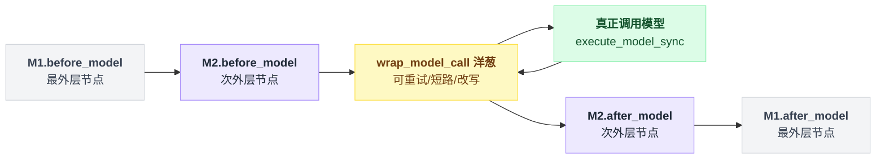

**实例精读一：`ModelFallbackMiddleware`**——这是 Pi/Codex 结构上做不到的那类需求。

```python
# langchain/agents/middleware/model_fallback.py
    def wrap_model_call(self, request, handler):
        last_exception: Exception
        try:
            return handler(request)
        except GraphBubbleUp:
            raise
        except Exception as e:
            last_exception = e

        for fallback_model in self.models:
            fallback_request = (
                request
                if _supports_anthropic_cache_control(fallback_model)
                else _sanitize_request_for_fallback(request)
            )
            try:
                return handler(fallback_request.override(model=fallback_model))
            except GraphBubbleUp:
                raise
            except Exception as e:
                last_exception = e
                continue

        raise last_exception
```

`handler` 被调了 N 次，每次换一个 model。

`except GraphBubbleUp: raise` 是必须的细节——LangGraph 的控制流信号（中断、父级命令）不能被当成「模型失败」吞掉重试。`ToolRetryMiddleware.wrap_tool_call` 里有一模一样的模式，注释写着「Control-flow signals (interrupts, parent commands) must propagate, not be retried or converted to error messages.」[^17]

这是洋葱范式的第二笔隐藏税：**你必须能区分「业务异常」和「框架控制流」**。

`handler` 被调几次、什么时候放行 `GraphBubbleUp`，画成判定流是这样：

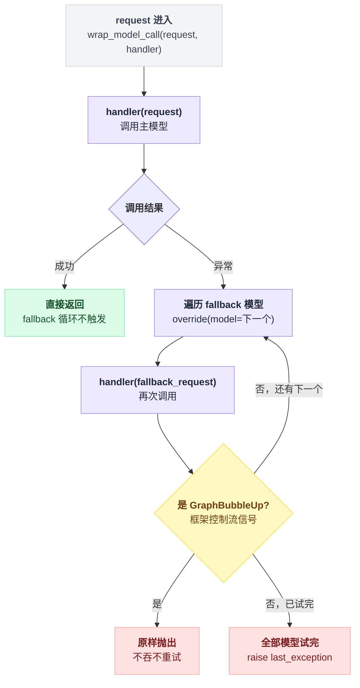

这个文件还暴露了洋葱模型的一个真实坑：模块顶部的 docstring 解释，如果外层套了 Anthropic prompt caching 中间件，它在 fallback 循环**之前**就已经把 `cache_control` 标记打进了 request，而外层不会因为内层重试而重新运行，「therefore cannot clean up after itself」——所以 fallback 中间件不得不自己去清理别人的标记。

洋葱层之间不是完全解耦的。

**实例精读二：`HumanInTheLoopMiddleware`**——和 Pi 的 permission-gate 目标相同，实现路径完全不同。

```python
# langchain/agents/middleware/human_in_the_loop.py:399
    def after_model(self, state, runtime) -> dict[str, Any] | None:
        # ... 找出最后一条 AIMessage 中需要审批的 tool_calls
        hitl_request = HITLRequest(action_requests=action_requests, review_configs=review_configs)

        # Send interrupt and get response
        decisions = interrupt(hitl_request)["decisions"]

        # ... 按 decision 重建 tool_calls
        last_ai_msg.tool_calls = revised_tool_calls
        return {"messages": [last_ai_msg, *artificial_tool_messages]}
```

它**没有**用 `wrap_tool_call`，而是用 `after_model` + LangGraph 的 `interrupt()`。

区别很大：Pi 的 `ctx.ui.select()` 是同步阻塞在进程里等人点；`interrupt()` 是把整个图的状态存进 checkpointer 然后**结束这次运行**，人类的决定可以在几小时后从另一个进程 resume 回来。

而且它拦的是「AI 消息里的 tool_calls 数组」，可以整批审批、可以 edit 参数、可以 reject 并伪造一条 ToolMessage 回给模型（`allowed_decisions: approve|edit|reject|respond`）。

这是「框架 vs 产品」这条轴最直观的体现——LangChain 假设 agent 跑在服务端、人在另一头。

**实例精读三：`TodoListMiddleware`**——和 Pi 的取舍正面相撞。

Pi 的 README 里写着[^18]：

> **No built-in to-dos.** They confuse models. Use a TODO.md file, or build your own with extensions.

LangChain 则把 to-do 做成了官方中间件。它同时用了三个扩展点：

```python
# langchain/agents/middleware/todo.py:220
        self.tools = [
            StructuredTool.from_function(
                name="write_todos", description=tool_description,
                func=_write_todos, coroutine=_awrite_todos,
                args_schema=WriteTodosInput, infer_schema=False,
            )
        ]

    def wrap_model_call(self, request, handler):
        # ... 把 self.system_prompt 追加到 system message
        return handler(request.override(system_message=new_system_message))
```

加上 `state_schema = PlanningState`（存 todos）和 `after_model`（检测同一轮里出现多个 `write_todos` 并行调用就返回错误 ToolMessage）。

**一个功能 = 一个工具 + 一段 system prompt + 一块 state + 一个校验钩子**，四件事被打包成一个可插拔单元。这正是 Pi 说「build your own with extensions」时想表达的东西——只不过 LangChain 替你 build 好了，Pi 认为不该内建。

有趣的是两边的分歧不在机制而在**判断**：Pi 说 to-do 让模型混乱，LangChain 的 `WRITE_TODOS_SYSTEM_PROMPT` 里恰好花了大段文字在对抗同一个混乱[^19]——「`write_todos` tracks your work; it does not deliver the answer... Marking the last todo complete is not itself an answer to the user.」

两边都观察到了同一个失败模式，一个选择不做，一个选择用 prompt 补丁按住。

**实例精读四：`PIIMiddleware`** 展示了另一个模式——同一个中间件在多个拦截点上打配合。

它用 `before_model` 洗输入侧（用户消息 + tool results），用 `after_model` 洗输出侧，并且**额外注册一个 stream transformer**（`self.transformers`）去洗流式输出的表面，因为 state 层的钩子看不到 token 流。`strategy="block"` 时 `apply_strategy` 直接抛 `PIIDetectionError` 让整个 run 失败。

一个安全需求需要覆盖三条不同的数据路径，这不是设计冗余，是流式 agent 的真实复杂度。

`ModelCallLimitMiddleware` 则演示了节点式钩子的短路方式：

```python
# langchain/agents/middleware/model_call_limit.py:165
    @hook_config(can_jump_to=["end"])
    @override
    def before_model(self, state, runtime) -> dict[str, Any] | None:
        # ...
                return {"jump_to": "end", "messages": [limit_ai_message]}
```

`can_jump_to` 是编译期声明——`_get_can_jump_to` 读它来决定要不要给这个节点加条件边[^20]。没声明就没边，运行时返回 `jump_to` 也跳不了。

### 4.4 代价与适用边界

**它不是给终端用户的。** 写一个 LangChain 中间件要理解 `AgentState`、`Runtime`、`Command`、`ModelRequest.override()`、LangGraph 的节点/边/checkpointer。

Pi 的 permission-gate 是 25 行任何 TS 工程师都读得懂的代码；等价的 LangChain 版本要求你先理解洋葱和 state schema。

**sync/async 双份实现是持续的税。** 基类里每个钩子都是成对的，`wrap_model_call` 和 `awrap_model_call` 各写一遍。

基类的 `NotImplementedError` 消息长达五行，专门解释「你只实现了 async 版但用 `invoke()` 同步调用了」这个高频错误——这个错误消息存在本身就说明它被踩得够多。

**洋葱层之间不是真解耦。** fallback 中间件那份文件顶部关于 `cache_control` 的 docstring 是最好的证据：中间件 A 的行为（打缓存标记）在中间件 B 重试时会失效，而 B 不得不硬编码 A 的知识去清理。

文件注释坦承这个知识是重复的（"duplicated here rather than owned solely by the Anthropic partner package"），而且失败模式是**静默的**——标记被误删只会丢失 prompt caching，不会报错，CI 抓不到。

**节点式钩子会让图变大。** 每个 `before_model` 都是一个真实的图节点、一条真实的边。中间件多了，图的可视化和调试都会变复杂。

这是把中间件编译进 LangGraph 换来的代价——好处是每个钩子都天然可观测、可 checkpoint、可 resume。

## 5. 三方横向对比

### 5.1 机制维度

| 维度 | Pi | Codex | LangChain v1 |
|---|---|---|---|
| 拦截器载体 | 同进程 TypeScript 模块 | 外部命令（子进程，stdin/stdout JSON） | 同进程 Python 类 |
| 拦截点数量 | 33 个事件 | 11 个生命周期事件 | 6 个钩子 ×（sync/async）+ tools/state_schema |
| 范式 | 事件订阅 | 外部进程调用 | 洋葱包裹 + 图节点 |
| 能否重试/多次执行被拦截的操作 | **不能** | **不能** | **能**（`handler()` 想调几次调几次） |
| 能否完全替换被拦截的操作 | 部分（`user_bash` 可，模型调用不可） | 不能（只能 block） | **能**（不调 `handler` 直接返回结果） |
| 能否改工具参数 | 能（原地 mutate `event.input`） | 能（`updatedInput`） | 能（`request.override(tool_call=...)`） |
| 能否否决工具执行 | 能（`{block, reason}`） | 能（JSON `deny` 或 `exit 2` + stderr） | 能（不调 `handler`，直接返回 ToolMessage） |
| 能否改 HTTP 请求 | **能**（`before_provider_headers` / `before_provider_request`） | 不能 | 部分（`request.override(model=..., model_settings=...)`，不到 header 层） |
| 能否改会话消息 | 能（`context` 替换 messages、`message_end` 替换消息） | 只能追加（`additionalContext`） | 能（`request.override(messages=...)` / state 更新） |
| 多拦截器执行方式 | 串行 await，加载顺序 | **并发**（`FuturesUnordered`），报告按配置序 | 嵌套（列表第一个 = 最外层） |
| 冲突合并 | 第一个 `block` 短路；`tool_result` 链式 patch | deny 优先；`updatedInput` 取**完成最晚**者 | 由嵌套顺序天然决定 |
| 异常语义 | 观察类 fail-open（转 diagnostic），`tool_call` **fail-closed** | 非零退出码 = Failed（不阻断）；exit 2 + stderr = block | 异常沿洋葱向上传播；`GraphBubbleUp` 必须放行 |
| 超时 | 无（靠 `ctx.signal`） | 有（默认 600s，SessionEnd 1s/上限 3s） | 无（中间件自己管） |
| 人工确认形态 | 阻塞 TUI 弹窗 | hook 进程自己想办法 | `interrupt()` + checkpointer，可跨进程恢复 |
| 信任模型 | 项目信任门控项目级扩展；全局扩展无门控 | **每个 hook 配置 hash 签名**（Trusted/Modified/Untrusted）+ 企业 `allow_managed_hooks_only` | 无（就是你自己的代码） |
| 中间件能否加工具 / 加 state | 能加工具（`pi.registerTool`），不能加 state schema | 不能 | **能**（`tools` + `state_schema`） |

这张大表里最硬的一条分野，是「能不能包住一次调用重跑」——三家在这条线上直接分出两派：

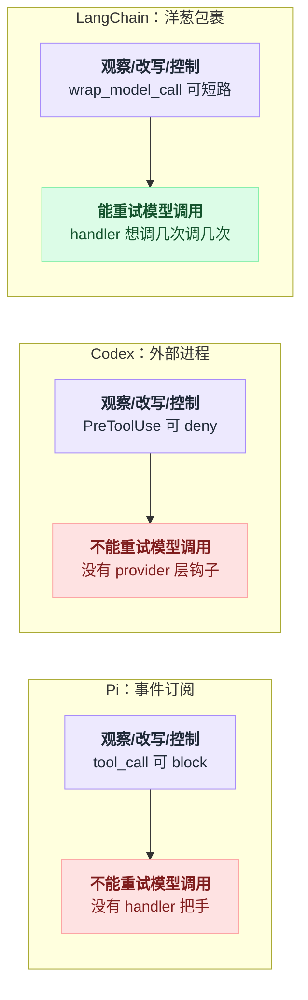

### 5.2 同一需求，三种写法

**需求 A：记录每次工具调用到审计日志。**

```typescript
// Pi
export default function (pi: ExtensionAPI) {
  pi.on("tool_call", (event) => {
    console.error(JSON.stringify({ t: Date.now(), tool: event.toolName, input: event.input }));
  });
}
```

```json
// Codex —— ~/.codex/hooks.json，matcher 留空匹配全部
{ "hooks": { "PreToolUse": [ { "hooks": [
  { "type": "command", "command": "tee -a ~/audit.jsonl > /dev/null" }
] } ] } }
```
（hook 从 stdin 拿到完整 JSON payload，`tee` 直接落盘；不写 stdout 就是纯观察。）

```python
# LangChain v1
from langchain.agents.middleware import wrap_tool_call

@wrap_tool_call
def audit(request, handler):
    log.info("tool=%s args=%s", request.tool_call["name"], request.tool_call["args"])
    result = handler(request)
    log.info("result=%s", result)
    return result
```

注意只有 LangChain 这版能在**同一个函数里**看到调用和结果——Pi 需要 `tool_call` + `tool_result` 两个 handler 靠 `toolCallId` 关联，Codex 需要 `PreToolUse` + `PostToolUse` 两个进程靠 `tool_use_id` 关联。

**需求 B：危险命令需人工确认。**

Pi 见 §2.3 的权限门扩展（已完整引用）：`tool_call` 里等一次用户选择，不满意就否决，无 UI 时默认拒绝。

Codex：`hooks.json` 挂 `PreToolUse` + matcher `"Bash"`，脚本读 stdin 的 `tool_input.command`，危险就往 stdout 吐

```json
{"hookSpecificOutput":{"hookEventName":"PreToolUse","permissionDecision":"deny","permissionDecisionReason":"rm -rf blocked"}}
```

或者更省事：`echo "rm -rf blocked" >&2; exit 2`。

注意 hook 是个独立进程，**它没有 Codex 的 TUI**——想弹窗得自己调 `osascript` / `zenity`，或者干脆改用 `PermissionRequest` 事件让 Codex 自己去问人。

LangChain：`HumanInTheLoopMiddleware(interrupt_on={"bash": True})`，靠 `interrupt()` 把决策权交出图外，人类的答复通过 checkpointer resume 回来。

三种写法的差别不在语法，在**「人在哪里」的假设**：Pi 假设人就在终端前面；Codex 假设 hook 作者自己知道怎么找到人；LangChain 假设人可能在几小时后从一个 HTTP 请求里回来。

## 6. 可以拿走的工程经验

1. **用类型/协议把「观察」「改写」「控制」三档能力分开，别让一个返回值兼任三种含义。** Pi 的做法最干净：`ExtensionHandler<E, R = undefined>` 默认返回 `void`，只有显式声明了 `R` 的事件才有改写权；并且在 `ToolCallEventResult` 的注释里硬性规定「改参数用 mutate，返回值只管 block」。适用条件：拦截点超过 10 个时收益明显，少于 5 个时这套类型体操不值得。

2. **为不同拦截点选择不同的 fail-open / fail-closed 策略，并写进代码而不是文档。** Pi 的 `emitToolCall` 是全 runner 里唯一不包 try/catch 的 emit，异常一路冒到调用方变成 `Extension failed, blocking execution`。日志钩子挂了不该拖垮 agent，权限钩子挂了必须拦住操作——这两条规则要用「有没有 try/catch」这种结构性差异来表达，靠约定迟早会漂。

3. **要支持重试/fallback/缓存，就必须给拦截器一个 `handler` 回调，事件模型做不到。** 这是本章最硬的结论。如果你的 harness 未来可能需要「换模型重试」「结果缓存」「工具调用去重」，从第一天就把模型调用和工具调用设计成 `wrap(request, handler)` 形状。代价是：所有拦截器都得处理「可能被执行多次」，副作用累积必须可重置（见 `accumulated_commands.clear()` 那一处清理[^21]），并且要有一类**不可重试的控制流异常**（LangChain 的 `GraphBubbleUp`）被显式放行。

4. **并发执行拦截器之前，先确定改写冲突的解决规则。** Codex 用 `FuturesUnordered` 并发跑 hook 拿到了延迟收益，但代价是 `updatedInput` 的冲突要靠 `completion_order` 解决——非确定性。如果拦截器只做观察和否决（否决是幂等的：任一 deny 即 deny），并发是安全的；一旦允许改写，要么串行，要么在配置层保证同一事件下只有一个改写者。

5. **外部进程 hook 要配 hash 信任 + 企业强制开关，而且开关必须放在用户改不到的配置层。** Codex 的 `hook_trust_status` 用配置 hash 判断 Trusted/Modified/Untrusted，改一个字符就失效；`allow_managed_hooks_only` 只在 MDM/企业 requirements 层生效，写在用户 `config.toml` 里不算数（有专门的测试固定这个行为）。任何「安全策略开关」如果能被被约束方自己打开，就不是策略。

6. **如果你的生态里已经有事实标准的 hook 协议，兼容它的成本可能低于教育用户的成本——但要把兼容做在匹配层，不要污染数据层。** Codex 的 `HookToolName` 把这件事做得很干净：`Write`/`Edit`/`Agent` 只作为 `matcher_aliases` 参与选择，序列化进 hook stdin 的永远是规范名 `apply_patch`/`spawn_agent`，「so audit logs and downstream policy decisions stay stable」。兼容层和真相层分离。

7. **中间件不一定只能拦截，也可以「加东西」。** LangChain 的 `AgentMiddleware` 带 `tools` 和 `state_schema` 两个字段，`TodoListMiddleware` 因此能把「一个工具 + 一段 system prompt + 一块 state + 一个校验钩子」打包成一个可插拔单元。如果你在设计扩展机制，考虑让扩展单元的粒度是「一个完整特性」而不是「一个回调」。

## 7. 本章存疑

- Pi 的 `emitToolCall` 缺 try/catch 是刻意的 fail-closed 设计，还是历史遗留？调用方的 catch 分支把非 Error 值包装成「Extension failed, blocking execution」，读起来像是刻意的，但源码里没有注释直接说明[^22]。⚠️ 未确认。
- Codex 的 `PreToolUse` 与 `PermissionRequest` 两个事件在职责上有重叠（都能拒绝工具执行）。它们的触发时机差异、以及一个返回 `ask` 时是否会转交给 `PermissionRequest`，我没有从工具注册表完整确认调用链[^23]。⚠️ 未确认。
- Codex hook 的 `"async": true` 选项在 `HookExecutionMode` 里只见到 `Sync` 被硬编码进 `running_summary` / `completed_summary`[^24]。异步 hook 的实际执行路径与其结果如何（是否被忽略）我没有追到底。⚠️ 未确认。
- LangChain 的 `HumanInTheLoopMiddleware` 用 `after_model` + `interrupt()` 而不是 `wrap_tool_call`。推测原因是需要一次性审批同一条 AI 消息里的**全部** tool_calls（`wrap_tool_call` 是单次调用粒度），但源码里没有设计说明。⚠️ 未确认。
- Pi 的 `context` 事件与 `before_provider_request` 事件都能改发给模型的内容，两者的边界（前者操作 `AgentMessage[]`、后者操作已序列化的 provider payload）清楚，但如果两个扩展分别在这两个点上修改同一处内容，最终以谁为准、中间是否有归一化步骤，我没有追 provider 层代码确认。⚠️ 未确认。

## 8. 第四个样本：Grok Build

> 调研时间 2026-08-06，`xai-org/grok-build` commit `a5589e9`；全项目背景见 [17 番外](./17-番外-GrokBuild全项目速览.md)。本节只看钩子/中间件维度。

**归类先行：外部进程范式，与 Codex 同族，且本章的核心结论第四次成立**——Grok Build 的 hook 摸不到模型调用。

模型请求没有任何包裹点，`ModelFallbackMiddleware` 式的"重试/替换一次调用"在这个范式里同样做不出来。四个样本、三种范式，能力天花板的判定一次没被推翻。

**形态**：两种 handler，`HandlerType::{Command, Http}`[^25]。

Command 与 Codex 同构：spawn 子进程、事件 envelope JSON 写 stdin、读 stdout JSON + exit code，deny 专用 `GATE_EXIT_CODE = 2`[^26]，裁决优先级 stdout JSON > exit code——即第 1 节说的"「能改」和「能中止」分通道"，它和 Codex 选了同一套。

Http 是本章三个主样本都没有的：POST 到 URL 的 webhook，带 SSRF 校验[^27]——把 hook 从"本机脚本"扩展到了"团队服务端策略"。

**兼容是设计目标**：配置文件结构就是 Claude Code 的 hooks.json（`{"hooks":{"PreToolUse":[{"matcher":..,"hooks":[{"type":"command"}]}]}}`），事件名接受 PascalCase/snake_case/camelCase，**连 Cursor 风格的 `beforeShellExecution` 别名都收**（`hook_events!` 宏表逐事件列出别名）[^28]。

**事件面**：15 个变体 / 14 个规范事件（`SubagentEnd` 是 `SubagentStop` 的兼容别名，经 `canonical()` 折叠）。数量上排在 Pi(33) 和 Codex(11) 之间，形态上完全是 Codex 那族。

可拦截的门只有三个，其余全是 Observe：

| 门 | 能力 |
|---|---|
| `PreToolUse`（Tool 门） | 只有 `{"decision":"allow"\|"deny"}`——**不能改 tool input**，无 Claude Code `updatedInput` 等价物（全仓 grep 无命中） |
| `Stop` / `SubagentStop`（Stop 门） | 最强：`decision:"block"` + reason 强迫模型继续、`continue:false` 强停、`additionalContext` 注入——Claude Code stop-hook 同款语义；超时单独放宽到 600s[^29] |

`UserPromptSubmit` 是 Observe 且 matcher 被忽略——**连注入 prompt 上下文都不行**，比 Claude Code 的同名事件（可 additionalContext）还窄。

失败策略一律 **fail-open**（超时/崩溃/坏输出不拦截）[^30]。对照第 6 节工程经验第 2 条：Pi 给权限类拦截点选了 fail-closed（`emitToolCall` 不包 try/catch），Grok 全线 fail-open，这意味着**它的 hook 是旁路策略层，不是安全边界**——安全边界在 permission 引擎和沙箱（见 [11 章](./11-安全沙箱与权限.md)第 8 节）。

**第二平面**：除用户 hooks 外另有内部 workspace 的 turn hook，`before_turn`/`after_turn` 请求-响应式，`HookReply` 可注入 System/Developer/User turn 并 `ForceContinue`/`ForceStop` 循环——能力比用户 hooks 强一档，但那是内部协议不对用户开放[^31]。

"对内强、对外弱"的两平面设计，和 Codex 的 hooks（对外）vs 内部事件总线是同一种权力结构。

把用户 hooks 的三个门、失败策略和内部 turn hook 摆在一张图上：

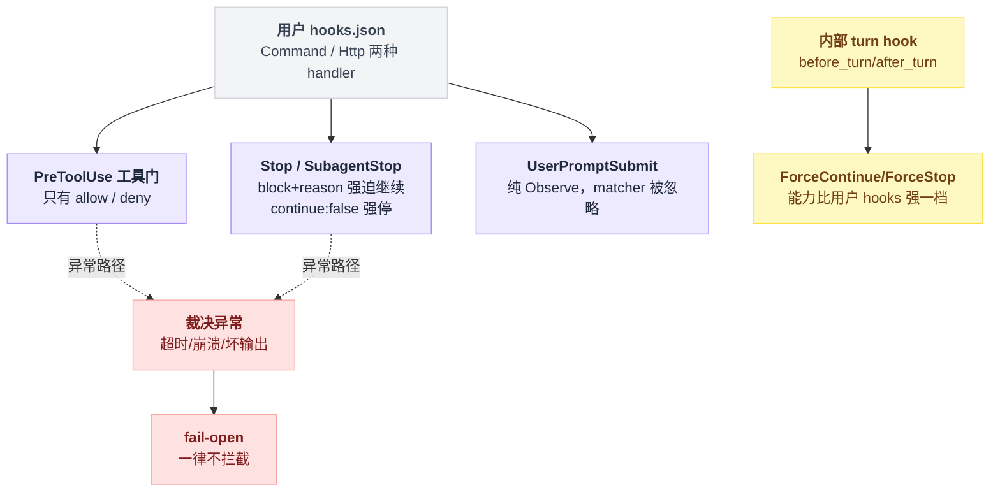

本节未确认：hook 发现来源里 agent 定义 frontmatter 声明的 hooks（`HookProvenance`）与全局 hooks 的裁决合并顺序未逐行核对；Http handler 的重试/超时语义未追查。

---

## 9. 第五个样本：DeepSeek Harness

> 调研时间 2026-08-14，`deepseek-ai/deepseek-harness` v0.1.0-rc.5（commit `47f9438`）；全项目背景见 [18 番外](./18-番外-DeepSeekHarness全项目速览.md)。本节只看中间件/钩子维度。

**一句话**：dsh 是第一个把 Koa 式 `(payload, next)` 洋葱直接搬进 agent 主链路的样本——13 个 waterfall 拦截点，监听器签名就是 `(payload, next) => ...`。

但**它的 `next()` 是一次性的**：无参数、游标共享、二次调用不重入。所以第 6 节结论 3「要重试就得给 `handler` 回调」在**机制层第五次成立**。

而 dsh 仍然做出了 `ModelFallbackMiddleware` 的等价物——办法是把重试循环留在 loop 里、让插件在 `agent/request-error` 上**投票**、重试次数写进 session log。这是本章的**第五种答案：洋葱 + 循环投票的混合体**。

### 9.1 waterfall 的实现本体：能包住，不能重跑

vendored cordis 的 waterfall 只有十行：

```typescript
// vendor/cordis/src/events.ts:234-243
  waterfall(...args: any[]) {
    const cbs = this.dispatch('waterfall', args)
    const inner = args.pop()
    const next = () => {
      const cb = cbs.shift() ?? inner
      return cb(...args)
    }
    args.push(next)
    return next()
  }
```

三个决定性细节，逐个对照 LangChain 的 `handler(request)`：

| | LangChain `wrap_model_call` | dsh waterfall |
|---|---|---|
| 传参 | `handler(request)`，请求**向内**传，可 `request.override(model=...)` | `next()` **不接受参数**；`args` 数组共享，改请求只能原地 mutate（而 dsh 的关键载荷都被冻结，见 9.3）或改 `next()` 的**返回值**（数据向外流） |
| 重跑 | `handler` 是纯函数，想调几次调几次 | `cbs.shift()` 游标共享，**二次 `next()` 不重入** |
| 短路 | 不调 `handler` 直接 return | 同，原文写作 "not calling it vetoes"[^32] |

第二条为什么会这样？把游标展开看一遍就明白了：

```
cbs = [A, B]        // 注册顺序，一个共享的队列
inner = TERMINAL

next() 第 1 次  → cbs.shift() 拿到 A  → 跑 A
  A 调 next()   → cbs.shift() 拿到 B  → 跑 B
    B 调 next() → cbs 空，落到 inner  → 跑 TERMINAL#1
  A 再调 next() → cbs 仍然是空的      → 跑 TERMINAL#2   // B 被整条跳过
```

**队列是消费掉就没了的，所以"重试"只重试了最内层，中间那几层不会再跑。**

第二条我按上面的 waterfall 实现原样复刻跑了一遍（两个监听器 A/B + terminal，A 调两次 `next()`）[^33]：输出是 `A-in | B | TERMINAL#1 | A-mid | TERMINAL#2 | A-retry`——**terminal 确实跑了两次，但 B 在重试时被整条跳过了**。

也就是说 dsh 的洋葱是"单程"的：能 wrap、能 veto、能替换结果、能换 `exec.signal`，但不能把内层链路重放一遍。

`A-in | B | TERMINAL#1 | A-mid | TERMINAL#2 | A-retry` 这串输出拆成时序就是：

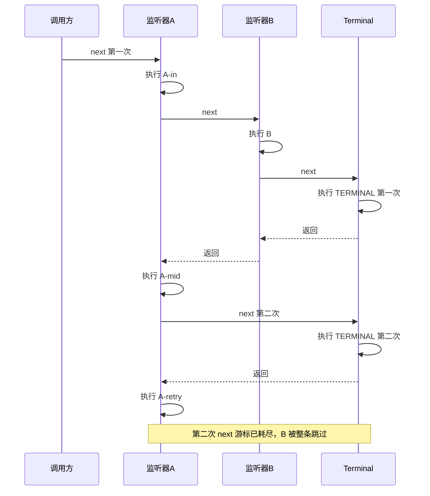

**这里有一处文档与代码的张力**（本章要求专门标出的那类发现）。

`llm/stream` 的模块文档把它描述为 "Waterfall around every streaming model call (**retry**, replay, routing)"，`tools/execute` 的模块文档把它描述为 "Around-dispatch waterfall for timeout, **retry**, or metrics"，cookbook 同样写 "Tool deadline / retry / metrics"[^34]。

但按上面的游标语义，一个真靠二次 `next()` 重试的插件会**静默跳过同一 waterfall 上的兄弟监听器**——`llm/stream` 现有 5 个监听包、`tools/execute` 现有 2 个[^35]。

全仓（`packages` + `vendor` 下所有 `.ts`，含测试）376 处 `next()` 里我没找到任何一处两次调用，实际的重试全部走 9.2 那条路。**文档声称的 retry 语义在代码里没有安全实现路径。**

### 9.2 ModelFallback 在 dsh 里长什么样：重试在 loop，决策在插件

重试循环是 loop 自己的 `while (true)`；流跑完发现 `finish.kind` 是 `'error'` 或 `'aborted'` 时，loop **把决定权 waterfall 出去**[^36]：

```typescript
// packages/core/agent-loop/src/agent.ts:355-370（省去 366 行的 signal.throwIfAborted()）
        const action = await this.dispatch.waterfall(
          'agent/request-error', { turn, step, provider: request.provider, failure: finish.failure,
            retryPolicy: preparedCall?.retryPolicy, signal },
          () => Promise.resolve<RequestErrorAction>(undefined),
        )
        if (action?.kind !== 'retry') {
          throw new LlmError(finish.failure.message, finish.failure.code, finish.failure)
        }
        continue
```

`RequestErrorAction` 的类型只有 `{ kind: 'retry' }` 或 `undefined` 两种取值[^37]——整个协议只有一个 bit。

`continue` 之后重新进 `buildRequest()`，于是**又走一遍 `agent/request` waterfall**[^38]，而 `agent/request` 正是换模型的地方：

```typescript
// packages/core/agent/src/runtime-types.ts:244
'agent/request'(this: Scoped<Agent>, payload: { agent: Agent; turn: number; step: number; signal: AbortSignal },
                next: () => Promise<LlmCallConfig>): Promise<LlmCallConfig>
```

现成范式在 model-selection 插件里：先 `await next()` 拿到内层结果，再原样返回，只把其中的 `provider`、`model` 两个字段替换掉[^39]。

所以一个 `ModelFallbackMiddleware` 等价物在 dsh 里就是**两个监听器的插件**：

```
on('agent/request-error', ({ failure }) => {
    if 这个失败码不该重试: return undefined
    记一笔到 session log
    return { kind: 'retry' }              // 协议只有这一个 bit
})

on('agent/request', async (payload, next) => {
    const resolved = await next()
    return { ...resolved, provider, model } // 按已失败次数换一个
})
```

**能做，且不需要碰 loop。**

决定权在插件、循环留在 loop 的分工画出来是这样：

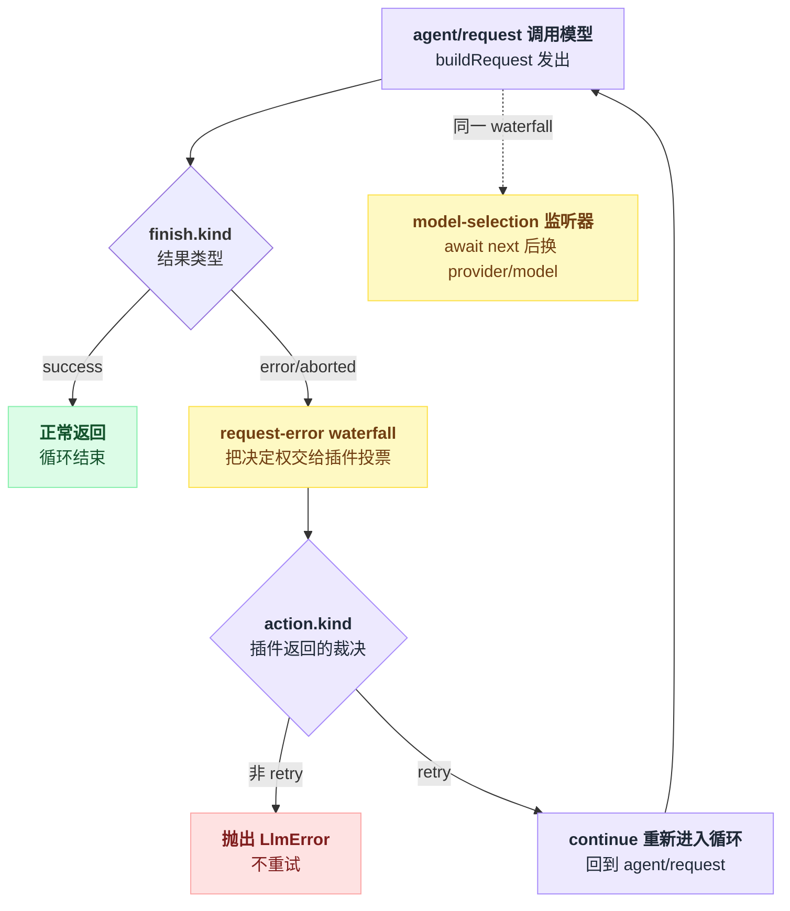

重试执行器本身已经在仓库里，是一个独立的 `llm-retry` 包（src 共 494 行，主文件 226 行）[^40]。

它的形状值得单独点名——**重试计数不在闭包里，在 session log 里**：

```typescript
// packages/llm/llm-retry/src/index.ts:150-153
    agent.session.append('llm/retry', eventData)
    if (!await cancellableDelay(delayMs, fusedSignal)) return
    agent.session.append('llm/retry-started', { retryId, turn, step, retry })
    return { kind: 'retry' }
```

下一次进来时它 `findLast` 日志里同 turn/step/provider/policyKey 的 `llm/retry` 事件来算 `previousRetry`（`:182-190`）。模块头一句原话：「Each scheduled retry is durable before its cancellable wait.」

对照 LangChain 的 `for fallback_model in self.models` ——那是一个进程内的 for 循环，进程一挂重试历史就没了；dsh 的重试状态是可 resume 的持久事实。

**代价**是每次重试都要扫一遍事件流，且 `policyKey` 变了（改配置）计数就重置。

### 9.3 模型请求本身不许改：Model-visible ⟺ logged

Pi 在本章是唯一能下探到 HTTP 层改 payload 的（`before_provider_request`）。dsh 明确**反着来**：`agent/request` 的文档写着「Model-visible content must use logged channels; this waterfall cannot mutate messages.」，`llm/stream` 拿到的 loop 请求是 deep-frozen 的，原文 "arrives deep-frozen (mutation throws) … so listeners read it, never rewrite it"[^41]。

这条不是口头约定，有 runtime invariant 顶着：请求没冻结、messages 与 `session.deriveMessages()` 不逐字节相等、或与折叠出的 `request/header` 不一致，一律 `fail(... log-reconstruction desync)`。

invariant 注册时带 `{ global: true, prepend: true }`，注释解释得很直白：「Prepend prevents a short-circuiting replay listener from silencing the check.」[^42]

所以 dsh 在「能不能改发给模型的东西」这一格上是**第五种答案：能，但只能经过会落日志的通道**（`agent/request` 换 config → 落 `request/header`；`agent.inject()` / prompt section → 落 session 事件）。

中间件想偷偷往 payload 里塞一句话，会被 invariant 当场打断。

### 9.4 packages/hooks：把 Codex/Grok 的外部进程范式降格成"外设"

dsh 有 3 个 hook 包（`hook-protocol` 854 行 / `hooks-claude-code` 514 行 / `hooks-codex` 445 行）。

定位写得很清楚[^43]：「a "native hook" is just an ordinary Cordis plugin on those extension points. These packages are the **bridges** that translate the external shell-hook protocol onto that same surface.」

**外部进程钩子在 dsh 里不是一等公民，是兼容层**。这是五个样本里第一次出现这种权力反转（Codex/Grok 的 hook 就是钩子机制本身）。

| 维度 | dsh 的 Claude Code 桥 | 对照 Codex / Grok |
|---|---|---|
| 支持事件 | **7 个**：SessionStart、UserPromptSubmit、PreToolUse、PostToolUse、Stop、SubagentStart、SubagentStop；Codex 桥只有 **5 个**[^44] | Codex 11、Grok 14 |
| 改工具参数 | **不支持**：`updatedInput` 被解析、记录、warn，然后丢弃，模块头原文 "`updatedInput` is logged and warned but not honored"[^45] | Codex 支持；Grok 同样不支持 |
| 裁决通道 | stdout JSON（`permissionDecision`）+ exit 2 + stderr，两条通道；顶层 `decision` 只认 `approve`/`block`，越权的 `{"decision":"deny"}` 被**明确忽略**[^46] | 与 Codex/Grok 同族 |
| 多 hook 合并 | **串行 for 循环** + `deny > ask > allow` 单调折叠[^47] | Codex 是 `FuturesUnordered` 并发、改写冲突取完成最晚者（非确定）——dsh 这里是确定的 |
| 失败策略 | 全线 **fail-open**：spawn 失败 / 无退出码 / 基础设施异常都转成"非阻塞错误"，`runHook` 的 JSDoc 承诺 "never throws or crashes the calling turn"[^48] | 与 Grok 一致；Pi 的 `tool_call` 是 fail-closed |
| 超时 | 默认 600000ms，注释说明这就是 CC 和 Codex 共同的参考默认值[^49] | 同 Codex |
| 信任模型 | **无 hash 签名、无企业开关**；`configPath` 由插件配置（`cordis.yml`）显式给出，进程启动时读一次 | 比 Codex 薄，与 Pi/Grok 同档 |
| 审计 | **每次 hook 调用落 session log**：`hook/invoked` / `hook/result` 成对写入，还有专门的 invariant 校验配对与 turn 归属[^50] | 五家里独一份——hook 执行本身是可回放的持久事实 |

**能不能像 Claude Code stop-hook 那样强迫续跑？能，但走的是数据而不是返回值。**

`agent/turn-stopping` 是 serial、没有 `next()`、返回 `void`[^51]，桥的做法是：

```typescript
// hooks-claude-code/src/index.ts:270-277
  ctx.on('agent/turn-stopping', async ({ agent, turn, signal }): Promise<void> => {
    const merged = await runPoint('Stop', '', stopPayload(ctx, agent), { agent, turn, signal })
    if (merged.decision === 'deny') {
      const text = merged.reason ?? 'continue: blocked by Stop hook'
      agent.steer(createUserMessage({ content: [{ type: 'text', text }], source: PLUGIN_SOURCE }))
    }
  })
```

事件声明里那句设计说明是本节最值得抄走的一句[^52]：「a listener that objects steers (`agent.steer(...)`) and the machine re-reads its inbox: fresh steering runs another step, none closes the turn. **Data decides, so listener order cannot change the outcome.**」

第 1 节担心的"多个拦截器顺序导致行为漂移"，dsh 的解法不是定死顺序，而是**取消返回值通道**：所有人只能往 inbox 里放数据，谁先谁后都一样。

代价写在代码里：`// TODO(stop-loop-guard): cap consecutive forced continuations; hooks must self-limit meanwhile.`[^53]——**目前没有强制续跑的次数上限**。

另一处缺口：`continue:false`（强停）被解析和合并了，但 `// TODO(hook-continue-false): merged.stop is logged but needs a run-level halt mechanism.`[^54]，即**桥不支持强停**。

### 9.5 两层工具门：可重排的策略层 + 单调的不变量层

第 1 节问过「一个说 allow 一个说 deny 听谁的」。dsh 把这件事拆成两层。

`tools/pre-execute` 是 waterfall，官方叫它 "the reorderable policy layer"[^55]，先注册的监听器（＝外层）可以在 `await next()` 拿到内层结论之后翻盘。

而 `ctx.tools.guard()` 是**注册在 waterfall 之后的单调闸门**：「Any matching guard may deny by returning a reason, while **no guard can force-allow a call another guard denied**.」[^56]

需要"任何人不得放行"的安全语义走 guard，需要"可以被更聪明的策略覆盖"的走 waterfall。**这是五个样本里唯一把"策略"和"不变量"做成两种不同注册 API 的**。

两层各管什么、谁能拦下谁，拆成图是这样：

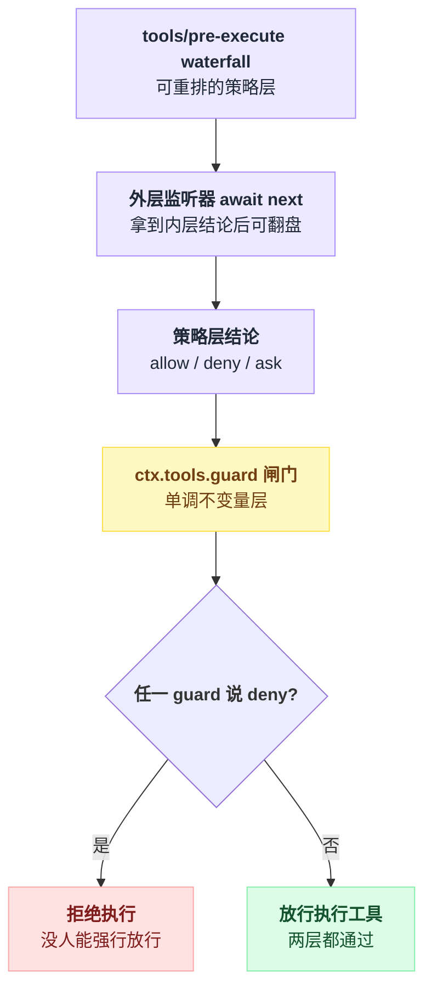

### 9.6 ctx.effect：注册即回滚，所以中间件生态可以热插拔

`ctx.effect()` 的语义[^57]：effect 体立即执行，产生的 disposer 被收集，**按注册的逆序**在 fiber 卸载或显式 dispose 时执行。`ctx.on()` 本身也是 effect。

全仓 `packages/*/*/src` 下 199 处 `.effect(` / 261 处 `.on(`（收窄到 `ctx.` 前缀则是 165 / 197）——数量级相当，意味着"每个注册都有配对回滚"这条纪律确实落地了。

`llm-retry` 的收尾是个标准范例[^58]：dispose 时先摘监听器、再 abort 生命周期信号、最后等所有在途重试排空。

对中间件生态的实际意义是 cookbook 里那一行[^59]：「Plugin hot-reload | every registration is a `ctx.effect` → vendored HMR just works」——**装/卸一个拦截器不需要重启 agent**，Pi（进程内 import）、Codex（进程启动读 hooks.json）、Grok 都没有这个属性。

### 9.7 事件面：56 个 harness 事件，13 个是拦截点

按全仓事件总表（一份生成物）逐行数[^60]，主表构成是：

| 模式 | 个数 |
|---|---|
| `emit` | 41 |
| `waterfall` | 13 |
| `serial` | 1 |
| `parallel` | 1 |
| 合计 harness 事件 | **56** |

另有 4 行 `internal/*` 的 cordis 内部事件，模式列为空。

13 个 waterfall 是全部**可包裹**的拦截点：`agent/pre-step`、`agent/request`、`agent/request-error`、`approval/request`、`fs/edit-intent`、`fs/write-intent`、`llm/stream`、`session-telemetry/record`、`system-prompt/assemble`、`tools/code-dispatch-log`、`tools/execute`、`tools/post-execute`、`tools/pre-execute`。另有 serial 的 `agent/turn-stopping`、以及根本不走事件表的 `ctx.tools.guard()`。

注意这 56 个是 **cordis 事件**，与"落日志的 session 事件"是两套 taxonomy（后者经单个 `session/event` 广播）。

数量级上排在 Pi(33) 之上、但可拦截的只有 13 个，与 LangChain 的 6 个钩子同一量级。

### 9.8 回填本章坐标系

| 维度（第 5.1 节的行） | dsh 的答案 | 最像谁 |
|---|---|---|
| 拦截器载体 | 同进程 TS 插件（Cordis），外部 shell hook 只是桥 | Pi + LangChain |
| 范式 | **单程洋葱**（waterfall，`next()` 无参不可重入） | LangChain 的形，但少一档能力 |
| 能否重试一次模型调用 | **能，但不靠洋葱**：`agent/request-error` 投票 + loop `while(true)` + session log 计数 | **第五种答案** |
| 能否完全替换被拦截的操作 | 能（不调 `next()` 自己 yield chunk） | LangChain |
| 能否改工具参数 | **不能**：`PreToolDecision` 只有 allow/deny/ask，parsed arguments deep-frozen，注释原文 "Input rewriting is excluded because arguments are already logged and presented"[^61]；`tools/execute` 的 wrapper 只能换 `exec.signal`；hook 桥同样丢弃 `updatedInput` | 与 Grok 同 |
| 能否改 HTTP/模型请求 | **明确禁止**，deep-frozen + runtime invariant | 与 Pi 正好相反 |
| 多拦截器执行 | 串行嵌套，注册顺序 = 外层优先；`prepend` 可抢外层 | LangChain |
| 冲突合并 | 策略层可重排（`tools/pre-execute`），不变量层单调（`ctx.tools.guard()`） | **第五种答案** |
| 异常语义 | `emit` 逐监听器 try/catch + promise catch，"non-vetoing"[^62]；waterfall 异常上抛；hook 桥全线 fail-open | 分档，接近 Pi 的思路 |
| 人工确认 | `tools/pre-execute` 返回 `ask` → `approval/request` waterfall 交给 UI/ACP | 介于 Pi 与 LangChain |
| 信任模型 | 无（插件配置写谁就装谁），hook 也无 hash | 最薄的一档 |
| 中间件能否加工具/加 state | **能**：插件同时可 `ctx.tools.register()`、`ctx.systemPrompt.section()`、加 session 事件类型 | LangChain（且粒度更粗） |

**它是否推翻本章既有结论？**

第 6 节结论 3 的**前半句**（"事件模型做不到重试"）在 dsh 上依然成立——但 dsh 证明了这条结论的**边界比原文窄**：真正必须的不是 `handler` 回调，而是"谁拥有那个重跑的循环"。

LangChain 把循环给了中间件，dsh 把循环留在 loop、只把**是否再来一次**这个 bit 开放出去。

后者换来两个前者没有的性质：重试次数是**持久的**（可跨进程 resume），以及重试必然重走完整的 `agent/request` 链路（不会像双 `next()` 那样跳过兄弟监听器）。

代价是插件不能自定义"重试时机以外"的控制流——比如 LangChain 那种"跑 3 次取多数"在 dsh 里做不了。

### 9.9 本节未确认

- ⚠️ 我按 9.1 节的 waterfall 实现原样复刻验证了"二次 `next()` 跳过兄弟监听器"[^66]，但**没有在 dsh 进程内实跑**（仓库只读、未执行其测试套件）。
- ⚠️ 全仓 376 处 `next()` 我用 grep 做的是模式扫描（`packages` + `vendor` 下所有 `.ts`，含测试），**未逐个函数体核对**是否存在同一 handler 内两次调用。结论"无人靠双 `next()` 重试"是抽查结论。
- ⚠️ 全仓事件总表是生成物[^63]，我按行统计出 56/41/13/1/1，但**没有独立扫源码验证生成器是否漏收**（例如注释里提到的"deliberately bypass `ctx.emit`"的 contained dispatch）。
- ⚠️ `agent/request-error` 的另一个监听者 `compaction-basic`[^64] 与 `llm-retry` 同时在链上时的裁决顺序、以及 `always` 策略里"先 `await settleDownstream(next)` 再自己兜底"的语义，我只读了 `llm-retry` 一侧，**未追 compaction 侧的完整交互**。
- ⚠️ hook 桥的 `configPath` 是"进程级、加载时读一次"，源码里有 `TODO(per-session-hook-config)`[^65]；项目级 `hooks.json` 目前是否有其它发现路径，未确认。

---

## 把这一章串起来

回到第 0 节那张三档能力表：观察、改写、控制。五个样本量的是同一件事——你的代码能不能插进 agent 的主链路——但答案各自卡在了不同的档位上。

Pi 用类型系统把权限焊死在签名里：`ExtensionHandler<E, R = undefined>` 默认只读，只有显式声明了 `R` 的事件才有改写权，`tool_call` 的 `{block, reason}` 把"改"和"否决"拆成两条通道——这是第 6 节工程经验第 1 条的原型。Codex 和 Grok Build 选了同一个范式：外部进程 + 并发/并行执行，用进程边界换隔离，代价是接口贫瘠、摸不到 provider 层，Grok 甚至连改工具参数都不给。

LangChain v1 是唯一给出 `handler` 回调的样本，`ModelFallbackMiddleware` 因此能把一次模型调用重跑 N 次——这是本章反复回到的分水岭：**没有 handler 回调，就没有重试/fallback/缓存**。DeepSeek Harness 补上了第五种答案，把这条分水岭挪了一格：它的 waterfall 长得和 LangChain 一样，但 `next()` 不可重入；它照样做出了"换模型重试"，靠的不是洋葱层本身，而是把循环的所有权留在 loop 里，只把"要不要再来一次"这一个 bit 开放给插件投票。**真正必须的不是 handler 回调，而是谁拥有那个重跑的循环。**

信任模型上，Codex 的 hash 签名 + 企业强制开关是五家里唯一经得起"用户能不能自己给自己提权"这一问的设计；dsh 反而是最薄的一档，代价用另一种方式补上——每次 hook 调用都落 session log，执行本身变成可回放的持久事实。

失败语义上，五家分成两派：Pi 对安全类事件选 fail-closed（`emitToolCall` 故意不包 try/catch），Codex、Grok、dsh 的 hook 桥全线 fail-open。这不是谁更"对"，是安全边界画在哪——Grok 和 dsh 都把真正的边界放到了别处（permission 引擎、`ctx.tools.guard()` 那层单调闸门），hook 和中间件本身只是旁路的策略层。

一句话收尾：**中间件的能力上限不取决于挂了多少个事件，取决于每一个挂点上"谁拥有那个循环"这一件事。**

---

## 出处

[^1]: Pi 扩展权限警告原文：`packages/coding-agent/docs/extensions.md:109`。
[^2]: `pi.on()` 全部重载签名：`packages/coding-agent/src/core/extensions/types.ts:1198-1239`。
[^3]: 自定义 provider 示例目录：`packages/coding-agent/examples/extensions/custom-provider-anthropic/`；改写 payload 示例：`packages/coding-agent/examples/extensions/provider-payload.ts`。
[^4]: 扩展文档全文 2987 行，及其中对并行工具执行下 `tool_call` 可见性的说明：`packages/coding-agent/docs/extensions.md`。
[^5]: legacy 别名 `codex_hooks` 声明：`codex-rs/features/src/lib.rs:1037`。
[^6]: hook 配置结构体：`codex-rs/config/src/hook_config.rs:35`（`MatcherGroup`）、`:140`、`:147`（`command` 字段）。
[^7]: 重复配置产生 warning 的判定逻辑：`codex-rs/hooks/src/engine/discovery.rs:120`。
[^8]: Grok Build 的 `GATE_EXIT_CODE = 2` 常量：`xai-org/grok-build` 的 `xai-grok-hooks/runner/command.rs:19`（详见第 8 节）。
[^9]: 超时解析逻辑：`codex-rs/hooks/src/events/pre_tool_use.rs:200-290`；超时兜底：`codex-rs/hooks/src/engine/command_runner.rs:101`。
[^10]: `FunctionCallError::RespondToModel` 的封装点：`codex-rs/core/src/tools/registry.rs:557`。
[^11]: 测试 `allow_managed_hooks_only_in_config_toml_does_not_enable_policy`：`codex-rs/hooks/src/engine/mod_tests.rs:782`。
[^12]: PreToolUse 输入 schema：`codex-rs/hooks/schema/generated/pre-tool-use.command.input.schema.json`。
[^13]: 基类钩子清单：`langchain/agents/middleware/types.py:383` 起。
[^14]: `wrap_model_call` docstring：`langchain/agents/middleware/types.py:500`。
[^15]: 真正的模型调用位置：`langchain/agents/factory.py:1414`。
[^16]: 节点式钩子编译为 LangGraph 节点：`langchain/agents/factory.py:1516` 起。
[^17]: `ToolRetryMiddleware.wrap_tool_call`：`langchain/agents/middleware/tool_retry.py:290`。
[^18]: Pi README "No built-in to-dos"：`packages/coding-agent/README.md:506`。
[^19]: `WRITE_TODOS_SYSTEM_PROMPT`：`langchain/agents/middleware/todo.py:117`。
[^20]: `_get_can_jump_to`：`langchain/agents/factory.py:499`。
[^21]: `accumulated_commands.clear()`：`langchain/agents/factory.py:308`。
[^22]: Pi 的 fail-closed 包装（catch 分支）：`packages/coding-agent/src/core/agent-session.ts:492`。
[^23]: Codex 工具调用注册表：`codex-rs/core/src/tools/registry.rs`（未定位到 `ask` 是否转交 `PermissionRequest` 的具体行号）。
[^24]: `"async"` 选项：`codex-rs/config/src/hook_config.rs:158`；`Sync` 硬编码位置：`codex-rs/hooks/src/engine/dispatcher.rs:75`、`:126`。
[^25]: `HandlerType::{Command, Http}`：`xai-grok-hooks/src/config.rs:145-148`。
[^26]: Grok `GATE_EXIT_CODE = 2`：同[^8]，`runner/command.rs:19`。
[^27]: Http handler 与 SSRF 校验：`xai-grok-hooks/runner/http.rs`。
[^28]: `hook_events!` 宏表（事件别名逐一列出）：`xai-grok-hooks/event.rs:89-187`。
[^29]: Stop 门超时放宽到 600s：`xai-grok-hooks/config.rs:124-132`。
[^30]: fail-open 判定逻辑：`xai-grok-hooks/dispatcher.rs:48-59`。
[^31]: 内部 turn hook：`xai-tool-protocol/src/turn_hook.rs:137-203`。
[^32]: `not calling it vetoes` 原文：`vendor/cordis/src/events.ts:80`。
[^33]: 复刻对象即 9.1 节引用的 `waterfall()` 实现：`vendor/cordis/src/events.ts:234-243`。
[^34]: 三处模块文档：`packages/llm/llm/src/index.ts:53`、`packages/core/tools/src/index.ts:154`、`docs/cookbook/extension-cookbook.md:114`。
[^35]: 事件总表矩阵：`docs/event-producer-consumer.md`。
[^36]: loop 主循环与错误分支：`packages/core/agent-loop/src/agent.ts:339`、`:354`。
[^37]: `RequestErrorAction` 类型定义：`packages/core/agent/src/runtime-types.ts:58`。
[^38]: `agent/request` waterfall 重入点：`packages/core/agent-loop/src/agent.ts:438-441`。
[^39]: model-selection 范式：`packages/core/agent/src/model-selection.ts:54-70`。
[^40]: `llm-retry` 包体量：`packages/llm/llm-retry`，src 共 494 行，主文件 `index.ts` 226 行。
[^41]: 两处引文：`packages/core/agent/src/runtime-types.ts:235-236`；`packages/llm/llm/src/index.ts:57-59`。
[^42]: invariant 注册位置：`packages/core/agent-loop/src/invariant.ts:20-54`。
[^43]: `packages/hooks/README.md:5`。
[^44]: 事件监听声明：`packages/hooks/hooks-claude-code/src/index.ts:206/219/238/247/270/281/291`；Codex 桥：`packages/hooks/hooks-codex/src/index.ts:1-6`。
[^45]: `updatedInput` 丢弃处理：`packages/hooks/hooks-claude-code/src/index.ts:175-177`。
[^46]: 顶层 `decision` 字段解析：`packages/hooks/hook-protocol/src/codec.ts:33-38`。
[^47]: 串行合并逻辑：`packages/hooks/hooks-claude-code/src/index.ts:152-185`；折叠逻辑：`packages/hooks/hook-protocol/src/merge.ts:1-6`。
[^48]: fail-open catch 块：`packages/hooks/hook-protocol/src/runner.ts:96-105`；JSDoc 承诺：`:60`。
[^49]: 超时默认值注释：`packages/hooks/hook-protocol/src/runner.ts:13-20`。
[^50]: 审计写入：`packages/hooks/hooks-claude-code/src/index.ts:158/182`；invariant 校验：`packages/hooks/hook-protocol/src/invariant.ts:31-58`。
[^51]: `agent/turn-stopping` 事件声明：`packages/core/agent/src/runtime-types.ts:278`。
[^52]: 设计说明原文：`packages/core/agent/src/runtime-types.ts:263-266`。
[^53]: TODO 注释：`packages/hooks/hooks-claude-code/src/index.ts:269`。
[^54]: TODO 注释：`packages/hooks/hooks-claude-code/src/index.ts:189`。
[^55]: "the reorderable policy layer"：`docs/cookbook/extension-cookbook.md:33`。
[^56]: `ctx.tools.guard()` 单调闸门原文：`packages/core/tools/src/index.ts:1101-1110`。
[^57]: `ctx.effect()` 语义：`vendor/cordis/src/fiber.ts:402-413`。
[^58]: `llm-retry` dispose 收尾：`packages/llm/llm-retry/src/index.ts:221-225`。
[^59]: Plugin hot-reload 一行：`docs/cookbook/extension-cookbook.md:129`。
[^60]: 事件总表：`docs/event-producer-consumer.md`（生成物）；产出脚本：`scripts/gen-doc-graphs.ts`。
[^61]: `PreToolDecision` 注释原文：`packages/core/tools/src/index.ts:582-587`。
[^62]: `emit` 的 try/catch 与 "non-vetoing" 语义：`packages/core/agent/src/dispatch.ts:120-136`。
[^63]: 同[^60]：`docs/event-producer-consumer.md`、`scripts/gen-doc-graphs.ts`。
[^64]: `compaction-basic` 监听者：`packages/compaction/compaction-basic/src/index.ts:179`。
[^65]: hook 桥配置读取 TODO：`packages/hooks/hooks-claude-code/src/index.ts:48-52`。
[^66]: 同[^33]：`vendor/cordis/src/events.ts:234-243`。
