# 13 · 子 Agent 与多 Agent 编排：把上下文窗口当作可分配资源

> **一句话导读**：子 agent 的第一动机不是「并行」而是「隔离上下文窗口」——让别人去读 50 个文件、只把 1000 个 token 的结论带回来；Codex 为此内置了两代共 11 个工具并让模型自己决定何时委派，Pi 明确拒绝内置、只给一个起 `pi` 子进程的示例扩展，LangChain v1 干脆不提供 `spawn_agent`，因为在 LangGraph 里「一个 agent 是另一个 agent 的工具」本来就只是一次函数调用。
>
> **本章涉及源码**
> - Pi：`packages/coding-agent/README.md:500`、`packages/coding-agent/examples/extensions/subagent/{README.md,index.ts,agents.ts}`、`examples/extensions/subagent/agents/*.md`、`examples/extensions/subagent/prompts/*.md`
> - Codex：`codex-rs/core/src/tools/handlers/multi_agents.rs` 与 `multi_agents/`（v1）、`multi_agents_v2.rs` 与 `multi_agents_v2/`（v2）、`multi_agents_spec.rs`、`multi_agents_common.rs`、`codex-rs/core/src/agent/{role.rs,registry.rs,agent_names.txt,builtins/*.toml}`、`codex-rs/core/src/session/multi_agents.rs`、`codex-rs/core/src/context/multi_agent_mode_instructions.rs`、`codex-rs/core/src/session_prefix.rs`、`codex-rs/agent-graph-store/`、`codex-rs/hooks/src/schema.rs`、`codex-rs/models-manager/models.json`
> - LangChain v1：`langchain/agents/_subagent_transformer.py`、`langchain/agents/factory.py:1795`、`tests/unit_tests/agents/test_subagent_transformer.py`、`langgraph/langgraph/types.py:664`（`Send`）、`langgraph/graph/state.py:212`（`input_schema`/`output_schema`）

---

## 0. 先搞清楚：这是个什么东西

假设你要回答一个问题：「这个仓库里，用户登录之后 session 是怎么持久化的？」

你打开 agent，它开始 grep、read、grep、read。二十次工具调用之后它给了你一个准确的答案。很好。但现在你的对话历史里躺着 **20 个文件的完整内容**——大概 8 万 token。接下来你说「好，现在帮我给登录加个二次验证」，这 8 万 token 会跟着每一次 LLM 调用一起发出去，一直发到你关掉这个会话为止。其中 95% 是你再也不会用到的噪音，但它们仍然要付费、仍然占着窗口、仍然会稀释模型对真正重要的那几条指令的注意力。

**子 agent 就是为了解决这一件事**：派一个独立的 agent 去做这 20 次工具调用，它自己那份上下文随便脏，做完之后只把一段几百字的结论交回来，然后连同它的整个历史一起被丢掉。主线程只多了几百字。

用一个类比：你是项目负责人，你派实习生去图书馆查一整天资料，他回来给你一页纸的摘要。你的脑子里只多了一页纸，不是一整天的阅读量。

两条路径在上下文里留下的痕迹完全不同：

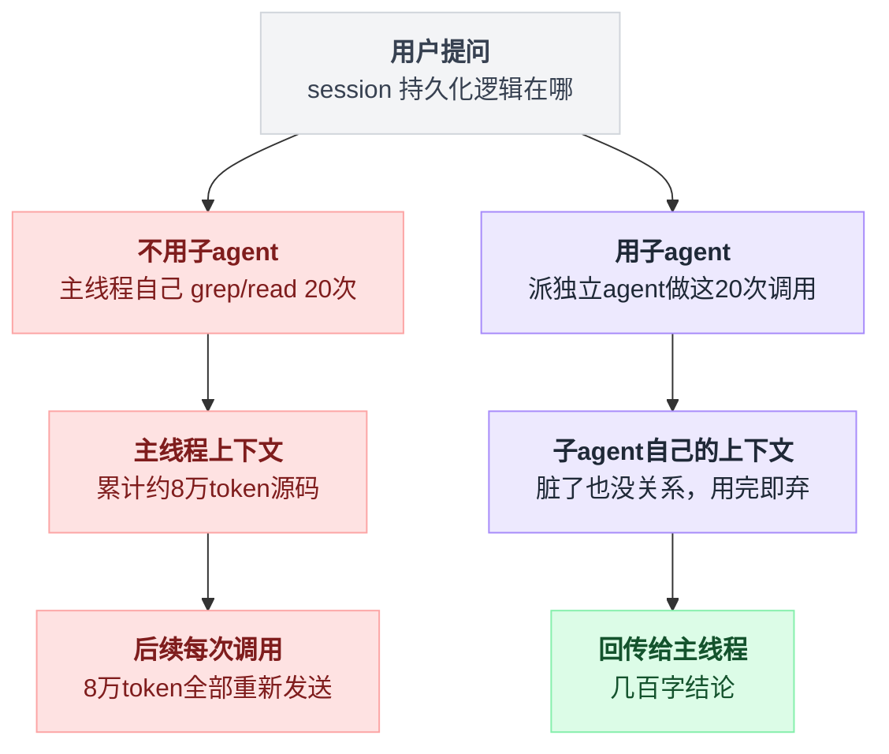

这个类比在几个地方是成立的：
- **分工**：不同的子 agent 可以配不同的系统提示词、不同的模型（便宜的模型干粗活）、不同的工具白名单（只读的探索者拿不到写文件的工具）。
- **并行**：三个互不相关的问题可以同时派三个人去查，墙钟时间几乎不变。
- **专长**：「代码审查员」和「实现者」用同一个模型但不同的人格，产出质量确实不一样。

但这个类比在几个地方**严重不成立**，而这几个地方恰好是所有工程难点的来源：

- **实习生没有共享记忆**。真实的实习生知道公司在做什么、上周开会说了什么。子 agent 只知道你在 spawn 那一刻塞给它的那段文字。你少说一句「注意我们用的是 Postgres 不是 MySQL」，它就会给你一个 MySQL 的方案。
- **你没法中途拍拍他的肩膀**——或者说，能不能拍、拍了会怎样，是 harness 必须专门设计的功能，不是免费的。
- **两个实习生同时改同一份文件时，没有人会先说一声**。真人在同一个办公室里会互相知会，会看到对方在编辑器里开着那个文件。子 agent 之间对彼此的存在一无所知，它们共享同一个文件系统，谁后写谁赢。
- **雇佣成本是实时计费的，而且可以递归**。一个子 agent 可以再派子 agent。没有硬性限制的话，一次「深入调研」可以在你没注意的时候烧掉几十美元。

记住一个判断顺序：**子 agent 首先是上下文管理手段，其次才是并行手段**。如果你不是为了隔离上下文而拆子 agent，你多半只是在给自己制造分布式系统的麻烦。

## 1. 为什么这件事很难

### 1.1 回传带宽悖论

子 agent 的全部价值来自「只回传结论」。但父 agent 拿到的结论越短，它就越可能觉得信息不够、于是自己再去读一遍那些文件——隔离白做了，还多花了一份子 agent 的钱。反过来，如果允许子 agent 回传完整的探索过程，主线程立刻被污染回原样。

所以每个 harness 都必须回答：**回传的载荷是什么形态、多大**。是纯文本？是结构化 JSON？能不能回传文件路径让父 agent 自己去读（这实际上是把「读」的成本推迟到父 agent 头上）？有没有硬性截断？Codex 给的答案是硬截断到 1000 token（见 3.3），这个数字本身就是一个态度：宁可信息不足也不许污染。

### 1.2 同步调用还是异步邮箱

两种截然不同的模型：

- **RPC / future 模型**：`result = spawn_and_wait(task)`。父 agent 阻塞等待，结果作为工具返回值直接进上下文。心智负担最低，但父 agent 在等待期间什么都做不了——并行的好处被吃掉一大半。
- **actor / 邮箱模型**：`spawn` 立即返回一个 id，父 agent 继续干活；子 agent 完成时往父 agent 的邮箱里投一条消息；父 agent 用 `wait` 阻塞在「有没有新邮件」上，而不是「某个特定 agent 完没完」。

第二种在并行度上明显更优，但它引入了一堆新问题：消息什么时候被消费进上下文？父 agent 正在跑一个工具调用时收到消息怎么办？子 agent 之间能不能互相发消息（能的话就是完整的 actor 系统了，路由、寻址、死锁全都要考虑）。Codex 从 v1 到 v2 的演进正好就是从第一种走向第二种，见 3.2。

两种模型的骨架并排放一起看更清楚：

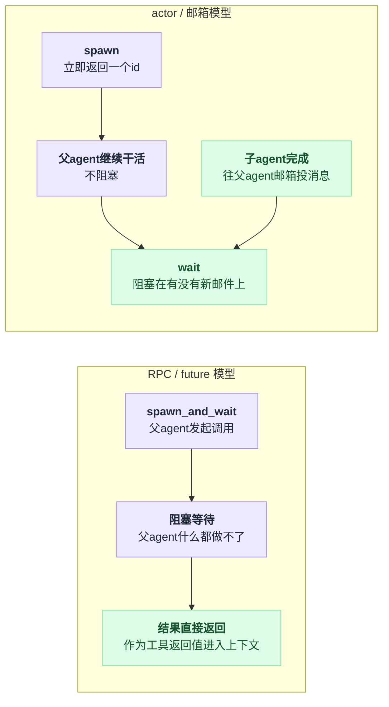

### 1.3 失败、中断、超时

子 agent 崩了，父 agent 应该看到什么？一个异常？还是一段「你的下属失败了，错误是 XXX，你可以再派一个」的自然语言？后者明显更适合 LLM 消费，但要求 harness 把错误翻译成模型能理解的措辞。

中断更麻烦。用户按 Ctrl+C 时，进程树里所有子 agent 都要被杀掉——如果子 agent 是子进程，这是 SIGTERM 传播问题；如果是同进程的异步任务，这是 cancellation token 传播问题。而「父 agent 主动中断某个子 agent」是另一回事，需要一个专门的工具。

超时同样是设计决策：`wait` 超时之后，子 agent 是继续跑还是被杀？Codex 的选择是继续跑（wait 只是「不等了」），Pi 的示例扩展没有超时概念（等到子进程退出为止）。

### 1.4 可观测性：黑盒里的黑盒

LLM agent 本身就是一个不透明的东西——你看着它调工具，但你不知道它为什么这么调。子 agent 在这之上又加了一层：你的终端上现在显示一行「subagent running...」，里面正在发生 30 次工具调用，你一次都看不到。等它出来的时候你只有一段结论，无法判断这段结论是扎实的还是它读了两个文件就编的。

Pi 的整个立场就建立在这个论证上（见 2.2）。而 Codex 和 LangChain 的应对是把子 agent 的事件流也发出来，让 UI 层去展开——代价是 UI 复杂度和事件流量。

### 1.5 并行写冲突：没有事务，只有纪律

这是最被低估的问题。三个 worker agent 同时被派去改同一个仓库：

- 它们共享同一个 `cwd`（除非 harness 专门给每个人开 worktree/容器）。
- 它们各自读文件、各自改文件，没有锁、没有版本号、没有冲突检测。
- A 读了 `auth.ts` 的第 10-50 行，B 在 A 读完之后把 20 行删了，A 基于旧内容生成的 patch 现在要么打不上，要么打上去把 B 的改动覆盖了。
- 更隐蔽的情况：A 看到 `auth.ts` 里有个它不认识的函数（其实是 B 刚加的），觉得这是脏代码，**把它删了**。

数据库有事务，git 有 merge，agent 之间什么都没有。三家 harness 里没有任何一家提供了机制层面的解决方案（第四个样本 Grok Build 提供了，见第 8 节）。Codex 的解法完全在提示词层：内置的 `worker` 角色描述里逐字写着「明确分配文件所有权」和「告诉 worker 它不是唯一在这个代码库里的人，不要回滚别人的改动」（见 3.3）。这是一个诚实但脆弱的答案——它依赖模型听话。

四家在这道题上的答案摆在一起看，差距很直观：

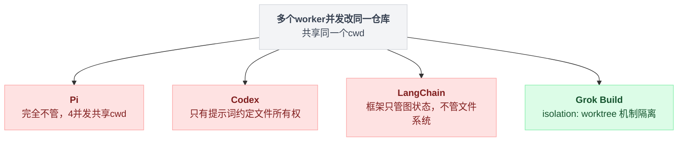

### 1.6 成本与递归爆炸

一个子 agent 可以再派子 agent。深度 3、每层 4 个，就是 64 个并发 LLM 会话。必须有硬性的深度上限和总数上限，而且这些上限必须在 harness 层面强制，不能指望提示词。同时还有一个更微妙的成本问题：**父 agent 学会了「派人」这个动作之后，会倾向于把什么都派出去**，包括那些自己两步就能做完的事。派一个人的固定开销（新的系统提示词、新的环境上下文、新的工具描述）常常有一两万 token，比亲自做还贵。

## 2. Pi 的做法

### 2.1 一句话概括

**不内置**。README 的 Philosophy 一节明确列出「No sub-agents」，理由是实现方式太多、不应由 core 决定；官方给的替代路径有三条：用 tmux 开多个 pi 实例、自己写扩展、装第三方包。仓库里附了一个完整的示例扩展作为「自己写」的参考实现，它通过 **spawn 独立的 `pi` 子进程**来获得天然的上下文隔离。

### 2.2 机制拆解

先看立场本身。`packages/coding-agent/README.md:500`：

```markdown
**No sub-agents.** There's many ways to do this. Spawn pi instances via tmux, or build your own with [extensions](#extensions), or install a package that does it your way.
```

同一节里还有一条紧邻的、逻辑完全一致的表述（`README.md:508`）：

```markdown
**No background bash.** Use tmux. Full observability, direct interaction.
```

这两条要连起来读才能理解 Pi 的论证。它的主张是：一个跑在后台、你看不见其内部的执行单元，是可观测性的净损失；而 tmux 已经解决了这个问题——开一个 pane 跑第二个 pi 实例，你能实时看到它每一步在做什么，能随时切进去直接跟它对话，能在它跑偏的时候立刻纠正。相比之下，把这个实例塞进「subagent 工具」里，你唯一能看到的就是最后那段返回文本。

这个论点是对的。它的代价也很明确：**tmux 方案没有程序化编排**。你没法让主 agent 自己决定「这里应该派三个人并行查三个问题」，你得自己开三个 pane、自己写三段 prompt、自己把三份结果复制粘贴回主会话。人是编排器，这在探索性工作里挺好，在批量任务里就是纯手工劳动。

于是 Pi 又提供了示例扩展，把程序化编排这条路补上。核心设计：

**agent 定义 = 带 frontmatter 的 markdown 文件**。发现路径是 `~/.pi/agent/agents/*.md`（用户级，默认加载）和 `.pi/agents/*.md`（项目级，**默认不加载**）。这个默认值是安全考虑：项目级 agent 定义是跟着仓库走的，等于让 clone 下来的代码往你的 agent 里注入系统提示词。README 里写得很直白：「Project-local agents are repo-controlled prompts that can instruct the model to read files, run bash commands, etc.」要启用得显式传 `agentScope: "both"`，而且交互模式下还会再弹一次确认。

**隔离机制 = 独立进程**。这是 Pi 方案最干净的一点：子 agent 不是同一个进程里的另一个 agent loop，而是一个真正的 `pi` 子进程。上下文窗口的隔离不需要任何代码来保证——两个进程本来就没有共享内存。

**三种调用模式**：`single`（一个 agent 一个任务）、`parallel`（数组，最多 8 个任务、4 个并发）、`chain`（数组，用 `{previous}` 占位符把上一步输出喂给下一步）。

一次委派从起进程到回传结论的完整链路是这样的：

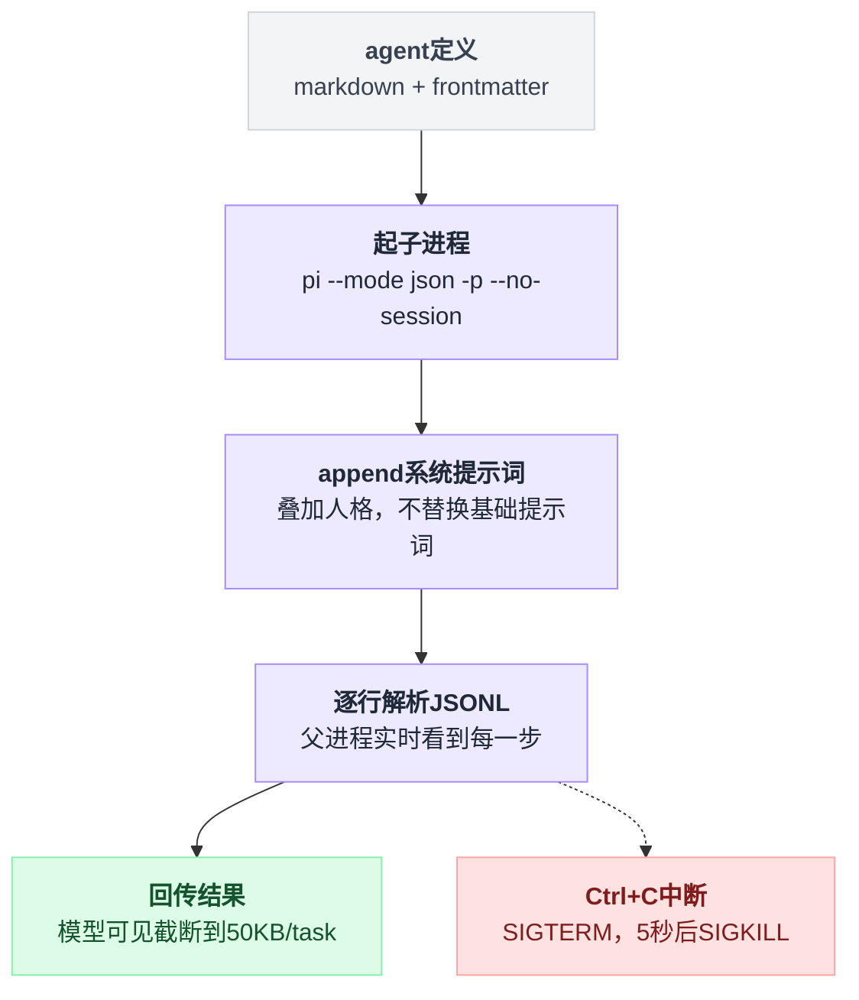

### 2.3 源码

子进程的起法：

`packages/coding-agent/examples/extensions/subagent/index.ts:294`

```typescript
	const args: string[] = ["--mode", "json", "-p", "--no-session"];
	if (agent.model) args.push("--model", agent.model);
	if (agent.tools && agent.tools.length > 0) args.push("--tools", agent.tools.join(","));
```

四个固定参数各有讲究。`--mode json` 让子进程把事件以 JSONL 形式吐到 stdout（父进程逐行解析，这是流式可观测性的来源）；`-p` 是非交互的一次性执行；`--no-session` 让子 agent 不落盘会话文件——它是一次性的，没有恢复的必要。`--model` 和 `--tools` 则来自 agent 定义的 frontmatter，实现了「便宜模型干粗活」和「只读探索者」。

系统提示词的传递方式很朴素——写到临时文件再用 `--append-system-prompt` 指过去：

`packages/coding-agent/examples/extensions/subagent/index.ts:323`

```typescript
		if (agent.systemPrompt.trim()) {
			const tmp = await writePromptToTempFile(agent.name, agent.systemPrompt);
			tmpPromptDir = tmp.dir;
			tmpPromptPath = tmp.filePath;
			args.push("--append-system-prompt", tmpPromptPath);
		}

		args.push(`Task: ${task}`);
```

注意是 `append`，不是 `replace`。子 agent 仍然带着 pi 的基础系统提示词，agent 定义只是叠加人格。

流式解析和中断传播：

`packages/coding-agent/examples/extensions/subagent/index.ts:399`

```typescript
			if (signal) {
				const killProc = () => {
					wasAborted = true;
					proc.kill("SIGTERM");
					setTimeout(() => {
						if (!proc.killed) proc.kill("SIGKILL");
					}, 5000);
				};
				if (signal.aborted) killProc();
				else signal.addEventListener("abort", killProc, { once: true });
			}
```

工具执行拿到的 `AbortSignal`（这是 Pi 工具系统的标准参数）被直接转成 SIGTERM，5 秒宽限期后 SIGKILL。用户 Ctrl+C 能穿透到子进程——因为进程边界清晰，这件事在 Pi 这里几乎是免费的。

回传上限：

`packages/coding-agent/examples/extensions/subagent/index.ts:36`

```typescript
const MAX_PARALLEL_TASKS = 8;
const MAX_CONCURRENCY = 4;
const COLLAPSED_ITEM_COUNT = 10;
const PER_TASK_OUTPUT_CAP = 50 * 1024;
```

50 KB per task 的模型可见上限。这个值比 Codex 的 1000 token 宽松一个数量级——Pi 的示例扩展更倾向于「全须全尾地回传」，隔离效果因此打了折扣。README 里还专门区分了「模型可见的输出」和「tool details 里的完整结果」：截断只发生在前者，UI 展开还能看到全部。这是一个值得抄的分层。

agent 定义本身就是很好的 prompt 设计素材。`scout` 的关键在于它明确告诉模型「你的读者没见过你读过的文件」：

`packages/coding-agent/examples/extensions/subagent/agents/scout.md`

```markdown
---
name: scout
description: Fast codebase recon that returns compressed context for handoff to other agents
tools: read, grep, find, ls, bash
model: claude-haiku-4-5
---

You are a scout. Quickly investigate a codebase and return structured findings that another agent can use without re-reading everything.

Your output will be passed to an agent who has NOT seen the files you explored.
...
Output format:

## Files Retrieved
List with exact line ranges:
1. `path/to/file.ts` (lines 10-50) - Description of what's here
...
## Start Here
Which file to look at first and why.
```

「返回精确行号范围」这条要求解决的正是 1.1 的带宽悖论：不回传文件内容（省 token），但回传足够精确的坐标，父 agent 如果真的需要可以定点读取，不必重新探索。这是一个非常划算的折中。

`reviewer.md` 里则藏着一句对工具隔离的诚实评价：

```markdown
Bash is for read-only commands only: `git diff`, `git log`, `git show`. Do NOT modify files or run builds.
Assume tool permissions are not perfectly enforceable; keep all bash usage strictly read-only.
```

`--tools read,grep,find,ls,bash` 能把工具集限制成只读工具**加 bash**，而 bash 本身是万能的。作者知道这个洞补不上，于是在提示词里再叮嘱一遍。这句话应该被每一个「用工具白名单实现沙箱」的人读一遍。

工作流被表达为 prompt 模板而不是代码：

`packages/coding-agent/examples/extensions/subagent/prompts/implement.md`

```markdown
---
description: Full implementation workflow - scout gathers context, planner creates plan, worker implements
---
Use the subagent tool with the chain parameter to execute this workflow:

1. First, use the "scout" agent to find all code relevant to: $@
2. Then, use the "planner" agent to create an implementation plan for "$@" using the context from the previous step (use {previous} placeholder)
3. Finally, use the "worker" agent to implement the plan from the previous step (use {previous} placeholder)

Execute this as a chain, passing output between steps via {previous}.
```

这里有一个容易忽略的架构选择：**编排逻辑不在代码里，在提示词里**。扩展只提供了 `chain` 这个原语，「scout → planner → worker」这条流水线是靠一段自然语言让主模型去组装 `chain` 参数的。好处是改流程不用改代码，坏处是流程的执行没有任何保证——模型完全可以决定跳过 planner。

### 2.4 代价与适用边界

- **进程开销真实存在**。每个子 agent 是一次完整的 Node 启动 + 配置加载 + 扩展加载。做十几次细粒度探索时这个开销不可忽略。
- **子 agent 拿不到父会话的任何上下文**，只有 `Task: xxx` 这一行。这是最强的隔离，也是最强的信息断裂——1.1 里说的「父 agent 忘了说 Postgres」在这里是必然事件而不是偶发事故。
- **没有双向通信**。子进程起了之后只能等它退出，父 agent 不能中途给它补充信息，它也不能反问。`chain` 模式的存在部分弥补了这点，但那是「串行传递」不是「对话」。
- **并行写冲突完全不管**。示例扩展允许 4 个 worker 并发，共享同一个 `cwd`，没有任何 ownership 机制，连 Codex 那种提示词层的约定都没有。用 `parallel` 跑写操作是危险的。
- **这是 examples/ 下的示例，不是产品特性**。它的存在是为了证明「用扩展能做到」，不是为了让你直接依赖它。

## 3. Codex 的做法

### 3.1 一句话概括

三家里唯一把多 agent 做成一等公民的：内置两代工具集（v1 五个工具 / v2 六个工具，按模型能力在 `models.json` 里选版本），子 agent 是同进程内的独立 thread，有角色系统（toml 配置）、科学家名字昵称、深度与并发上限、专门的 hook 事件；并且在 `ultra` 推理档位下**模型自己决定何时委派**，不需要用户开口。

### 3.2 机制拆解

#### 两代工具集并存

这是 Codex 最有意思的地方：`multi_agents/` 和 `multi_agents_v2/` 两套实现同时活在代码库里，由模型决定用哪套。

| | v1 (`multi_agent_v1.*` 命名空间) | v2（平铺工具名） |
|---|---|---|
| 派生 | `spawn_agent` | `spawn_agent` |
| 等待 | `wait_agent(targets[], timeout)` → 返回各 agent 最终状态**及最终消息** | `wait_agent(timeout)` → 返回「邮箱有动静了」，**不返回内容** |
| 发消息 | `send_input(target, message, interrupt?)` | 拆成 `send_message`（入队，不唤醒）+ `followup_task`（入队并触发一个 turn） |
| 中断 | 通过 `send_input(interrupt=true)` 顺带实现 | 独立的 `interrupt_agent(target)` |
| 生命周期 | `close_agent` / `resume_agent` | 无（不需要显式关闭） |
| 枚举 | 无 | `list_agents(path_prefix?)` |
| 寻址 | 不透明的 `ThreadId` 字符串 | 层级路径 `/root/task1/task_3`，可用相对名 `task_3` |
| 上下文继承 | `fork_context: bool`，**默认 false**（只给初始 prompt） | `fork_turns: "none"｜"all"｜N`，**默认 "all"** |
| 工具加载 | 每个 handler 都实现 `search_info()`，走延迟加载 | 全部不实现，始终在工具列表里 |
| 消息加密 | 无 | `message` 字段带 `.with_encrypted()` |

演进的方向可以从这张表里读出来，我的推测是三条线：

**第一，从 future 模型转向 actor 模型。** v1 的 `wait_agent` 是一个典型的 `join()`：你传一组 agent id，阻塞到它们全部到终态，返回值里带着结果。v2 的 `wait_agent` 只接受一个 `timeout_ms`，返回值只有一句 `"Wait completed."` / `"Wait interrupted by new input."` / `"Wait timed out."`。内容去哪了？内容通过 `InterAgentCompletionMessage` 直接注入到父 agent 的上下文里，`wait` 只负责唤醒。这是标准的邮箱语义，而且顺带解决了一个 v1 做不到的事：**用户在父 agent 等待期间插话，`wait` 也会提前返回**（`WaitOutcome::Steered`）。

**第二，从「id」转向「命名空间」。** v1 的 agent id 是 ThreadId，模型只能靠自己在上下文里记住「那个查数据库的是 `thr_abc123`」。v2 强制 `spawn_agent` 传 `task_name`，自动拼成 `/root/task1/task_3` 这样的路径，还支持相对寻址。工具描述里那句话很关键：「an agent `/root/task2/task_3` would only be able to communicate with this agent via its canonical name `/root/task1/task_3`」——这意味着 v2 允许**任意两个 agent 互相通信**，不只是父子。这已经是一个完整的 actor 网络了，命名系统是必需品。

**第三，从「隔离优先」转向「理解优先」。** 这是最反直觉的一条。v1 的 `fork_context` 默认 `false`：子 agent 只拿到一条 prompt，最大化隔离。v2 的 `fork_turns` 默认 `"all"`：子 agent 拿到父 agent 的**全部历史**。工具描述里给了理由：「passing `fork_turns="none"` will not pass any surrounding context to the spawned subagent, which may cause the agent to lack the context it needs to complete its task」。

这一条值得停下来想想。默认 fork 全部历史，等于说子 agent 的输入上下文和父 agent 一样大——「隔离上下文窗口」这个初衷似乎被推翻了。但仔细看，隔离仍然成立，只是隔离的方向变了：**子 agent 探索过程中产生的那 8 万 token 垃圾不会回到父 agent**。父 agent 的历史被复制给子 agent（一次性成本，且能命中 prompt cache），子 agent 的历史不会污染父 agent（持续收益）。v1 的做法是双向隔离，v2 是单向隔离。单向隔离牺牲了初始 token，换来子 agent 不会因为不知道背景而做错事。考虑到 1.0 节里说的「实习生没有共享记忆」是子 agent 最大的失败源，这个交换在我看来是划算的。

三条演进线并排放一起看：

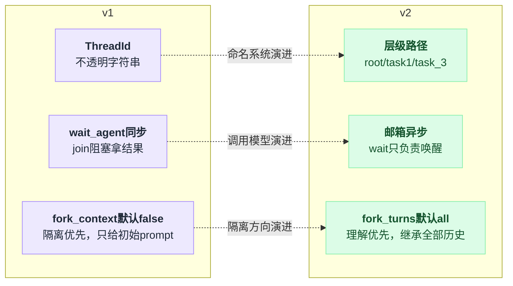

#### 谁来决定派人：`ultra` 档位

`models.json` 里，`gpt-5.6-sol` 和 `gpt-5.6-terra` 有一个别的模型没有的推理档位：

`codex-rs/models-manager/models.json:58`

```json
        {
          "effort": "ultra",
          "description": "Maximum reasoning with automatic task delegation"
        }
```

这不只是文案。`codex-rs/core/src/session/multi_agents.rs:39`：

```rust
pub(crate) fn effective_multi_agent_mode(turn_context: &TurnContext) -> Option<MultiAgentMode> {
    if turn_context.multi_agent_version != MultiAgentVersion::V2 {
        return None;
    }

    // A configured hint, including an empty string, defines a custom policy instead of an
    // effort-derived built-in policy.
    let multi_agent_mode = match &turn_context
        .config
        .multi_agent_v2
        .multi_agent_mode_hint_text
    {
        Some(hint_text) => MultiAgentMode::Custom(hint_text.clone()),
        None => match turn_context.effective_reasoning_effort() {
            Some(ReasoningEffort::Ultra) => MultiAgentMode::Proactive,
            _ => MultiAgentMode::ExplicitRequestOnly,
        },
    };
```

推理档位直接决定委派策略。这个模式最终变成一段注入到上下文里的 developer 消息：

`codex-rs/core/src/context/multi_agent_mode_instructions.rs:6`

```rust
const EXPLICIT_REQUEST_ONLY_MULTI_AGENT_MODE_TEXT: &str = "Any earlier instruction enabling proactive multi-agent delegation no longer applies. Do not spawn sub-agents unless the user or applicable AGENTS.md/skill instructions explicitly ask for sub-agents, delegation, or parallel agent work.";
const PROACTIVE_MULTI_AGENT_MODE_TEXT: &str = "Proactive multi-agent delegation is active. Any earlier instruction requiring an explicit user request before spawning sub-agents no longer applies. Use sub-agents when parallel work would materially improve speed or quality. This mode remains active until a later multi-agent mode developer message changes it.";
```

两段文本都以「之前那条相反的指令作废」开头——因为这段 developer 消息是随会话状态**增量注入**的（`MultiAgentModeState` 实现了 `render_diff`），历史里可能残留着上一次的相反指令，必须显式覆盖。这是一个在「上下文是 append-only 日志」这个约束下做状态机的经典技巧。

推理档位到委派策略的映射就是一棵简单的判定树：

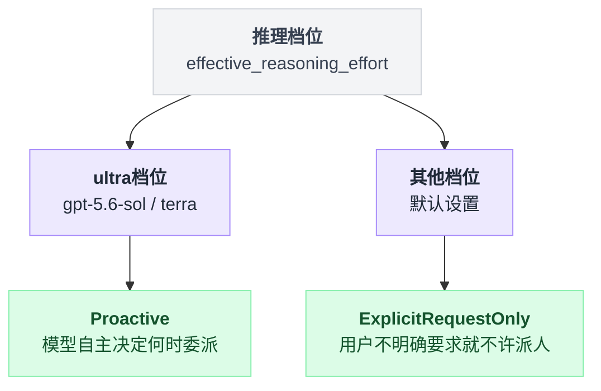

默认策略是 `ExplicitRequestOnly`：**除非用户明确要求，否则不许派人**。v1 的 `spawn_agent` 工具描述把这条讲得更死：

```
Do not spawn sub-agents unless the user or applicable AGENTS.md/skill instructions explicitly ask for sub-agents, delegation, or parallel agent work.
Requests for depth, thoroughness, research, investigation, or detailed codebase analysis do not count as permission to spawn.
```

第二句是从踩过的坑里长出来的：模型看到「深入调研一下」就开始撒人。

#### 角色即配置

`codex-rs/core/src/agent/role.rs:359` 定义了内置角色表。当前启用的有三个：`default`、`explorer`、`worker`；`awaiter` 被整段注释掉了（注释写着「Awaiter is temp removed」）。

`explorer` 的描述：

```rust
                        description: Some(r#"Use `explorer` for specific codebase questions.
Explorers are fast and authoritative.
They must be used to ask specific, well-scoped questions on the codebase.
Rules:
- In order to avoid redundant work, you should avoid exploring the same problem that explorers have already covered. Typically, you should trust the explorer results without additional verification. You are still allowed to inspect the code yourself to gain the needed context!
- You are encouraged to spawn up multiple explorers in parallel when you have multiple distinct questions to ask about the codebase that can be answered independently. ...
- Reuse existing explorers for related questions."#.to_string()),
                        config_file: Some("explorer.toml".to_string().parse().unwrap_or_default()),
```

「Typically, you should trust the explorer results without additional verification」这句是 1.1 带宽悖论的正面应对：既然回传的是压缩结论，就必须显式告诉父 agent 不要复查，否则隔离带来的节省会被复查吃光。

有意思的是 `explorer.toml` 这个文件**是 0 字节的**（`wc -c` 确认）。也就是说 explorer 角色不覆盖任何配置，它和 default 的唯一区别就是那段描述文字。角色系统的真实内容是提示词，配置文件只是预留的槽位。

被注释掉的 `awaiter.toml` 反而是有内容的，1213 字节，展示了这个槽位本来该怎么用：

`codex-rs/core/src/agent/builtins/awaiter.toml`

```toml
background_terminal_max_timeout = 3600000
model_reasoning_effort = "low"
developer_instructions="""You are an awaiter.
Your role is to await the completion of a specific command or task and report its status only when it is finished.

Behavior rules:

1. When given a command or task identifier, you must:
   - Execute or await it using the appropriate tool
   - Continue awaiting until the task reaches a terminal state.

2. You must NOT:
   - Modify the task.
   - Interpret or optimize the task.
   - Perform unrelated actions.
   - Stop awaiting unless explicitly instructed.
...
4. If asked for status:
   - Return the current known status.
   - Immediately resume awaiting afterward.
...
You must behave deterministically and conservatively.
"""
```

这是一个几乎不消耗智力的角色：`reasoning_effort = "low"`，超时上限调到一小时，唯一职责是盯着一个长时间运行的命令。它的价值不是「思考」而是「代替父 agent 承担等待」——父 agent 不用把一小时的构建日志读进自己的上下文，只需要在结束时收一句「成功/失败」。这是子 agent 作为**上下文管理手段**最纯粹的形态，跟并行毫无关系。

而 `worker` 角色的描述，正面回答了 1.5 的并行写冲突：

`codex-rs/core/src/agent/role.rs:388`

```rust
                        description: Some(r#"Use for execution and production work.
Typical tasks:
- Implement part of a feature
- Fix tests or bugs
- Split large refactors into independent chunks
Rules:
- Explicitly assign **ownership** of the task (files / responsibility). When the subtask involves code changes, you should clearly specify which files or modules the worker is responsible for. This helps avoid merge conflicts and ensures accountability. ...
- Always tell workers they are **not alone in the codebase**, and they should not revert the edits made by others, and they should adjust their implementation to accommodate the changes made by others. ..."#.to_string()),
```

请注意这里的机制层面事实：`apply_spawn_agent_runtime_overrides` 里明确写着 `config.cwd = turn_cwd`——

`codex-rs/core/src/tools/handlers/multi_agents_common.rs:255`

```rust
    #[allow(deprecated)]
    let turn_cwd = turn.cwd.clone();
    config.cwd = turn_cwd;
```

**所有子 agent 共享父 agent 的工作目录**。没有 worktree 隔离，没有容器隔离。三个 worker 并行改同一个仓库，冲突的唯一防线就是上面那段提示词里的「ownership」约定。v1 的工具描述里还追加了一条更操作性的要求：「For code-edit subtasks, decompose work so each delegated task has a disjoint write set」——把写集不相交的责任推给了父 agent 的规划能力。

这是一个诚实的设计：Codex 没有假装解决了这个问题。但也必须说清楚，**这是纪律不是机制**，模型不听话时没有任何东西会拦住它。

四个角色摆在一张图里：

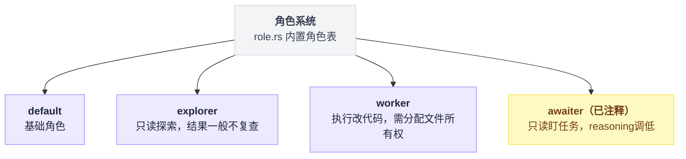

#### 命名：为什么用科学家的名字

`codex-rs/core/src/agent/agent_names.txt` 是一份 100 个名字的列表：Euclid、Archimedes、Ptolemy、Hypatia、……、Turing、Feynman、Lovelace、McClintock、……、Socrates、Confucius、Mencius、……最后一个是 `Jason`（大概是个彩蛋）。

`codex-rs/core/src/agent/registry.rs:45` 处理了名字用完的情况：

```rust
fn format_agent_nickname(name: &str, nickname_reset_count: usize) -> String {
    match nickname_reset_count {
        0 => name.to_string(),
        reset_count => {
            let value = reset_count + 1;
            let suffix = match value % 100 {
                11..=13 => "th",
                _ => match value % 10 {
                    1 => "st",
                    2 => "nd",
                    3 => "rd",
                    _ => "th",
                },
            };
            format!("{name} the {value}{suffix}")
        }
    }
}
```

一百个名字用完之后重置，第二轮叫「Newton the 2nd」。为了一个内部标识符写序数词后缀的英文规则（还处理了 11/12/13 的例外），这是很明显的 UX 投入。

为什么值得？因为 `thr_01JQ8X...` 这种 id 用户没法在对话里指代。有了昵称，用户可以说「让 Newton 停下」「Curie 那个结果不对」。这些昵称还会被注入到 agent 自己的环境上下文里：

`codex-rs/core/src/session_prefix.rs:50`

```rust
pub(crate) fn format_subagent_context_line(
    agent_reference: &str,
    agent_nickname: Option<&str>,
) -> String {
    match agent_nickname.filter(|nickname| !nickname.is_empty()) {
        Some(agent_nickname) => format!("- {agent_reference}: {agent_nickname}"),
        None => format!("- {agent_reference}"),
    }
}
```

#### 回传：1000 token 的硬墙

子 agent 完成时，它的最终消息被包装成一条 assistant 角色的上下文片段注入父 agent：

`codex-rs/core/src/context/inter_agent_completion_message.rs:35`

```rust
    fn body(&self) -> String {
        format!(
            "Message Type: FINAL_ANSWER\nTask name: {}\nSender: {}\nPayload:\n{}",
            self.task_name, self.sender, self.payload,
        )
    }
```

而错误路径上有一个硬性的 token 预算：

`codex-rs/core/src/session_prefix.rs:10`

```rust
const COMPLETION_MESSAGE_MAX_TOKENS: usize = 1_000;
const COMPLETION_MESSAGE_ENVELOPE_TOKEN_RESERVE: usize = 100;
const ERROR_MAX_TOKENS: usize =
    COMPLETION_MESSAGE_MAX_TOKENS - COMPLETION_MESSAGE_ENVELOPE_TOKEN_RESERVE;
const ERROR_NEXT_ACTION: &str = "This agent's turn failed. If you still need this agent, use the available collaboration tools to give it another task.";
```

失败的处理值得学：错误不是异常，是一段**给模型看的自然语言**，而且附带了「你接下来可以做什么」的行动建议。这比抛一个 `SubagentError` 有用得多——LLM 拿到 `ERROR_NEXT_ACTION` 就知道下一步该 `followup_task` 而不是放弃。

⚠️ 未确认：`COMPLETION_MESSAGE_MAX_TOKENS` 的常量在这段代码里只被用于计算 `ERROR_MAX_TOKENS`，成功路径上的 `AgentStatus::Completed(Some(message))` 直接原样 clone，没看到截断。所以「1000 token 硬墙」目前只能确认适用于错误消息；成功消息是否在别处被截断我没找到证据。

#### 限制与可观测性

深度上限默认是 **1**（`codex-rs/core/src/config/mod.rs:284`：`pub(crate) const DEFAULT_AGENT_MAX_DEPTH: i32 = 1;`），也就是说**默认不允许子 agent 再派子 agent**。超限时返回给模型的是一句人话：

`codex-rs/core/src/tools/handlers/multi_agents/spawn.rs:67`

```rust
    if exceeds_thread_spawn_depth_limit(child_depth, max_depth) {
        return Err(FunctionCallError::RespondToModel(
            "Agent depth limit reached. Solve the task yourself.".to_string(),
        ));
    }
```

并发上限来自 `agents.max_concurrent_threads_per_session`（`AgentRegistry::reserve_spawn_slot`），超限返回 `AgentLimitReached`。

可观测性方面，Codex 走的是「把子 agent 活动也变成 turn item 发给 UI」：`TurnItem::CollabAgentToolCall`（带 `agents_states: HashMap<ThreadId, AgentStatus>`）和 `TurnItem::SubAgentActivity`（`kind: Started | Interacted | Interrupted`）。拓扑本身持久化在独立的 `agent-graph-store` crate 里，`ThreadSpawnEdgeStatus` 只有 `Open` / `Closed` 两个状态——这个 crate 的 doc comment 写得很到位：「Storage-neutral parent/child topology for thread-spawned agents.」

外部可编程的钩子是两个专门的 hook 事件（`codex-rs/hooks/src/lib.rs:28`）：`SubagentStart` / `SubagentStop`。它们的输入 payload 里带着子 agent 的身份和独立的转录路径：

`codex-rs/hooks/src/schema.rs:592`

```rust
#[schemars(rename = "subagent-stop.command.input")]
pub(crate) struct SubagentStopCommandInput {
    pub session_id: String,
    pub turn_id: String,
    pub transcript_path: NullableString,
    pub agent_transcript_path: NullableString,
    pub cwd: String,
    ...
    pub agent_id: String,
    pub agent_type: String,
    pub last_assistant_message: NullableString,
}
```

`agent_transcript_path` 和 `transcript_path` 是两个不同的字段——这就是「上下文隔离」在存储层的体现：子 agent 有自己独立的一份转录。想做审计的话，这个字段是唯一能让你看到子 agent 内部到底发生了什么的入口。

### 3.3 代价与适用边界

- **复杂度是巨大的**。两代工具集共 2000 行 handler 代码，加上 registry / control / role / graph-store，再加上超过 15 万行的测试（`multi_agents_tests.rs` 一个文件就 156 KB）。这不是能顺手加上的功能。
- **v1/v2 并存意味着行为随模型漂移**。同一个 Codex 二进制，用 Luna 是 v1 语义（同步 wait、默认不 fork 历史），用 Sol/Terra 是 v2 语义（邮箱、默认 fork 全部历史）。用户配置文件里的多 agent 相关设置在两代之间不完全通用。
- **并行写冲突只有提示词防线**。共享 `cwd`，无 worktree、无锁。
- **成本控制靠上限而非预算**。深度和并发有硬上限，但没有「这次会话最多花 N 美元」这种真正的成本闸门。`ultra` 档位下模型自主派人，费用的可预测性会明显下降。
- **默认非常保守**。`ExplicitRequestOnly` + `max_depth=1` 意味着大部分用户默认永远看不到这套系统。这是对的选择，但也意味着这些能力的实际使用率可能远低于代码量给人的印象。

## 4. LangChain v1 的做法

### 4.1 一句话概括

**没有 `spawn_agent` 这个概念，因为不需要**：`create_agent()` 返回的是一个编译好的 LangGraph 图，图是 Runnable，Runnable 可以被包成一个 `@tool`——「子 agent」就是「工具里调了另一个 agent」，一行 `agent.invoke(...)`。框架额外做的两件事是：`SubagentTransformer` 把嵌套 agent 的事件流提升成可独立消费的句柄（可观测性），以及 LangGraph 的图原语（`Send`、subgraph 独立 state schema）提供任意编排拓扑。

### 4.2 机制拆解

#### 「子 agent」就是一个普通工具

框架里没有任何叫 subagent 的运行时机制。官方测试用例就是最权威的用法示范：

`libs/langchain_v1/tests/unit_tests/agents/test_subagent_transformer.py:33`

```python
def test_subagents_surfaces_named_subagent() -> None:
    """A nested named `create_agent` dispatched from a tool surfaces a handle."""
    weather_agent = create_agent(model=FakeToolCallingModel(tool_calls=[[]]), name="weather_agent")

    @tool("call_weather")
    def call_weather(city: str) -> str:
        """Call the weather agent."""
        result = weather_agent.invoke({"messages": [HumanMessage(f"weather in {city}")]})
        # `invoke()` returns an untyped state, so `.text` is `Any`; it is really a
        # `str` (`TextAccessor`), so narrow it to satisfy the `-> str` return type.
        return cast("str", result["messages"][-1].text)

    supervisor = create_agent(
        model=_supervisor_model(),
        tools=[call_weather],
        name="supervisor",
    )
```

这七行代码就是 LangChain v1 的完整子 agent 方案，值得逐点拆：

- **上下文隔离是天然的**。`weather_agent.invoke({"messages": [HumanMessage(...)]})` 传进去一个全新的 messages 列表。子 agent 的 state 和父 agent 的 state 是两个 Python 对象，没有任何共享。隔离不需要机制，因为默认就不共享——要共享才需要写代码。
- **回传形态完全由你决定**。这里返回 `result["messages"][-1].text`（最后一条消息的文本），但你可以返回 `result["messages"]` 的摘要、返回结构化 dict（用 `response_format`）、返回文件路径、返回什么都行。这是三家里唯一把「回传什么」完全交给开发者的。1.1 的带宽悖论在这里不是框架问题，是你的问题。
- **代价同样明显**：`invoke()` 是**同步阻塞**的。父 agent 的这个工具调用会卡到子 agent 跑完。要并行你得自己用 `asyncio.gather` 或者 LangGraph 的 fan-out（见下）。没有 `wait_agent`，没有邮箱，没有中途通信——除非你自己实现。

#### `name=` → `lc_agent_name` → 可观测性

`create_agent(name=...)` 做的事情很小：

`libs/langchain_v1/langchain/agents/factory.py:1795`

```python
    config["metadata"] = {"ls_integration": "langchain_create_agent"}
    if name:
        config["metadata"]["lc_agent_name"] = name
```

就是往 RunnableConfig 的 metadata 里塞一个名字。但这个名字是整条可观测性链路的锚点。编译时注册的 transformer 里包含 `SubagentTransformer`：

`libs/langchain_v1/langchain/agents/factory.py:1806`

```python
    return graph.compile(
        checkpointer=checkpointer,
        ...
        transformers=_dedupe_transformers(
            [
                ToolCallTransformer,
                SubagentTransformer,
                *middleware_transformers,
                *(transformers or ()),
            ]
        ),
    ).with_config(config)
```

`SubagentTransformer` 的职责在模块 docstring 里写得很清楚（`_subagent_transformer.py:1`）：

```python
"""Surface nested named agents as typed `run.subagents` handles.

A subagent boundary is a nested run whose `lc_agent_name` is set *and* differs
from its parent namespace's `lc_agent_name`. Plain subgraphs inherit the
parent's name (so they compare equal and are excluded); unnamed agents have
`lc_agent_name == None` (also excluded). For genuine subagents the base also
recovers the originating tool call and exposes it as a `cause`
(`{"type": "toolCall", "tool_call_id": ...}`) ...
"""
```

这里要纠正一个容易产生的误解：**这个文件不是「把 agent 变成工具」的实现**，它是一个**流转换器**。它的作用是：当嵌套的 agent 在跑的时候，把属于它的那部分事件从主事件流里劈出来，包成一个独立的 `SubagentRunStream` 句柄推到 `run.subagents` 上。也就是说，1.4 说的「黑盒里的黑盒」，LangChain 的答案是——**把黑盒开个窗**：

```python
    run = supervisor.stream_events({"messages": [HumanMessage("weather?")]}, version="v3")

    handles = []
    for handle in run.subagents:
        handles.append(handle)
        # Drain the nested run so it completes.
        for _ in handle:
            pass

    assert len(handles) == 1
    assert handles[0].name == "weather_agent"
    assert handles[0].cause == {"type": "toolCall", "tool_call_id": "call_w"}
```

`handle.cause` 是一条**因果边**：这个子 agent 是被哪个 tool_call 触发的。有了它，UI 就能把「主 agent 调了 call_weather」和「weather_agent 内部的 12 个事件」在时间轴上正确地嵌套起来。这在三家里是最完整的子 agent 可观测性模型——Codex 发的是扁平的 turn item（靠 `agent_path` 自己拼层级），Pi 的示例扩展是逐行解析子进程 stdout。

判定边界的代码也把 trade-off 说清楚了：

`libs/langchain_v1/langchain/agents/_subagent_transformer.py:169`

```python
        child_lc = self._lc_by_ns.get(ns)
        # Surface any nested run carrying an lc_agent_name (set by create_agent).
        # A same-named nested agent — e.g. a subagent that invokes itself —
        # re-asserts its own name and is surfaced. Unnamed runs (None) are
        # excluded. Trade-off: a non-agent subgraph that inherited the parent's
        # name also surfaces; null lc_agent_name when invoking such a graph to
        # exclude it.
        if child_lc is None:
            return
```

「有名字的就算子 agent」是一条启发式规则，注释里主动承认了它的假阳性场景和绕过方法。这种诚实度在框架代码里不常见。

失败传播也有明确定义：子 agent 的 run 进入 `failed` 状态时，句柄的 mux 会被 `fail(RuntimeError(error or "Subagent failed"))`，父流不会静默吞掉。

#### LangGraph 提供的编排原语

前面说的都是「一个 agent 调另一个 agent」。真正让 LangChain 这条线在编排表达力上碾压另外两家的，是它下面的 LangGraph——多 agent 本来就是图计算的一个特例。

**动态 fan-out（map-reduce）用 `Send`**：

`libs/langgraph/langgraph/types.py:664`

```python
class Send:
    """A message or packet to send to a specific node in the graph.

    The `Send` class is used within a `StateGraph`'s conditional edges to
    dynamically invoke a node with a custom state at the next step.

    Importantly, the sent state can differ from the core graph's state,
    allowing for flexible and dynamic workflow management.

    One such example is a "map-reduce" workflow where your graph invokes
    the same node multiple times in parallel with different states,
    before aggregating the results back into the main graph's state.
    """
```

文档里给的例子直接就是 fan-out 的骨架：

```python
        def continue_to_jokes(state: OverallState):
            return [Send("generate_joke", {"subject": s}) for s in state["subjects"]]

        builder.add_conditional_edges(START, continue_to_jokes)
```

这解决了 Codex 和 Pi 都需要模型自己拿捏的事：**并行度由数据决定，不由模型决定**。有 17 个文件要审查就派 17 个，代码里写死，模型不参与，也就不会「忘了派」或者「派太多」。

拓扑画出来是这样：

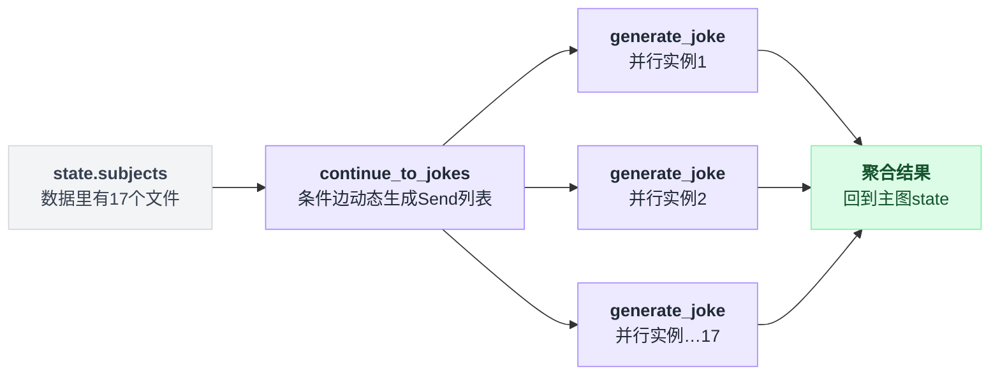

**状态隔离用 subgraph 的独立 schema**。`StateGraph` 从构造时就区分三套 schema：

`libs/langgraph/langgraph/graph/state.py:212`

```python
    input_schema: type[InputT]
    output_schema: type[OutputT]
```

`add_node` 也接受 per-node 的 `input_schema`（`state.py:450`）。这意味着：一个子图可以有自己完全不同的 state 定义，父图只通过 `input_schema` 定义的那几个字段喂进去、只通过 `output_schema` 定义的那几个字段收回来。中间产生的所有中间状态在父图里根本不存在。

这是「上下文隔离」在图模型里的表达，而且它比另外两家更精确：Codex 和 Pi 的隔离粒度是「整个上下文」（要么全 fork 要么全不 fork），LangGraph 的隔离粒度是**字段级**，由类型定义。

#### 现成的编排模式在独立包里

仓库里搜不到 supervisor / swarm 的实现（`libs/prebuilt/langgraph/prebuilt/` 只有 `chat_agent_executor.py`、`tool_node.py`、`interrupt.py` 等）。它们在独立发布的包里：

- **`langgraph-supervisor`**（PyPI，0.0.31，2025-11-19）：提供 `create_supervisor()`，中心 supervisor 通过 handoff 工具调度专家 agent。**文档顶部有弃用建议**：「We now recommend using the supervisor pattern directly via tools rather than this library for most use cases. The tool-calling approach gives you more control over context engineering.」——来源：https://pypi.org/project/langgraph-supervisor/
- **`langgraph-swarm`**（PyPI，0.1.0，2025-12-04）：提供 `create_swarm()` 和 `create_handoff_tool()`，agent 之间按专长动态移交控制权，无中心调度者。无弃用提示。来源：https://pypi.org/project/langgraph-swarm/

另外，`create_deep_agent`（`deepagents` 包，在 langgraph 仓库里只作为集成测试的依赖出现）提供了最接近 Codex 形态的东西——一个 `task(subagent_type, description)` 工具：

`libs/sdk-py/integration/graph/deep_agent.py:1`

```python
"""Deep-agent variant exercising v3 `thread.subgraphs` properly.

`create_deep_agent` builds a graph whose `task` tool dispatches to one
of its configured `SubAgent`s. When the supervisor's model issues a
`task(subagent_type="researcher", description=...)` tool call, the
sub-agent runs as a nested invocation and the v3 streaming server
emits the subagent's lifecycle, messages, and tool events under a
scoped namespace. ...
"""
```

`langgraph-supervisor` 那条弃用提示值得单独想一下。官方的判断是：把编排封装成一个高阶 API（`create_supervisor(agents=[...])`）反而降低了控制力，因为**多 agent 系统的难点从来不是"怎么调度"，而是"每个 agent 看到什么上下文"**。原话里的 "more control over context engineering" 就是这个意思。这跟本章第 0 节的判断是一致的：子 agent 的本质是上下文管理，编排只是它的外壳。

### 4.3 代价与适用边界

- **什么都得自己写**。没有内置角色、没有昵称、没有深度上限、没有并发上限、没有成本闸门、没有 hook。全部由你在应用层实现。对框架来说这是正确的定位，但如果你想要一个「开箱能用的多 agent CLI」，LangChain v1 不是那个东西。
- **1.5 的写冲突问题框架完全不涉及**。LangGraph 管的是图状态的并发合并（用 reducer/`Annotated[list, operator.add]`），不管文件系统。两个节点同时写同一个文件的后果和另外两家一样。
- **中断/取消依赖 Python 的取消语义**，跨越 `.invoke()` 边界的取消传播要自己处理；不像 Pi 那样有清晰的进程边界可以 SIGKILL。
- **成本可见性靠外部**（LangSmith 之类），框架本身不做预算。
- **`SubagentTransformer` 的判定是启发式的**，注释里承认了假阳性；依赖 `run.subagents` 做严肃的审计逻辑之前要先验证边界情况。

## 5. 三方横向对比

| 维度 | Pi | Codex | LangChain v1 |
|---|---|---|---|
| **是否内置** | 否（README 明确「No sub-agents」）；仓库带示例扩展 | 是，一等公民，两代工具集并存 | 无专门机制；「agent 是 Runnable」使其成为不必要 |
| **隔离机制** | **独立 OS 进程**（`spawn("pi", ...)`） | 同进程内的独立 thread（`ThreadId` + `AgentControl`） | 独立的 Python 对象 / LangGraph subgraph（**字段级** state schema 隔离） |
| **上下文继承** | 无。子进程只收到 `Task: <text>` | v1：`fork_context` 默认 false（不继承）；v2：`fork_turns` 默认 `"all"`（**继承全部父历史**） | 由你调用时传什么决定，默认不共享 |
| **派生者** | 主模型（调 `subagent` 工具）或人（tmux 手动开 pane） | 模型；策略由 `MultiAgentMode` 控制：默认 `ExplicitRequestOnly`，**`ultra` 档位 → `Proactive`（模型自主委派）** | 开发者写死在代码/图里；模型只在你把它做成工具时才有选择权 |
| **结果回传形式** | stdout JSONL 的最后一条文本，模型可见部分截断到 **50 KB/task**（完整结果留在 tool details） | assistant 角色的 `FINAL_ANSWER` 片段注入父上下文；错误路径截断到 **900 token** 并附带下一步建议 | 完全由开发者决定（工具的 return 值）；框架不做任何截断 |
| **同步还是异步** | 同步（等子进程退出）；`parallel` 模式 4 并发 | v1 同步 `wait_agent(targets)` 拿结果；**v2 异步邮箱**，`wait_agent(timeout)` 只报「有动静」 | 同步 `.invoke()`；并行要自己 `asyncio.gather` 或用 `Send` fan-out |
| **可中断** | 是。`AbortSignal` → SIGTERM →（5s）SIGKILL，Ctrl+C 穿透 | 是。v1 `send_input(interrupt=true)`；v2 独立的 `interrupt_agent`；且**用户插话会让 `wait_agent` 提前返回** | 依赖 Python 取消语义，跨 `.invoke()` 边界要自己处理 |
| **agent 间通信** | 无（只有 `chain` 的串行传递） | **v2 支持任意 agent 互发消息**（`send_message` 入队 / `followup_task` 触发 turn），靠 `/root/a/b` 路径寻址 | 无内置；`langgraph-swarm` 的 handoff 工具提供一种实现 |
| **可观测性** | 逐行解析子进程 JSONL，实时展示工具调用 + usage + cost；expand 可看完整 markdown | `TurnItem::CollabAgentToolCall` / `SubAgentActivity` 事件；拓扑存 `agent-graph-store`；`SubagentStart`/`SubagentStop` hook 带**独立的 `agent_transcript_path`** | `run.subagents` 提供类型化句柄，带 `cause` 因果边（指回触发它的 tool_call），可独立消费嵌套事件流 |
| **并行写冲突处理** | **完全不管**（4 并发共享同一 cwd） | **仅提示词**：`worker` 角色要求「显式分配文件所有权」「告诉 worker 它不是唯一在改代码的人」；工具描述要求「disjoint write set」。机制上共享 `cwd` | 框架不涉及（LangGraph 只管图状态的 reducer 合并，不管文件系统） |
| **编排表达能力** | 三种固定模式：single / parallel / chain；流程写在 prompt 模板里 | 树形 + v2 的任意 agent 网络；编排逻辑在模型脑子里 | **任意有向图**：条件边、`Send` 动态 fan-out、subgraph 嵌套、每个节点可以是另一个编译好的 agent。编排是代码，可测试可复现 |
| **成本控制** | 无（模型可按 agent 定义降档，如 scout 用 haiku） | 深度上限（默认 **1**）、每会话并发上限、角色可锁定模型/effort（如 awaiter 用 `low`） | 无内置；`ModelCallLimitMiddleware` 之类可以自己叠 |
| **角色定义形式** | markdown + YAML frontmatter（`name/description/tools/model` + body 作系统提示词） | Rust 里的内置表 + `builtins/*.toml`（可覆盖 model/effort/`developer_instructions`）；`explorer.toml` 实际是 0 字节 | 无标准形式；`deepagents` 的 `SubAgent` TypedDict 是一种约定 |
| **可寻址性 / UX** | agent 名（`scout`/`planner`/…） | **科学家昵称**（100 个名字，用完变「Newton the 2nd」）+ v2 的层级路径 | 图节点名 / `create_agent(name=...)` |

## 6. 可以拿走的工程经验

**1. 先问「是不是上下文问题」，不是「是不是并行问题」。** 判断是否该拆子 agent 的第一标准：*这个子任务会不会产生大量我之后再也不需要的中间数据？* 会 → 拆。典型正例：搜索一个大代码库回答一个具体问题（Codex 的 explorer）；盯着一个跑 40 分钟的构建（Codex 的 awaiter，它跟并行毫无关系，纯粹是不想让日志进主上下文）；把一个 500 行的日志文件读完只为找一行错误。典型反例：「帮我改这三个文件」——上下文量不大，拆了反而要付三份系统提示词的开销。

**2. 派人之前先问「我的下一步是不是等它」。** Codex 的 v1 工具描述把这条写成了硬规则：「Do not delegate urgent blocking work when your immediate next step depends on that result. If the very next action is blocked on that task, the main rollout should usually do it locally to keep the critical path moving.」这是最实用的一条判据。如果你派完人立刻就要 `wait`，那你只是给自己加了一层间接、付了一份额外的启动成本，一点并行度都没换到。适合派出去的是**旁路任务**（sidecar），不是关键路径。

**3. 回传格式里放坐标，不放内容。** Pi 的 scout 要求「`path/to/file.ts` (lines 10-50) - 这里有什么」，这一条同时满足了两个矛盾的目标：主 agent 上下文不被文件内容淹没，同时又保留了定点重读的能力。任何「探索型子 agent」的输出格式都应该抄这个：**结论 + 精确坐标 + 从哪开始看**。配套地，还要像 Codex 的 explorer 描述那样明确告诉父 agent「一般不要复查」，否则省下来的 token 会在复查里花掉。

**4. 并行写代码之前，先把写集切开，并且告诉每个 worker 它不是一个人。** 三家里没有任何一家在机制上解决了这个问题，所以你只能靠纪律。Codex 的两条提示词值得逐字借用：给每个 worker **明确的文件/模块所有权**；显式告诉它「代码库里还有别人在改，不要回滚别人的改动，要适配别人的改动」。第二条尤其重要——没有这句话，worker 看到自己没写过的代码时会倾向于当作垃圾清掉。如果你的场景允许，更硬的方案是给每个 worker 开一个 `git worktree`，最后由父 agent 做 merge——这三家都没做（Grok Build 做了，`isolation: "worktree"`，见第 8 节），你也可以做。

**5. 失败要翻译成人话，并且附带下一步建议。** `"This agent's turn failed. If you still need this agent, use the available collaboration tools to give it another task."` 这一句的价值在于它把「错误」变成了「可执行的状态」。同理，Codex 的深度超限返回的是 `"Agent depth limit reached. Solve the task yourself."` 而不是一个错误码。所有面向 LLM 的错误路径都应该这么写：**发生了什么 + 你现在可以做什么**。

**6. 给子 agent 起人能叫得出的名字。** 一百个科学家名字加上「the 2nd」的序数词后缀，这看起来像是过度设计，但它解决的是一个真问题：用户需要在对话里指代某个具体的子 agent。如果你的 UI 里子 agent 只有 UUID，用户就只能说「那个……第二个跑起来的那个」。

**7. 滥用的典型症状**，看到以下任何一条就该退回去用单 agent：
- **子 agent 的输出被父 agent 原样转述给用户**。这说明父 agent 没做任何整合，你只是加了一层没有价值的中转。
- **父 agent 派完人立刻 `wait`，而且只派了一个**。这是把同步调用伪装成了委派，纯亏一份启动开销。Codex 的工具描述专门写了「Do not repeatedly wait by reflex」。
- **子 agent 的任务描述超过了它要读的内容**。你为了讲清楚任务写了 2000 字，而任务本身只需要读一个 300 行的文件——委派的固定成本已经超过了收益。
- **父 agent 在子 agent 返回后又自己把同样的文件读了一遍**。信任链断了，隔离白做。这时要么改进回传格式（见第 3 条），要么就别拆。
- **并行的 worker 数量超过了你能审查的数量**。5 个 worker 同时改代码，产出你看不完，那就不是提效，是把 review 的债一次性攒到最后。
- **递归深度 > 2**。Codex 默认上限是 1 不是偶然。孙子辈的 agent 距离原始意图已经隔了两次自然语言转述，信息衰减严重，而且失败原因几乎无法归因。

## 7. 本章存疑

1. **Codex 成功路径的回传是否有 token 上限未确认。** `COMPLETION_MESSAGE_MAX_TOKENS = 1_000` 在 `session_prefix.rs` 里只被用来推导 `ERROR_MAX_TOKENS`；`AgentStatus::Completed(Some(message))` 分支直接 `message.clone()`。截断可能发生在别处（比如 agent 提交最终消息时），我没有找到。

2. **v1 工具描述里 "its forked workspace" 的含义未确认。** 描述里写着「instruct the submodel to edit files directly in its forked workspace」，但 `apply_spawn_agent_runtime_overrides` 明确把 `config.cwd` 设成了父 turn 的 cwd。可能是指云端/远程执行环境（`step_context.environments`）下才有独立 workspace，本地 CLI 场景下没有。我没有追进 `environments` 的实现确认。

3. **Pi 关于 Claude Code 子 agent 是「a black box within a black box」的批评，在仓库里搜不到原文。** `grep -rni "black box"` 在整个 `/tmp/pi` 无匹配。README 的 Philosophy 一节只有「No sub-agents. There's many ways to do this...」和「No background bash. Use tmux. Full observability, direct interaction.」这两条，可观测性论证是从后者推出来的。原始表述可能在作者的博客（README 链接了 `mariozechner.at/posts/2025-11-30-pi-coding-agent/`），未验证。

4. **`multi_agent_v2` 的消息加密（`JsonSchema::with_encrypted()`）具体做了什么没搞清楚。** v2 的 `spawn_agent.message`、`send_message.message`、`followup_task.message` 都带这个标记，v1 没有。从 `communication_from_tool_message` 看，非 `DirectPlaintextMessage` 来源会走 `InterAgentCommunication::new_encrypted`。这大概率跟 Responses API 的加密推理内容有关，而不是传统意义上的加密，但我没有确认。

5. **`awaiter` 角色为什么被注释掉。** 代码注释只写了「Awaiter is temp removed」，没有原因。从设计上看它是最纯粹的「上下文卸载」用例，被移除有点可惜；可能跟 v2 引入了更好的后台任务机制有关，也可能是效果不好。

## 8. 第四个样本：Grok Build

> 调研时间 2026-08-06，`xai-org/grok-build` commit `a5589e9`；全项目背景与总体判断见 [17 番外](./17-番外-GrokBuild全项目速览.md)。本节只讲子 agent 维度。

**一句话**：Grok Build 把子 agent 做成一等公民，形态是「后台任务池」而非 Codex v2 的 actor 网络；它是四个样本里唯一给 1.5 节的并行写冲突提供**机制层**解法的（`isolation: "worktree"`），也是唯一把「异步」设为默认的。

**机制**：入口是 `task` 工具，每个子 agent 是一个独立的 ACP 子会话。`TaskToolInput`（`crates/common/xai-tool-types/src/task.rs:14-110`）的字段本身就是设计立场的清单：

| 字段 | 值/默认 | 对照 |
|---|---|---|
| `run_in_background` | **默认 true**（task.rs:21-30，"This is set to true by default"） | 三个主样本默认全是同步等待（Pi 等子进程退出、Codex v1 `wait_agent`、LangChain `.invoke()`）；Grok 直接把 1.2 节的邮箱模型设为默认 |
| `capability_mode` | read-only / read-write / execute / all | 声明式能力面，对照 Pi 的 `--tools` 白名单 |
| `isolation` | none（默认）/ **worktree** | 工具描述逐字："Worktree mode prevents the child's edits from…"（task.rs:55-56）——独立 git worktree，完成后保留并返回路径。**这就是 6 节经验第 4 条里"三家都没做"的那件事** |
| `resume_from` | 已完成子 agent 的 id | 继承 peer 的 transcript 和工具状态；与 worktree 互斥（task.rs:83） |

`isolation` 这一档的两条路径分叉很清楚：

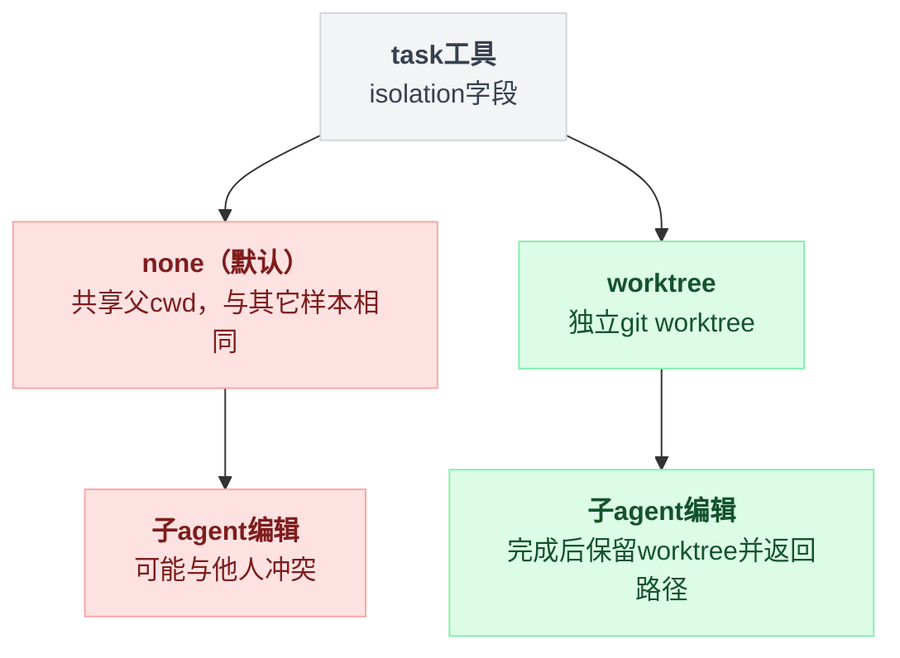

内置三型 `general-purpose` / `explore`（只读）/ `plan`（只读架构师）（task.rs:867-990），与 Codex 的 default/explorer/worker 三角色几乎一一对应。用户自定义 agent 是 `.md` + frontmatter，发现顺序里**原生认 `~/.claude/agents/`**（`xai-grok-agent/src/discovery.rs:186-189`）——Pi 用同样的 markdown+frontmatter 格式但只认自己的目录，Grok 直接兼容 Claude Code 的。嵌套深度默认 1（`MAX_SUBAGENT_DEPTH: u32 = 1`，`task/mod.rs:36`），与 Codex 的默认值相同——两家产品在 1.6 节的递归爆炸问题上独立收敛到同一个数。

**上下文继承是第三种答案**。第 3.2 节讲过 Codex v1（默认不继承）到 v2（默认全继承）的摇摆，Grok 的 `InitialContextSource`（`subagent/mod.rs:52-63`）三档：`New`（默认，只带 task prompt + 压缩版 AGENTS.md）、`Forked`（父会话史规范化成一条 `<background_context>` 用户消息——**最多 3 个完整 turn 逐字保留、更早的只留统计摘要**，并剥掉 system-reminder/git_status 等噪声标签，`xai-grok-subagent-resolution/src/context.rs:11-48`）、`Resumed`。`Forked` 是隔离-理解轴上的折中：既不像 v1 那样让子 agent 盲干，也不像 v2 那样付全量 fork 的 token——**衰减式继承**（近处逐字、远处摘要）正是第 04 章压缩的思路被搬到了 spawn 时刻。

三档摆在隔离-理解这条轴上：

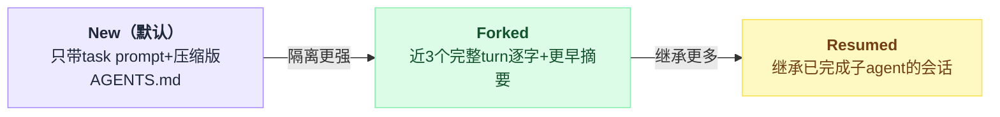

**回传与管理**：tool result 带 `SubagentCompletedOutput`（output + `<subagent_meta>` 统计 + resume 提示，task.rs:210-253）；后台模式先返回 id，由 `get_task_output`（可多 id 聚合等待，上限 20）/ `wait_tasks`（wait_any|wait_all）/ `kill_task` 管理（task.rs:444-478, 656-714）。**没有 agent 互发消息**——父模型对运行中的子 agent 只有 poll/wait/kill，`resume_from` 仅限已完成者。也就是说 Grok 停在了 Codex v1.5 的位置：邮箱化了等待，但没有走到 v2 的任意 agent 网络。防提前收尾靠 `Stop` hook 的 payload 枚举在飞的 `backgroundTasks`（`hooks/src/event.rs:255-288`）。

**编排的第四种载体**。本章看过三种编排逻辑的居所：Pi 写在 prompt 模板里、Codex 放在模型脑子里（ultra 档自主委派）、LangChain 写成 Python 代码。Grok 的 `workflow` 工具给了第四种：**模型现场生成 Rhai 脚本**，host 函数只有 `agent()/parallel()/phase()/log()`（`xai-workflow/src/engine.rs:461-710`），预算护栏 `DEFAULT_AGENT_BUDGET=128`、上限 1024、`MAX_HOST_CALLS=10_000`（lib.rs），支持 `validate_only` 干跑和 `resume_from_run_id` 断点续跑。它比 Pi 的 chain 有真控制流、比 Codex 的"模型自由发挥"可审计、比 LangChain 的预写代码灵活——代价是脚本本身也是模型生成物，第 2.3 节"模型完全可以决定跳过 planner"的问题只是从 prompt 层挪到了 DSL 层。

**本节未确认**：并发子 agent 数量的硬上限未找到（20 是 `get_task_output` 查询侧上限，不是并发侧）；`Forked` 模式的 3-turn 常量是否可配置未查。

---

## 9. 第五个样本：DeepSeek Harness

> 调研时间 2026-08-14，`deepseek-ai/deepseek-harness` v0.1.0-rc.5（commit `47f9438`）；全项目背景见 [18 番外](./18-番外-DeepSeekHarness全项目速览.md)。本节只看子 agent 与多 agent 编排。

**一句话**：前四个样本各自选了一种隔离机制（Pi 子进程、Codex 同进程 thread、LangChain Python 对象、Grok ACP 子会话），dsh 把这个选择本身做成了 seam——`ctx.subagents` 是**具名 provider 注册表**，6 个实现并存，其中两个直接把一次委派交给真的 `claude` CLI 和真的 `codex app-server`；同时它给出了本章前面没有的第五种「能力隔离」答案：子 agent 的工具集不是白名单，而是**它加入的那棵插件树**。

### 9.1 六个 provider，一个接口

`docs/architecture.md:102` 的原话是全项目定位的一部分：

> Subagent providers vary just as widely behind one interface, from a fresh child agent to a delegated turn in another product.

代码里确实有 6 个包各注册一个 provider（`packages/subagent/README.md:11-16` 的表 + 各包 `registerProvider` 调用逐个核对）：

| provider | 隔离机制 | `capabilities` | `inheritsParentContext` | `prepareContinuable` |
|---|---|---|---|---|
| `spawn` | 同进程新 Agent，不带任何 seed | 四项全 true（`subagent-spawn-in-process/src/index.ts:42`） | false（:44） | 有（:55） |
| `fork` | 同进程新 Agent + 父日志 completed-turn 前缀作 seed | 四项全 true（`subagent-fork-in-process/src/index.ts:62`） | **true**（:64） | 有（:83，但默认配置不用） |
| `acp` | 外部 ACP 子进程 | 全 false（`subagent-acp/src/index.ts:147`） | false | 无 |
| `codex` | **真的 `codex app-server --stdio` 进程**（`subagent-codex/src/index.ts:2-4`） | `NO_START_CAPABILITIES`（:49） | false | 无 |
| `claude-code` | **真的 Claude Code CLI，走官方 Agent SDK**（`subagent-claude-code/src/index.ts:2-4`） | `NO_START_CAPABILITIES`（:54） | false | 无 |
| `dsh-sdk` | 另一个 dsh 进程，走 TS SDK | `NO_START_CAPABILITIES`（`subagent-dsh-sdk/src/index.ts:94`） | false | 无 |

六个 provider 按隔离机制分成两类：

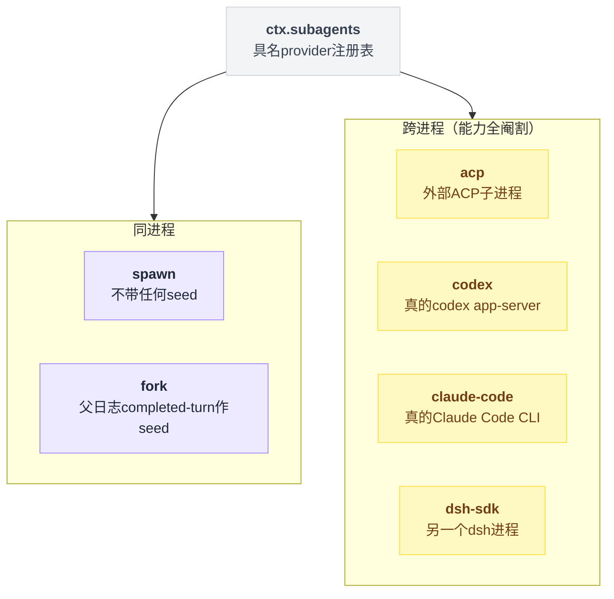

`NO_START_CAPABILITIES` 的注释把代价写得很直白（`packages/subagent/subagent/src/out-of-process.ts:19-23`）：跨进程的孩子**没法**兑现 `outputSchema`/`maxDepth`/`toolFilter`/`persona`，所以服务在 `start()` 之前就用 `SubagentError('UNSUPPORTED_CAPABILITY')` 拒掉（`subagent/src/index.ts:442, 492`），"never accepted-then-ignored"。这是本章第一次看到有人把「工具白名单在跨进程场景下不可执行」这件事做成了**类型化的能力协商**，而不是像 Pi 的 `reviewer.md` 那样在提示词里叮嘱一句。

选哪个 provider 不是工具参数，而是**加载几个工具实例**。默认组合（`packages/bundle/base/cordis.patch.yml:313-329`）挂了两个 `tool-subagent`：`subagent`（provider=spawn，`backgroundMode: continuable`）和 `subagent_fork`（provider=fork，`one-shot`）。示例组合里还能再挂 `subagent_codex` / `subagent_claude_code`（`examples/acp-agent/product-subagent-both.cordis.yml:14-27`，两者都被迫写 `maxDepth: provider-managed`——递归预算归对方运行时管）。

### 9.2 上下文继承：不是一个参数，是两把不同的工具

Codex 在 v1（默认不继承）和 v2（默认全继承）之间摇摆，Grok 用 `InitialContextSource` 三档，LangChain 交给调用者。dsh 的答案是把 spawn 和 fork 做成两个 provider、暴露成两个工具名，让模型在调用点选。而且 `inheritsParentContext` 这个布尔值的主要用途是**生成不同的工具描述**（`tool-subagent/src/index.ts:211-236`、`:291`）：fork 那份写 "It already sees this conversation's completed turns… state only what is new"，spawn 那份写 "it does not see this conversation"。注释解释了为什么必须这样：给 fork 用 spawn 的措辞是**说谎**。（它还有第二处用途：`tool-ralph` 拿它做准入校验，直接拒掉继承型 provider，`tool-ralph/src/index.ts:228-230`。）

fork 的 seed 口径与 Grok 的衰减式继承不同——它是**无损的 completed-turn 前缀**（止于最后一个 `turn/end`，不含在飞的那个 turn），且只在创建时抓一次（`subagent-fork-in-process/src/index.ts:48-53`，one-shot 路径在 `:68-69` 调用）。没有 Grok 那种「近 3 turn 逐字、更早的摘要」的压缩。

### 9.3 第五种答案：子 agent 的能力集是一棵插件树

这是本章此前没有出现过的形态。dsh 的模型可见工具几乎全部挂在 **agent preset**（服务在 `packages/preset/agent-presets`，随仓库发的四个 preset 在 `apps/cli/config/agent-presets/{code,standard,cordis,minimal}/agent.cordis.yml`）上，而子 agent 的组合窗口做三件事（`packages/subagent/subagent/src/child-agent.ts:163-175`）：

```ts
// packages/subagent/subagent/src/child-agent.ts:168-174
childCtx.get('agentPresets')?.composeFrom(childCtx, parent.ctx)
// Order 120: after the sandbox:policy (110) and approval:policy (115) sentences.
childCtx.systemPrompt.context({ name: 'subagent:delegation', order: 120, text: SUBAGENT_DELEGATION_CONTEXT })
if (composition.persona !== undefined) {
  childCtx.systemPrompt.section({ name: 'deployment:persona', order: 0, text: composition.persona })
}
if (composition.toolFilter !== undefined) childCtx.tools.restrict(composition.toolFilter)
```

所以 `toolFilter` 只是**在继承来的那棵树上再做交集**，不是能力的来源。同一段函数的注释点明了这个设计的脆弱处：一个没 join preset 的孩子会看到**空的工具注册表**——正因为如此，join 和 per-child 注册被强行写在同一个函数里，"Taking the parent as a parameter is what makes that omission unrepresentable at the call sites"。preset id 还会写进子会话 header（:108-111），理由是冷读转录时必须用同一套工具集重建历史。

比工具白名单更硬的一条：委派时**强制把 approval 策略钉成 `'never'`**，不管父 agent 自己是什么策略（`child-agent.ts:199-215`），并作为 `source: 'delegation'` 事件落进子日志。配套的固定上下文句子（:135-139）告诉子 agent：

> You are a delegated subagent: your permission scope was fixed when you were started and cannot be widened from inside this session — operations that require approval are rejected automatically.

对照第 2.3 节 Pi 作者那句「Assume tool permissions are not perfectly enforceable」——dsh 在**审批面**上把这个洞堵成了机制（子 agent 无法通过弹窗提权），在**bash 万能**这一面仍然没堵。

### 9.4 continuable 子 agent：比 Codex v2 更彻底的 actor 化，外加一条子→父推送

默认的 `subagent` 工具是 `backgroundMode: continuable`，`run_in_background` **默认 true**（`tool-subagent/src/index.ts:263`）——与 Grok 一致，与三个主样本相反。返回的不是 job id 而是**持久的 child session id**（`:398`，`subagentId: started.childId`），子 agent 是一个「至多一个活 Activation 的持久 Session」，三态 `running` / `waiting` / `settled` 由 Agent 静默性和 owned-child 集合推导，不维护第二个状态机（`subagent/src/continuation.ts:145-159, 871-873`；`docs/subsystems/subagent.md:136`）。`send_message` 冷 resume 已落盘的孩子，`interrupt_agent` 能打断**任意后代**而不只是直接子女（工具描述：`tool-subagent-control/src/index.ts:82-87`，"The target may be your direct child or a deeper agent created under you"），且只停当前 turn、排队消息原地保留。

三态之间怎么迁移，画成状态机比文字描述清楚得多：

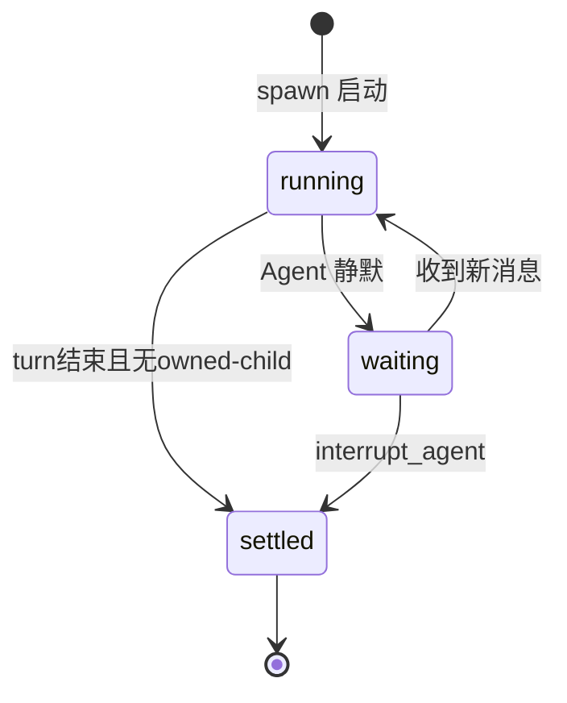

真正的新东西是 `report`：一个**只注册进 continuable 子 agent 自己 scope**的工具（`tool-subagent-report/src/index.ts:39-52`，注册点 `:64`），让孩子在**不结束自己 turn**的情况下主动把结论推给直接父亲，`reportDelivery` 可选 `wakeup`（默认，唤醒父亲开一个新 turn）或 `quiet`（只入上下文不唤醒，`:26-36`）。它的提示词直指第 1.1 节的带宽悖论，而且给的是和 Pi scout「回传坐标」不同的解法：

> The agent that started you shares your workspace but does not automatically receive your transcript, tool output, or reasoning, so a closing remark such as "done" leaves it nothing it can use.

**共享工作区就是回传通道**——不传内容，因为文件本来就在那儿。另外，Activation 结算时 runtime 还会**无条件**给父亲发一条 `subagent-settled` 通知（`continuation.ts:83, 1414`），和孩子自己写的 `report` 用不同的 `kind`，理由写在类型注释里：合并两者等于「credit the child with words it never wrote」（`docs/subsystems/subagent.md:212-231`）。这个「运行时的话」和「孩子的话」分开记账的做法，四个既有样本都没有。

### 9.5 编排：一个引擎，两个消费者（模型写脚本 / 部署写脚本）

`ctx.workflowEngine` 与 Grok 的 `workflow` 工具形态几乎一样，但脚本语言是**普通 JavaScript**（`node:worker_threads` 里一个 `vm` context），host 全局只有 5 个函数加一个数据全局（`workflow-worker-thread/src/runtime.ts:100-108`）：`agent` / `parallel` / `pipeline` / `phase` / `log` / `args`。比 Grok 的 Rhai 多一个 `pipeline(items, ...stages)`——逐项流水线、**阶段之间没有 barrier**，工具描述明确说 "prefer this for multi-stage work"（`tool-workflow/src/index.ts:144`）。

真正拉开差距的是 `agent(prompt, opts)` 的 `opts.schema`：传 JSON Schema 就返回**校验过的结构化对象**，脚本可以直接在 JS 里对它做计算（`runtime.ts:39`：`SUPPORTED_AGENT_OPTIONS = new Set(['label', 'phase', 'schema', 'provider', 'model'])`）。第 8 节记录的 Grok host 函数清单里没提到这一项（该节没有展开 Rhai `agent()` 的可选参数，未在 Grok 仓库复核）。而下一行同样值钱（`runtime.ts:40-41`）：

```ts
/** Deferred Claude Code options we name explicitly in the rejection message. */
const DEFERRED_AGENT_OPTIONS = new Set(['effort', 'isolation', 'agentType'])
```

`isolation` 被逐字列为**拒绝项**，测试断言脚本会因此整个死掉（`workflow-worker-thread/tests/workflow-worker-thread.spec.ts:328-332`，`expect(result.error).toContain('"isolation" is deferred')`）。也就是说 dsh 知道 Grok 的 worktree 隔离长什么样，并且明确没做。

护栏：`maxConcurrentAgents` 默认 0→自动 `min(16, max(1, cores-2))`（`workflow-worker-thread/src/index.ts:35`，实现在 `:152`）、`maxTotalAgents` 1000（"a runaway-loop backstop"）、单次 `parallel/pipeline` 最多 4096 项、同步片 5s、取消宽限 5s（`index.ts:116-121`；`runtime.ts:256-258`）。

第 8 节批评 Grok 时说「脚本本身也是模型生成物，跳过 planner 的问题只是从 prompt 层挪到了 DSL 层」。dsh 给了这个批评一个正面回应：同一个引擎上还挂着 `tool-ralph`（`packages/workflow/tool-ralph/src/index.ts:413` 注册为 `ralph`），脚本是**编译期写死的常量** `RALPH_SCRIPT`，注释直说 "The model supplies data only; it cannot alter the loop, provider route, schema, or handoff validation."（:87-88）。模型只能传 `objective` 和 `maxRounds`。循环体是：每轮开一个**全新**子 agent，只带不变的 objective 和上一轮那份被 schema 严格校验、超 16384 字符就报错的结构化 handoff（:24-30, :90-177）。工具描述那句是全项目最凝练的上下文管理声明：

> Each round opens a new child with no parent conversation or prior child session; the shared workspace is long-term memory, and only a bounded structured report crosses rounds.

**编排逻辑的第五种居所：部署方写死的脚本**——比 LangChain 的应用层代码更靠近产品，比 Grok 的模型生成脚本更可审计。

五个样本各自把编排逻辑放在不同的地方，串起来看是这样一条谱系：

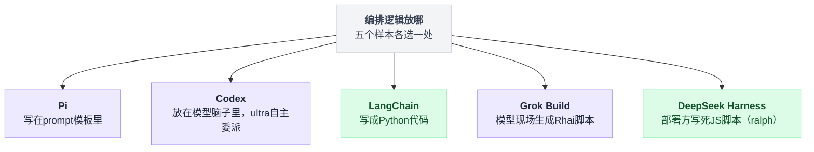

### 9.6 没做的和倒退的

- **并行写冲突：完全不管**。子 agent 共享父会话 cwd（`child-agent.ts:110`），无 worktree、无锁，`isolation` 是拒绝项。连 Codex `worker` 角色那种「明确分配文件所有权」的提示词约定都没有——`rg -n "worktree"` 全仓的命中全部落在 git 工具链与开发/翻译文档、Windows ACL 注释和上面那条拒绝测试上，`packages/subagent` 与 `packages/workflow` 的源码里一处都没有。第 6 节经验第 4 条「Grok 做了、三家没做」在五样本尺度下变成 **1:4**。out-of-process provider 可以配一个固定 `cwd`（`out-of-process.ts:114-120`），但那是部署级常量，不是每个孩子一份。
- **递归上限默认 3**，不是 1（`tool-subagent/src/index.ts:98`：`maxDepth: … .default(3)`）。Codex 和 Grok 独立收敛到 1，dsh 是唯一放到 3 的——正好落在第 7 节「递归深度 > 2 就该退回单 agent」的红线之外。深度是持久的、单调的：`SessionHeader.delegationDepth` 与运行时 `AgentOptions.subagentDepth` 取**大**（`depth.ts:35`），冷 resume 无法把自己降回顶层。
- **直接委派没有并发上限**。`maxConcurrentAgents` 只存在于 workflow 引擎；`ctx.subagents` 侧只有一句「shared capacity controller **may** delay」的接口注释（`types.ts:280-284`），我在 `packages/subagent/*/src` 全文搜 `concurren|capacity|semaphore`，除这句注释外只剩 listing 的冷读并发常量 `COLD_READ_CONCURRENCY = 4`（`list-children.ts:32`）和几处并发安全说明，没有任何准入闸门。模型连着发 20 个后台 `subagent` 调用，没有东西拦。
- **`schedule` 不是多 agent 设施**。`packages/schedule` 是会话内的定时提醒（after/at/every，其中 `every` 最小 5 分钟），提醒以普通 follow-up turn 回到**原会话**，不起新 agent。后台线走的是 `packages/jobs`：通用 job 注册表 + `job_output` / `job_list` / `job_kill`（`packages/jobs/tool-jobs/src/index.ts:303, 343, 363`）+ 完成通知注入 owner 的下一步或唤醒空闲 owner，一次性子 agent 的后台模式就复用它（`tool-subagent/src/index.ts:406-422`）。

### 9.7 可观测性：子 agent 是可以走进去说话的会话

第 1.4 节说子 agent 是「黑盒里的黑盒」，Pi 的立场是宁可用 tmux 换可观测性。dsh 的答案比另外四家都远：子 agent 的转录**就是一个普通 Session**，Web 端在父会话头部挂一棵可懒加载展开的目录树，点任意深度调 `SessionRuntime.openSubagent()` 切进去（`packages/client/ui-subagent/README.md:5-11`）。一次性子 agent 打开是只读执行记录；**continuable 子 agent 只要父亲还活着，输入框就是可用的——你打的字直接进它的 FIFO inbox，Stop 走 `subagent.interrupt`**。也就是说 Pi 用 tmux 换来的「实时看到 + 随时切进去直接对话」，dsh 在保留程序化编排的前提下拿到了。代价写在同一份 README 的 Known Limitations 里：目录树**没有持久的结果状态**，只有 running/inactive，分不清完成、失败还是取消。

模型侧则相反地保守：`report` 是唯一的中途回传，工具描述逐字承诺 "You receive its result, not its intermediate steps."（fork 那份，`tool-subagent/src/index.ts:219`；spawn 那份是 "The subagent returns its result, not its intermediate steps."，:229-230）。**人看得见全部，模型只看得见结论**——这个分层比 Pi 的「模型可见截断 50 KB / tool details 看全部」更彻底。

### 9.8 本节未确认

- ⚠️ 一次性（one-shot）子 agent 最终输出**有没有 token/字符上限**没找到。`SubagentResult.output` 是「最后一条非空 assistant 消息」原样带回（`docs/subsystems/subagent.md:316-323`），`tool-subagent` 只在失败路径拼 `Partial output before the run ended:`（:149-155），没看到截断。对照 Codex 的 1000 token 硬墙（该数值本身在第 7 节存疑 1 里被标为未确认）和 Pi 的 50 KB，dsh 这里可能真的不截。
- ⚠️ `subagent-acp` / `subagent-dsh-sdk` 的进程与转录细节没细读（只核了 config schema 与 capability 声明），它们的中断传播是否等价于 Pi 的 SIGTERM→SIGKILL 未验证。
- ⚠️ `agent-presets` 的 `composeFrom` 具体如何把 mount scope 挂到子 ctx（`packages/preset/agent-presets/src/mount.ts`）我没逐行读，只读到 `child-agent.ts` 的调用点和 `subagent-in-process-driver/tests/preset-inheritance.spec.ts` 的五条断言（子 agent 用父 preset 的工具、带父 prompt section、把组合记进 header、toolFilter 在其上做交集、父亲空白时换 preset 会跟随）。
- ⚠️ `docs/subsystems/subagent.md` 里大量 `ts type-equiv` 代码块是文档独有的等价类型渲染，我逐条核对的是 `types.ts` / `child-agent.ts` / `depth.ts` / `continuation.ts` / 各 provider 的真实声明；**未发现文档与代码冲突**，但没有全量比对（该文件 734 行）。
