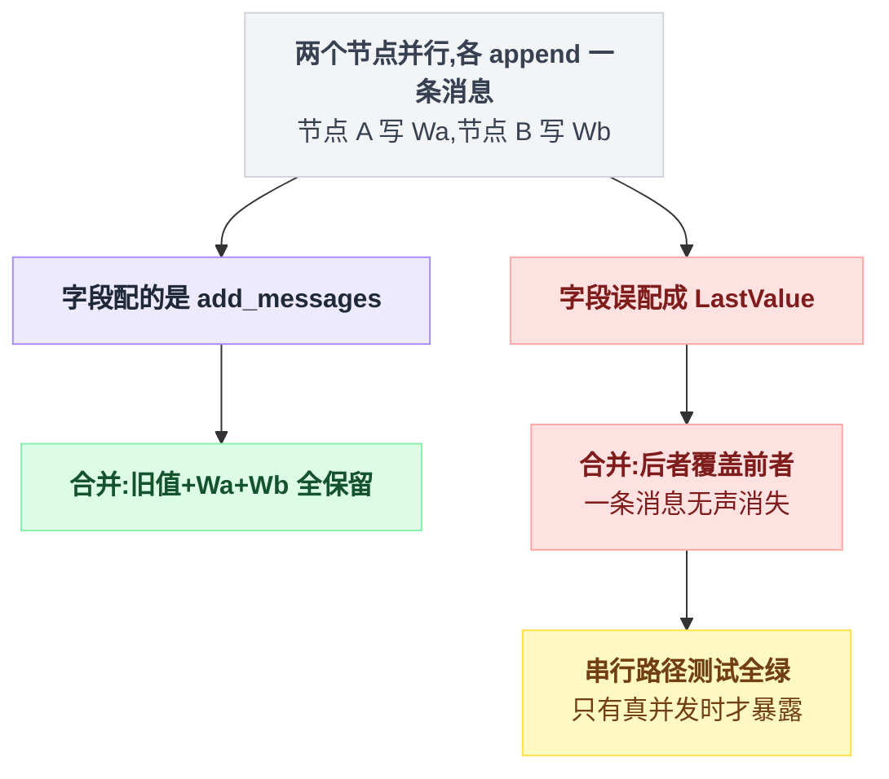
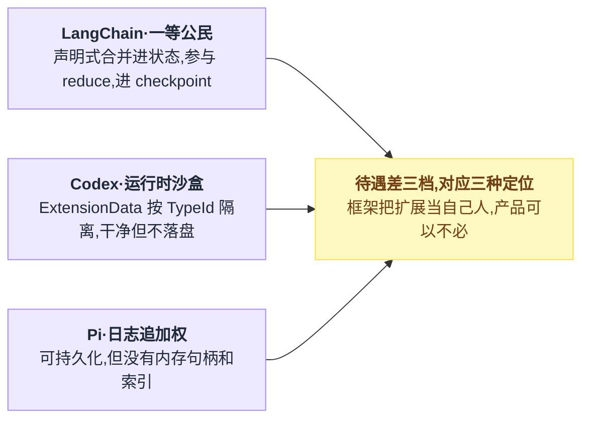
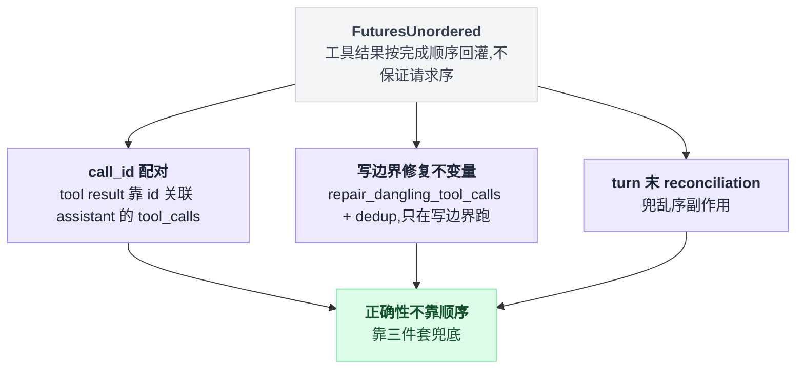
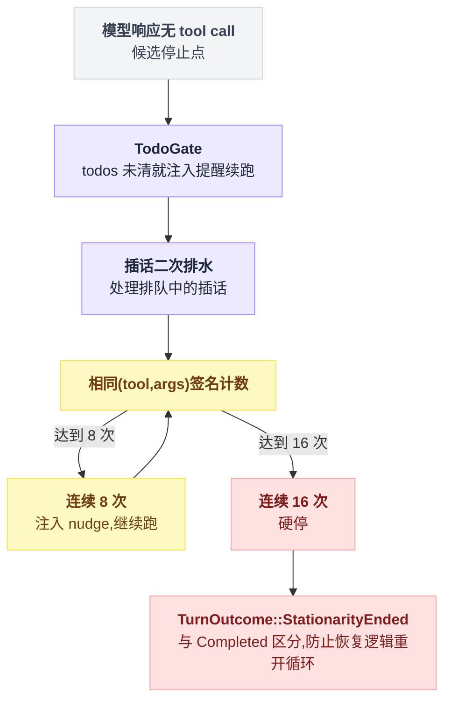
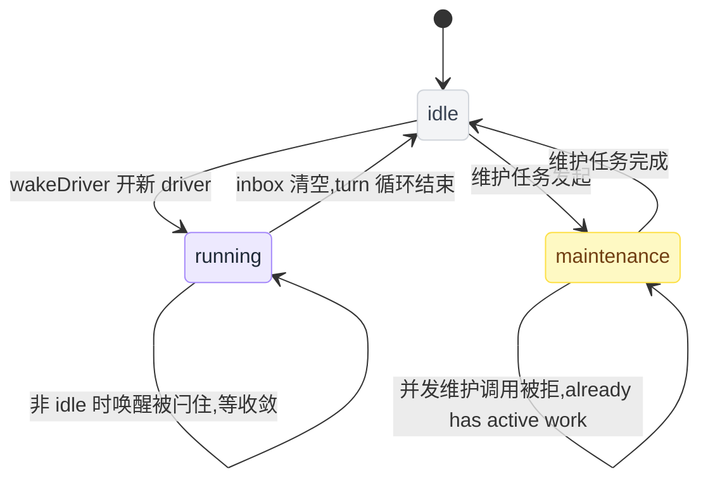
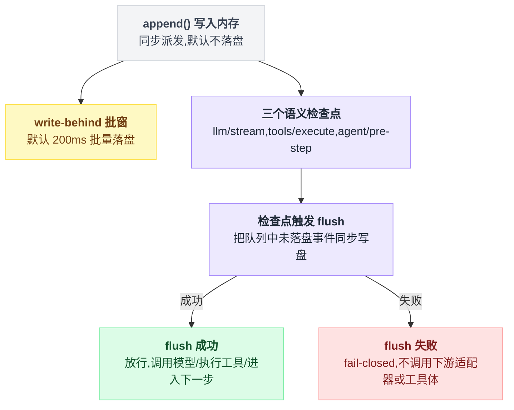
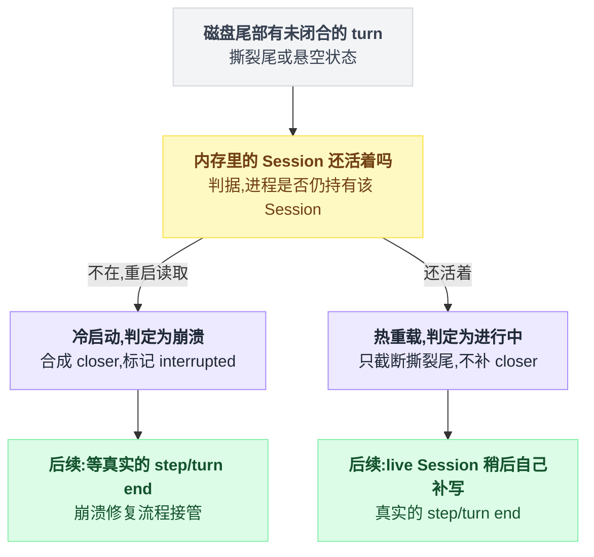
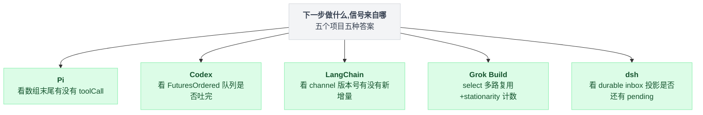

# 14 · 状态同步与循环驱动

> **一句话导读**：agent 每转一轮循环，都要回答同一个问题——"下一步做什么？"这个答案不在模型里（模型是无状态的），只能从客户端自己保存的**状态**里读出来。
>
> 三家给出了三种完全不同的状态架构：Pi 把状态做成一条只追加的事件日志，内存数组只是投影；Codex 把状态锁在一个 `Mutex` 里，用 `Arc` 写时复制分发；LangChain 把状态拆成一个个带 reducer 的 channel，用版本号驱动调度。三种取舍都能追到同一个根问题：**你允不允许两处代码同时改状态**。
>
> 调研时间：**2026-08-06**。Pi 读 v0.83.0（commit `845d6ff`），Codex 读 rust-v0.146.1 后的 HEAD（commit `0a0ebb8`），LangGraph 读当日 HEAD（commit `658541c`）、langchain_v1 读当日 HEAD（commit `3579fe9`），文中行号均为当日实测。LangGraph 与第 02/10 章调研时的版本可能有漂移，引用前建议重新 grep。正文只讲机制，出处坐标收在文末[脚注](#出处)，点角标可跳转。
>
> **本章涉及源码**
> - Pi：`packages/agent/src/{agent.ts,agent-loop.ts}`、`packages/agent/src/harness/session/{session.ts,jsonl-storage.ts}`、`packages/coding-agent/src/core/session-manager.ts`
> - Codex：`codex-rs/core/src/session/{session.rs,mod.rs,turn.rs,rollout_reconstruction.rs}`、`codex-rs/core/src/{tasks/mod.rs,context_manager/history.rs,thread_manager.rs}`
> - LangChain v1：`langgraph/pregel/_algo.py`、`langgraph/channels/{last_value.py,ephemeral_value.py,untracked_value.py,binop.py}`、`langgraph/errors.py`、`langgraph/checkpoint/base/__init__.py`、`langchain/agents/factory.py`

---

## 0. 先搞清楚：循环凭什么知道下一步做什么

### 0.1 从最小的 agent 循环说起

把所有框架的皮扒掉，agent 循环就是这么几行。第 02 章讲过它的形状，本章讲它中间那坨"状态"：

```
state = { messages: [用户的任务] }          ← 状态诞生

while true:
    reply = 调模型(state.messages)          ← ① 状态被读
    state.messages.push(reply)              ← ② 状态被写
    if reply 里没有工具调用:
        break                               ← ③ 状态决定"停"
    results = 执行工具(reply.toolCalls)
    state.messages.push(results)            ← ④ 状态又被写
                                            ← 回到 ①，状态决定"下一步"
```

有件事容易被忽略：**模型本身完全无状态**。它不记得上一轮说过什么——每一轮你都把整个 `state.messages` 重新发给它。

所以"agent 知道下一步做什么"这句话，严格说是两件事：

1. **模型**决定"该调什么工具 / 该说什么"——它的依据是你发给它的消息列表；
2. **循环代码**决定"要不要再转一轮、拿什么去转"——它的依据是状态里的最新内容。

这两件事的原料都是同一个东西：**客户端保存的状态**。状态错一点，下一步就错一路。

所以"状态怎么存、谁能改、改了怎么让所有人看到一致的版本"，是 agent 架构里最底层的一层。第 02 章讲了循环的形状，第 10 章讲了状态怎么落盘，本章讲的是中间这段：**状态在一轮循环内部和多轮循环之间，是怎么流动、怎么保持一致的**。

### 0.2 三家的"下一步信号"长什么样

同一个问题——"这一轮结束了，下一步干什么？"——三家是从三种完全不同的地方读出答案的：

```
 Pi        看数组末尾：最新那条 assistant 消息里有没有 toolCall？
           ┌─ msg[0] ─ msg[1] ─ ... ─ msg[n] ←── 有 toolCall → 执行工具再转一轮
                                              └── 没有       → 停

 Codex     看任务队列：FuturesOrdered 里还有没有没跑完的 future？
           [future₁]→[future₂]→[future₃] ←── 按提交顺序逐个吐结果，空了这轮才收尾

 LangChain 看版本号：有没有节点订阅的 channel 版本比它上次见过的新？
           channel "messages"  version: 5
           节点 A 上次见过的     version: 4  ←── 5 > 4 → 调度节点 A 跑
           节点 B 上次见过的     version: 5  ←── 没变   → 不跑；谁都没得跑 → 整个图停
```

你在上一轮对话里说的"LangChain 用 status 同步状态"，指的就是第三种。严格说不是 status 字段，而是**每个 channel 的版本号**（`channel_versions`）和**每个节点见过的版本号**（`versions_seen`）之间的差值在驱动调度[^1]。

Pi 和 Codex 没有这个机制，也**不需要**。为什么不需要，是本章的主线。

### 0.3 根问题：允不允许两处代码同时改状态

先把结论放在最前面。三种架构的所有差异，都能追到对同一个问题的回答：

```
        "允许两段代码并发地修改状态吗？"
                    │
        ┌───────────┴───────────────┐
        ▼                           ▼
      不允许                       允许
        │                           │
   "那怎么保证只有一处在改？"      "那两个写冲突了怎么办？"
        │                           │
   ┌────┴─────┐                     ▼
   ▼          ▼               LangChain：每个字段
  Pi：       Codex：           预先声明一个 reducer，
  JS 单线程   Rust Mutex        冲突时按 reducer 合并，
  天然串行，  强制串行，         没声明 reducer 还敢
  二次进入    新任务先 abort     并发写 → 直接报错
  直接 throw  旧任务
```

落到实现细节上，三家各是一道硬闸：

| 项目 | 并发写会怎样 |
|---|---|
| Pi | 第二次调用还在跑的 `prompt()` 直接抛错"Agent is already processing."——结构上不给你并发的机会[^2] |
| Codex | spawn 新任务前先中止会话里所有旧任务，同一会话同时只有一个任务在推进状态[^3] |
| LangChain | 一个没配 reducer 的字段在同一步收到两次写入，直接抛出 `InvalidUpdateError`：一步只能收一个值，想合并多个值就得显式声明合并规则[^4] |

LangChain 那行的意思是：允许并发，但冲突必须你提前说清怎么合并，说不清就拒绝执行。

"不允许"的好处是简单：冲突不可能发生，所以不需要合并语义。代价是**状态写入永远串行**——Pi 和 Codex 的并行只发生在工具执行层，真正往状态里写的时候还是排队。

LangChain 是三家里唯一允许多个节点**真正并发产生状态更新**的，reducer 就是这个能力的必然代价。记住这条，后面每一节都会回到它。

---

## 1. Pi：状态是一条日志，内存里的只是投影

### 1.1 一张图看全

一句话：loop 只能 emit 事件 → Agent 是唯一 reducer → 每个事件同步落盘成 JSONL entry 树 → 需要上下文时从 leaf 回溯到根 fold 出消息列表。

```
                    ┌──────────────────────────────────────────┐
                    │              agent-loop                  │
                    │  持有一份工作副本 messages = xxx.slice()  │
                    │  (agent.ts:70-87)                        │
                    │                                          │
                    │  调模型 → push(reply) → 执行工具          │
                    │  → push(results) → 再转一轮…             │
                    └──────────────┬───────────────────────────┘
                                   │ 它无权直接改 Agent 的状态，
                                   │ 只能 emit 事件
                                   ▼
                    ┌──────────────────────────────────────────┐
                    │           Agent（唯一 reducer）           │
                    │  收到事件 → 更新 this._state.messages     │
                    │  (agent.ts:168 注释原话:                  │
                    │   "Agent owns the current transcript,    │
                    │    emits lifecycle events…")             │
                    └──────────────┬───────────────────────────┘
                                   │ 每个事件同步落盘
                                   ▼
                    ┌──────────────────────────────────────────┐
                    │      磁盘上的 JSONL entry 树（真相源）     │
                    │                                          │
                    │   entry₁ ←─ entry₂ ←─ entry₃             │
                    │      ↖                  ↑                │
                    │        entry₂' ←─ entry₃'  ← leafId 指这里│
                    │   (每条 entry 带 parentId，天然是棵树)     │
                    └──────────────┬───────────────────────────┘
                                   │ 需要上下文时:从 leaf 回溯到根，
                                   │ 把路径上的 entry fold 成消息列表
                                   ▼
                    ┌──────────────────────────────────────────┐
                    │   buildSessionContext() 产出的投影        │
                    │   (session.ts:138；:179-181 getBranch    │
                    │    = getPathToRootOrCompaction(leafId))  │
                    │   ★ 这个数组可以随时扔掉重算              │
                    └──────────────────────────────────────────┘
```

这套东西有个学名叫**事件溯源**（event sourcing）：不存"现在的状态"，存"发生过的每件事"，现在的状态 = 把所有事件从头放一遍（fold）。

银行账本就是这个模式——银行不存"你有 3000 块"这个数字，存的是每一笔存取记录，余额是算出来的。

### 1.2 为什么这样设计——三个"免费"得到的能力

**分支几乎免费。** 状态本来就是棵树，每条 entry 带 `parentId`，追加时把新 entry 的父指针指向当前 leaf[^5]。

想"回到第 3 步重来"？把 leafId 指针指回 entry₃，往下追加的新 entry 自然长成新分支。另外两家都得为分支单独造机制（见第 2.4 节和第 10 章）。

**崩溃安全几乎免费。** `_persist()` 用的是**同步的** `appendFileSync`，每条 entry 立即落盘、不缓冲不批量[^6]。进程被 `kill -9`，最多丢正在写的一条。

这里有一个本次调研新发现的细节：在**第一条 assistant 消息出现之前**，`_persist` 会先缓冲不落盘，源码注释是 "Mark as not flushed so when assistant arrives, all entries get written"。

目的是避免为"用户打开就退出"的空会话留文件，代价是首条回复到来前崩溃会丢掉开头几条。这是个清醒的取舍：空会话文件的垃圾是每天都发生的，开头崩溃是罕见的。

**可解释性几乎免费。** 任何时刻的状态都能回答"我是从哪几条 entry fold 出来的"。压缩（第 04 章）也不删数据——压错了还能回去。

**为什么 loop 无权写状态、只能 emit？** 这是整套架构的立足点：写入口唯一，意味着"什么算一次状态变更"有唯一的定义处，落盘、通知订阅者（扩展）、更新内存投影三件事永远同步发生。

反过来想就明白了：如果 loop 也能直接改 `_state.messages`，那就有两个写入口，磁盘日志和内存状态迟早漂移——那事件溯源的一切好处就全没了。

### 1.3 不这样会怎样 / 这样会怎样——真实的代价

**两份数组的不一致窗口。** loop 的工作副本先 `push`，事件走完 Agent 的 `_state.messages` 才对齐。在这个窗口里读 `agent.state` 的代码——比如一个订阅了 `tool_call` 事件的扩展——看到的是**旧值**。

这不是 bug，是架构固有性质，但没有文档提醒你。

**每轮 `.slice()` 是 O(n)**[^7]。浅拷贝，但每轮一次全量分配，长会话下和 Codex 的 `Arc::clone`（O(1)，只加引用计数）差距会显出来。

**投影成本随日志增长。** `buildSessionContext()` 每次要从 leaf 回溯整条路径再 fold；append-only 意味着文件只增不减。

**扩展状态是二等公民。** 扩展只能往日志里追加自己的 entry，重载时自己扫日志重建，没有内存句柄、没有索引。想写一个"记住用户偏好"的扩展，你得自己实现那个 fold。

**同步写盘在主线程上。** Node 单线程，`appendFileSync` 是实打实的阻塞。注意分层：agent 包内部走的是异步 `appendFile`，但产品层 session-manager 是同步的[^8]。大量小写入时会卡 UI。

**什么时候会痛**：几千条 entry 的超长会话 + 频繁压缩 + 多个有状态的扩展。

### 1.4 那"下一步"到底怎么决定

回到本章的核心问题，Pi 的答案全在 agent-loop 那段主循环里[^9]：

```
while (true) {                                    // :170 外层：一次任务
    while (hasMoreToolCalls || pendingMessages.length > 0) {   // :174 内层
        message = 调模型(当前消息列表)
        toolCalls = message.content.filter(c => c.type === "toolCall")  // :203
        if (toolCalls.length > 0) {               // :207
            toolResults = 执行(toolCalls)
            // 结果 push 进列表 → hasMoreToolCalls 继续为真
        }
        // 没有 toolCall → 内层条件变假 → 退出
    }
    // :166 检查 steering：用户在模型思考时插的话，有就再转外层
}
```

"下一步做什么"= **看最新一条 assistant 消息的内容**。状态的最末端就是决策的全部输入，没有任何额外的调度器。

这是三家里最朴素的答案，朴素到几乎不像一个"机制"。而这正是 JS 单线程 + 禁止并发进入换来的：既然任何时刻只有一条执行流，那"数组末尾"就永远是一致的，直接读就行。

---

## 2. Codex：状态锁在 Mutex 里，读者拿写时复制的快照

### 2.1 一张图看全

```
                 ┌─────────────────────────────────────────┐
                 │   Mutex<SessionState>（session.rs:39）   │
                 │   唯一 owner，所有历史写入走同一个函数     │
                 │                                         │
                 │   history: Arc<[ItemA, ItemB, ItemC]>   │
                 │   history_version: 42  (history.rs:46)  │
                 └───────┬─────────────────────┬───────────┘
            写入者        │                     │  读者
        ┌───────────────▼──┐               ┌──▼───────────────────┐
        │ lock() → 改内存   │               │ lock() → Arc::clone  │
        │ → bump version   │               │ → 立刻放锁            │
        │ → 放锁           │               │ 拿走一个 O(1) 快照,   │
        │ → 锁外落盘 ★     │               │ 之后随便读,零拷贝     │
        └──────────────────┘               └──────────────────────┘

  ★ 锁的纪律：锁只覆盖内存修改，磁盘 IO 在锁外。
    如果 persist 写在锁里，一次慢磁盘就阻塞所有想读历史的任务。
```

**写时复制（COW）用小白话讲**：`Arc` 是带引用计数的共享指针。读者拿快照不复制数据，只把计数 +1；写入者要改时换上一份新数组，旧数组等最后一个读者放手后自动回收。

结果是：**读者看到的世界永远不会在他手里变**——他拿到的是某个瞬间的定格照片，代价是照片可能过时（见 2.3 的 `history_version`）。

### 2.2 顺序是怎么保证的：把它编码进类型名

Codex 的工具是并行执行的（第 05 章），但结果**必须按模型发起的顺序**回灌历史——否则下一轮模型看到的因果就乱了。Codex 的做法是把并行任务放进 `FuturesOrdered`[^10]：

```
 模型按顺序发起:  call₁      call₂      call₃
                   │          │          │
 实际完成时间:      ├────2s────┤          │
                   │      ├─0.5s─┤       │
                   │      │      ├──1s──┤
                   ▼      ▼      ▼
              FuturesOrdered 吐出的顺序: result₁ → result₂ → result₃
              （call₂ 最先跑完，但它乖乖排在 result₁ 后面出来）
```

**为什么说这里藏着最阴的一类 bug**：把 `FuturesOrdered` 手滑改成 `FuturesUnordered`——编译通过、类型检查通过、小并发下顺序还常常碰巧是对的，然后线上偶发乱序。

正确性藏在一个标识符的选择里，没有任何断言守着它。

Pi 不会有这个问题，不是因为 Pi 写得好，而是 Pi 根本是串行 await 的——**能力和风险是一起买的**。

### 2.3 为什么这样设计，代价是什么

**为什么选 Mutex 而不是事件溯源？** 因为 Codex 的语义需求是"想知道现在的状态就 lock 一下看"，不需要"回放"这个中间概念；而且 Rust 的类型系统免费提供了最硬的保证——**忘记加锁是编译错误**，不是运行时惊喜。单一写入函数还让审计、hook、遥测只需要改一处。

**代价一：内存是真相源 → 崩溃即丢，只能靠重放。** 磁盘上的 rollout 文件（第 10 章）是事后追记的日志，重启后要靠 `reconstruct_history_from_rollout` 把内存状态重建出来[^11]。

这段重放代码必须和写入端**永远保持同步**：写入端加了新的 RolloutItem 变体、重放端忘了处理——这就是"双份真相"的经典漂移。对比 Pi：磁盘本身就是真相源，不存在"重放代码"这个会腐烂的中间层。

**代价二：分支是外挂的。** Pi 的状态天然是树；Codex 要用 `ForkSnapshot` 记切点，再用一个引用式的持久化结构[^12]让新文件引用父文件的字节区间，还得处理父文件被删/截断——一整套需要单独维护的机制。

**代价三：`history_version` 是弱通知。** 版本号 bump 了[^13]，但持有旧 Arc 快照的消费者**不会被主动叫醒**，得自己记得比对版本——容易漏检。

注意这和 LangChain 的版本号完全不同：LangChain 的版本号是**调度器主动扫描**的驱动信号，Codex 的只是个供人自查的计数器。

**代价四：锁面在扩大。** 三层状态锁 + Semaphore + OnceLock + ArcSwap + watch，而"先拿哪个锁"没有形式化保证，只能靠人记住。multi-agent v2（第 13 章）允许任意 agent 互发消息之后，这个面还会继续扩。

**什么时候会痛**：多 agent 并发下的锁序；rollout 写入端和重放端的长期漂移。

### 2.4 那"下一步"到底怎么决定

Codex 的答案是**任务队列 + 有序结果流**：

```
turn():
    for f in FuturesOrdered:          // 按提交顺序取，不是完成顺序
        result = await f
        回灌 history
    再问一次模型
    if 新响应里没有工具调用: turn 结束
```

也就是说，一轮 turn 里"下一步"= `FuturesOrdered` 吐出的下一个结果；所有结果回灌完、模型新一轮响应里没有新的工具调用，turn 结束。

用户中途插话？不像 Pi 那样排进 steering 队列等当前轮完——Codex 直接中止全部旧任务换新的[^3]。状态推进权永远只在一个任务手里，这就是它不需要 reducer 的原因。

顺带一提 Codex 的一个独门能力：因为工具结果是流式逐个回灌的，它能**在模型还没吐完流的时候就开始派发工具执行**。LangChain 的图节点边界做不到这件事（节点要跑完才产出写入），这是下一节 barrier 的隐性成本之一。

---

## 3. LangChain v1：状态拆成 channel，版本号驱动一切

### 3.1 先用小白话解释三个词

| 词 | 它是什么 |
|---|---|
| **channel** | 状态对象的每个字段一条独立的"管道"。`messages` 是一条 channel，`用户偏好` 是另一条。管道各自记自己的版本号 |
| **reducer** | 这条管道的"合并规则"。`add_messages` 表示"新值追加到旧值后面"，`LastValue` 表示"新值直接覆盖旧值"。**你选 reducer 的那一刻，就是在回答"两个节点同时写它会怎样"** |
| **superstep（BSP）** | 图的执行按"整步"推进——一步里所有该跑的节点**并行**跑，全部跑完在栅栏（barrier）处集中合并写入，然后才进下一步。BSP（Bulk Synchronous Parallel）是 Google Pregel 图计算的老模型，LangGraph 的执行器就叫 Pregel |

### 3.2 一张图看全:一个 superstep 的完整生命周期

四个阶段：看版本号选人 → 选中的并行跑 → 栅栏处按 reducer 合并 → 版本号 +1 并写 checkpoint。

```
                     ┌── superstep N ──────────────────────────────────┐
                     │                                                 │
  ① plan 阶段        │   调度器扫描所有节点：                            │
     (看版本号)       │   对每个节点问一句——                            │
                     │   "你订阅的 channel 里，有没有版本号 >             │
                     │    你 versions_seen 里记的数？" (_algo.py:609)   │
                     │        有 → 进本步任务列表                       │
                     │        没有 → 不跑                              │
                     │   ★ 谁都没入选 → 整个图停机（这就是终止条件）      │
                     │                                                 │
  ② execute 阶段     │   入选节点全部并行执行                           │
     (同一快照)       │   ┌──────────┐   ┌──────────┐                  │
                     │   │  节点 A   │   │  节点 B   │  ← 两者读到的是  │
                     │   │ 读快照 S  │   │ 读快照 S  │    同一份状态快照 │
                     │   │ 产出写 Wa │   │ 产出写 Wb │  ← 互相不可见！  │
                     │   └────┬─────┘   └────┬─────┘                  │
                     │        └───────┬──────┘                        │
                     │                ▼                               │
  ③ barrier 归约     │   等所有节点跑完（先跑完的干等 ← 纯延迟）         │
                     │   按 task.path[:3] 排序后依次 apply             │
                     │   (_algo.py:256——按路径排序而不是完成时间，       │
                     │    所以同样输入永远同样输出 = 可确定性重放)        │
                     │   每条 channel 用自己的 reducer 合并 Wa、Wb：    │
                     │     messages(add_messages): 旧 + Wa + Wb  ✓    │
                     │     score(LastValue) 收到两份: InvalidUpdate ✗  │
                     │                    (last_value.py:61 直接报错)  │
                     │                                                 │
  ④ 收尾             │   被写过的 channel 版本号 +1                     │
                     │   跑过的节点 versions_seen 对齐 (_algo.py:263)   │
                     │   增量写 checkpoint（含 put_writes 记录的        │
                     │   任务级完成写入, checkpoint/base:300）          │
                     └────────────────────────┬────────────────────────┘
                                              ▼
                                       superstep N+1 的 plan …
```

### 3.3 为什么要搞这么复杂——因为它买了另外两家没有的三样东西

**真并行的状态更新。** Pi 和 Codex 的"并行"只在工具执行层，状态写入是串行的。LangChain 允许两个节点**同时**产出状态更新，靠 reducer 在栅栏处合并。

如果你的场景真有"三个子任务并行推进、结果都要进状态"，只有这个架构直接支持。

**可确定性重放。** 归约顺序按 `task.path` 排序而不是按完成时间[^14]，意味着同样输入必然同样输出——不管这次运行里哪个节点碰巧先跑完。

对写测试和查"为什么昨天那次跑出了不同结果"是巨大优势。Pi 重放的是日志（忠实但只能重放发生过的），Codex 重放靠一段会漂移的重建代码，都做不到"重新执行也保证一致"。

**最细粒度的崩溃恢复。** `put_writes` 把**单个任务**完成的写入先记下来[^15]——superstep 跑到一半宕机，重启后已完成任务的写入直接复用，只重跑没完成的。

三家中唯一真正解决"执行到一半宕机"的：Pi 恢复到上一条 entry，Codex 恢复到重放终点，粒度都是"条"而不是"任务"。

另外扩展状态在这里是一等公民：middleware 的 `state_schema` 编译期合并进主状态、参与 reduce、进 checkpoint（第 06 章），还能用 `UntrackedValue` vs `LastValue` 决定一个字段是 run 级还是 thread 级——channel 目录里 `ephemeral_value.py` / `untracked_value.py` / `binop.py` 就是这些语义的实现。

### 3.4 不这样会怎样 / 这样会怎样——代价清单

**barrier 是纯延迟。** 先跑完的等最慢的。Codex 能在模型流没结束时就派工具，图节点边界做不到。

**如果你的 agent 本来就是单线程推进的（绝大多数是），这套 channel 机制就是在为你用不到的能力付费。**

**心智负担转嫁给了用户。** 该用 `add_messages` 的字段配了 `LastValue`——两个并行节点各 append 一条消息，合并时后者覆盖前者，**一条消息无声消失**。

而且只在真的发生并发时才暴露，测试里跑串行路径完全正常。这是本架构最挖坑的地方：Pi/Codex 把并发问题在结构上消灭了，LangChain 把它变成了每个用户必须答对的选择题。

配对没配对，画成两条路径对比更直观：



**抽象在泄漏，有实锤。** 因为中间件节点让"图步数 ≠ agent 轮数"，用户设的循环上限失去意义，框架索性把递归上限硬编码成了 9999[^16]。

当一个框架需要用魔法数字绕过自己的核心机制时，说明抽象和现实已经错位了。

**还有一串小坑**：

| 坑 | 具体表现 |
|---|---|
| `state_schema` 同名字段合并 | 整体覆盖，reducer 不同也不告警，装几个第三方 middleware 后很难查 |
| `wrap_model_call` 里改 `request.state` | 不会写回，必须返回 `Command(update=...)` |
| 状态必须可序列化 | 否则进不了 checkpoint，连接、文件句柄放不进去 |
| 调试链路长 | "这条消息为什么不见了"可能是 reducer、可能是 `EphemeralValue` 被清空、可能是 checkpoint 没写这条 channel |

**什么时候会痛**：单机单轮的简单 agent（纯付费不受益）；以及团队里没人真正吃透 channel 语义的时候。

### 3.5 那"下一步"到底怎么决定

LangChain 的答案和前两家有本质不同：

```
while true:
    // plan：谁订阅的 channel 有新版本，谁就入选
    tasks = [n for n in 所有节点
                if 存在 n 订阅的 chan 满足 chan.version > n.versions_seen[chan]]
    if tasks 为空:
        停机                       // 没人喊停，是不动点自然到达
    并行跑 tasks，栅栏处按 reducer 合并
    被写过的 chan.version += 1
    跑过的 n.versions_seen 对齐
```

**没有任何一段代码在"决定"下一步——下一步是从版本号差值里"涌现"出来的**。节点跑完 → 写 channel → 版本号 +1 → 恰好有别的节点订阅了这条 channel → 它下一步自动入选。

终止也不是谁喊停，而是"没有任何节点的订阅有新版本"这个不动点自然到达。

这就是声明式调度：你不写"先 A 后 B"，你写"B 订阅 A 写的 channel"，顺序是推导出来的。

---

## 4. 三条横向判断

### 4.1 真相源的选择直接决定崩溃语义

"真相源"（source of truth）= 当内存和磁盘不一致时，你信谁。

| | 真相源 | 崩溃后 | 为此付出的代价 |
|---|---|---|---|
| Pi | 磁盘日志 | 几乎不丢（同步 append） | 每轮投影成本；日志只增不减；主线程阻塞写 |
| Codex | 内存 | 靠 `reconstruct_history_from_rollout` 重放 | 重放端与写入端的长期漂移风险 |
| LangChain | 内存 + 增量 checkpoint | 任务级恢复（`put_writes`） | 状态必须可序列化；checkpointer 成为依赖 |

### 4.2 扩展状态的待遇差三档，而这恰好和三者定位一致

LangChain（框架）给一等公民待遇——声明式、可持久化、参与 reduce；Codex（产品）给运行时沙盒——`ExtensionData` 按 TypeId 隔离，干净但不落盘；Pi（可改的产品）只给日志追加权——可持久化但没有内存句柄。

框架必须把扩展当自己人，产品可以不必。「框架 vs 产品」这条贯穿全书的轴（第 01 章），在状态架构上又落了一次。

三档待遇摆在一张图上，边界会更清楚：



### 4.3 "没有 reducer"不是简陋，是一笔清醒的交易

把第 0.3 节的根问题走到底：Pi 和 Codex 用"结构上禁止并发写"换来了**零合并语义、零心智负担**；LangChain 用"人人必须选对 reducer"换来了**真并行 + 确定性重放 + 任务级恢复**。

没有对错，只有你的场景站在哪边——绝大多数编码 agent 是单线程推进的，站 Pi/Codex 这边；真正的多节点工作流（并行调研、多路综合）才用得上 LangChain 付费买的东西。

### 4.4 一个三家共同的空白：状态血缘

出问题时你最想问的是："这条消息**是谁写的、在哪一步写的、为什么被覆盖了**？"

| 项目 | 能查到 | 查不到 |
|---|---|---|
| Pi | 扫日志能查到"哪条 entry" | "哪个扩展触发的" |
| Codex | rollout 能查到条目 | who |
| LangChain | `pending_writes` 记了 task→write 映射 | 那是给崩溃恢复用的，不长期保留 |

三家都没把「状态血缘」（state lineage）当一等需求。要做需要审计的 agent，这块得自己补——最便宜的做法是在唯一写入口（三家都有这个口）给每次写挂一个 `{who, when, why}` 的信封。

---

## 5. 如果你自己造 agent：状态架构选型

```
 你的 agent 会有多个节点并发写状态吗？
      │
      ├─ 不会（绝大多数编码/对话 agent）
      │    │
      │    ├─ 需要分支/时间旅行/完整审计？ ──→ 学 Pi:事件日志 + 投影
      │    │                                  （用 JS/Python 单线程模型
      │    │                                    白嫖串行化）
      │    └─ 追求性能、语言有真并发？ ──────→ 学 Codex:Mutex + COW 快照
      │                                       （记得:锁不跨 IO、
      │                                         写入口唯一、
      │                                         顺序用类型编码并加断言）
      │
      └─ 会（并行子任务都要写回状态）──────→ 学 LangChain:channel+reducer
                                            （给每个字段写清合并语义,
                                              没 reducer 的并发写要报错
                                              而不是随便选一个）
 不管选哪个,都补上三家共同的空白:
      每次状态写入记录 {who, when, why}
```

三条不管选哪边都成立的铁律：

1. **写入口唯一。** 三家殊途同归的一点：Pi 的 Agent reducer、Codex 的单一写入函数、LangChain 的 barrier 归约——状态变更都收敛到一个地方。这是审计、hook、血缘的挂载点。
2. **顺序保证要么结构化、要么断言化。** 靠"选对类型名"（`FuturesOrdered`）或"记得排序"都是在裸奔——把顺序不变式写成显式断言。
3. **想清楚真相源，然后为它的崩溃语义付全款。** 内存真相源就必须养好重放代码（给写入端和重放端上同一套测试）；磁盘真相源就接受投影成本；折中方案（增量 checkpoint）就接受序列化约束。世上没有第四种。

---

## 6. 未确认与边界说明

- **LangGraph/langchain 读的是 2026-08-06 的 HEAD**，不是第 02/10 章调研时的锁定版本；本章引用的 `_algo.py` 坐标均为当日实测有效（见前文脚注），重新核对前请重新 grep。
- **`read_channels` 返回内部对象引用而非深拷贝**（就地 mutate 可能污染 channel 且不 bump 版本）这一条来自上一轮分析，本次未复核防护代码是否存在，实际影响未验证。
- **Codex `ExtensionData` 的 TypeId 隔离细节**沿用第 06 章的调研结论，本次只复核了状态主链路（Mutex/FuturesOrdered/重放/fork），未重读 extension 存储实现。
- **Pi 两份数组的不一致窗口**是从代码结构推断的固有性质，未构造扩展实测窗口内读到旧值。
- 三个项目都在高速迭代，尤其 Codex 的 multi-agent v2 会持续扩大锁面，本章反映 2026-08-06 的状态。

## 7. 第四个样本：Grok Build

> 调研时间 2026-08-06，`xai-org/grok-build` commit `a5589e9`；全项目背景见 [17 番外](./17-番外-GrokBuild全项目速览.md)。本节只讲状态同步与循环驱动维度——这是 Grok 与本章对照最密的维度。

**一句话**：对第 0.3 节的根问题，Grok 的答案仍是"不允许两处并发改状态"，但它给出了 Pi（单线程 throw）和 Codex（Mutex）之外的第三条实现路径——**把状态关进一个 actor，用消息队列串行化**；而对"顺序怎么保证"，它给出了与 Codex 完全相反的第二种哲学。

### 7.1 状态 owner：actor + channel，无锁是设计宣言

消息历史的唯一 owner 是 `ChatStateActor`——一个独立的 tokio task，所有变更都是 `ChatStateCommand` 经 mpsc 通道送达、在 `handle_command` 里**串行**执行[^44]：

```
ChatStateActor（独立 task，自己一个人拥有 state）:
    loop:
        cmd = await mpsc.recv()      // 队列本身就是串行化手段
        handle_command(cmd)          // 一次只处理一条，不需要任何锁
```

crate 门面上的 ASCII 架构图直接写着 "State (no locks needed)"[^45]；持久化 trait 拿 `Box<dyn ChatPersistence>` 独占所有权、方法全是 `&mut self`，注释原话："no locks, no atomics, no shared state"。

```
   loop / 工具 / UI                        ChatStateActor（独立 task）
   ┌─────────────┐   ChatStateCommand      ┌──────────────────────────┐
   │  任何写入者   │ ──────mpsc────────►    │ state.conversation       │
   │  任何读取者   │ ◄─────mpsc(事件)──     │ persistence（独占,&mut） │
   └─────────────┘                        └──────────┬───────────────┘
    写 = fire-and-forget send                        │ write-behind
    （要屏障时用带 oneshot 的 *AndAck 变体）           ▼
    读 = 请求一个快照                     chat_history.jsonl（可整体替换的投影）
                                         updates.jsonl    （只追加事件日志）
```

和前三家对齐到同一张表上：

| | Pi | Codex | LangChain | **Grok Build** |
|---|---|---|---|---|
| 串行化手段 | JS 单线程 + 二次进入 throw | `Mutex<SessionState>` | superstep barrier + reducer | **actor 命令队列** |
| 写入口 | Agent 唯一 reducer | 单一写入函数 | barrier 归约 | `handle_command` 单点 |
| 读者视图 | `.slice()` 浅拷贝 O(n) | `Arc::clone` O(1) | checkpoint 视图 | **全量深拷贝**（最贵） |
| 忘记纪律会怎样 | 不可能（结构性） | 编译错误 | 静默丢数据 | 不可能（结构性） |

读者视图那格值得停一下：处理 `GetConversation` 命令时直接对整个对话做一次深拷贝，还打了一条 "cloning full conversation" 的 debug log 自认成本[^46]。

这是**用性能买简单性**的明牌——没有 Arc COW 的引用计数心智负担，也没有 Pi 那个"两份数组不一致窗口"（读到的快照永远是 actor 处理完队列中该命令时的一致状态），代价是每次读全量 O(n) 深拷贝，靠对话 pruning 控上界。

### 7.2 顺序保证的第二种哲学：宽进严出

第 2.2 节说 Codex 的 `FuturesOrdered` 是"正确性藏在类型名里"，改成 `FuturesUnordered` 就是最阴的 bug。

**Grok Build 用的恰恰就是 `FuturesUnordered`**[^47]——并行工具结果按**完成顺序**回灌历史，不保证请求序。它没有乱序 bug，因为正确性根本不靠序，靠三件套：

1. **call_id 配对**：tool result 与 assistant 的 tool_calls 靠 id 关联，协议层天然无序安全；
2. **写边界修复不变量**：`repair_dangling_tool_calls` + `dedup_duplicate_tool_results`，只在三个写边界（新建/新用户消息/构建请求）运行，注释明确禁止读路径调用以免误杀 in-flight[^48]；
3. **turn 末 reconciliation** 兜乱序副作用。

三件套怎么兜住乱序，摆成图看得更清楚：



这给第 5 节铁律 2（"顺序保证要么结构化、要么断言化"）补了第三个选项：**修复化**——放弃维持不变式，改为在边界处检测并修复违例。

两种哲学的取舍很清楚：Codex 的防患于未然依赖那个类型名永远没人改错；Grok 的宽进严出多付一份修复代码，但对乱序、崩溃、abort 三种成因用同一套机制兜底[^49]。

并行竞态防护则是参数级的：同批次非只读调用命中同一 `file_path` 时共享 per-path `tokio::sync::Mutex` 按模型发出顺序串行，其余全并发[^50]。

### 7.3 真相源、崩溃语义与"下一步信号"

第 4.1 节的表补上第四行：

| | 真相源 | 崩溃后 | 代价 |
|---|---|---|---|
| **Grok Build** | 内存 actor + write-behind 双 JSONL | 重载投影 + 写边界修复 dangling | 落盘默认 Buffered 不 fsync，崩溃可能丢尾部若干条 |

**亮点一，双日志分工**：`chat_history.jsonl` 是可整体替换的模型侧投影（压缩/rewind 时 `ReplaceChatHistory` 整体重写），`updates.jsonl` 是只追加的 UI 事件日志（rewind 不删日志、追加 `RewindMarker`，跨压缩时间旅行靠重放它）。正好是 Pi 的"append-only 日志 + 投影"与 Codex 的"内存权威 + 写后落盘"各取一半。

**亮点二，torn-tail 自愈**：append 前检查文件最后一字节非 `\n` 就先补一个把残行封死，读端宽容跳过[^51]，注释里写着这个 bug 曾经 "bricked session resume"。

"下一步做什么"的信号（对照第 0.2 节）：外层是 `tokio::select!` 多路复用（命令通道/完成通道/定时器），内层与 Pi 同款"无 tool call 即停"，但停之前要过三道闸——TodoGate（todos 未清注入提醒续跑）、插话二次排水、以及四家独有的 **stationarity 防转圈**。

stationarity 的具体阈值：连续相同 (tool, args) 签名 8 次注入 nudge、16 次硬停、`run true` 式空转 4 次即停，常量间还有编译期断言[^52]，硬停返回专用 `TurnOutcome::StationarityEnded`，注释明确与 `Completed` 区分"防止恢复逻辑重开循环"。

插话是双范式并存：默认 Pi 式排队（"An interjection never cancels the turn"[^53]），另留 `send_now` 的 Codex 式 cancel-and-send。

停止之前要过的三道闸，画成升级路径看更清楚：



### 7.4 本节未确认

- 第 4.4 节的"状态血缘"空白 Grok 是否填上未深查：`updates.jsonl` 记录了事件流，但未确认单条写入是否携带 who/why 归因。
- 深拷贝读视图在超长会话下的实际性能影响未实测，pruning 的具体阈值未查。

---

## 8. 第五个样本：DeepSeek Harness

> 调研时间 2026-08-14，`deepseek-ai/deepseek-harness` v0.1.0-rc.5（commit `47f9438`）；全项目背景见 [18 番外](./18-番外-DeepSeekHarness全项目速览.md)。本节只看状态同步与循环驱动。

**一句话**：对第 0.3 节的根问题，dsh 的答案是第五种——**不禁止并发写、也不用 reducer 合并，而是把"什么算合法的状态变更"写成可执行的关系不变式，谁写都要过闸**；它同时是本章唯一把"日志是真相源"从设计口号做成**运行时断言**的样本，直接补上了第 4.1 节留给 Codex 的那个"重放端会漂移"的洞。

### 8.1 同是单线程，串行化边界比 Pi 小一个数量级

Pi 的串行化边界是**整个任务**（`prompt()` 二次进入 `throw`）。dsh 从不拒绝并发输入：

```
send(msg):                          // 无条件接受，从不拒绝
    inbox.push(msg)
    wakeDriver()

wakeDriver():
    if phase.kind == 'idle':        // 只有 idle 才开新 driver
        开一个新 driver
    else if 维护中 / 已 abort 的活动:
        把这次唤醒闩住，等收敛
    else:                           // 活着的 driver
        什么都不做，它自己会去领队列
```

phase 是三态机 `idle | maintenance | running`[^17]，唯一会因并发而拒绝调用方的是维护任务：报错原文是 `agent "…" already has active work`[^18]。

真正的串行化闸门收缩到了**一次同步 append 及其观察者派发**：

```ts
// packages/core/session/src/index.ts:624
if (entry?.appending) {
  throw new Error('session append cannot reenter while another append is being published')
}
```

phase 三态机之间怎么切换，状态图比文字更一目了然：



也就是说 Pi 用"一个任务一条执行流"换掉了所有并发问题，dsh 只保证"一次 append 不被重入"，await 之间的交错是被允许并被显式管理的（每个 phase 自带 `AbortController`，每步 `signal.throwIfAborted()`）。

代价写在官方防御模式文档里，措辞很硬：**"Async state is not synchronous state"**——`agent.followup()` 没有 per-message 完成信号，多条排队消息、steering、注入工作可能共享同一段 `running` 区间，所以调用方"必须显式定义自己的区间，并把选中的输出描述为区间级的、而不是因果归属到那条消息"[^19]。

这是本章另外四家都没写下来的一条；它们是否同样存在，本章未提供依据。

### 8.2 "Model-visible ⟺ logged" 是断言，不是口号

第 4.1 节给 Codex 记下的代价是"重放端与写入端的长期漂移风险"。dsh 把这件事变成了每次模型请求前的一次强制比对：

```ts
// packages/core/agent-loop/src/invariant.ts:39
const expected = session.deriveMessages()
if (JSON.stringify(options.messages) !== JSON.stringify(expected)) {
  fail(`llm request for session "…" diverges from the dispatch-time durable derivation (log-reconstruction desync)`)
}
```

同一个监听器还要求请求对象被 frozen、messages 数组被 frozen、日志里必须有 `step/start`、`request/header` 折叠出的 model/system/temperature/maxTokens/stop/tools 逐项与实际请求相等[^20]。

它用"全局 + 插队"的方式挂在 `llm/stream` 最前面，注释原话：**"Prepend prevents a short-circuiting replay listener from silencing the check."**[^21]

**一处文档口径与代码覆盖面的差**，这是本节最该记下的发现。官方文档的表述是全称的[^22]——"anything that reaches a model request must be reconstructable from the session log"。

但断言函数一开头就先判断这次请求是不是"agent-loop 发起的"，不是就直接放行不检查；这个判断靠一个 `WeakSet` 查询，只有 agent-loop 亲手标记过的请求对象才在里面[^23]。

session-title、compaction 摘要这类旁路模型调用**不在断言覆盖内**。文档是全称，断言是限定域。

### 8.3 写入口：不是单点，而是"单一函数 + 可插拔关系不变式"

Pi 的立足点是"loop 无权写状态、只能 emit"（第 1.2 节）。dsh 反过来：**任何拿到 `Session` 的插件都能直接 `append`**。

按 `rg "session\.append\(" --glob '!**/tests/**'` 数、去掉 6 处文档命中，非测试代码里共 **48 处调用、分布在 19 个包**（compaction、goal、plan-mode、permission-presets、schedule、todo、llm-retry…）。

它不收紧写者，而是加厚写入函数。一次 `append()` 要过四道闸[^24]：

```
append(event):
    snapshot = JSON 无损可序列化(event)     // 非 JSON 值当场 throw
    surfaceManager.validateNext(event)     // 校验 surface 契约
    deepFreeze(event)                      // 冻结整条事件
    if entry.appending: throw              // 重入检查
    → 写入日志
```

类型层还强制：只有 `user/message` / `assistant/message` / `tool/result` 三种"产消息"事件**必须**声明 `surfaceOp`，其余类型写了会编译报错[^25]。

四道闸串成一条流水线：


真正的第五种答案是那套**运行时不变式注册表**：`ctx.invariants.register(pkgName, installer)`，每个 workspace 包必须发布一个 `./invariant` companion。

实测数字：**219 个包 / 219 个 `src/invariant.ts`，其中 35 个装了真检查，184 个是空实现且必须以 `No runtime invariant:` 开头逐包解释为什么无可检查**（口径：`find packages -name invariant.ts -path "*/src/*"`，按是否含该字符串分类）。

session 包自己那份就是一台事件日志状态机：seq 必须严格递增、`turn/start` 不能套 `turn/start`、`step/end` 时 `pendingCalls` 清空、`tool/result` 必须能在本 step 找到对应 `tool/call`[^26]。

它挂在 `internal/dispatch` 上做**提交前**校验、在 `session/event` 上做提交后推进，注释写明"A later dispatch listener may veto. Validation is pure…"[^27]。

### 8.4 读者视图：缓存的冻结快照（表里第五格）

| | Pi | Codex | LangChain | Grok Build | **dsh** |
|---|---|---|---|---|---|
| 串行化手段 | 单线程 + 二次进入 throw | `Mutex<SessionState>` | superstep barrier + reducer | actor 命令队列 | **单 driver phase 机 + append 重入 throw** |
| 写入口 | Agent 唯一 reducer | 单一写入函数 | barrier 归约 | `handle_command` 单点 | **`Session.append` 单函数，19 个包都能调** |
| 读者视图 | `.slice()` 每次 O(n) | `Arc::clone` O(1) | checkpoint 视图 | 全量深拷贝 | **缓存的冻结浅快照，无 append 时 O(1)** |
| 忘记纪律会怎样 | 不可能 | 编译错误 | 静默丢数据 | 不可能 | **`InvariantError`（有开关，默认开）** |

`events` 访问器返回一份缓存的冻结快照，下次 append 才作废[^28]——等于用 JS GC 白嫖了 Codex 的 `Arc` 引用计数，而且事件在 acceptance 时已深冻，注释原话："neither a cast nor ordinary JavaScript can rewrite durable history"。

`deriveMessages()` 更进一步：**每个 surface 节点只投影一次**，一次调用只花 O(新节点)，压缩触发的 surface 重写靠 `replaceGeneration` 整体失效重建[^29]。

这两条恰好修掉了第 1.3 节列的 Pi 两笔代价——"每轮 `.slice()` 是 O(n)"和"投影成本随日志增长"。

第 1.3 节那个"两份数组不一致窗口"在 dsh 也不存在：loop 根本不持工作副本，每步的 messages 直接来自 `deriveMessages()`，而这一点还被 8.2 的断言逐字守着。

### 8.5 "下一步做什么"：待办队列本身就是日志投影

对照第 0.2 节的三张小图，dsh 是第五种：**信号既不在数组末尾，也不在任务队列或版本号里，而在一个由 session 事件重放出来的 inbox 投影里**。

```
 dsh   看 durable inbox：agent/inbox/spliced 事件重放出的 next-turn / next-step 两条队列
       while (await this.turn()) {}          ← turn() 返回 this.inbox.hasPending
         └ 内层：turnEnds && inbox.nextStep.length === 0 → break，否则 target='next-step' 再转
```

`Inbox` 构造时扫 `session.events` 里 seed 之后的部分，重放其中全部 `agent/inbox/spliced`[^30]。

此后每次增删都先把这次变化写进日志（一条 `agent/inbox/spliced` 事件）**再**改内存投影，注释点明顺序的用意："The durable event commits before the live projection mutates, so synchronous `session/event` observers see the pre-splice lists"[^31]。

驱动条件是外层 `while (await this.turn()) {}` 循环，内层在 inbox 清空且没有新增 step 时才真正退出[^32]。

结果是一个本章没在别处见过的性质：**排队中的 steering / followup 消息是持久的**——进程被 kill 后重启，那条还没被 claim 的插话仍在日志里，重放即回到队列。

另外四家的 steering / interjection / 任务队列是否同样只在内存里，本章原文未给出依据（未确认）。

### 8.6 崩溃语义：语义检查点 + 真 fsync + 撕裂尾自愈

第 4.1 节的表补第五行：

| | 真相源 | 崩溃后 | 代价 |
|---|---|---|---|
| **dsh** | 磁盘日志（内存只是它的投影） | 截断撕裂尾 + 合成 closer 补齐未闭合的 turn/step/tool | 默认 200ms 批写窗口内的事件可能丢；三个语义检查点各引入一次同步等待 |

热路径**不落盘**：`append()` 只写内存并同步派发，"The hot path never blocks on I/O — persistence plugins buffer asynchronously"[^33]，write-behind 默认批窗是 200 毫秒[^34]。

真正的耐久性来自**三个 fail-closed 的语义检查点**[^54]：

| 检查点 | 卡在哪 |
|---|---|
| `llm/stream` | 模型请求发出前 flush，日志前缀不落盘就不给适配器 |
| `tools/execute` | 顶层工具体执行前 flush，flush 后若已 abort 则返回 `tool call aborted before dispatch` |
| `agent/pre-step` | 每步开始前把上一步提交的一切落盘 |

三个检查点卡在哪、失败了会怎样，画出来更清楚：



注释写死了语义："Checkpoint failures are fail-closed at the model and tool side-effect boundaries: the downstream adapter or tool body is not invoked."（:57-59）

**耐久屏障被精确摆在每个不可逆副作用之前**——这比 Pi 的"每条同步 append"更省 IO，比 Grok 的"Buffered 不 fsync"更硬。

落盘端也是真 fsync：先写文件内容，再显式调用一次同步落盘；部分写或同步失败就把文件截断回写前大小再抛错，"leaving partial bytes would create duplicate sequence numbers"[^35]。

同仓库里另一条写路径则明说不做：`writeFileAtomic` 的 JSDoc 写着 "Crash durability (fsync) is out of scope."，下面还挂着一条待办标记[^36]——**同一个仓库里两种耐久等级，会话日志是一等，设置文件是二等**。

resume 侧是确定性修复而非猜测：`interruptedTurnClosers()` 扫日志，给没配对的 tool call 补 `TOOL_NOT_STARTED` / `TOOL_OUTCOME_UNKNOWN` 错误结果，再补 `step/end` 和 `interrupted` 的 `turn/end`[^37]。

合成 closer 本身也是日志事件，所以 8.3 那台状态机断言照样能验它。

### 8.7 两个四家都没有的角度：effect 回滚，和 HMR 中途换插件

**注册也是状态。** Cordis 的 `ctx.effect()` 收集所有 disposer，**倒序**执行，重复调用是 no-op，fiber 卸载时自动跑[^38]。

插件卸载即回滚它注册过的 prompt section、tool schema、adapter、监听器——这是本章四家都没触及的一类"状态"：不是消息，是**运行时装配**。

配套纪律是**"Dispose must reach quiescence, not just request it"**[^39]——teardown 必须 kill 后 await 子进程 `done`，且**先关监听器/通知注册表再 kill**，让迟到的完成静默。

**HMR 是可组合性的极限测试。** 热重载持久化插件时，磁盘上有一段前缀、内存里那个 `Session` 还活着并且可能正跑在一个未闭合的 turn 里。

`adoptLivePrefix()` 的处理是：校验活 seed 覆盖存储前缀、**只截断撕裂尾、不补 closer**、绑定 ownership、把领先的后缀补写下去。

注释写明理由——"that crash-repairs open turns as interrupted, which is wrong for HMR while the live Session is still the authority and may append the real step/turn end later"[^40]。

即：**同一段磁盘状态，冷启动读它叫"崩溃"，热重载读它叫"正在进行"，判据是内存里那个 Session 还在不在**。

同一份磁盘尾部状态，走哪条分支全看这一个判据：



### 8.8 状态血缘：本章第 4.4 节被填上的一格

第 4.4 节说三家都没把"这条消息是谁写的、从哪来"当一等需求（Grok 那一格 7.4 记为未深查）。

dsh 把其中一半做成了**类型层字段**：surface 事件可带 `sourceEventSeqs`——"Seq numbers of earlier events that this event cites as sources"，压缩的 `replace` 节点**必须**列全被它遮蔽的每一个 surface 节点，否则 append 直接失败[^41]。

这是"why / from-what"，可回答"这条消息是被哪次压缩吃掉的"。

它是真的被当证据用的：postmortem 0003 在复盘一次 Web agent 走错验收目标时，直接引用会话日志的 seq 号做时间线——"Its initial request header is sequence 6; the user-facing handoff, bare-Vite launch, replacement-host launch, boot-manifest probe, and first 3081 process probe are sequences 30939, 31865, 34309, 34441, and 34681 respectively. The timeline below follows those events rather than reconstructing intent from the later report."[^42]

**"按日志重建而不是按事后报告重建"**——这句话就是事件溯源在工程上的兑现。

仍然缺的是"who"：事件里没有产生它的插件名，19 个 append 调用点写进日志后彼此不可分辨。

### 8.9 它最像谁 / 推翻了什么

- **骨架最像 Pi**：append-only 事件日志 + 投影，磁盘是真相源，分支/审计几乎免费。但 Pi 靠"唯一 reducer"保证一致，dsh 靠"人人可写 + 可执行不变式"，并且用增量缓存修掉了 Pi 那两笔投影/拷贝成本。
- **不像 Grok**：Grok 是内存 actor 权威 + write-behind 双日志，dsh 是日志权威 + 内存投影，方向相反。
- **补强第 5 节铁律 2**（顺序保证要么结构化、要么断言化）：Codex 把顺序藏在类型名里、Grok 选"修复化"，dsh 是**把铁律里那个"断言化"选项真的实现出来**的一家，而且是可配置、按包归属、失败信息带包名的（`InvariantError`，`code: 'INVARIANT'`）。
- **补强第 5 节铁律 3**（想清楚真相源，然后为它的崩溃语义付全款）：dsh 说明"付全款"不必等于"每条同步落盘"——把耐久屏障钉在不可逆副作用之前，是比 Pi 更精细的付法。
- **不推翻第 0.3 节的根问题结论**：它仍站在"不允许两处并发推进状态"那一侧（单 driver），没有 reducer，也不需要。它推翻的是本章的一个隐含前提——**"写入口唯一"必须靠限制写者来实现**。dsh 证明还可以靠限制写入内容。

第 0.2 节的问题问了一整章，现在五份答案可以并排放在一起看：



### 8.10 本节未确认

- ⚠️ 不变式注册表默认开启[^43]，但**生产 profile 是否真的开着、8.2 那条比对的 CPU 开销**（每步两次全量历史序列化比对）未实测，长会话下的代价未知。
- ⚠️ 8.3 的 48 处 / 19 包是按 `session.append(` 字面量数的，通过变量别名或 helper 间接调用的写入点未穷尽。
- ⚠️ 未验证多个 agent（subagent 场景）同时对**不同** session append 时，`internal/dispatch` 上那台共享状态机是否有跨 session 干扰——代码用 `WeakMap<Session, SessionTrace>` 按 session 隔离，但未构造并发用例实测。
- ⚠️ postmortem 0002（js-expression 禁用文件系统工具）与 0004（landlock）本次只扫了标题与摘要，未逐行读；若其中含状态/生命周期结论，本节未纳入。

---

## 出处

[^1]: LangGraph 版本号比对：`langgraph/pregel/_algo.py:609` 附近；任务跑完后对齐 `versions_seen`：`_algo.py:263`。
[^2]: `packages/agent/src/agent.ts:352` 与 `:473`：第二次调用抛出 `Agent is already processing.`。
[^3]: `codex-rs/core/src/tasks/mod.rs:282`：spawn 新任务前调用 `abort_all_tasks(TurnAbortReason::Replaced)`。
[^4]: `langgraph/channels/last_value.py:61`：抛错原文 `InvalidUpdateError: "Can receive only one value per step. Use an Annotated key to handle multiple values."`。
[^5]: `packages/agent/src/harness/session/session.ts:223` 起连续七处都是 `parentId: await this.storage.getLeafId()` 这个写法。
[^6]: coding-agent `packages/coding-agent/src/core/session-manager.ts:1015-1021`。
[^7]: `packages/agent/src/agent.ts:70-87`、`:141`。
[^8]: agent 包内部异步写入：`jsonl-storage.ts:266`；产品层同步写入见脚注 6。
[^9]: `packages/agent/src/agent-loop.ts:170-218`。
[^10]: `codex-rs/core/src/session/turn.rs:124, 2190`。
[^11]: `codex-rs/core/src/session/rollout_reconstruction.rs:113`。
[^12]: `ForkPersistence::Referenced { history_base }`，`codex-rs/core/src/session/mod.rs:414-416`。
[^13]: `codex-rs/core/src/context_manager/history.rs:46,159`。
[^14]: `langgraph/pregel/_algo.py:256`。
[^15]: `langgraph/checkpoint/base/__init__.py:300`。
[^16]: `langchain/agents/factory.py:1794`：`config: RunnableConfig = {"recursion_limit": 9_999}`。
[^17]: `packages/core/agent-loop/src/agent.ts:172-193`（send/wakeDriver 逻辑）；三态声明在 `agent.ts:38-46`。
[^18]: `agent.ts:143`。
[^19]: `docs/defensive-patterns.md:17`。
[^20]: `packages/core/agent-loop/src/invariant.ts:22-52`。
[^21]: 挂载选项 `{ global: true, prepend: true }`，出处 `invariant.ts:20`。
[^22]: `AGENTS.md:107`。
[^23]: 判断逻辑与标记函数：`packages/llm/llm/src/call-config.ts:13,66-78`（`isAgentLoopRequest` / `markAgentLoopRequest`）；原判断代码为 `if (!isAgentLoopRequest(options)) return next()`。
[^24]: `packages/core/session/src/index.ts:604-655`。
[^25]: `packages/core/session/src/types.ts:343-347, 404-435`。
[^26]: `packages/core/session/src/invariant.ts:60-161`。
[^27]: `invariant.ts:233-241`。
[^28]: `get events()` 返回 `this.eventsSnapshot ??= Object.freeze([...this.log])`，出处 `packages/core/session/src/index.ts:559-562`。
[^29]: `packages/core/session/src/index.ts:726-747`。
[^30]: `packages/core/agent/src/inbox.ts:32-39`。
[^31]: 写入方法 `session.append('agent/inbox/spliced', splice)`，出处 `inbox.ts:128-132, 186-187`。
[^32]: 外层循环：`agent.ts:212`（`while (await this.turn()) {}`）；`turn()` 返回条件：`agent.ts:324`（`if (!this.inbox.hasPending) return false`）；内层 step 续跑条件：`agent.ts:295-299`。
[^33]: `packages/core/session/src/index.ts:571-572`。
[^34]: 常量 `DEFAULT_WRITE_BATCH_MAX_DELAY_MS = 200`，出处 `packages/session/session-persistence/src/coordinator.ts:30`。
[^35]: `handle.writeFile(content)` 后 `handle.sync()`，失败时 `truncate` 回滚，出处 `packages/session/session-persistence-jsonl/src/index.ts:651-689`。
[^36]: `packages/util/atomic-write/src/index.ts:44,54`（JSDoc 声明 fsync 不在范围内，旁挂 `TODO(settings-atomic-durability)`）。
[^37]: `packages/core/session/src/repair.ts:13-16,27`；调用点 `coordinator.ts:903,981`。
[^38]: `vendor/cordis/src/fiber.ts:402-442`。
[^39]: `docs/defensive-patterns.md:19-21`。
[^40]: `packages/session/session-persistence/src/coordinator.ts:1272-1323`。
[^41]: `packages/core/session/src/types.ts:359-389, 423-434`。
[^42]: `docs/postmortem/0003-web-agent-gui-feedback-loop.md:17`。
[^43]: 默认值 `enabled: true`，出处 `docs/subsystems/invariants.md:14-15` 的 Config 声明。
[^44]: `xai-chat-state/src/actor/mod.rs:28-43, 97-114`。
[^45]: `xai-chat-state/src/lib.rs:12`。
[^46]: `self.state.conversation.clone()`，出处 `xai-chat-state/src/actor/mod.rs:305-311`。
[^47]: `tool_calls.rs:611`。
[^48]: `mutations.rs:26-72`。
[^49]: 三种成因列在 `mutations.rs:29-47`。
[^50]: `tool_dispatch.rs:50-59`。
[^51]: `storage/jsonl/mod.rs:257-330`。
[^52]: 常量定义与编译期断言：`turn.rs:2724-2728`。
[^53]: `interjection.rs:332`。
[^54]: 三个检查点均在 `packages/session/session-checkpoint-policy/src/index.ts`：`llm/stream` 在 `:64-68`，`tools/execute` 在 `:70-75`，`agent/pre-step` 在 `:79-82`。
