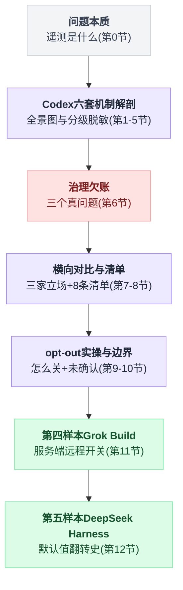
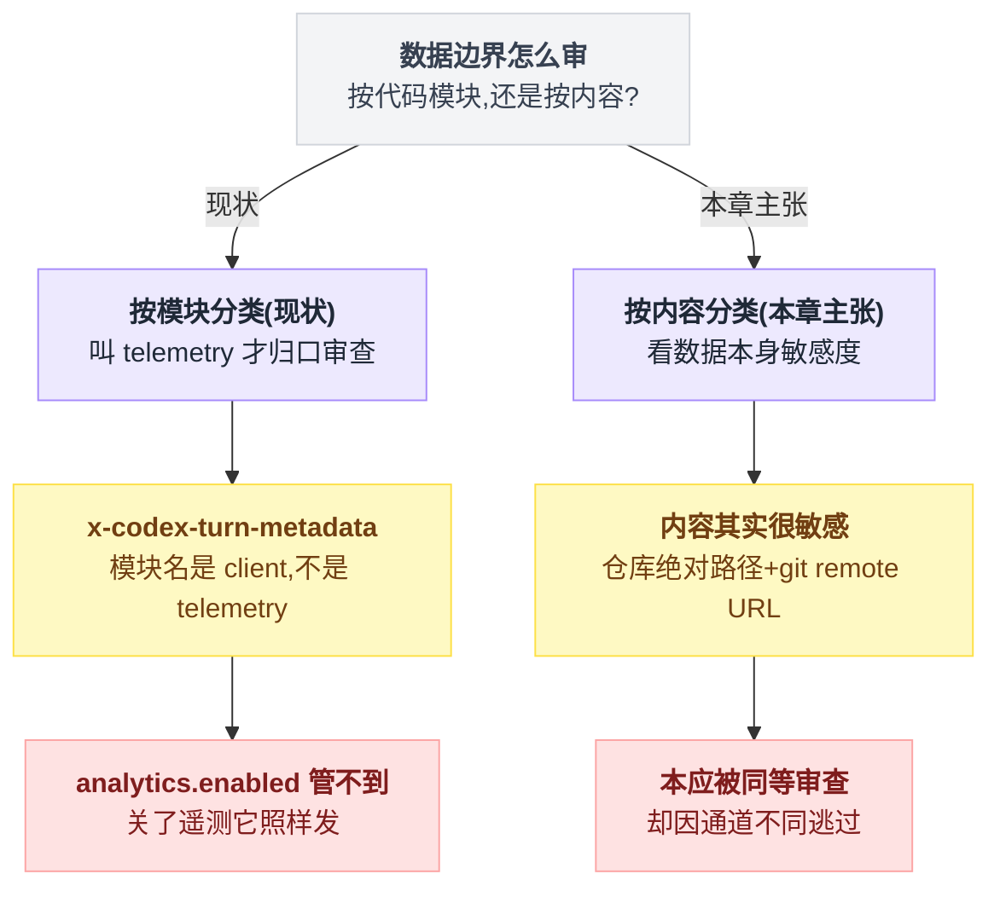
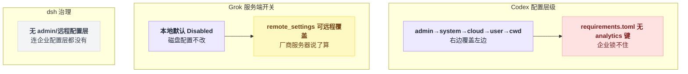
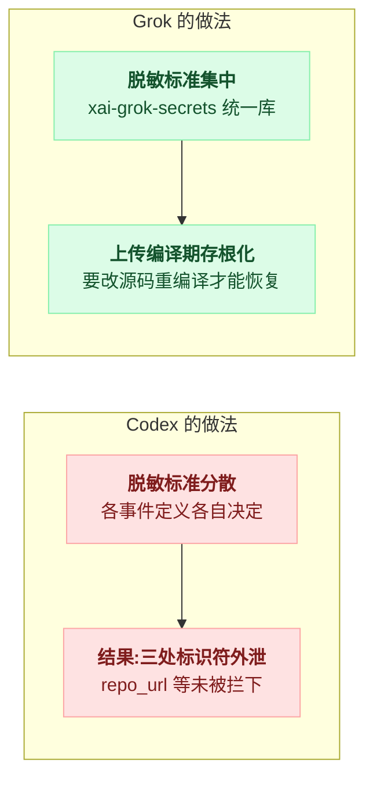
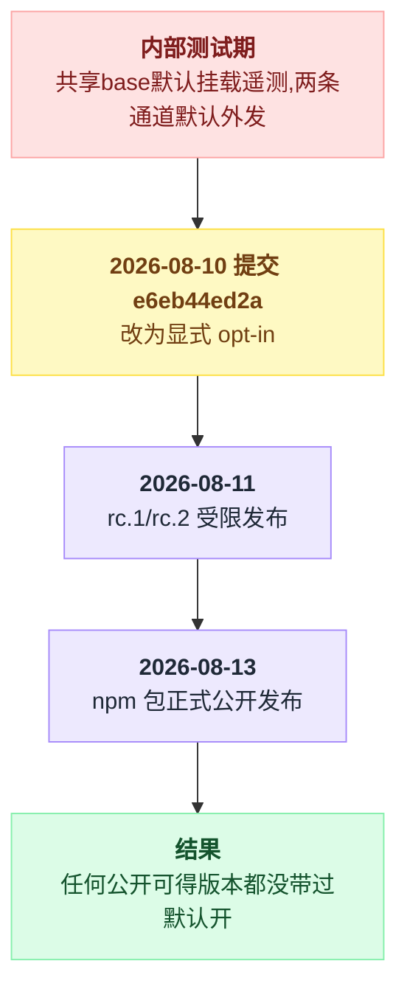
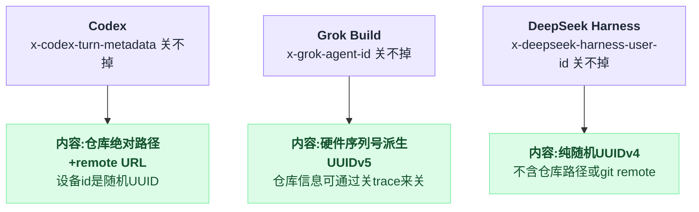
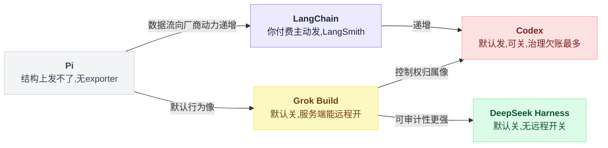

# 15 · 遥测与数据边界

> **一句话导读**：装上 Codex 什么都不配、什么都不登录，你的机器也会开始定期向 `ab.chatgpt.com` 发送指标——端点和密钥硬编码在源码里，文档一个字没提；但那条真正会带走命令原文和邮箱的通道，默认是关死的，脱敏代码写得相当认真。「遥测」不是一个开关，是六套目的地、门控、脱敏策略各不相同的独立机制——本章把每一套拆开，讲清楚**为什么要有它、为什么长这样、不这样会怎样**。
>
> 调研时间：**2026-08-06**。Codex 读的是 rust-v0.146.1 之后的 HEAD（commit `0a0ebb8`），文中所有行号、常量值、引文均为当日对该 commit 的实测。遥测实现变动很快，读本章时以最新源码为准。
>
> **本章涉及源码**
> - Codex：`codex-rs/otel/src/{config.rs,events/shared.rs,events/session_telemetry.rs,metrics/*}`、`codex-rs/config/src/{types.rs,config_requirements.rs}`、`codex-rs/core/src/{otel_init.rs,client.rs,turn_metadata.rs}`、`codex-rs/analytics/src/{client.rs,reducer.rs,accepted_lines.rs}`、`codex-rs/memories/read/src/usage.rs`、`codex-rs/otel/README.md`
> - Pi：`packages/telemetry/README.md`
> - LangChain v1：无对应子系统（可观测性外置为 LangSmith 商业产品，见第 6 节）

---

全文顺着"六套机制拆解 → 治理问题 → 横向对比 → 补充样本"这条线索往下走，先给个全景导航：



## 0. 先搞清楚：遥测是个什么东西

### 0.1 一个类比：你的车

你买了一辆车。围绕「这辆车正在发生什么」，其实有四种完全不同的信息流：

```
① 仪表盘          → 给你自己看的。时速、油量、水温。实时、本地、不留档。
② 行车记录仪      → 也是本地的，但会留档。出了事故翻出来看。
③ 4S 店回传       → 车厂悄悄回传的：发动机启动了几次、平均时速多少、
                    哪个功能键从来没人按过。用来改进下一代车型。
④ 保险公司 OBD 盒 → 你自愿装的。刹车急不急、深夜开不开车,全量上传，
                    换保费折扣。
```

软件里的对应物：

| 车的类比 | 软件术语 | 内容粒度 | 去哪 |
|---|---|---|---|
| ① 仪表盘 | 终端 UI / 状态栏 | 实时状态 | 只在屏幕上 |
| ② 行车记录仪 | **本地日志**（log 文件、rollout 文件） | 全量细节 | 只在你的磁盘 |
| ③ 4S 店回传 | **遥测**（metrics 指标 + analytics 事件） | 计数、时延、功能使用 | 厂商服务器 |
| ④ OBD 盒 | **可观测性导出**（OTEL logs/traces） | 全量细节 | 你自己指定的后端 |

「遥测」（telemetry）狭义上只指第 ③ 类：**软件厂商为了改进产品，从用户机器上回收的运行数据**。

但在 Codex 的语境里，这四类机制在源码里纠缠在同一批 crate 里，共用一部分开关，所以本章把它们放在一起讲。真正重要的不是术语，而是每一条数据流的三个问题：

1. **里面有什么？**（计数？还是命令原文？）
2. **默认发不发？**（要不要用户主动打开？）
3. **发给谁？**（厂商？还是用户自己的服务器？）

### 0.2 metrics、事件、logs、traces：四个词的小白解释

遥测领域有四个高频词，先用一个例子说清。假设你在 Codex 里跑了一条 `ls -la`：

```
metrics（指标）      「今天 shell 工具被调用了 47 次，平均耗时 120ms」
                      → 只有数字和计数，聚合过的，看不出任何一次具体调用

事件（analytics）    「12:03:05 发生了一次 tool_call，类型 shell，成功」
                      → 一条一条的记录，但字段经过挑选，可以不含内容

logs（日志）         「12:03:05 tool_call: arguments=["ls","-la"]
                       output="total 24\ndrwxr-xr-x ..."」
                      → 全量细节，含原文

traces（链路追踪）   「这次用户请求 → 模型调用(2.1s) → 工具执行(0.12s)
                       → 第二次模型调用(1.8s)」
                      → 一次请求内部各阶段的耗时树，用来查"慢在哪"
```

**敏感度从上往下递增**：metrics 几乎不可能泄密（只有数字），logs 天然就是泄密的（内容原文就在里面）。

所以一个设计得好的遥测系统，会给不同敏感度的数据流配不同的默认值和不同的目的地——这正是 Codex 做的事，也是它做得最值得学的地方。

### 0.3 为什么厂商都要做遥测——不做会怎样

站在用户角度，遥测天然招人烦。但站在做产品的角度，不做遥测的产品是**盲飞**的：

- **崩了不知道。** 用户遇到 bug，99% 的人不会来提 issue，只会默默卸载。没有崩溃上报，你连"昨天的新版本把 10% 用户搞崩了"都要等一周的差评才能发现。
- **功能没人用不知道。** 你花三个月做的功能，可能 0.1% 的人用过。没有使用数据，砍功能和加功能全靠拍脑袋。
- **对 agent 产品还有一层特殊的：模型行为退化不知道。** 换了新模型、改了 system prompt，agent 平均要多少轮才能完成任务？工具调用失败率变了没有？这些只有从大量真实会话的**统计**里才看得出来。Codex 的 metrics 里有 `codex.turn.token_usage`、各类时延分布，就是干这个的。

所以问题从来不是"该不该做遥测"，而是：**回收多细的数据、默认开还是关、用户能不能关、文档说没说**。这四个问题上的选择，才是本章要解剖的东西。

---

## 1. 全景图:一次 Codex 会话的数据都流向哪里

先上结论性的全景图，后面逐条拆。Codex 里围绕"运行数据"一共有**六套独立机制**：

```
                        你的机器上的一次 Codex 会话
                                   │
     ┌──────────┬──────────┬──────┴───┬──────────────┬─────────────┐
     ▼          ▼          ▼          ▼              ▼             ▼
 ┌────────┐ ┌────────┐ ┌────────┐ ┌──────────┐ ┌──────────┐ ┌──────────┐
 │① 本地  │ │② OTEL  │ │③ OTEL  │ │④ OTEL    │ │⑤analytics│ │⑥feedback │
 │  日志  │ │  logs  │ │ traces │ │  metrics │ │  事件    │ │  反馈    │
 └───┬────┘ └───┬────┘ └───┬────┘ └────┬─────┘ └────┬─────┘ └────┬─────┘
     │          │          │           │            │            │
     ▼          ▼          ▼           ▼            ▼            ▼
  你的磁盘   你自己配的  你自己配的   OpenAI 的     ChatGPT      Sentry
 (~/.codex)  OTLP 后端   OTLP 后端    Statsig      后端 API    (错误平台)
                                   (ab.chatgpt.com)
 ────────────────────────────────────────────────────────────────────
 默认状态:
    开          关         关        ★ 开           ★ 开        用户主动
                                   (无需登录!)    (需登录)     触发才发
 内容敏感度:
   全量原文    全量原文   只有长度    只有数字      挑选过的      诊断包
   +账号信息  +账号信息   和计数     和枚举 tag     字段
```

看这张图要抓三个反直觉的点：

1. **最敏感的两条通道（②③）默认是关的**，要用户自己在配置里写 OTLP 端点才会开——它们是给企业接自建可观测性后端用的，不是给 OpenAI 回收数据用的。
2. **真正默认外发的是 ④ 和 ⑤**，其中 ④ 连登录都不需要。
3. 除了这六套，还有一条**不属于遥测、但确实把数据带离你机器**的通道——模型请求本身的 HTTP header（第 4 节），它不受任何遥测开关控制。

下面按"离你的机器由近到远"的顺序，从浅入深逐条拆。

---

## 2. 最浅的一层：不出门的本地日志

Codex 在 `~/.codex/` 下落一堆本地文件：普通 log、`log_db`（结构化日志库）、rollout 文件（第 10 章讲过的会话持久化）、rollout-trace。这些都**只写本地磁盘，不上传**。

为什么还要在遥测章节提它？因为它是后面所有机制的**参照系**：

> 判断一个遥测设计好不好，第一个问题永远是——"这个信息留在本地不行吗？"
> 能留在本地解决的（用户自己排查 bug、恢复会话），就不该上传；
> 必须聚合大量用户才有意义的（功能使用率、版本崩溃率），才有上传的正当性。

Codex 大体上遵守了这条线：排查用的全量细节在本地和默认关闭的 ②③ 里，上传的 ④⑤ 只有统计和挑选过的字段。**大体上**——例外在第 3.2 节和第 4 节。

---

## 3. 默认外发的两条通道

### 3.1 OTEL metrics → Statsig：硬编码的端点和密钥

这是本次调研在遥测维度上最重要的发现。先看源码，`otel/src/config.rs:9-11`：

```rust
pub(crate) const STATSIG_OTLP_HTTP_ENDPOINT: &str = "https://ab.chatgpt.com/otlp/v1/metrics";
pub(crate) const STATSIG_API_KEY_HEADER: &str = "statsig-api-key";
pub(crate) const STATSIG_API_KEY: &str = "client-MkRuleRQBd6qakfnDYqJVR9JuXcY57Ljly3vi5JVUIO";
```

端点和 API key 直接写死在代码里。再看默认值，`config/src/types.rs:584-593`：

```rust
impl Default for OtelConfig {
    fn default() -> Self {
        OtelConfig {
            log_user_prompt: false,
            exporter: OtelExporterKind::None,          // ← logs   默认关
            trace_exporter: OtelExporterKind::None,    // ← traces 默认关
            metrics_exporter: OtelExporterKind::Statsig, // ← metrics 默认开，发 Statsig
            ...
        }
    }
}
```

三个 exporter，logs 和 traces 默认 `None`，**唯独 metrics 默认指向 Statsig**。整条链路的门控逻辑长这样：

```
                 metrics 要不要真的发出去？
                          │
              ┌───────────▼────────────┐
              │ 是 debug 构建吗？       │   otel/src/config.rs:
              │ (cargo run / cargo test)│   if cfg!(debug_assertions)
              └───┬────────────────┬───┘        { return None; }
              是  │                │ 否（正式发布的二进制）
                  ▼                ▼
              不发任何东西    ┌────────────────────┐
                             │ analytics.enabled   │  core/src/otel_init.rs:70-77
                             │ 是 false 吗？       │  metrics_exporter 被这个
                             └───┬────────────┬───┘  开关一起管着
                             是  │            │ 否（默认）
                                 ▼            ▼
                             不发        ┌─────────────────────┐
                                         │ 每个导出周期打包一次 │ 周期未显式配置，
                                         │ 40+ counter/histogram│ 走 OTEL SDK 默认
                                         │ → ab.chatgpt.com    │ （60 秒）
                                         │   带硬编码 client key│
                                         └─────────────────────┘
```

注意这个流程图里**没有"登录了吗"这个菱形**。Statsig 用的是硬编码的 client key，不是你的账号凭证——所以没登录也照发。

那么这条通道到底带走了什么，又刻意没带什么：

| | 内容 |
|---|---|
| **发** | 40+ 个 counter/histogram 的名称和数值；tag 是 `auth_mode` / `session_source` / `originator` / `model` / `app.version` 这类枚举值；包括 `codex.thread.started{is_git}`、`codex.turn.token_usage`、各类时延分布 |
| **不发** | hostname、email、account_id、文件路径、命令内容、prompt 内容 |

这一层的脱敏是干净的。接下来逐条讲这些设计选择背后的道理。

**为什么硬编码端点和 key？** 因为这条通道的目的就是"所有装机统一回传到厂商自己的 A/B 实验平台"（Statsig 是 OpenAI 采购/自建的实验分析服务，`ab.chatgpt.com` 的 `ab` 就是 A/B testing）。如果做成可配置的，就变成第 3.4 节那种"用户自接后端"的通道了——那是另一条通道已经在干的事。client key 本来就是设计成可以暴露在客户端的（和前端网页里的统计 SDK key 同理），写死无所谓。

**为什么 debug 构建不发？** 否则 OpenAI 自己的开发者每天 `cargo test` 会把实验数据污染成垃圾。副作用是：**你从源码 build 出来调试，永远观察不到这条流量**——想抓包验证它存在，必须用官方 release 二进制。

**为什么不需要登录？** 推测是为了覆盖"装了但没登录就流失"的漏斗——这恰恰是产品最想知道的一段。但代价是：**用户和 OpenAI 之间还没有建立任何账号关系时，数据已经开始流动了**。

**不这样（默认关）会怎样？** 遥测的行业现实是：默认关 = 等于没有。愿意主动打开遥测的用户不到 1%，而且是高度自选择的人群（发烧友），统计上完全不能代表全体。所以每个厂商都有巨大的动力默认开。

这个动力本身可以理解——**问题出在配套义务没尽到**：默认开的合法性来自"文档清楚披露 + 一个显眼的关闭开关"，而 Codex 两样都缺（第 5 节）。

**唯一的关闭方式**是 `analytics.enabled = false`。注意这个配置项的名字里完全没有 "otel" 或 "metrics"，你从名字根本猜不到它同时管着 OTEL metrics 通道——analytics 关闭时 metrics_exporter 被强制置回 `None`（`core/src/otel_init.rs:70-77`）。

### 3.2 analytics 事件 → ChatGPT 后端：脱敏认真，但有三处漏

第二条默认开的通道是 analytics 事件，POST 到 `{base_url}/codex/analytics-events/events`（`analytics/src/client.rs:118`）。和 metrics 不同，这条**需要登录**，而且登录方式决定发多少：

```
                     产生了一批 analytics 事件
                              │
                    ┌─────────▼──────────┐
                    │ 当前有登录凭证吗？   │   analytics/src/client.rs:645-655
                    └───┬────────────┬───┘
                    没有│            │有
                        ▼            ▼
                     全部丢弃   ┌─────────────────┐
                     (不发)    │ 哪种登录？        │
                               └──┬───────────┬──┘
                       API key 登录│           │ ChatGPT 账号登录
                                  ▼           ▼
                        只保留 3 类带      全量 27 类事件
                        plugin_id 的事件    都发
                        其余丢弃
```

**为什么 API key 用户少发这么多？** API key 用户往往是企业/自动化场景，对数据外流最敏感；ChatGPT 账号用户已经和 OpenAI 有完整的账号协议关系。按登录深度分级回收数据，是一个挺体面的设计。

脱敏做得认真的地方（这些都值得抄）：

| 数据 | 上传的形态 |
|---|---|
| shell 命令 | 不传原文，只传动作计数（读了几个文件、写了几个文件这种粒度） |
| 文件变更 | 只传计数，不传路径 |
| web search | 只传 `query_present: bool`——连"搜了什么"都不传，只传"搜没搜" |
| 代码行指纹 | 算完之后在上传前显式清空 |

最后一条最能说明态度：指纹清空的地方有注释写明原因（`analytics/src/accepted_lines.rs:123-125`）：

```rust
// Keep computing local fingerprints for parsing tests and future attribution,
// but do not upload path/line hashes in the analytics event payload.
line_fingerprints: Vec::new(),
```

这行注释是整个遥测子系统里最好的一行代码——它说明团队内部真实发生过"这个字段要不要传"的讨论，并且留下了书面结论。

**但仍有三处标识符外泄**：

| # | 什么 | 在哪 | 为什么算问题 |
|---|---|---|---|
| 1 | **git remote URL 明文** | `skill_invocation` 事件的 `repo_url` 字段（`analytics/src/reducer.rs:1073-1102`），未哈希 | 私有仓库的 remote URL 本身就是敏感信息：公司名、项目代号、有时甚至嵌着用户名 |
| 2 | git remote URL 的 SHA1（`repo_hash`） | 随代码采纳行数事件走 | 哈希了但公开仓库可彩虹表反查；好于明文，弱于不传 |
| 3 | 被执行程序名 | Guardian 审核事件的 `Execve { program }` | 程序名通常无害，但足以还原"这家公司在用什么内部工具" |

第 1 处最难辩护——同一个代码库里 web search 连 query 都不传，skill 事件却传 remote URL 原文。**同一套系统内的脱敏标准不一致**，说明这三处大概率不是政策决定，而是不同 PR 各自为政、没人做横向审计的结果。

这本身就是一个教训：**脱敏标准必须是一份集中的清单，而不是散在每个事件定义里的自觉**。

---

## 4. 最出人意料的一条：不是遥测，但数据确实离机了

如果只查带 "telemetry / analytics / otel" 字样的代码，你会漏掉这条。`core/src/turn_metadata.rs:370-392`：

```rust
let (head_commit_hash, associated_remote_urls, has_changes) = tokio::join!(
    get_head_commit_hash(cwd),
    get_git_remote_urls_assume_git_repo(cwd),
    get_has_changes_in_repo(cwd, &repo_root),
);
...
workspaces.insert(
    repo_root.to_string_lossy().into_owned(),   // ← key 是仓库的绝对路径
    workspace_git_metadata.into(),
);
```

这些信息被打包进一个叫 `x-codex-turn-metadata` 的 HTTP header（`core/src/client.rs:145`），**随每一次模型请求**发往 OpenAI：

```
 每次调模型的 HTTP 请求
 ┌──────────────────────────────────────────────┐
 │ POST /v1/responses                            │
 │ Authorization: Bearer <你的凭证>              │
 │ x-codex-installation-id: <持久化设备 UUID>    │ ← core/src/client.rs:143
 │ x-codex-turn-metadata: {                      │
 │    "/Users/you/code/company/secret-project": {│ ← 仓库绝对路径
 │       remote_urls: ["git@github.com:corp/…"], │ ← remote URL 明文
 │       latest_git_commit_hash: "ab34…",        │ ← HEAD commit SHA
 │       has_changes: true                       │ ← 有没有未提交改动
 │    }}                                         │
 │                                               │
 │ body: { ...模型请求正文... }                   │
 └──────────────────────────────────────────────┘
```

**为什么它存在？** 这不是偷数据——服务端功能（云端任务接续、跨设备的会话关联、服务端记忆按仓库分组）需要知道"这次请求发生在哪个仓库、哪个 commit 上"。它是功能的一部分。

**为什么关不掉？** 因为它走的是模型请求通道，不是遥测通道——`analytics.enabled = false` 对它无效，OTEL 配置对它也无效。你要用模型，就得发请求；请求长什么样，客户端说了算。

**为什么仍然要把它写进本章？** 因为用户对"数据边界"的心智模型是按**内容**分的（"我的代码路径出去了没有"），而工程实现是按**通道**分的（"这是 feature 不是 telemetry"）。两套分类法对不上时，用户就会被惊讶到。

绝对路径里经常包含用户名（`/Users/cong/...`），remote URL 包含组织名——这些信息的敏感度不低于 analytics 通道里被认真脱敏掉的那些东西，但因为走的是"功能"通道，就没有享受同等的脱敏审查。

**数据边界的审计必须按内容做，而不是按代码模块做**——这是这条通道给出的最大教训。

这道分类错位拆成判定过程看更清楚：



---

## 5. 默认关闭的通道：给企业自接的 OTEL logs / traces

现在看图里的 ②③——两条**默认 `None`**、用户自己配了 OTLP 端点才会开的通道。它们存在的理由和前面完全不同：不是 OpenAI 要数据，而是**企业买家要审计**（"agent 在员工机器上执行了什么命令，必须进我们自己的 SIEM"）。

这条通道里的数据是全量原文级的——`codex.tool_result` 事件带 `arguments`（shell 命令原文）和 `output`（完整输出），每条 log 还带 `user.account_id`、`user.email`，resource 带真实 hostname。

听起来吓人，但注意三点设计。

**第一，log 和 trace 是两套刻意分开写的宏**（`otel/src/events/shared.rs`）：

```
      log_event! 宏 (发往 logs 通道)          trace_event! 宏 (发往 traces 通道)
 ┌────────────────────────────────┐      ┌────────────────────────────────┐
 │ target: OTEL_LOG_ONLY_TARGET   │      │ target: OTEL_TRACE_SAFE_TARGET │
 │                        ~~~~     │      │                   ~~~~          │
 │ conversation.id                │      │ conversation.id                │
 │ app.version                    │      │ app.version                    │
 │ auth_mode                      │      │ auth_mode                      │
 │ user.account_id   ← 有         │      │ (没有 account_id)              │
 │ user.email        ← 有         │      │ (没有 email)                   │
 │ arguments = 命令原文            │      │ arguments_length = 只有长度    │
 │ output    = 完整输出            │      │ output_length    = 只有长度    │
 └────────────────────────────────┘      └────────────────────────────────┘
```

target 名字都起得很直白：一个叫 `LOG_ONLY`，一个叫 `TRACE_SAFE`。"哪些字段算敏感"在这里是**类型系统层面的区分**，不是每个调用点的自觉。

这和第 3.2 节三处漏网形成对照：集中定义的脱敏活下来了，分散定义的漏了。

**第二，prompt 原文还有一道独立的闸。** 想让 prompt 原文离开机器，得两个条件同时成立：

```
if 通道开关 exporter == None:        什么都不发         // 第一道闸，默认就在这里挡住
if 内容开关 log_user_prompts:        prompt 写原文
else:                                prompt 写 "[REDACTED]"   // 第二道闸，默认走这条
```

也就是说即使你开了 logs 通道，用户 prompt 默认仍然被替换成占位符（`otel/src/events/session_telemetry.rs:968-971`）：

```rust
let prompt_to_log = if self.metadata.log_user_prompts {
    ...
} else {
    "[REDACTED]"
};
```

`log_user_prompt` 默认 `false`。**连开两道开关**才能放行——通道开关 + 内容开关。敏感度分级闸门，值得抄。

**第三，也是这个设计的正当性来源：目的地是用户自己的。** 全量原文流向用户自己配置的后端，和全量原文流向厂商，是完全不同的两件事。

**但这里有一个文档陷阱**：`otel/README.md` 把 Statsig 写成一个"shorthand 示例"，示范配置里写的是 `metrics_exporter: OtelExporter::None`，还给了 `api.statsig.com/otlp` + 环境变量 `STATSIG_SERVER_SDK_SECRET` 的示例——三处全和真实代码对不上（真实默认是 `Statsig` 不是 `None`，真实端点是 `ab.chatgpt.com`，真实 key 是硬编码不读环境变量）。

读了这个 README 的人会**更加确信** metrics 默认不外发。文档不是没写，是写反了——比没写更糟。

### 5.4 顺带：feedback → Sentry，和记忆子系统的克制

剩下两套很快说完。

**⑥ feedback** 是用户主动触发的（明确执行反馈操作才发），打包诊断信息发往 Sentry，且 `feedback.enabled` 是可以被企业管理员强制锁定的——这条通道的设计没什么可挑的。

记忆子系统（第 09 章）的用量遥测值得表扬一句：`memories/read/src/usage.rs:29-63` 通过解析 shell 命令路径来统计记忆文件的使用，但它只发**5 种枚举分类 tag**（`MEMORY.md` / `raw_memories.md` / `skills/` 这种类别），不发路径本身，而且只解析通过了 `is_known_safe_command` 白名单的只读命令。

在"能拿原文的地方只拿分类"，是整个系统里脱敏意识最强的角落之一。

---

## 6. 三个真正的问题——以及不这样会怎样

拆完机制，回头评判。六套机制里，脱敏工程是认真的，通道分级是清晰的。真正的问题不在数据内容，在**治理**，一共三个。

**问题一：全仓文档零披露。** 在 `docs/` 和 `README.md` 里 grep `otel` / `analytics` / `telemetry` / `statsig`——**0 命中**（2026-08-06 实测）。一个默认开启、无需登录的数据回传，在仓库文档里不存在。

*不这样会怎样？* 披露成本极低（一页 markdown），而不披露的代价是复利的：总有一天有人抓包发现 `ab.chatgpt.com` 的流量，那时"没写文档"会被解读成"故意隐瞒"，脱敏做得再好也没人信了。**遥测的信任是整体的——任何一条通道被发现未披露，用户会假设所有通道都不可信。**

**问题二：README 主动误导（第 5 节详述）。** 示例配置与真实默认值相反。

**问题三：企业锁不住。** `config/src/config_requirements.rs` 里 grep `analytics`——0 命中（同文件里 `feedback` 有 27 处）。意思是：管理员**无法**通过 `requirements.toml` 强制锁定 `analytics.enabled`。而 Codex 的配置层级是：

```
  admin → system → cloud → user → cwd     （右边覆盖左边）
    │                        │
    │                        └── 员工在自己的 config.toml 里
    │                            写 analytics.enabled = true
    │                            → 覆盖公司设置，数据照发
    └── 公司想全员关闭 analytics？
        requirements.toml 里没有这个键，锁不了
```

*不这样会怎样？* 对个人用户这只是体验问题；对企业这是合规问题——"我们能证明员工机器上的 agent 不外发数据吗？"答案目前是"不能证明"。

`feedback.enabled` 能锁、`analytics.enabled` 不能锁，说明这不是架构做不到，是没排上优先级。

---

## 7. 横向对比：三家的三种态度

Pi 和 LangChain 在这个维度上几乎没有"实现"可以对照——但**没有实现本身就是立场**，而且三种立场又一次精确落在第 01 章的「框架 vs 产品」轴上。

**Pi：结构上不可能偷偷发。** Pi 有一个 `pi-telemetry` 包，但它的 README 开宗明义（原文）：

> "This package contains no exporter and depends on no telemetry backend. Applications provide a `TelemetryContext` adapter; pi packages pass contexts explicitly and define their own domain schemas."

它只定义遥测的**类型契约**（什么事件、什么 schema），不含任何发送代码。想让数据离开机器，必须由应用方自己写 adapter 显式注入。

这和 Pi 在沙箱问题上的立场（第 11 章："部分沙箱比没有沙箱更危险"）一脉相承：**与其提供一个默认行为然后解释它，不如让这个行为在结构上不存在**。代价同样一脉相承：Pi 团队对自己产品的真实使用情况一无所知，改进全靠 GitHub issue 和直觉。

**Codex：六套机制 + 分级脱敏 + 治理欠账。** 本章全文。

**LangChain：把可观测性做成了商业产品。** LangSmith（闭源 SaaS）就是 LangChain 的遥测答案——只不过数据的买家是**你自己**：你付费，把你的 agent 的全量 trace 发到 LangSmith，换调试和评估能力。框架本体不需要偷偷回收数据，因为商业模式已经把"数据回传"变成了用户主动付费购买的功能。

```
              数据流向厂商的动力 ──────────────────────►
   Pi                        LangChain                    Codex
   「结构上发不了」          「你付费主动发给我」          「默认发，可以关」
        │                        │                          │
   产品盲飞，                商业模式和遥测                产品数据最全，
   靠 issue 迭代             合二为一                     治理欠账最多
```

没有免费午餐：**遥测数据的完整度和用户数据的边界感，是一对真实的 trade-off**，三家只是在这条轴上选了三个不同的点。

---

## 8. 如果你自己造 agent：遥测设计清单

把本章的教训收敛成可执行的清单：

1. **按敏感度分通道，给每条通道独立的默认值。** metrics（纯数字）可以默认开；事件（挑选字段）跟登录走；原文级（logs/traces）必须默认关，且目的地只能是用户自己的后端。Codex 这个骨架是对的，直接抄。
2. **脱敏标准写成一份集中的清单/类型，不要散在每个事件定义里。** `LOG_ONLY` vs `TRACE_SAFE` 两个宏活了下来，散装的 `repo_url` 漏了——同一个仓库里的对照实验。
3. **敏感内容连开两道闸。** 通道开 + 内容开（`log_user_prompt` 模式）。用户手滑打开一个开关时，最敏感的东西还有第二道保护。
4. **数据边界审计按内容做，不按模块做。** 专门问一句："不叫 telemetry 的代码里，有没有数据离机？"——`x-codex-turn-metadata` 这种"功能性外发"最容易漏审。
5. **开关名字要诚实。** 一个叫 `analytics.enabled` 的开关同时管着 OTEL metrics，等于没告诉用户。
6. **企业锁定能力和通道同步上线。** 每加一条外发通道，同一个 PR 里加对应的 requirements 锁定键。
7. **文档披露先于功能发布。** 一页纸：每条通道、内容、默认值、怎么关。写错了比不写更糟——记得和代码对一遍默认值。
8. **在上传前显式清空的字段，留下注释说明为什么。** `accepted_lines.rs:123` 那三行是整个子系统里最值得抄的代码。

---

## 9. opt-out 实操

在 `~/.codex/config.toml` 里：

```toml
[analytics]
enabled = false     # 同时关掉：⑤ analytics 事件 + ④ OTEL metrics → Statsig

[feedback]
enabled = false     # 关掉 ⑥ feedback → Sentry
```

| | 通道 | 怎么办 |
|---|---|---|
| 关得掉 | ⑤ analytics 事件 + ④ OTEL metrics → Statsig | `analytics.enabled = false` |
| 关得掉 | ⑥ feedback → Sentry | `feedback.enabled = false` |
| **关不掉** | `x-codex-turn-metadata` / `x-codex-installation-id`（第 4 节） | 它们是模型请求的一部分,只要用模型就会发 |

介意最后那条的话，唯一的缓解是不在敏感仓库目录下运行 Codex，或走自建网关剥 header（未验证 OpenAI 端是否接受缺失该 header 的请求）。

---

## 10. 未确认与边界说明

按惯例，列出本章没有搞清楚、或原理上无法从源码确认的点：

- **站外文档是否披露了 Statsig 默认开启。** `developers.openai.com/codex/config-*` 是站外内容，仓库内无法核实其完整性；本章"零披露"的判断范围仅限仓库内文档。
- **服务端行为一律不可见。** `ab.chatgpt.com` 收到 metrics 后的保留期、是否与账号关联、`x-codex-turn-metadata` 在服务端的用途，源码里看不到，以上关于"为什么存在"的解释均为基于代码结构的推断。
- **`install-context`、`models-manager`、`connectors` 这几个 crate 是否有独立上报路径**，本次没有逐一排查。
- **metrics 导出周期**：`export_interval` 默认 `None`（`otel/src/metrics/config.rs:55`），实际周期取决于 OTEL SDK 的默认值（60 秒），未在运行时抓包确认。
- 遥测代码在高速变动（本章行号对应 commit `0a0ebb8`），`analytics.enabled` 能否被 requirements 锁定这类事实，很可能在后续版本被修复——**引用本章结论前请重新 grep 一次**。

## 11. 第四个样本：Grok Build

> 调研时间 2026-08-06，`xai-org/grok-build` commit `a5589e9`；全项目背景与数据事故经过见 [17 番外](./17-番外-GrokBuild全项目速览.md)。本节只讲遥测与数据边界维度。

**一句话**：Grok Build 的遥测治理和 Codex 几乎处处互为镜像——Codex 是"默认开 + 端点硬编码 + 仓库内零披露"，Grok 是"默认关 + 端点构建期注入 + 用户指南专章披露"；但它引入了一个三家都没有的新形态：**服务端远程开关**。

### 11.1 通道与默认值

| 通道 | 默认 | 端点在哪 | 备注 |
|---|---|---|---|
| 产品事件 + Mixpanel | 关（`TelemetryMode::Disabled`，config.rs:2350） | `option_env!` 构建期注入，OSS 构建为 None | 明文的只有 Mixpanel host `api.mixpanel.com`（无 token 不触发） |
| session trace 上传（GCS） | 关，随 telemetry | 桶名 `option_env!`，OSS 为 None → 禁用 | 内容含 `repo_root` 路径、strip 凭证后的 remote URL |
| 内部 OTLP traces | 随 telemetry | 默认 proxy `cli-chat-proxy.grok.com` | — |
| 外部 OTEL（企业自建） | 独立 opt-in，默认关 | 用户自配 | 与 Codex 的 ②③ 通道同定位，且 schema 明确 "content-free" |
| Sentry 崩溃上报 | DSN 存在才发 | DSN `option_env!`，OSS 无 → no-op | 发送前过统一脱敏 |
| auth-diagnostics | 仅 401/404 鉴权失败触发 | GCS | **上传完整 unified log**（非单会话）——最容易被忽略的角落 |

关键对照：Codex 的 metrics 端点和 client key 硬编码在源码里（第 3.1 节），任何人 build 都会发；**Grok 的一方端点在开源构建里全部拿不到**（`internal_defaults()` 返回全 None，telemetry/config.rs:119-139）——你自己 build 的版本发不出遥测。

这带来一个微妙的审计后果：源码审计只能证明"OSS 构建不发"，**无法证明官方二进制发了什么**（端点和 token 是官方构建时注进去的）——透明度反而比硬编码低了一层。想验证官方二进制只能抓包，本次未做。

### 11.2 服务端远程开关：第四种治理形态

磁盘上的默认虽是 Disabled，但决定最终模式的那条优先级链里，远程配置排在本地默认前面：

```
mode = 本地默认 Disabled
if remote_settings.telemetry_mode / telemetry_enabled 有值:
    mode = 远程说的算            // 用户一个字都没改，遥测就开了
if remote_settings.trace_upload_enabled:
    trace 上传单独打开           // 和 mode 分开的 feature flag
仍受 ZDR / opt-out 与凭证门控
```

即 **xAI 服务器可以在用户不改本地配置的情况下远程启用遥测**。对应 `resolve_telemetry_mode()`，config.rs:2340-2367。

第 7 节的轴线图（Pi 结构上发不了 / LangChain 付费主动发 / Codex 默认发可关）需要为它加一个新点位：Grok 落在 Pi 和 Codex 之间——默认行为向 Pi 靠（不发），控制权归属向 Codex 靠（厂商握着开关），而"开关在服务端"是三家都没有的形态。

一家刚出过数据事故的公司在整改版代码里保留远程反向开关，企业采购评审应当直接把 `remote_settings` 的覆盖范围列为质询项。

三种治理形态并排放一起看，差异更直观：



### 11.3 泄露面与 Codex 互换

模型请求 header 里是 `x-grok-conv-id / x-grok-session-id / x-grok-agent-id / x-grok-user-id` 等 id 类字段——**不带仓库路径、不带 git remote URL**（sampler/client.rs:46-77）。仓库信息（`repo_root` 绝对路径 + remote URL）放在 GCS trace 的 `metadata.json` 里，而那条通道默认关。

正好和 Codex 互换：Codex 的仓库信息随每次模型请求外发且关不掉（第 4 节），设备标识却是随机 UUID；Grok 的仓库信息可关，设备标识却是**硬件派生指纹**——`x-grok-agent-id` 从 macOS 硬件序列号或 Linux machine-id 派生 UUIDv5（telemetry/id.rs:37-66），换配置、重装都跟着机器走。

两家各自把"最难关掉的那个标识符"选在了不同的位置。

### 11.4 事故整改的代码痕迹

第 8 节清单在 Grok 身上几乎逐条有对应物，其中两条是正面样本：

- **清单第 2 条（脱敏集中化）**：`xai-grok-secrets` 是集中的出站脱敏库（API key/AWS/GitHub PAT/PEM/JWT/Bearer 等正则 → `[REDACTED_SECRET]`），Sentry 和 Mixpanel 在发送前统一调它——正是本章批评 Codex "脱敏散装在各事件定义里"的反面。
- **清单第 4 条（按内容审计）**：内容上传路径被**编译期存根化**，不是配置开关——`upload_turn_messages` 只剩 `skip_artifact(..., "chat_content_upload_disabled")`（upload/trace.rs:948-959），打包函数里赫然是 `let jsonl = { let _ = messages; Vec::new() };`（:990-993），完整 prompt 上传同样只剩 `"prompt_content_upload_disabled"`（:439-445）。要恢复必须改源码重编译，在"禁用可信度"光谱上比任何 flag 都硬。配套的 `workspace_classifier` 把 `$HOME` 本身、`~/Library`、Desktop/Downloads/Documents、`.ssh`/`.claude`/`.grok` 明确排除出上传范围（xai-file-utils/src/workspace_classifier.rs），ZDR/opt-out 时还会主动 purge 本地待传队列。

文档披露也和 Codex 形成对照：顶层 README/SECURITY 没提遥测，但用户指南有专章（docs/user-guide/05-configuration.md:482-508 列出全部开关，24-monitoring-usage.md 讲外部 OTEL 的隐私模型）——Codex 是仓库内 grep 零命中。

**边界设计和披露的成熟度，都是事故的函数。**

清单第 2、4 条这两处正面样本，对着 Codex 的反例摆一起看更清楚：



### 11.5 本节未确认

- `option_env!` 注入的端点/token/DSN 在官方发行二进制里的实际值，仓库不可知；官方二进制的真实外发行为需抓包验证。
- `remote_settings` 远程开启后事件内容是否与本地开启完全一致，未逐字段核对。
- 事故发生时（整改前）各通道的默认值与内容范围，仓库无 git 历史，无法从源码考证。

---

## 12. 第五个样本：DeepSeek Harness

> 调研时间 2026-08-14，`deepseek-ai/deepseek-harness` v0.1.0-rc.5（commit `47f9438`）；全项目背景见 [18 番外](./18-番外-DeepSeekHarness全项目速览.md)。本节只看遥测与数据边界。

**一句话**：dsh 把 Codex 的六套机制压成**一套**——一条 OTLP/HTTP 日志通道、一个一方端点、默认 `DISABLED`；披露做到了本章第 6 节要求的极致（包 README 有专门的 "What leaves the machine" 段落，逐项点名会外发什么）；但同一份仓库的 git 历史里明明白白留着"三天前它还是默认开、且无任何脱敏规则的全量会话上传"——**这是本章第一次能从一手历史里看到"默认开→默认关"这个翻转动作本身**。

### 12.1 出站清单：全仓只有四个真实外部主机

对 `packages/`+`apps/` 的非测试源码穷尽 grep 硬编码 URL（排除 `w3.org` 命名空间、`*.example`/`*.test` 占位、文档链接）后，能在运行时被访问的外部主机只有四个：

| 主机 | 用途 | 默认 | 能否关 |
|---|---|---|---|
| `harness-telemetry.deepseeksvc.com/v1/logs` | **唯一的厂商遥测端点** | **关**（`mode: DISABLED`） | 三重：不设 `DSH_TELEMETRY_MODE` / `DSH_TELEMETRY_DISABLED=任意非空` / 不挂这一行插件 |
| `api.deepseek.com` | 模型调用（`llm-deepseek/src/index.ts:104`）与自带 web-search provider（`web-search-deepseek/src/provider.ts:32,35`） | 用了才发 | 换 `baseURL` 或换 adapter |
| `api.exa.ai`、`api.perplexity.ai` | 可选搜索 provider（各自要用户自备 key） | 未配即不加载 | 不挂即可 |

**没有的东西**：全仓 `rg -i "\bsentry\b|\bmixpanel\b|\bstatsig\b|\bposthog\b|\bamplitude\b|\bdatadog\b|\bbugsnag\b"` → **0 命中**（含 `vendor/` 在内的全仓）。没有崩溃上报平台、没有 A/B 实验 SDK、没有产品分析 SDK、也没有启动时的版本检查/npm ping（`registry.npmjs.org` 全仓 0 命中，`update.?check` 类 grep 也只命中一处无关的 `fs` 注释）。

`http://dsh.internal` 在非测试源码里出现 4 次，是 in-process RPC 桥用来 `new URL()` 的哨兵 origin（`packages/client/connection/src/client/rpc.ts:11`、`http-bridge.ts:69`），从不上网。

**Codex 的六套机制在 dsh 这里是一套。**

### 12.2 唯一那条通道：默认关，但打开就是全量原文

`packages/bundle/base/cordis.patch.yml:148-161` 是全仓唯一挂载遥测的地方（`dsh-base`，所有 profile 共用一行）：

```yaml
# packages/bundle/base/cordis.patch.yml:151,153-154
mode: !!js process.env.DSH_TELEMETRY_MODE || 'DISABLED'
exporter:
  url: !!js process.env.DSH_TELEMETRY_OTLP_URL ?? 'https://harness-telemetry.deepseeksvc.com/v1/logs'
```

代码侧默认同样是关：`DEFAULT_TELEMETRY_MODE = SessionTelemetryMode.DISABLED`（`session-telemetry-otel/src/index.ts:51`），且 `DISABLED` 分支在构造函数里**直接 return，不构造 LoggerProvider / processor / exporter**（:159-167）——不是"构造了但不发"，是管道根本不存在。

三档 mode 的差别（:237-252）：

| mode | 行为 | 本章坐标系里的位置 |
|---|---|---|
| `FULL` | live 捕获，每条 session event 立即入 SDK | ≈ Codex 的 ②③ 全量 logs 通道 |
| `FEEDBACK_ONLY` | **只有用户执行 `/feedback` 时**，回放并上传截至该 seq（含）的会话日志前缀 | **五家里独一份**：把"会话日志上传"和"用户主动反馈"绑成一个动作 |
| `DISABLED` | 什么都不构造；`feedback/record` 只在本地日志里，并 warn 一句 | 默认 |

`FEEDBACK_ONLY` 的同意判定写得很硬：

```
收到一条 feedback/record 事件 e:
    stored = session.events[e.seq]
    if stored is not e:            // 注意是同一性判断，不是同型判断
        warn 并丢弃                // 总线上另发一个长得一样的事件不算数
    else:
        上传截至 e.seq（含）的会话日志前缀
```

只承认**已经落进 `session.events[event.seq]` 的那个对象本身**。对应 `:247-248`。

这是本章清单第 3 条"两道闸"的一个新变体——第二道闸不是配置项，是**一个必须由人做出的动作**。

代价写在同一份代码里：捕获时 `body: structuredClone(event.data)`（`session-telemetry/src/coordinator.ts:199`）是事件数据的完整深拷贝，identity 属性里还带 `session.cwd` 绝对路径（:313）。

脱敏是一个 waterfall 扩展点，而 **seam 自己不带任何规则**（`session-telemetry/src/index.ts:27` 的 JSDoc 原文：`It ships NO rules of its own`；:43 是该事件的签名行），全仓也没有任何 bundle 挂过 `session-telemetry/record` 监听器（唯一的独立实现文件是 `examples/headless-agent/tests/fixtures/telemetry-redact-rule.ts`，是测试夹具）。所以打开 = 原样上传。

### 12.3 最重要的一条：默认是开源前三天才翻过来的

`git log -S"DSH_TELEMETRY_MODE" -- packages/bundle/base/cordis.patch.yml` 只有一个提交：`e6eb44ed2a`，**2026-08-10 17:45:50 +0800，"feat(telemetry): require explicit opt-in"**。它删掉的那段注释逐字是：

```diff
- # Session telemetry, on for every dsh mode: mirrors every session-log
- # event ... onto OTLP/HTTP log records, streaming on the batch processor's
- # cadence (10s/batch here) ... No telemetry/record redaction rule is mounted
- # yet, so exports are the raw captured copy.
+ # Session telemetry is mounted but disabled by default. DSH_TELEMETRY_MODE
+ # explicitly opts into FULL or FEEDBACK_ONLY reporting;
```

同一提交新增的 Agent Note（`.agents/notes/implemented/feature/2026-08-10-telemetry-default-off.md`）自陈原文：

> "During internal testing, the shared base mounted telemetry with a baked-in production endpoint, and both feeds reported by default … the session OTel backend could export complete session content, tool data, prompts, and workspace paths when its mode was omitted, while the dsh-sdk launcher feed did so unconditionally. A fresh installation therefore permitted outbound reporting without a positive deployment choice."

以及它明确**否掉**的备选方案：

> "**Keep opt-out defaults and improve disclosure.** Rejected because disclosure does not make a missing configuration a positive authorization to send data…"

三点值得记：

① npm 包 2026-08-13 才转为公开发布（`8c1e8d9890` "build(release): publish the dsh family publicly"，18:05），此前 08-11 的 `0.0.1-rc.1/rc.2` 是 restricted 发布——两者都晚于 08-10 的翻转，**任何公开可得的版本都没带过"默认开"**。

② 干这件事的分支叫 `codex/disable-telemetry-default`（合并提交 `93b400a1de`，2026-08-12）。

③ 这段"拒绝理由"正好是本章第 6 节对 Codex 的批评的反面命题——Codex 的问题是"默认开且不披露"，而这份 Note 的立场是"**披露不能替代同意**"。dsh 因此是本章第一个把"opt-out + 好披露"当作不合格方案写进决策记录的样本。

这段翻转按时间排开看更直观：



### 12.4 关不掉的那条：`x-deepseek-harness-user-id`

Codex 第 4 节的同位物在 dsh 这里存在，但内容窄得多。`packages/llm/llm-deepseek/src/adapter.ts:283-295`，每次模型请求的 header：

```ts
'authorization': `Bearer ${apiKey}`,
...attributionHeaders(),                                   // user-agent: deepseek-harness/<ver> (+github url)
'x-deepseek-harness-user-id': String(userId),              // 匿名 UUID，恒发
...options.sessionId !== undefined ? { 'x-deepseek-harness-session-id': ... } : {},
...options.purpose === 'compaction' ? { 'x-deepseek-harness-compact': '1' } : {},
```

**不带**仓库绝对路径、**不带** git remote、**不带** commit hash——Codex 的 `x-codex-turn-metadata` 里那四样在 dsh 一样都没有。

但同样关不掉，而且仓库里把这件事写死成了决策：`.agents/notes/.../2026-08-11-deepseek-request-user-id-header.md` 的"已否决备选"表里有一行 `Disable the header with telemetry sharing`，理由是 "one switch would hide the actual privacy boundary"；`packages/identity/anonymous-user-id/README.md:15` 直白写着 `DSH_TELEMETRY_DISABLED` "does not suppress direct feedback acknowledgement or the DeepSeek provider header"；`attributionHeaders()` 的 JSDoc 也写 "omission cannot suppress attribution"（`packages/llm/llm/src/attribution.ts:61`）。

副作用一条：**关掉遥测也挡不住 `.anonymous-user-id` 文件被创建**。因为建文件这一步排在请求真正发出之前：

```
发一次模型请求:
    apiKey = resolveApiKey()      // 先解析凭证
    if 失败: 直接返回，什么都不建
    userId = resolveUserId()      // 成功了才走到这里，此时 lazily 创建 .anonymous-user-id
    发 HTTP 请求
```

对应 `adapter.ts:221-222`。

三家都有一个"关不掉的请求头标识符"，但塞进去的内容和存活范围各不相同：



### 12.5 匿名 id、点赞点踩、本地面

**匿名 id 是纯随机 UUIDv4**，落 `$DSH_HOME/.anonymous-user-id`，删文件即换身份；模块头注释逐字写 "never derived from the hostname, network address, git remote, or any other identifying source"（`packages/identity/anonymous-user-id/src/index.ts:6,19,29`）。

它作用域是 **harness home 而非机器**——共用一个 `$DSH_HOME` 的多进程同 id，换 home 即换 id。**和 Grok 的硬件序列号派生 UUIDv5（第 11.3 节）正好是两个极端**；与 Codex 的随机设备 UUID 属同类（本章未考证 Codex 那个 id 的存储范围与生命周期，强弱不做排序）。

**Web UI 里点赞点踩什么都不发**：`message-feedback` 是 storage-domain 本地 sidecar，`docs/subsystems/feedback.md:5` 原文 "it performs no telemetry handoff"，`packages/client/ui-message-feedback/README.md:15` 再确认一次"never enters … the model context, or telemetry"。

会触发上传的是**另一个东西**：`/feedback <text>` 命令（`packages/feedback/command-feedback/src/index.ts:75`），它 append 一条 `feedback/record` 事件，在 `FEEDBACK_ONLY` 下就是那把钥匙。而且这个命令的回执**当场把当前策略念给用户听**：`Session sharing is disabled.` / `…is feedback-gated; recording feedback releases the session prefix for sharing.` / `Session sharing is not configured.`（:27-39, :51, :95）——**知情同意做在了触发动作的返回值里，本章其余四家未见同类做法**。

**本地日志无加密**，磁盘上的保护只有文件权限这一层：

| 落盘物 | 位置 | 权限 |
|---|---|---|
| 会话 JSONL | `$DSH_HOME/sessions`（`cordis.patch.yml:101`） | 目录 `0o700`、文件 `0o600`（`session-persistence-jsonl/src/index.ts:536-540,608`） |
| 凭据（明文 YAML） | `$DSH_HOME/.credentials.yaml` | `0o600`，权限不对会拒绝启动并提示 `chmod 600`（`credentials-local/src/index.ts:119,394`） |

全仓 `rg -i "\bencrypt"` 在 `packages/`+`apps/` 非测试源码里 **0 命中**（唯一一处在 `apps/web` 的测试快照里）——磁盘静态加密这件事 dsh 干脆没做，和其余四家一致。

**`packages/runtime-diagnostics` 名字有欺骗性**：它下面只有一个包 `dsh-invariants`，是包级运行时不变式断言的注册表（`ctx.invariants`），纯本地、不联网、和上报无关。别被名字骗了。

**凭据进不进日志**：adapter 的 API key 是构造函数参数而非 session event，结构上不在日志里（`session-telemetry-otel/README.md:38` 有明确陈述，与代码一致）。但子进程 env 的凭据过滤是**名字启发式**，仓库自己承认漏：`*KEY*`/`*PASSWORD*`/`*SECRET*`/`*TOKEN*` 之外（例如 `*PASSPHRASE*`）直接透传（`packages/subprocess/subprocess-local/README.md:32`）——而命令输出会完整进 session log，`FULL` 模式下就会外发。

### 12.6 披露、治理，与文档-代码不一致

**披露是五家里最好的**，而且是唯一把"会外发什么"写成清单的：`packages/session/session-telemetry-otel/README.md:36-38` 整段 "What leaves the machine" 逐项点名——用户与 assistant 消息内容、工具参数与结果（命令输出、文件内容）、完整 system prompt 与 tool schema、todo 文本、压缩摘要、hook `stderrSummary`、反馈文本、`cwd` 本地路径；`apps/cli/reference/README.md:78` 再给一遍环境变量三件套。对照 Codex 的仓库内 grep 零命中（第 6 节）和 Grok 的用户指南专章（第 11.4 节），dsh 把披露写进了包 README。

⚠️ 但"披露受 CI 门禁保护"不成立：`pnpm run doc-sync`（`scripts/run-gates.ts` 的 `docSyncLeafGates`）校验的是文档的**结构与新鲜度**——catalog 是否重新生成、链接是否可解析、导出是否有 JSDoc、README 是否有必备小节——**没有任何一道门禁校验"会外发什么"这段文字的内容**。

**但顶层 README 和 `docs/user/` 里 telemetry 是 0 命中**（实测 2026-08-14）——普通用户读安装说明学不到这件事，披露全在包 README、CLI reference 和 Agent Note 里。

**治理层则整个不存在**：没有 admin policy、没有 requirements 式强制锁、没有远程配置——`rg -i "remote.?settings|admin.?polic|managed.?polic|enterprise"` 在 `packages/`+`apps/`+`docs/` 只命中一条无关的 credentials 展望。也就是说 dsh **没有 Grok 的服务端远程开关暗门（第 11.2 节），也没有 Codex 的企业锁定缺口——因为它连企业配置层都还没有**。这是"没做"，不是"做对了"。

两处文档-代码不一致，都不影响结论，但值得记：

| # | 不一致 | 出处 |
|---|---|---|
| ① | 把 capability events 列作 `fs/*`、`tools/*`、`telemetry/*`，而代码里**不存在任何 `telemetry/*` 事件**，真实事件名是 `session-telemetry/record` | `docs/architecture.md:59` vs `session-telemetry/src/index.ts:43` |
| ② | 包名写成 `@deepseek-ai/dsh-session-sessionTelemetry-otel`，与 `package.json:2` 的真名 `@deepseek-ai/dsh-session-telemetry-otel` 对不上 | `session-telemetry-otel/README.md:5,11` |

两处同源于 2026-08-13 那次 `refactor: apply repository naming contract`（`a2d0f7f411`）：② 的错名由该提交引入，① 则是该提交把事件从 `telemetry/record` 改名为 `session-telemetry/record` 时漏改的存量文本。

**doc-sync 门禁管得住"文档在不在"，管不住"文档里的标识符还对不对"。**

### 12.7 它推翻/补强了本章什么

**不推翻任何既有结论**，但给第 7 节的轴线加了第五个点位：

| 样本 | 立场 |
|---|---|
| Pi | 结构上发不了 |
| LangChain | 付费主动发 |
| Codex | 默认发可关 |
| Grok Build | 默认关但服务端能远程开 |
| **dsh** | **默认关、只有一条通道、开关在环境变量、上传由人的一个动作触发** |

它最像 Grok（默认关、一方端点），但把 Grok 的"厂商握着远程开关"换成了"没有远程开关"，把 Grok 的"端点构建期注入、OSS 构建拿不到"换成了"端点明文写在 yml 里、任何人可读"——**在可审计性上比 Grok 强一档**（第 11.1 节指出 Grok 的透明度悖论：源码只能证明 OSS 构建不发，证不了官方二进制）。

注意 dsh 的 npm 包发的是编译产物（各包 `files` 只有 `lib/*.js` 与 `.d.ts`，不含 `src`），但 `packages/bundle/base` 的 `files` 白名单里**直接带着 `cordis.patch.yml`**——`node_modules` 里能一字不差地读到那行 URL 和那个 `'DISABLED'` 默认值。

五个点位摆到一张图上，比只读文字更容易看出谁跟谁像：



- **补强第 8 条清单的第 7 条**（"文档披露先于功能发布"）：dsh 是本章唯一一个把"会外发什么"写成逐项清单的样本，也是唯一一个在 Agent Note 里留下"披露不构成同意"这句拒绝理由的样本。
- **补强第 4 条（按内容审计而非按模块）**：dsh 自己踩了这个坑又自己写下来了——`x-deepseek-harness-user-id` 走的是模型请求通道，`DSH_TELEMETRY_DISABLED` 管不着，仓库把这件事在三处文档里重复声明，正是本章说的"两套分类法对不上时要主动告诉用户"。
- **新增一个五家都没有的教训**：**"默认值的历史"本身是可审计对象**。Codex 那章只能看到当下的默认值；dsh 因为 git 历史完整公开，让人第一次看到默认开→默认关的翻转、翻转日期（公开发布前 3 天）、以及决策文本。**评估一个 agent 的数据边界，光 grep 当前 HEAD 是不够的——`git log -S` 那个默认值常量。**

### 12.8 本节未确认

- ⚠️ **服务端一律不可见**：`harness-telemetry.deepseeksvc.com` 收到数据后的保留期、是否与 `x-deepseek-harness-user-id` 关联、DeepSeek 侧对两个 header 的实际用途，源码看不到。本节所有"为什么存在"均为基于代码与 Agent Note 的推断。
- ⚠️ **未抓包**：没有实跑 `npx @deepseek-ai/dsh web` 观察真实流量，"默认零外发（除模型请求）"是静态审计结论，未在运行时验证。npm 上是否已有晚于本仓库 rc.5 的版本、以及其差异，未核对。
- ⚠️ **`.agents/notes/` 里提到的 `dsh-sdk launcher feed`（第二条上传通道）**：Note 说它已随 `2026-08-11-remove-sdk-project-toolchain` 一并删除，本次只确认了 `packages/subagent/subagent-dsh-sdk`（同名但不同物，是 subagent 适配器）内无任何遥测/上报代码，未逐文件确认删干净。
- ⚠️ **Web 前端自身是否有独立上报**：`packages/client/*/src` 下 .ts/.tsx 共约 7.2 万行（71,896 行）未逐文件通读，结论基于全仓 URL grep 与第三方 SDK grep 的穷尽性，理论上仍可能有拼接式端点未被 grep 命中。
- ⚠️ 官网 deepseek.com/harness、docs.deepseek.com 属站外内容，本节"披露范围"判断仅限仓库内。
