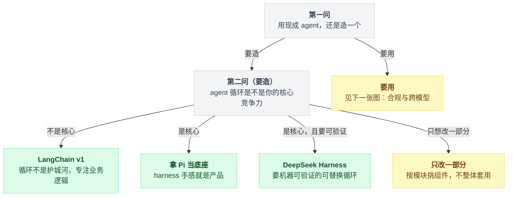
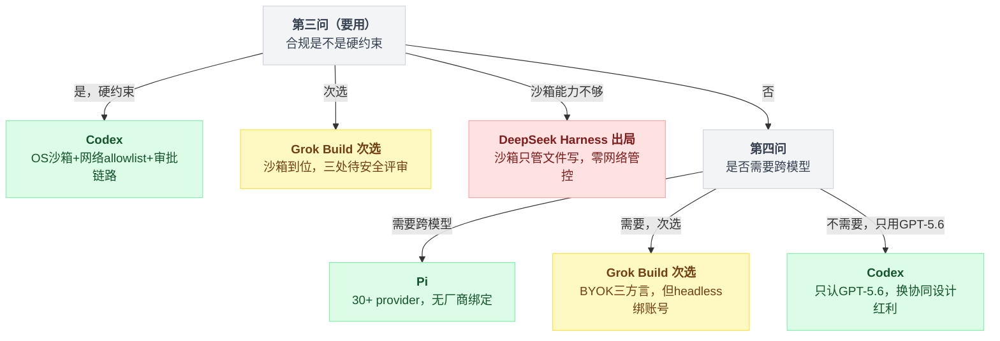
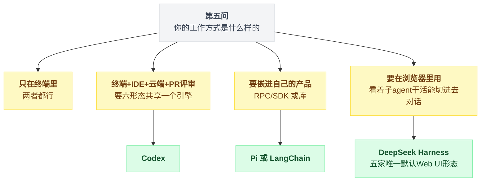
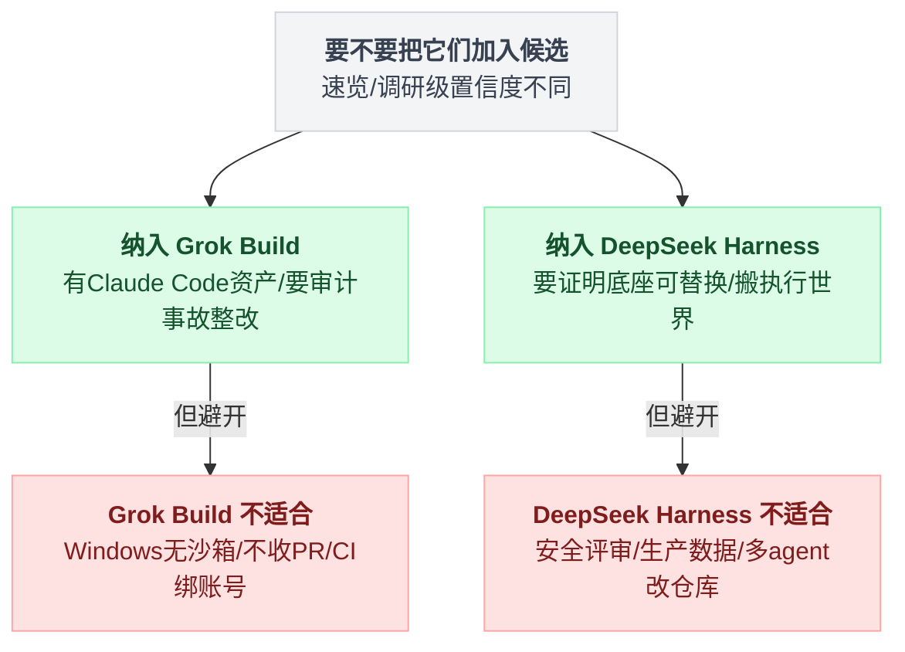
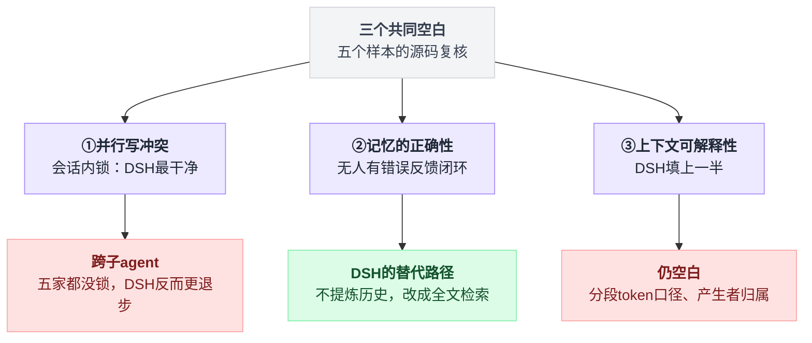
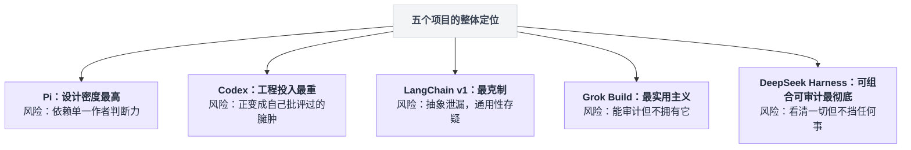

# 16 · 横向总表与选型指南

> **一句话导读**：把第 01–15 章的结论压成可查的表，再给出一套判断"你该用哪个 / 该抄哪一部分"的方法。

本章不引入新的源码分析。三个主样本的断言出处见对应章节，Grok Build 列的出处见第 17 章，DeepSeek Harness 列的出处见 01–15 章各章末小节与第 18 章。

后两列是并入的，**置信度不一样，读表时请分开对待**：

| 列 | 并入自 | 调研方式 | 读表时注意 |
|---|---|---|---|
| 第四列 Grok Build | [第 17 章番外](./17-番外-GrokBuild全项目速览.md) | 一次全项目**速览**，未做逐维度调研 | 置信度低于第五列 |
| 第五列 DeepSeek Harness | [第 18 章番外](./18-番外-DeepSeekHarness全项目速览.md) | **逐维度整章调研**：01–15 章各章末都有「第五个样本」小节；18 番外做过 15 路并行读源码 + 973 处 file:line 与英文引文的对抗式核验 | 置信度高于第四列，但仍全部来自**静态阅读**，且是 developer preview 的**单日快照** |

两列拿不准的格子一律标"未确认"。

---

## 1. 五句话概括

**Pi**：把 agent harness 拆成可替换的零件，赌"前沿模型已经足够强，harness 应该薄到你能整个握在手里"。做减法是它的产品策略，不是能力不足。

**Codex**：一个 Rust 引擎撑起六种产品形态，赌"harness 和模型是一体的，协同设计才能榨出全部能力"。它开源的是运行时，不是能力。

**LangChain v1**：不提供 agent，提供**造 agent 的语法**。`create_agent()` 是一个编译器，把中间件编译成 LangGraph 状态图。它对默认行为刻意沉默，因为默认行为是用户的事。

**Grok Build**：把竞品的文件约定（CLAUDE.md、hooks.json、skills、.mcp.json）实现成事实标准，赌"生态不用自建，兼容就是分发"。它开源的是审计权，不是控制权——不收外部 PR，prompt 在二进制里混淆，遥测端点构建期注入。

**DeepSeek Harness**：把 harness 本身当产品发布——不是"自用 coding agent 顺手开源"，而是"这是一个可组合的 agent 运行时，你在上面造你自己的东西"。它赌的是"agent loop 不该是任何人的核心资产"：循环是启动配置树里的一行 YAML，219 个包里对循环实现有运行期依赖的只有 1 个，而且这条纪律在 `peerDependencies` 图上机器可查。

它开源的是**可审计性**——端点明文写在 npm 包会带上的 yml 里、prompt 不混淆、git 历史完整到能看见默认值翻转的那一次提交、事故复盘公开、连被否掉的方案都留档。但它不替你挡任何东西：插件零信任门，沙箱只管文件写。

---

## 2. 全维度对照表

### 2.1 基础事实

| | Pi | Codex | LangChain v1 | Grok Build | DeepSeek Harness |
|---|---|---|---|---|---|
| 版本 | v0.83.0 | rust-v0.146.1 | 1.3.14 | HEAD `a5589e9`（2026-08-05 同步） | v0.1.0-rc.5，commit `47f9438`（2026-08-14 同步） |
| 语言 | TypeScript | Rust | Python | Rust | TypeScript |
| 模块规模 | 11 个 npm 包 | 130 个 Cargo crate | 3 层 + 17 partner 包 | 81 个 Cargo crate（155 万行含测试） | **219 个 npm 包**（src 22.8 万行 / 测试 26.8 万行 / 包 README 268 篇） |
| 许可证 | MIT | Apache-2.0 | MIT | Apache-2.0（**不收外部 PR**） | MIT（**不收外部 PR**，但 CONTRIBUTING 明写官方包不比社区包重要） |
| 定位 | 成品 CLI（内件全可换） | 一引擎六形态 | 框架 | 成品 CLI/TUI（一引擎四形态） | 可组合 agent 运行时（**默认形态是 Web UI**，循环本身是插件） |
| 商业模式 | 无（未发现付费层） | ChatGPT 订阅 | 云平台（LangSmith/LangGraph Platform） | grok.com 账号/订阅（headless 强制登录）+ BYOK | 无（未发现付费层；自备 DeepSeek API key 或 BYOK） |
| 构建 | npm workspaces + Bun 二进制 | Cargo + Bazel 双轨 | hatchling | Cargo（monorepo 只读镜像 + DotSlash hermetic 工具链） | pnpm workspaces + `tsc -b` + tsdown（host/client 两个**互斥** TS program）+ vendored cordis 9 包 |

### 2.2 Agent 循环（→ [02](./02-Agent循环.md)）

| | Pi | Codex | LangChain v1 | Grok Build | DeepSeek Harness |
|---|---|---|---|---|---|
| 范式 | 手写双层 while | 手写三层嵌套 | **编译成 LangGraph 状态图** | 手写三层嵌套 + `tokio::select!` 命令 actor | 手写三层嵌套，**循环体只有 192 行**（循环本身是配置树里一行 YAML） |
| 层次 | 内层 turn / 外层 follow-up | Task → Turn → sampling 重试壳 → 流循环 | Pregel superstep（BSP） | SessionActor → prompt 外层轮 → 采样内层轮 | turn → step → request 重试壳（step = 一次模型请求 + 它调的工具） |
| 退出条件 | 队列空 + 模型不再调工具 | `input_queue` 无 pending | 条件边闭包 `_make_model_to_tools_edge` | 无 tool call，且过 TodoGate / 插话排水 / stop gate 三道闸 | 无 tool call，且 `agent/turn-stopping` 之后**重读一次 inbox** 仍为空（**数据决定，不是钩子返回值决定**） |
| 用户 steer | steer 队列每轮查 | `input_queue`，模型跑时可插话 | 靠 interrupt/resume | 插话排队（同 turn 循环边界排干）+ `send_now` 硬中断，双通道并存 | durable inbox 两队列（`followup`/`steer`/`inject` 三个别名），step 边界 claim；**排队中的插话跨重启存活** |
| 重试位置 | **不在循环里**（摘掉失败消息后 `agent.continue()`） | `responses_retry.rs`，降级传输后重置重试预算 | 中间件（`model_retry` / `tool_retry`） | sampler `retry.rs`（最多 14 次约 5.5 分钟） | 循环内 L2 壳，但**决定权外包**给 `agent/request-error` waterfall（协议只有一个 bit）；默认 2 次，计数落 session log |
| 工具与流的交织 | 流结束后执行 | **`FuturesOrdered` 让工具在模型流未结束时就开始跑** | 图节点边界，天然串行 | 回合末 `FuturesUnordered` 全并发、完成序回灌（流中派发未确认） | 流结束后执行；prepare 严格串行按模型序 → dispatch 滚动池（默认 10）→ 提交按模型序 |
| 迭代上限 | 无硬上限 | 压缩后 `continue` 无上限 | `recursion_limit`（默认被设成 9999 绕开抽象泄漏） | `--max-turns`（默认无限）+ **stationarity 防转圈**（8 次 nudge / 16 次硬停） | 核心循环**零上限**；只有 goal 线 `maxGoalRounds`(256) 与 ralph 工具线 `maxRounds`(256，preset 64)。防转圈只提醒（3/5/8 次注入 nudge），**明确 never veto** |

### 2.3 上下文与压缩（→ [03](./03-上下文策略.md) / [04](./04-压缩与长会话.md)）

| | Pi | Codex | LangChain v1 | Grok Build | DeepSeek Harness |
|---|---|---|---|---|---|
| system prompt 规模 | 约 2300–2450 字符（≈600 token） | 11114–21544 字符，**7 个模型 7 份** | **0**（用户提供） | 4,638 字节单模板（**二进制内 XOR 混淆**）；concise 版仅两句话 | 常规 3.3–3.8 KB，Code Mode 28–45 KB（实测 golden snapshot）；**per-model 分化为零**，harness 自带只有一句话 |
| 默认工具数 | **4**（read/write/edit/bash） | 十几个；Code Mode 下收敛为 `exec`/`wait` | 0（用户提供） | 约 30；另内置 codex/opencode **方言工具集** | 约 25（生成的工具目录里有 51 个名字，出厂 profile 只装其中一部分） |
| 项目上下文文件 | AGENTS.md + CLAUDE.md，走到文件系统根，无字节上限，注入 system prompt | AGENTS.md，停在 `.git`，32 KiB 预算按字节硬切，以 **user 角色**注入 | 无 | **无 GROK.md**；认 CLAUDE.md/AGENTS.md 全家桶 + `.claude`/`.cursor` rules，全文 verbatim 以 user 消息注入 | **无 DSH.md**；AGENTS.md/CLAUDE.md + `.local.md` 覆盖层 + `$DSH_HOME/AGENTS.md`；停在 `.git`；64 KiB 预算**先丢最宽泛的**并把砍了什么报给模型；SHA-1 去重；随 `read`/`write`/`edit` 热更新 |
| 工具输出截断 | 保头保尾不切半行 + 可操作提示（`Use offset=2001 to continue`） | 挖中间，`…N tokens truncated…` | shell 默认仅 100 行 | bash 保头尾掐中间 + **全量落盘给路径**；通用 40KB | `read` 2000 行 / 50KB（数值同 Pi）+ **与工具无关的通用 spill 层**（超 50000 字节全文落盘、回灌头尾预览 + locator） |
| 压缩默认开启 | ✅ | ✅（窗口 90%） | ❌ **默认不带压缩** | ✅（85%） | ✅（`thresholdRatio 0.8`、`retainRatio 0.16`，两者互校验） |
| 压缩触发 | `contextTokens > window - 16384` | turn 前 + turn 中内联 + `/compact` | 中间件阈值 | 85% 阈值 + **prefire（阈值−10% 后台预压缩）** + `/compact` + 超长错误恢复 | 80% 阈值 + `/compact`（**不接受任何参数**，且要求 agent 空闲）+ `agent/request-error` 上的 overflow 恢复 |
| 切点冲突处理 | **向新方向挪** | 保留近 20k 原始 user 消息 + 一条摘要 | **向旧方向回溯**到配对 AIMessage | **语义锚点：最后一条真实 user 消息**（非 token 预算） | **向旧方向回溯**到 tool-call **括号计数平衡**处；压缩区间的头恒等于 surface 头（"幸存消息从未被摘要覆盖"的坑结构上不存在） |
| 摘要格式 | 固定模板（Goal/Progress/Next Steps + `<read-files>` 跨压缩累积） | `SUMMARIZATION_PROMPT` | 可配 | 9 节结构化 prompt + 活动状态（后台任务/TODO/子 agent）reminder 重建 | 8 节固定模板（"空的写 (none)，一节都不许少"）+ 三道机械防线（含图片直接拒、`max-tokens` 视为失败、**摘要 token 必须严格小于被遮蔽内容否则作废**） |
| 服务端压缩 | ❌ | ✅ `compact_remote_v2.rs` | ❌ | ❌ | ❌（但 `summarize()` 是唯一钩子——远端摘要在 dsh 里是一个子类，不是一条分支） |
| 跳过摘要直接开新窗口 | ❌ | ✅ `compact_token_budget.rs` | ❌ | ❌（有 verbatim→fitted→lossy 降级梯） | ❌；但有**零 LLM 前置**：`toolResultPruner` 确定性头中尾剪枝，剪完已降到阈值以下就根本不叫模型 |
| prompt cache 处理 | 压缩请求用新 sessionId + `cacheRetention:"none"` | 未确认 | 无处理 | 未确认 | **反向**：摘要请求刻意构造成会话的真前缀（原样铺 system prompt + tools + 区间消息，指令贴在最后）以**复用** provider KV cache |
| 原始数据 | 追加式，不删 | rollout 保留，上下文丢弃 | `RemoveMessage` 原地覆写 state | 可选 Segments 模式把压掉的消息落盘，模型可事后 `read_file` 找回 | append-only，一条不删；压缩是 surface 上的 `replace` 区间替换，被遮蔽节点全部列进新节点的 `sourceEventSeqs` |
| RAG / 向量检索 | ❌ 纯 ripgrep | ❌ 纯 ripgrep（有本地 bm25 crate 用于工具） | ❌ 核心不带（store 支持 embedding） | 代码检索纯 grep；记忆侧 FTS5 + sqlite-vec 混合 | ❌ **全仓零 embedding / 零向量**；会话检索是 SQLite FTS5 字面短语（FTS5 语法当惰性数据） |

### 2.4 工具系统（→ [05](./05-工具系统与执行模型.md)）

| | Pi | Codex | LangChain v1 | Grok Build | DeepSeek Harness |
|---|---|---|---|---|---|
| 定义方式 | `createXTool()` + `XOperations` 接口（可替换 = 远程执行挂载点） | `build_tool_router` 注册表 + handler | `@tool` 从签名+docstring 生成 schema | Rust 类型派生（serde + schemars）；description 是 MiniJinja 模板 | `ctx.tools.register()` + 自有受限 JSON Schema DSL；**UI 渲染意图（`presentCall`/`presentResult`）是工具定义的一等成员**且要求纯函数以便回放 |
| Schema 双视图 | — | — | ✅ 校验用 / 发给模型用分开 | 未确认 | ❌（`parameters` 原样透传且不校验，只校验 `output.schema`）；Code Mode 的 TS/Py SDK 是同一份 store 的第二个投影，不是校验/展示二分 |
| 并行执行 | 串行 preflight → `Promise.all` → 按 source order 持久化 | `RwLock` 当信号量（工具粒度粗锁） | `ToolNode` 并行，**无互斥** | `FuturesUnordered` 全并发，完成序回灌 | 策略串行（按模型序）→ dispatch 滚动池（上限 10，可配 1 即全串行）→ **完成序与提交序解耦**，提交严格按模型序；`isConcurrencySafe` fail-closed 到 exclusive（出厂只有 8 个工具声明并发安全） |
| 文件写冲突 | ✅ `withFileMutationQueue`（`realpath` 为 key，文件粒度） | ❌ 无机制 | ❌ 无机制 | ✅ 参数级 per-path `tokio::Mutex`（同批非只读命中同路径才串行） | ✅ **锁下沉到 fs provider**：per-realpath FIFO 尾 promise + 乐观版本号（read→guard→write 在锁内，版本不符抛 `FS_STALE_VERSION`）；`bash` 里的 `sed -i` 绕过 |
| 内置文件编辑工具 | ✅ | ✅（`apply_patch` 用 Lark grammar 做约束解码） | **❌ 没有** | ✅ `search_replace`（+实验 hashline 锚点编辑、codex `apply_patch` 方言） | ✅ `write` / `edit`（字面串替换 + 版本号）+ `str_replace_editor`；**无 `apply_patch`、无约束解码** |
| 动态工具加载 | `getActiveTools`/`setActiveTools` 有原语，未接 MCP | ✅ `tool_search` + `defer_loading` | `tool_selection` 中间件 | ✅ `search_tool`(BM25) + `use_tool` 二段式（MCP 工具） | ❌ 无 tool search / BM25；有 scope 分层遮蔽 + `restrict()` 交集。另有**模型现场写插件注册新工具**（`cordis_define`/`cordis_run`，不在出厂树） |
| Code Mode | ❌ | ✅ **模型写 TS 在裸 V8 里调工具** | ❌ | ❌；位置被 **Rhai workflow（编排子 agent）** 占据 | ✅ `run_code`（TS，Node worker_thread），三态 `native`/`code`/`both`，**默认 `native`，即 Code Mode 出厂关闭**；sub-call 走完整 guarded 管线且日志可见、模型上下文不可见 |

### 2.5 拦截与扩展（→ [06](./06-中间件与钩子.md) / [07](./07-插件与扩展分发.md)）

| | Pi | Codex | LangChain v1 | Grok Build | DeepSeek Harness |
|---|---|---|---|---|---|
| 拦截范式 | 事件订阅 | 外部进程（hooks.json） | **洋葱包裹** | 外部进程（Command + HTTP webhook），**配置兼容 Claude Code hooks.json** | **洋葱**（cordis waterfall，`(payload, next)`），但 `next()` 无参且游标共享、**二次调用不重入**；外部 shell hook 被降格成"桥" |
| 拦截点数量 | **33 个事件** | 11 个生命周期事件（+1 legacy `notify` 桥） | 6 类中间件钩子 | 15 个事件变体（14 个规范事件） | 56 个 cordis 事件，其中 **13 个是 waterfall 拦截点**（另有 44 种落日志的 session 事件，两套 taxonomy 不可混用） |
| 能否重试/替换一次模型调用 | ❌ | ❌ | ✅ `wrap_model_call(request, handler)` | ❌ | **替换 ✅**（不调 `next()` 自己 yield chunk）；**重试不靠洋葱**——走 `agent/request-error` 投一个 bit + loop 自己 `continue`，重走完整 `agent/request` 链路 |
| 能否否决工具执行 | ✅（`emitToolCall` 异常直接阻断） | ✅（permission_request） | ✅ | ✅ PreToolUse allow/deny（不能改写 input） | ✅ 两层：`tools/pre-execute` waterfall（allow/deny/ask，可重排）+ `ctx.tools.guard()` **单调闸门**（谁都不能把别人的 deny 翻成 allow）；同样**不能改写 input** |
| 能否改 HTTP 层 | ✅ `before_provider_request` / `before_provider_headers` | ❌ | ❌ | ❌ | ❌ **明确禁止**：请求 deep-frozen（改就抛）+ 运行时 invariant 比对，改模型可见内容只能走会落日志的通道 |
| 能否声明自己的 state | ❌ | ❌ | ✅ middleware 可声明 `state_schema`，编译期合并 | ❌ | ✅ 插件用 `declare module` 往 `SessionEventMap` 加事件类型（44 种里 31 种是这么来的），另可在 `session-projection` 注册读模型 |
| 扩展加载方式 | 进程内加载任意 TS（全权限） | 声明式 manifest（skills/MCP/apps/hooks），无进程内代码入口 | 普通 Python import | 声明式 manifest（六类组件；兼容 `.claude-plugin`） | 进程内 import 任意 TS（全权限）；manifest 只有**一个字段** `dsh.bundle.patch` 指向一份 YAML 补丁 |
| 分发 | `pi install npm:@foo/x@1.2.3` / `git:...` | Marketplace + `codex plugin` | PyPI | git 仓库市场（无签名无审核；可选 commit-sha 钉扎） | `dsh plugin add`（158 行的 **pnpm 转发器**，npm/git/tarball/本地路径全由 pnpm 解释）；**无商店**，发现靠 GitHub topic `dsh-plugin` |
| 模型可自己装插件 | ❌ | ✅ `request_plugin_install`（受 30 项白名单约束） | ❌ | 未确认 | **✅ 更进一步**：不提名别人的包，**现场写 JS 并挂载**（`cordis_define`/`cordis_run`）；host 半边零审批，不持久、不跨会话；不在任何出厂 bundle（但出厂"创造模式"preset 挂了它） |
| 信任模型 | Project Trust（7 项资源清单，非交互 fail-closed） | 四级 scope（Repo>User>System>Admin）+ 企业 `allowed_sources` 白名单 | **无**（外包给 PyPI 和 import） | 插件根目录逐个授信；项目级默认阻 hooks/MCP/脚本 | **无**：无项目信任门、无签名、无审核、无企业策略；`node:vm` 沙箱两份 README 自认"不是安全边界，按 bash 权限对待" |
| Skills | ✅ 实现 agentskills.io 标准，**可直接读 `~/.claude/skills`、`~/.codex/skills`** | ✅ 自有 skills crate + 远程 skill | ❌ 无此概念 | ✅ Claude Code 格式**超集**，直接读 `.claude/skills`、`.cursor/skills` 等 | ✅ 六个发现根（`.dsh/skills` / `.agents/skills` / 自定义 / `$DSH_HOME/skills` / `~/.agents/skills` / 可选 `bundledSkillDir`，后者出厂未配即不存在）+ 数字 rank × scope 层二维优先级；**明确不认 `.claude/skills`、`.cursor/skills`** |
| 供应链加固 | ✅ `min-release-age=2`、`--ignore-scripts`、shrinkwrap、SHA256SUMS | `npm pack --ignore-scripts` + 体积/包名校验 | 无特别措施 | 仅可选 `require_sha`，默认关 | **一项都没有**：生成的 profile workspace 里无 `minimumReleaseAge`、无 `allowBuilds`；唯一挡 lifecycle script 的是 pnpm 自己，而提示语还教用户怎么放行（仓库自身的 workspace 反倒是 deny-by-default 白名单） |

### 2.6 MCP（→ [08](./08-MCP与外部工具协议.md)）

| | Pi | Codex | LangChain v1 | Grok Build | DeepSeek Harness |
|---|---|---|---|---|---|
| 态度 | **明确拒绝**（README: "No MCP."） | 全面拥抱 | 中立管道 | 全面拥抱（rmcp 官方 SDK） | 接了，但只当众多工具来源之一：一个 929 行插件，核心 `packages/core/tools` 不知道 MCP 存在 |
| client | ❌（可用扩展自建） | ✅ stdio + HTTP + OAuth | `langchain-mcp-adapters`（独立包，一行转 `BaseTool`） | ✅ stdio + Streamable HTTP + SSE 配置 + OAuth | ✅ stdio + Streamable HTTP（**只有协议规定的两种**）；**无 OAuth**，只有静态 headers |
| server | ❌ | ✅ 实验性 | ❌ | ❌（对外走 ACP；另有 SDK 进程内反向桥） | ❌（对外走 ACP + 自有 SDK JSON-RPC）；且它的 ACP server **拒收客户端下发的 `mcpServers`** |
| 降本机制 | — | 三层：`enabled_tools` 过滤 → 按需启动（1s 宽限 + LRU）→ tool search 开启时整体转 DEFERRED | 通用 middleware | `search_tool` + `use_tool` 二段式延迟加载；输出按 20KB 字节截断 | **一层都没有**（无工具过滤、无按需启动、无 tool search、无字节上限）；靠通用 compaction / spill 兜底。README 把这笔常驻税明写在 "Token effect" 一节——知情不做 |
| 替代方案 | CLI 工具 + README + Skills（progressive disclosure） | — | — | — | — |
| 论据 | Playwright MCP 13.7k token vs README 225 token | — | — | — | — |

### 2.7 记忆（→ [09](./09-记忆.md)）

| | Pi | Codex | LangChain v1 | Grok Build | DeepSeek Harness |
|---|---|---|---|---|---|
| 独立记忆子系统 | **❌ 零实现**（"文件即记忆"） | ✅ `memories/{read,write}` | ✅ LangGraph `BaseStore` | ✅ `xai-grok-memory`（实验特性） | **❌ 零实现**，且是**撤回过**厂商直连之后的决定（Agent Note 留档：连"记忆 provider 预设注册表"都被否）；记忆 = 三个默认关的 MCP overlay 示例 |
| 写入时机 | 人手动改 AGENTS.md | **每个 turn**（DB 租约幂等） | 开发者决定 | 会话结束（免 LLM）+ 压缩前 flush + **dream 睡眠整理**（≥4h 且 ≥3 会话） | —（无写入路径） |
| 谁决定写什么 | 人 | 模型（专用便宜模型抽取） | 开发者 | 模型（写入前 0.92 余弦去重） | 人（改 AGENTS.md） |
| 用的模型 | — | 抽取 `gpt-5.6-luna`，归并 terra | — | 会话模型（专用模型未确认） | —（`purpose` 枚举只有 `compaction`/`session-title`，**没有 memory 路由**） |
| 召回 | 全量注入（AGENTS.md）/ 按需 read（skills） | 引用计数排序 + 30 天淘汰 | namespace + 可选 embedding 语义检索 | 首轮 hybrid 检索 top-6 自动注入 + `memory_search`/`memory_get` 工具 | AGENTS.md 全文注入（64 KiB 预算，超限给模型可见回执）；跨会话靠对**原始会话日志**的 FTS5 检索（`session_search` 家族，出厂 profile 不挂） |
| 语义检索 | ❌ | ❌ | ✅（JSON path 级 embedding 索引） | ✅ FTS5 + sqlite-vec 混合 + MMR + 时间衰减 | ❌（全仓零 embedding；FTS5 纯字面短语，排序只按命中 span 数与文档长度） |
| 默认开启 | — | **`Stage::Stable` 但 `default_enabled: false`** | — | ❌（`--experimental-memory` 门控） | AGENTS.md 开；会话检索**双保险关**（索引 `openAt: never` + `:memory:`，模型工具任何 bundle 都不挂）；记忆 MCP 示例关 |
| 防注入 | — | `disable_on_external_context` 线程污染标记（默认关） | — | 未确认 | 写入路径无模型，结构上不需要；指令内容里的 `</system-reminder>` 字面量被转义（有真建目录的测试） |

### 2.8 持久化与分支（→ [10](./10-会话持久化与分支.md)）

| | Pi | Codex | LangChain v1 | Grok Build | DeepSeek Harness |
|---|---|---|---|---|---|
| 存储单元 | 消息 entry | 消息 entry | **superstep 后的完整状态快照** | 消息 entry（**双日志**：模型侧投影 + UI 事件日志） | session event（一条 append-only 日志；模型历史是它的投影，只有 3 种事件进模型可见面） |
| 格式 | 单 JSONL 文件内是**一棵树**（`id`+`parentId`） | 线性 JSONL + SQLite 索引 | checkpointer（内存/SQLite/Postgres） | 会话目录多 JSONL（`chat_history` 可整体替换 + `updates` 只追加） | 每会话一目录一 JSONL，**默认 zstd 逐批帧 + chunk 打包 → 不可 `jq`**（补偿是 Web `/export` 打 ZIP） |
| entry 类型数 | 9 种 | 穷尽 match 强制枚举 | channel-based | 未确认 | **44 种**（核心 13 + 19 个包用 `declare module` 合并 31）；未知类型且未标 `ignorable` **默认拒绝加载**，不是默认跳过 |
| 分支模型 | 同文件内树导航（`/tree`）+ 跨文件（`/fork` `/clone`） | 跨文件（`ForkSnapshot` + `Referenced` 引用父文件字节区间） | `update_state(as_node=)` 从任意 checkpoint 派生 | fork=**目录复制** + 会话内 rewind（每 prompt checkpoint，含文件快照回滚）+ 跨压缩**事件重放** | fork = **前缀复制**（切点强制吸附到 `turn/end`，还继承 agent preset）；**无 rewind、无删除**（`'rewind'` 只是一个没有赋值点的类型占位变体） |
| 分支 TUI | ✅ 完整（折叠、标签、五档过滤） | 命令式 | API | 未确认 | 无 TUI 形态；Web UI 的分支按钮只挂在**最新那个已完成 turn 的最后一条消息**上，其余置灰（Pi 那套"改一个词重发"做不到） |
| 任务级崩溃恢复 | ❌ | ❌ | ✅ **`put_writes`（四个样本中唯一）** | ❌（torn-tail 自愈 + 写边界 dangling 修复） | ✅ **反方向的同一个解**：写前日志（模型请求前 / 顶层工具执行前 / 每步前 fail-closed flush）+ 恢复时补两种**可分辨**的合成 tool result（`TOOL_NOT_STARTED` / `TOOL_OUTCOME_UNKNOWN`，后者直接教模型判幂等性） |
| SQLite 角色 | 可选后端（带 writer 租约 + fencing token） | 可删可重建的**索引**，JSONL 是唯一真相 | 一种 checkpointer 实现 | 仅全文搜索索引（非真相源） | 两个 SQLite 两种相反策略：权威后端（版本不符**拒绝打开**）vs 可丢弃的 FTS 读模型（版本不符**drop 重建**） |
| 快速取最近会话 | — | `ReverseJsonlScanner`（反向扫描，解析失败不中断） | — | 未确认 | `list()` 每个会话只读第一行/第一帧（header 单独成帧，刻意不与首批合并） |
| 可插拔 | 部分（session backend） | ❌ | ✅ 完全 | ❌（`ChatPersistence` trait 为内部抽象） | ✅ 完全（`SessionPersistence` 是 capability seam，JSONL / SQLite 两个 provider）；**投影本身也是可注册 seam** |

### 2.9 安全（→ [11](./11-安全沙箱与权限.md)）

| | Pi | Codex | LangChain v1 | Grok Build | DeepSeek Harness |
|---|---|---|---|---|---|
| OS 级沙箱 | **❌ 明确不做** | ✅ 三套原生实现 | ❌ | ✅ 两套（经第三方 crate `nono`） | ✅ 三平台四个 runner，但**语义只覆盖"文件写效果"**且写进类型注释；约 5.8k 行 TS + 298 行 C（≈Codex 的五分之一） |
| macOS | — | Seatbelt，真 `.sbpl` 文件，`(deny default)` 起手 | — | Seatbelt | Seatbelt，只有四条基础 form，**`(allow default)` 起手**再 `(deny file-write*)`；路径自己转义拼进策略文本 |
| Linux | — | bubblewrap + seccomp（封堵 io_uring/ptrace）；Landlock 为 legacy | — | Landlock + 子进程 seccomp 网络封锁 | bwrap → Landlock 两级；Landlock 走**自写 298 行 C 的 self-restrict-then-exec launcher**（musl 静态、故意不 include 内核头、per-platform npm 包且不做 install-time build fallback） |
| Windows | — | 受限令牌 + 每工作区 capability SID | — | **❌ 无内核沙箱**（仅权限层软策略） | koffi FFI 直调 Win32 ACL 受限令牌，但 **enforcement 恒报 `partial`**（restricting list 必须留 Everyone + NTFS 硬链接可别名出去） |
| 外部隔离方案 | Gondolin micro-VM（**凭据留宿主机，只有工具执行进 VM**）/ Docker / OpenShell | — | `CodexSandboxExecutionPolicy` **shell out 到 `codex sandbox`** | —（子 agent 可选 git worktree 隔离，属 FS 层非安全边界） | E2B：换 `fs-e2b` + `subprocess-e2b` 两个 provider，bash / PTY / LSP 一起搬到远端沙箱、工具一行不改——但同一份 overlay 把本地沙箱设成 `danger-full-access` |
| 审批模型 | 无内置（扩展自建） | 4 态 + granular 5 布尔 → UI 收敛成 3 个预设 | HITL 中间件（含 `edit` 决策） | 3 态规则引擎 + bash 逐段拆分（无法解析 fail-closed 转人工）+ YOLO 模式 | 三档预设（形状同 Codex，但标签就是内部枚举名）；**唯一的放行是 `allowed-once`，没有"总是允许"**；出厂状态下用户唯一会看到的弹窗是沙箱升级，且升级由**模型带参数重试**触发 |
| 网络管控 | ❌ | ✅ 16k 行自建 MITM 代理（allowlist fail-closed、DNS 复查防 rebinding、凭据 broker） | ❌ | 进程级开放；网站级策略仅类型建模**未接线** | ❌ **明确排除在沙箱词表外**（"Network and process visibility are outside this vocabulary"）——沙箱里的 bash 可以自由 curl |
| 防提权 | ❌ | ✅ `.git/hooks`、`.codex` 挖洞（含 worktree gitdir 指针解析） | ❌ | ✅ hook 文件**内核级 write-deny**（symlink/hardlink 复核 fail-closed）+ dotfile/ssh 写入拦截 | ❌ **`.git/hooks` 与 `.dsh` 在 `workspace-write` 下全部可写**，无 protected-subpath 概念；只有 boot 期 `.env` 分层加载的 48 个精确名 + 4 个前缀拒绝（命中直接 throw） |
| 命令策略 | ❌ | ✅ `execpolicy` allow/prompt/deny | ❌ | ✅ allow/ask/deny + auto 模式分类器 | ❌ 无危险命令分类器（`rm -rf`/`is_safe_command` 类 grep 零命中） |
| PII / 脱敏 | ❌ | ❌ | ✅ 5 探测器 × 4 策略 + 流式 lookback | ✅ `xai-grok-secrets` 出站集中脱敏（Sentry/Mixpanel 发送前统一调用） | ❌ 脱敏只是一个 waterfall 扩展点，**seam 自带零规则**且没有任何 bundle 挂过；但**所有 spawn 默认按 `/KEY\|PASSWORD\|SECRET\|TOKEN/i` 清洗环境变量**（本地、MCP、子 agent 共用同一函数） |
| HITL 可跨进程 resume | ❌（阻塞弹窗） | 部分 | ✅ `interrupt()` | 未确认 | ❌（in-flight await；即使经 ACP 交给外部客户端也只有 `allow-once`/`reject-once`，"never infers a durable grant"） |

### 2.10 模型层（→ [12](./12-模型抽象层.md)）

| | Pi | Codex | LangChain v1 | Grok Build | DeepSeek Harness |
|---|---|---|---|---|---|
| provider 数 | 30+（含 ZAI/Kimi/MiniMax/MiMo/Ant Ling） | **内置 4 个**（openai/bedrock/ollama/lmstudio） | 28 项路由表 + 17 partner 包 | 目录远端拉取（内嵌兜底仅 grok-4.5）；BYOK 任意端点 | 自写 1 个（DeepSeek）+ **把 Pi 的 `@earendil-works/pi-ai` 当 npm 依赖**（默认挂载但零路由休眠，GUI 两下点活） |
| wire 协议 | 10 种适配器（约 7700 行） | **只有 Responses** | 各 partner 包自理 | fork async-openai，**单 client 三方言**（chat / responses / Anthropic messages） | 自写 1 种（DeepSeek chat-completions，1216 行）；其余全经 pi-ai。两个适配器打同一端点做 **twin 设计验证**——"任一实现表达不了的就是核心词汇的 bug" |
| 默认模型 | **无全局默认**，`defaultModelPerProvider` 类型强制穷举 38 项 | 服务端下发目录（300s TTL） | 无 | grok-4.5（唯一内嵌） | **有全局默认**：`deepseek-official` / `deepseek-v4-flash`（站在 Pi 的反面） |
| 能力档案 | per-model `compat` 标志位 | — | ✅ `ModelProfile`（约 30 字段） | per-model 配置字段（api_backend/auth_scheme/extra_headers/…） | **最薄**：只有 4 项（contextWindow / defaultMaxTokens / reasoning efforts / inputModalities），compat 位整个外包给 pi-ai |
| 能力数据来源 | **models.dev** | OpenAI 自有 | **models.dev** | 远端 `{models_base_url}/models` | pi-ai 的内置注册表（catalog 路由不发网络请求）；只有它不认识的网关才 `GET {baseURL}/models` **一次性问询且什么都不存** |
| 订阅 OAuth | Claude Pro/Max、ChatGPT、GitHub Copilot | ChatGPT | — | grok.com 登录（headless 强制） | ❌ 只有 API key（GUI 里**密钥只写不读**，存 `.credentials.yaml`，页面只拿到脱敏描述符）；pi-ai 的 OAuth 路径没接，"nothing here runs a login flow" |
| 本地模型 | llama.cpp router | Ollama/LM Studio（**但要求 Responses 端点**） | 各 partner | BYOK `base_url` 可指自托管（三方言任选） | 无专门集成（全仓无 ollama/lmstudio/llama.cpp）；靠 pi-ai 的 OpenAI 兼容路由指自托管端点 |
| 传输 | HTTP | **WebSocket 优先**，失败后 `AtomicBool` 永久降级 HTTP | HTTP | HTTP SSE；首次重试换无池 HTTP/1.1 逃逸中毒连接池 | HTTP SSE（`eventsource-parser`） |
| 会话中途换模型 | ✅ Ctrl+L | ✅ | 中间件 | ✅（就地改写会话内 System item） | ✅ `/model` 命令 + composer 两级 Model/Effort 菜单；选择在**下一步的 prompt 装配边界**生效，运行中的 step 保持已装配选择；换适配器时历史里别家的 `replayState` 按所有权自动剥离 |

### 2.11 多 Agent（→ [13](./13-子Agent与多Agent编排.md)）

| | Pi | Codex | LangChain v1 | Grok Build | DeepSeek Harness |
|---|---|---|---|---|---|
| 内置 | **❌ 明确不做** | ✅ 两代并存（v1/v2） | ❌（子 agent = 工具里 `agent.invoke()`） | ✅ `task` 工具 + ACP 子会话（**默认后台**） | ✅ `subagent` + `subagent_fork` 两个工具（**默认后台**，continuable） |
| 隔离机制 | 独立 `pi` 子进程 | 线程 + 层级寻址（`/root/task1/task_3`） | 图节点 / subgraph | 全新会话（默认）/ Forked 摘要 / Resumed 三种引导；可选 worktree | **隔离机制本身是 seam**：6 个 provider 并存（同进程 spawn / 同进程 fork / ACP / **真的 `codex app-server`** / **真的 Claude Code SDK** / 另一个 dsh 进程）；跨进程 provider 一律声明 `NO_START_CAPABILITIES`，父侧要求它做不到的事时直接拒绝而非接受后忽略 |
| 派生者 | 人 | 人 **或模型**（`ultra` → `MultiAgentMode::Proactive`） | 开发者 | 模型（`task` 工具） | 模型（两个工具名对应两种上下文继承，工具描述随之改写） |
| 结果回传 | stdout JSON | v1 同步 `wait(targets)` → v2 异步邮箱 `wait(timeout)` | 工具返回值 | tool result；后台经 `get_task_output`/`wait_tasks` | tool result；后台返回的是**持久 child session id**；子 agent 另有 `report` 工具在不结束自己 turn 的情况下主动推给父亲（可选唤醒）。运行时的 `subagent-settled` 与孩子写的 `report` **分开记账** |
| 互发消息 | ❌ | ✅ 任意 agent 可互发 | 图的边 | ❌（父只能 poll/wait/kill） | 部分：父可 `send_message` 冷 resume 已落盘的孩子、子可 `report` 推给直接父；**同辈之间不能互发** |
| 可中断 | ✅ SIGTERM | ✅ `interrupt_agent` | 图级 | ✅ `kill_task` | ✅ `interrupt_agent`，且可打断**任意后代**而不只是直接子女；只停当前 turn，排队消息原地保留 |
| 并行写冲突 | 进程隔离但共享 FS | **只有提示词防线**（worker 角色描述里的"文件所有权"约定） | 无机制 | 会话内参数级 path 锁；跨子 agent 靠 worktree 隔离 | **完全不管**：子 agent 共享父会话 cwd，无 worktree、无锁，连 Codex 那种"文件所有权"提示词约定都没有；workflow 引擎把 `isolation` 逐字列为**拒绝项**（测试断言脚本会因此整个失败） |
| 可观测性 | ✅ 完全（tmux 直接看） | 部分 | ✅ `run.subagents` 句柄 + `cause` 因果边 | Agent Dashboard + Stop hook 枚举在飞后台任务 | ✅ **五家最强**：子 agent 转录就是一个普通 Session，Web 端可懒加载展开任意深度并**切进去直接对话**（continuable 的输入框可用）；模型侧相反地保守——只看得见结论 |
| 深度上限 | — | 默认 1 | 无 | 默认 1（可配） | 默认 **3**（唯一超过 1 的），且深度持久、单调，冷 resume 不能把自己降回顶层 |
| 预制编排 | — | awaiter / explorer 内置角色 | supervisor/swarm 在独立包（**官方已建议弃用 supervisor，改回裸 tool 模式**） | **Rhai workflow**（`agent()`/`parallel()`，预算默认 128）+ 内置 explore/plan 角色 | **workflow 引擎 + 两个消费者**：模型写 JS（`agent`/`parallel`/`pipeline`/`phase`/`log`，`agent()` 可带 JSON Schema 返回结构化对象）与 `ralph`（脚本是**部署方编译期写死的常量**，模型只能传 objective 与轮数） |

---

## 3. 选型决策树

### 第一问：你是要**用**一个 agent，还是要**造**一个 agent？

**要用** → 排除 LangChain v1。它不是给你直接用的，它是给你写代码的。

**要造** → 继续第二问。

### 第二问（要造）：你造的东西，agent 循环本身是不是你的核心竞争力？

**不是**（你的价值在业务逻辑、领域工具、workflow 编排）→ **LangChain v1**。

理由：`create_agent()` + middleware 让你在不碰循环的前提下插入几乎所有行为，中间件可以声明自己的 state schema，LangGraph 的 checkpointer 给你崩溃恢复和 time travel。你不需要重新发明这些。

**是**（你要做一个 agent 产品，harness 的手感就是产品）→ **拿 Pi 当底座**。

理由：`pi-ai`（模型层）和 `pi-agent-core`（循环层）可以单独取用，RPC 和 SDK 两种嵌入模式都成熟，MIT 许可证，而且它的设计前提就是"你会改我"。

Grok Build 虽是 Apache-2.0 全源码，但**不收外部 PR**——拿它当底座意味着永久 fork 自维护，且要跟上 monorepo 镜像的同步节奏。

**DeepSeek Harness 是这一问上新出现的第二个正经候选**，而且它是唯一一个把"你会改我"做成**机器可验证**形态的：循环是启动配置树里一行 YAML，219 个包按 `peerDependencies` 统计对循环实现有运行期依赖的只有 1 个（还是那个负责组装骨架的示例包），换掉整个循环在它的测试里就是 30 行脚本 agent；MIT，CONTRIBUTING 明写"官方仓库的包并不比社区的包更重要"。

**但要过三关**：

| # | 关卡 | 具体是什么 |
|---|---|---|
| ① | 同样不收外部 PR | 拿它当底座同样等于永久自维护 |
| ② | developer preview 自陈无兼容承诺 | `SESSION_FORMAT_VERSION` 停在 `0`、后端**拒绝**旧磁盘格式、README 全大写写着会有破坏性变更——你的用户数据要自己想好迁移 |
| ③ | 组合的复杂度是转嫁给你的 | 四层 patch、按 id 整体替换而非深合并；想知道自己跑的是什么，得读懂两份 78 行的 patch 叠加 |

第一问和第二问合起来是这样一棵树：



**在中间**（要造，但只想改一部分）→ 看你要改哪一部分：

| 你要改的那一部分 | 去哪儿拿 |
|---|---|
| 模型接入 | Pi 的 `pi-ai` 或 LangChain 的 `BaseChatModel` |
| 上下文 / 压缩策略 | LangChain 的 middleware 最容易，Pi 的 `session_before_compact` 事件次之 |
| 工具执行环境（远程 / 沙箱） | Pi 的 `XOperations` 接口是为这个设计的 |
| "整个执行世界"（文件系统 + 子进程一起换到远端） | dsh 的 capability seam 是唯一为这件事设计的：换 `fs-*` + `subprocess-*` 两个 provider，bash / PTY / LSP 一起搬家，工具一行不改 |

### 第三问（要用）：合规是不是硬约束？

**是**（企业代码库、有安全团队、需要审计）→ **Codex**。

它是唯一把 OS 级沙箱、网络 allowlist、细粒度审批、企业统一配置（`requirements.toml`）都做完的。Pi 的"你自己上容器"在理论上更彻底，但需要你有那套基础设施，而且没有审批链路。

Grok Build 的沙箱/审批也到位——Landlock/Seatbelt + 规则引擎 + hook write-deny——但三处要过安全评审：**Windows 无内核沙箱**；**`remote_settings` 可服务端远程打开遥测/trace 上传**；遥测端点构建期注入，官方二进制的实际外发行为无法从源码验证。

**DeepSeek Harness 在这一问上直接出局**，而且是它自己写清楚的：

| 维度 | 它的状态 |
|---|---|
| 沙箱 | 三平台内核后端都做了，但语义在类型注释里就砍到只剩"文件写效果" |
| 网络 | **零网络管控**——沙箱里的 bash 可以自由 curl |
| 读 | 零 deny-read |
| 防提权 | **`.git/hooks` 与 `.dsh` 在 workspace-write 下可写**；无危险命令分类器 |
| 审批 | 只有 `allowed-once`；出厂唯一的弹窗是沙箱升级 |
| 插件 | **零信任门、零签名、零企业策略**——装一个第三方 bundle 等于让它与内置插件同级拿到完整 `ctx` |
| 企业治理 | 根本不存在（好处是也没有 Grok 那种服务端远程开关） |

它在**遥测**一格反而是五家最好的：一条通道、明文一方端点、默认关、零第三方 SDK、包 README 逐项披露"什么会离开这台机器"。

但"数据不外发"和"能拦住 agent 干坏事"是两件事。

**否** → 继续第四问。

### 第四问：你需要跨模型吗？

**需要**（要用国内模型、要做模型对比、不想被单一厂商绑定）→ **Pi**。Codex 的 `WireApi` 只剩 Responses，第三方模型必须自己套一层兼容代理。

Grok Build 是第二选择：BYOK + 单 client 三方言，chat/responses/Anthropic messages 都能直连——但 headless 模式强制绑 grok.com 账号，CI 场景绕不开。

DeepSeek Harness 是个有意思的第三选择：它把 **Pi 的 `pi-ai` 整包当 npm 依赖装了进来**，默认挂载、零路由休眠，GUI 上点两下 Anthropic / OpenAI 就活过来——模型厂商自家的 agent，安装包里就躺着一个能直连竞品的适配器。代价是它**有全局默认模型**且指向 `deepseek-official`，不像 Pi 那样类型层面强制你自己选。

**不需要**（就用 GPT-5.6，且愿意付订阅）→ **Codex**。它和自家模型是协同设计的：Code Mode、multi-agent v2、`ultra` 自动委派、模型侧协同训练的压缩语义——这些接别的模型都拿不到。

第三问、第四问（"要用"这条路径）合起来是这样：



### 第五问：你的工作方式是什么样的？

| 工作方式 | 推荐 | 为什么 |
|---|---|---|
| 只在终端里 | 两者都行 | — |
| 终端 + IDE + 云端异步任务 + GitHub PR 自动评审 | **Codex** | 六种形态共享一个引擎，会话可互相移交 |
| 要把 agent 嵌进自己的产品 | **Pi**（RPC/SDK）或 **LangChain**（库） | — |
| 要在浏览器里用，而且想看着子 agent 干活、随时切进去跟它说话 | **DeepSeek Harness** | 五家里唯一默认形态是 Web UI 的；子 agent 的转录就是普通 Session，可展开任意深度并直接对话 |

四条工作方式对应四条推荐路径：



### 补充：什么时候把 Grok Build 放进候选（速览级判断）

| | 情形 | 理由 |
|---|---|---|
| **选它** | 团队已有大量 Claude Code 配置资产（CLAUDE.md、skills、hooks、.mcp.json、自定义 agents）且想换 xAI 模型或自托管端点 | 零迁移成本是它独有的卖点，还有 `/import-claude` 一键搬家 |
| **选它** | 要审计一个成品 agent 的完整实现（含事故整改的数据边界工程） | 155 万行全可读，是四个样本里"成品 + 全源码 + 出过事故"三者兼备的唯一教材 |
| **避开** | 要 Windows 内核沙箱的 | 它没有 |
| **避开** | 对服务端远程开关敏感、又没能力自建二进制验证外发行为的企业 | 同上一节的三处安全评审点 |
| **避开** | 想给上游提 PR 参与演进的 | 不收 |
| **避开** | CI/headless 但不愿绑 grok.com 账号的 | headless 强制登录 |

### 补充：什么时候把 DeepSeek Harness 放进候选（逐维度调研级判断）

**选它的四种情形：**

- **你要造的是"别人的 agent 底座"，而且需要向下游证明"这层真的可替换"** → 它是唯一提供了机器可验证证据的样本：数实现包的 `peerDependencies` 入度就行，不用读一行代码。同一套 `ctx.plugin` / `Service` / `effect` 心智在 Node 侧和浏览器侧通用，而两侧的类型世界被 `tsconfig` 强制不可相交（合并了就编不过）。
- **你要把执行世界整体搬到远端沙箱** → capability seam 三角（Definition + Provider + Consumer）是为这件事设计的，换两个 provider 就把 bash / PTY / LSP 一起搬走，工具零改动。
- **你要学"怎么给 agent 系统建工程纪律"** → per-file 100% 覆盖门禁配自定义未覆盖行 reporter、268 篇包 README 当规格书、684 篇 Agent Note 记录**被否掉的方案**、4 篇公开事故复盘（含一篇 agent 开发自己产品时把自己绕晕的复盘，逐条引用真实会话事件的 seq 号）——这些比它的架构更值得抄。
- **你要评估一个 agent 的数据边界** → 它是唯一 git 历史完整到能看见"默认开 → 默认关"这次翻转（开源前 3 天）及其决策文本的样本，"披露不构成同意"这句拒绝理由本身就是一条可复用判据。

**不适合的五种情形：**

| # | 场景 | 为什么不行 |
|---|---|---|
| ① | **任何有安全评审的场景** | 插件零信任门（无签名、无审核、无沙箱、无企业策略，`node:vm` 自认"按 bash 权限对待"），且模型可以自己写 JS 插件挂进正在跑的运行时（host 半边零审批） |
| ② | 需要网络管控或防提权的 | 沙箱语义只管文件写，`.git/hooks` 可写，没有命令分类器 |
| ③ | 要把数据放上去的生产系统 | developer preview 明写会有破坏性变更、`SESSION_FORMAT_VERSION = 0`、后端拒绝旧磁盘格式、无迁移承诺 |
| ④ | 多 agent 并行改同一个代码库的 | 它这一格比 Grok 还退一步，`isolation` 是拒绝项 |
| ⑤ | 想给上游提 PR 的 | 同样不收，只是措辞客气 |

两个补充候选各自有"要选它"和"要避开它"的边界：



---

## 4. 不用选：可以直接抄的东西

选型是一回事，学习是另一回事。以下这些不管你最后用哪个，都值得直接搬进自己的项目。

**从 Pi 抄**

1. **把 token 预算和续读指令写进工具描述**，而不是 system prompt。system prompt 每轮付费，工具描述只在展示时付费。
2. **在返回值里给模型可执行的兜底方案**。`read` 遇到超长行时直接返回 `Use bash: sed -n 'Np' path | head -c 51200`——把知识放在最接近使用时刻的地方。
3. **压缩切点用白名单枚举，不用黑名单**。`isCutPointMessage` 显式列出允许切的类型，新增消息类型时默认不可切，这比"排除 toolResult"安全。
4. **重复压缩从上一次的 `firstKeptEntryId` 起算**，而不是从上一个压缩点起算。否则已经幸存过一次的消息会被永久遗忘。
5. **压缩请求用全新的 routing session ID 并禁用 cache 写入**。压缩是一次性的旁路调用，不该污染主会话的缓存前缀。
6. **文件写入队列用 `realpath` 做 key**，并且"注册进队列"这一步本身也要串行——否则 async realpath 会让互斥链断裂。

**从 Codex 抄**

7. **`WritableRoot` 的防提权思路**：可写目录里要挖洞排除 `.git/hooks`、agent 自己的配置目录。这类"改了就能提权"的路径很容易被漏掉。
8. **审批的内部模型可以复杂，暴露给用户的必须收敛**。四态 × 五个布尔开关 → 三个按钮（Read Only / Default / Full Access）。对抗 approval fatigue 靠的是产品设计，不是加更多选项。
9. **`ReverseJsonlScanner`**：从文件末尾反向扫 JSONL 取最近记录，单条设上限、解析失败不中断整体。这是个通用技巧。
10. **`FuturesOrdered` 让工具在模型流还没结束时就开始执行**。流式响应里 tool_call 一旦完整就可以派发，不必等 `[DONE]`。
11. **降级传输后重置重试预算**（`responses_retry.rs` 的 `*retries = 0`）。换了通道就是新的一次机会，不该继承上一个通道的失败计数。
12. **用便宜模型做后台维护工作**。记忆抽取用 luna、归并用 terra，主线程用 sol。这是很实际的成本设计。

**从 LangChain 抄**

13. **`wrap_model_call(request, handler)` 这种把 handler 交出去的拦截签名**。它和"事件回调"的区别是能力级的：只有拿到 handler 才能重试、替换、熔断。如果你要设计拦截点，优先选这种形状。
14. **`put_writes` 式的任务级崩溃恢复**：记录每个任务的完成写入，重启时跳过已完成的。这是四个样本里唯一真正解决了"执行到一半宕机"的设计。
15. **模型能力档案（`ModelProfile`）**：把"这个模型支持什么"结构化，而不是散落在 if-else 里。但要知道它的天花板——一维布尔位表达不了"结构化输出和工具调用不能同时用"这类交互约束。
16. **Schema 双视图**：校验用的 schema 和发给模型的 schema 分开。前者要严格，后者要好懂。

**从 Grok Build 抄**

17. **prefire 两段式预压缩**：

```
if 用量 >= 阈值 - 10%:                 # 后台跑，用户不知情
    cache = 摘要(前 95% 历史)           # 带前缀指纹
    if 历史被改过: cache 作废

if 用量 >= 阈值:                       # 真正触发时
    结果 = cache + 重写尾巴             # 只重写尾巴
```

压缩延迟就这样从用户面前藏进了后台。

18. **stationarity 防转圈**：

```
sig = (tool, args)                      # 一次调用的签名
streak = (sig == 上次 sig) ? streak + 1 : 1

if streak == 8:  注入 nudge
if streak == 16: 硬停（专用退出变体）    # 防止恢复/续跑逻辑把循环重新打开
```

四个样本里唯一把"模型转圈"当一等失败模式的。

19. **JSONL torn-tail 自愈**：append 前检查文件最后一字节，非 `\n` 就先补一个把残行封死，读端宽容跳过坏行。修复了曾经"救不回会话"的真实事故。
20. **参数级文件路径互斥**：从工具参数里抽 `file_path`，同一批并行调用中非只读操作命中同路径才共享一把锁按序执行，其余全并发。比全局串行细，比无防护安全。
21. **hook 文件内核级 write-deny**：对"改了就能提权"的 hook 源文件做只读保护，并复核 symlink/hardlink/dev+ino 身份，检测到可重定向直接拒绝启动沙箱（fail-closed）。
22. **出站集中脱敏库**：所有外发通道（崩溃上报、analytics）发送前统一过同一个 redact 函数。脱敏标准集中一处，不散装在每个事件定义里。

**从 DeepSeek Harness 抄**

23. **把"模型可见 ⟺ 已落日志"做成会 throw 的运行时等式**：

```
# 每次模型请求前跑（旁路的摘要 / 标题调用不在覆盖内）
要发出去的 = 装配出来的 messages
日志能重建的 = 把 session log 重新投影一遍

if json_bytes(要发出去的) != json_bytes(日志能重建的):
    throw                       # 不降级、不修补，直接 fail

# 这个检查器以 prepend 挂在拦截链最前面
# 否则某个短路的 replay 监听器可以把它静音
```

配套是三处 fail-closed 的语义检查点（模型调用前 / 顶层工具执行前 / 每步前先 flush），本质是 agent 版的 write-ahead logging。

**值得抄的理由**：投影函数写错是最难发现的一类 bug——测试只能覆盖你想到的路径，等式断言覆盖全部真实请求；而"副作用发生前它的解释已经落盘"让崩溃恢复从猜测变成推导。

24. **写冲突的锁放在"资源身份的定义者"那一层**：

```
# 全部发生在 fs provider 内部，工具层和调度器层一个字都不用知道"文件"是什么
mutate(path, 改动):
    key  = realpath(path)                 # 谁定义身份谁持锁
    tail = 队列[key] ?? 已完成             # per-realpath FIFO 尾 promise
    队列[key] = tail.then(() => {
        当前 = read(key)
        if 当前.version != 期望版本:
            throw FS_STALE_VERSION        # 乐观版本号，read→guard→write 都在锁内
        write(key, 改动(当前))
    })
```

**值得抄的理由**：谁定义"这是同一个资源"谁就该持锁，这样每个消费者（包括将来指向远端沙箱的那个 provider）自动继承互斥，而不是每加一个工具就要记得加一次锁。

25. **重试计数写进日志，不写进闭包**：

```
n = findLast(events, 'llm/retry')?.次数 ?? 0    # 从事件流里算，不是 for 循环的 i

append('llm/retry', …)      # 先落盘
await 可取消的等待()          # 再等
```

**值得抄的理由**：进程一挂，`for` 循环里的重试计数就没了；写进日志的重试预算能跨进程 resume，而且可以被审计"这一步到底重试了几次、每次隔多久"。

26. **注册即 effect，卸载即逆序回滚**：

```
disposers = []
disposers += ctx.on('some/event', fn)     # 订阅事件本身也是 effect
disposers += ctx.tools.register(…)
disposers += 注册 prompt 段(…)
disposers += 注册模型适配器(…)

卸载 / 装到一半失败时:
    for d in reverse(disposers): d()      # 逆序执行，回滚语义确定
```

**值得抄的理由**：这是"热插拔一个中间件不用重启 agent"的前提，也让"插件装到一半失败"有确定的回滚语义——而不是留下半挂的监听器等着以后炸。

27. **capability seam 是三角形，缺一不成 seam**：Service Definition（接口）+ Service Provider（实现）+ Consumer（用它的人，通常是模型可见的工具）。判据很实用：一个抽象只有一个 provider、或者所有 consumer 都知道实现细节，那它就不是 seam，只是一层没人用的转发。

**值得抄的理由**：这条判据能在设计阶段就把"看起来可替换"和"真的可替换"分开——文件系统与子进程共享一个执行世界，所以把它们指向远端沙箱时 bash / PTY / LSP 一起搬家，这是三角形成立才有的红利。

28. **per-file 100% 覆盖率门禁，配一个自己写的"未覆盖行"reporter**：内置阈值报错只报文件名，所以额外写一个 reporter 在不达标时打印每一条未覆盖语句的 `path:line:col`；豁免逐条具名并带理由注释（Windows 专属包在 Linux 通道排除、需要真 pwsh 的套件在无 pwsh 主机豁免）。

**值得抄的理由**：覆盖率门禁最常见的废弃原因不是标准太高，而是"失败之后不知道去哪儿补"这一步的摩擦；把定位信息补上，门禁才活得下来。

29. **Agent Note：非平凡改动必须同 PR 附一篇设计记录，而且要写清否掉了什么、为什么**。这个仓库靠这条纪律攒了 684 篇，于是"为什么不直接接一个记忆厂商"、"为什么遥测默认值从开翻到关"都有可引用的原文。

**值得抄的理由**：半年后重新吵一遍同一个决定的成本，远高于当时写三段话；而且被否方案的理由往往比被选方案更有复用价值——比如"披露不能使一个缺失的配置变成主动授权"这句，可以直接当成你自己产品的判据。

---

## 5. 三个共同的空白：第三个被填了一半

读完五家源码之后，有几件事是**谁都没做好**的，值得单独点出来——如果你在造 agent，这些是真正的机会。（Grok Build 与 DeepSeek Harness 并入后按五个样本重述。）

三个空白目前的填补状态并不一样：



### 1. 并行写冲突

先看会话内这一半，五家各自有什么：

| 样本 | 会话内的互斥 |
|---|---|
| Pi | 文件粒度，以 `realpath` 为 key，覆盖全会话 |
| Grok Build | 文件粒度，以工具参数路径为 key，只覆盖同一批次 |
| Codex | 只有提示词层面的"文件所有权"约定 |
| LangChain | 完全没有 |
| DeepSeek Harness | **五家最干净**：锁下沉到文件系统 provider，per-realpath FIFO + 乐观版本号，每个消费者自动继承 |

多 agent 并行改同一个代码库时，这仍是个真问题。Grok 的答案是"给子 agent 开 worktree"，把冲突推给 git merge，算半个答案。

而 dsh 在**跨子 agent 这一半比 Grok 还退一步**——子 agent 共享父会话的 cwd，没有 worktree、没有锁，连 Codex 那种提示词约定都没有；它的 workflow 引擎更是把 `isolation` 这个选项**逐字列为拒绝项**（测试断言脚本会因此整个失败）。

所以五样本尺度下这一格是 1:4，空白不但没被填上，反而更清楚了：**大家都能锁住"同一个进程里的同一个文件"，没人回答"两个 agent 同时改同一个仓库"。**

而且现有的这几把锁全部止步于文件系统 / 工具参数这一层，`bash` 里的一句 `sed -i` 就能绕过去。

### 2. 记忆的正确性

Codex 自动提取记忆的风险是：记错了会持续污染后续所有会话，而且用户看不见是哪条记忆导致了错误行为。它加了引用计数和 30 天淘汰，但没有"这条记忆是错的"的反馈闭环。

Pi 干脆不做，把成本转嫁给人。

Grok Build 的 dream 是四个样本里唯一显式处理矛盾的（"if a recent session disproves an older fact, keep only the current truth"），但同样没有用户可见的反馈闭环，且以"新的必对"为前提。

**DeepSeek Harness 不构成这一格的答案，因为它把整件事推出了内核**——它是第二个不做长期记忆的样本，但与 Pi 的"从没做过"不同：它做过一版厂商直连，又在 Agent Note 里判定越界撤了回去，理由是"一个已经能用 MCP 表达的能力不值得这么大的产品面"；连"做一个记忆 provider 预设注册表"都被否掉，因为注册表会让第三方实现看起来像官方支持。

它留下的是**绕开这道题的一条路**：不提炼历史，而是**索引历史**——对原始会话日志做 FTS5 全文检索，cwd 精确相等做代码级授权。这条路不会记错、不需要模型、不会自我强化，代价只是召回质量差一些。

**在做记忆提取之前先问一句"原始日志能不能直接检索"，是这五个样本里最容易被忽略的一条经验。** 但"记忆的正确性"本身，依然没人回答。

### 3. 上下文的可解释性——五家里唯一被填上（一半）的空白

原来的判断是：四家都没有回答"这一轮 prompt 里到底有什么，各占多少 token，哪些是压缩后的摘要"。Pi 有 `before_provider_request` 钩子可以自己做，Codex 有 `get_context_remaining` 但只给一个总数。

**DeepSeek Harness 把这个问题的第一问和第三问答掉了**：

- **"这一轮 prompt 里到底有什么"** → 渲染后的 system prompt **全文**与工具 schema 本身都写进会话日志（`request/header` 事件，首次写入之后只在变化时再写，还分 `initial`/`resume`/`change`）；模型历史不是一个可变数组，而是每次现场从日志投影出来，并有一条**每次请求前都会跑的等式断言**保证"发出去的"逐字节等于"日志能重建的"。Codex "prompt 由服务端下发、用户无法审计版本变化"这个问题，在它这里结构上不可能发生。
- **"哪些是压缩后的摘要"** → 压缩不是重建历史，是日志上的一次区间 `replace`，新节点**必须**列全它遮蔽的每一个源节点的 seq（不列就 append 失败）。所以"这条消息是被哪一次压缩吃掉的"是可以精确回答的，而且它真的被当证据用过——公开的事故复盘里直接引用会话日志的 seq 号做时间线，明写"按日志重建而不是按事后报告重建"。
- **"各占多少 token"仍然没有。** 它的 prompt 装配路径上既没有 tokenizer 也没有 bytes/4 之类的粗估常量，token 计量是另一套 `chars/4` 启发式且只服务压缩与 UI，**没有任何按段落/来源的 token 分解口径**；也没有让模型自管上下文的工具（没有 `get_context_remaining` 类）。
- **还缺一个"who"。** 血缘字段回答的是 why / from-what，事件里**不记产生它的插件名**——19 个包 48 处直接 append，写进日志后彼此不可分辨。

**结论**：做 context engineering 的人真正想要的那块可观测性，被拆成了四块（prompt 全文、分段 token 口径、哪些是摘要、产生者归属），现在有两块被填上了。

**"把 prompt 的全文与 schema 当成可回放的日志事实"这个做法，是五个样本里唯一一个、也是成本最低的一个**——它只需要多写一个事件类型。剩下的两块（分段 token 口径、产生者归属）依然是空白。

---

## 6. 最后一个判断

如果非要给一个整体评价：

**Pi 是设计密度最高的**。它的每一个"不做"背后都有明确论证，做的部分（压缩、工具描述、会话树）打磨得很细。它的风险在于高度依赖单一作者的判断力，以及商业模式未明。

**Codex 是工程投入最重的**。130 个 crate、三套 OS 沙箱、自建网络代理、Code Mode + V8 runtime——这些只有一个有钱有人的团队做得出来。

它的风险是正在重演自己批评的那个问题：Pi 说 Claude Code 变成了"a spaceship with 80% of functionality I have no use for"，而 Codex 现在有 93 个顶层配置 key。

**LangChain v1 是最克制的**。它抵住了把 agent 做成产品的诱惑，只提供语法。

它的风险在于抽象泄漏——`recursion_limit=9999` 这种 hack、`model_fallback.py` 里不得不硬编码 Anthropic 的 `cache_control` 知识——说明"完全通用的 agent 框架"这件事本身可能不成立。

**Grok Build 是最实用主义的**（速览级判断）：工具移植自 codex/opencode、协议外采 Zed 的 ACP、生态直接兼容 Claude Code 的文件约定——能拿来的都拿来，力气花在防转圈、prefire 压缩、torn-tail 自愈这类"被真实事故和真实卡顿逼出来的工程"上。

它的风险是治理：不收 PR 的"开源"、构建期注入的遥测端点、服务端远程开关，都指向同一件事——你能审计它，但你不拥有它。

**DeepSeek Harness 是可组合性最彻底、也是可审计性最高的**。前四家的"内件全可换""一引擎六形态"都需要你相信一段描述，它把这件事做成了可以 `grep` 检验的形态：循环是一行 YAML、依赖图里没人依赖循环的实现、UI 跑在另一棵同款插件树上、每一次注册都是可回滚的 effect；连"模型可见 ⟺ 已落日志"这种通常只写在评审清单里的纪律，它都做成了每次请求前会 throw 的断言。

同时它把账单明码标价：为了让插件真的可插拔，它去修了上游 DI 框架的可重入销毁语义、把 26.8 万行测试压在 per-file 100% 的门禁下、接受"任何插件都是完整信任"。

**它的风险是"看清一切"和"挡住什么"被彻底分开了**——插件零信任门、沙箱只管文件写、模型能自己写 JS 挂进正在跑的运行时、developer preview 无兼容承诺，这些全都写在文档里明明白白。它把选择权和责任一起给了你：在 developer preview 阶段这是诚实的，等有人拿它上生产，就是每个团队自己的功课。

另有一条治理上的悖论值得记：它是五家里最开放的（连策展权都在 CONTRIBUTING 里明写放弃），却和最封闭的那家一样不收你的 PR。

五份定位与风险摆在一起看：



五者都对，因为它们回答的是五个不同的问题。

---

## 7. 本章存疑

各章第 7 节列出的存疑点在本章不重复。本章新增三条：

- ⚠️ **未确认**：本章的"三个共同空白"是基于源码阅读的判断，不排除四个项目中有我们没找到的机制（尤其是 Codex 的 `ext/*` 下 13 个扩展 crate 未逐一读完）。第五个样本并入后已按 dsh 重新核过一遍（第 5 节第 3 条因此改写为"填了一半"），但 dsh 的 219 个包同样没有逐包读完，同一风险成立。

- ⚠️ **Grok Build 列整体为速览级置信度**：数据来自第 17 章番外的一次全项目速览（五路并行调查 + 抽样复核），未做逐维度整章调研；表中"未确认"格子与第 17 章第 8 节的未确认清单对应，引用前建议对最新源码重新 grep。

- ⚠️ **DeepSeek Harness 列是逐维度调研级置信度，与第四列不同档**：它的每一格都有对应的整章调研支撑——01–15 章各章末的「第五个样本」小节按各自维度读源码，第 18 章番外另做过 15 路并行调查与 973 处 file:line 与英文引文的对抗式核验（修正 269 处）。

  但**这不等于高置信度**，它自身有三条硬边界：

  | # | 边界 | 具体 |
  |---|---|---|
  | ① | **全部是静态阅读** | 仓库只读、未 `pnpm install`、未跑测试套件、未抓包——"默认零外发（除模型请求）"是静态审计结论 |
  | ② | 219 个包没有逐包读完 | 非主干维度按仓库生成文档（`module-graph.md` / `tool-catalog.md` / `persistence-catalog.md` / `event-producer-consumer.md`）取数；这些生成物由真实 boot 产出而非 AST 扫描，但**未独立验证生成器是否漏收** |
  | ③ | developer preview 且迭代极快 | 65 天内产生了 12,293 个 commit；本表反映的是 **2026-08-14 那一天的 `47f9438`**，当日 npm 上已有更新的 `0.1.0-rc.6`，差异未核对 |

  各章末的「本节未确认」共约 60 条，是比这里更细的边界清单；本表里凡填"未确认"的格子，与那些清单对应。
